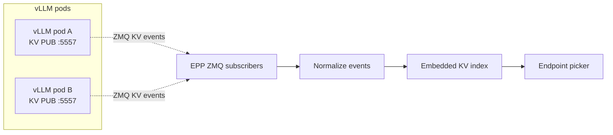

<!--
SPDX-FileCopyrightText: Copyright (c) 2025-2026 NVIDIA CORPORATION & AFFILIATES. All rights reserved.
SPDX-License-Identifier: Apache-2.0
-->

# Dynamo EPP on-ramp for vanilla vLLM

This directory contains raw Kubernetes manifests for running Dynamo's Endpoint Picker Plugin (EPP)
with stock `vllm serve` pods behind Gateway API Inference Extension (GAIE), without installing the
Dynamo operator or Dynamo runtime.

For the user-facing walkthrough, start with
[GAIE Quickstart: Vanilla vLLM On-ramp](../../../../../docs/kubernetes/gateway-api/vanilla-vllm-onramp.mdx).
That page shows the Gateway API, GAIE, agentgateway, Istio, credentials, verification, and cleanup
steps in order.

## Examples

| Manifest | Topology | Notes |
|---|---|---|
| `agg.yaml` | Aggregated | Turnkey on-ramp example. The EPP chooses among stock vLLM pods. |
| `disagg.yaml` | Disaggregated | Experimental. Requires a P/D sidecar image for the decode pods before applying. |

Both manifests are namespace-neutral. Apply them with `kubectl apply -n <namespace> -f ...` after
creating the namespace, Gateway API resources, GAIE CRDs, a Gateway, and any model credentials.

## Images and versions

The Dynamo EPP is packaged in the public Dynamo Frontend image:

```text
nvcr.io/nvidia/ai-dynamo/dynamo-frontend:<dynamo-version>
```

Use an EPP image tag from the same Dynamo release line as any Dynamo runtime images in the same
deployment. These examples currently use `dynamo-frontend:1.3.0-dev.1`, the full-platform preview
tag listed in the [Release Artifacts](../../../../../docs/reference/release-artifacts.md#v130-dev1).

The aggregated on-ramp uses the public `vllm/vllm-openai:latest` image. The disaggregated on-ramp
also needs a P/D sidecar image built from `deploy/inference-gateway/pd-sidecar/` and pushed to a
registry your cluster can pull:

```yaml
image: "<your-registry>/dynamo-pd-sidecar:dev"
```

## How the on-ramp works

In a normal full Dynamo deployment, the Dynamo Frontend performs request routing. In this on-ramp,
the EPP embeds the relevant routing logic so GAIE can ask the EPP to choose an endpoint for an
existing vLLM fleet. The literal switch is set on the EPP container:

```yaml
- name: DYN_EPP_MODE
  value: "router-only"
```

The EPP watches ready vLLM pods with `DYN_EPP_POD_SELECTOR`, subscribes to native vLLM KV cache
events when `DYN_EPP_KV_EVENTS=true`, tokenizes prompts for routing, and returns the selected
endpoint to the gateway.



## What full Dynamo adds

Router-only mode keeps the on-ramp lightweight, but it starts with an empty KV index. It does not
know what prefixes are already cached on existing vLLM pods. Early requests are routed with little
or no cache-awareness, and the index warms only as fresh KV events arrive after startup.

Full Dynamo adds the managed runtime around the same routing goal:

- NATS/JetStream-backed event delivery for routing state.
- Replay after EPP restart or temporary disconnects.
- Gap detection and recovery when events are missed.
- Initial worker cache-state synchronization instead of rebuilding the index from live traffic.
- Operator-managed lifecycle for workers, services, InferencePools, and EPP resources.

Use the
[GAIE Quickstart: Full Dynamo](../../../../../docs/kubernetes/gateway-api/full-dynamo.mdx) when you
need those properties.
