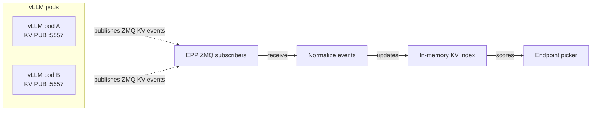

<!--
SPDX-FileCopyrightText: Copyright (c) 2025-2026 NVIDIA CORPORATION & AFFILIATES. All rights reserved.
SPDX-License-Identifier: Apache-2.0
-->

# Dynamo EPP on-ramp for vanilla vLLM

This directory contains raw Kubernetes manifests for an on-ramp that runs Dynamo's
Endpoint Picker Plugin (EPP) behind Gateway API Inference Extension (GAIE) with stock `vLLM serve`
pods. It does not install the Dynamo operator, create a `DynamoGraphDeployment`, or run Dynamo's
NATS/JetStream event plane.

For the user-facing walkthrough, start with
[Vanilla vLLM GAIE On-ramp](../../../../../docs/kubernetes/gateway-api/vanilla-vllm-onramp.mdx).

## How the on-ramp works

This on-ramp is available for Aggregated serving only at this time.

The aggregated on-ramp uses the public `vllm/vllm-openai:latest` image. Replace it with the vLLM
image your platform standardizes on if you need a pinned or internally mirrored image.
KV-aware selection is provided by the runtime-free
[selection service](../../../../../docs/components/router/standalone-selection.md),
which the EPP runs **in-process**: the EPP and the selection service are compiled
into one binary, so there is no separate selector Deployment and no HTTP hop. The
EPP can run single-replica, or **replicated** with cross-replica active-load sync
between EPP pods (see [Replicated mode](../../../../../docs/kubernetes/gateway-api/vanilla-vllm-onramp.mdx#replicated-mode)).

No special EPP image is needed. Use the EPP image provided with Dynamo releases.
Whether EPP uses the Dynamo runtime or not is controlled with the `DYN_EPP_MODE` env var: dynamo vs standalone

```yaml
- name: DYN_EPP_MODE
  value: "standalone"
```

The EPP watches ready vLLM pods in the `InferencePool`, subscribes to native vLLM KV cache
events , tokenizes prompts for routing, and returns the selected
endpoint to the gateway.




## What Dynamo-managed GAIE adds


- Disaggregated prefill/decode (Aggregated  serving is planned follow-up in the standalone mode.)
- Operator-managed lifecycle for Workers, Services, `InferencePool`, and EPP resources.
- Request migration, rejection, cancellation - overall admission control 
- Data parallelism (The standalone mode which targets DP=1.)
- Cross-replica KV-index warm-up when new replica re-warms from live traffic + replay.
- Initial worker cache-state synchronization instead of rebuilding the index only from live traffic.
- Per-tenant KV cache isolation with x-tenant-id / cache_salt. This requires per-engine support and as such is not supported in the Standalone mode.
- Management of Transient disconnects. In the Dynamo mode the KV-cache updates the worker sent during the gap are recovered from the worker's **replay** socket when `DYN_EPP_KV_EVENT_REPLAY_PORT` is set (and the vLLM worker exposes one); otherwise the index refreshes from new traffic.
- Dropped events / gaps management. The `SelectionCore` indexer does seq-watermark gap detection and replays missed events from the worker's replay socket when `DYN_EPP_KV_EVENT_REPLAY_PORT` is configured. Without a replay socket, gaps are dropped and the index re-warms from new traffic.
- Multi-modal support
- Topology / Zone aware routing
- Speculative Decoding awareness 
- Session affinity 
- Full list of OpenAI HTTP endpoints
- Metrics/observability 

## How it works

1. The EPP reads the `InferencePool` it backs to learn the pod
   selector and HTTP target port — the same object the gateway routes to — and
   watches those pods, Ready-filtered.
2. For each Ready pod, the EPP registers a worker into its **in-process**
   selector with the pod's endpoint, block size, and KV-event socket.
3. The selector subscribes directly to each pod's KV-cache event socket and
   maintains the KV index, scheduler, and load accounting.
4. On each request the EPP sends the unchanged body to the configured vLLM
   `/v1/chat/completions/render` endpoint, uses the returned tokens to select a
   currently-Ready worker (booking its load via select-and-reserve), and returns
   the worker's endpoint to Envoy as routing headers. The selected
   worker processes the original forwarded request.

