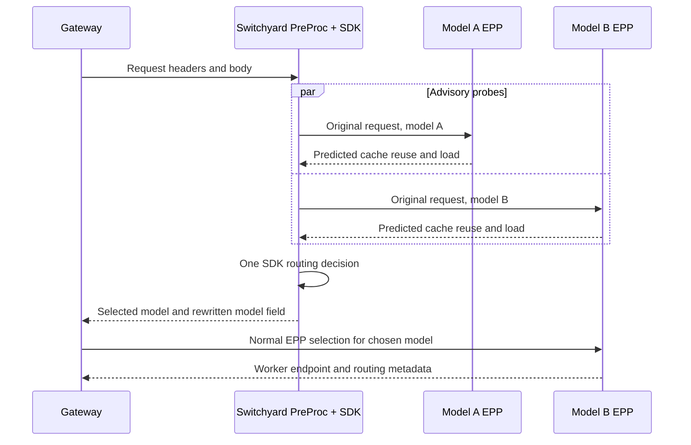

<!--
SPDX-FileCopyrightText: Copyright (c) 2025-2026 NVIDIA CORPORATION & AFFILIATES. All rights reserved.
SPDX-License-Identifier: Apache-2.0
-->

# Routing probe API

A model router can ask each candidate model's EPP how much of a request is likely
cached and how much prefill work its selected worker has. The EPP uses its existing
chat template, tokenizer, cache index and selection service. A probe does not book
capacity, enter the inference admission queue or retain a selection for later use.
The normal ExtProc path still makes the final worker selection.



## Enable

Build `dynamo-ext-proc` from this branch. Set these environment variables on the EPP:

| Variable | Default | Meaning |
| --- | --- | --- |
| `DYN_EPP_PROBE_PORT` | `0` | HTTP port; zero disables the API |
| `DYN_EPP_PROBE_TIMEOUT_MS` | `1000` | Total body-read, preprocessing and selection deadline |
| `DYN_EPP_PROBE_MAX_INFLIGHT` | `4` | Concurrent probes, from 1 through 64 |

Set the port to `9004` and expose it through a private ClusterIP Service. Restrict
that port to the PreProc pods with a NetworkPolicy; this listener has no authentication
and receives prompts. The existing EPP service still serves ExtProc on port 9002.
No new GPU worker, tokenizer process or KV indexer is needed.

The first version supports `DYN_EPP_MODE=dynamo`, aggregated workers with one DP rank,
and a single model per EPP. It accepts text and function-tool history. Standalone EPP,
disaggregated serving, multimodal input, pinned workers, pre-tokenized input, LoRA,
batched generation, cache salts/tenant namespaces and Dynamo session-affinity requests are outside this contract.
Switchyard's session header is only a correlation identity for the probe.

## Request

Send the same Chat Completions JSON that would be dispatched, with the candidate's
concrete model ID. Each EPP renders and tokenizes it for its own model. Keep tools
and template options unchanged. Forward `x-tenant-id` and cache salts too: they must
produce an unsupported response, rather than accidentally querying the unsalted cache.
Worker discovery does not yet advertise namespaced KV-event support, so this version
rejects salted probes. In particular, the existing 1.5.0 SGLang workers did not expose
a reusable prefix for the salted request in local validation.

```bash
curl http://qwen-small-epp:9004/v1/routing/probe \
  -H 'Content-Type: application/json' \
  -H 'X-Request-Id: example-request' \
  -H 'X-Switchyard-Session-Id: example-session' \
  -d '{"model":"Qwen/Qwen3-0.6B","messages":[{"role":"user","content":"Hello"}]}'
```

The body limit is 2 MiB. Compressed bodies are unsupported. Responses use `400` for
invalid JSON/model mismatch, `413` for a body exceeding the limit, `415` for unsupported
content encoding/type, `422` for unsupported input or topology, `429` when probe capacity
is full, `503` when selection is unavailable, and `504` on deadline expiry. Errors have
shape `{"error":{"code":"probe_timeout"}}`. An unavailable estimate is not a cache miss.

## Response

```json
{
  "model": "Qwen/Qwen3-0.6B",
  "epp_instance": "qwen-small-epp-example",
  "sampled_at_unix_ms": 1791584000000,
  "prompt_tokens": 629,
  "block_size": 16,
  "candidate": {
    "worker_id": "779863434991039",
    "dp_rank": 0,
    "cache": {
      "estimate_source": "events",
      "gpu_prefix_tokens": 624,
      "cpu_prefix_tokens": null,
      "disk_prefix_tokens": null,
      "predicted_gpu_hit_rate": 0.9920508744038156,
      "predicted_cpu_inclusive_hit_rate": null,
      "predicted_disk_inclusive_hit_rate": null,
      "effective_prefill_tokens": 5
    },
    "load": {
      "active_prefill_tokens": 0,
      "prefill_token_capacity": 16384,
      "potential_decode_blocks": 40,
      "total_kv_blocks": 10214
    }
  },
  "pool": {"pending_requests": 0, "pending_input_tokens": 0}
}
```

GPU hit rate is `gpu_prefix_tokens / prompt_tokens`. CPU and disk hit rates use their
own cumulative prefix counts divided by the same model's prompt length. Never sum
the tiers. The selector currently collapses a missing lower tier into the preceding
count; this API reports that tier as unknown unless there is a positive extension
proving lower-tier residency. It does not claim that absent CPU/disk telemetry is zero.
Zero denominators and invalid token counts produce unknown rates.

`estimate_source` is `events`, `approximate`, `mixed`, or `unavailable`. These are
predictions from the EPP's view, not observed hits or guarantees. `sampled_at_unix_ms`
is the query time, not the last event time. Index synchronization and event lag can
make predictions incomplete. The worker chosen later may differ from this candidate.

`effective_prefill_tokens` is the selector's work estimate after its reuse weights.
`active_prefill_tokens` is tracked unfinished prefill work; `potential_decode_blocks`
is projected usage including this request. Disabled tracking and unavailable capacities
are null. Pool fields describe pending inference requests, excluding advisory probes.
Load reflects the EPP's tracking and configured synchronization; it is not GPU utilization.

## Compare with response usage

EPP emits an `observed cache reuse` log using response `usage.prompt_tokens` and
`usage.prompt_tokens_details.cached_tokens`. It includes model, selected worker,
request ID and Switchyard session ID. Actual hit rate is `cached_tokens / prompt_tokens`.
Missing usage stays unknown. Streaming clients should request
`stream_options: {"include_usage": true}`.

Switchyard emits `predicted cache reuse` for each probed candidate using the same
request/session IDs. Join by request ID and model, then compare candidate and selected
worker IDs. Do not treat an unselected model's prediction as having an observed outcome.
Prompts are not included in these records.

Prometheus keeps predictions in `dynamo_epp_predicted_cache_hit_rate{model,tier}`.
Actual token counters include only responses with both counts and a valid nonzero
prompt length. Calculate a token-weighted actual rate over a window:

```promql
sum by (model) (rate(dynamo_epp_observed_reuse_tokens_total{kind="cached"}[5m]))
/
sum by (model) (rate(dynamo_epp_observed_reuse_tokens_total{kind="prompt"}[5m]))
```

Leave a zero total denominator as unknown. Do not average request percentages or
use the existing cached-token histogram with an unrelated prompt-token population.
Metrics have only bounded model/tier/kind labels, never request or session IDs.

## Switchyard integration

In [Switchyard PreProc](https://github.com/NVIDIA-NeMo/Switchyard/tree/main/examples/dynamo-preproc),
set `PROBE_CONFIG` to the optional probe TOML. It probes only the configured route's
eligible models before one SDK decision. Observe mode records estimates; routing mode
passes them to the SDK. The `cache_aware` policy selects using estimated prefill work
and configured relative model costs, with the first target as fallback when any required
signal is missing or stale. It does not infer model quality or latency from hit rates.
