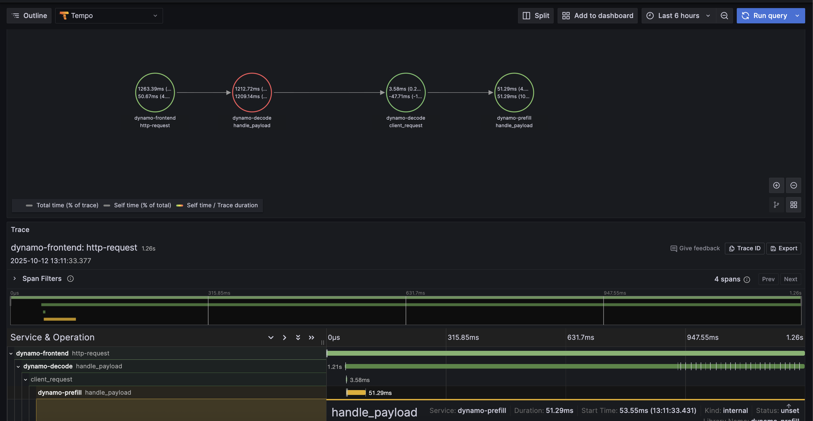

<!--
SPDX-FileCopyrightText: Copyright (c) 2025 NVIDIA CORPORATION & AFFILIATES. All rights reserved.
SPDX-License-Identifier: Apache-2.0
-->

# Distributed Tracing with Tempo

This guide explains how to set up and view distributed traces in Grafana Tempo for Dynamo workloads.

## Overview

Dynamo supports OpenTelemetry-based distributed tracing, allowing you to visualize request flows across Frontend and Worker components. Traces are exported to Tempo via OTLP (OpenTelemetry Protocol) and visualized in Grafana.

## Prerequisites

- Docker and Docker Compose (for local deployment)
- Kubernetes cluster with kubectl access (for Kubernetes deployment)
- Dynamo runtime with tracing support

## Environment Variables

Dynamo's tracing is configured via environment variables. For complete logging documentation, see [docs/observability/logging.md](../../docs/observability/logging.md).

### Required Environment Variables

| Variable | Description | Example Value |
|----------|-------------|---------------|
| `DYN_LOGGING_JSONL` | Enable JSONL logging format (required for tracing) | `true` |
| `OTEL_EXPORT_ENABLED` | Enable OTLP trace export | `1` |
| `OTEL_EXPORT_ENDPOINT` | OTLP gRPC endpoint for Tempo | `http://localhost:4317` (local) or `http://tempo:4317` (docker) |
| `OTEL_SERVICE_NAME` | Service name for identifying components | `dynamo-frontend`, `dynamo-worker-prefill`, `dynamo-worker-decode` |

### Example Configuration

```bash
# Enable JSONL logging and tracing
export DYN_LOGGING_JSONL=true

# Enable trace export to Tempo
export OTEL_EXPORT_ENABLED=1

# Set the Tempo endpoint (docker-compose network)
export OTEL_EXPORT_ENDPOINT=http://tempo:4317

# Set service name to identify this component
export OTEL_SERVICE_NAME=dynamo-frontend
```

---

## Local Deployment with Docker Compose

### 1. Start Tempo and Grafana

From the `deploy/tracing` directory, start the observability stack:

```bash
cd deploy/tracing
docker-compose up -d
```

This will start:
- **Tempo** on `http://localhost:3200` (HTTP API) and `localhost:4317` (OTLP gRPC)
- **Grafana** on `http://localhost:3000` (username: `admin`, password: `admin`)

Verify services are running:

```bash
docker-compose ps
```

### 2. Set Environment Variables

Configure Dynamo components to export traces:

```bash
# Enable JSONL logging and tracing
export DYN_LOGGING_JSONL=true
export OTEL_EXPORT_ENABLED=1
export OTEL_EXPORT_ENDPOINT=http://localhost:4317

# Set service names for each component
export OTEL_SERVICE_NAME=dynamo-frontend
```

### 3. Run vLLM Disaggregated Deployment

Run the vLLM disaggregated script with tracing enabled:

```bash
# Navigate to vLLM launch directory
cd components/backends/vllm/launch

# Run disaggregated deployment (modify the script to export env vars first)
./disagg.sh
```

**Note:** You may need to modify `disagg.sh` to export the tracing environment variables before starting each component:

```bash
#!/bin/bash
set -e
trap 'echo Cleaning up...; kill 0' EXIT

# Enable tracing
export DYN_LOGGING_JSONL=true
export OTEL_EXPORT_ENABLED=1
export OTEL_EXPORT_ENDPOINT=http://localhost:4317

# Run frontend
export OTEL_SERVICE_NAME=dynamo-frontend
python -m dynamo.frontend --router-mode kv --http-port=8000 &

# Run decode worker
export OTEL_SERVICE_NAME=dynamo-worker-decode
CUDA_VISIBLE_DEVICES=0 python3 -m dynamo.vllm --model Qwen/Qwen3-0.6B --enforce-eager &

# Run prefill worker
export OTEL_SERVICE_NAME=dynamo-worker-prefill
CUDA_VISIBLE_DEVICES=1 python3 -m dynamo.vllm \
    --model Qwen/Qwen3-0.6B \
    --enforce-eager \
    --is-prefill-worker &

wait
```

### 4. Generate Traces

Send requests to the frontend to generate traces:

```bash
curl -d '{
  "model": "Qwen/Qwen3-0.6B",
  "max_completion_tokens": 100,
  "messages": [
    {"role": "user", "content": "What is the capital of France?"}
  ]
}' \
-H 'Content-Type: application/json' \
-H 'x-request-id: test-trace-001' \
http://localhost:8000/v1/chat/completions
```

### 5. View Traces in Grafana Tempo

1. Open Grafana at `http://localhost:3000`
2. Login with username `admin` and password `admin`
3. Navigate to **Explore** (compass icon in the left sidebar)
4. Select **Tempo** as the data source (should be selected by default)
5. Use the **Search** tab to find traces:
   - Search by **Service Name** (e.g., `dynamo-frontend`)
   - Search by **Span Name** (e.g., `http-request`, `handle_payload`)
   - Search by **Tags** (e.g., `x_request_id=test-trace-001`)
6. Click on a trace to view the detailed flame graph

#### Example Trace View

Below is an example of what a trace looks like in Grafana Tempo:



### 6. Stop Services

When done, stop the Tempo and Grafana stack:

```bash
cd deploy/tracing
docker-compose down
```

---

## Kubernetes Deployment

For Kubernetes deployments, ensure you have a Tempo instance deployed and accessible (e.g., `http://tempo.observability.svc.cluster.local:4317`).

### Modify DynamoGraphDeployment for Tracing

Add common tracing environment variables at the top level and service-specific names in each component in your `DynamoGraphDeployment` (e.g., `components/backends/vllm/deploy/disagg.yaml`):

```yaml
apiVersion: nvidia.com/v1alpha1
kind: DynamoGraphDeployment
metadata:
  name: vllm-disagg
spec:
  # Common environment variables for all services
  env:
    - name: DYN_LOGGING_JSONL
      value: "true"
    - name: OTEL_EXPORT_ENABLED
      value: "1"
    - name: OTEL_EXPORT_ENDPOINT
      value: "http://tempo.observability.svc.cluster.local:4317"

  services:
    Frontend:
      # ... existing configuration ...
      extraPodSpec:
        mainContainer:
          # ... existing configuration ...
          env:
            - name: OTEL_SERVICE_NAME
              value: "dynamo-frontend"

    VllmDecodeWorker:
      # ... existing configuration ...
      extraPodSpec:
        mainContainer:
          # ... existing configuration ...
          env:
            - name: OTEL_SERVICE_NAME
              value: "dynamo-worker-decode"

    VllmPrefillWorker:
      # ... existing configuration ...
      extraPodSpec:
        mainContainer:
          # ... existing configuration ...
          env:
            - name: OTEL_SERVICE_NAME
              value: "dynamo-worker-prefill"
```

Apply the updated DynamoGraphDeployment:

```bash
kubectl apply -f components/backends/vllm/deploy/disagg.yaml
```

Traces will now be exported to Tempo and can be viewed in Grafana.

