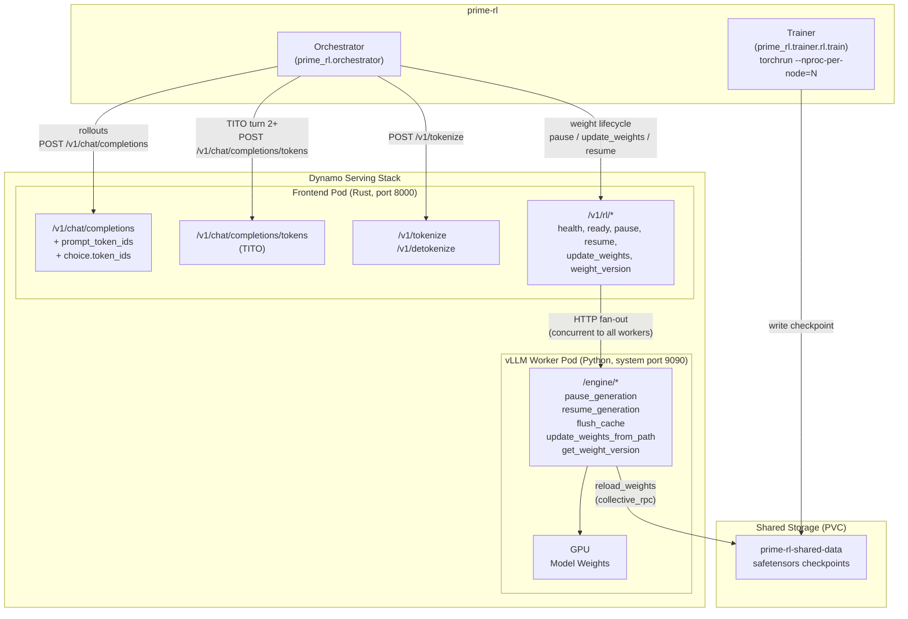
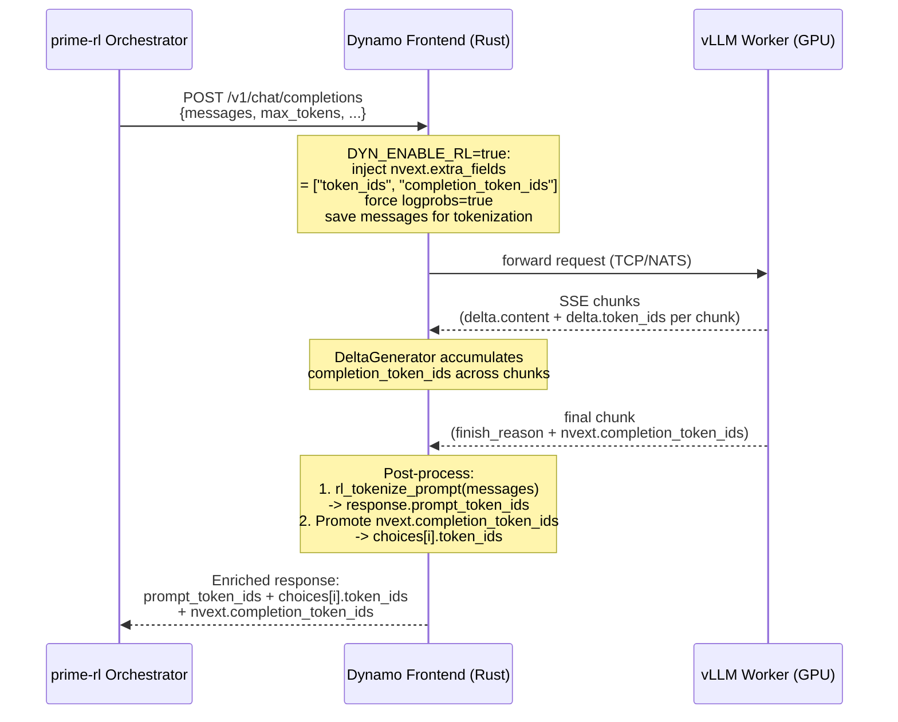
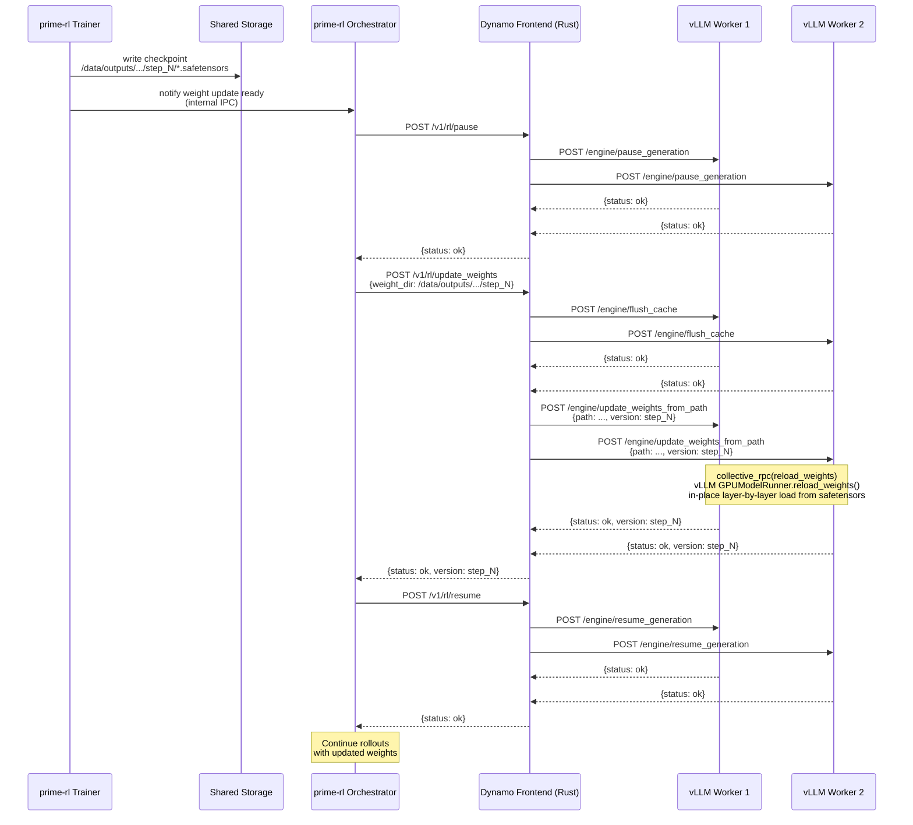
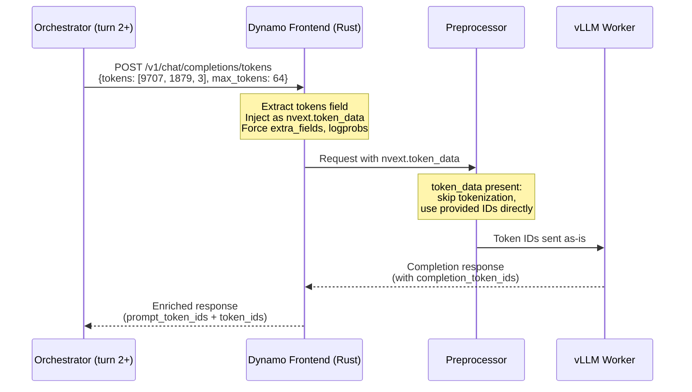

# Dynamo RL API Draft

**Branch:** `bis/parity-tokenize-tcp` (HEAD: `19d1bf13d`)

---

## Table of Contents

1. [Overview](#1-overview)
2. [Architecture](#2-architecture)
3. [Configuration](#3-configuration)
4. [API Reference](#4-api-reference)
   - 4.1 Chat Completions (RL-enhanced)
   - 4.2 Token-In / Token-Out (TITO)
   - 4.3 Tokenization
   - 4.4 Fleet Control (`/v1/rl/*`)
5. [Data Flow](#5-data-flow)
6. [Key Data Structures](#6-key-data-structures)
7. [Worker Engine Routes (Internal)](#7-worker-engine-routes-internal)
8. [Known Limitations](#8-known-limitations)
9. [Validation Results](#9-validation-results)

---

## 1. Overview

This document describes the RL training API surface on the Dynamo serving stack for integration
with prime-rl. The Dynamo frontend (Rust) exposes:

- An `/v1/rl/*` router for the full RL control-plane lifecycle (pause/resume, weight updates,
  readiness checks)
- Automatic token-level data injection (`prompt_token_ids`, `completion_token_ids`) in chat
  completion responses
- `/v1/tokenize` and `/v1/detokenize` endpoints
- A `/v1/chat/completions/tokens` TITO endpoint for pre-tokenized prompt bypass

Zero Python in the inference or admin data path. The Rust frontend handles all HTTP API surface
while vLLM workers expose engine routes for weight lifecycle operations on the GPU.

### Endpoint Summary

| Capability | Endpoint | Purpose |
|------------|----------|---------|
| Inference | `POST /v1/chat/completions` | Generate rollouts; responses include `prompt_token_ids` + `choice.token_ids` |
| TITO inference | `POST /v1/chat/completions/tokens` | Pre-tokenized prompt bypass (turn 2+ in multi-turn RL) |
| Tokenization | `POST /v1/tokenize` | Consistent tokenization using the model's chat template |
| Detokenization | `POST /v1/detokenize` | Token IDs back to text |
| Pause fleet | `POST /v1/rl/pause` | Drain in-flight requests before weight update |
| Resume fleet | `POST /v1/rl/resume` | Resume generation after weight update |
| Update weights | `POST /v1/rl/update_weights` | Atomic flush + reload from checkpoint directory |
| Weight version | `GET /v1/rl/weight_version` | Query current weight version across workers |
| Health | `GET /v1/rl/health` | Lightweight frontend health check |
| Readiness | `GET /v1/rl/ready` | Deep check: are workers reachable and healthy? |

### What Changed vs. Stock Dynamo

All changes are on `bis/parity-tokenize-tcp` (12 commits, 25 files, +1725/-40). Nothing touches
Dynamo's core serving pipeline (NATS, scheduler, KV cache, disaggregation). The changes are
additive:

- **Rust frontend** (`lib/llm/`): New routes, response post-processing, tokenization endpoints
- **vLLM worker** (`components/`): 5 engine route handlers, publisher crash guard

---

## 2. Architecture

### Component Topology



### Key Design Decisions

1. **Single entry point.** Prime-RL points both `base_url` and `admin_base_url` at the Dynamo
   frontend. No separate admin service to deploy.

2. **Fan-out in Rust.** The `/v1/rl/*` handlers fan out to all vLLM workers via
   `DYN_RL_WORKER_SYSTEM_URLS`. This supports DP>1 without Prime-RL needing to discover workers.
   The frontend returns HTTP 200 only when all workers respond OK, and HTTP 502 otherwise with
   per-worker details.

3. **Token IDs as a response extension.** When `DYN_ENABLE_RL=true`, `prompt_token_ids` and
   `choices[i].token_ids` are injected into every non-streaming response automatically. No
   client-side configuration needed.

4. **Backward compatible.** All new response fields use
   `#[serde(skip_serializing_if = "Option::is_none")]`. Clients that don't set `DYN_ENABLE_RL`
   see standard OpenAI-compatible responses with no extra fields.

---

## 3. Configuration

### Environment Variables (Frontend)

| Variable | Default | Description |
|----------|---------|-------------|
| `DYN_ENABLE_RL` | `false` | Master switch. Mounts `/v1/rl/*` routes, auto-injects token IDs in chat completion responses, mounts TITO endpoint. |
| `DYN_RL_WORKER_SYSTEM_URLS` | `http://localhost:8081` | Comma-separated list of vLLM worker system HTTP base URLs for fan-out. |

### Environment Variables (Worker)

| Variable | Default | Description |
|----------|---------|-------------|
| `DYN_SYSTEM_PORT` | `8081` (local) / `9090` (k8s) | Worker's system HTTP port where engine routes are registered. |

### Prime-RL Configuration (`orch.toml`)

```toml
max_steps = 20
seq_len = 512
batch_size = 16
rollouts_per_example = 4
use_token_client = false

[model]
name = "PrimeIntellect/Qwen3-0.6B-Reverse-Text-SFT"

[sampling]
max_tokens = 64

[[env]]
id = "reverse-text"

[client]
# Point BOTH base_url and admin_base_url at the Dynamo frontend.
# admin_base_url uses /v1/rl because Prime-RL strips trailing /v1
# from admin URLs, but /v1/rl is preserved.
base_url       = ["http://<frontend>:8000/v1"]
admin_base_url = ["http://<frontend>:8000/v1/rl"]
skip_model_check = true

[weight_broadcast]
type = "filesystem"

[experimental]
# Disable prefix cache salt until Dynamo supports it.
# verifiers dev6+ defaults use_prefix_cache_salt=True; current image returns 400.
use_prefix_cache_salt = false
```

**Important:** Do NOT set `send_return_token_ids = true` in `[sampling]`. The Rust frontend
handles token ID injection automatically when `DYN_ENABLE_RL=true`. Sending `return_token_ids=true`
in the request causes the OpenAI SDK to parse the response and strip unknown fields.

### Kubernetes (DGD)

```yaml
# Frontend pod env
- name: DYN_ENABLE_RL
  value: "true"
- name: DYN_RL_WORKER_SYSTEM_URLS
  value: "http://prime-rl-dynamo-vllmworker.<namespace>.svc.cluster.local:9090"
```

### Launch Commands (Local)

```bash
# Frontend with RL routes enabled
DYN_ENABLE_RL=true \
DYN_RL_WORKER_SYSTEM_URLS=http://localhost:8081 \
  python -m dynamo.frontend

# vLLM Worker
CUDA_VISIBLE_DEVICES=0 \
DYN_SYSTEM_PORT=8081 \
  python -m dynamo.vllm \
  --model PrimeIntellect/Qwen3-0.6B-Reverse-Text-SFT \
  --served-model-name PrimeIntellect/Qwen3-0.6B-Reverse-Text-SFT \
  --enforce-eager \
  --max-model-len 2048 \
  --gpu-memory-utilization 0.5
```

---

## 4. API Reference

All endpoints live on the Dynamo Rust frontend (default port 8000). Unless noted,
request/response formats follow the OpenAI API specification.

### 4.1 Chat Completions (RL-enhanced)

```
POST /v1/chat/completions
```

Standard OpenAI chat completions with RL extensions. When `DYN_ENABLE_RL=true`, every
non-streaming response is automatically enriched with token IDs for the trainer.

#### Request

Standard OpenAI `ChatCompletionRequest`. Two additional fields are accepted and silently consumed
(never forwarded to the vLLM worker):

| Field | Type | Default | Mapped to |
|-------|------|---------|-----------|
| `tokens` | `u32[]` | `null` | `nvext.token_data` (tokenizer bypass) |
| `return_token_ids` | `bool` | `null` | `nvext.extra_fields: ["token_ids", "completion_token_ids"]` + `logprobs: true` |

When `DYN_ENABLE_RL=true`, `return_token_ids` is implicitly `true` for every request.

#### Sample Request

```bash
curl -s -X POST http://localhost:8000/v1/chat/completions \
  -H 'Content-Type: application/json' \
  -d '{
    "model": "PrimeIntellect/Qwen3-0.6B-Reverse-Text-SFT",
    "messages": [
      {"role": "user", "content": "Reverse this: hello world"}
    ],
    "max_tokens": 64,
    "temperature": 1.0
  }'
```

#### Sample Response (Non-Streaming, with `DYN_ENABLE_RL=true`)

```json
{
  "id": "chatcmpl-abc123",
  "object": "chat.completion",
  "model": "PrimeIntellect/Qwen3-0.6B-Reverse-Text-SFT",
  "choices": [{
    "index": 0,
    "message": {"role": "assistant", "content": "dlrow olleh"},
    "finish_reason": "stop",
    "logprobs": {
      "content": [
        {"token": "dl", "logprob": -0.523, "top_logprobs": []},
        {"token": "row", "logprob": -0.102, "top_logprobs": []},
        {"token": " ol", "logprob": -0.834, "top_logprobs": []},
        {"token": "leh", "logprob": -0.211, "top_logprobs": []}
      ]
    },
    "token_ids": [67, 1245, 893, 15]
  }],
  "prompt_token_ids": [151644, 8948, 198, 151645, 198, 151644, 872, 198,
                        49, 1075, 513, 420, 25, 24748, 1879, 198, 151645,
                        198, 151644, 77091, 198],
  "usage": {"prompt_tokens": 21, "completion_tokens": 4, "total_tokens": 25},
  "nvext": {
    "completion_token_ids": [67, 1245, 893, 15]
  }
}
```

#### Response Field Reference

| Field | JSON path | Description |
|-------|-----------|-------------|
| `prompt_token_ids` | `response.prompt_token_ids` | Token IDs from tokenizing the prompt messages through the model's chat template. Generated by the Rust frontend's tokenizer after the response is fully received. |
| `token_ids` | `response.choices[i].token_ids` | Completion token IDs generated by the engine. Promoted from `nvext.completion_token_ids`. |
| `completion_token_ids` | `response.nvext.completion_token_ids` | Canonical Dynamo location for output token IDs. Accumulated across all SSE chunks by `DeltaGenerator`. |

**Why `token_ids` appears in two locations:** Prime-RL's verifiers library reads
`response.prompt_token_ids` and `choices[i].token_ids` (top-level on the choice object). Dynamo
natively emits output token IDs in `nvext.completion_token_ids`. The Rust post-processor promotes
the latter to the former for compatibility. Both contain the same values.

**Invariant:** `len(completion_token_ids) == len(logprobs.content)` -- the output token IDs are in
exact 1:1 correspondence with the logprob entries.

#### Sample Response (Streaming / SSE -- final chunk only)

Intermediate chunks carry `delta.content` only. Token IDs appear exclusively on the
**final chunk** (the one with a non-null `finish_reason`):

```
data: {"id":"chatcmpl-abc123","object":"chat.completion.chunk",
       "choices":[{"index":0,"delta":{},"finish_reason":"stop",
       "nvext":{"completion_token_ids":[67,1245,893,15]}}],
       "prompt_token_ids":[151644,8948,198,151645,198,151644,872,198,
                           49,1075,513,420,25,24748,1879,198,151645,
                           198,151644,77091,198]}

data: [DONE]
```

#### RL Post-Processing Pipeline

For non-streaming requests, the handler performs the following after the backend response is
fully aggregated:

```mermaid
flowchart LR
    A["Request arrives<br/>DYN_ENABLE_RL=true"] --> B["Save messages<br/>for later tokenization"]
    B --> C["Inject nvext.extra_fields:<br/>[token_ids, completion_token_ids]<br/>Force logprobs=true"]
    C --> D["Standard pipeline<br/>(preprocessor, backend,<br/>delta generator, aggregator)"]
    D --> E["Aggregate response<br/>(nvext.completion_token_ids<br/>accumulated in delta.rs)"]
    E --> F["rl_tokenize_prompt()<br/>messages -> prompt_token_ids<br/>via model chat template"]
    F --> G["rl_promote_token_ids()<br/>nvext.completion_token_ids<br/>-> choices[i].token_ids"]
    G --> H["Return enriched<br/>JSON response"]
```



---

### 4.2 Token-In / Token-Out (TITO)

```
POST /v1/chat/completions/tokens
```

Dedicated endpoint for Prime-RL's pre-tokenized prompt flow (multi-turn RL, turn 2+). The
orchestrator sends raw token IDs instead of text messages, bypassing the frontend's tokenizer
entirely. This avoids redundant encode/decode round-trips and ensures token-level alignment.

#### Sample Request

```bash
curl -s -X POST http://localhost:8000/v1/chat/completions/tokens \
  -H 'Content-Type: application/json' \
  -d '{
    "model": "PrimeIntellect/Qwen3-0.6B-Reverse-Text-SFT",
    "messages": [{"role": "user", "content": "(token-in mode)"}],
    "tokens": [151644, 8948, 198, 151645, 198, 151644, 872, 198,
               49, 1075, 513, 420, 25, 24748, 1879, 198, 151645,
               198, 151644, 77091, 198, 67, 1245, 893, 15],
    "max_tokens": 64
  }'
```

| Field | Required | Description |
|-------|----------|-------------|
| `tokens` | **Yes** | Pre-tokenized prompt IDs. Must be non-empty. Injected as `nvext.token_data`. |
| `messages` | Yes (can be placeholder) | A placeholder `{"role": "user", "content": "(token-in mode)"}` is auto-injected if empty. |

#### Behavior

1. Extracts `tokens`, returns 400 if missing or empty
2. Injects into `nvext.token_data` (triggers tokenizer bypass in `preprocessor.rs`)
3. Adds `extra_fields: ["token_ids", "completion_token_ids"]`
4. Forces `logprobs = true`
5. Delegates to the standard `chat_completions()` pipeline (zero HTTP proxy)

#### Sample Response

Same shape as section 4.1. The response includes `prompt_token_ids` and `choices[i].token_ids`.

---

### 4.3 Tokenization

```
POST /v1/tokenize
POST /v1/detokenize
```

Consistent tokenization using the model's tokenizer and chat template, running entirely in Rust.
These are critical for RL: prompt token IDs in the chat completion response must match what the
tokenizer produces for the same messages. Both endpoints use the same tokenizer instance that the
frontend uses for its own request preprocessing.

#### Sample: Tokenize (Chat variant)

```bash
curl -s -X POST http://localhost:8000/v1/tokenize \
  -H 'Content-Type: application/json' \
  -d '{
    "model": "PrimeIntellect/Qwen3-0.6B-Reverse-Text-SFT",
    "messages": [
      {"role": "user", "content": "Reverse this: hello world"}
    ],
    "add_generation_prompt": true,
    "add_special_tokens": true
  }'
```

**Response:**

```json
{
  "count": 21,
  "max_model_len": 2048,
  "tokens": [151644, 8948, 198, 151645, 198, 151644, 872, 198,
             49, 1075, 513, 420, 25, 24748, 1879, 198, 151645,
             198, 151644, 77091, 198],
  "token_strs": null
}
```

#### Tokenize Request Fields (Chat variant)

| Field | Type | Default | Description |
|-------|------|---------|-------------|
| `model` | `string?` | auto-resolve | Model name for tokenizer lookup |
| `messages` | `ChatMessage[]` | -- | Messages to tokenize through the model's chat template |
| `add_generation_prompt` | `bool` | `true` | Append generation prompt (e.g., `<\|im_start\|>assistant\n`) |
| `add_special_tokens` | `bool` | `true` | Add BOS/EOS tokens |
| `return_token_strs` | `bool` | `false` | Include human-readable string representation of each token |
| `chat_template` | `string?` | `null` | Override the model's default chat template (Jinja2) |
| `chat_template_kwargs` | `object?` | `null` | Extra template variables |
| `continue_final_message` | `bool` | `false` | Continue last message instead of starting a new turn |

The chat variant renders messages through the model's chat template before tokenizing, so the
token count is the exact number of tokens that a corresponding chat completion request would
consume.

#### Sample: Tokenize (Completion variant)

```bash
curl -s -X POST http://localhost:8000/v1/tokenize \
  -H 'Content-Type: application/json' \
  -d '{
    "model": "PrimeIntellect/Qwen3-0.6B-Reverse-Text-SFT",
    "prompt": "hello world",
    "add_special_tokens": true,
    "return_token_strs": true
  }'
```

**Response:**

```json
{
  "count": 3,
  "max_model_len": 2048,
  "tokens": [9707, 1879, 3],
  "token_strs": ["hello", " world", ""]
}
```

#### Tokenize Response Fields

| Field | Type | Description |
|-------|------|-------------|
| `count` | `int` | Number of tokens |
| `max_model_len` | `int` | Model's configured maximum context length |
| `tokens` | `list[int]` | Token ID list |
| `token_strs` | `list[str]?` | Human-readable token strings; only present if `return_token_strs: true` |

#### Sample: Detokenize

```bash
curl -s -X POST http://localhost:8000/v1/detokenize \
  -H 'Content-Type: application/json' \
  -d '{
    "model": "PrimeIntellect/Qwen3-0.6B-Reverse-Text-SFT",
    "tokens": [9707, 1879, 3]
  }'
```

**Response:**

```json
{"prompt": "hello world"}
```

---

### 4.4 Fleet Control (`/v1/rl/*`)

All `/v1/rl/*` routes are mounted only when `DYN_ENABLE_RL=true`. They fan out to vLLM worker
system ports defined by `DYN_RL_WORKER_SYSTEM_URLS`.

In prime-rl's config:

```toml
[client]
base_url       = ["http://<frontend>:8000/v1"]
admin_base_url = ["http://<frontend>:8000/v1/rl"]
```

---

#### `GET /v1/rl/health`

Lightweight liveness probe. Returns immediately as long as the frontend process is running.
Used by prime-rl's `check_health()` on the admin client.

```bash
curl -s http://localhost:8000/v1/rl/health
```

```json
{"status": "ok"}
```

---

#### `GET /v1/rl/ready`

Composite readiness probe. Polls `/health` on every configured worker system URL concurrently.
Returns 200 only when all workers respond with HTTP 2xx.

```bash
curl -s http://localhost:8000/v1/rl/ready
```

```json
// All workers ready (200)
{
  "status": "ready",
  "workers": [
    {"url": "http://localhost:8081", "healthy": true}
  ]
}

// Not all workers ready (503)
{
  "status": "not_ready",
  "workers_ready": 0,
  "workers_total": 1,
  "workers": [
    {"url": "http://localhost:8081", "healthy": false, "error": "connection refused"}
  ]
}
```

---

#### `POST /v1/rl/pause`

Quiesces generation on all workers. Each worker calls `engine_client.pause_generation()` which
drains in-flight requests without unloading the model from GPU memory.

```bash
curl -s -X POST http://localhost:8000/v1/rl/pause -H 'Content-Type: application/json' -d '{}'
```

```json
// Success (200)
{
  "status": "ok",
  "workers": [
    {"status": "ok", "message": "Engine paused"}
  ]
}

// Failure (502)
{
  "status": "error",
  "workers": [
    {"status": "ok",    "message": "Engine paused"},
    {"status": "error", "message": "timeout"}
  ]
}
```

---

#### `POST /v1/rl/resume`

Resumes generation on all workers after a weight update.

```bash
curl -s -X POST http://localhost:8000/v1/rl/resume -H 'Content-Type: application/json' -d '{}'
```

```json
{
  "status": "ok",
  "workers": [
    {"status": "ok", "message": "Engine resumed"}
  ]
}
```

---

#### `POST /v1/rl/update_weights`

Atomic weight-loading sequence: `flush_cache` then `update_weights_from_path` on all workers
concurrently. The frontend performs the two-phase fan-out internally; prime-rl does not need to
call these separately.

For filesystem-backed weight broadcast, the trainer writes safetensors files to a shared PVC
directory and passes that path here. The worker calls
`engine_client.collective_rpc("reload_weights", kwargs={"weights_path": path})` which triggers
vLLM's layerwise in-place weight reload on every GPU worker.

For NCCL-based weight broadcast (`weight_dir: null`), Dynamo returns 200 immediately -- the
actual weight transfer happens out-of-band via NCCL and Dynamo does not participate.

```bash
# Filesystem mode
curl -s -X POST http://localhost:8000/v1/rl/update_weights \
  -H 'Content-Type: application/json' \
  -d '{"weight_dir": "/data/outputs/run_default/broadcasts/step_5"}'

# NCCL mode (Dynamo no-op)
curl -s -X POST http://localhost:8000/v1/rl/update_weights \
  -H 'Content-Type: application/json' \
  -d '{"weight_dir": null}'
```

```json
// Success (200)
{
  "status": "ok",
  "version": "step_5",
  "workers": [
    {"status": "ok", "message": "Weights loaded from /data/outputs/...", "version": "step_5"}
  ]
}

// Failure at flush_cache stage (502)
{
  "status": "error",
  "stage": "flush_cache",
  "workers": [...]
}

// Failure at update_weights stage (502)
{
  "status": "error",
  "stage": "update_weights_from_path",
  "workers": [...]
}
```

The `version` string is derived from the basename of `weight_dir` (e.g., `step_5` from
`/data/outputs/run_default/broadcasts/step_5`). This version is stored in the worker and
retrievable via `/v1/rl/weight_version`.

---

#### `GET /v1/rl/weight_version`

Returns the currently loaded weight version from all workers. Useful for debugging weight update
races or confirming that all workers converged to the same checkpoint.

```bash
curl -s http://localhost:8000/v1/rl/weight_version
```

```json
// All workers consistent (200)
{
  "status": "ok",
  "version": "step_5",
  "workers": [
    {"version": "step_5"},
    {"version": "step_5"}
  ]
}

// Workers inconsistent (200, with warning)
{
  "status": "inconsistent",
  "versions": ["step_4", "step_5"],
  "workers": [
    {"version": "step_4"},
    {"version": "step_5"}
  ]
}
```

Returns HTTP 200 even when versions are inconsistent -- the `status` field distinguishes the
cases. A 502 is only returned for network-level failures.

---

## 5. Data Flow

### 5.1 Rollout (Inference) Path



### 5.2 Weight Update Path



### 5.3 TITO (Tokens-In, Tokens-Out) Path



---

## 6. Key Data Structures

### `NvExtResponse` (Rust -- response side)

Serialized as the `nvext` field in each SSE chunk or the unary response body:

```
NvExtResponse {
  worker_id?:             WorkerIdInfo      -- prefill/decode worker IDs for disaggregated serving
  timing?:                TimingInfo        -- request timing (enabled via extra_fields: ["timing"])
  token_ids?:             Vec<u32>          -- GAIE Stage 1: tokenized prompt for Stage 2 reuse
  routed_experts?:        serde_json::Value -- SGLang-specific expert routing payload
  completion_token_ids?:  Vec<u32>          -- RL: generated output token IDs (final chunk only)
}
```

The `completion_token_ids` field is populated:
- Automatically for all requests when `DYN_ENABLE_RL=true`
- Otherwise when the client sends `nvext.extra_fields: ["completion_token_ids"]`

### `NvCreateChatCompletionRequest` (Rust -- request side)

New fields relevant to RL:

| Field | Serialized | Description |
|-------|-----------|-------------|
| `tokens` | No (`skip_serializing`) | Pre-tokenized prompt token IDs (TITO path via `/v1/chat/completions/tokens`) |
| `return_token_ids` | No (`skip_serializing`) | prime-rl compat field; accepted but ignored on the standard endpoint -- use `DYN_ENABLE_RL` or `nvext.extra_fields` instead |

Both fields are stripped before the request is forwarded to the vLLM worker, preventing 400
errors from the vLLM OpenAI-compatible API.

### `NvCreateChatCompletionResponse` (Rust -- response side)

```
NvCreateChatCompletionResponse {
  inner:             CreateChatCompletionResponse   -- standard OpenAI response fields
  nvext?:            serde_json::Value              -- NvExtResponse serialized as JSON
  prompt_token_ids?: Vec<u32>                       -- RL: tokenized prompt IDs (DYN_ENABLE_RL only)
}
```

### `DeltaGenerator` (Rust -- streaming pipeline)

Manages per-request streaming state. Accumulates output token IDs across chunks:

```
DeltaGenerator {
  ...
  accumulated_completion_token_ids: Vec<u32>   -- grows per chunk
}
```

- **Activation:** `options.enable_completion_token_ids` is set to `true` when
  `extra_fields` includes `"completion_token_ids"` (auto-set when `DYN_ENABLE_RL=true`).
- **Accumulation:** On each postprocessor output chunk, appends `delta.token_ids` to the
  accumulator.
- **Emission:** On the final chunk (`finish_reason` is set), the full list is emitted in
  `nvext.completion_token_ids` and the accumulator is cleared.

### `NvExt` (Rust -- request-side NVIDIA extensions)

Relevant fields for RL:

```
NvExt {
  token_data?:           Vec<u32>       -- Pre-tokenized prompt IDs (TITO / EPP bypass)
  extra_fields?:         Vec<String>    -- Request extra response fields, e.g. ["completion_token_ids"]
  backend_instance_id?:  u64            -- Targeted routing to a specific worker
  ...
}
```

### Tokenization Types

```
TokenizeRequest = Completion { prompt, model?, add_special_tokens? }
               | Chat { messages, model?, add_generation_prompt?, chat_template?, ... }

TokenizeResponse { count: int, max_model_len: int, tokens: Vec<u32>, token_strs?: Vec<String> }

DetokenizeRequest { model?: String, tokens: Vec<u32> }
DetokenizeResponse { prompt: String }
```

### Post-Processing Helpers

**`rl_tokenize_prompt(state, model, messages) -> Option<Vec<u32>>`**

Tokenizes the original prompt messages using the model's chat template and tokenizer:

1. Resolves model card from `state`
2. Gets the tokenizer instance from the model card
3. Builds a `PromptFormatter` from the model deployment card
4. Renders messages through the chat template (same logic as the preprocessor)
5. Tokenizes the rendered string
6. Returns the token IDs

**`rl_promote_token_ids_in_response(json_val)`**

Copies `response.nvext.completion_token_ids` to `response.choices[i].token_ids` for each choice.
Bridges Dynamo's `nvext` convention with the field paths that Prime-RL/verifiers expects.

---

## 7. Worker Engine Routes (Internal)

Five engine route handlers are registered on each vLLM worker's system HTTP port (default
`8081` local / `9090` in k8s). These are **internal** routes called by the Rust frontend's
`/v1/rl/*` handlers -- not called directly by Prime-RL.

| Route | Method | vLLM API called | Description |
|-------|--------|-----------------|-------------|
| `/engine/pause_generation` | POST | `engine_client.pause_generation()` | Drain in-flight requests, keep model loaded in GPU memory |
| `/engine/resume_generation` | POST | `engine_client.resume_generation()` | Resume accepting inference requests |
| `/engine/flush_cache` | POST | `engine_client.reset_prefix_cache()` | Invalidate prefix/KV cache (required before weight reload) |
| `/engine/update_weights_from_path` | POST | `engine_client.collective_rpc("reload_weights", ...)` | Load weights from filesystem (safetensors checkpoint) |
| `/engine/get_weight_version` | POST | `self._weight_version` | Return current weight version string |

Both decode and prefill worker types register all 5 routes. Route signatures are compatible with
SGLang's merged `#6094` routes for backend interoperability.

### Registration (worker_factory.py)

```python
runtime.register_engine_route("pause_generation", handler.pause_generation)
runtime.register_engine_route("resume_generation", handler.resume_generation)
runtime.register_engine_route("flush_cache", handler.flush_cache)
runtime.register_engine_route("update_weights_from_path", handler.update_weights_from_path)
runtime.register_engine_route("get_weight_version", handler.get_weight_version)
```

### publisher.py Crash Guard

The `DynamoStatLoggerPublisher.record()` method includes a guard for `scheduler_stats is None`.
This prevents an `AttributeError` crash during the transient window right after a weight reload
when the vLLM engine's stats logger fires before the engine core has re-initialized its scheduler
stats.

---

## 8. Known Limitations

| Limitation | Workaround | Notes |
|-----------|-----------|-------|
| `cache_salt` not supported -- returns 400 for requests with `cache_salt` in body | Set `[experimental] use_prefix_cache_salt = false` in prime-rl `orch.toml` | verifiers dev6+ defaults `use_prefix_cache_salt=True` |
| `prompt_token_ids` only injected for non-streaming responses | Use non-streaming mode for RL rollouts (the default) | Streaming final-chunk injection is planned |
| Weight version `"initial"` before first update | Do not depend on version string for correctness; use `/v1/rl/ready` for readiness | |
| NCCL weight broadcast is a no-op on Dynamo side | Use `type = "filesystem"` in `[weight_broadcast]` for all current deployments | |
| `VLLM_USE_V1=0` required | Set `VLLM_USE_V1=0` in worker env | vLLM V1 engine + CUDA 13.0 has Meta tensor crashes with `--enforce-eager` |
| Filesystem weight broadcast scales poorly for large models | Acceptable for 0.6B (257ms load); marginal at 7B (~25s); impractical at 70B (~5 min) | RDMA pull transfer planned |

---

## 9. Validation Results

### Local (2x A6000, Qwen3-0.6B-Reverse-Text-SFT, 20 steps)

| Metric | vLLM Baseline | Dynamo | Delta |
|--------|:-------------:|:------:|:-----:|
| Steps completed | 20/20 | 20/20 | -- |
| Peak reward | 0.798 | **0.825** | +3.4% |
| Final reward | 0.716 | **0.724** | +1.2% |
| `is_masked/mean` | 1.2% | **0.13%** | -92% (better) |
| Mismatch KL (final) | 0.0075 | **0.0056** | -25% (better) |
| Weight update cycles | 19 | 19 | -- |
| Mean weight cycle time | -- | 257.5ms | pause: 3.2ms, load: 249ms, resume: 4.8ms |

W&B: https://wandb.ai/test232/prime-rl-parity-apr17

### Kubernetes (GB200, same model, 20 steps)

| Metric | K8s |
|--------|:---:|
| Steps completed | 20/20 |
| Reward at step 13 | 0.714 (climbing) |
| Mismatch KL (steps 0-3) | 0.0007 - 0.0009 |
| Pods | 4 |
| All RL routes verified | Yes |

The Rust RL API produces **better token alignment than native vLLM** (0.13% masked vs 1.2%).
