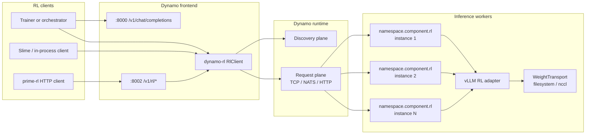
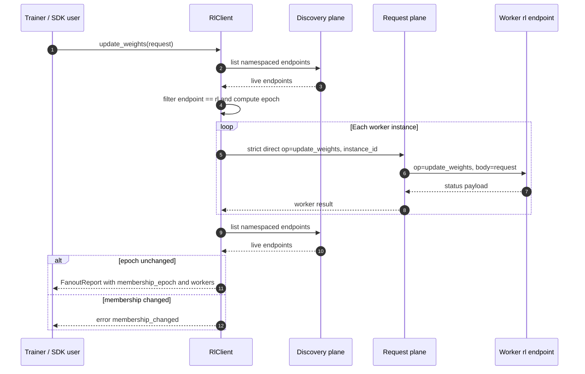
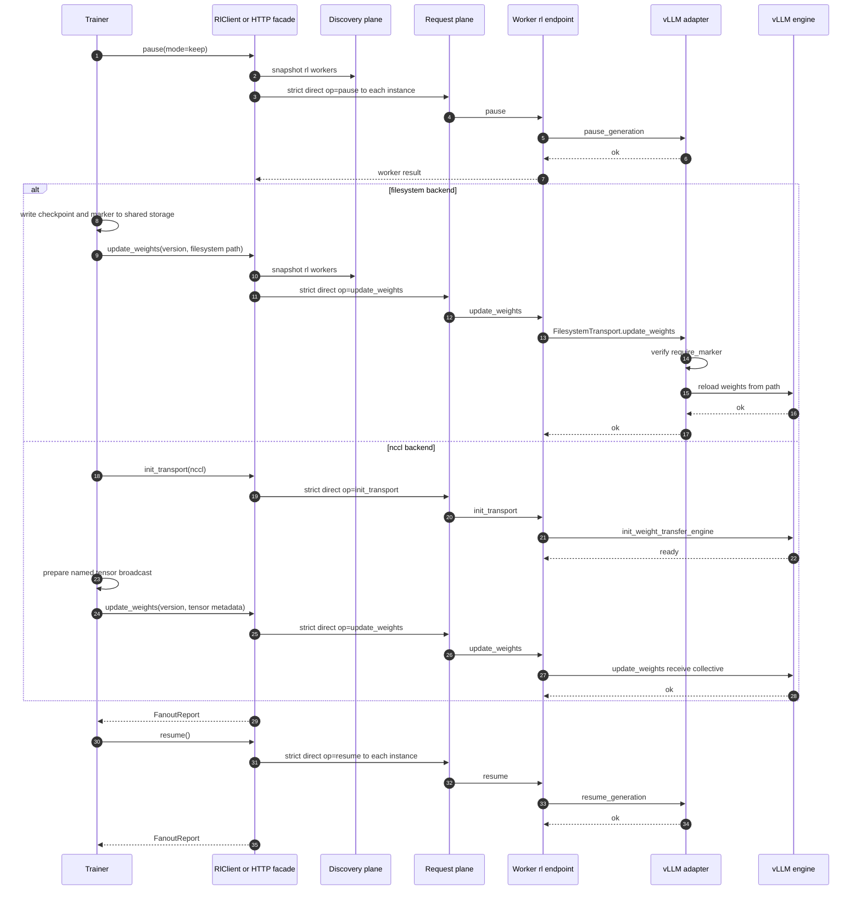

# Dynamo RL

Dynamo RL support has two separate surfaces:

1. The inference surface on the normal OpenAI listener, usually
   `:8000 /v1/chat/completions`. This carries rollout-time extensions such as
   token-in/token-out, cache salt, and weight version metadata.
2. The admin surface for pause, resume, transport setup, and weight updates.
   The canonical implementation is the `dynamo-rl` SDK. The optional HTTP
   facade exposes the same operations at `:8002 /v1/rl/*` by default.

The admin surface does not fan out through worker system ports. Workers are
ephemeral, so the SDK snapshots the discovery plane, finds live worker
endpoints named `rl`, and dispatches strict direct calls through Dynamo's
request plane. The request plane may be TCP, NATS, or HTTP depending on the
deployment.

## Architecture



System ports remain useful for process health, metrics, and debugging, but
they are not the RL worker fan-out contract. There is no
`DYN_RL_WORKER_SYSTEM_URLS` static worker list.

## Enablement

Frontend configuration:

| Setting | Default | Purpose |
|---|---:|---|
| `DYN_ENABLE_RL` | `false` | Enables inference-plane RL extensions on `/v1/chat/completions`, including automatic token-id return on unary chat responses. |
| `DYN_ENABLE_RL_ENDPOINTS` | `false` | Enables the optional admin HTTP facade. |
| `DYN_RL_PORT` or `--rl-port` | `8002` | Dedicated listener for `/v1/rl/*`; routes are not mounted on the main `:8000` listener. |
| `DYN_NAMESPACE` | `dynamo` | Namespace scanned by the RL SDK. |
| `DYN_RL_COMPONENT` | unset | Optional component filter. When unset, all live endpoints named `rl` in the namespace are targeted. |
| `DYN_REQUEST_PLANE` | deployment-specific | Selects the request-plane transport, for example TCP, NATS, or HTTP. |
| `DYN_DISCOVERY_BACKEND` | deployment-specific | Selects the discovery backend, for example etcd, Kubernetes, file, or memory. |

Example trainer endpoints:

```toml
base_url = "http://dynamo-frontend:8000/v1"
admin_base_url = "http://dynamo-frontend:8002/v1/rl"
```

Worker requirements:

- Workers serving RL workloads register a request-plane endpoint named `rl`.
- The endpoint receives a single envelope, `{"op": "...", "body": {...}}`.
- Supported operations are `describe`, `pause`, `resume`, `init_transport`,
  and `update_weights`.

## Discovery And Fan-Out

The `dynamo-rl` SDK owns membership and dispatch:

```rust
pub struct RlClient {
    runtime: Arc<DistributedRuntime>,
    namespace: String,
    rl_endpoint: String, // default: "rl"
    policy: FanoutPolicy,
}

pub struct MembershipSnapshot {
    pub epoch: u64,
    pub targets: Vec<WorkerTarget>,
}

pub struct FanoutPolicy {
    pub min_workers: usize,
    pub membership_timeout: Duration,
    pub request_timeout: Duration,
    pub strict_direct: bool,
    pub abort_on_membership_change: bool,
    pub component_filter: Option<Vec<String>>,
}
```

For each admin operation, the SDK:

1. Lists live namespaced endpoints through discovery.
2. Filters to endpoint name `rl` and the optional component filter.
3. Builds a `MembershipSnapshot` with an epoch fingerprint.
4. Groups targets by `(namespace, component, endpoint)`.
5. Sends a strict direct request to each discovered `instance_id`.
6. Optionally snapshots membership again and fails with
   `membership_changed` if the epoch changed during fan-out.

`strict_direct` matters for RL admin calls. A pause or weight update addressed
to worker instance `A` must not silently fall back to instance `B` if `A`
disappears. If the target is gone, the call fails and the caller receives a
per-worker error.



The snapshot is a consistency guard, not a distributed lock. In a deployment
where workers are added or removed frequently, callers should treat a
`membership_changed` response as a retryable orchestration event. If membership
stays stable but a worker rejects or times out, the HTTP facade returns `502`
with per-worker status so the orchestrator can retry, drain, or rebuild the
fleet.

The SDK does not poll worker system-port health. It snapshots discovery for
each fan-out operation and waits briefly for the request-plane client to see
the target instance IDs before dispatching.

## Inference Surface

RL rollout traffic uses the standard chat-completions route:

```http
POST /v1/chat/completions
```

When `DYN_ENABLE_RL=true`, unary chat responses promote token metadata for RL
clients:

- `response.prompt_token_ids` is populated from the original messages or from
  pre-tokenized input.
- `choices[].token_ids` is populated from completion token IDs.
- `return_token_ids` is auto-enabled for unary chat responses.

Callers can also request token IDs explicitly with `return_token_ids: true`.
When token IDs are requested, `n > 1` is rejected because the current
aggregation path cannot safely assign one shared completion-token vector back
to multiple choices.

Supported request extensions include:

| Field | Direction | Purpose |
|---|---|---|
| `prompt_token_ids` | request | Token-in/token-out path. Send pre-tokenized prompt IDs instead of messages. |
| `tokens` | request | Legacy pre-tokenized prompt path mapped into `nvext.token_data`. |
| `return_token_ids` | request | Requests completion token IDs in the response. |
| `cache_salt` | request | Salts prefix-cache identity for rollout isolation. |
| `weight_version` | request | Routes or annotates requests against a caller-selected weight version. |
| `stop_token_ids` | request | Stop generation when any listed token ID is produced. |
| `allowed_token_ids` | request | Sampling constraint passthrough. |
| `bad_words_token_ids` | request | Sampling constraint passthrough. |
| `truncate_prompt_tokens` | request | Prompt truncation passthrough. |
| `return_prompt_logprobs` | request | Requests prompt logprobs where supported by the backend. |
| `return_routed_experts` | request | Requests routed expert metadata where supported by the backend. |

TITO callers should send `prompt_token_ids` on `/v1/chat/completions`. The
separate `/v1/chat/completions/tokens` route is not part of the current
surface.

## Admin HTTP Facade

The HTTP facade is optional. It exists for clients that cannot embed the SDK
but still need the same fan-out semantics. The facade is mounted only when
`DYN_ENABLE_RL_ENDPOINTS=true` or the service configuration enables RL
endpoints.

Routes:

| Method | Path | Description |
|---|---|---|
| `POST` | `/v1/rl/pause` | Fan out `pause` to every discovered worker. |
| `POST` | `/v1/rl/resume` | Fan out `resume` to every discovered worker. |
| `POST` | `/v1/rl/init_transport` | Initialize a weight-transfer backend on every worker. |
| `POST` | `/v1/rl/update_weights` | Apply a base-model or LoRA weight update on every worker. |

Read-side RL routes are not part of the current HTTP surface:
`/v1/rl/state`, `/v1/rl/health`, `/v1/rl/ready`, `/v1/rl/liveness`, and
`/v1/rl/weight_version` are dropped. Use the frontend's existing `/live` and
`/health` process checks for Kubernetes probes. SDK callers can use
`describe` for topology and worker metadata probes.

### Pause

```http
POST /v1/rl/pause?mode=keep&clear_cache=false
```

Query parameters:

| Parameter | Values | Default |
|---|---|---|
| `mode` | `keep`, `wait`, `abort` | `keep` |
| `clear_cache` | `true`, `false` | `false` |

Successful response:

```json
{
  "status": "ok",
  "mode": "keep",
  "clear_cache": false,
  "membership_epoch": 129837465,
  "workers": [
    {
      "status": "ok",
      "version": "initial"
    }
  ]
}
```

### Resume

```http
POST /v1/rl/resume
```

Successful response:

```json
{
  "status": "ok",
  "membership_epoch": 129837465,
  "workers": [
    {
      "status": "ok"
    }
  ]
}
```

### Init Transport

`init_transport` is idempotent setup for a weight-transfer backend. Filesystem
is a no-op that marks the transport ready. NCCL initializes the worker-side
vLLM weight-transfer engine.

Filesystem:

```http
POST /v1/rl/init_transport
```

```json
{
  "transport_id": "fs-step",
  "backend": "filesystem",
  "filesystem": {
    "require_marker": "STABLE"
  }
}
```

NCCL:

```http
POST /v1/rl/init_transport
```

```json
{
  "transport_id": "rl-nccl",
  "backend": "nccl",
  "nccl": {
    "master_address": "trainer-0.trainer",
    "master_port": 29500,
    "world_size": 9,
    "rank_offset": 1
  }
}
```

Successful response:

```json
{
  "status": "ok",
  "transport_id": "rl-nccl",
  "backend": "nccl",
  "ready": true,
  "membership_epoch": 129837465,
  "workers": [
    {
      "status": "ok",
      "transport_id": "rl-nccl",
      "ready": true
    }
  ]
}
```

### Update Weights

All weight updates use one discriminated body:

```json
{
  "version": "step_42",
  "target": {
    "kind": "base"
  },
  "transport": {
    "backend": "filesystem"
  },
  "pause_mode": "keep",
  "clear_cache": true
}
```

Required fields:

| Field | Description |
|---|---|
| `version` | Caller-assigned version string applied to the update. |
| `target.kind` | `base` or `lora`. |
| `transport.backend` | `filesystem` or `nccl` for the current vLLM implementation. Not required for LoRA unload. |

Optional fields:

| Field | Default | Description |
|---|---|---|
| `pause_mode` | `keep` | Worker-side pause behavior: `keep`, `wait`, or `abort`. |
| `clear_cache` | `true` | Whether the worker should clear prefix/KV cache where supported. |

Successful response:

```json
{
  "status": "ok",
  "applied_weight_version": "step_42",
  "backend": "filesystem",
  "membership_epoch": 129837465,
  "workers": [
    {
      "status": "ok",
      "message": "Updated weights from filesystem",
      "version": "step_42"
    }
  ]
}
```

#### Base Model From Filesystem

The trainer writes a checkpoint to shared storage, creates the marker file
after the checkpoint is complete, then calls `update_weights`.

```json
{
  "version": "step_42",
  "target": {
    "kind": "base"
  },
  "transport": {
    "backend": "filesystem",
    "filesystem": {
      "path": "/share/broadcasts/step_42",
      "require_marker": "STABLE"
    }
  },
  "pause_mode": "keep",
  "clear_cache": true
}
```

#### Base Model From NCCL

The trainer and inference workers form a group during `init_transport`. On
each update, the trainer broadcasts the named tensors and the workers receive
through vLLM's weight-update collective.

```json
{
  "version": "step_42",
  "target": {
    "kind": "base"
  },
  "transport": {
    "backend": "nccl",
    "nccl": {
      "transport_id": "rl-nccl",
      "names": [
        "model.layers.0.self_attn.q_proj.weight"
      ],
      "dtype_names": [
        "bfloat16"
      ],
      "shapes": [
        [4096, 4096]
      ],
      "is_checkpoint_format": true,
      "packed": false
    }
  },
  "pause_mode": "keep",
  "clear_cache": true
}
```

#### LoRA Load, Swap, And Unload

LoRA uses the same `update_weights` route. In the current vLLM implementation,
LoRA transfer uses the filesystem backend. NCCL LoRA transfer is deferred.

Load:

```json
{
  "version": "step_42",
  "target": {
    "kind": "lora",
    "name": "qwen3-06b-gsm8k",
    "op": "load"
  },
  "transport": {
    "backend": "filesystem",
    "filesystem": {
      "path": "/share/lora/qwen3-06b-gsm8k/step_42",
      "require_marker": "STABLE"
    }
  },
  "pause_mode": "wait",
  "clear_cache": false
}
```

Swap:

```json
{
  "version": "step_43",
  "target": {
    "kind": "lora",
    "name": "qwen3-06b-gsm8k",
    "op": "swap"
  },
  "transport": {
    "backend": "filesystem",
    "filesystem": {
      "path": "/share/lora/qwen3-06b-gsm8k/step_43",
      "require_marker": "STABLE"
    }
  },
  "pause_mode": "wait",
  "clear_cache": false
}
```

Unload:

```json
{
  "version": "step_44",
  "target": {
    "kind": "lora",
    "name": "qwen3-06b-gsm8k",
    "op": "unload"
  }
}
```

Dedicated `load_lora_adapter` and `unload_lora_adapter` RL routes are not part
of the current surface.

## Weight-Update Sequence



Weight updates are not atomic across workers. If some workers update and one
worker fails, the fleet can be left at mixed versions. The response includes
per-worker results so the orchestrator can decide whether to retry, drain the
failed worker, or rebuild the serving group.

## Kubernetes

Kubernetes deployments should expose two frontend ports:

- Main inference port, usually `8000`, for OpenAI-compatible traffic and
  standard `/health` and `/live` checks.
- RL admin port, usually `8002`, for `/v1/rl/*`. Keep this port
  cluster-internal and protect it with service policy or network policy.

Workers do not need their system ports exposed for RL admin fan-out. They must
be discoverable through the configured Dynamo discovery backend and reachable
through the configured request plane.

Transport-specific Kubernetes notes:

- Filesystem transfer requires shared storage mounted at the same path on the
  trainer and every inference worker, or a path mapping layer in the
  orchestrator.
- NCCL transfer requires the trainer and workers to resolve the NCCL
  `master_address` and connect to `master_port`. This rendezvous is separate
  from Dynamo's request plane.
- NATS request-plane deployments need the worker and frontend pods connected
  to the same NATS deployment.
- TCP request-plane deployments need pod-to-pod connectivity for the Dynamo
  request-plane endpoints.

## Error Responses

The HTTP facade maps SDK errors to stable status codes:

| Status | `error_type` | Meaning |
|---:|---|---|
| `503` | `no_workers` | Discovery found fewer than `min_workers` live `rl` endpoints. |
| `409` | `membership_changed` | Membership changed during fan-out and the policy requires a stable epoch. |
| `502` | `fanout_failed` | Request-plane setup failed, worker dispatch failed, or one or more workers returned an error. |

Per-worker failures also return `502` with a `workers` array:

```json
{
  "status": "error",
  "stage": "weight_transport_update",
  "backend": "filesystem",
  "membership_epoch": 129837465,
  "workers": [
    {
      "status": "ok",
      "version": "step_42"
    },
    {
      "status": "error",
      "message": "filesystem transport: require_marker 'STABLE' not found"
    }
  ]
}
```

## Backend Status

Current implementation scope:

- `dynamo-rl` Rust SDK and HTTP facade.
- Discovery-backed membership snapshots.
- Request-plane strict direct fan-out.
- vLLM worker `rl` dispatcher.
- vLLM filesystem base-model and LoRA updates.
- vLLM NCCL base-model updates.

Deferred or backend-specific:

- SGLang weight-transfer adapter parity.
- NCCL LoRA transfer.
- NIXL, Model Express, CUDA IPC, and tensor-handle transports.
- Public read-side RL state endpoints.
- Auth and RBAC inside the RL facade. Deploy the admin port as an internal
  control-plane surface.

`call_tokenizer_manager` is SGLang-specific tokenizer-manager passthrough. It
is not the generic Dynamo RL admin fan-out path. The portable RL admin contract
is the discoverable worker endpoint named `rl` plus the SDK fan-out policy.
