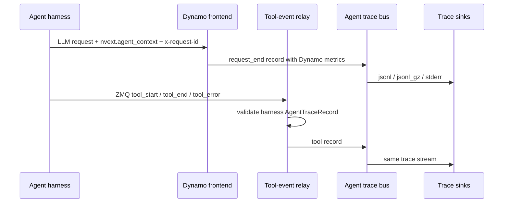

Agent workloads are easier to debug when model calls and tool calls share a
common workflow identity. Dynamo agent tracing provides that view without asking
the harness to measure serving internals itself.

The harness adds lightweight workflow metadata to each LLM request and can
publish tool lifecycle events over a local ZMQ socket. Dynamo then writes a
single trace stream that combines harness-provided structure with Dynamo-owned
request metrics such as token counts, timing, cache hit rate, queue depth, and
worker placement.

This is passive observability. Agent context does not change routing,
scheduling, or cache behavior.



## Step 1: Enable Dynamo Trace Output

For most local profiling runs, use rotating compressed JSONL:

```bash
export DYN_AGENT_TRACE_SINKS=jsonl_gz
export DYN_AGENT_TRACE_OUTPUT_PATH=/tmp/dynamo-agent-trace
```

This writes files like:

```text
/tmp/dynamo-agent-trace.000000.jsonl.gz
/tmp/dynamo-agent-trace.000001.jsonl.gz
```

To ingest harness tool events, also configure the local ZMQ endpoint that the
harness will publish on:

```bash
export DYN_AGENT_TRACE_TOOL_EVENTS_ZMQ_ENDPOINT=tcp://127.0.0.1:20390
```

Then start any Dynamo OpenAI-compatible backend.

<details>
<summary>Environment variable reference</summary>

| Environment Variable | Required | Default | Description |
|----------------------|:--------:|---------|-------------|
| `DYN_AGENT_TRACE_SINKS` | Yes | unset | Enables local trace sinks. Supported values: `jsonl`, `jsonl_gz`, `stderr`, or a comma-separated list such as `jsonl_gz,stderr`. |
| `DYN_AGENT_TRACE_OUTPUT_PATH` | If `jsonl` or `jsonl_gz` is selected | unset | Local trace output path. For `jsonl`, this is the literal file path. For `jsonl_gz`, this is the segment prefix used to derive `.jsonl.gz` files. |
| `DYN_AGENT_TRACE_CAPACITY` | No | `1024` | In-process trace bus capacity. |
| `DYN_AGENT_TRACE_JSONL_BUFFER_BYTES` | No | `1048576` | JSONL writer buffer size. For `jsonl_gz`, this is the max uncompressed batch size before appending a complete gzip member. |
| `DYN_AGENT_TRACE_JSONL_FLUSH_INTERVAL_MS` | No | `1000` | JSONL periodic flush interval. For `jsonl_gz`, each flush appends a complete gzip member. |
| `DYN_AGENT_TRACE_JSONL_GZ_ROLL_BYTES` | No | `268435456` | `jsonl_gz` segment roll threshold in uncompressed bytes. |
| `DYN_AGENT_TRACE_JSONL_GZ_ROLL_LINES` | No | unset | Optional `jsonl_gz` segment roll threshold in records. |
| `DYN_AGENT_TRACE_TOOL_EVENTS_ZMQ_ENDPOINT` | No | unset | Local ZMQ endpoint for harness tool events. Setting this enables tool event ingestion. |
| `DYN_AGENT_TRACE_TOOL_EVENTS_ZMQ_TOPIC` | No | unset | Optional ZMQ topic filter for harness tool events. |

</details>

`DYN_AGENT_TRACE_SINKS` is the local output enable switch. Setting
`DYN_AGENT_TRACE_OUTPUT_PATH` alone does not enable tracing. Setting only the ZMQ
endpoint enables tool ingestion but does not create local files unless a sink is
also configured.

## Step 2: Add Context to LLM Calls

Each harness LLM call should include `nvext.agent_context`:

```json
{
  "model": "my-model",
  "messages": [{"role": "user", "content": "Research Dynamo agent tracing."}],
  "nvext": {
    "agent_context": {
      "workflow_type_id": "deep_research",
      "workflow_id": "research-run-42",
      "program_id": "research-run-42:researcher",
      "parent_program_id": "research-run-42:planner"
    }
  }
}
```

When using the OpenAI Python client, pass Dynamo's extension fields through
`extra_body` and set `x-request-id` through `extra_headers`:

```python
import uuid


def instrument_llm_request(kwargs, agent_context):
    body = dict(kwargs.get("extra_body") or {})
    nvext = dict(body.get("nvext") or {})
    nvext["agent_context"] = dict(agent_context)
    body["nvext"] = nvext

    headers = dict(kwargs.get("extra_headers") or {})
    headers.setdefault("x-request-id", str(uuid.uuid4()))

    out = dict(kwargs)
    out["extra_body"] = body
    out["extra_headers"] = headers
    return out
```

`x-request-id` is the harness's logical LLM-call ID. Dynamo copies it into
`request.x_request_id`; it is separate from Dynamo's internal request ID.

| Field | Required | Meaning |
|-------|:--------:|---------|
| `workflow_type_id` | Yes | Reusable workload/profile class, such as `deep_research` or `coding_agent`. |
| `workflow_id` | Yes | Top-level run identifier. |
| `program_id` | Yes | One schedulable reasoning/tool trajectory. |
| `parent_program_id` | No | Parent program for subagents. |

## Step 3: Send Tool Events to Dynamo

Harnesses bind a local ZMQ PUB socket and publish tool lifecycle records on the
configured endpoint. Dynamo accepts `tool_start`, `tool_end`, and `tool_error`
records from the harness and writes them to the same trace stream as LLM request
records.

The ZMQ wire format is:

```text
[topic, seq_be_u64, msgpack(AgentTraceRecord)]
```

A minimal publisher looks like this:

```python
import msgpack
import struct
import time
import zmq


class ZmqToolEventPublisher:
    def __init__(self, endpoint: str, topic: str = ""):
        self.topic = topic.encode("utf-8")
        self.seq = 0
        self.socket = zmq.Context.instance().socket(zmq.PUB)
        self.socket.bind(endpoint)
        time.sleep(0.5)

    def publish(self, record: dict):
        self.seq += 1
        payload = msgpack.packb(record, use_bin_type=True)
        self.socket.send_multipart(
            [self.topic, struct.pack(">Q", self.seq), payload]
        )
```

The record must include `agent_context`. Tool events should use the same
`workflow_type_id`, `workflow_id`, and `program_id` as the surrounding LLM calls;
include `parent_program_id` for subagent tools when it is available. Dynamo uses
these fields to group request and tool records into the same workflow/program
lanes.

```json
{
  "schema": "dynamo.agent.trace.v1",
  "event_type": "tool_end",
  "event_time_unix_ms": 1777312801500,
  "event_source": "harness",
  "agent_context": {
    "workflow_type_id": "deep_research",
    "workflow_id": "research-run-42",
    "program_id": "research-run-42:researcher"
  },
  "tool": {
    "tool_call_id": "call-abc",
    "tool_class": "web_search",
    "status": "succeeded",
    "duration_ms": 420.5
  }
}
```

The runtime event-plane hop is internal to Dynamo. Harnesses should publish to
the ZMQ endpoint, not directly to Dynamo's event plane.

## Harness Integration Pattern

An existing harness does not need to import Dynamo packages or link against
Dynamo runtime APIs. The ms-agent integration used this shape:

- Add a small helper module that stores the current `agent_context` in a context
  variable.
- Wrap each agent run with that context so LLM calls and tool records share the
  same `workflow_id` and `program_id`.
- Call one helper before each OpenAI-compatible LLM request to merge
  `extra_body.nvext.agent_context` and set `x-request-id`.
- Emit `tool_start` and a terminal `tool_end` or `tool_error` wherever the
  harness executes model-requested tools.
- Propagate context through thread pools, subprocesses, and subagent launches
  when those paths can make LLM calls or emit tool records.
- Register a simple ZMQ publisher at process startup when tool tracing is
  enabled.

You do not need custom code in every tool implementation when existing tool
calls already pass through shared harness code. Add explicit hooks only for paths
that bypass that flow, such as direct OpenAI calls inside a tool, background
executor work that loses context variables, or subagent launches that need
`parent_program_id`.

That keeps the harness dependency boundary simple:

```text
harness code knows:
  - workflow_id / program_id
  - x-request-id
  - tool start/end/error
  - local ZMQ endpoint

Dynamo code knows:
  - request timing
  - token counts
  - cache metrics
  - worker placement
  - trace sinks
```

## Step 4: Inspect the Trace

Read compressed trace records directly:

```bash
gzip -cd /tmp/dynamo-agent-trace.*.jsonl.gz | jq .
```

Each line is a recorder envelope:

```json
{"timestamp": 1234, "event": {"schema": "dynamo.agent.trace.v1"}}
```

Convert traces to Chrome Trace JSON for Perfetto UI:

```bash
python3 benchmarks/agent_trace/convert_to_perfetto.py \
  "/tmp/dynamo-agent-trace.*.jsonl.gz" \
  --output /tmp/dynamo-agent-trace.perfetto.json
```

Open `/tmp/dynamo-agent-trace.perfetto.json` in
[Perfetto UI](https://ui.perfetto.dev/). Each LLM request becomes a timeline
slice grouped by workflow and program lane. Tool terminal records become tool
slices on adjacent tool tracks when duration is available. If a terminal tool
event has no duration, the converter pairs it with the matching `tool_start`
record when present.

Useful converter flags:

| Flag | Meaning |
|------|---------|
| `--include-markers` | Emit first-token instant markers. |
| `--no-stages` | Show request slices without prefill/decode stage slices. |
| `--separate-stage-tracks` | Place prefill/decode stages on adjacent tracks for debugging timeline nesting. |

## Record Semantics

Dynamo emits `request_end` after the response stream completes or is dropped.
Nullable fields are omitted when the serving path did not record them.

```json
{
  "schema": "dynamo.agent.trace.v1",
  "event_type": "request_end",
  "event_time_unix_ms": 1777312801000,
  "event_source": "dynamo",
  "agent_context": {
    "workflow_type_id": "deep_research",
    "workflow_id": "research-run-42",
    "program_id": "research-run-42:researcher",
    "parent_program_id": "research-run-42:planner"
  },
  "request": {
    "request_id": "dynamo-request-id",
    "x_request_id": "llm-call-42",
    "model": "my-model",
    "input_tokens": 4096,
    "output_tokens": 512,
    "cached_tokens": 3584,
    "request_received_ms": 1777312800000,
    "prefill_wait_time_ms": 12.1,
    "prefill_time_ms": 70.3,
    "ttft_ms": 82.4,
    "total_time_ms": 1000.1,
    "avg_itl_ms": 1.8,
    "kv_hit_rate": 0.875,
    "kv_transfer_estimated_latency_ms": 4.2,
    "queue_depth": 3,
    "worker": {
      "prefill_worker_id": 0,
      "prefill_dp_rank": 0,
      "decode_worker_id": 1,
      "decode_dp_rank": 0
    }
  }
}
```

Request records capture Dynamo-owned serving metrics:

| Field | Meaning |
|-------|---------|
| `request_id` | Dynamo request ID for the LLM call. |
| `x_request_id` | Caller-provided logical request ID when present. |
| `model` | Requested model name. |
| `input_tokens` | Prompt/input token count when known. |
| `output_tokens` | Final output token count when known. |
| `cached_tokens` | Prompt tokens served from prefix/KV cache when known. |
| `request_received_ms` | Request receive time in Unix epoch milliseconds. |
| `prefill_wait_time_ms` | Time from request receipt to prefill start. |
| `prefill_time_ms` | Time from prefill start to first token. |
| `ttft_ms` | Time from request receipt to first token. |
| `total_time_ms` | Time from request receipt to request completion. |
| `avg_itl_ms` | Average inter-token latency after first token. |
| `kv_hit_rate` | Effective KV-cache hit rate observed by the router. |
| `kv_transfer_estimated_latency_ms` | Upper-bound estimated disaggregated KV transfer latency. |
| `queue_depth` | Router queue depth observed when routing the request. |
| `worker` | Prefill/decode worker IDs and DP ranks when recorded. |

Trace records do not include prompt/response content, sampling parameters,
finish reason, or error status. Use the audit sink for request/response payload
capture and OpenTelemetry export for span-based observability.

## Consistency Model

Trace output is best-effort profiling data, not durable audit data. Dynamo writes
LLM request records and harness tool records into the same trace stream, but it
does not commit them transactionally.

Delayed tool records are expected. Each normalized record carries
`event_time_unix_ms`, and offline tools should order records by event time
rather than by JSONL line order. The Perfetto converter does this before
rendering request and tool slices.

The trace file does not prove completeness. Records can be absent if Dynamo
exits before sink workers drain, if the trace bus or sink lags and drops records,
or if the ZMQ/event-plane path drops a harness event.

## Current Scope

- Agent context is passive metadata.
- Agent request trace emission is currently wired for `/v1/chat/completions`.
- Supported sinks are `jsonl`, `jsonl_gz`, and `stderr`.
- Tool events enter through the Dynamo-owned ZMQ relay.
- Dynamo does not expose a separate direct event-plane ingress path for harness
  tool events.
- Future scheduler/profiler consumers should read the normalized trace bus.
