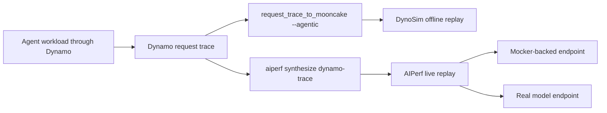

Capture request shape and timing once. Replay it offline with DynoSim or against a live NVIDIA
Dynamo endpoint with AIPerf.

Request traces contain token lengths, prompt hashes, session identity, and timing. They do not
contain prompts, responses, or tool arguments. Use the audit sink described in
[Agent Tracing](agent-tracing.md#audit-payloads) when you need payloads for inspection.

## Choose a Replay Path

| Goal | Path |
|---|---|
| Compare mock engine, KV router, or scheduling behavior without an HTTP endpoint | DynoSim offline replay |
| Exercise frontend parsing, routing, request rejection, and worker registration without GPUs | AIPerf against [live Mocker](../dynosim/mocker.md) |
| Measure a real model and transport stack | AIPerf against a live model endpoint |
| Inspect exact prompts, responses, or tool arguments | Audit sink; audit records are not replay inputs |

Both replay paths start from the same `dynamo.request.trace.v1` capture:



See [Trace Format Reference](../dynosim/trace-formats.md) for other inputs and mode constraints.

## Capture an Agent Workload

Run the agent through Dynamo with a supported session header. Claude Code, Codex, OpenCode, and
generic Dynamo clients use the mappings in [Session IDs](session-ids.md#session-id-inputs).

Enable the request trace sink on the frontend:

```bash
export DYN_REQUEST_TRACE=1
export DYN_REQUEST_TRACE_SINKS=jsonl_gz
export DYN_REQUEST_TRACE_OUTPUT_PATH=/tmp/dynamo-agent-trace
```

For tool timing fidelity, publish explicit tool events over the optional ZMQ ingress described in
[Agent Tracing](agent-tracing.md#tool-call-observability). Without tool events, Dynamo can still
infer tool-wait time from the gap between adjacent LLM requests in the same session.

Run the workload, then inspect the captured request rows:

```bash
gzip -cd /tmp/dynamo-agent-trace.*.jsonl.gz | \
  jq -c '
    select(.event.event_type == "request_end")
    | {request_id: .event.request.request_id, agent_context: .event.agent_context}
  ' | \
  head
```

Each request row passed to the agentic converter must include `agent_context.session_id`. Set
`parent_session_id` for child sessions. For precise tool duration and status, publish the
optional tool events described in [Tool Call Observability](agent-tracing.md#tool-call-observability).
Without those events, the converter preserves the elapsed gap between adjacent LLM requests.

## Replay Offline with DynoSim

### Convert the Capture

Convert the request rows to Agentic Mooncake:

```bash
cargo run -p dynamo-bench --bin request_trace_to_mooncake -- \
  --agentic \
  --input-path "${DYN_REQUEST_TRACE_OUTPUT_PATH}".*.jsonl.gz \
  --output-file /tmp/dynamo-agent-trace.agentic-mooncake.jsonl
```

The converter prints the row count and trace block size:

```text
Wrote 15 Agentic Mooncake rows to /tmp/dynamo-agent-trace.agentic-mooncake.jsonl
Trace block size: 64
```

Set `TRACE_BLOCK_SIZE` to the printed value so replay expands each `hash_id` correctly.

### Run a One-Worker Smoke Test

Start with round-robin routing and one worker:

```bash
TRACE_BLOCK_SIZE=64
uv run --no-sync python -m dynamo.replay \
  /tmp/dynamo-agent-trace.agentic-mooncake.jsonl \
  --trace-format agentic_mooncake \
  --trace-block-size "${TRACE_BLOCK_SIZE}" \
  --replay-mode offline \
  --router-mode round_robin \
  --num-workers 1 \
  --extra-engine-args "{\"block_size\":${TRACE_BLOCK_SIZE}}" \
  --report-json /tmp/dynamo-agent-trace.replay-report.json
```

The command prints a summary and writes run metrics to the report file.

### Compare Router Behavior

After the smoke test passes, run the same trace through the KV router:

```bash
TRACE_BLOCK_SIZE=64
uv run --no-sync python -m dynamo.replay \
  /tmp/dynamo-agent-trace.agentic-mooncake.jsonl \
  --trace-format agentic_mooncake \
  --trace-block-size "${TRACE_BLOCK_SIZE}" \
  --replay-mode offline \
  --router-mode kv_router \
  --num-workers 4 \
  --extra-engine-args "{\"block_size\":${TRACE_BLOCK_SIZE}}" \
  --report-json /tmp/dynamo-agent-trace.kv-router-report.json
```

Change one router or engine setting at a time and compare the report JSON files. Agentic Mooncake
currently supports offline aggregated replay with trace timestamps. It does not support online
DynoSim mode, disaggregated replay, or `--replay-concurrency`.

## Agentic Row Semantics

- `request_id`: the LLM request row identity.
- Mooncake `session_id`: derived from the Dynamo `session_id`.
- `wait_for`: request IDs that must complete before this row becomes eligible.
- `branches`: child request IDs spawned from this row.
- `prefix_reset`: first request in a session.
- `delay`: non-tool delay after dependencies finish.
- `tool_wait_ms`: tool time after dependencies finish, parallel-aware as the union of overlapping
  spans rather than their sum.
- `tool_events`: per-tool spans attributed to this LLM request, each carrying `tool_call_id`,
  `tool_class`, `status`, `started_at_unix_ms`, `ended_at_unix_ms`, `duration_ms`, and optional
  `output_bytes`, `output_tokens`, or `error_type`.
- `hash_ids`, `input_length`, and `output_length`: prompt-prefix and length data for mocker replay.

## Replay Against a Live Endpoint with AIPerf

**Experimental.** Use AIPerf to test frontend parsing, request rejection, routing, transport, and
live worker behavior.

This path requires:

- an AIPerf build with `aiperf synthesize dynamo-trace` and
  `--use-dynamo-conv-aware-routing`
- a Dynamo build that accepts session headers

Older Dynamo builds that require client-generated `nvext.session_control` are not compatible with
this header-only path.

The AIPerf converter reads uncompressed JSONL. Merge the captured segments, then convert them to a
Weka trace directory. The output directory must be absent or empty.

```bash
gzip -cd /tmp/dynamo-agent-trace.*.jsonl.gz > /tmp/dynamo-agent-trace.jsonl

aiperf synthesize dynamo-trace /tmp/dynamo-agent-trace.jsonl \
  --output /tmp/dynamo-agent-weka
```

Replay the converted workload against a Dynamo endpoint:

```bash
AIPERF_DATASET_WEKA_SPLIT_FLATTENED_AGENTS=false \
aiperf profile \
  --url localhost:8000 \
  --model my-model \
  --endpoint-type chat \
  --input-file /tmp/dynamo-agent-weka \
  --custom-dataset-type weka_trace \
  --fixed-schedule \
  --fixed-schedule-auto-offset \
  --use-dynamo-conv-aware-routing
```

Set `AIPERF_DATASET_WEKA_SPLIT_FLATTENED_AGENTS=false` to preserve session boundaries.
`--use-dynamo-conv-aware-routing` sends session and parent markers as headers without
changing request bodies. Point `--url` at a Mocker-backed frontend or a real model deployment.

The converter infers the final turn from the last request in each session. It supports one level
of child sessions and rejects deeper trees.

## How the Request DAG Is Built

Each node is one LLM request:

- Requests in one session run in recorded order.
- A child session starts after the last parent request that finished before the child arrived.
- The next parent request waits when it arrived after the child completed.
- The edge to the next request carries tool-execution and agent-overhead delays.

DynoSim schedules requests from `wait_for`, `delay`, and `tool_wait_ms`. `branches`, `prefix_reset`,
and `tool_events` preserve structure for analysis but do not control scheduling. `hash_ids`,
`input_length`, and `output_length` preserve prompt shape without storing prompt text.

The converter infers spawn and join edges from request timing. It does not recreate application
logic that the trace never observed.

For Claude Code, Codex, OpenCode, and text inputs, see
[Trace Format Reference](../dynosim/trace-formats.md#coding-agent-and-text-inputs).
