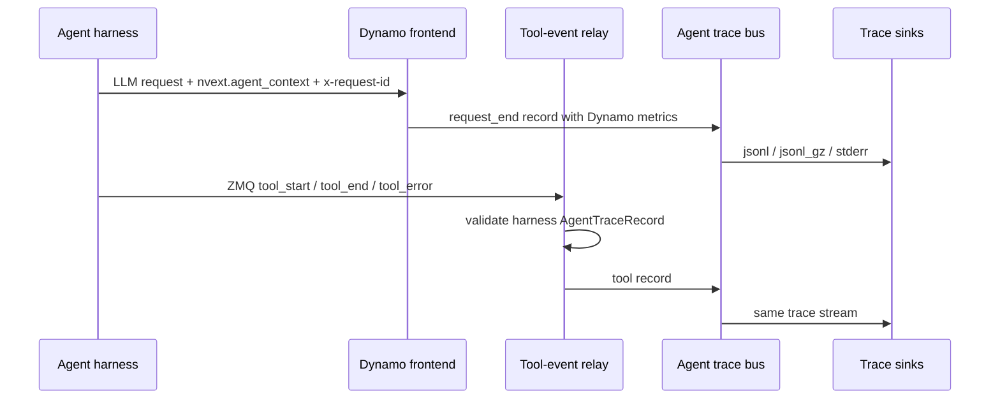

Dynamo agent tracing writes serving-oriented trace records for agentic requests.
The trace combines Dynamo-owned LLM request metrics with optional
harness-published tool lifecycle events. It is best-effort profiling data, not
durable audit data.

For request identity fields, see [Agent Context](agent-context.md).



## Enable Trace Output

For most local profiling runs, use rotating compressed JSONL:

```bash
export DYN_AGENT_TRACE_SINKS=jsonl_gz
export DYN_AGENT_TRACE_OUTPUT_PATH=/tmp/dynamo-agent-trace
```

This writes files like:

```text
/tmp/dynamo-agent-trace.000000.jsonl.gz
/tmp/dynamo-agent-trace.000001.jsonl.gz
```

To ingest harness tool events, configure the local ZMQ endpoint that the harness
will publish on:

```bash
export DYN_AGENT_TRACE_TOOL_EVENTS_ZMQ_ENDPOINT=tcp://127.0.0.1:20390
```

Then start any Dynamo OpenAI-compatible backend.

<details>
<summary>Environment variable reference</summary>

| Environment Variable                       |               Required               | Default     | Description                                                                                                                                       |
| ------------------------------------------ | :----------------------------------: | ----------- | ------------------------------------------------------------------------------------------------------------------------------------------------- |
| `DYN_AGENT_TRACE_SINKS`                    |                 Yes                  | unset       | Enables local trace sinks. Supported values: `jsonl`, `jsonl_gz`, `stderr`, or a comma-separated list such as `jsonl_gz,stderr`.                  |
| `DYN_AGENT_TRACE_OUTPUT_PATH`              | If `jsonl` or `jsonl_gz` is selected | unset       | Local trace output path. For `jsonl`, this is the literal file path. For `jsonl_gz`, this is the segment prefix used to derive `.jsonl.gz` files. |
| `DYN_AGENT_TRACE_CAPACITY`                 |                  No                  | `1024`      | In-process trace bus capacity.                                                                                                                    |
| `DYN_AGENT_TRACE_JSONL_BUFFER_BYTES`       |                  No                  | `1048576`   | JSONL writer buffer size. For `jsonl_gz`, this is the max uncompressed batch size before appending a complete gzip member.                        |
| `DYN_AGENT_TRACE_JSONL_FLUSH_INTERVAL_MS`  |                  No                  | `1000`      | JSONL periodic flush interval. For `jsonl_gz`, each flush appends a complete gzip member.                                                         |
| `DYN_AGENT_TRACE_JSONL_GZ_ROLL_BYTES`      |                  No                  | `268435456` | `jsonl_gz` segment roll threshold in uncompressed bytes.                                                                                          |
| `DYN_AGENT_TRACE_JSONL_GZ_ROLL_LINES`      |                  No                  | unset       | Optional `jsonl_gz` segment roll threshold in records.                                                                                            |
| `DYN_AGENT_TRACE_TOOL_EVENTS_ZMQ_ENDPOINT` |                  No                  | unset       | Local ZMQ endpoint for harness tool events. Setting this enables tool event ingestion.                                                            |
| `DYN_AGENT_TRACE_TOOL_EVENTS_ZMQ_TOPIC`    |                  No                  | unset       | Optional ZMQ topic filter for harness tool events.                                                                                                |

</details>

`DYN_AGENT_TRACE_SINKS` is the local output enable switch. Setting
`DYN_AGENT_TRACE_OUTPUT_PATH` alone does not enable tracing. Setting only the ZMQ
endpoint enables tool ingestion but does not create local files unless a sink is
also configured.

## Tool Events

Harnesses bind a long-lived local ZMQ PUB socket and publish tool lifecycle
records on the configured endpoint. Dynamo accepts `tool_start`, `tool_end`, and
`tool_error` records from the harness and writes them to the same trace stream
as LLM request records.

The ZMQ wire format is:

```text
[topic, seq_be_u64, msgpack(AgentTraceRecord)]
```

Use the same producer pattern as KV event publishers: a bounded queue, a
background publisher thread, monotonically increasing sequence numbers, and a
PUB socket with a high-water mark. Plain ZMQ PUB/SUB is best-effort for early
frames, so a terminal tool record should be self-contained with
`started_at_unix_ms`, `ended_at_unix_ms`, and `duration_ms`. Keep `tool_start`
for live/in-flight status, but do not require it to reconstruct completed spans.

If a harness runs tools or subagents in child processes, keep the root process as
the only network publisher and forward child records to it over the framework
event bus, a multiprocessing queue, or a local collector.

```text
in-process callbacks / tool wrappers
  -> root queued publisher -> ZMQ PUB -> Dynamo relay

child process tools / subagents
  -> process queue or event bus -> root queued publisher -> ZMQ PUB -> Dynamo relay
```

The record must include `agent_context`. Tool events should use the same
`session_type_id`, `session_id`, and `trajectory_id` as the surrounding LLM
calls; include `parent_trajectory_id` for subagent tools when it is available.
Dynamo uses these fields to group request and tool records into the same
session/trajectory lanes. Treat `tool_call_id` as unique within a trajectory,
not globally unique; offline consumers should join tool records on `session_id`,
`trajectory_id`, and `tool_call_id`.

```json
{
    "schema": "dynamo.agent.trace.v1",
    "event_type": "tool_end",
    "event_time_unix_ms": 1777312801500,
    "event_source": "harness",
    "agent_context": {
        "session_type_id": "deep_research",
        "session_id": "research-run-42",
        "trajectory_id": "research-run-42:researcher"
    },
    "tool": {
        "tool_call_id": "call-abc",
        "tool_class": "web_search",
        "status": "succeeded",
        "started_at_unix_ms": 1777312801080,
        "ended_at_unix_ms": 1777312801500,
        "duration_ms": 420.5
    }
}
```

## Inspect the Trace

Read compressed trace records directly:

```bash
gzip -cd "${DYN_AGENT_TRACE_OUTPUT_PATH}".*.jsonl.gz | jq .
```

Each line is a recorder envelope:

```json
{ "timestamp": 1234, "event": { "schema": "dynamo.agent.trace.v1" } }
```

Convert traces to Chrome Trace JSON for Perfetto UI:

```bash
uv run --no-project python benchmarks/agent_trace/convert_to_perfetto.py \
  "${DYN_AGENT_TRACE_OUTPUT_PATH}".*.jsonl.gz \
  --output "${DYN_AGENT_TRACE_OUTPUT_PATH}.perfetto.json"
```

Open `${DYN_AGENT_TRACE_OUTPUT_PATH}.perfetto.json` in
[Perfetto UI](https://ui.perfetto.dev/). Each LLM request becomes a timeline
slice grouped by session and trajectory lane. Tool terminal records become tool
slices on adjacent tool tracks.

Useful converter flags:

| Flag                      | Meaning                                                                        |
| ------------------------- | ------------------------------------------------------------------------------ |
| `--include-markers`       | Emit first-token instant markers.                                              |
| `--no-stages`             | Show request slices without prefill/decode stage slices.                       |
| `--separate-stage-tracks` | Place prefill/decode stages on adjacent tracks for debugging timeline nesting. |

## Record Semantics

Dynamo emits `request_end` after the response stream completes or is dropped.
Nullable fields are omitted when the serving path did not record them.

```json
{
    "schema": "dynamo.agent.trace.v1",
    "event_type": "request_end",
    "event_time_unix_ms": 1777312801000,
    "event_source": "dynamo",
    "agent_context": {
        "session_type_id": "deep_research",
        "session_id": "research-run-42",
        "trajectory_id": "research-run-42:researcher",
        "parent_trajectory_id": "research-run-42:planner"
    },
    "request": {
        "request_id": "dynamo-request-id",
        "x_request_id": "llm-call-42",
        "model": "my-model",
        "input_tokens": 4096,
        "output_tokens": 512,
        "cached_tokens": 3584,
        "request_received_ms": 1777312800000,
        "prefill_wait_time_ms": 12.1,
        "prefill_time_ms": 70.3,
        "ttft_ms": 82.4,
        "total_time_ms": 1000.1,
        "avg_itl_ms": 1.8,
        "kv_hit_rate": 0.875,
        "kv_transfer_estimated_latency_ms": 4.2,
        "queue_depth": 3,
        "worker": {
            "prefill_worker_id": 0,
            "prefill_dp_rank": 0,
            "decode_worker_id": 1,
            "decode_dp_rank": 0
        }
    }
}
```

Request records capture Dynamo-owned serving metrics:

| Field                              | Meaning                                                  |
| ---------------------------------- | -------------------------------------------------------- |
| `request_id`                       | Dynamo request ID for the LLM call.                      |
| `x_request_id`                     | Caller-provided logical request ID when present.         |
| `model`                            | Requested model name.                                    |
| `input_tokens`                     | Prompt/input token count when known.                     |
| `output_tokens`                    | Final output token count when known.                     |
| `cached_tokens`                    | Prompt tokens served from prefix/KV cache when known.    |
| `request_received_ms`              | Request receive time in Unix epoch milliseconds.         |
| `prefill_wait_time_ms`             | Time from request receipt to prefill start.              |
| `prefill_time_ms`                  | Time from prefill start to first token.                  |
| `ttft_ms`                          | Time from request receipt to first token.                |
| `total_time_ms`                    | Time from request receipt to request completion.         |
| `avg_itl_ms`                       | Average inter-token latency after first token.           |
| `kv_hit_rate`                      | Effective KV-cache hit rate observed by the router.      |
| `kv_transfer_estimated_latency_ms` | Upper-bound estimated disaggregated KV transfer latency. |
| `queue_depth`                      | Router queue depth observed when routing the request.    |
| `worker`                           | Prefill/decode worker IDs and DP ranks when recorded.    |

Trace records do not include prompt/response content, sampling parameters,
finish reason, or error status. Use the audit sink for request/response payload
capture and OpenTelemetry export for span-based observability.

## Consistency Model

Trace output is best-effort profiling data, not durable audit data. Dynamo writes
LLM request records and harness tool records into the same trace stream, but it
does not commit them transactionally.

Delayed tool records are expected. Each normalized record carries
`event_time_unix_ms`, and offline tools should order records by event time
rather than by JSONL line order. The Perfetto converter does this before
rendering request and tool slices.

The trace file does not prove completeness. Records can be absent if Dynamo
exits before sink workers drain, if the trace bus or sink lags and drops records,
or if the ZMQ/event-plane path drops a harness event.

## Current Scope

- Agent context is passive metadata.
- Agent request trace emission is currently wired for `/v1/chat/completions`.
- Supported sinks are `jsonl`, `jsonl_gz`, and `stderr`.
- Tool events enter through the Dynamo-owned ZMQ relay.
- Dynamo does not expose a separate direct event-plane ingress path for harness
  tool events.
- Future scheduler/profiler consumers should read the normalized trace bus.
