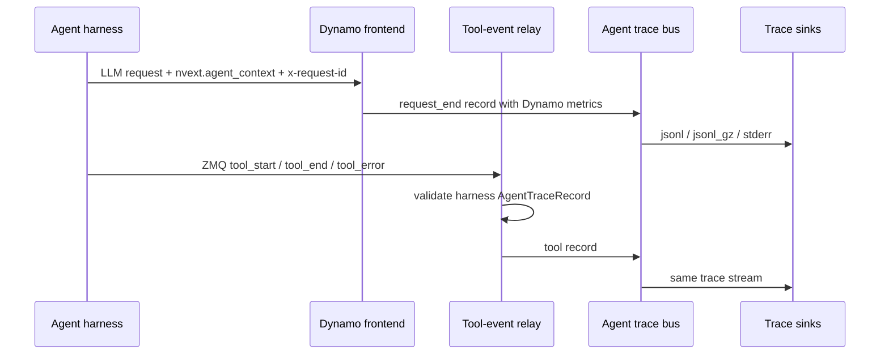

Dynamo agent tracing writes serving-oriented trace records for agentic requests.
The trace combines Dynamo-owned LLM request metrics with optional
harness-published tool lifecycle events. It is best-effort profiling data, not
durable audit data.

For request identity fields, see [Agent Context](agent-context.md).



## Enable Trace Output

For most local profiling runs, use rotating compressed JSONL:

```bash
export DYN_AGENT_TRACE_SINKS=jsonl_gz
export DYN_AGENT_TRACE_OUTPUT_PATH=/tmp/dynamo-agent-trace
```

This writes files like:

```text
/tmp/dynamo-agent-trace.000000.jsonl.gz
/tmp/dynamo-agent-trace.000001.jsonl.gz
```

To ingest harness tool events, configure the local ZMQ endpoint that Dynamo
will bind. Harness processes connect to this endpoint as producers:

```bash
export DYN_AGENT_TRACE_TOOL_EVENTS_ZMQ_ENDPOINT=tcp://127.0.0.1:20390
```

Then start any Dynamo OpenAI-compatible backend.

<details>
<summary>Environment variable reference</summary>

| Environment Variable                       |               Required               | Default     | Description                                                                                                                                       |
| ------------------------------------------ | :----------------------------------: | ----------- | ------------------------------------------------------------------------------------------------------------------------------------------------- |
| `DYN_AGENT_TRACE_SINKS`                    |                 Yes                  | unset       | Enables local trace sinks. Supported values: `jsonl`, `jsonl_gz`, `stderr`, or a comma-separated list such as `jsonl_gz,stderr`.                  |
| `DYN_AGENT_TRACE_OUTPUT_PATH`              | If `jsonl` or `jsonl_gz` is selected | unset       | Local trace output path. For `jsonl`, this is the literal file path. For `jsonl_gz`, this is the segment prefix used to derive `.jsonl.gz` files. |
| `DYN_AGENT_TRACE_CAPACITY`                 |                  No                  | `1024`      | In-process trace bus capacity.                                                                                                                    |
| `DYN_AGENT_TRACE_JSONL_BUFFER_BYTES`       |                  No                  | `1048576`   | JSONL writer buffer size. For `jsonl_gz`, this is the max uncompressed batch size before appending a complete gzip member.                        |
| `DYN_AGENT_TRACE_JSONL_FLUSH_INTERVAL_MS`  |                  No                  | `1000`      | JSONL periodic flush interval. For `jsonl_gz`, each flush appends a complete gzip member.                                                         |
| `DYN_AGENT_TRACE_JSONL_GZ_ROLL_BYTES`      |                  No                  | `268435456` | `jsonl_gz` segment roll threshold in uncompressed bytes.                                                                                          |
| `DYN_AGENT_TRACE_JSONL_GZ_ROLL_LINES`      |                  No                  | unset       | Optional `jsonl_gz` segment roll threshold in records.                                                                                            |
| `DYN_AGENT_TRACE_REPLAY_HASHES`            |                  No                  | enabled     | Replay-oriented prompt block hashes are emitted by default in request records. Set to a falsey value such as `0`, `false`, `off`, or `no` to disable them. Hashes use the model deployment card's KV cache block size. |
| `DYN_AGENT_TRACE_TOOL_EVENTS_ZMQ_ENDPOINT` |                  No                  | unset       | Local ZMQ PULL endpoint that Dynamo binds for harness tool events. Setting this enables tool event ingestion.                                     |
| `DYN_AGENT_TRACE_TOOL_EVENTS_ZMQ_TOPIC`    |                  No                  | unset       | Optional topic filter applied to the first ZMQ message frame.                                                                                     |

</details>

`DYN_AGENT_TRACE_SINKS` is the local output enable switch. Setting
`DYN_AGENT_TRACE_OUTPUT_PATH` alone does not enable tracing. Setting only the ZMQ
endpoint enables tool ingestion but does not create local files unless a sink is
also configured.

## Tool Events

Harnesses connect a long-lived local ZMQ PUSH socket and publish tool lifecycle
records to the endpoint Dynamo binds. Dynamo accepts `tool_start`, `tool_end`,
and `tool_error` records from the harness and writes them to the same trace
stream as LLM request records.

The ZMQ wire format is:

```text
[topic, seq_be_u64, msgpack(AgentTraceRecord)]
```

Use a bounded queue, a background publisher thread, monotonically increasing
sequence numbers, and a PUSH socket with a high-water mark. Terminal tool
records should be self-contained with `started_at_unix_ms`, `ended_at_unix_ms`,
and `duration_ms` because queue pressure, process exits, or network failures can
still drop earlier `tool_start` records. Keep `tool_start` for live/in-flight
status, but do not require it to reconstruct completed spans.

### Endpoint Ownership

Dynamo owns the shared ZMQ bind. Harnesses are producers and only connect.

This direction matters for production process trees. Agent frameworks often run
tools, subagents, plugins, or model wrappers in child processes. If every process
that loads a tracing integration tries to bind the same local endpoint, only one
process succeeds and the others fail during startup. With Dynamo as the single
collector bind and all harness processes connecting as PUSH producers, parent and
child processes can emit their own tool records independently while preserving
their own `agent_context.trajectory_id` and `parent_trajectory_id`.

```text
Dynamo frontend
  -> ZMQ PULL bind -> trace bus -> sinks

parent harness process
  -> queued ZMQ PUSH connect -> Dynamo

child tool / subagent process
  -> queued ZMQ PUSH connect -> Dynamo
```

The record must include `agent_context`. Tool events should use the same
`session_type_id`, `session_id`, and `trajectory_id` as the surrounding LLM
calls; include `parent_trajectory_id` for subagent tools when it is available.
Dynamo uses these fields to group request and tool records into the same
session/trajectory lanes. Treat `tool_call_id` as unique within a trajectory,
not globally unique; offline consumers should join tool records on `session_id`,
`trajectory_id`, and `tool_call_id`.

```json
{
    "schema": "dynamo.agent.trace.v1",
    "event_type": "tool_end",
    "event_time_unix_ms": 1777312801500,
    "event_source": "harness",
    "agent_context": {
        "session_type_id": "deep_research",
        "session_id": "research-run-42",
        "trajectory_id": "research-run-42:researcher"
    },
    "tool": {
        "tool_call_id": "call-abc",
        "tool_class": "web_search",
        "status": "succeeded",
        "started_at_unix_ms": 1777312801080,
        "ended_at_unix_ms": 1777312801500,
        "duration_ms": 420.5
    }
}
```

## Inspect the Trace

Read compressed trace records directly:

```bash
gzip -cd "${DYN_AGENT_TRACE_OUTPUT_PATH}".*.jsonl.gz | jq .
```

Each line is a recorder envelope:

```json
{ "timestamp": 1234, "event": { "schema": "dynamo.agent.trace.v1" } }
```

Convert traces to Chrome Trace JSON for Perfetto UI:

```bash
uv run --no-project python benchmarks/agent_trace/convert_to_perfetto.py \
  "${DYN_AGENT_TRACE_OUTPUT_PATH}".*.jsonl.gz \
  --output "${DYN_AGENT_TRACE_OUTPUT_PATH}.perfetto.json"
```

Open `${DYN_AGENT_TRACE_OUTPUT_PATH}.perfetto.json` in
[Perfetto UI](https://ui.perfetto.dev/). Each LLM request becomes a timeline
slice grouped by session and trajectory lane. Tool terminal records become tool
slices on adjacent tool tracks.

Useful converter flags:

| Flag                      | Meaning                                                                        |
| ------------------------- | ------------------------------------------------------------------------------ |
| `--include-markers`       | Emit first-token instant markers.                                              |
| `--no-stages`             | Show request slices without prefill/decode stage slices.                       |
| `--separate-stage-tracks` | Place prefill/decode stages on adjacent tracks for debugging timeline nesting. |

## Replay the Trace with Mocker

Request trace rows include text-free replay hashes by default. Convert a trace
shard to Mooncake JSONL, then replay it through mocker:

```bash
cargo run -p dynamo-bench --bin agent_trace_to_mooncake -- \
  --input-path "${DYN_AGENT_TRACE_OUTPUT_PATH}".*.jsonl.gz \
  --output-file /tmp/dynamo-agent-trace.mooncake.jsonl
```

Use the `trace_block_size` printed by the converter when launching replay. For a
multi-worker KV-router replay:

```bash
TRACE_BLOCK_SIZE=128
uv run --no-sync python -m dynamo.replay /tmp/dynamo-agent-trace.mooncake.jsonl \
  --trace-format mooncake \
  --trace-block-size "${TRACE_BLOCK_SIZE}" \
  --replay-mode offline \
  --router-mode kv_router \
  --num-workers 4 \
  --extra-engine-args "{\"block_size\":${TRACE_BLOCK_SIZE}}" \
  --report-json /tmp/dynamo-agent-trace.replay-report.json
```

`kv_router` requires more than one mock worker. For a single aggregated-worker
smoke test, use `--router-mode round_robin --num-workers 1`.

### Replay Scope and Follow-ups

What works today:

- Per-`request_end` cumulative input-block hashes are emitted on agent traces by
  default.
- Single-turn agent traces convert to Mooncake JSONL with absolute timestamps
  and compacted `hash_ids`.
- Mocker replay reads these rows as wall-clock arrivals and simulates a cache
  pattern from the configured engine, router, and capacity model.
- Concurrent LLM fan-out from the same `trajectory_id` is preserved as parallel
  arrivals because converted rows do not share a `session_id`.

On the roadmap:

- Live KV cache movement is simulated by the mocker, not replayed byte-for-byte
  from the original run. Higher-fidelity replay would need an explicit replay
  event stream or sidecar rather than inferring writes in the converter.
- Output token text/ids are not reconstructed. Replay only drives
  `max_output_tokens`; the original response text is not regenerated.
- Causal tool and turn dependencies are not modeled in single-row Mooncake
  output. A request that depended on an earlier tool result is replayed by its
  absolute arrival time, not as "wait for the tool to finish".
- End-to-end re-run of an agent run is on the roadmap. Replay today is
  request-level; reconstructing tool decisions, agent control flow, or external
  tool effects is follow-up work.

## Record Semantics

Dynamo emits `request_end` after the response stream completes or is dropped.
Nullable fields are omitted when the serving path did not record them.

```json
{
    "schema": "dynamo.agent.trace.v1",
    "event_type": "request_end",
    "event_time_unix_ms": 1777312801000,
    "event_source": "dynamo",
    "agent_context": {
        "session_type_id": "deep_research",
        "session_id": "research-run-42",
        "trajectory_id": "research-run-42:researcher",
        "parent_trajectory_id": "research-run-42:planner"
    },
    "request": {
        "request_id": "dynamo-request-id",
        "x_request_id": "llm-call-42",
        "model": "my-model",
        "input_tokens": 128,
        "output_tokens": 16,
        "cached_tokens": 112,
        "request_received_ms": 1777312800000,
        "prefill_wait_time_ms": 12.1,
        "prefill_time_ms": 70.3,
        "ttft_ms": 82.4,
        "total_time_ms": 1000.1,
        "avg_itl_ms": 1.8,
        "kv_hit_rate": 0.875,
        "kv_transfer_estimated_latency_ms": 4.2,
        "queue_depth": 3,
        "worker": {
            "prefill_worker_id": 0,
            "prefill_dp_rank": 0,
            "decode_worker_id": 1,
            "decode_dp_rank": 0
        },
        "replay": {
            "trace_block_size": 64,
            "input_length": 128,
            "input_sequence_hashes": [14879255164371896291, 274632075616497421]
        }
    }
}
```

Request records capture Dynamo-owned serving metrics:

| Field                              | Meaning                                                  |
| ---------------------------------- | -------------------------------------------------------- |
| `request_id`                       | Dynamo request ID for the LLM call.                      |
| `x_request_id`                     | Caller-provided logical request ID when present.         |
| `model`                            | Requested model name.                                    |
| `input_tokens`                     | Prompt/input token count when known.                     |
| `output_tokens`                    | Final output token count when known.                     |
| `cached_tokens`                    | Prompt tokens served from prefix/KV cache when known.    |
| `request_received_ms`              | Request receive time in Unix epoch milliseconds.         |
| `prefill_wait_time_ms`             | Time from request receipt to prefill start.              |
| `prefill_time_ms`                  | Time from prefill start to first token.                  |
| `ttft_ms`                          | Time from request receipt to first token.                |
| `total_time_ms`                    | Time from request receipt to request completion.         |
| `avg_itl_ms`                       | Average inter-token latency after first token.           |
| `kv_hit_rate`                      | Effective KV-cache hit rate observed by the router.      |
| `kv_transfer_estimated_latency_ms` | Upper-bound estimated disaggregated KV transfer latency. |
| `queue_depth`                      | Router queue depth observed when routing the request.    |
| `worker`                           | Prefill/decode worker IDs and DP ranks when recorded.    |
| `replay`                           | Text-free replay metadata for Mooncake/mocker conversion. Emitted by default when agent tracing is enabled unless `DYN_AGENT_TRACE_REPLAY_HASHES` is falsey. Strict trace consumers must accept this optional object before enabling tracing. |
| `replay.trace_block_size`          | KV cache block size from the model deployment card, used to derive replay hashes. |
| `replay.input_length`              | Prompt/input token count represented by the replay hashes. |
| `replay.input_sequence_hashes`     | Stable sequence-aware prompt block hashes. These are replay labels, not raw tokens and not compact Mooncake `hash_ids`. |

Trace records do not include prompt/response content, raw token IDs, sampling
parameters, finish reason, or error status. Replay hashes expose prompt prefix
reuse structure without storing the prompt text. Use the audit sink for
request/response payload capture and OpenTelemetry export for span-based
observability.

For local payload debugging, enable audit logging alongside agent tracing.
Audit and agent trace share the same `jsonl` and `jsonl_gz` sink primitives, so
both streams can be captured to disk in parallel:

```bash
export DYN_AGENT_TRACE_SINKS=jsonl_gz
export DYN_AGENT_TRACE_OUTPUT_PATH=/tmp/dynamo-trace
export DYN_AUDIT_SINKS=jsonl_gz
export DYN_AUDIT_OUTPUT_PATH=/tmp/dynamo-audit
export DYN_AUDIT_FORCE_LOGGING=true
```

Audit records include the raw OpenAI-compatible request, the final aggregated
response, and any `nvext.agent_context` supplied by the harness. Join audit
records to agent trace records by `request_id` when correlating payload text
with replay hashes and timing metrics:

```bash
gzip -cd /tmp/dynamo-audit.*.jsonl.gz   | jq -c '.event' > /tmp/audit.jsonl
gzip -cd /tmp/dynamo-trace.*.jsonl.gz   | jq -c '.event' > /tmp/trace.jsonl
jq -s 'group_by(.request_id // .request.request_id)' \
  /tmp/audit.jsonl /tmp/trace.jsonl
```

Audit also accepts `stderr` and `nats` sinks; `DYN_AUDIT_SINKS` takes a
comma-separated list (for example `jsonl_gz,nats`).

Replay hashes describe the cumulative input presented to each LLM request. They
do not by themselves declare cache movement, observed reuse, or that a prior
decode stored a block in KV cache. Mooncake conversion maps these sequence
hashes to compact per-file `hash_ids` and writes an absolute request-arrival
`timestamp` on every converted row. Replay/mocker treats rows with explicit
per-turn timestamps as wall-clock arrivals, so LLM calls from the same
`trajectory_id` can overlap when the original agent issued them concurrently.
Rows that use `delay` instead keep closed-loop session behavior: the next turn
waits for the previous turn to complete plus the delay. Replay/mocker then
treats those rows as request reads and simulates KV writes/events from the
configured engine, router, capacity, admission, and timing model. The simulated
cache pattern is only as exact as those replay parameters.

## Consistency Model

Trace output is best-effort profiling data, not durable audit data. Dynamo writes
LLM request records and harness tool records into the same trace stream, but it
does not commit them transactionally.

Delayed tool records are expected. Each normalized record carries
`event_time_unix_ms`, and offline tools should order records by event time
rather than by JSONL line order. The Perfetto converter does this before
rendering request and tool slices.

The trace file does not prove completeness. Records can be absent if Dynamo
exits before sink workers drain, if the trace bus or sink lags and drops records,
or if the ZMQ/event-plane path drops a harness event.

## Current Scope

- Agent context is passive metadata.
- Agent request trace emission is currently wired for `/v1/chat/completions`.
- Supported sinks are `jsonl`, `jsonl_gz`, and `stderr`.
- Tool events enter through the Dynamo-owned ZMQ relay.
- Dynamo does not expose a separate direct event-plane ingress path for harness
  tool events.
- Future scheduler/profiler consumers should read the normalized trace bus.
