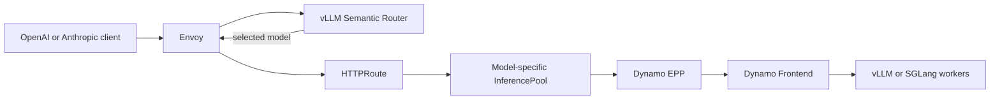

**Experimental.** Deploy multiple models behind one endpoint when agent requests need different capability, latency, or cost profiles. The reference deployment routes lightweight requests to Qwen on vLLM and technical requests to GLM on SGLang.

## Architecture

The model router selects a concrete model before model-specific tokenization. Gateway API then selects that model's `InferencePool`, and the Dynamo Endpoint Picker Protocol (EPP) selects workers inside the pool.



The reference recipe deploys two independent `DynamoGraphDeployment` resources:

| Deployment | Model | Backend | Topology |
|---|---|---|---|
| `model-routing-small` | `Qwen/Qwen3.5-122B-A10B-FP8` | vLLM | Aggregated TP8 |
| `model-routing-large` | `nvidia/GLM-5.2-NVFP4` | SGLang | 1P/1D TP8 with NIXL |

Both deployments share one client endpoint and model-selection policy. Each deployment retains its own backend, scaling, EPP policy, and worker lifecycle.

GlobalRouter is not required because the recipe has one pool per model. GlobalPlanner can scale the pools asynchronously, but it does not participate in model selection or the request path.

## Prerequisites

Prepare the cluster resources listed in the [vLLM Semantic Router mixture recipe](https://github.com/ai-dynamo/dynamo/tree/main/recipes/model-routing/vllm-semantic-router), including:

- three nodes with eight B200 GPUs each;
- the Dynamo operator and agentgateway with Gateway API Inference Extension support;
- a ReadWriteMany PVC named `shared-model-cache`;
- `hf-token-secret` and `ngc-secret` in the deployment namespace; and
- RDMA devices on the two GLM nodes.

Run the following commands from the Dynamo repository root.

## Cache the Models

```bash
export NAMESPACE=model-routing

kubectl create namespace "$NAMESPACE" --dry-run=client -o yaml | kubectl apply -f -
kubectl apply -n "$NAMESPACE" \
  -f recipes/model-routing/vllm-semantic-router/model-cache.yaml
kubectl wait -n "$NAMESPACE" job/model-routing-cache \
  --for=condition=Complete --timeout=7200s
```

The cache job reuses the existing `shared-model-cache` PVC.

## Deploy

Install vLLM Semantic Router, then apply the two Dynamo graphs and Gateway resources:

```bash
git clone --depth 1 --branch v0.3.0 \
  https://github.com/vllm-project/semantic-router.git /tmp/semantic-router-v0.3.0

helm dependency build \
  /tmp/semantic-router-v0.3.0/deploy/helm/semantic-router

helm upgrade --install semantic-router \
  /tmp/semantic-router-v0.3.0/deploy/helm/semantic-router \
  --namespace "$NAMESPACE" \
  --values recipes/model-routing/vllm-semantic-router/semantic-router-values.yaml \
  --wait --timeout 30m

kubectl apply -n "$NAMESPACE" \
  -f recipes/model-routing/vllm-semantic-router/deploy.yaml
```

Wait for both graphs and the Gateway:

```bash
kubectl wait -n "$NAMESPACE" dgd/model-routing-small \
  --for=condition=Ready --timeout=3600s
kubectl wait -n "$NAMESPACE" dgd/model-routing-large \
  --for=condition=Ready --timeout=3600s
kubectl wait -n "$NAMESPACE" gateway/model-routing-gateway \
  --for=condition=Programmed --timeout=300s
```

## Test Model Routing

Forward the shared endpoint:

```bash
kubectl port-forward -n "$NAMESPACE" service/model-routing-envoy 8000:80
```

In another terminal, run the smoke test:

```bash
BASE_URL=http://127.0.0.1:8000 \
  recipes/model-routing/vllm-semantic-router/smoke.sh
```

The test checks automatic Qwen and GLM selection, trusted-header handling, unknown-model rejection, OpenAI streaming, and Anthropic Messages streaming.

Inspect both routing stages:

```bash
kubectl logs -n "$NAMESPACE" deployment/semantic-router --tail=200
kubectl logs -n "$NAMESPACE" \
  -l nvidia.com/dynamo-component-type=epp --tail=200
```

## Run Claude Code

Point Claude Code at the same endpoint and use `auto` as the model name:

```bash
export ANTHROPIC_BASE_URL=http://127.0.0.1:8000
export ANTHROPIC_MODEL=auto
export ANTHROPIC_SMALL_FAST_MODEL=auto
export CLAUDE_CODE_ATTRIBUTION_HEADER=0
export ANTHROPIC_API_KEY=local-dev-token

claude
```

Dynamo Frontend terminates the Anthropic Messages API. The semantic router changes only the selected model and preserves the client protocol.

## Clean Up

```bash
kubectl delete -n "$NAMESPACE" \
  -f recipes/model-routing/vllm-semantic-router/deploy.yaml
kubectl delete -n "$NAMESPACE" \
  -f recipes/model-routing/vllm-semantic-router/model-cache.yaml
helm uninstall semantic-router -n "$NAMESPACE"
```

See the [complete recipe](https://github.com/ai-dynamo/dynamo/tree/main/recipes/model-routing/vllm-semantic-router) to change the models, routing policy, or serving topology.
