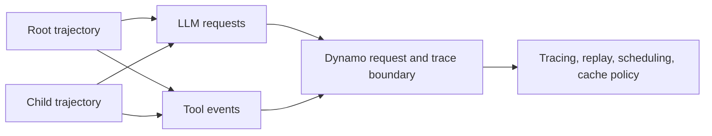

Agent workloads are trajectories, not isolated LLM requests. A single trajectory
can include planner turns, researcher turns, tool calls, retries, and child
agents that branch from a parent. Some agentic serving papers call this unit a
program; Dynamo represents it as a trajectory and exposes `trajectory_id` as the
public identity.

Request-level routing can serve individual turns, but it cannot explain
trajectory latency or preserve useful cache and scheduling context without a
stable identity for the work. NVIDIA Dynamo uses trajectory identity as that
shared handle. The harness stays responsible for agent semantics. Dynamo receives
lightweight metadata at the HTTP boundary, then exposes separate consumers for
observability, replay, scheduling, and cache-aware serving.

## Core Model

| Concept | Role |
|---------|------|
| Trajectory | One reasoning/tool chain. Every LLM request in the chain should carry the same `trajectory_id`. |
| Parent trajectory | The trajectory that spawned a child agent or subtask. Dynamo records this as `parent_trajectory_id` when the client provides or implies it. |
| Request | One model call inside a trajectory. Dynamo records request timing, token counts, and finish metadata when tracing is enabled. |
| Tool event | Optional harness-emitted timing for tool execution. Dynamo can join tool events with requests by trajectory and tool-call ID. |

Trajectory-aware serving needs this model because the bottleneck often sits
between requests: a tool wait, a child branch, a resumed conversation, or a
cached prefix that belongs to a continuing trajectory. Once requests carry stable
trajectory identity, Dynamo can connect those events without forcing every
harness to adopt a Dynamo SDK.

## Agent Surfaces

Use each surface for a different kind of information.

| Surface | Use It For | Start Here |
|---------|------------|------------|
| Trajectory identity | Passive identity for joining requests, tool events, replay rows, and timeline views. | [Trajectory IDs](trajectory-ids.md) |
| Agent tracing | Dynamo `request_end` rows, inferred tool-call finish metadata, optional harness tool spans, Perfetto, and request replay. | [Agent Tracing](agent-tracing.md) |
| Agent hints | Active serving intent such as priority, expected output length, and speculative prefill. | [Agent Hints](agent-hints.md) |
| Priority scheduling | Layer-by-layer priority behavior in the router queue, backend engine, and cache policy. | [Priority Scheduling](priority-scheduling.md) |
| Backend features | Runtime-specific behavior such as SGLang priority scheduling, cache eviction, speculative prefill, and session control. | [SGLang for Agentic Workloads](../backends/sglang/agents.md) |
| Trajectory scheduling | Experimental outer-loop scheduling keyed by trajectory identity for tool-boundary pause and resume. | [ThunderAgent Program Scheduler](thunderagent-router.md) |

Keep passive identity separate from active policy. A `trajectory_id` tells Dynamo
which requests belong together. It is not a tenant identity, fairness ID, routing
command, or cache-retention command. Use `agent_hints`, `session_control`, router
configuration, and backend flags for behavior that should affect serving.

## Reading Order

1. Read [Trajectory IDs](trajectory-ids.md) to understand the supported headers
   from Claude Code, Codex, OpenCode, and custom clients.
2. Enable [Agent Tracing](agent-tracing.md) when you need request rows, tool-call
   metadata, Perfetto timelines, or replay input.
3. Add [Agent Hints](agent-hints.md) only when the harness has serving intent
   that Dynamo should act on.
4. Use [Priority Scheduling](priority-scheduling.md) and backend-specific agent
   guides when a deployment needs queue, engine, or cache-policy behavior.
