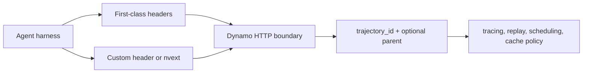

A trajectory ID is the stable identifier Dynamo uses for one agent
reasoning/tool chain. A root agent, planner, researcher subagent, or OpenCode
subtask can each have its own trajectory. Every LLM request in that chain
should carry the same `trajectory_id`; child trajectories can also carry a
`parent_trajectory_id` so traces and replay tools can rebuild the tree.

Trajectory IDs are passive metadata. They let Dynamo join request rows, tool
events, replay artifacts, and timeline slices without treating the ID as a
routing, fairness, or cache-control command. Ordinary non-agent requests can omit
them.



Tracing is one use of trajectory IDs. See [Agent Tracing](agent-tracing.md) for
request trace output, tool-call observability, Perfetto conversion, and replay.

## Trajectory ID inputs

### First-class supported agents

Dynamo recognizes the current stable identity headers emitted by these coding
agents. Header lookup is case-insensitive.

| Source | Trajectory input | Parent input | Dynamo behavior |
|--------|------------------|--------------|-----------------|
| Claude Code | `x-claude-code-session-id`; `x-claude-code-agent-id` for child agents | Inferred from `x-claude-code-session-id` when `x-claude-code-agent-id` differs | Root turns use the session header as `trajectory_id`; child-agent turns use the agent header as `trajectory_id` and the session header as `parent_trajectory_id`. |
| Codex | `session-id` | None | `session-id` becomes the `trajectory_id`. |
| OpenCode | `x-session-id` | `x-parent-session-id` | `x-session-id` becomes the `trajectory_id`; `x-parent-session-id` becomes `parent_trajectory_id` when present. |
| Generic Dynamo client | `x-dynamo-trajectory-id` | None | The header value becomes `trajectory_id`. |

OpenCode `x-session-affinity` is routing intent, not trajectory identity. Use
the first-class headers above, the generic `x-dynamo-trajectory-id` header, or
the body form below.

### Custom clients

For a custom HTTP client that only needs a trajectory ID, send the generic
header:

```bash
curl http://localhost:8000/v1/chat/completions \
  -H 'Content-Type: application/json' \
  -H 'Authorization: Bearer sk-dummy' \
  -H 'x-dynamo-trajectory-id: research-run-42:researcher' \
  -d '{"model":"my-model","messages":[{"role":"user","content":"..."}]}'
```

Use the `nvext` body form when you need the optional `parent_trajectory_id`:

```json
{
  "model": "my-model",
  "messages": [{ "role": "user", "content": "..." }],
  "nvext": {
    "agent_context": {
      "trajectory_id": "research-run-42:researcher",
      "parent_trajectory_id": "research-run-42:planner"
    }
  }
}
```

| Field                  | Required | Meaning                                  |
| ---------------------- | :------: | ---------------------------------------- |
| `trajectory_id`        |   Yes    | One reasoning/tool chain inside the run. |
| `parent_trajectory_id` |    No    | Parent trajectory when using subagents.  |

The body form takes precedence over all identity headers.

Precedence:

1. `nvext` body fields.
2. First-class coding-agent headers.
3. Generic `x-dynamo-trajectory-id`.
4. No trajectory identity.

No Dynamo imports are required in the harness. The metadata is plain JSON under
`nvext`; just propagate the trajectory ID across threads/processes wherever
those paths call the model.

## Boundaries

Use trajectory IDs as untrusted request metadata. They identify agent work, but
they do not prove who sent the request.

- A `trajectory_id` is not a tenant ID, authorization subject, fairness ID,
  routing command, or cache-retention command.
- OpenCode `x-session-affinity` is routing intent, not trajectory identity.
- Codex `previous_response_id` points to a previous turn, not the root of an
  agent chain, so Dynamo does not use it as a trajectory ID.
- Do not use raw caller-controlled trajectory IDs as unbounded metrics labels.
  Keep raw IDs in trace/debug artifacts when needed, and use bounded or hashed
  labels for metrics.

### Contract coverage

The live frontend API-surface smoke runs Codex, Claude Code, and OpenCode
against Dynamo and asserts the expected trajectory identity appears in request
traces. The test is
[`tests/frontend/test_frontend_api_surface_compliance.py`](https://github.com/ai-dynamo/dynamo/blob/main/tests/frontend/test_frontend_api_surface_compliance.py)
and carries the `frontend_api_surface_compliance`, `pre_merge`, `sglang`, and
`gpu_1` pytest markers, so the SGLang pre-merge GPU lane selects it when that
lane runs. Use the dedicated marker when you want to target this contract
locally or in CI:

```bash
python -m pytest \
  tests/frontend/test_frontend_api_surface_compliance.py \
  -m frontend_api_surface_compliance
```
