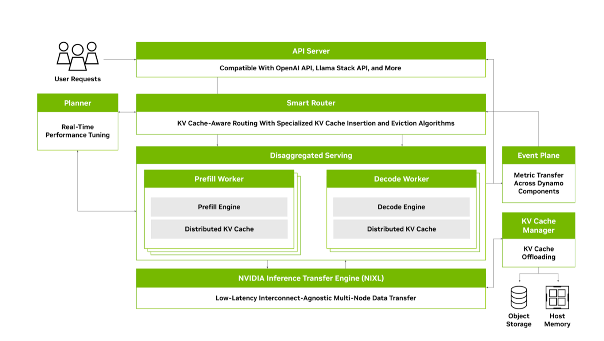
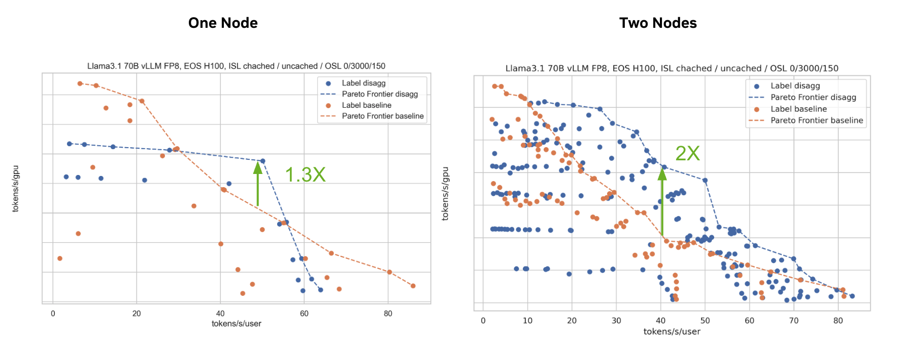

<!--
SPDX-FileCopyrightText: Copyright (c) 2025 NVIDIA CORPORATION & AFFILIATES.
All rights reserved.
SPDX-License-Identifier: Apache-2.0

Licensed under the Apache License, Version 2.0 (the "License");
you may not use this file except in compliance with the License.
You may obtain a copy of the License at

http://www.apache.org/licenses/LICENSE-2.0

Unless required by applicable law or agreed to in writing, software
distributed under the License is distributed on an "AS IS" BASIS,
WITHOUT WARRANTIES OR CONDITIONS OF ANY KIND, either express or implied.
See the License for the specific language governing permissions and
limitations under the License.
-->

# High Level Architecture

Dynamo is high-throughput low-latency inference framework designed for serving generative AI and reasoning models in multi-node distributed environments. Designed to be inference engine agnostic (supports TRT-LLM, vLLM, SGLang or others), it captures LLM-specific capabilities such as:

- **Disaggregated prefill & decode inference** – Maximizes GPU throughput and facilitates trade off between throughput and latency.
- **Dynamic GPU scheduling** – Optimizes performance based on fluctuating demand
- **LLM-aware request routing** – Eliminates unnecessary KV cache re-computation
- **Accelerated data transfer** – Reduces inference response time using NIXL.
- **KV cache offloading** – Leverages multiple memory hierarchies for higher system throughput

Built in Rust for performance and in Python for extensibility, Dynamo is fully open-source and driven by a transparent, OSS (Open Source Software) first development approach

## Motivation behind Dynamo

Scaling inference for generative AI and reasoning models are fundamentally hard problems—not just in terms of performance, but also in correctness and efficiency. Most inference serving frameworks struggle to handle the sheer complexity of large-scale distributed execution.

There are multi-faceted challenges:

- *Difficult UX*: User experience is critical for distributed inference runtimes because managing large-scale inference systems is already complex, and poor usability further complicates matters. Developers need a clear, intuitive way to define, optimize, and update inference execution without wrestling with low-level infrastructure details. Without simple UX, inference runtimes remain inaccessible, prone to errors, and inefficient, hindering model deployment and innovation. A modern distributed inference stack must consider usability at its core—empowering developers to scale AI effortlessly for agentic workflows while ensuring correctness and performance.

- *GPU underutilization*: Traditional monolithic inference pipelines often leave GPUs idle due to the imbalance between prefill and decode stages. Prefill (which generates large prompt embeddings) is highly compute-intensive, while decode (which generates tokens) is latency-sensitive. A disaggregated approach that separate prefill and decode ensures optimal GPU utilization and increases overall throughput ([DistServe](https://arxiv.org/abs/2401.09670)).

- *Expensive KV cache re-computation*: When requests aren't efficiently routed, KV caches (intermediate states of transformer model) often get flushed and recomputed, leading to wasted computation cycles and increased latency. KV-aware request routing eliminates redundant KV cache regeneration, significantly boosting efficiency.([DeepSeek](https://arxiv.org/abs/2501.12948))

- *Memory bottlenecks*: Large-scale inference workloads demand extensive KV cache storage, which can quickly overwhelm GPU memory capacity. KV cache offloading across memory hierarchies (HBM, DDR, NVMe or remote storage) enables models to scale beyond GPU memory limits and speeds up latency. ([Mooncake](https://github.com/kvcache-ai/Mooncake/blob/main/doc/en/mooncake-store-preview.md), [AIBrix](https://blog.vllm.ai/2025/02/21/aibrix-release.html), [LMCache](https://lmcache.ai/))

- *Fluctuating demand and inefficient GPU allocation*: Inference workloads are use-case specific and dynamic—demand surges inherently cause unpredictably, yet traditional serving stacks allocate GPUs statically. Dynamic GPU scheduling ensures that resources are allocated based on real-time demand, preventing over-provisioning and improving utilization ([AzureTrace](https://github.com/Azure/AzurePublicDataset))

- *Inefficient data transfer*: Distributed inference workloads introduce unique and highly dynamic communication patterns that differ fundamentally from training. Unlike training, where worker roles remain largely static, inference requires real-time worker scaling, dynamic load balancing, and adaptive memory management—necessitating a communication layer that can efficiently handle these evolving requirements. Contemporary libraries are built for static, synchronous operations and lack the dynamicity needed for inference serving. While UCX provides high-performance networking, it requires deep networking expertise to configure correctly, making it impractical for broad inference use cases. Developers need a library optimized for inference workloads that can abstract heterogeneous memory (remote memory or storage) and dynamically select the best transport mechanism via a unified API.

To address the growing demands of distributed inference serving, NVIDIA introduces Dynamo. This innovative product tackles key challenges in scheduling, memory management, and data transfer. Dynamo employs KV-aware routing for optimized decoding, leveraging existing KV caches. For efficient global memory management at scale, it strategically stores and evicts KV caches across multiple memory tiers—GPU, CPU, SSD, and object storage—enhancing both time-to-first-token and overall throughput. Dynamo features NIXL (NVIDIA Inference tranXfer Library), a new data transfer engine designed for dynamic scaling and low-latency storage access.

## High level architecture and key benefits

The following diagram outlines Dynamo's high-level architecture. To enable large-scale distributed and disaggregated inference serving, Dynamo includes five key features:

- [Dynamo Disaggregated Serving](disagg_serving.md)
- [Dynamo Smart Router](kv_cache_routing.md)
- [Dynamo KV Cache Block Manager](kvbm_intro.rst)
- [Planner](planner.md)
- [NVIDIA Inference Transfer Library (NIXL)](https://github.com/ai-dynamo/nixl/blob/main/docs/nixl.md)

Every component in the Dynamo architecture is independently scalable and portable. The API server can adapt to task-specific deployment. A smart router processes user requests to route them to the optimal worker for performance. Specifically, for Large Language Models (LLMs), Dynamo employs KV cache-aware routing, which directs requests to the worker with the highest cache hit rate while maintaining load balance, expediting decoding. This routing strategy leverages a KV cache manager that maintains a global radix tree registry for hit rate calculation. The KV cache manager also oversees a multi-tiered memory system, enabling rapid KV cache storage and eviction. This design results in substantial TTFT reductions, increased throughput, and the ability to process extensive context lengths.

Dynamo enables dynamic worker scaling, responding to real-time deployment signals. These signals, captured and communicated through an event plane, empower the Planner to make intelligent, zero-downtime adjustments. For instance, if Dynamo detects an increase in requests with long input sequences, the Planner automatically scales up prefill workers to meet the heightened demand.

Beyond efficient event communication, data transfer across multi-node deployments is crucial at scale. To address this, Dynamo utilizes NIXL, a technology designed to expedite transfers through reduced synchronization and intelligent batching. This acceleration is particularly vital for disaggregated serving, ensuring minimal latency when prefill workers pass KV cache data to decode workers.

Dynamo prioritizes seamless integration. Its modular design enables it to work harmoniously with your existing infrastructure and preferred open-source components. To achieve optimal performance and extensibility, Dynamo leverages the strengths of both Rust and Python. We built critical performance-sensitive modules with Rust for speed, memory safety, and robust concurrency. Meanwhile, we used Python for its flexibility, enabling rapid prototyping and effortless customization.

## Performance benefits of key features

### Disaggregated serving

Disaggregating prefill and decode boosts performance, gaining efficiency when more GPUs are involved in inference. For example, for Llama 70B, single-node tests show a 30% throughput/GPU improvement, while two-node setups achieve over 2X gains due to better parallelization.

* Tested on H100s with R1 Distilled Llama 70B model FP8 using vLLM. 3K ISL/ 150 OSL

The disaggregation of prefill and decode phases offers valuable flexibility. Since these phases directly correlate with time-to-first-token (TTFT) and inter-token latency (ITL) respectively, adjusting worker allocation can provide tailored performance. This enables optimization for specific service level agreements (SLAs), whether prioritizing faster TTFT, lower ITL, or higher throughput.

### KV aware routing

* Tested with 100K requests to R1 using R1 Distilled Llama 70B FP8 on 2 nodes of H100s. Avg 4K ISL / 800 OSL

Existing routing methods, including load-based routing, overlook the specific properties of LLMs that could improve performance. Addressing this, routing user queries to workers with the highest KV cache hit rate (rather than simply the least busy node) allows for immediate processing, even under heavy load. The preceeding figures illustrate the effectiveness of KV aware routing on 100,000 real R1 user queries, achieving a 3x improvement in TTFT and a 2x reduction in average request latency. Depending on traffic, this approach can also enhance throughput.

### KV cache manager

Dynamo's design enables KV cache offloading to system CPU memory. In accelerated servers, the CPU (system) memory is often larger than the GPU memory and fast enough to store and serve KV cache data. The following plot highlights the performance gains achieved through system memory offloading, even with prefix caching enabled via inference engine. In a scenario involving 10 multi-turn conversations with 80 users, system memory offloading resulted in a 40% improvement in TTFT, demonstrating benefits beyond basic prefix caching.

* Tested with 100K requests to R1 using R1 Distilled Llama 70B FP8 on 2 nodes of H100s. Avg 4K ISL / 800 OSL

### NVIDIA Inference Transfer Library (NIXL)

NIXL streamlines data transfer through simplified synchronization and batching and simplified source and destination abstractions. NIXL can abstract data movement across different types of memory and fast storage, whereas other data transfer libraries typically support a single tier of memory. These enhancements yield significant performance gains, accelerating both time-to-first-token (TTFT) and throughput.

## Acknowledgements

We'd like to acknowledge several open source software stacks that motivated our creation Dynamo.

- vLLM and vLLM-project
- SGLang
- DistServe
- Mooncake
- AIBrix
- BentoML
