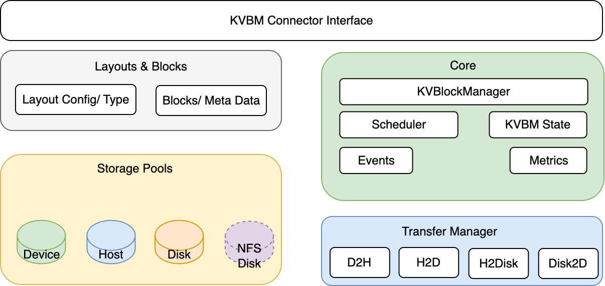
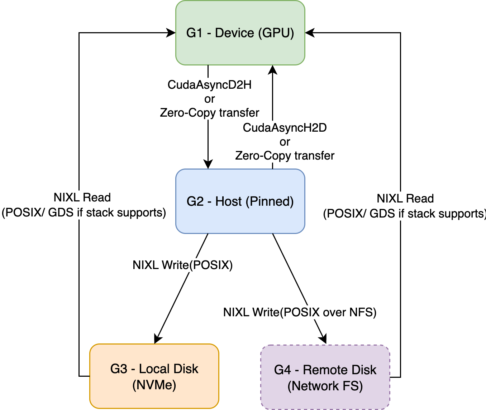

<!--
SPDX-FileCopyrightText: Copyright (c) 2025 NVIDIA CORPORATION & AFFILIATES.
All rights reserved.
SPDX-License-Identifier: Apache-2.0

Licensed under the Apache License, Version 2.0 (the "License");
you may not use this file except in compliance with the License.
You may obtain a copy of the License at

http://www.apache.org/licenses/LICENSE-2.0

Unless required by applicable law or agreed to in writing, software
distributed under the License is distributed on an "AS IS" BASIS,
WITHOUT WARRANTIES OR CONDITIONS OF ANY KIND, either express or implied.
See the License for the specific language governing permissions and
limitations under the License.
-->

# Understanding KVBM components

The design of the KVBM is inspired from vLLM and SGLang KV block managers but with a twist from historical memory tiering design aspired in general GPU programming. [See KVBM Reading](kvbm_reading.md). The following figure shows the internal components of KVBM.

**Internal Components of Dynamo KVBM**

## KVBM Components
### Core
- **KvBlockManager**: Public facade. Constructs/owns the internal state and exposes the pools and onboarding APIs.
- **Scheduler**: Gates transfer execution relative to model progress (iteration/layer completion) when integrated with a framework connector (e.g., vLLM V1).
- **Config (config.rs)**: Describes model dims, page size, layout choices, and runtime flags used to build pools and layouts.
- **KvBlockManagerState**: Central object wiring together layouts, storage backends, and pools; owns the OffloadManager, metrics, and events hooks.
- **Events/Metrics**: Observability components emitting counters/gauges and event hooks for integration/testing.

### Layouts and Blocks
- **LayoutConfig & LayoutType**: Translate tensor shapes into KV cache layouts (layer-separated or fully-contiguous), including block counts and geometry.
- **Blocks & Metadata**: Typed block handles (mutable/immutable), metadata (e.g., priority), and views by layer/outer dims; used to allocate, register, and match by `sequence_hash`.

### Transfer Manager
- **TransferManager**: Asynchronous transfer orchestrator with per-path queues (Device→Host, Host→Disk, Host→Device, Disk→Device).

### Storage & Pools
- **Device Pool(G1)**: GPU-resident KV block pool. Allocates mutable GPU blocks, registers completed blocks (immutable), serves lookups by sequence hash, and is the target for onboarding (Host→Device, Disk→Device).
- **Host Pool(G2)**: CPU pinned-memory KV block pool. Receives Device offloads (Device→Host), can onboard to Device (Host→Device), and offloads to Disk. Uses pinned (page-locked) memory for efficient CUDA transfers and NIXL I/O.
- **Disk Pool(G3)**: Local SSD NVMe-backed KV block pool. Receives Host offloads (Host→Disk) and provides blocks for onboarding to Device (Disk→Device). NIXL descriptors expose file offsets/regions for zero-copy I/O and optional GDS.

## KVBM DataFlows

**KVBM Data Flows from device to other memory hierarchies**

**Device → Host (Offload)**
* Triggered explicitly requested to offload by the connector scheduler.
* Worker allocates a Host block and performs CUDA D2H/Custom Kernel copy.
* Host pool registers the new immutable block (dedup by sequence hash).

**Host → Disk (Offload)**
* Local Disk: NIXL Write via POSIX; GDS when available.
* Remote Disk (Network FS like NFS/Lustre/GPFS): NIXL Write via POSIX to the mounted FS; batching/concurrency identical.
* Triggered on registered host blocks or explicit offload requests.
* Worker allocates a Disk block and performs NIXL Write (Host→Disk).
* Disk pool registers the new immutable block (dedup by sequence hash).

**Host → Device (Onboard)**
* Called to bring a host block into GPU memory.
* Worker uses provided Device targets and performs CUDA H2D/Custom Kernel copy.
* Device pool registers the new immutable block.

**Disk → Device (Onboard)**
* Called to bring a disk block directly into GPU memory.
* Worker ses provided Device targets and performs NIXL Read (Disk→Device), possibly via GDS.
* Device pool registers the new immutable block.
