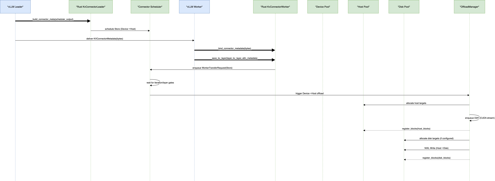

<!--
SPDX-FileCopyrightText: Copyright (c) 2025 NVIDIA CORPORATION & AFFILIATES.
All rights reserved.
SPDX-License-Identifier: Apache-2.0

Licensed under the Apache License, Version 2.0 (the "License");
you may not use this file except in compliance with the License.
You may obtain a copy of the License at

http://www.apache.org/licenses/LICENSE-2.0

Unless required by applicable law or agreed to in writing, software
distributed under the License is distributed on an "AS IS" BASIS,
WITHOUT WARRANTIES OR CONDITIONS OF ANY KIND, either express or implied.
See the License for the specific language governing permissions and
limitations under the License.
-->

# KVBM Integrations

KVBM Integrates with Inference frameworks (vLLM, TRTLLM, SGLang) via Connector APIs to influence KV caching behaviour, scheduling, and forward pass execution.
There are two components of the interface, Scheduler and Worker. Scheduler(leader) is responsible for the orchestration of KV block offload/onboard, builds metadata specifying transfer data to the workers. It also maintains hooks for handling asynchronous transfer completion. Worker is responsible for reading metadata built by the scheduler(leader), does async onboarding/ offloading at the end of the forward pass.

## Typical KVBM Integrations

The following figure shows the typical integration of KVBM with inference frameworks (vLLM used as an example)

**vLLM KVBM Integration**

Instructions to [run KVBM in vLLM](../guides/run_kvbm_in_vllm.md)
Instructions to run KVBM with TRTLLM:

## Onboarding

**Onboarding blocks from Host to Device**

**Onboarding blocks from Disk to Device**

## Offloading

**Offloading blocks from Device to Host&Disk**
