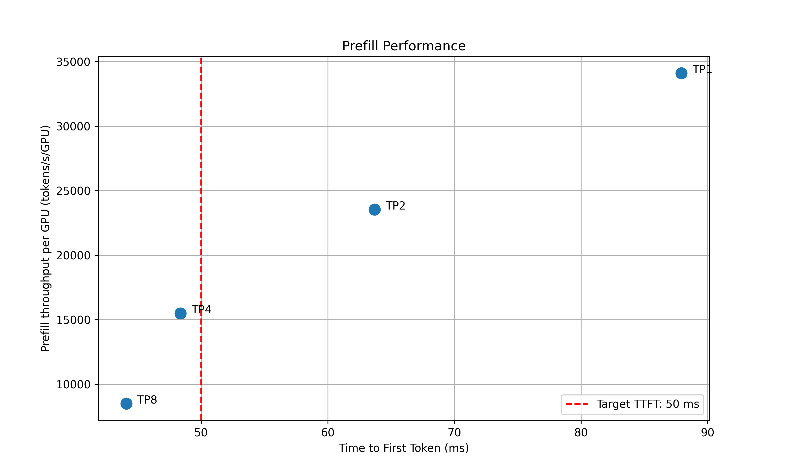
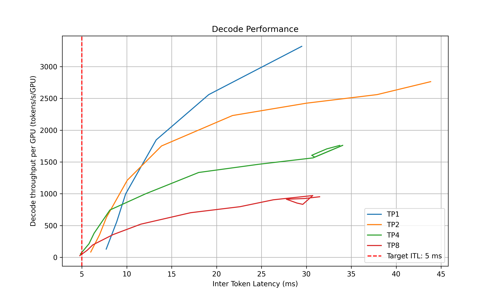
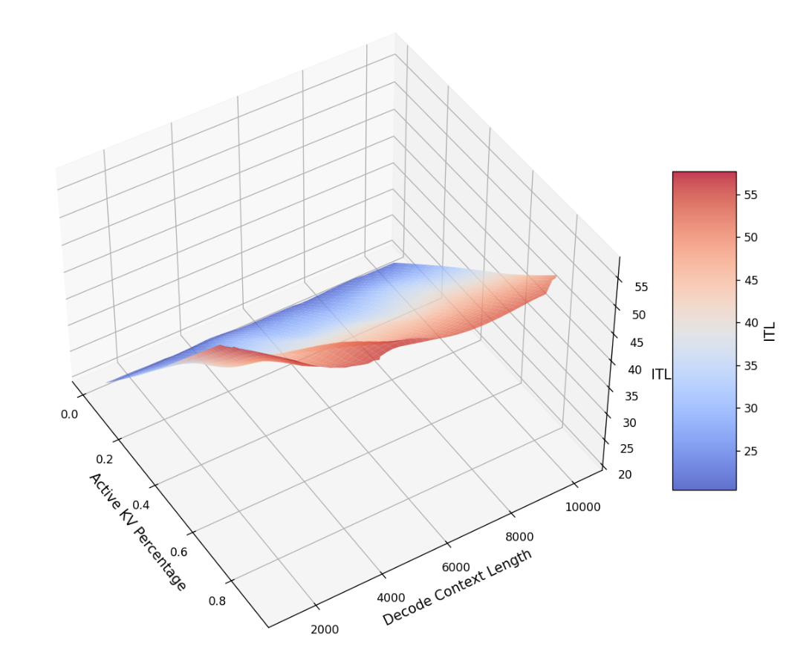

# Pre-Deployment Profiling

## Profiling Script

To ensure dynamo serve complies with the SLA, we provide a pre-deployment script to profile the model performance with different parallelization mappings and recommend the parallelization mapping for prefill and decode workers and planner configurations. To use this script, the user needs to provide the target ISL, OSL, TTFT SLA, and ITL SLA.

> [!NOTE]
> The script considers a fixed ISL/OSL without KV cache reuse. If the real ISL/OSL has a large variance or a significant amount of KV cache can be reused, the result might be inaccurate.

We assume there is no piggy-backed prefill requests in the decode engine. Even if there are some short piggy-backed prefill requests in the decode engine, it should not affect the ITL too much in most conditions. However, if the piggy-backed prefill requests are too much, the ITL might be inaccurate.

The script will first detect the number of available GPUs on the current nodes (multi-node engine not supported yet). Then, it will profile the prefill and decode performance with different TP sizes. For prefill, since there is no in-flight batching (assume isl is long enough to saturate the GPU), the script directly measures the TTFT for a request with given isl without kv-reusing. For decode, since the ITL (or iteration time) is relevant with how many requests are in-flight, the script will measure the ITL under different number of in-flight requests. The range of the number of in-flight requests is from 1 to the maximum number of requests that the kv cache of the engine can hold. To measure the ITL without being affected by piggy-backed prefill requests, the script will enable kv-reuse and warm up the engine by issuing the same prompts before measuring the ITL. Since the kv cache is sufficient for all the requests, it can hold the kv cache of the pre-computed prompts and skip the prefill phase when measuring the ITL.

After the profiling finishes, two plots will be generated in the `output-dir`. For example, here are the profiling results for `examples/llm/configs/disagg.yaml`:




For the prefill performance, the script will plot the TTFT for different TP sizes and select the best TP size that meet the target TTFT SLA and delivers the best throughput per GPU. Based on how close the TTFT of the selected TP size is to the SLA, the script will also recommend the upper and lower bounds of the prefill queue size to be used in planner.

For the decode performance, the script will plot the ITL for different TP sizes and different in-flight requests. Similarly, it will select the best point that satisfies the ITL SLA and delivers the best throughput per GPU and recommend the upper and lower bounds of the kv cache utilization rate to be used in planner.

The script will recommend the best TP size for prefill and decode, as well as the upper and lower bounds of the prefill queue size and decode kv cache utilization rate if using load-based planner. The following information will be printed out in the terminal:
```
2025-05-16 15:20:24 - __main__ - INFO - Analyzing results and generate recommendations...
2025-05-16 15:20:24 - __main__ - INFO - Suggested prefill TP:4 (TTFT 48.37 ms, throughput 15505.23 tokens/s/GPU)
2025-05-16 15:20:24 - __main__ - INFO - Suggested planner upper/lower bound for prefill queue size: 0.24/0.10
2025-05-16 15:20:24 - __main__ - INFO - Suggested decode TP:4 (ITL 4.83 ms, throughput 51.22 tokens/s/GPU)
2025-05-16 15:20:24 - __main__ - INFO - Suggested planner upper/lower bound for decode kv cache utilization: 0.20/0.10
```

After finding the best TP size for prefill and decode, the script will then interpolate the TTFT with ISL and ITL with active KV cache and decode context length. This is to provide a more accurate estimation of the performance when ISL and OSL changes and will be used in the sla-planner. The results will be saved to `<output_dir>/<decode/prefill>_tp<best_tp>_interpolation`.

### Prefill Interpolation Data

In prefill engine, prefills are usually done with batch size=1 and only the ISL (excluding prefix cache hit) affects the iteration time. The script profiles the selected prefill TP configuration across different ISLs and record the TTFT and prefill throughput per GPU under those ISLs.

### Decode Interpolation Data
In decode engine, decode requests are added inflight and iteration time (or ITL) depends on both the context length and the real-time load of the engine. We capture the real-time load of the engine with active kv usage and average context length. The active kv usage determines the complexity of the memory-bounded attention kernel while the active kv usage divided the average context length determines the complexity of the computation bound MLP kernel. For example, the below figure shows the ITL of DS-Distilled Llama 8b model on H100 TP4. The ITL grows near-linearly with active kv usage under a fixed context length. And the slope increases as the context length decreases.



The script profiles the selected decode TP configuration across different active kv blocks and average context length.

### Output Format of Interpolation Data

After suggesting the optimal TP configuration, two `.npz` files that describe the performance characteristics of the prefill and decode engines in their suggested parallel configurations will be generated. The two `.npz` files are:
* `${benchmark_result_dir}/selected_prefill_interpolation/raw_data.npz}`
  * `prefill_isl`: a 1D Numpy array to store the ISLs used to profile the prefill engine.
  * `prefill_ttft`: a 1D Numpy array to store the TTFTs under the corresponding ISLs when the prefill engine is exclusively running each prefill request (i.e., with batch size of 1). The unit is in milliseconds.
  * `prefill_thpt_per_gpu`: a 1D Numpy array to store the prefill throughput per GPU under the corresponding ISLs. The unit is in tokens per second per GPU.
* `${benchmark_result_dir}/selected_decode_interpolation/raw_data.npz`
  * `max_kv_tokens`: a 1D Numpy array with only one element to store the total number of KV tokens in the decode engine.
  * `x_kv_usage`: a 1D Numpy array to store the percentage of the active KV blocks (in the range of [0, 1]) used to profile the decode engine. The active KV blocks can be controlled by varying `(ISL + OSL / 2) * concurrency`.
  * `y_context_length`: a 1D Numpy array to store the average context length (ISL + OSL / 2) used to profile the decode engine.
  * `z_itl`: a 1D Numpy array to store the ITLs under the corresponding active KV usage and context length. To skip the prefill stage while maintaining the context length, benchmark can be done by turn on kv reuse and warmup the engine with the prompts first before running the actual profiling. The unit is in milliseconds.
  * `z_thpt_per_gpu`: a 1D Numpy array to store the decode throughput per GPU under the corresponding active KV usage and context length. The unit is in tokens per second per GPU.

SLA planner can work with any interpolation data that follows the above format. For best results, use fine-grained and high coverage interpolation data for the prefill and decode engines.


## Running the Profiling Script in Kubernetes

Set your environment variables:
```bash
export NAMESPACE=your-namespace
```

**Optional Step 0: add a kubernetes secret**

```bash
kubectl create secret docker-registry nvcr-imagepullsecret \
  --docker-server=nvcr.io \
  --docker-username='$oauthtoken' \
  --docker-password=<nvapi key> \
  -n $NAMESPACE
```

**Step 1: Build your own vLLM image for profiling**

```bash
# in the project's root folder
./container/build.sh --framework VLLM
# Tag and push to your container registry
```

Replace the `image` within `profile_sla_job.yaml` with the tag of the image you pushed.

**Step 2: Run profiling (required)**
```bash
cd $DYNAMO_HOME/benchmarks/profiler/deploy
envsubst < profiling_pvc.yaml | kubectl apply -f -
envsubst < profile_sla_sa.yaml | kubectl apply -f -
envsubst < profile_sla_rbac.yaml | kubectl apply -f -
envsubst < profile_sla_binding.yaml | kubectl apply -f -

export DOCKER_IMAGE=nvcr.io/nvidia/ai-dynamo/vllm-runtime:0.3.2 # or your own image
export DGD_CONFIG_FILE=/workspace/examples/vllm/deploy/disagg.yaml # or your own disagg config file
envsubst < profile_sla_job.yaml | kubectl apply -f -
```

**Step 3: Wait for profiling to complete**
```bash
kubectl get jobs -n $NAMESPACE
kubectl logs job/profile_sla -n $NAMESPACE
```

### RBAC Configuration

The SLA profiling job requires specific Kubernetes permissions to manage DynamoGraphDeployment resources and access cluster information. The RBAC setup consists of:

- **`profile_sla_sa.yaml`** - Service account with image pull secret for NVIDIA Container Registry access
- **`profile_sla_rbac.yaml`** - ClusterRole defining required permissions for managing deployments and accessing cluster resources
- **`profile_sla_binding.yaml`** - ClusterRoleBinding that associates the ClusterRole with the service account

All three files are necessary:
1. The service account provides identity and image pull credentials
2. The ClusterRole defines what operations are allowed
3. The ClusterRoleBinding connects the permissions to the service account

### Troubleshooting

#### Image Pull Authentication Errors

If you see `ErrImagePull` or `ImagePullBackOff` errors with 401 unauthorized messages:

1. Ensure the `nvcr-imagepullsecret` exists in your namespace:
   ```bash
   kubectl get secret nvcr-imagepullsecret -n $NAMESPACE
   ```

2. Verify the service account was created with the image pull secret:
   ```bash
   kubectl get serviceaccount profile-sla-sa -n $NAMESPACE -o yaml
   ```

3. The service account should show `imagePullSecrets` containing `nvcr-imagepullsecret`.
