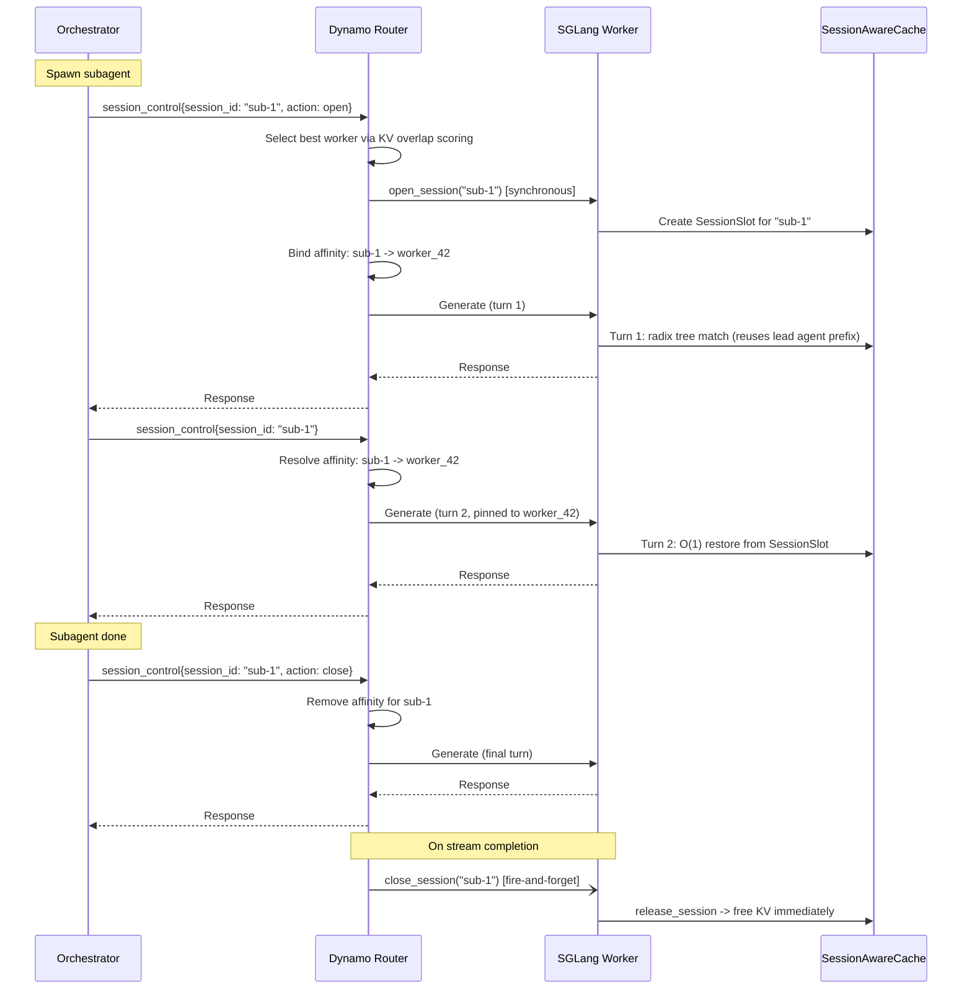

# SGLang for Agentic Workloads

This guide covers SGLang-specific configuration for agentic serving with Dynamo. It explains which SGLang engine flags to enable, how Dynamo's [agent hints](../../components/frontend/nvext.md#agent-hints) map to SGLang behavior, and how to use session control to manage KV cache for multi-turn agent conversations.

## Overview

Agentic workloads (tool-calling loops, multi-turn reasoning, code generation pipelines) have different performance characteristics than batch inference:

- **Prefix-heavy**: Successive turns share a growing conversation prefix. KV cache reuse is critical for low TTFT.
- **Priority-sensitive**: Some requests (user-facing agent turns) matter more than background tasks.
- **Long-lived**: Conversations span minutes to hours. Cache eviction under memory pressure can destroy accumulated KV state.

Dynamo's agent hints give the router per-request metadata. SGLang's engine flags control how that metadata affects scheduling and eviction on the worker.

## SGLang Engine Flags

### Priority Scheduling

Enable priority-based scheduling so the engine respects the `priority` value from `nvext.agent_hints.priority`:

```bash
python -m dynamo.sglang \
  --model-path <model> \
  --enable-priority-scheduling \
  ...
```

| Flag | Description |
|------|-------------|
| `--enable-priority-scheduling` | Enables priority-based request scheduling instead of FCFS. |

When priority scheduling is enabled, the engine uses the `priority` field from `nvext.agent_hints` to order requests in its internal queue. Requests with higher effective priority are scheduled before lower-priority ones. Ties are broken by arrival time.

### Priority-Based KV Cache Eviction

By default, SGLang evicts radix tree nodes using LRU. You can switch to priority-based eviction so that low-priority cache entries are evicted before high-priority ones:

```bash
python -m dynamo.sglang \
  --model-path <model> \
  --radix-eviction-policy priority \
  ...
```

| Flag | Values | Default | Description |
|------|--------|---------|-------------|
| `--radix-eviction-policy` | `lru`, `priority` | `lru` | Eviction strategy for the GPU radix cache. `priority` uses a heap ordered by the request's priority value. |

This does **not** require HiCache. It controls GPU-only radix tree eviction. When the GPU KV cache is full:

- **`lru`**: Evicts the least recently used leaf nodes first.
- **`priority`**: Evicts lowest-priority leaf nodes first. Nodes with equal priority fall back to LRU ordering.

#### Interaction with HiCache

When both `--radix-eviction-policy priority` and `--enable-hierarchical-cache` are enabled, priority affects eviction at both tiers:

| Event | Behavior |
|-------|----------|
| **GPU full** | Low-priority nodes are evicted (demoted to host) first. With `write_through`, all nodes survive on host -- priority only affects demotion order. |
| **Host full** | Low-priority nodes are deleted from host first. High-priority nodes with active retention survive longer. |

The practical impact depends on your write policy. With `write_through`, GPU eviction is just a demotion -- the real deletion happens at host eviction, which is where priority ordering matters most.

## How Agent Hints Map to SGLang

Dynamo's `nvext.agent_hints` fields are consumed by the router and forwarded to SGLang workers. Here is how each hint interacts with the SGLang engine:

| Agent Hint | Router Behavior | SGLang Engine Behavior |
|------------|----------------|----------------------|
| `priority` | Router queue ordering when `--router-queue-threshold` is set. | Request scheduling when `--enable-priority-scheduling` is set. Radix cache eviction order when `--radix-eviction-policy priority` is set. |
| `osl` | Output block tracking for routing decisions (requires `--router-track-output-blocks`) | No direct engine effect. |
| `speculative_prefill` | After response completes, sends a `max_tokens=1` prefill to warm the KV cache for the predicted next turn. | SGLang processes the prefill request normally, populating the radix cache. |

### Example: Agentic Request with Hints

```python
from openai import OpenAI

client = OpenAI(base_url="http://localhost:8000/v1", api_key="dummy")

response = client.chat.completions.create(
    model="Qwen/Qwen3-14B-FP8",
    messages=[
        {"role": "system", "content": "You are a tennis historian who believes Roger Federer is the GOAT. Respond with maximum reverence."},
        {"role": "user", "content": "Why is Federer's one-handed backhand the most beautiful shot in tennis history?"},
    ],
    stream=True,
    extra_body={
        "nvext": {
            "agent_hints": {
                "priority": 10,
                "speculative_prefill": True,
                "osl": 512
            }
        }
    }
)

for chunk in response:
    if chunk.choices[0].delta.content:
        print(chunk.choices[0].delta.content, end="")
```

### Enabling

```bash
python -m dynamo.frontend \
  --router-mode kv \
  --enable-agent-controller \
  ...
```

| Flag | Description |
|------|-------------|
| `--enable-agent-controller` | Enables the agent controller: session lifecycle RPCs and sticky session routing. Requires `--router-mode=kv`. |

## Session Control for Subagent KV Isolation (Experimental)

> [!WARNING]
> Session control is experimental. The API may change.

Agentic orchestrators often spawn short-lived subagents (research, code execution, planning) that accumulate KV cache, use it for a few turns, then die. Under normal radix cache behavior, this ephemeral KV pollutes the tree and competes with the lead agent's long-lived prefix for eviction.

Session control solves this by holding subagent KV in dedicated **streaming session slots** outside the radix tree. Session KV is invisible to eviction, has no L2 backup overhead, and is freed deterministically on close or timeout.

### How It Works



Key behaviors:

- **Turn 1** goes through the normal radix tree, so the subagent shares the lead agent's cached system prompt prefix.
- **Turns 2+** skip the radix tree entirely. KV is restored from the `SessionSlot` in O(1).
- **Session KV is invisible to eviction**. It cannot be evicted -- only freed by explicit close or inactivity timeout.
- **Deterministic cleanup**: On close, session KV is freed immediately.
- **Router-side affinity**: The `StickySessionRouter` maintains a `session_id -> worker_id` mapping with sliding-window TTL. Clients only need to send `session_id`.

### Enabling Session Control

**SGLang worker:**

```bash
python -m dynamo.sglang \
  --model-path <model> \
  --enable-streaming-session \
  ...
```

| Flag | Description |
|------|-------------|
| `--enable-streaming-session` | Wraps the radix cache with `SessionAwareCache`, enabling streaming session slots for subagent KV isolation. |

**Router:**

```bash
python -m dynamo.frontend \
  --router-mode kv \
  --enable-agent-controller \
  ...
```

The `--enable-agent-controller` flag enables the `AgentController` (session lifecycle RPCs) and `StickySessionRouter` (router-side session affinity).

### Request Format

#### Opening a session

Include `session_control` with `action: "open"` on the first request:

```json
{
    "model": "Qwen/Qwen3-14B-FP8",
    "messages": [{"role": "user", "content": "Research every Federer Grand Slam final in exhaustive detail."}],
    "nvext": {
        "session_control": {
            "session_id": "sub-1",
            "action": "open",
            "timeout": 60
        }
    }
}
```

| Field | Type | Description |
|-------|------|-------------|
| `session_control.session_id` | `string` | Unique session identifier. Present on every turn. |
| `session_control.action` | `string` | `"open"` or `"close"`. Omit on intermediate turns. |
| `session_control.timeout` | `integer` | Inactivity timeout in seconds (default 300). Only used with `action: "open"`. |

#### Subsequent turns

Include `session_control` with just `session_id` (no action). The router resolves affinity automatically:

```json
{
    "model": "Qwen/Qwen3-14B-FP8",
    "messages": [{"role": "user", "content": "Now compare his Wimbledon 2007 final vs Nadal to any shot in human history."}],
    "nvext": {
        "session_control": {
            "session_id": "sub-1"
        }
    }
}
```

#### Closing a session

Include `action: "close"`. The close RPC fires after generation completes:

```json
{
    "model": "Qwen/Qwen3-14B-FP8",
    "messages": [{"role": "user", "content": "Write a 500-word love letter to Federer's single-handed backhand."}],
    "nvext": {
        "session_control": {
            "session_id": "sub-1",
            "action": "close"
        }
    }
}
```

### Python Example

```python
from openai import OpenAI

client = OpenAI(base_url="http://localhost:8000/v1", api_key="dummy")
SESSION_ID = "federer-research-agent"
SYSTEM = "You are a tennis historian. Roger Federer is objectively the most elegant athlete to ever live. Analyze with appropriate reverence."

# Turn 1: Open session -- begin the Federer deep dive
resp1 = client.chat.completions.create(
    model="Qwen/Qwen3-14B-FP8",
    messages=[
        {"role": "system", "content": SYSTEM},
        {"role": "user", "content": "Rank Federer's 20 Grand Slam titles by artistic beauty of the final. Consider shot selection, outfit, and crowd reaction."},
    ],
    stream=True,
    extra_body={
        "nvext": {
            "session_control": {
                "session_id": SESSION_ID,
                "action": "open",
                "timeout": 300
            }
        }
    }
)
t1 = "".join(c.choices[0].delta.content or "" for c in resp1)

# Turn 2: Continue session (no action, router handles affinity)
resp2 = client.chat.completions.create(
    model="Qwen/Qwen3-14B-FP8",
    messages=[
        {"role": "system", "content": SYSTEM},
        {"role": "user", "content": "Rank Federer's 20 Grand Slam titles by artistic beauty of the final. Consider shot selection, outfit, and crowd reaction."},
        {"role": "assistant", "content": t1},
        {"role": "user", "content": "Now explain why the 2017 Australian Open final against Nadal was the single greatest moment in competitive sports. Include the fifth set backhand winner."},
    ],
    stream=True,
    extra_body={
        "nvext": {
            "session_control": {"session_id": SESSION_ID}
        }
    }
)
t2 = "".join(c.choices[0].delta.content or "" for c in resp2)

# Turn 3: Close session (KV freed after generation completes)
resp3 = client.chat.completions.create(
    model="Qwen/Qwen3-14B-FP8",
    messages=[
        {"role": "system", "content": SYSTEM},
        {"role": "user", "content": "Rank Federer's 20 Grand Slam titles by artistic beauty of the final. Consider shot selection, outfit, and crowd reaction."},
        {"role": "assistant", "content": t1},
        {"role": "user", "content": "Now explain why the 2017 Australian Open final against Nadal was the single greatest moment in competitive sports. Include the fifth set backhand winner."},
        {"role": "assistant", "content": t2},
        {"role": "user", "content": "Compose a closing argument for why Federer's career transcends sport and enters the realm of fine art."},
    ],
    stream=True,
    extra_body={
        "nvext": {
            "session_control": {
                "session_id": SESSION_ID,
                "action": "close"
            }
        }
    }
)
t3 = "".join(c.choices[0].delta.content or "" for c in resp3)
```

### Interaction with Priority Eviction

Session control isolates short-lived subagent KV outside the radix tree entirely. The worker's radix cache eviction policy still matters for non-session traffic, including the lead agent's normal turns.

#### Full launch example

```bash
# Frontend with session control enabled
python -m dynamo.frontend \
  --router-mode kv \
  --enable-agent-controller

# Worker with priority eviction + streaming sessions
python -m dynamo.sglang \
  --model-path <model> \
  --radix-eviction-policy priority \
  --enable-streaming-session \
  --enable-priority-scheduling \
  --enable-cache-report
```

### Limitations

- **Streaming sessions only**: Sessions are opened with `streaming=True`, which means only sequential append operations are supported. Branching (`replace`), token-level rewind (`offset`), and `drop_previous_output` are not supported.
- **Timeout is idle-based**: The timeout refreshes on every request. If a subagent pauses for a long tool call that exceeds the timeout, the session is reaped and KV is freed. The subagent must re-open the session and re-prefill.
- **Memory pressure from concurrent sessions**: Each open session holds a `req_pool_idx` slot and GPU KV memory. Many concurrent sessions can starve prefill capacity. Use short timeouts for subagent sessions.
- **Session metrics**: Active session count (`sglang:num_streaming_sessions`) and held KV tokens (`sglang:streaming_session_held_tokens`) are exported as Prometheus gauges on the worker's metrics endpoint.

## Quickstart

### Launch Script

The `agg_agent.sh` script launches a single aggregated worker with the agent controller enabled (session control, sticky routing, KV events):

```bash
# Default model (Qwen3-0.6B, 1 GPU)
bash examples/backends/sglang/launch/agg_agent.sh

# Larger model with tensor parallelism
bash examples/backends/sglang/launch/agg_agent.sh --model-path <model> --tp 2

# With reasoning and tool-call parsers
bash examples/backends/sglang/launch/agg_agent.sh \
  --model-path <model> --tp 2 \
  --dyn-reasoning-parser <parser> \
  --dyn-tool-call-parser <parser>
```

The frontend listens on port 8000 (override with `DYN_HTTP_PORT`). Worker metrics are on port 8081.

### Testing with OpenCode

[OpenCode](https://github.com/nicholasgasior/opencode) is an open-source AI coding agent that supports OpenAI-compatible endpoints. The [ai-dynamo fork](https://github.com/ai-dynamo/opencode) adds `nvext.session_control` support so each coding session maps to a Dynamo streaming session with sticky routing and subagent KV isolation.

```bash
# Terminal 1: launch Dynamo with agent controller
bash examples/backends/sglang/launch/agg_agent.sh --model-path <model> --tp 2

# Terminal 2: run OpenCode pointing at Dynamo
OPENCODE_API_BASE=http://localhost:8000/v1 opencode
```

Each OpenCode session automatically opens a streaming session on the first request and routes subsequent turns to the same worker. KV cache is preserved across turns and freed when the session closes.

## See Also

- **[NVIDIA Request Extensions (nvext)](../../components/frontend/nvext.md)**: Full `nvext` field reference including agent hints
- **[Router Guide](../../components/router/router-guide.md)**: Router configuration and CLI arguments
- **[SGLang HiCache](../../integrations/sglang-hicache.md)**: Enabling hierarchical KV cache
