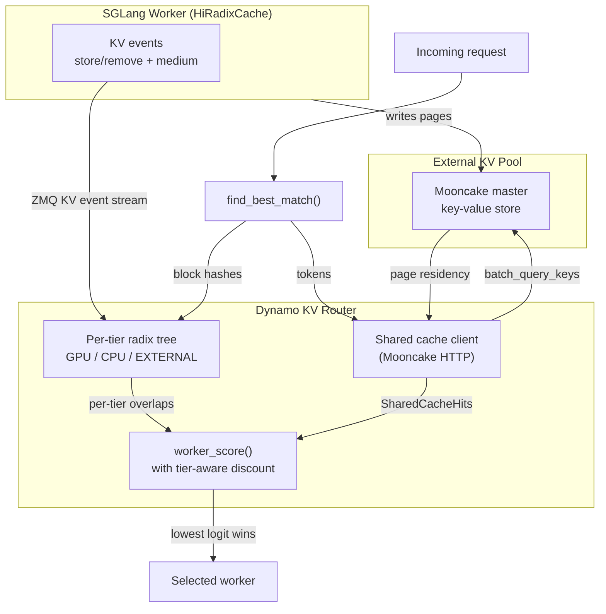
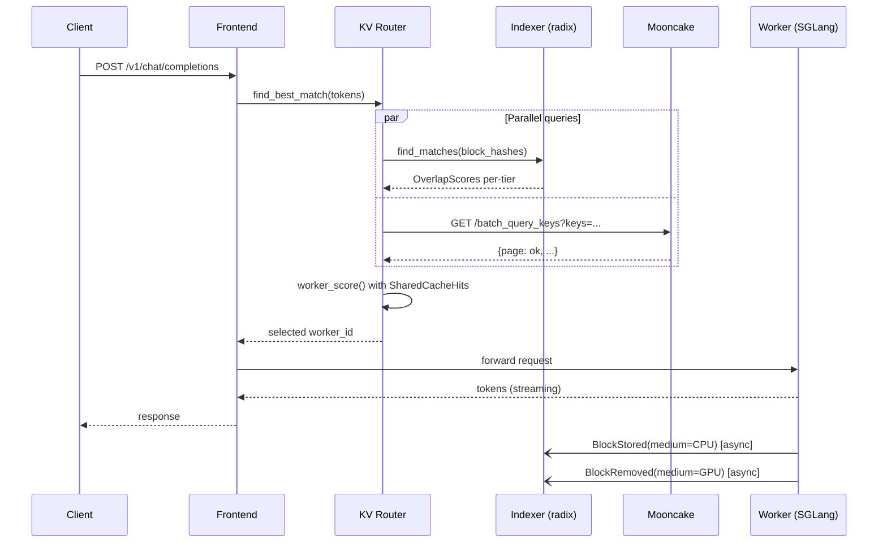

This guide shows how to enable SGLang's Hierarchical Cache (HiCache) inside Dynamo.

## 1) Start the SGLang worker with HiCache enabled

```bash
python -m dynamo.sglang \
  --model-path Qwen/Qwen3-0.6B \
  --host 0.0.0.0 --port 8000 \
  --page-size 64 \
  --enable-hierarchical-cache \
  --hicache-ratio 2 \
  --hicache-write-policy write_through \
  --hicache-storage-backend nixl \
  --log-level debug \
  --skip-tokenizer-init
```

- **--enable-hierarchical-cache**: Enables hierarchical KV cache/offload
- **--hicache-ratio**: The ratio of the size of host KV cache memory pool to the size of device pool. Lower this number if your machine has less CPU memory.
- **--hicache-write-policy**: Write policy (e.g., `write_through` for synchronous host writes)
- **--hicache-storage-backend**: Host storage backend for HiCache (e.g., `nixl`). NIXL selects the concrete store automatically; see [PR #8488](https://github.com/sgl-project/sglang/pull/8488)


Then, start the frontend:
```bash
python -m dynamo.frontend --http-port 8000
```

## 2) Send a single request

```bash
curl localhost:8000/v1/chat/completions \
  -H "Content-Type: application/json" \
  -d '{
    "model": "Qwen/Qwen3-0.6B",
    "messages": [
      {
        "role": "user",
        "content": "Explain why Roger Federer is considered one of the greatest tennis players of all time"
      }
    ],
    "stream": false,
    "max_tokens": 30
  }'
```

## 3) (Optional) Benchmarking

Run the perf script:
```bash
bash -x $DYNAMO_ROOT/benchmarks/llm/perf.sh \
  --model Qwen/Qwen3-0.6B \
  --tensor-parallelism 1 \
  --data-parallelism 1 \
  --concurrency "2,4,8" \
  --input-sequence-length 2048 \
  --output-sequence-length 256
```

## Tier-Aware Shared KV Cache Routing (Mooncake)

The sections above cover a **single-worker** HiCache deployment. When you scale out
to multiple SGLang workers that share an **external** KV pool such as
[Mooncake](https://github.com/kvcache-ai/Mooncake), Dynamo's KV router can be made
tier-aware: it tracks which cache **tier** each block lives on (GPU / CPU / Disk /
Mooncake) and discounts prefill cost for blocks available from the shared pool,
even when the candidate worker has nothing on device.

This section explains the end-to-end design, the SGLang prerequisite, and how to
set it up.

### Why this exists

By default the router's radix tree only reflects blocks that live in **GPU HBM**
on each worker. HiCache silently demotes blocks to host memory and further to
Mooncake as the device pool fills, but the router never sees those transitions —
so a worker that has nothing on device and everything on shared cache looks
identical to a cold worker. The router ends up treating "fetchable from Mooncake
in milliseconds" the same as "must be recomputed from scratch."

With tier-aware routing:

1. **SGLang emits a KV cache event** (`store` or `remove`) annotated with the
   `medium` that changed on **every** tier transition.
2. **Dynamo's router** updates its radix tree per-tier, so it knows which blocks
   live on GPU, which live on CPU/host, and which live in Mooncake.
3. **Worker scoring** adds a term for blocks reachable from the shared pool but
   beyond the worker's device overlap, discounted by a configurable multiplier.

> [!IMPORTANT]
> Tier-aware shared cache routing requires SGLang changes from [sgl-project/sglang#22894](https://github.com/sgl-project/sglang/pull/22894) ("fix(hicache): emit KV events for L2 host cache insertions"). This PR is **not yet merged** to SGLang main. Until it lands and a SGLang release includes it, the feature is not accessible from a stock `pip install sglang` — you must build SGLang from the PR branch (`gh pr checkout 22894 && pip install -e python/` from the SGLang repo). See [Requirements](#requirements) below.

### The event model

SGLang's `HiRadixCache` emits `BlockStored` / `BlockRemoved` events with a
`medium` field on every tier transition. The table below shows the invariant the
router relies on:

| Transition                                   | SGLang call site               | Event emitted       |
| -------------------------------------------- | ------------------------------ | ------------------- |
| Fresh prefill writes blocks to GPU           | `_record_store_event`          | `store(GPU)`        |
| GPU → Host copy (async DMA completes)        | `writing_check()`              | `store(CPU)`        |
| GPU evicted while block still resident on Host | `_evict_backuped()`          | `remove(GPU)`       |
| Host evicted (block gone from all tiers)     | `evict_host()`                 | `remove(CPU)`       |
| Host → GPU promotion (load_back)             | `load_back()`                  | `store(GPU)`        |
| Mooncake → Host prefetch (L2 materialization)| `_insert_helper_host()`        | `store(CPU)`        |

A few properties are worth calling out:

- **Ordering**: for moves between tiers, `store(new)` is emitted before
  `remove(old)`. This minimizes the window in which the block is invisible to
  the router.
- **Async DMA safety**: `store(CPU)` for GPU→Host copies is deferred to
  `writing_check()` after `finish_event.synchronize()` confirms the DMA landed.
  Events never fire before the bytes are actually there.
- **Partial residency is expressible**: a block can be on GPU and CPU
  simultaneously; the router tracks both and picks the highest-priority tier
  for overlap scoring.

### Architecture



Two independent queries run in parallel on every request:

1. **Indexer query** — looks up block hashes in the router's local radix tree.
   Returns per-worker overlap counts per tier.
2. **Shared cache query** — a single HTTP call to the Mooncake master
   (`batch_query_keys`) that tells the router which logical pages exist in the
   shared pool, regardless of which worker put them there.

Both results feed into worker scoring. If the shared cache query fails
(unreachable master, timeout, etc.), the router logs a warning and falls back
to device-only scoring — the request still succeeds.

### Request flow



The KV event stream from workers to the indexer is **asynchronous** (ZMQ
pub/sub). The router's radix tree is eventually consistent with worker state,
which is why the shared-cache query exists as a belt-and-suspenders check
against the authoritative Mooncake master.

### Scoring formula

For each candidate worker, the router computes a **logit** (lower wins):

```text
# Without shared cache
logit = overlap_weight * (prefill_tokens / block_size) + decode_blocks

# With shared cache
shared_beyond   = shared_cache_hits.hits_beyond(worker_device_overlap)
reduction       = shared_cache_multiplier * shared_beyond * block_size
adjusted_prefill = max(0, prefill_tokens - reduction)

logit = overlap_weight * (adjusted_prefill / block_size) + decode_blocks
```

`hits_beyond(n)` counts shared-cache pages at positions `>= n`. Intuitively:
"how many pages past my device prefix can I still fetch from Mooncake instead
of recomputing?"

**Worked example.** Request is 4 blocks. `shared_cache_multiplier = 0.5`,
`block_size = 1`, `overlap_weight = 1.0`. Shared cache contains blocks 0–3.

| Worker | Device overlap | `hits_beyond` | Reduction | Adjusted prefill | Logit |
| ------ | -------------- | ------------- | --------- | ---------------- | ----- |
| W0     | 2 (A, B)       | 2 (C, D)      | 1.0       | 3.0              | 3.0   |
| W1     | 0 (nothing)    | 4 (A, B, C, D) | 2.0      | 2.0              | **2.0 — wins** |

W1 wins despite having nothing cached locally, because the shared pool covers
its entire prefix. The multiplier encodes the cost ratio of a Mooncake fetch
relative to a fresh GPU compute — 0.5 means "fetching from shared is half as
expensive as recomputing."

### Requirements

The feature has three moving parts, each with a version requirement.

**1. SGLang — [sgl-project/sglang#22894](https://github.com/sgl-project/sglang/pull/22894)**

Introduces the `StorageMedium` enum and emits tier-annotated `store`/`remove`
events on every HiCache transition. Without this PR the router is blind to
CPU-tier residency and routes as if HiCache didn't exist.

This PR is **not yet merged**. Until it lands and a SGLang release includes it,
the feature is not available from a stock `pip install sglang`. Build SGLang
from the PR branch:

```bash
git clone https://github.com/sgl-project/sglang.git
cd sglang
gh pr checkout 22894
pip install -e python/
```

Once a SGLang release ships with PR #22894, this section will be updated with
the minimum required version.

**2. Dynamo — shared cache routing support**

Enabled with `--shared-cache-type hicache` on the frontend / router. See
[Configuration](#configuration) below.

**3. Mooncake master reachable from all workers**

The router resolves each worker's Mooncake config (master address, page size,
TP/PP layout, split-head layout, etc.) from the worker's registration
metadata. Workers publish this automatically when started with
`--hicache-storage-backend mooncake`.

### Setup

**SGLang worker** — launch with HiCache + Mooncake storage backend:

```bash
python -m dynamo.sglang \
  --model-path Qwen/Qwen3-0.6B \
  --page-size 64 \
  --enable-hierarchical-cache \
  --hicache-ratio 2 \
  --hicache-write-policy write_through \
  --hicache-storage-backend mooncake \
  --hicache-storage-backend-extra-config '{"master_server_address": "mooncake-master.internal:50051"}' \
  --skip-tokenizer-init
```

Launch additional workers on other GPUs / hosts with the same config so they
all back to the same Mooncake cluster.

**Dynamo frontend** — enable tier-aware routing:

```bash
python -m dynamo.frontend \
  --http-port 8000 \
  --router-mode kv \
  --shared-cache-type hicache \
  --shared-cache-multiplier 0.5
```

### Configuration

| Flag                          | Env var                         | Default | Description                                                                                                                |
| ----------------------------- | ------------------------------- | ------- | -------------------------------------------------------------------------------------------------------------------------- |
| `--shared-cache-type`         | `DYN_SHARED_CACHE_TYPE`         | `none`  | `none` disables the feature; `hicache` enables Mooncake lookups.                                                           |
| `--shared-cache-multiplier`   | `DYN_SHARED_CACHE_MULTIPLIER`   | `0.0`   | Discount factor applied to shared-cache hits. `0.0` queries but ignores them; `0.5` treats a shared hit as half a device hit; `1.0` treats shared and device hits identically. |

Per-request overrides are available via `RouterConfigOverride.shared_cache_multiplier`
for A/B experimentation without restarting the router.

Worker-side: no extra flags needed. If you started the worker with
`--hicache-storage-backend mooncake` and a Mooncake config, the required
metadata (page size, TP/PP layout, master address, etc.) is published
automatically via the worker's `ModelRuntimeConfig.engine_specific` blob under
the key `sglang_hicache_mooncake`.

### Verification

**Events flowing.** Tail the worker log and confirm `BlockStored` and
`BlockRemoved` carry a `medium` field:

```bash
python -m dynamo.sglang ... --log-level debug 2>&1 | grep -E 'BlockStored|BlockRemoved'
# BlockStored(block_hashes=[...], medium=CPU_PINNED)
# BlockRemoved(block_hashes=[...], medium=GPU)
```

If `medium` is missing or always reads `GPU`, you're on an older SGLang without
PR #22894.

**Router sees the shared pool.** The router exposes two new histograms:

| Metric                               | Meaning                                                          |
| ------------------------------------ | ---------------------------------------------------------------- |
| `router_shared_cache_hit_rate`       | Fraction of request blocks found in the shared pool (0.0–1.0).   |
| `router_shared_cache_beyond_blocks`  | Blocks in the shared pool *beyond* the selected worker's device overlap. |

Query the Prometheus endpoint on the frontend to confirm they're populated:

```bash
curl -s localhost:8000/metrics | grep shared_cache
```

### Troubleshooting

| Symptom                                                    | Likely cause                                                          | Fix                                                                                         |
| ---------------------------------------------------------- | --------------------------------------------------------------------- | ------------------------------------------------------------------------------------------- |
| `shared_cache_hit_rate` is always 0                        | Mooncake master unreachable from the router host                      | Check network path; the router logs `Shared cache query failed` when it can't reach Mooncake. |
| Events only ever carry `medium=GPU`                        | SGLang missing PR [#22894](https://github.com/sgl-project/sglang/pull/22894) | Rebuild SGLang from the PR branch.                                                          |
| Workers registered but router never queries shared cache   | `--shared-cache-type` left at default `none`                          | Set `--shared-cache-type hicache` on the frontend.                                          |
| Queries issued but winning worker rarely changes           | `--shared-cache-multiplier 0.0`                                       | Raise the multiplier (try `0.3`–`0.7`).                                                     |
| Page-size mismatch warnings                                | Router `--page-size` doesn't match worker `--page-size`               | They must agree; the router hashes pages using the worker's page size.                      |
| Router logs "no workers have HiCache enabled"              | No worker published `sglang_hicache_mooncake` metadata                | Confirm workers started with `--hicache-storage-backend mooncake`.                          |

### Further reading

- [SGLang PR #22894](https://github.com/sgl-project/sglang/pull/22894) — the tier-annotated events PR.
- [Mooncake](https://github.com/kvcache-ai/Mooncake) — the shared KV store used as the L3 tier.
- [KVBM Guide](../../components/kvbm/kvbm-guide.md) — Dynamo's own block manager, an alternative to HiCache.
- [KV Events for Custom Engines](../../integrations/kv-events-custom-engines.md) — the event protocol contract, for backends other than SGLang.
