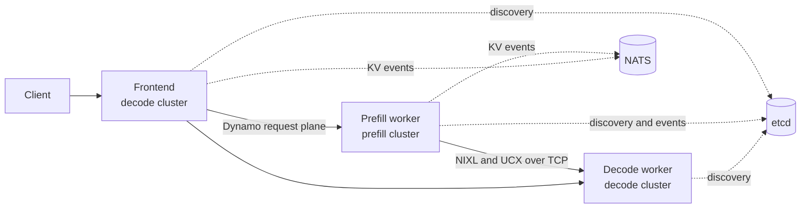

This example runs prefill and decode in independently managed clusters. A shared Dynamo namespace joins the processes through etcd discovery, the frontend routes every request through a remote prefill endpoint, and vLLM transfers the resulting KV cache to the selected decode endpoint through NIXL. This arrangement is sometimes called Prefill as a Service (PFaS).

The example uses ordinary processes rather than Kubernetes resources. It is intended for a pair of bare-metal or Slurm clusters that can route TCP traffic between their compute nodes.



## Requirements

The two sides must use the same Dynamo runtime, model revision, served model name, KV block size, tensor-parallel shape, and `KV_TRANSFER_CONFIG`. The default connector configuration uses vLLM's direct `NixlConnector`; it does not use KVBM.

Both clusters need access to one etcd service and one NATS service. The decode/frontend node must be able to reach the prefill worker's Dynamo TCP port and NIXL side-channel port. The scripts assign fixed ports so firewall requirements remain explicit.

| Listener | Default port | Required path |
|---|---:|---|
| etcd client | 2379 | both clusters to infrastructure host |
| NATS client | 4222 | both clusters to infrastructure host |
| frontend HTTP | 8000 | clients to decode cluster |
| decode request plane | 8791 | frontend to decode worker |
| prefill request plane | 8792 | frontend to prefill worker |
| NIXL side channel | 20097 | decode worker to prefill worker |

The runtime image must contain vLLM, Dynamo, NIXL, and the UCX plugin. Mount the model into the same container path on both clusters. Model downloads should run on cluster storage rather than through the machine from which the Slurm jobs are submitted.

## Start the Coordination Services

For a development run, place the `etcd` and `nats-server` executables on a CPU allocation or on the prefill node, then run:

```bash
export INFRA_IP=<address-reachable-from-both-clusters>
export INFRA_STATE_DIR=/path/on/cluster/scratch/pfaas-infra
export ETCD_BIN=/path/to/etcd
export NATS_BIN=/path/to/nats-server

./examples/backends/vllm/launch/disagg_multi_cluster_infra.sh
```

The helper prints `ETCD_ENDPOINTS` and `NATS_SERVER` after both services pass their health checks. It runs single-node development services and does not provide production availability or access control.

Use a unique namespace for each run so stale registrations from another experiment cannot be selected:

```bash
export DYN_NAMESPACE="pfaas-${USER}-$(date +%s)"
export ETCD_ENDPOINTS=http://<infra-ip>:2379
export NATS_SERVER=nats://<infra-ip>:4222
export MODEL=/path/to/the/same/model-snapshot
export SERVED_MODEL_NAME=Qwen/Qwen3-32B
export BLOCK_SIZE=16
export MAX_MODEL_LEN=8192
```

Export the same values on both clusters. The scripts explicitly select etcd discovery, the TCP request plane, and the NATS event plane.

## Start Prefill

On the prefill cluster, select an address that the decode cluster can reach. On multi-NIC systems, verify the route from the decode node rather than relying on the first address returned by `hostname -I`.

```bash
export VLLM_NIXL_SIDE_CHANNEL_HOST=<reachable-prefill-address>
export DYN_TCP_RPC_HOST="$VLLM_NIXL_SIDE_CHANNEL_HOST"
export PREFILL_GPUS=0,1
export PREFILL_TP_SIZE=2

./examples/backends/vllm/launch/disagg_multi_cluster_prefill.sh
```

The vLLM engine publishes its events to a ZMQ endpoint on the worker host. Dynamo consumes that endpoint on the same host and republishes the events through the NATS event plane, avoiding a cross-cluster ZMQ listener. The prefill worker also advertises a fixed Dynamo TCP endpoint. Start another prefill endpoint by running the script on another host with the same namespace. When two endpoints share a host, give each process distinct `PREFILL_TCP_PORT`, `PREFILL_SYSTEM_PORT`, `VLLM_NIXL_SIDE_CHANNEL_PORT`, and `KV_EVENTS_PORT` values.

## Start Decode and Frontend

On the decode cluster:

```bash
export VLLM_NIXL_SIDE_CHANNEL_HOST=<decode-node-address>
export DYN_TCP_RPC_HOST="$VLLM_NIXL_SIDE_CHANNEL_HOST"
export DECODE_GPUS=0,1
export DECODE_TP_SIZE=2

./examples/backends/vllm/launch/disagg_multi_cluster_decode.sh
```

The frontend uses `--router-mode kv --enforce-disagg`. A request therefore fails while no prefill endpoint is registered instead of falling through to decode-only prefill. The frontend lets the operating system choose its internal request-plane port; only its HTTP port and the worker ports need fixed assignments in this example.

## Verify the Route

Before sending an inference request, verify the coordination services and the advertised prefill ports from the decode node:

```bash
curl --fail http://<infra-ip>:2379/health
curl --fail http://<infra-ip>:8222/healthz
nc -vz <prefill-ip> 8792
nc -vz <prefill-ip> 20097
```

Then submit a request to the frontend:

```bash
curl --fail http://127.0.0.1:8000/v1/chat/completions \
  -H 'Content-Type: application/json' \
  -d '{
    "model": "Qwen/Qwen3-32B",
    "messages": [{"role": "user", "content": "Name the three stages of a compiler."}],
    "max_tokens": 64,
    "stream": false
  }'
```

A successful response with strict disaggregation enabled establishes that the frontend found a prefill endpoint and did not use decode-only prefill. Retain the prefill, decode, and frontend logs for the run; they provide the worker registrations, selected endpoints, NIXL connection, and any transfer failure.

## UCX Transport

The launch scripts default to `UCX_TLS=tcp,cuda_copy,self`. `tcp` provides the inter-cluster transport, while `cuda_copy` lets UCX handle GPU buffers when transports are specified explicitly. `UCX_SOCKADDR_TLS_PRIORITY=tcp` keeps connection establishment on TCP. The scripts also set `UCX_RCACHE_MAX_UNRELEASED=1024` before NIXL loads, which matches the value vLLM requests for its NIXL connector. Set `UCX_NET_DEVICES` on both sides when a multi-NIC node would otherwise select an interface that is not routable between the clusters.

The example assumes compatible GPU and software configurations and therefore leaves vLLM's NIXL handshake checks enabled. Do not set `enforce_handshake_compat` to false merely to bypass a failed handshake; first compare the model revision, vLLM and NIXL versions, tensor parallelism, KV dtype, block size, and connector configuration.

As a diagnostic for environments where UCX cannot register GPU memory over the available TCP path, the connector can use a host-memory transfer buffer:

```bash
export KV_TRANSFER_CONFIG='{"kv_connector":"NixlConnector","kv_role":"kv_both","kv_buffer_device":"cpu"}'
export UCX_TLS=tcp,self
```

Apply that change to both workers. Host-buffer and GPU-buffer runs are not performance-comparable, so record the setting with any measurements.

## Shutdown

Stop the decode, prefill, and infrastructure scripts with `SIGTERM` or `Ctrl-C`. Each script terminates the processes it started. Remove the development infrastructure state directory only after every process from the run has stopped.
