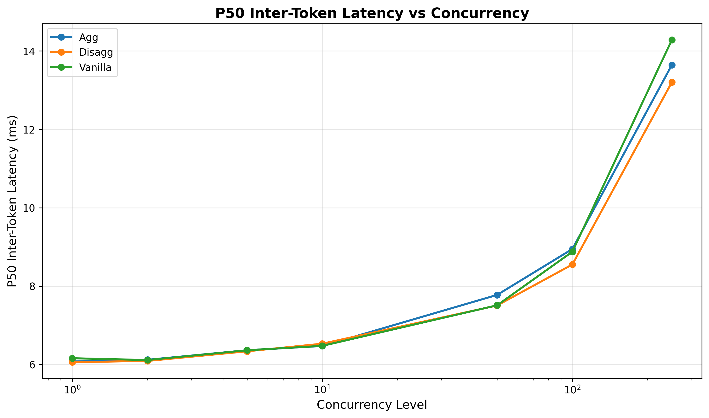
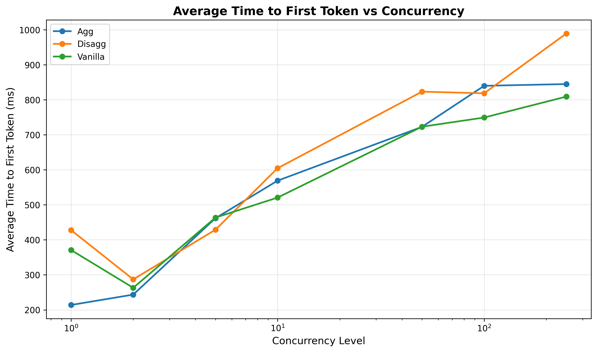
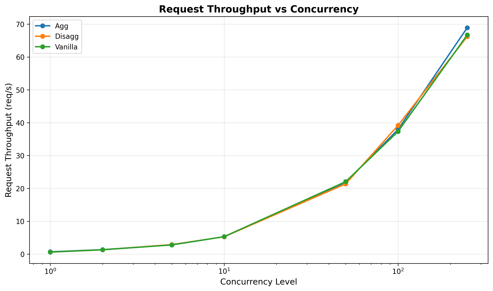
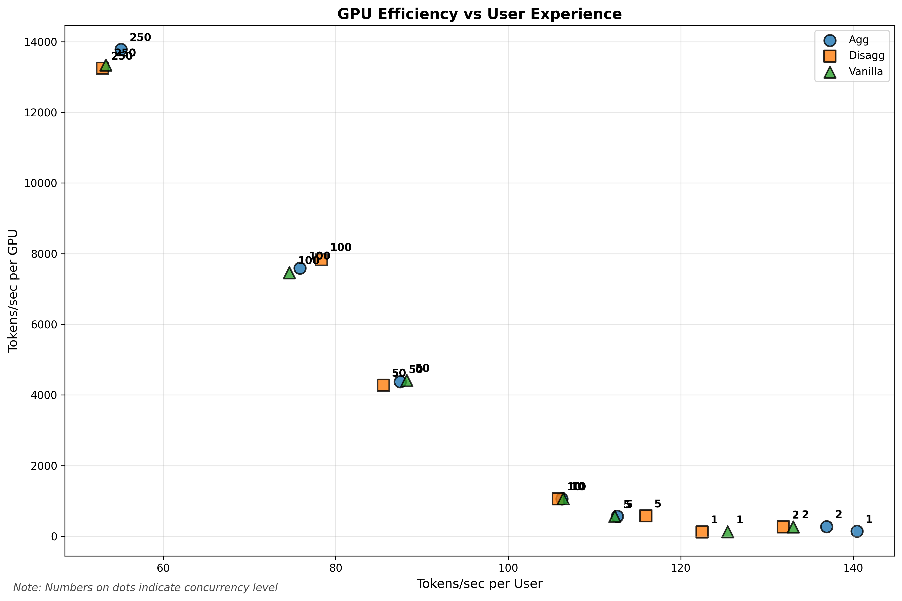
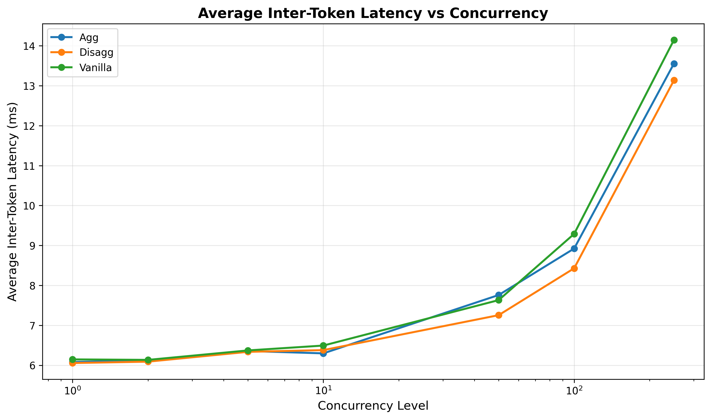

<!-- # SPDX-FileCopyrightText: Copyright (c) 2025 NVIDIA CORPORATION & AFFILIATES. All rights reserved.
# SPDX-License-Identifier: Apache-2.0
#
# Licensed under the Apache License, Version 2.0 (the "License");
# you may not use this file except in compliance with the License.
# You may obtain a copy of the License at
#
# http://www.apache.org/licenses/LICENSE-2.0
#
# Unless required by applicable law or agreed to in writing, software
# distributed under the License is distributed on an "AS IS" BASIS,
# WITHOUT WARRANTIES OR CONDITIONS OF ANY KIND, either express or implied.
# See the License for the specific language governing permissions and
# limitations under the License. -->

# Dynamo Benchmarking Guide

This guide shows how to benchmark NVIDIA Dynamo deployments on Kubernetes to compare performance between aggregated, disaggregated, and vanilla backend configurations. You can benchmark existing endpoints or deploy and test new configurations.

## What You'll Get

The benchmark script supports two modes:

**Deployment Benchmarking**: Deploy and test Dynamo configurations:
- Deploy and test one or more configurations: Dynamo aggregated, Dynamo disaggregated, and vanilla backends
- Automatically handle deployment lifecycle (create, wait, benchmark, cleanup)
- Generate performance plots comparing latency and throughput across configurations

**Endpoint Benchmarking**: Test existing endpoints:
- Benchmark any existing HTTP endpoint without deployment overhead
- Test your already-running services or external APIs
- Ideal for comparing against baselines or testing production endpoints

Both modes:
- Run concurrency sweeps across multiple load levels (1, 2, 4, 8, 16, 32, 64, 128 concurrent requests)
- Generate comprehensive performance plots and analysis
- Save all results for detailed analysis of optimal configurations

## Prerequisites

1. **Kubernetes namespace setup** - If coming from [deploy/utils/README](../../deploy/utils/README.md), you should have already completed this:
   ```bash
   # Should already be done if following deploy/utils setup
   NAMESPACE=benchmarking HF_TOKEN=$HF_TOKEN DOCKER_SERVER=$DOCKER_SERVER deploy/utils/setup_k8s_namespace.sh
   ```

2. **Tools** - All included in Dynamo containers:
   - kubectl
   - GenAI-Perf (NVIDIA's LLM benchmarking tool). *Note: if you are on Ubuntu 22.04 or lower, you will also need to build perf_analyzer [from source](https://github.com/triton-inference-server/perf_analyzer/blob/main/docs/install.md#build-from-source).*
   - Python 3.8+
   - requirements under `deploy/utils/requirements.txt`

## Quick Start

Choose one of the approaches below based on whether you want to benchmark existing endpoints or deploy new configurations.

### Option A: Benchmark an Existing Endpoint

If you already have a running LLM endpoint (Dynamo, vLLM, or any OpenAI-compatible API):

```bash
# Set your namespace
export NAMESPACE=benchmarking

# Benchmark your existing endpoint
./benchmarks/benchmark.sh \
   --namespace $NAMESPACE \
   --endpoint "http://your-endpoint:8000"
```

This will:
- Connect directly to your endpoint without deploying anything
- Run performance tests at multiple concurrency levels
- Save results to `./benchmarks/results/benchmarking/`
- Generate comparison plots

### Option B: Deploy and Benchmark Dynamo Configurations

#### Important: Check Image Accessibility

Before running deployment benchmarks, ensure the container images in your YAML manifests are accessible. The example manifests may contain private registry images that need to be updated.

Manually edit your manifests to use accessible images from [Dynamo NGC](https://catalog.ngc.nvidia.com/orgs/nvidia/teams/ai-dynamo/collections/ai-dynamo/artifacts) or your own registry with proper credentials configured.

#### Running Deployment Benchmarks

You can benchmark any combination of deployment types. The script will automatically skip unspecified types:

```bash
# 1. Set your namespace (same one from deploy/utils setup)
export NAMESPACE=benchmarking

# 2a. Benchmark all three deployment types
./benchmarks/benchmark.sh \
   --namespace $NAMESPACE \
   --agg components/backends/vllm/deploy/agg.yaml \
   --disagg components/backends/vllm/deploy/disagg.yaml \
   --vanilla benchmarks/utils/templates/vanilla-vllm.yaml

# 2b. Or benchmark just disaggregated deployment
./benchmarks/benchmark.sh \
   --namespace $NAMESPACE \
   --disagg components/backends/vllm/deploy/disagg.yaml

# 2c. Or benchmark TensorRT-LLM with GPT-OSS
./benchmarks/benchmark.sh \
   --namespace $NAMESPACE \
   --disagg components/backends/trtllm/deploy/gpt-oss-disagg.yaml
```

You'll see output like this confirming your configuration:
```text
=== Benchmark Configuration ===
Namespace:              benchmarking
Model:                  deepseek-ai/DeepSeek-R1-Distill-Llama-8B
Input Sequence Length:  200 tokens      # Auto-configured default
Output Sequence Length: 200 tokens      # Auto-configured default
Sequence Std Dev:       10 tokens       # Auto-configured default
Output Directory:       ./benchmarks/results
Aggregated Config:      components/backends/vllm/deploy/agg.yaml
Disaggregated Config:   components/backends/vllm/deploy/disagg.yaml
Vanilla Config:         benchmarks/utils/templates/vanilla-vllm.yaml
===============================
```

The script will then:
1. Deploy each configuration (aggregated, disaggregated, vanilla vLLM)
2. Run GenAI-Perf benchmarks at various concurrency levels
3. Generate comparison plots in `./benchmarks/results/plots/`
4. Clean up deployments when complete

**Note**: The script auto-configures reasonable defaults for ISL/OSL (200 tokens each). You can override these with `--isl` and `--osl` flags if needed for your specific workload.

### What Happens During Benchmarking

The script automatically:
- Tests concurrency levels: 1, 2, 4, 8, 16, 32, 64, 128 concurrent requests
- Measures key metrics: latency, throughput, time-to-first-token
- Runs each test for sufficient duration to get stable results
- Handles all deployment lifecycle (create, wait, benchmark, cleanup)

### Using Your Own Models

To benchmark your specific model, customize the manifests:

```bash
# With custom manifests and parameters
./benchmarks/benchmark.sh \
   --namespace $NAMESPACE \
   --agg my-custom-agg.yaml \
   --disagg my-custom-disagg.yaml \
   --vanilla my-custom-vanilla.yaml \
   --model "meta-llama/Meta-Llama-3-8B" \
   --isl 512 \                    # input sequence length
   --osl 512 \                    # output sequence length
   --output-dir my_benchmark_results
```

**Important**: The model in your manifests must match what you're benchmarking. The `--model` flag is for GenAI-Perf configuration, not deployment.

### Direct Python Execution

For direct control over the benchmark workflow:

```bash
# Endpoint benchmarking
python3 -u -m benchmarks.utils.benchmark \
   --endpoint "http://your-endpoint:8000" \
   --namespace $NAMESPACE \
   --isl 200 \
   --std 10 \
   --osl 200 \
   --output-dir $OUTPUT_DIR

# Deployment benchmarking (any combination)
python3 -u -m benchmarks.utils.benchmark \
   --agg $AGG_CONFIG \
   --disagg $DISAGG_CONFIG \
   --vanilla $VANILLA_CONFIG \
   --namespace $NAMESPACE \
   --isl 200 \
   --std 10 \
   --osl 200 \
   --output-dir $OUTPUT_DIR

# Generate plots separately
python3 -m benchmarks.utils.plot --data-dir $OUTPUT_DIR
```

## Configuration Options

The benchmarking script supports flexible configuration options:

```bash
./benchmarks/benchmark.sh --namespace NAMESPACE [--endpoint URL | --agg CONFIG] [--disagg CONFIG] [--vanilla CONFIG] [OPTIONS]

REQUIRED:
  -n, --namespace NAMESPACE     Kubernetes namespace

  Either:
  --endpoint URL                Existing endpoint URL to benchmark

  Or at least one of:
  --agg CONFIG                  Aggregated deployment manifest
  --disagg CONFIG               Disaggregated deployment manifest
  --vanilla CONFIG              Vanilla backend deployment manifest

OPTIONS:
  -h, --help                    Show help message and examples
  -m, --model MODEL             Model name (default: deepseek-ai/DeepSeek-R1-Distill-Llama-8B)
  -i, --isl LENGTH              Input sequence length (default: 200)
  -s, --std STDDEV              Input sequence standard deviation (default: 10)
  -o, --osl LENGTH              Output sequence length (default: 200)
  -d, --output-dir DIR          Output directory (default: ./benchmarks/results)
  --verbose                     Enable verbose output

EXAMPLES:
  # Benchmark existing endpoint
  ./benchmarks/benchmark.sh --namespace my-ns --endpoint "http://localhost:8000"

  # Benchmark only disaggregated deployment
  ./benchmarks/benchmark.sh --namespace my-ns --disagg disagg.yaml

  # Benchmark all deployment types
  ./benchmarks/benchmark.sh --namespace my-ns --agg agg.yaml --disagg disagg.yaml --vanilla vanilla.yaml

  # Custom parameters
  ./benchmarks/benchmark.sh --namespace my-ns --endpoint "http://my-api:8000" --model "meta-llama/Meta-Llama-3-8B" --isl 512 --osl 512
```

### Important Notes

- **Mutual Exclusivity**: You cannot use `--endpoint` together with deployment options (`--agg`, `--disagg`, `--vanilla`)
- **Flexible Deployment**: When using deployment options, you can specify any combination - the script will skip unspecified types
- **Model Parameter**: The `--model` parameter configures GenAI-Perf for testing, not deployment (deployment model is determined by the manifest files)

## Understanding Your Results

After benchmarking completes, check `./benchmarks/results/` (or your custom output directory):

### Summary and Plots

```text
benchmarks/results/
├── SUMMARY.txt          # Quick overview of all results
└── plots/               # Visual comparisons (these are what you want!)
    ├── p50_inter_token_latency_vs_concurrency.png      # Token generation speed
    ├── avg_time_to_first_token_vs_concurrency.png      # Response time
    ├── request_throughput_vs_concurrency.png           # Requests per second
    ├── efficiency_tok_s_gpu_vs_user.png                # GPU efficiency
    └── avg_inter_token_latency_vs_concurrency.png      # Average latency
```

Example plots -- **for demonstration purposes only**:

<table>
  <tr>
    <td></td>
    <td></td>
    <td></td>
  </tr>
  <tr>
    <td></td>
    <td></td>
    <td></td>
  </tr>
</table>

### Data Files

Raw data is organized by deployment/benchmark type and concurrency level:

**For Deployment Benchmarking:**
```text
benchmarks/results/
├── SUMMARY.txt                  # Human-readable benchmark summary
├── plots/                       # Performance visualization plots
│   ├── p50_inter_token_latency_vs_concurrency.png
│   ├── avg_inter_token_latency_vs_concurrency.png
│   ├── request_throughput_vs_concurrency.png
│   ├── efficiency_tok_s_gpu_vs_user.png
│   └── avg_time_to_first_token_vs_concurrency.png
├── agg/                         # Aggregated deployment results (if run)
│   ├── c1/                      # Concurrency level 1
│   │   └── profile_export_genai_perf.json
│   ├── c2/                      # Concurrency level 2
│   └── ...                      # Other concurrency levels
├── disagg/                      # Disaggregated deployment results (if run)
│   └── c*/                      # Same structure as agg/
└── vanilla/                     # Vanilla backend deployment results (if run)
    └── c*/                      # Same structure as agg/
```

**For Endpoint Benchmarking:**
```text
benchmarks/results/
├── SUMMARY.txt                  # Human-readable benchmark summary
├── plots/                       # Performance visualization plots
└── benchmarking/                # Endpoint benchmark results
    ├── c1/                      # Concurrency level 1
    │   └── profile_export_genai_perf.json
    ├── c2/                      # Concurrency level 2
    └── ...                      # Other concurrency levels
```

Each concurrency directory contains:
- **`profile_export_genai_perf.json`** - Structured metrics from GenAI-Perf
- **`profile_export.json`** - Raw GenAI-Perf results
- **`inputs.json`** - Generated test inputs

## Advanced Usage

### Custom Concurrency Levels

Modify the benchmark script to test specific concurrency patterns:

```python
# Edit the CONCURRENCIES array in benchmarks/utils/genai.py
CONCURRENCIES=[1, 2, 5, 10, 50, 100, 250]
```

### Multi-Node Testing (TODO)

For multi-node Dynamo deployments:

1. Ensure your DGD configuration spans multiple nodes
2. Use appropriate tensor parallelism settings (`SCALE > 1`)
3. Monitor resource utilization across nodes

## Custom Benchmarking

### Bring Your Own Scripts

For custom benchmarking scenarios, you can:

1. **Create custom deployment manifests**: Configure your own agg, disagg, and vanilla manifests for your specific models and hardware configurations

2. **Modify concurrency levels**: Edit `benchmarks/utils/genai.py` to customize test parameters
   ```python
   CONCURRENCIES = [1, 5, 10, 25, 50, 100]  # Your custom levels
   ```

3. **Use direct Python modules**: Call the Python modules directly for full control
   ```bash
   # Custom benchmark workflow
   python3 -m benchmarks.utils.benchmark --help

   # Custom plot generation
   python3 -m benchmarks.utils.plot --help
   ```

4. **Extend the workflow**: Modify `benchmarks/utils/workflow.py` to add custom deployment types or metrics collection

5. **Generate different plots**: Modify `benchmarks/utils/plot.py` to generate a different set of plots for whatever you wish to visualize.

The `benchmark.sh` script provides a complete end-to-end benchmarking experience. For more granular control, use the Python modules directly.
