<!-- # SPDX-FileCopyrightText: Copyright (c) 2025 NVIDIA CORPORATION & AFFILIATES. All rights reserved.
# SPDX-License-Identifier: Apache-2.0
#
# Licensed under the Apache License, Version 2.0 (the "License");
# you may not use this file except in compliance with the License.
# You may obtain a copy of the License at
#
# http://www.apache.org/licenses/LICENSE-2.0
#
# Unless required by applicable law or agreed to in writing, software
# distributed under the License is distributed on an "AS IS" BASIS,
# WITHOUT WARRANTIES OR CONDITIONS OF ANY KIND, either express or implied.
# See the License for the specific language governing permissions and
# limitations under the License. -->

# Dynamo Benchmarking Guide

This benchmarking framework lets you compare performance across any combination of:
- **DynamoGraphDeployments** (automatically deployed from your manifests)
- **External HTTP endpoints** (existing services, vLLM, TensorRT-LLM, etc.)

You can mix and match these in a single benchmark run using custom labels. Configure your DynamoGraphDeployment manifests for your specific models, hardware, and parallelization needs.

## How It Works

```mermaid
flowchart TD
    A["User Inputs<br/>--input label=manifest.yaml<br/>--input label=http://endpoint"] --> B{Input Processing}
    B --> C["DynamoGraphDeployment<br/>Manifests"]
    B --> D["HTTP Endpoints<br/>(existing services)"]

    C --> E["Deploy to K8s<br/>🚀 Create pods<br/>⏳ Wait for ready<br/>🔌 Port forward"]
    D --> F["Connect directly<br/>🌐 No deployment needed"]

    E --> G["GenAI-Perf Benchmarking<br/>📊 Concurrency sweep<br/>📈 Metrics collection"]
    F --> G

    G --> H["Performance Data<br/>• Latency<br/>• Throughput<br/>• TTFT"]

    H --> I["Plot Generation<br/>📊 Custom labels<br/>📈 Comparison charts<br/>🎯 Efficiency plots"]

    I --> J["Results<br/>📁 ./benchmarks/results/<br/>├── your-label-1/<br/>├── your-label-2/<br/>└── plots/"]

    style J text-align:left

    E --> K["Cleanup<br/>🧹 Delete deployments"]

    style A fill:#e1f5fe
    style G fill:#f3e5f5
    style I fill:#e8f5e8
    style J fill:#fff3e0
```



## What This Tool Does

The framework is a wrapper around `genai-perf` that:
- Deploys DynamoGraphDeployments automatically (with cleanup)
- Benchmarks any HTTP endpoints (no deployment needed)
- Runs concurrency sweeps across configurable load levels
- Generates comparison plots with your custom labels
- Works with any HuggingFace-compatible model on NVIDIA GPUs (H200, H100, A100, etc.)
- Runs locally and connects to your Kubernetes deployments/endpoints

**Default model**: `deepseek-ai/DeepSeek-R1-Distill-Llama-8B` (configurable with `--model`)

## Prerequisites

1. **Kubernetes cluster with NVIDIA GPUs and Dynamo namespace setup** - You need a Kubernetes cluster with eligible NVIDIA GPUs and a properly configured namespace for Dynamo benchmarking. See the [deploy/utils/README](../../deploy/utils/README.md) for complete setup instructions.

2. **kubectl access** - You need `kubectl` installed and configured to access your Kubernetes cluster. All other required tools (GenAI-Perf, Python, etc.) are included in the Dynamo containers. If you are not working within a Dynamo container, you can install the necessary requirements using `deploy/utils/requirements.txt`. *Note: if you are on Ubuntu 22.04 or lower, you will also need to build perf_analyzer [from source](https://github.com/triton-inference-server/perf_analyzer/blob/main/docs/install.md#build-from-source).*

## Quick Start Examples

```bash
export NAMESPACE=benchmarking

# Compare multiple DynamoGraphDeployments
./benchmarks/benchmark.sh --namespace $NAMESPACE \
   --input agg=components/backends/vllm/deploy/agg.yaml \
   --input disagg=components/backends/vllm/deploy/disagg.yaml

# Compare Dynamo vs external endpoint
./benchmarks/benchmark.sh --namespace $NAMESPACE \
   --input dynamo=components/backends/vllm/deploy/disagg.yaml \
   --input vllm-baseline=http://localhost:8000

# Benchmark single external endpoint
./benchmarks/benchmark.sh --namespace $NAMESPACE \
   --input production-api=http://your-api:8000

# Custom model and sequence lengths
./benchmarks/benchmark.sh --namespace $NAMESPACE \
   --input my-setup=my-custom-manifest.yaml \
   --model "meta-llama/Meta-Llama-3-8B" --isl 512 --osl 256
```

**Key**: Configure your manifests for your specific models, hardware, and parallelization strategy before benchmarking.

### Important: Image Accessibility

Ensure container images in your DynamoGraphDeployment manifests are accessible:
- **Public images**: Use [Dynamo NGC](https://catalog.ngc.nvidia.com/orgs/nvidia/teams/ai-dynamo/collections/ai-dynamo/artifacts) public releases
- **Custom registries**: Configure proper credentials in your Kubernetes namespace

## Configuration Output

You'll see output like this confirming your configuration:
```text
=== Benchmark Configuration ===
Namespace:              benchmarking
Model:                  deepseek-ai/DeepSeek-R1-Distill-Llama-8B
Input Sequence Length:  200 tokens      # Auto-configured default
Output Sequence Length: 200 tokens      # Auto-configured default
Sequence Std Dev:       10 tokens       # Auto-configured default
Output Directory:       ./benchmarks/results

Benchmark Inputs:
  agg: manifest components/backends/vllm/deploy/agg.yaml
  disagg: manifest components/backends/vllm/deploy/disagg.yaml
===============================
```

The script will then:
1. Deploy each DynamoGraphDeployment configuration
2. Run GenAI-Perf benchmarks at various concurrency levels (default: 1, 2, 5, 10, 50, 100, 250)
3. Generate comparison plots using your custom labels in `./benchmarks/results/plots/`
4. Clean up deployments when complete

**Note**: The script auto-configures reasonable defaults for ISL/OSL (200 tokens each). You can override these with `--isl` and `--osl` flags if needed for your specific workload.

### What Happens During Benchmarking

The script automatically:
- Tests concurrency levels
- Measures key metrics: latency, throughput, time-to-first-token
- Runs each test for sufficient duration to get stable results
- Handles all deployment lifecycle (create, wait, benchmark, cleanup)

### Using Your Own Models

The benchmarking framework supports any HuggingFace-compatible LLM model. To benchmark your specific model:

1. **Edit your deployment YAML files** to specify your model in the `--model` argument of the container command
2. **Use the corresponding model name** in the benchmark script's `--model` parameter

```bash
# With custom manifests and parameters
./benchmarks/benchmark.sh \
   --namespace $NAMESPACE \
   --agg my-custom-agg.yaml \
   --disagg my-custom-disagg.yaml \
   --vanilla my-custom-vanilla.yaml \
   --model "meta-llama/Meta-Llama-3-8B" \
   --isl 512 \                    # input sequence length
   --osl 512 \                    # output sequence length
   --output-dir my_benchmark_results
```

**Important**:
- The model specified in your deployment manifests must match the `--model` flag used for benchmarking. The `--model` flag configures GenAI-Perf for testing, while the deployment manifest determines what model is actually loaded.
- Only DynamoGraphDeployment manifests are supported for automatic deployment.
- **To benchmark non-Dynamo backends**: To compare against vanilla backends like vLLM, TensorRT-LLM, SGLang, etc., deploy them manually following their respective Kubernetes deployment guides, expose a port (typically via port-forwarding), and use the endpoint option with `--input label=http://your-endpoint:port`.

### Direct Python Execution

For direct control over the benchmark workflow:

```bash
# Endpoint benchmarking
python3 -u -m benchmarks.utils.benchmark \
   --endpoint "http://your-endpoint:8000" \
   --namespace $NAMESPACE \
   --isl 200 \
   --std 10 \
   --osl 200 \
   --output-dir $OUTPUT_DIR

# Deployment benchmarking (any combination)
python3 -u -m benchmarks.utils.benchmark \
   --agg $AGG_CONFIG \
   --disagg $DISAGG_CONFIG \
   --vanilla $VANILLA_CONFIG \
   --namespace $NAMESPACE \
   --isl 200 \
   --std 10 \
   --osl 200 \
   --output-dir $OUTPUT_DIR

# Generate plots separately
python3 -m benchmarks.utils.plot --data-dir $OUTPUT_DIR
```

### Comparison Limitations

The plotting system supports up to 12 different inputs in a single comparison. If you need to compare more than 12 different deployments/endpoints, consider running separate benchmark sessions or grouping related comparisons together.

### Concurrency Configuration

You can customize the concurrency levels using the CONCURRENCIES environment variable:

```bash
# Custom concurrency levels
CONCURRENCIES="1,5,20,50" ./benchmarks/benchmark.sh --namespace $NAMESPACE --input my-test=components/backends/vllm/deploy/disagg.yaml
```

## Configuration Options

The benchmarking script supports flexible configuration options:

```bash
./benchmarks/benchmark.sh --namespace NAMESPACE --input <label>=<manifest_path_or_endpoint> [--input <label>=<manifest_path_or_endpoint>]... [OPTIONS]

REQUIRED:
  -n, --namespace NAMESPACE           Kubernetes namespace
  --input <label>=<manifest_path_or_endpoint>  Benchmark input with custom label
                                        - <label>: becomes the name/label in plots
                                        - <manifest_path_or_endpoint>: either a DynamoGraphDeployment manifest or HTTP endpoint URL
                                        Can be specified multiple times for comparisons

OPTIONS:
  -h, --help                    Show help message and examples
  -m, --model MODEL             Model name (default: deepseek-ai/DeepSeek-R1-Distill-Llama-8B)
  -i, --isl LENGTH              Input sequence length (default: 200)
  -s, --std STDDEV              Input sequence standard deviation (default: 10)
  -o, --osl LENGTH              Output sequence length (default: 200)
  -d, --output-dir DIR          Output directory (default: ./benchmarks/results)
  --verbose                     Enable verbose output

EXAMPLES:
  # Benchmark existing endpoint
  ./benchmarks/benchmark.sh --namespace my-ns --input my-endpoint=http://localhost:8000

  # Benchmark single DynamoGraphDeployment
  ./benchmarks/benchmark.sh --namespace my-ns --input disagg=components/backends/vllm/deploy/disagg.yaml

  # Compare multiple deployments
  ./benchmarks/benchmark.sh --namespace my-ns --input agg=agg.yaml --input disagg=disagg.yaml

  # Compare deployment vs endpoint
  ./benchmarks/benchmark.sh --namespace my-ns --input dynamo=disagg.yaml --input external=http://my-api:8000

  # Custom parameters
  ./benchmarks/benchmark.sh --namespace my-ns --input test=disagg.yaml --model "meta-llama/Meta-Llama-3-8B" --isl 512 --osl 512
```

### Important Notes

- **Custom Labels**: Each input must have a unique label that becomes the name in plots and results
- **Label Restrictions**: Labels can only contain letters, numbers, hyphens, and underscores. The label `plots` is reserved.
- **Input Types**: Supports DynamoGraphDeployment manifests for automatic deployment, or HTTP endpoints for existing services
- **Model Parameter**: The `--model` parameter configures GenAI-Perf for testing, not deployment (deployment model is determined by the manifest files)

## Understanding Your Results

After benchmarking completes, check `./benchmarks/results/` (or your custom output directory):

### Summary and Plots

```text
benchmarks/results/
├── SUMMARY.txt          # Quick overview of all results
└── plots/               # Visual comparisons (these are what you want!)
    ├── p50_inter_token_latency_vs_concurrency.png      # Token generation speed
    ├── avg_time_to_first_token_vs_concurrency.png      # Response time
    ├── request_throughput_vs_concurrency.png           # Requests per second
    ├── efficiency_tok_s_gpu_vs_user.png                # GPU efficiency
    └── avg_inter_token_latency_vs_concurrency.png      # Average latency
```

### Data Files

Raw data is organized by deployment/benchmark type and concurrency level:

**For Any Benchmarking (uses your custom labels):**
```text
benchmarks/results/
├── plots/                       # Performance visualization plots
│   ├── SUMMARY.txt             # Human-readable benchmark summary
│   ├── p50_inter_token_latency_vs_concurrency.png
│   ├── avg_inter_token_latency_vs_concurrency.png
│   ├── request_throughput_vs_concurrency.png
│   ├── efficiency_tok_s_gpu_vs_user.png
│   └── avg_time_to_first_token_vs_concurrency.png
├── <your-label-1>/              # Results for first input (uses your custom label)
│   ├── c1/                      # Concurrency level 1
│   │   └── profile_export_genai_perf.json
│   ├── c2/                      # Concurrency level 2
│   ├── c5/                      # Concurrency level 5
│   └── ...                      # Other concurrency levels (10, 50, 100, 250)
├── <your-label-2>/              # Results for second input (if provided)
│   └── c*/                      # Same structure as above
└── <your-label-N>/              # Results for additional inputs
    └── c*/                      # Same structure as above
```

**Example with actual labels:**
```text
benchmarks/results/
├── plots/
├── dynamo-agg/                  # --input dynamo-agg=agg.yaml
├── dynamo-disagg/               # --input dynamo-disagg=disagg.yaml
└── external-vllm/               # --input external-vllm=http://localhost:8000
```

Each concurrency directory contains:
- **`profile_export_genai_perf.json`** - Structured metrics from GenAI-Perf
- **`profile_export.json`** - Raw GenAI-Perf results
- **`inputs.json`** - Generated test inputs

## Advanced Usage

### Custom Concurrency Levels

Customize concurrency levels using the CONCURRENCIES environment variable:

```bash
# Custom concurrency levels
CONCURRENCIES="1,5,20,50" ./benchmarks/benchmark.sh --namespace $NAMESPACE --input my-test=disagg.yaml

# Or set permanently
export CONCURRENCIES="1,2,5,10,25,50,100"
./benchmarks/benchmark.sh --namespace $NAMESPACE --input test=disagg.yaml
```

### Multi-Node Testing (TODO)

For multi-node Dynamo deployments:

1. Ensure your DGD configuration spans multiple nodes
2. Use appropriate tensor parallelism settings (`SCALE > 1`)
3. Monitor resource utilization across nodes

## Customize Benchmarking Behavior

The built-in workflow handles DynamoGraphDeployment deployment, benchmarking with genai-perf, and plot generation automatically. If you want to modify the behavior:

1. **Extend the workflow**: Modify `benchmarks/utils/workflow.py` to add custom deployment types or metrics collection

2. **Generate different plots**: Modify `benchmarks/utils/plot.py` to generate a different set of plots for whatever you wish to visualize.

The `benchmark.sh` script provides a complete end-to-end benchmarking experience. For more granular control, use the Python modules directly.
