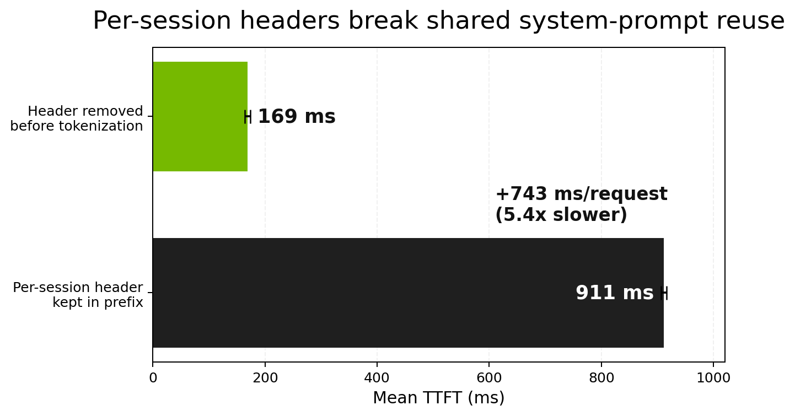

# Full-Stack Optimizations for Agentic Harnesses with Dynamo

Pointing an agent harness at a new backend is easy. Making the harness feel correct is harder.

Claude Code, OpenClaw, and Codex all depend on details that live above raw token generation: prompt shape, replay order, stream semantics, model metadata, and tool-call readiness. Get those details wrong and the failure mode is not just uglier JSON. It is broken cache reuse, idle tool loops, and clients that behave as if the model is slower or less reliable than it really is.

Our [first post](./agentic-inference.md) focused on the architecture underneath agentic inference: the frontend, the router, and KV cache management. This post stays closer to the harness boundary. The question here is simpler and more practical: what had to change in Dynamo to make real agent harnesses like Claude Code, OpenClaw, and Codex feel correct, cache-efficient, and fast?

Claude Code is the main anchor throughout. It puts pressure on nearly every layer at once: a large reusable system prompt, Anthropic-flavored API expectations, interleaved reasoning and tool calls, and long-running sessions where small compatibility gaps compound quickly. OpenClaw broadens the story to long-lived and background loops. Codex gives us the `v1/responses` side of the same problem.

## Tiny Setup

This is not a setup post, but it is useful to show the shape of the integration and the knobs that mattered in the experiments.

For Claude Code, the setup we actually used is just an SSH tunnel plus a few environment variables:

```bash
autossh -M 0 -f -N \
  -L 8000:localhost:8000 \
  -o ServerAliveInterval=15 \
  -o ServerAliveCountMax=3 \
  -o StrictHostKeyChecking=no \
  <gpu-node>

ANTHROPIC_BASE_URL=http://localhost:8000 \
ANTHROPIC_API_KEY=dummy \
CLAUDE_MODEL=nvidia/NVIDIA-Nemotron-3-Super-120B-A12B-NVFP4 \
CLAUDE_CODE_SUBAGENT_MODEL=nvidia/NVIDIA-Nemotron-3-Super-120B-A12B-NVFP4 \
claude --model nvidia/NVIDIA-Nemotron-3-Super-120B-A12B-NVFP4
```

For OpenClaw, it is the same tunnel pattern with a much thinner client setup:

```bash
autossh -M 0 -f -N \
  -L 8000:localhost:8000 \
  -o ServerAliveInterval=15 \
  -o ServerAliveCountMax=3 \
  -o StrictHostKeyChecking=no \
  <gpu-node>

ANTHROPIC_BASE_URL=http://localhost:8000 \
pnpx openclaw
```

For direct API testing during development, we also hit Dynamo's Responses API directly:

```bash
curl -s http://localhost:8000/v1/responses \
  -H "Content-Type: application/json" \
  -d '{
    "model": "<model>",
    "input": "Summarize the router design briefly."
  }'
```

The Anthropic-facing frontend configuration used in these experiments looked like this:

```bash
python -m dynamo.frontend \
  --http-port 8000 \
  --enable-anthropic-api \
  --strip-anthropic-preamble
```

All experiments in the artifact set ran against `nvidia/NVIDIA-Nemotron-3-Super-120B-A12B-NVFP4` on a single B200 in aggregated serving mode. That caveat matters. Some of the strongest results below are correctness results with clear systems implications; others are quantitative. We try to distinguish those cleanly.

## The DGD Settings That Actually Matter

One thing that became obvious while doing this work is that the speedups do not come from "serving the right model" alone. A harness-friendly deployment needs a specific set of frontend and worker settings turned on together.

On the frontend side, the key settings are:

- `--enable-anthropic-api` so Claude Code and OpenClaw can talk to Dynamo over the API shape they expect.
- `DYN_STRIP_ANTHROPIC_PREAMBLE=1` so Claude Code's billing header does not destroy prefix stability.
- `DYN_ENABLE_STREAMING_TOOL_DISPATCH=1` so tool readiness is emitted as structured stream state rather than inferred from deltas.

On the worker side, the important settings in this deployment are:

- `--dyn-tool-call-parser <parser>` and `--dyn-reasoning-parser <parser>` so tool calls and reasoning blocks are reconstructed in the model-specific format the harness actually needs.
- `--enable-chunked-prefill`, `--async-scheduling`, and a sufficiently large batching envelope such as `--max-num-seqs` and `--max-num-batched-tokens`, because the harnesses in this post generate long-prefill, multi-turn traffic rather than short single-shot prompts.
- The model-specific runtime settings that make the chosen backend viable at all for this workload. In our vLLM deployment that included expert parallelism, FP8 KV cache, and the speculative decoding configuration used for Nemotron-3.

It is worth being explicit about what is not part of this story. Secrets such as `HF_TOKEN` obviously need to be provided in your own environment, but they are not what unlocks the harness-side wins. The harness-relevant switches are the API mode, preamble stripping, streaming dispatch, and the correct parser and scheduler configuration.

## Prompt Stability Is Cache Work

Claude Code sends a lot of reusable prompt scaffolding. That is exactly what you want for KV reuse if the prefix stays stable. The problem is that Claude Code also prepends a session-specific billing header near the very front of the system prompt:

```text
x-anthropic-billing-header: cc_version=0.2.93; cch=abc123def456;
You are Claude Code, an interactive CLI tool...
```

On Anthropic's managed API, this is fine. On a prefix-matched KV cache, it is poison. A varying line at position zero means every new session starts from a different token prefix, so the stable instructions and tool definitions behind it never line up cleanly for reuse.

That is why Dynamo added `--strip-anthropic-preamble`. The fix is mechanically small and operationally important: remove the unstable billing header before tokenization so that the stable prompt starts at token zero.

```rust
fn strip_billing_preamble(system: &mut Option<SystemContent>) {
    if let Some(content) = system {
        let trimmed = content.text.trim_start();
        if trimmed.starts_with("x-anthropic-billing-header:")
            && let Some(newline_pos) = trimmed.find('\n')
        {
            content.text = trimmed[newline_pos + 1..].to_string();
        }
    }
}
```

The artifact set gave us a clean before-and-after story.

First, the Anthropic baseline. Via cc-proxy (a local Anthropic API proxy) in passthrough mode, a 6-request Claude Code session produced `53,992` cache creation tokens and `215,102` cache read tokens. After the first request, the session is effectively all cache reads. That is what good harness behavior looks like: one cold write, then repeated reuse of the same high-value prefix.

Second, the Dynamo-side measurement. On a localhost B200 run with a 52K-token prompt, a stable prefix landed at `168ms` TTFT. Keeping a varying per-session header in the prefix pushed that to `912ms`. Removing the billing header before tokenization brought it back to `169ms`. On this workload, the unstable header costs `744ms` per request and turns a reusable system prompt into a cold prefill.

We also verified the control case: a prompt with no extra header lands at the same fast path as the stripped version. That is useful as validation, but it is not the main comparison. The real question is whether the per-session header stays in the prefix or gets removed before tokenization.

Anthropic is the baseline for how the harness is meant to behave. Dynamo's result is the systems lesson: a harness quirk that looks incidental at the API boundary can destroy cache reuse if it perturbs the prefix too early.

Claude Code gave us a clean example of how harness semantics become serving semantics. On Anthropic's API, the billing preamble is absorbed into managed prompt caching and effectively disappears as an operational concern. On Dynamo, the same line sits at the front of a prefix-matched KV cache. Left untouched, it turns every session into a new prompt. Strip it before tokenization, and the system prompt becomes shareable again across requests and even across sessions that would otherwise differ only in that header.



## Reasoning Fidelity Is KV Correctness

Interleaved reasoning is easy to mistake for a rendering problem. It is not. It is a prompt reconstruction problem, which makes it a KV correctness problem.

If a model generates:

```text
<think>reasoning_0</think> tool_call_0 <think>reasoning_1</think> tool_call_1
```

then the next turn has to replay that assistant output in the same structural order. If the replay path flattens all reasoning before all tool calls:

```text
<think>reasoning_0 reasoning_1</think> tool_call_0 tool_call_1
```

the visible meaning may look similar, but the token sequence is different. That means the KV prefix computed during generation no longer matches the prefix seen on replay.

Dynamo's fix was to preserve reasoning as ordered segments rather than one flattened string:

```rust
pub enum ReasoningContent {
    Text(String),
    Segments(Vec<String>),
}
```

The contract matters more than the type name. `segments[i]` is the reasoning that appeared before `tool_calls[i]`, and `segments[N]` is any trailing reasoning after the last tool call. That preserves the original token order instead of reconstructing a lossy approximation.

The important thing we learned here is that ordering was not the only bug. Before we could even ask whether the replayed order was correct, historical reasoning was often missing from the prompt entirely. That made some of the earlier experiments deceptively flat: if prior thinking has already been dropped, then "correct" and "incorrect" interleaving can collapse to the same effective prompt.

This round-trip was broken until [PR #7358](https://github.com/ai-dynamo/dynamo/pull/7358). The bug had three layers:

1. **Double parsing**: the Anthropic streaming handler applied a second reasoning parser on top of the engine stream, which already had reasoning correctly split. The second parser re-classified all content as reasoning.

2. **Silent drop**: chat templates only reference `{{ message.content }}` — they ignore `reasoning_content`. Without explicit injection, the model never saw its own prior chain-of-thought. The fix injects `reasoning_content` back into `content` as `<think>` blocks before template rendering, on both the Rust preprocessor path (`ModelInput::Tokens`) and the Python worker path (`ModelInput::Text`). Templates that natively handle `reasoning_content` (Nemotron, Qwen3) are detected at load time and left alone.

3. **Template truncation**: Nemotron's chat template defaults `truncate_history_thinking` to `true`, which strips `<think>` content from all assistant turns before the last user message. That is reasonable for ordinary chat, but wrong for agentic turns where prior reasoning explains why tools were called. Some parsers made this even harder to notice. For example, the DeepSeek-R1 parser preserves reasoning on tool-calling turns but drops it on turns without tool calls, which is exactly the wrong shape for a harness that needs the model to remember why those tool calls happened. NVIDIA's own SWE training pipeline sets `truncate_history_thinking: false`; the Anthropic handler now passes that flag automatically when a reasoning parser is configured.

That sequence explains the apparent contradiction in the artifact history. The early ordering experiments did not show a clear delta because historical reasoning was being removed from the replay path. If the thinking is gone, there is little or nothing left for correct and incorrect interleaving to disagree about.

Once the parser and template path were fixed, the expected behavior finally appeared. On a localhost B200 experiment with a 52K-token system prompt and an assistant turn containing about 500 tokens of thinking, exact replay landed at `167ms` TTFT while mutated thinking landed at `322ms`. That is a `1.9x` increase, or about `155ms` per request, from changing the reasoning content inside the replayed prefix.

That is the real story for this section. First, the harness must preserve historical reasoning at all. Second, once that reasoning is actually present, it has to be replayed in the right order. A flattened or otherwise incorrect replay can render correctly, pass a casual eyeball test, and still be functionally wrong for KV reuse. Cache reuse depends on token order, not on whether two prompts feel semantically equivalent. Preserving interleaved reasoning and tool calls was therefore less about pretty transcripts and more about making turn `N+1` look exactly like turn `N` did to the cache.

```text
Original generation:    [think][r0][/think][tool0][think][r1][/think][tool1]
Correct reconstruction: [think][r0][/think][tool0][think][r1][/think][tool1]  -> cache match
Flat reconstruction:    [think][r0][r1][/think][tool0][tool1]                  -> prefix diverges
```

As we push harder on disaggregated serving, this becomes more important, not less. When the prefix has to survive movement across workers and storage tiers, prompt shape stops being an API nicety and becomes part of the cache key story.

## Streaming Actionable State

Streaming tokens is not enough for harnesses. Agent loops need actionable state as soon as it exists: completed tool calls, completed reasoning blocks, and token accounting that clients can trust while the stream is still in flight.

The updated artifact set points to a more precise framing than the one we started with. Dynamo's streaming work has three distinct states:

1. the old buffered behavior, where tool-call chunks were withheld until `finish_reason: "tool_calls"`
2. the current inline-streaming behavior, where tool-call deltas appear as soon as they are generated
3. the dispatch path, where Dynamo emits a typed `event: tool_call_dispatch` side channel at that same moment

The important change is from state 1 to states 2 and 3. That is where the harness stops being blind until stream end.

Without dispatch, the harness sees a regular token stream and has to infer when a tool call is complete by accumulating deltas and waiting for enough structure to be present. With dispatch enabled, Dynamo can emit a typed SSE side channel:

```text
event: tool_call_dispatch
data: {"choice_index":0,"tool_call":{"index":0,"id":"call-...","type":"function","function":{"name":"calculator","arguments":"{\"expression\":\"42 * 17\"}"}}}
```

That event tells the harness, in one shot, that the tool call is ready to execute. No client-side delta assembly, no guessing whether the arguments are complete, and no custom parser living inside the harness.

The timing result needs to be stated carefully. On the localhost B200 runs, dispatch did not create a large end-to-end wall-time win by itself. The dispatch event fires at essentially the same moment as the inline tool delta. What changed is that the server now exposes tool readiness as a typed protocol event instead of forcing the client to reconstruct it from partial deltas.

It is still a real systems improvement. A tool call is a state transition, not just another substring in the stream. In the old buffered path, the harness learned about that transition only at stream end. In the current path, it learns about it as soon as the tool call is structurally complete. With dispatch enabled, it learns the same fact in a cleaner form: parsed, typed, and ready to act on.

The localhost multi-turn measurements make the right claim narrower, not weaker. On the 30-city workload, the harness learned about each tool call about `9-10ms` before `finish_reason`, and the cumulative earlier feedback over many turns was real but modest. That is not a dramatic latency chart. It is a protocol improvement that removes blind buffering and gives the harness actionable state immediately.

The stream now carries the state transitions an agent harness actually needs, and that `tool_call_dispatch` turns those transitions into something a client can consume without maintaining its own parser.

## Anthropic and Claude Code API Fidelity

Claude Code compatibility is more than text generation behind an Anthropic-shaped endpoint. The harness depends on a collection of smaller behaviors that are easy to miss in ad hoc testing:

- model metadata at both `GET /v1/models` and `GET /v1/models/{model_id}`
- correct handling of slashed model IDs
- useful `input_tokens` in `message_start`
- proper thinking blocks
- acceptance of `cache_control`
- response shapes that track the Anthropic API closely enough for clients not to trip over them

The fixes in this area were not glamorous, but they mattered. Claude Code does not stop at `GET /v1/models`; it also retrieves the specific connected model. That means the route has to handle identifiers like `nvidia/NVIDIA-Nemotron-3-Super-120B-A12B-NVFP4` without treating the slash as a path-segmentation bug. Likewise, a field like `input_tokens` in `message_start` can look minor until you realize the client reads that event early and uses it for context accounting before the stream is over.

This is a good example of harness compatibility being more than "the field exists somewhere." Retrieval path, identifier handling, response shape, and timing all matter. A backend can be broadly Anthropic-flavored and still be just off enough to make a harness feel brittle.

One concrete example captures the flavor of these bugs better than a long checklist. Claude Code asks for the connected model directly. On the measured deployment, that lookup still failed:

```text
GET /v1/models/nvidia/NVIDIA-Nemotron-3-Super-120B-A12B-NVFP4
HTTP/1.1 404 Not Found
```

That is not the kind of bug that makes a conference talk, but it is exactly the kind that makes a backend feel brittle to a harness. The same section of captures shows a second class of issue: `message_start` reports `input_tokens: 0` even when the final response later contains the real count. Those details sit well below "generate the next token," but they are still part of whether the harness can reason correctly about the backend.

## Responses and Codex Fidelity

The Codex-facing version of the same problem lives on the `v1/responses` side. Passing compliance tests is not enough if realistic replay and field preservation are lossy.

The clean architectural idea here is Dynamo's `ResponseParams` path. Instead of letting a Responses request collapse into chat completions and then trying to reconstruct the missing pieces afterward, Dynamo extracts the client-facing response parameters up front, preserves them through the internal conversion, and merges them back into the final response object.

That turns the internal conversion path from an hourglass into a controlled translation layer. Fields that the engine does not care about, such as `instructions`, `store`, `truncation`, or input-item metadata, do not silently vanish just because the internal runtime speaks a chat-completions-shaped dialect.

The easiest way to see the difference is to look at the request path itself:

```text
Client Request (Responses API)
│
├─► ResponseParams --------------------------► Response echo
│   (model, tools, instructions, etc.)         (preserved verbatim)
│
└─► Internal conversion
    │
    └─► ChatCompletions-shaped request
        │
        │ Fields that would otherwise get lost here:
        │ - input item `id` and `status`
        │ - `previous_response_id`
        │ - `store`, `truncation`, `service_tier`
        │ - original `reasoning` and tool config shape
        │
        └─► Engine output
            │
            └─► Merge engine output + ResponseParams
                │
                └─► Final Responses object
```

Codex surfaced a different failure mode than Claude Code. The issue was not whether Dynamo could generate the next token. It was whether a realistic Responses request could survive an internal round-trip without losing the fields that made it a Responses request in the first place. Preserving those fields turned out to be an architectural concern, not just a serializer concern.

The important point is that protocol fidelity on the Responses side is still part of the serving problem. A lossy conversion path quietly erases the structure the harness depends on.

The simple text-generation capture is a useful example because it shows both preservation and the remaining gaps in one response. A request as small as:

```json
{
  "model": "nvidia/NVIDIA-Nemotron-3-Super-120B-A12B-NVFP4",
  "input": "Say hello briefly.",
  "max_output_tokens": 50
}
```

comes back with the Responses-shaped structure intact: a reasoning item, a message item, the original `max_output_tokens`, and the usual top-level fields. At the same time, it shows the current edge of the implementation. `output_tokens_details.reasoning_tokens` is still `0` even though reasoning content is clearly present in the response. That is exactly the kind of detail a Codex-style client notices.

## OpenClaw: Integration Testing and Parser Discovery

Claude Code stress-tests the system prompt and single-session tool loop. OpenClaw stress-tests what happens when sessions stay alive across channels, turns accumulate over hours, and the client is a background loop rather than an interactive terminal. But the most useful thing OpenClaw gave us was a structured integration test for the hardest parsing problem in the stack: combined reasoning and tool calls in a single response.

OpenClaw is a multi-channel AI chat client that connects to the same backend over Telegram, WhatsApp, and web chat simultaneously. Unlike Claude Code, which starts a fresh session per task and sends a large system prompt once, OpenClaw keeps conversations alive indefinitely. That makes it a good vehicle for testing whether the full parsing pipeline holds up under realistic multi-turn conditions with tools and thinking interleaved.

We ran experiments against a Dynamo + TRT-LLM deployment: Nemotron-3-Super-120B-A12B-NVFP4 on 4x B200 with TP=4, with `--enable-anthropic-api`, `--strip-anthropic-preamble`, `--enable-streaming-tool-dispatch`, the `nemotron_deci` reasoning parser, and the `qwen3_coder` tool call parser.

### Parser Names Map to Output Format, Not Model Family

The first thing we had to learn was that parser selection is about the token format the model emits, not the model's name or family.

Nemotron-3-Super ships with a reasoning format that uses `<think>` tags and a tool call format that uses `<tool_call><function=name><parameter=key>value</parameter></function></tool_call>` XML. The reasoning parser that handles `<think>` tags is called `nemotron_deci`. That name makes sense. But the tool call parser that handles the XML format is called `qwen3_coder`, because Qwen models popularized that output shape. An earlier attempt used `--dyn-tool-call-parser nemotron_deci` for both, which looks for `<TOOLCALL>` tags that Nemotron-3-Super never emits. The model was generating perfectly valid tool calls; the wrong parser was silently discarding them.

The naming is confusing because it conflates two different things. Parser names describe the output format they consume, not the model family they were designed for. Once you know that, the correct configuration falls out: `--dyn-reasoning-parser nemotron_deci` (for `<think>` tags) and `--dyn-tool-call-parser qwen3_coder` (for the XML tool call format). Getting one wrong does not produce an error. It produces silence where structured output should be.

### Combined Reasoning and Tool Calls

The hardest parsing test is when both parsers have to operate on the same token stream. A model that reasons before calling a tool generates a response where `<think>` content flows first, followed by `<tool_call>` XML. Two different parsers, `nemotron_deci` for reasoning and `qwen3_coder` for tool calls, have to split that stream into the correct Anthropic Messages API content blocks without interfering with each other.

We sent the same prompt five times through the Anthropic Messages API: a system prompt instructing the model to think step by step, two tool definitions (calculator and weather), and the user message "Think carefully about what 15 * 23 equals, then use the calculator to verify." The response structure from a representative round:

```json
{
  "content": [
    {
      "type": "thinking",
      "thinking": "I need to calculate 15 * 23. Let me think: 15 * 20 = 300, and 15 * 3 = 45, so 300 + 45 = 345. I'll use the calculator to verify.\n"
    },
    {
      "type": "tool_use",
      "id": "call-a3364797-3160-4e84-b567-5c495694d502",
      "name": "calculator",
      "input": { "expression": "15 * 23" }
    }
  ],
  "stop_reason": "tool_use",
  "usage": { "input_tokens": 403, "output_tokens": 95 }
}
```

Across all five non-streaming rounds: `5/5` produced both a `thinking` block and a `tool_use` block, `5/5` had them in the correct order (thinking before tool_use), `5/5` returned `stop_reason: "tool_use"`, and all five correctly parsed the tool name (`calculator`) and input (`{"expression": "15 * 23"}`). Mean latency was `1,187ms`, with the first request at `2,216ms` (cold) and subsequent requests settling to `771-1,097ms`.

The thinking content itself shows the model doing real chain-of-thought: decomposing the multiplication into `15 * 20 = 300` and `15 * 3 = 45`, arriving at `345`, then deciding to call the calculator to verify. That reasoning appears as a structured `thinking` block, not as inline text that a client would have to parse.

### Streaming Two Parsers at Once

The streaming path makes the parser interaction more visible. A streaming request produces a sequence of SSE events, and the event type sequence shows exactly how the two parsers carve up the token stream:

```text
   1ms  message_start
  82ms  content_block_start  type=thinking
  82ms  content_block_delta  (thinking tokens stream here, ~7ms apart)
   ...  (~70 thinking deltas over ~520ms)
 602ms  content_block_stop
 602ms  content_block_start  type=text
 602ms  content_block_delta
 800ms  content_block_stop
 800ms  content_block_start  type=tool_use
 800ms  content_block_delta
 800ms  content_block_stop
 814ms  message_delta        stop_reason=tool_use
 814ms  message_stop
```

The thinking block streams token by token from `82ms` to `602ms`. Then a brief text block appears (the whitespace between the thinking and tool call regions of the raw token stream). Then the tool_use block arrives at `800ms` as a single structured unit. The `message_stop` follows at `814ms`.

Across five streaming rounds: `5/5` had both thinking and tool_use blocks in the correct order. Mean time to first thinking token was `83ms`. Mean time to tool_use block was `919ms`. Mean total stream time was `933ms`. The gap between the thinking block starting and the tool_use block arriving (mean `836ms`) is the model's generation time for the reasoning content plus the tool call tokens.

One notable observation: the `tool_call_dispatch` event did not fire in any of the five streaming rounds (`0/5`). The `--enable-streaming-tool-dispatch` flag was set on the frontend, but dispatch events appear to require a different interaction between the tool call parser and the streaming path than what the current TRT-LLM backend produces. The tool_use block still arrives correctly as a `content_block_start` event, which is what clients like OpenClaw consume. Dispatch is an optimization for earlier notification; its absence does not affect correctness.

### Cache Stability Across Turns

A separate experiment measured TTFT across 8-turn multi-turn conversations under three conditions: a stable system prompt, a varying prompt (random preamble injected each turn), and a billing-header-style prefix that Dynamo strips before tokenization. Three rounds of each condition.

On TRT-LLM with B200, all three conditions converged to the same TTFT band. Stable-prefix turns averaged `118ms`, varying-prefix turns averaged `112ms`, and stripped-prefix turns averaged `116ms`. The differences are within noise. After the first turn or two of each session (which ran slightly higher at `120-136ms` as the cache warmed), subsequent turns settled into a `101-116ms` band regardless of condition.

The story here is simpler than the Claude Code result but still useful. OpenClaw's shorter, static system prompt does not benefit as dramatically from preamble stripping because there is less prefix to invalidate. The billing header that costs `744ms` on a 52K-token Claude Code prompt has a proportionally smaller impact on a 2K-token OpenClaw prompt. But the invariant holds: stable prefixes stay in the fast path, and Dynamo's stripping keeps the stripped condition indistinguishable from stable.

### What OpenClaw Adds to the Story

The Claude Code experiments established that prefix stability, replay fidelity, and stream semantics matter for agentic serving. OpenClaw added two things.

First, a concrete integration test for the hardest parsing case: two different parsers (`nemotron_deci` for reasoning, `qwen3_coder` for tool calls) splitting one token stream into correctly ordered Anthropic content blocks. That test passed `10/10` across both streaming and non-streaming paths, with correct block types, correct ordering, correct stop reasons, and correctly parsed tool arguments.

Second, a deployment lesson that is easy to miss in documentation. Parser names in Dynamo describe the output format they consume, not the model they were designed for. A model called Nemotron uses a parser called `qwen3_coder` for its tool calls because the output format matches, not because of any Qwen lineage. When a model appears to reason about tools inline rather than emitting structured tool-call blocks, the first thing to check is whether the configured parser matches the model's actual output format.

## Closing the Loop

The architecture from the first post only pays off if the harness-facing layer preserves enough structure for the router and the cache to exploit it. That is the connective tissue between these two posts.

Prompt stability affects KV reuse. Replay fidelity affects whether the next turn can hit cache at all. Stream semantics affect when the harness can act. Metadata fidelity affects whether the client can manage context and model selection correctly. None of that is a thin compatibility shim over the "real" serving stack. For agentic workloads, it is part of the serving stack.

For agentic workloads, protocol fidelity is performance work.
