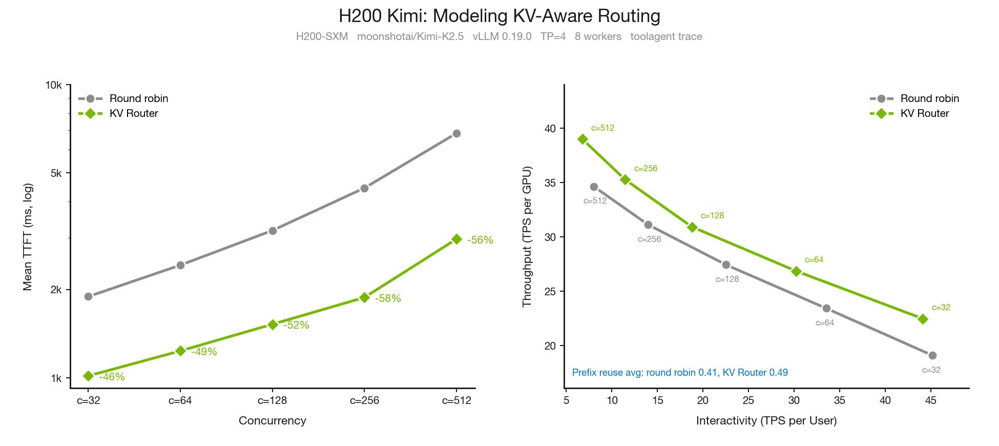

<!--
SPDX-FileCopyrightText: Copyright (c) 2026 NVIDIA CORPORATION & AFFILIATES. All rights reserved.
SPDX-License-Identifier: Apache-2.0
-->

# H200 Counterpart: DynoSim Kimi-K2.5 Data

This is a companion data note for the main
[DynoSim blog draft](./README.md). It follows the same section structure where we
have H200 data, while keeping these results separate from the B200 MiniMax and
Planner figures in the main post.

## Shared H200 Setup

Unless noted otherwise, these runs use the same workload framing as the main
post: the full 23,608-request Mooncake FAST25 `toolagent_trace.jsonl` trace,
Mooncake trace format, and 512-token trace blocks. The H200-specific engine
profile is `moonshotai/Kimi-K2.5`, vLLM 0.19.0 timing through AIC, and
`h200_sxm`.

| Category | Value |
|---|---|
| Workload | Full 23,608-request `toolagent_trace.jsonl`, `trace_format=mooncake`, `trace_block_size=512` |
| Model/system | `moonshotai/Kimi-K2.5`, H200-SXM, vLLM 0.19.0 through AIC |
| Engine config | `block_size=512`, `num_gpu_blocks=16384`, `max_num_batched_tokens=16384` |
| MoE config | `moe_tp_size=tp_size`, `moe_ep_size=1`, `attention_dp_size=1` |

Data and plotting scripts live in
[scripts/h200_kimi_counterpart](./scripts/h200_kimi_counterpart/README.md).

## 1. Architecture: Same Twin, Different Engine Profile

The H200 runs exercise the same DynoSim structure as the main draft: workload
trace, scheduler simulation, AIC-backed pass timing, Router decisions, and
offline replay metrics. The difference is the model/system profile: Kimi-K2.5
on H200 instead of the B200 MiniMax setup used elsewhere in the main post.

## 2. Simulating The Dynamo Digital Twin

### 2.1 Single Engine Simulation

There is no H200 counterpart to the main post's single-engine fidelity figure in
this data set. That section compares hardware, mocker, and AIC on B200. For
H200, this companion only carries simulation/AIC-backed replay data, not live
H200 measurements for the same workload.

### 2.2 Multi Engine Simulation: Router

For the Router counterpart, we keep the same figure shape as the main post:
mean TTFT versus concurrency on the left, and throughput per GPU versus
interactivity on the right. The H200 run uses eight aggregated workers at TP=4,
for a 32-GPU total budget, and compares round robin with KV Router over replay
concurrencies 32, 64, 128, 256, and 512.

KV Router raises average prefix reuse from `0.413` to `0.492` and cuts TTFT by
46-58% versus round robin across the sweep. At c=512, round robin reaches
`34.64 TPS/GPU` with `6832.97 ms` TTFT; KV Router reaches `39.01 TPS/GPU` with
`2976.70 ms` TTFT.

### 2.3 Planner Note

No new Kimi/H200 Planner sweep was run for this companion. The main blog already
uses H200 for the Planner experiments, but with Qwen3-32B at TP=2 rather than
Kimi-K2.5.

## 3. Optimization And Discovery With DynoSim

The H200 optimizer run uses the same presentation as section 3.1 of the main
post: one replay-optimizer run on the full trace, summarized as a deployment
candidate table. It uses block-coordinate search over TP shape, worker split,
and router setting.

| Category | Result |
|---|---|
| Workload | `moonshotai/Kimi-K2.5`, vLLM 0.19.0, H200-SXM, full 23,608-request `toolagent_trace.jsonl`, `arrival_speedup_ratio=0.25` |
| Engine config | `block_size=512`, `num_gpu_blocks=16384`, `max_num_batched_tokens=16384` |
| Budget | 16 GPUs |
| Objective | Maximize output throughput subject to mean TTFT <= 4,000 ms, mean TPOT <= 75 ms, and mean end-to-end latency <= 20,000 ms |
| Best near-miss layout | `prefill_tp=2`, `decode_tp=1`, `prefill_workers=5`, `decode_workers=6` |
| Router | `kv_router`, `prefill_load_scale=0.5` |
| Key metrics | `output_throughput_tok_s=303.13`, `prefix_cache_reused_ratio=0.5383`, `mean_ttft_ms=4058.07`, `mean_tpot_ms=58.57`, `mean_e2e_latency_ms=13319.99` |

No row is feasible under the strict 4 s TTFT SLA. The table above is the best
near-miss, only 58.07 ms over the TTFT threshold.

The optimizer artifact still names this field `overlap_score_weight`, but this
code path maps that backward-compatible value to `prefill_load_scale`.

## 4. How To Use This Data

Use this README as an H200 appendix or parallel working note. The clean claims
from this data are:

- H200 Kimi router simulation reproduces the same qualitative Router story:
  cache-aware routing improves prefix reuse, throughput per GPU, and TTFT versus
  round robin.
- The H200 optimizer run found a strong near-feasible layout under a strict
  4 s TTFT SLA, but not a feasible one.

The source artifacts are committed separately so the main draft can choose
whether to reference them, replace the B200 figures later, or keep them as an
appendix.
