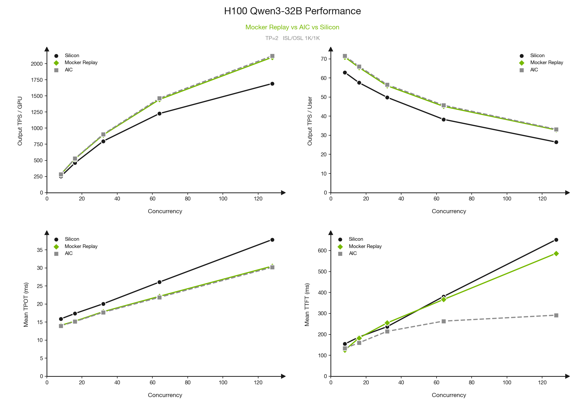
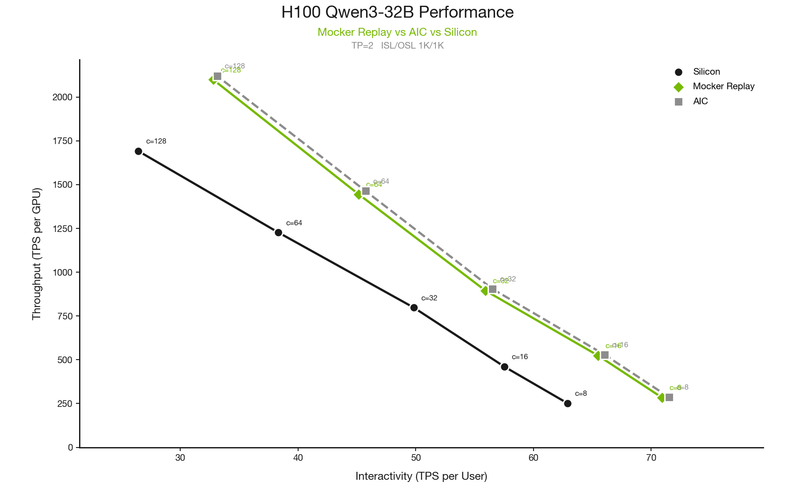
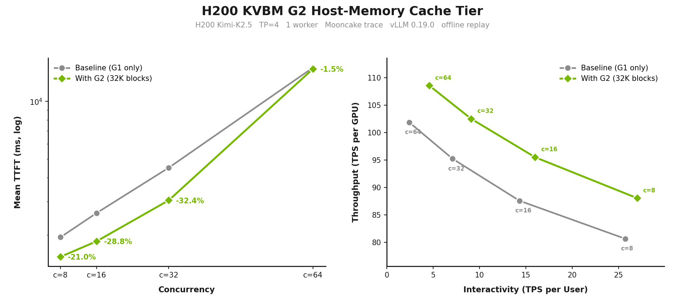

<!--
SPDX-FileCopyrightText: Copyright (c) 2026 NVIDIA CORPORATION & AFFILIATES. All rights reserved.
SPDX-License-Identifier: Apache-2.0
-->

# Hopper Counterpart: DynoSim H100 And H200 Data

This is a companion data note for the main
[DynoSim blog draft](./README.md). It follows the same section structure where we have Hopper GPUs data,
while keeping these results separate from the B200 MiniMax and Planner figures in the main post.

This appendix keeps the same DynoSim questions but uses the model, GPU, and workload
combinations that have useful counterpart data for Hopper GPUs. Data and plotting scripts live in:

- [scripts/h100_qwen3_counterpart](./scripts/h100_qwen3_counterpart/README.md)
- [scripts/h200_kimi_counterpart](./scripts/h200_kimi_counterpart/README.md)
- [scripts/h200_kvbm_g2_exp](./scripts/h200_kvbm_g2_exp/README.md)

## 1. Architecture: Same Twin, Hopper Profiles

All of these runs exercise the same DynoSim structure as the main draft:
workload generation or trace replay, scheduler simulation, AIC-backed pass
timing, component decisions, and replay metrics. The difference is the model/system
profile: H100 Qwen3-32B and H200 Kimi-K2.5 instead of the B200 MiniMax setup used
elsewhere in the main post.

## 2. Simulating The Dynamo Digital Twin

### 2.1 Single Engine Simulation: H100 Qwen3-32B

The H100 single-engine counterpart follows the same comparison shape as the
main post's B200 single-engine fidelity figure: silicon, offline Mocker replay,
and direct AIC estimates. The model and system are different, so the figure
should be read as a Hopper fidelity check rather than as a drop-in replacement
for the B200 MiniMax plot.

| Category | Value |
|---|---|
| Model/system | `Qwen/Qwen3-32B`, H100-SXM, vLLM |
| Shape | TP=2, ISL=1024, OSL=1024 |
| Concurrency sweep | 8, 16, 32, 64, 128 |
| AIC/replay timing | vLLM 0.14.0 AIC timing database |
| Replay config | `block_size=64`, `max_num_batched_tokens=2048`, `max_num_seqs=256`, `gpu_memory_utilization=0.9` |
| Replay workload | Synthetic closed-loop replay with `request_count=10*concurrency` |

For the plotted H100 points, offline Mocker replay is close to silicon on the
latency metrics that depend on scheduling: 13.8% MAPE for TPOT and 8.5% MAPE
for TTFT.

### 2.2 Multi Engine Simulation: Router And KVBM

The Hopper component counterparts in this section answer two different
questions. The Router result uses H200/Kimi to test cache-aware placement across
multiple workers. The KVBM result uses H200/Kimi to test the G2 host-memory tier
in a single-worker replay.

#### Router: H200 Kimi-K2.5

For the Router counterpart, we keep the same figure shape as the main post:
mean TTFT versus concurrency on the left, and throughput per GPU versus
interactivity on the right. The H200 run uses eight aggregated workers at TP=4,
for a 32-GPU total budget, and compares round robin with KV Router over replay
concurrencies 32, 64, 128, 256, and 512.

| Category | Value |
|---|---|
| Workload | Full 23,608-request Mooncake FAST25 `toolagent_trace.jsonl`, `trace_format=mooncake`, `trace_block_size=512` |
| Model/system | `moonshotai/Kimi-K2.5`, H200-SXM, vLLM 0.19.0 through AIC |
| Engine config | `block_size=512`, `num_gpu_blocks=16384`, `max_num_batched_tokens=16384` |
| MoE config | `moe_tp_size=tp_size`, `moe_ep_size=1`, `attention_dp_size=1` |
| Router shape | 8 aggregated workers, TP=4, 32 total GPUs |

KV Router raises average prefix reuse from `0.413` to `0.492` and cuts TTFT by
46-58% versus round robin across the sweep. At c=512, round robin reaches
`34.64 TPS/GPU` with `6832.97 ms` TTFT; KV Router reaches `39.01 TPS/GPU` with
`2976.70 ms` TTFT.

#### KVBM: H200 Kimi-K2.5

The KVBM counterpart keeps the TP=4, single-worker replay shape from the main
KVBM section, but uses Kimi-K2.5 on H200-SXM with vLLM 0.19.0 AIC timing. The
experiment toggles the G2 host-memory tier with `num_g2_blocks=32768`.

| Category | Value |
|---|---|
| Workload | Full 23,608-request Mooncake FAST25 `toolagent_trace.jsonl` |
| Model/system | `moonshotai/Kimi-K2.5`, H200-SXM, vLLM 0.19.0 through AIC |
| Shape | 1 worker, TP=4, attention_dp=1, moe_tp=4, moe_ep=1 |
| Engine config | `max_num_batched_tokens=2048` |
| G2 config | `num_g2_blocks=32768` |
| Concurrency sweep | 8, 16, 32, 64 |

On H200/Kimi, mean TTFT improves at every point: 21.0% at c=8, 28.8% at c=16,
32.4% at c=32, and 1.5% at c=64. Throughput per GPU also improves throughout
the sweep, by 9.2%, 9.1%, 7.6%, and 6.6%.

### 2.3 Planner Note

No additional Hopper Planner sweep is included in this companion. The main blog
already uses H200 for the Planner experiments with Qwen3-32B at TP=2.

## 3. Optimization And Discovery With DynoSim

The H200 optimizer run uses the same presentation as section 3.1 of the main
post: one replay-optimizer run on the full trace, summarized as a deployment
candidate table. It uses block-coordinate search over TP shape, worker split,
and router setting.

| Category | Result |
|---|---|
| Workload | `moonshotai/Kimi-K2.5`, vLLM 0.19.0, H200-SXM, full 23,608-request `toolagent_trace.jsonl`, `arrival_speedup_ratio=0.25` |
| Engine config | `block_size=512`, `num_gpu_blocks=16384`, `max_num_batched_tokens=16384` |
| Budget | 16 GPUs |
| Objective | Maximize output throughput subject to mean TTFT <= 4,000 ms, mean TPOT <= 75 ms, and mean end-to-end latency <= 20,000 ms |
| Best near-miss layout | `prefill_tp=2`, `decode_tp=1`, `prefill_workers=5`, `decode_workers=6` |
| Router | `kv_router`, `prefill_load_scale=0.5` |
| Key metrics | `output_throughput_tok_s=303.13`, `prefix_cache_reused_ratio=0.5383`, `mean_ttft_ms=4058.07`, `mean_tpot_ms=58.57`, `mean_e2e_latency_ms=13319.99` |

No row is feasible under the strict 4 s TTFT SLA. The table above is the best
near-miss, only 58.07 ms over the TTFT threshold.

The optimizer artifact still names this field `overlap_score_weight`, but this
code path maps that backward-compatible value to `prefill_load_scale`.

## 4. How To Use This Data

Use this README as a Hopper appendix or parallel working note. The clean claims
from this data are:

- H100/Qwen3 single-engine replay preserves the hardware trend and improves
  TTFT fidelity versus direct AIC estimates.
- H200/Kimi Router simulation reproduces the same qualitative Router story as
  the main post: cache-aware routing improves prefix reuse, throughput per GPU,
  and TTFT versus round robin.
- H200/Kimi KVBM simulation shows G2 helps TTFT and TPS/GPU across the whole
  sweep.
- The H200/Kimi optimizer run found a strong near-feasible layout under a
  strict 4 s TTFT SLA, but not a feasible one.

The source artifacts are committed separately so the main draft can choose
which counterpart figures to reference directly and which to keep as appendix
data.
