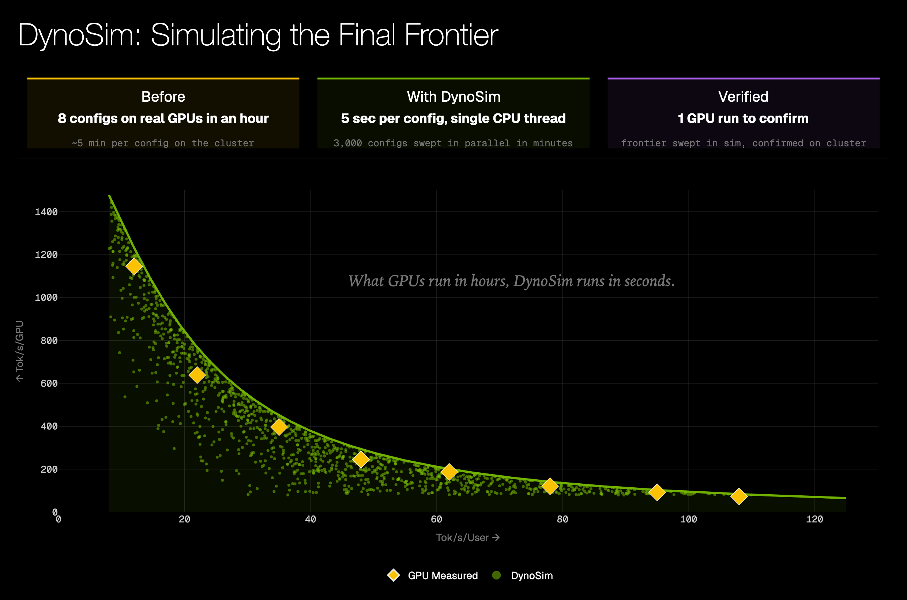
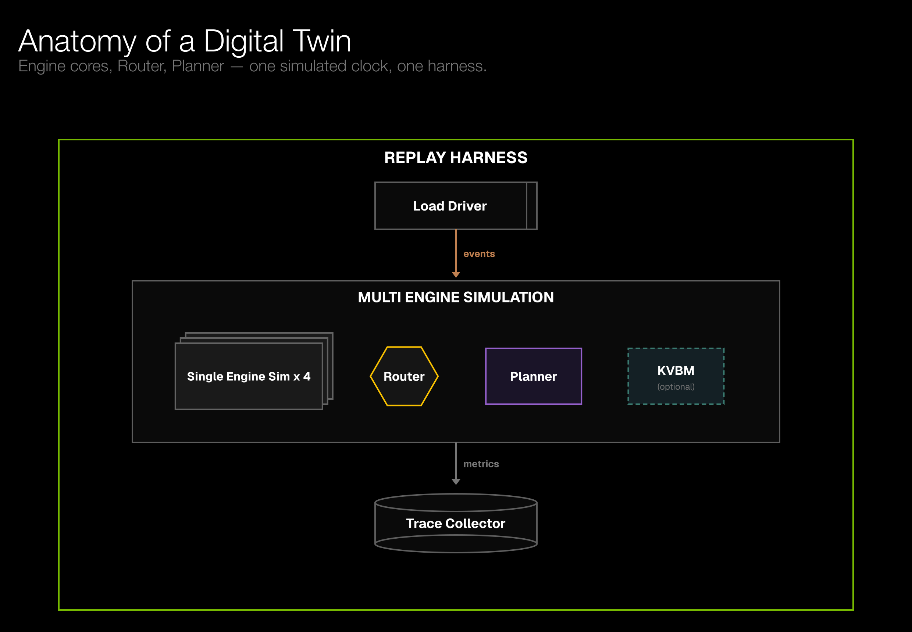
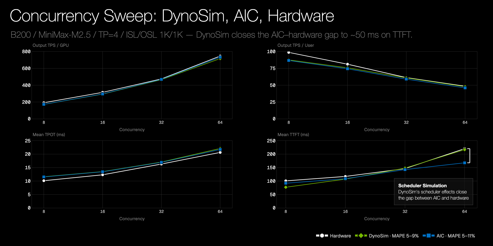
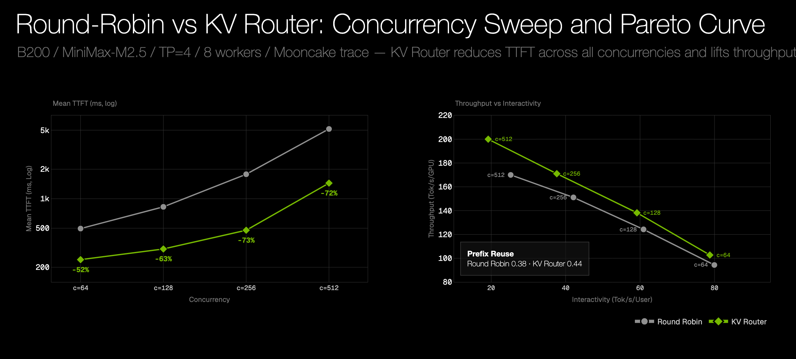
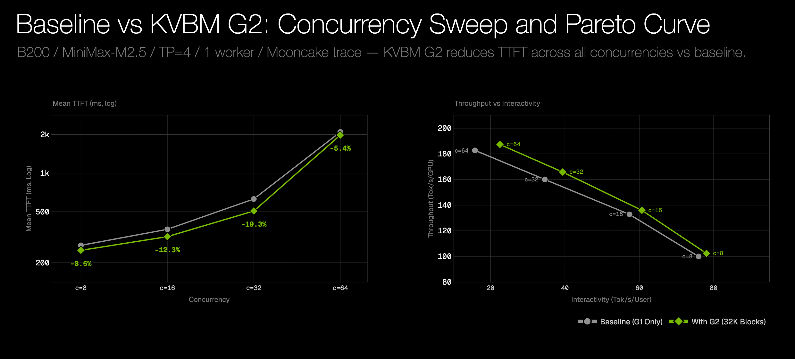
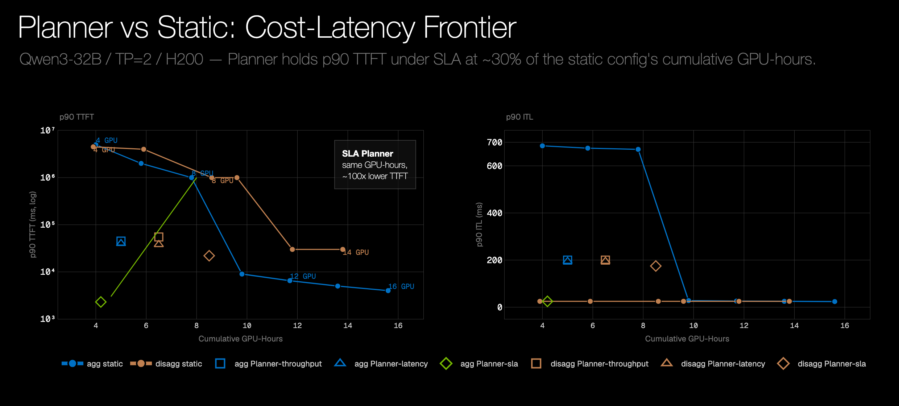
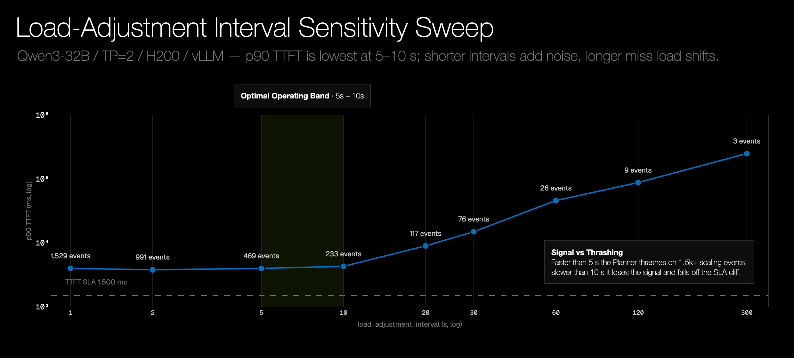
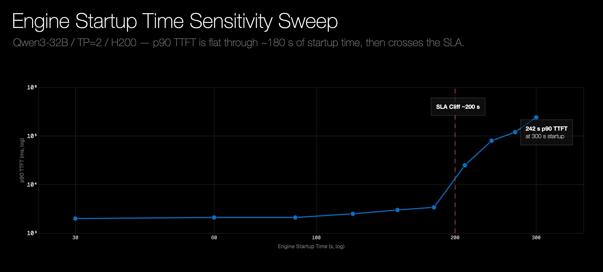
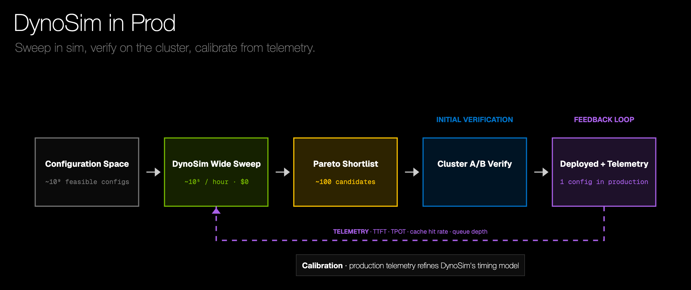

<!--
SPDX-FileCopyrightText: Copyright (c) 2025-2026 NVIDIA CORPORATION & AFFILIATES. All rights reserved.
SPDX-License-Identifier: Apache-2.0
-->

# Tentative title: DynoSim: A Dynamo Digital Twin

Tentative author list: Yongming Ding, Rudy Pei, Hongkuan Zhou, Ryan Olson, Dan Gil, Vikram Sharma Mailthody

## 1. Intro

Modern LLM serving is hard to tune because each deployment is a stack of
interacting choices: model backend, tensor-parallel shape, prefill/decode split,
worker counts, scheduler settings, routing policy, KV cache behavior,
autoscaling thresholds, and topology.

Those choices interact across layers. Engine schedulers turn backend pass timing
into token-producing batches. Dynamo's [Router](https://github.com/ai-dynamo/dynamo/blob/main/docs/components/router/router-guide.md)
decides where each request lands, autoscaling decisions adjust capacity only
after startup or specialization delays, and the [KV Block Manager (KVBM)](https://github.com/ai-dynamo/dynamo/blob/main/docs/components/kvbm/kvbm-guide.md)
determines when cached state is reused, moved, offloaded, or recomputed.
A local improvement can shift the bottleneck somewhere else, and for larger
models even one realistic experiment can require many GPUs or nodes before
we learn whether the idea was worth testing.

DynoSim is a Dynamo digital twin for that deployment workflow: a workload-driven
discrete-event simulation of the Dynamo serving stack. It combines measured
engine forward-pass timing, Mocker scheduler cores, Router, and Planner behavior,
KV cache effects and workload traces on one virtual timeline. The goal is not a purely analytical estimate and not a bit-exact hardware emulator. The goal is a faithful serving simulation at the atomic level of forward passes, with the Dynamo components above the engine included in the same event timeline.

As a scale reference, on an Apple M4 MacBook Air, the single-threaded Rust
offline replay simulated the full 23,608-request Mooncake trace with eight
round-robin workers and 512-token trace and engine blocks in 2.41 seconds of
wall time. The simulated serving window was 60.1 minutes, about 1,500x faster
than real time. The replay loop is single-threaded by design; the intended
scaling path is to run many independent replays in parallel.

*Figure 1. DynoSim turns exhaustive deployment search into a fast
simulate-then-verify loop, screening thousands of candidates before spending
GPU time.*

The same replay metrics can support configuration search and bounded research. A
sweep can map the Pareto frontier for a workload on existing hardware, while an
autoresearch-style workflow can propose changes to a Router cost function,
Planner heuristic, or cache policy, replay the trace, and keep only candidates
that improve the selected objective.

That gives Dynamo a practical loop for research, engineering scoping, and customer-facing sizing.

- Research: Test routing, autoscaling, prefill/decode, KV/cache, and topology ideas before spending cluster time.
- Engineering: Turn opportunity costs into thresholds. If specializing one decode worker into N prefill workers takes X seconds, DynoSim can show when X breaks the service-level agreement (SLA) and what target makes the work worth prioritizing.
- Customer-facing sizing: Compare GPU counts, worker layouts, backends, and deployment topologies against a workload and SLA before committing capacity.

## 2. Architecture: Composing Dynamo As Events

The key design choice is composition. DynoSim is not one monolithic model; it is
a set of serving components that run on the same simulated timeline. A replay
harness drives workload arrivals, single-engine simulations model worker-local
scheduling and forward-pass timing, and multi-engine simulation adds the system
behaviors that only exist across workers: routing, queueing, imbalance, and Planner
decisions. KVBM and distributed cache simulation are part of future work.

*Figure 2. DynoSim composes workload replay, engine simulations, Router,
Planner, and optional KVBM behavior on a single discrete-event timeline.*

### 2.1 Replay On A Virtual Clock

Discrete-event simulation, or DES, gives DynoSim a virtual clock and an event queue. Components do not wait in real time. Instead, they schedule future events with modeled
durations: a request arrival, a scheduler step, a forward pass, a KV transfer,
a worker startup, or a Planner action. The runtime jumps to the next timestamp,
updates system state, and lets the affected components schedule more work.

#### A Request's Journey Through The Twin

One request makes the DES model concrete:

1. A load generator, such as Dynamo AIPerf, emits a request from a trace or
   synthetic workload.
2. The router decides where the request should go, or whether it should wait.
3. The selected engine scheduler batches the request into a prefill or decode
   pass.
4. Hardware-informed timing, such as timing backed by
   [AI Configurator (AIC)](https://github.com/ai-dynamo/aiconfigurator),
   estimates the duration of that pass.
5. KV handoff, cache, or offload-related events may be scheduled on the same
   virtual timeline.
6. Decode produces visible output tokens.
7. The trace collector records request-level and system-level metrics.

The important part is that every component decision changes future events: a router decision affects the worker's queue, a Planner scaling decision delays capacity, and a KV movement decision can change when decode begins.

#### Replay Harness: Driving The Twin

The replay harness connects workload generation to the simulated components and
then back to metrics. For fixed traces, arrivals can be scheduled directly from
the trace. For feedback-driven workloads, such as multi-turn or agentic traffic,
the harness can wait for completions before issuing follow-up requests. The
trace collector records throughput, TTFT, TPOT, end-to-end latency, prefix cache
reuse, and other request-level or system-level metrics from the simulated
timeline.

### 2.2 Single Engine Simulation: Scheduler Fidelity Matters

A single engine is not just a tokens-per-second estimate. The scheduler decides
which requests enter each pass, how prefill and decode work are batched, and how
KV pressure changes progress. DynoSim keeps that backend-specific: the vLLM path
models a waiting/running scheduler with shared token budget and
preemption/recompute, while the SGLang path models radix-cache-aware admission,
chunked-prefill budgets, and prefix-preserving decode retraction.

AIC fits into this picture as forward-pass timing: given the model, backend,
system, tensor-parallel shape, and pass shape, it estimates how long a prefill
or decode pass should take. The Mocker scheduler decides what each pass
contains; AIC estimates the duration of that chosen pass. The combination is the
point: AIC informs pass speed, while Mocker models the serving behavior around
the pass.

The figure below shows why that scheduler layer matters. AIC gives strong
fidelity to real silicon for engine-side performance, especially for throughput
and token time. But TTFT is sensitive to how requests wait, batch, chunk, and
enter prefill under high concurrency.

*Figure 3. Scheduler-aware replay closes the gap between engine timing
estimates and hardware measurements.*

The model tested is MiniMax-M2.5 FP8 on B200, with TP=4, ISL=1K, OSL=1K, at
concurrencies from 8 to 64. Mocker tracks the hardware trend across throughput
and latency, with high-concurrency TTFT showing why scheduler modeling matters.

### 2.3 Multi Engine Simulation: From Workers To Systems

For a purely feed-forward policy, multi-engine simulation is almost mechanical:
pre-allocate each request to a worker queue, run the single-engine simulations in
parallel, and collect the results. Round-robin routing without feedback is the
simple version of this world.

For the concrete Router and KVBM results in this section, we use the same
baseline replay setup unless noted otherwise: the full 23,608-request
[Mooncake FAST25 toolagent trace](https://github.com/kvcache-ai/Mooncake/blob/main/FAST25-release/traces/toolagent_trace.jsonl),
MiniMax-M2.5 FP8 on B200, vLLM 0.14.0 timing from AIC, TP=4, and offline
replay. The Router experiment composes eight aggregated workers; the KVBM
experiment uses one worker and toggles the G2 host-memory tier.

The power of Dynamo, and any serious inference framework, comes from components
that make online decisions from active system feedback. A Router may need current cache state
and decode load. The Planner may need traffic, worker state, and SLA signals.
KVBM may need transfer pressure, tier capacity, and future cache availability.
Multi-engine simulation models those feedback loops with the same
timestamp-ordered event queue: each component observes the current simulated
state and schedules future decisions or completions back into that queue.

Planner decisions fit naturally into this model because scale-up does not make
capacity appear instantly. A Planner action schedules a future capacity change
that interacts with requests already queued, router decisions still to come, and
engine work already in progress. The concrete Planner results appear in the
optimization section below.

#### Router As A Simulated Dynamo Component

The Router is part of the simulated system, not a post-processing heuristic.

Router framing:

| Stage | Router role |
|---|---|
| Inputs | Prefix/cache information, worker load, active requests, policy weights |
| Decision | Choose a worker, queue the request, or apply an admission policy |
| System effect | Cache reuse, load balance, TTFT, throughput, and downstream decode pressure |

Because the Router shares the same event queue as engine completion and Planner
actions, a route that improves prefix reuse may increase queueing somewhere
else, while a route that balances load may give up a cache hit. The same event
model can partially test fault-tolerance paths via random failure-mode
injection: unavailable workers, replacement capacity, or request migration.

As a concrete routing example, the figure below compares round-robin routing
with the KV Router. G2 offload is disabled, so the difference comes from routing
and cache placement:

*Figure 4. KV-aware routing improves prefix reuse, reducing TTFT and lifting
throughput compared with round-robin placement across the concurrency sweep.*

The KV Router raises prefix reuse from about 0.38 to 0.44-0.45. That produces
higher throughput per GPU and much lower TTFT across the sweep: at c=256, 171
vs. 151 TPS/GPU and 477 ms vs. 1.78 s TTFT; at c=512, 200 vs. 170 TPS/GPU and
1.44 s vs. 5.15 s TTFT. The tradeoff is visible in TPOT and TPS/user, where
cache-affine placement can increase decode pressure at high concurrency.

#### KV Block Manager Simulation

KVBM manages KV blocks across the serving memory hierarchy: local HBM, host
memory, SSD, and distributed or remote cache. Local lower-tier cache behavior can
often be modeled as timing and resource pressure: G1 (GPU memory), G2 (host
memory), transfer bandwidth, tier capacity, and eventually G3 (disk). Distributed
cache is where the simulation becomes more interesting. Offload, onboard, remote
read, and placement decisions affect routing, scheduling, queueing, and future
cache state, so they need to be registered as events on the same timeline as the
rest of the serving harness.

The KVBM example below shows what Mocker predicts when the G2 host-memory
tier is enabled and sized at 32,768 blocks:

*Figure 5. Enabling the KVBM G2 host-memory tier reduces prefill recompute,
improving TTFT while shifting the throughput-interactivity Pareto curve upward.*

Mean TTFT improves the most at c=32 (-19.3%), where prefill cost still
dominates and host-memory KV hits skip prefill work; the benefit narrows at
c=64 (-5.4%) as decode pressure starts to mask the prefill savings. On the
steady-state throughput-vs-interactivity Pareto, G2 sits up-and-right of the
baseline at every concurrency: throughput per GPU shifts modestly (+2–4%),
while interactivity gains the most at c=64 where avoided prefill recompute
frees decode capacity.

In the future, Replay can also drive
[NIXL (NVIDIA Inference tranXfer Library)](../../api/nixl-connect/README.md)
reads and writes against a real distributed cache target. Those measurements
calibrate transfer cost, placement behavior, and contention, then feed back into
the distributed cache model instead of relying only on hand-tuned assumptions.

## 3. Optimization And Discovery With DynoSim

Once DynoSim can run a workload through composed components, replay becomes a
scoring function for both optimization and discovery: propose a layout or policy,
run the workload, collect metrics, and compare the result against the objective
or hypothesis.

### 3.1 Systematic Optimization Via Replay

The optimizer today uses a crude but practical block-coordinate descent over the
deployment knobs: choose a TP shape, choose a worker split for that TP shape,
then choose the router setting. That works because the current search space is
still small and locally smooth enough for coarse coordinate search to find useful
candidates. As the search space grows, the same replay scoring loop can be
connected to richer black-box optimizers such as Hyperopt-style Bayesian search,
genetic algorithms, or [Vizier](https://github.com/google/vizier).

The point is joint search. The best parallel mapping depends on the worker
layout, and the best worker layout depends on the router policy. The same
pattern can grow as more components become first-class simulation targets:
Planner scaling parameters, KVBM/offload policies, distributed cache placement,
and topology-aware movement strategies can be inserted as additional coordinates
or as richer algorithmic policies.

More interestingly, the replay loop is not limited to structured knobs. In the
style of [Karpathy's autoresearch](https://github.com/karpathy/autoresearch), an
agentic harness can propose a nontrivial code change, rebuild Dynamo, rerun the
same trace, and keep only changes that improve the objective. That turns replay
into a bounded research loop for router cost functions, Planner heuristics, and
cache policies that are awkward to express as a small parameter grid. Section
3.3 shows one example of that loop finding a production routing idea.

The default objective is throughput. Latency-oriented objectives, such as mean
TTFT or mean end-to-end latency, can be scored as negative values so the search
still maximizes a single score. Feasible states are ranked by the selected
objective. If all states are infeasible, the fallback is to rank by violation
penalty instead of pretending the best infeasible result is acceptable.

The table below is one optimizer run on the full `toolagent_trace.jsonl` trace.
The replay used trace speedup rather than a replay-concurrency cap, with two
search rounds and eight parallel optimizer evaluations.

| Category | Result |
|---|---|
| Workload | `nvidia/Kimi-K2.5-NVFP4`, vLLM 0.19.0, B200-SXM, full 23,608-request `toolagent_trace.jsonl`, `arrival_speedup_ratio=3.0` |
| Engine config | `block_size=512`, `num_gpu_blocks=16384`, `max_num_batched_tokens=16384` |
| Budget | 16 GPUs |
| Objective | Maximize output throughput subject to mean TTFT <= 2,500 ms, mean TPOT <= 75 ms, and mean end-to-end latency <= 20,000 ms |
| Winning layout | `prefill_tp=2`, `decode_tp=1`, `prefill_workers=5`, `decode_workers=6` |
| Router | `kv_router`, `overlap_score_weight=1.0` |
| Key metrics | `output_throughput_tok_s=3574.86`, `prefix_cache_reused_ratio=0.5127`, `mean_ttft_ms=1695.40`, `mean_tpot_ms=44.68`, `mean_e2e_latency_ms=9683.02` |

The takeaway is not that one configuration is always best. It is that DynoSim
can turn a large configuration space into a workload-specific deployment
shortlist. In this run, the highest-throughput infeasible state was close:
`prefill_tp=1`, `decode_tp=1`, `prefill_workers=8`, and `decode_workers=8`
reached `output_throughput_tok_s=3580.95`, but missed the TTFT SLA with
`mean_ttft_ms=2535.70`.

### 3.2 Discovery Examples Beyond The Current Optimizer

The same simulation loop can be used for research, not just configuration search.
Some experiments tune exposed parameters. Others change the algorithm itself.

Router discovery examples:

- Compare routing cost functions.
- Search queue policies when workers are saturated.
- Tune admission thresholds.
- Compare prefix-cache-aware and latency-aware routing.
- Use different routing policies for prefill and decode stages.
- Add optional AIC-backed decode-load estimates so router decisions can better
  account for downstream decode pressure.

Here we focus the in-depth discovery example on the Planner, a core, novel, and
under-exposed Dynamo component. Autoscaling fits DynoSim for two reasons. First,
the interesting behavior is *macro*: it emerges from minutes of
traffic, delayed worker startup, capacity churn, and feedback between scale
decisions, queues, and routing — none of which a small unit test can exercise
faithfully. Second, evaluating it the other way — in a full Kubernetes setup —
is expensive per policy change, both in GPU-hours and in engineer time. DynoSim
lets us aggressively sweep those effects before standing up the full
environment: compare static vs dynamic setups, tune Planner parameters, and
quantify how much worker startup time matters before deciding whether faster
startup, predictive scaling, or pre-warmed capacity is worth the engineering.

The three experiments below reuse the Mooncake FAST25 `toolagent_trace`
introduced above, but switch the simulated engine profile to Qwen3-32B at TP=2
on H200-SXM.

**Setup tradeoffs: planner vs static, agg vs disagg.** For each topology we
sweep static replica counts (no planner; fixed deployment) and overlay three
planner runs (`optimization_target` ∈ {throughput, latency, sla}) on the
resulting Pareto plane. The SLA runs use a representative target of
TTFT=1500 ms, ITL=50 ms.

*Figure 6. SLA-targeted Planner finds a better cost-latency operating point
than static deployment.*

The agg SLA planner sits below the static-deployment Pareto curve on TTFT —
roughly the same GPU-hours as a 4-GPU static deployment, but with p90 TTFT
two orders of magnitude lower. Throughput-mode and latency-mode planner
baselines, by contrast, both fall above the static curve: they spend
GPU-hours without buying tail-latency improvement. Disagg on this long-ISL
workload is consistently worse than agg under every planner target — a
useful negative result that costs nothing in simulation and would have been
expensive to discover live.

**Tuning load-based scaling: responsiveness vs oscillation.** With throughput
scaling disabled, `load_adjustment_interval` is the only knob driving fast
reactions. Sweeping it across {1, 2, 5, 10, 20, 30, 60, 120, 300} s with
instantaneous engine startup isolates the responsiveness-vs-flap tradeoff.

*Figure 7. Load adjustment works best around 5-10 seconds, balancing
responsiveness and scaling churn.*

p90 TTFT is essentially flat between 1 s and 10 s intervals (~3.1–3.6 s),
while the total number of scaling events drops from **1,529 to 233** over
the same range — short intervals burn an order of magnitude more decisions
without buying any latency. Past ~30 s the planner can no longer keep up
with traffic bursts: p90 TTFT degrades to 47 s at 60 s interval and 249 s
at 300 s. p90 ITL behaves the same way (well-controlled at short intervals,
divergent past 30 s). Cumulative GPU-hours stays in a tight band (~3.2–4.0)
across the whole sweep — the planner doesn't burn extra GPUs at short
intervals, it just flaps. The sweet spot is **5–10 s**: short enough to
track load, long enough to avoid pointless flapping.

**Cold-start time and the SLA cliff.** On a real cluster, scale-up is not
instant; a fresh engine pod takes seconds to minutes to become usable. The
mocker's `startup_time` parameter injects this delay and lets us measure
how the planner copes.

*Figure 8. Startup delay produces an SLA cliff once new capacity arrives too
late to absorb bursts.*

For Qwen3-32B at TP=2 the planner holds SLA cleanly up to ~180 s of
startup delay; the curve bends sharply at the **~200 s cliff** marked on
the figure, and at 300 s the system runs perpetually backlogged (242 s
p90 TTFT). Two secondary observations matter: cumulative GPU-hours stays
nearly flat (~4.1–4.6) across the sweep — the planner does not
over-provision to compensate for slow scale-up; it simply falls behind. And
the total scaling-event count drops monotonically from 84 (startup=0 s) to
18 (startup=300 s) as long-startup runs commit to fewer, longer-lived
decisions. This is the kind of curve that motivates predictive scaling and
pre-warmed reserves rather than purely reactive load tracking.

These three experiments do not exhaust the design space — they illustrate
how it can be explored cheaply. Other natural questions for the same loop:

- Compare scale-up and scale-down thresholds, and asymmetric
  hysteresis policies.
- Search prefill/decode pool allocation policies (especially once the
  planner can rebalance roles in disagg).
- Feed router-aware or cache-aware signals into planner decisions.
- Couple planner and router policies — e.g. shrink the worker pool when
  the router predicts a cache-affine traffic drop.

These are natural questions for DynoSim: hold the workload fixed, change one component
policy, and measure the system-level effect before going to a real cluster.

### 3.3 Simulation In The Production Routing Loop

One router discovery path from the list above has a production-facing version:
put the timing model directly into the Router's live decision loop.

The same timing model can also move from offline replay into the live request
path. A production Router already chooses among candidate engines for each
request. Instead of scoring only from coarse block counts or static weights, it
can run a lightweight simulation of "what happens if this request lands on this
worker?" using current cache state, active prefill/decode load, and engine
timing.

The first version is prefill-load modeling. With the
[AIC prefill-load model](../../components/router/router-guide.md#aic-prefill-load-model),
the Router can attach an expected prefill duration to an admitted request. In
the simple non-queued case, the request arrives, the Router computes its cached
prefix and effective input length, AIC predicts the expected prefill time, and
the Router records that hint on the chosen worker. Future routing decisions then
decay the worker's oldest active prefill by elapsed wall-clock time, turning the
static token count into an estimate of remaining prompt-side work. That live
load estimate becomes part of the next routing score. On the same Kimi/toolagent
setup above, enabling router-side AIC prefill-load modeling on the fixed winning
layout reduced mean TTFT from `1695.40 ms` to `1390.86 ms`, a `304.54 ms` or
`18.0%` reduction; that router-side path can also be validated with live engines
before becoming a production policy.

This makes admission control more principled too. If every candidate projects
past the TTFT threshold, the Router can queue, defer, or reject early instead of
accepting work that is unlikely to meet the SLA. A related load signal is
expected output length: a request's prefill may be short, but if its decode is
expected to occupy a slot for a long time, the Router should price that future
work too. OSL is not known exactly before generation, but agentic harnesses can
provide useful predictions through `nvext.agent_hints.osl`, as discussed in
[Streaming Tokens and Tools](../../digest/agentic-inference/agentic-harnesses.md).
The same idea can extend to decode: an AIC-backed ITL model over active decode
blocks could route by projected decode pressure, and priority decode pools in the
[GlobalRouter/GlobalPlanner deployment pattern](../../components/planner/global-planner.md)
would give the system a place to send latency-sensitive decode work.

A useful closing-the-loop result came out of the development process itself.
While an agentic code-change, compile, and replay cycle searched for better
routing algorithms, it proposed this router-side timing model: DynoSim found
that a small amount of simulation inside the live Router could improve serving
behavior. That is more than configuration scoring; it is policy discovery
feeding back into Dynamo itself.

### 3.4 Simulation As The Inner Loop

The goal is not to replace real-cluster validation. The goal is to make that
validation more focused.

*Figure 9. DynoSim makes simulation the inner loop for deployment tuning: sweep
broadly, shortlist Pareto candidates, verify on the cluster, then calibrate from
telemetry.*

Simulation becomes the inner loop for design exploration. Real clusters remain
the outer loop for validation. Between those loops, Dynamo can test serving
algorithms as a system: scheduler behavior, routing policy, Planner control,
KV/cache movement, workload shape, and measured engine timing.

The payoff is not just a faster benchmark. Simulation turns infrastructure
planning from guesswork into an engineering discipline: use DynoSim to decide
what to build, where to optimize, how to size customer deployments, and which
live experiments are most likely to matter.

Looking forward, we plan to close this loop in production as well. A smart
sweeping algorithm built on top of DynoSim would run periodically
against recently-recorded production traffic, search the configuration space
under the current workload distribution, and recommend (or directly apply) a
reconfiguration when a materially better deployment is found. Because traffic
shape drifts over hours and days — different prompt mixes, ISL/OSL
distributions, or burst patterns — what was the right TP shape, prefill/decode
split, router policy, and Planner setting last week may no longer be optimal
today. A continuous DynoSim-driven sweep keeps the live deployment tracking the
current optimum instead of relying on a one-shot launch decision.

## Related Guides

- [Mocker trace replay](../../benchmarks/mocker-trace-replay.md)
- [Profiler guide](https://docs.nvidia.com/dynamo/dev/components/profiler/profiler-guide)
- [Router guide](https://docs.nvidia.com/dynamo/dev/components/router/router-guide)
- [Planner guide](https://docs.nvidia.com/dynamo/dev/components/planner/planner-guide)
- [KVBM guide](https://docs.nvidia.com/dynamo/dev/components/kvbm/kvbm-guide)
