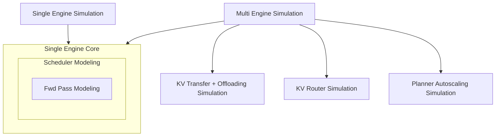
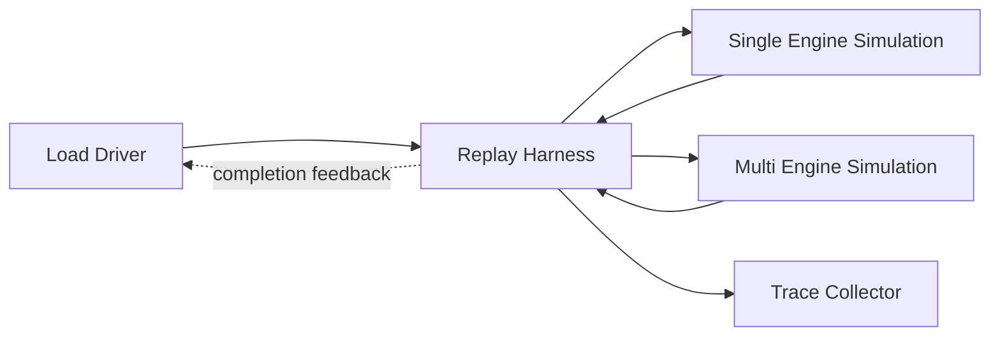
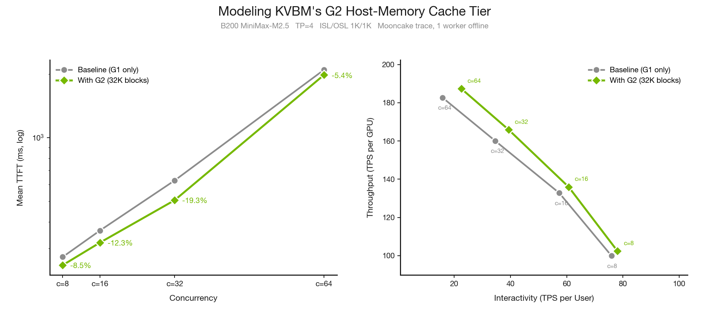
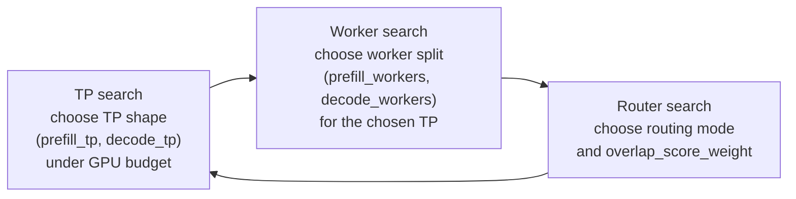
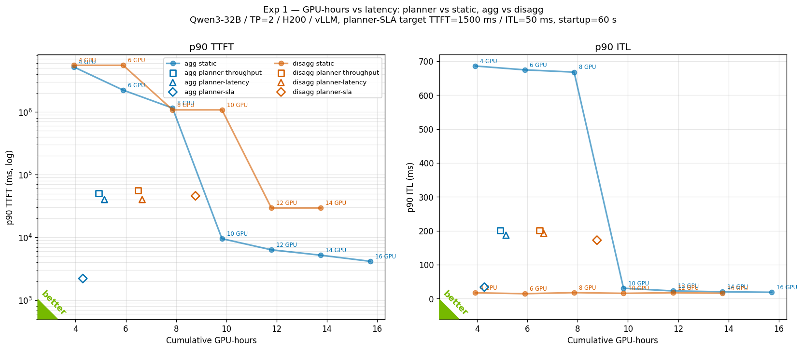
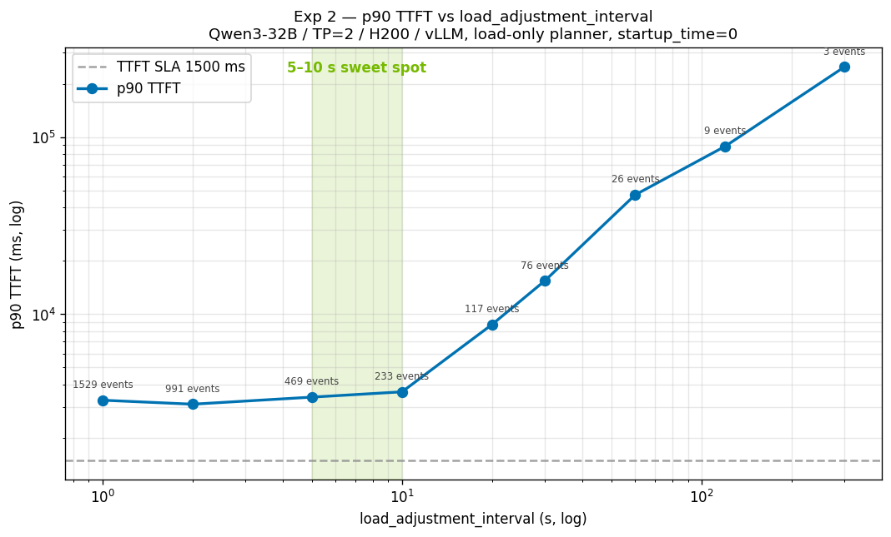
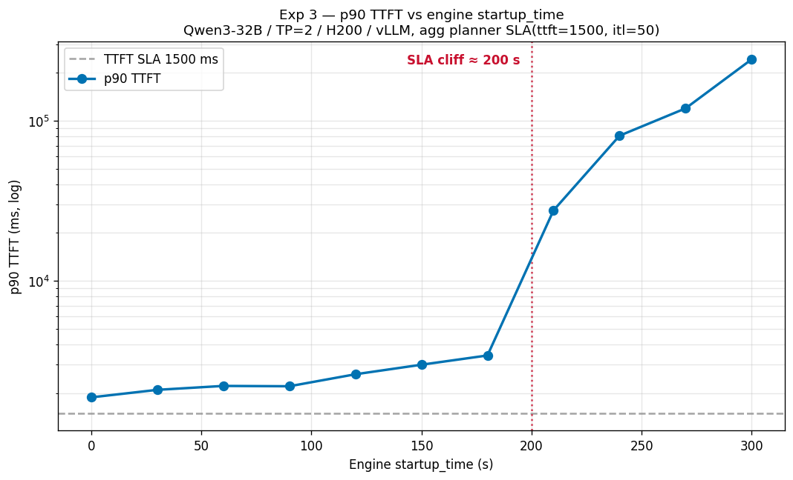

<!--
SPDX-FileCopyrightText: Copyright (c) 2025-2026 NVIDIA CORPORATION & AFFILIATES. All rights reserved.
SPDX-License-Identifier: Apache-2.0
-->

# Working title: DynoSim: A Dynamo Digital Twin

[placeholder: final author list and publication date]

[placeholder: final hero/lead image if needed]

> Draft status: unpublished working draft. Keep this file out of `docs/index.yml`
> and `docs/blogs/index.mdx` until the post is ready to publish.

Before investing millions, or even billions, of dollars in data center
infrastructure, teams want a clear view of the value that infrastructure is
likely to produce. That is especially hard for modern LLM serving, where a
deployment has to choose the model backend, tensor-parallel shape,
prefill/decode split, worker counts, scheduler settings, routing policy, KV
reuse and offload behavior, autoscaling thresholds, and deployment topology.

Those choices interact across layers. Engine schedulers turn backend pass timing
into token-producing batches. Dynamo's
[Router](../../components/router/router-guide.md) decides where each request
lands, autoscaling decisions adjust capacity only after startup or
specialization delays, and the
[KV Block Manager (KVBM)](../../components/kvbm/kvbm-guide.md) determines when
cached state is reused, moved, offloaded, or recomputed. A local improvement can
shift the bottleneck somewhere else, and for larger models even one realistic
experiment can require many GPUs or nodes before we learn whether the idea was
worth testing.

That is the motivation for a Dynamo digital twin.

[placeholder: confirm exact public wording for "digital twin"]

In this post, a digital twin means a workload-driven discrete-event simulation
of the Dynamo serving stack: engine schedulers, forward-pass timing, KV and cache
behavior, routers, autoscaling, and workload traces. The goal is not a purely
analytical estimate and not a bit-exact hardware emulator. The goal is a faithful
serving simulation at the atomic level of forward passes, with the Dynamo
components above the engine included in the same event timeline.

That puts Dynamo's simulation in the middle ground between spreadsheet estimates
and full cluster experiments. It preserves component boundaries while studying
their interactions on one simulated timeline, and it is cheap enough to screen
many design candidates before spending hardware time. Because the simulator is
implemented in Rust, it is also practical to simulate thousands of workers on a
developer laptop.

That fidelity has to be earned. The twin combines measured engine timing with
real Dynamo component cores, swapping live async and runtime bridges for
deterministic replay bridges: Router simulation uses KV router primitives and
configuration, Planner replay drives the Planner state machine, and worker
passes reuse the mocker scheduler cores. Live runs expose the remaining deltas,
which become calibration inputs for the next simulation pass.

DynoSim optimizes how existing engine profiles and Dynamo components are
assembled for a workload.

## Why Simulate LLM Serving?

The real power of simulation is not just prediction. It is decision-making.

The resulting loop is useful because it prices decisions before they hit the
cluster. The twin can ask whether a different topology, transfer path, batching
policy, or backend configuration changes the best Router, Planner, or KVBM
choice, then send only the strongest candidates to real-cluster validation.

As a scale reference, on an Apple M4 MacBook Air, the single-threaded Rust
offline replay simulated the full 23,608-request Mooncake trace with eight
round-robin workers and 512-token trace and engine blocks in 2.41 seconds of
wall time. The simulated serving window was 60.1 minutes, about 1,500x faster
than real time. The replay loop is single-threaded by design; the intended
scaling path is to run many independent replays in parallel.

That gives Dynamo a practical loop for research, engineering scoping, and
customer-facing sizing.

- **Research:** Test routing, autoscaling, prefill/decode, KV/cache, and
  topology ideas, and generate KV cache traces before spending cluster time.
- **Engineering:** Turn opportunity costs into thresholds. If specializing one
  decode worker into N prefill workers takes X seconds, the twin can show when X
  breaks the service-level agreement (SLA) and what target makes the work worth
  prioritizing.
- **Customer-facing sizing:** Compare GPU counts, worker layouts, backends, and
  deployment topologies against a workload and SLA before committing capacity.

## 1. Architecture: Composing Dynamo As Events

The key design choice is composition. Dynamo's simulation story is not one
monolithic model. It is a set of components that mirror serving-system concepts
and interact through a simulated timeline.

One of those components is the [Planner](../../components/planner/planner-guide.md):
Dynamo's autoscaling component. It computes scaling targets from live metrics,
profiles, and SLA goals.

[placeholder: architecture Mermaid diagram polish or replacement with production graphic]

The **Single Engine Core** models one worker: scheduler behavior plus
forward-pass timing. The **Single Engine Simulation** wraps that core as one
modeled execution stream. The **Multi Engine Simulation** composes many workers
and adds the system behaviors that only exist across workers: admission,
routing, KV movement, queueing, imbalance, and Planner decisions.

KVBM and distributed cache simulation are treated as near-future component work
in this draft rather than as a fully hooked-up claim today.

### 1.1 DES Basics: LLM Inference As Events

Discrete-event simulation, or DES, is a simple idea with a lot of leverage. The
simulator has a virtual clock and an event queue. Components do not wait in real
time. Instead, they schedule future events: a request arrives, a forward pass
finishes, a KV handoff completes, a worker becomes available, or the Planner
takes an action. The runtime jumps to the next event, updates system state, and
lets components schedule more events.

That gives us deterministic, replayable timelines. The simulator can run a long
serving workload without sleeping for the actual time the workload would take.
The trace collector then computes metrics from the simulated timeline: time to
first token (TTFT), time per output token (TPOT), end-to-end latency, output
throughput, cache reuse, and feasibility against the selected objective or SLA.

### 1.2 A Request's Journey Through The Twin

[placeholder: request lifecycle diagram if we decide to turn the numbered walkthrough into a figure]

One request makes the DES model concrete:

1. A load generator, such as Dynamo AIPerf, emits a request from a trace or
   synthetic workload.
2. The router decides where the request should go, or whether it should wait.
3. The selected engine scheduler batches the request into a prefill or decode
   pass.
4. Hardware-informed timing, such as timing backed by
   [AI Configurator (AIC)](../../kubernetes/model-deployment-guide.md#rapid-default),
   estimates the duration of that pass.
5. KV handoff, cache, or offload-related events may be scheduled on the same
   virtual timeline.
6. Decode produces visible output tokens.
7. The trace collector records request-level and system-level metrics.

The important part is that every component decision changes future events: a
router decision affects the worker's queue, a Planner scaling decision delays
capacity, and a KV movement decision can change when decode begins.

### 1.3 Replay Harness: Driving The Twin

[placeholder: replay harness Mermaid diagram polish or replacement with production graphic]

The replay harness connects workload generation to the simulated components and
then back to metrics. The load side can be a recorded trace or a synthetic
workload. At a high level, the same harness can represent open-loop and
closed-loop styles of traffic, Mooncake-style trace inputs, and more advanced
agentic or compute-heavy traffic patterns without making the blog post depend on
one specific generator. It can also generate KV cache traces from the same run,
so cache behavior can be inspected alongside request metrics.

The collector is the other end of the loop. It turns the simulated lifecycle into
observable serving metrics: throughput, TTFT, TPOT, end-to-end latency, prefix
cache reuse, and feasibility.

## 2. Simulating The Dynamo Digital Twin

The architecture and DES overview above explain the mechanism. The
Dynamo-specific value comes from which components are placed into that mechanism:
engine schedulers, forward-pass timing, routers, Planner decisions, and KV/cache
behavior.

### 2.1 Single Engine Simulation: Scheduler Fidelity Matters

A single engine is not just a tokens-per-second estimate. The scheduler decides
which requests enter each pass, how prefill and decode work are batched, and how
KV pressure changes progress. DynoSim keeps that backend-specific: the vLLM path
models a waiting/running scheduler with shared token budget and
preemption/recompute, while the SGLang path models radix-cache-aware admission,
chunked-prefill budgets, and prefix-preserving decode retraction.

AIC fits into this picture as engine-side timing: given the model, backend,
system, tensor-parallel shape, and pass shape, it estimates how long prefill or
decode work should take. The scheduler simulation decides what each pass
contains; AIC estimates the duration of that chosen pass. The combination is the
point: AIC informs pass speed, while the mocker/replay scheduler models the
serving behavior around the pass.

The figure below shows why that scheduler layer matters. AIC gives strong
fidelity to real silicon for engine-side performance, especially for throughput
and token time. But TTFT is sensitive to how requests wait, batch, chunk, and
enter prefill under high concurrency.

The model tested is MiniMax-M2.5 FP8 on B200, with TP=4, ISL=1K, OSL=1K, at
concurrencies from 8 to 64. Mocker tracks the hardware trend across throughput
and latency, with high-concurrency TTFT showing why scheduler modeling matters.

### 2.2 Multi Engine Simulation: From Workers To Systems

For a purely feed-forward policy, multi-engine simulation is almost mechanical:
pre-allocate each request to a worker queue, run the single-engine simulations in
parallel, and collect the results. Round-robin routing without feedback is the
simple version of this world.

The power of Dynamo, and any serious inference framework, comes from components
that make online decisions from active system feedback. A Router may need current
cache state and decode load. The Planner may need traffic, worker state, and SLA
signals. KVBM may need transfer pressure, tier capacity, and future cache
availability. Multi-engine simulation has to model those feedback loops: each
component consumes events from the shared heap, observes the current simulated
state, and schedules future decisions or completions back into that same heap.

#### Router As A Simulated Dynamo Component

The Router is part of the simulated system, not a post-processing heuristic.

Router framing:

| Stage | Router role |
|---|---|
| Inputs | Prefix/cache information, worker load, active requests, policy weights |
| Decision | Choose a worker, queue the request, or apply an admission policy |
| System effect | Cache reuse, load balance, TTFT, throughput, and downstream decode pressure |

Because the Router shares the same event queue as engine completion and Planner
actions, a route that improves prefix reuse may increase queueing somewhere
else, while a route that balances load may give up a cache hit. The same event
model can partially test fault-tolerance paths via random failure-mode
injection: unavailable workers, replacement capacity, or request migration.

#### Planner As A Feedback-Driven Component

Like the Router, the Planner makes decisions from feedback produced by the rest
of the system: engine metrics, traffic, cache state, and worker state.

Planner framing:

| Stage | Planner role |
|---|---|
| Inputs | Traffic observations, forward-pass metrics, worker state, capacity signals |
| Decision | Scale workers, change allocation, or hold steady |
| System effect | Future capacity, responsiveness, stability, routing pressure, and prefill/decode balance |

Planner decisions are especially natural in DES because scale-up does not make
capacity appear instantly. It schedules future state changes that interact with
requests already in the system, router decisions still to come, and engine
queues already forming.

#### KV Block Manager Simulation

KVBM manages KV blocks across the serving memory hierarchy: local HBM, host
memory, SSD, and distributed or remote cache. Local lower-tier cache behavior can
often be modeled as timing and resource pressure: G1 (GPU memory), G2 (host
memory), transfer bandwidth, tier capacity, and eventually G3 (disk). Distributed
cache is where the simulation becomes more interesting. Offload, onboard, remote
read, and placement decisions affect routing, scheduling, queueing, and future
cache state, so they need to be registered as events on the same timeline as the
rest of the serving harness.

As a concrete example, the figure below shows what the mocker predicts when the
G2 host-memory tier is enabled (sized at 32,768 blocks) on the same
single-engine B200 MiniMax-M2.5 setup from §2.1, replaying the full
23,608-request Mooncake trace:

Mean TTFT improves the most at c=32 (-19.3%), where prefill cost still
dominates and host-memory KV hits skip prefill work; the benefit narrows at
c=64 (-5.4%) as decode pressure starts to mask the prefill savings. On the
steady-state throughput-vs-interactivity Pareto, G2 sits up-and-right of the
baseline at every concurrency: throughput per GPU shifts modestly (+2–4%),
while interactivity gains the most at c=64 where avoided prefill recompute
frees decode capacity.

Replay can also drive
[NIXL (NVIDIA Inference tranXfer Library)](../../api/nixl-connect/README.md)
reads and writes against a real distributed cache target. Those measurements
calibrate transfer cost, placement behavior, and contention, then feed back into
the distributed cache model instead of relying only on hand-tuned assumptions.

## 3. Optimization And Discovery With The Twin

Once the twin can run a workload through composed components, it can also search
the design space. The optimizer uses replay as the scoring function: propose a
layout, run the workload, collect metrics, and compare the result against the
objective.

This three-block loop is not meant to be the final form of optimization. It is a
concrete example of the kind of joint search the digital twin makes practical:
optimize the parallel mapping and worker layout at the same time as the router
policy. The best choice in one dimension depends on the others, so the loop
revisits them rather than treating them as independent knobs.

The same pattern can grow as more components become first-class simulation
targets. Planner scaling parameters, KVBM/offload policies, distributed cache
placement, and future topology-aware movement strategies can be inserted into
the search loop as additional coordinates or as richer algorithmic policies.

The default objective is throughput. Latency-oriented objectives, such as mean
TTFT or mean end-to-end latency, can be scored as negative values so the search
still maximizes a single score. Feasible states are ranked by the selected
objective. If all states are infeasible, the fallback is to rank by violation
penalty instead of pretending the best infeasible result is acceptable.

### 3.1 Example Result: A Workload-Relative Candidate

[placeholder: compact optimizer result table]

[placeholder: confirm Qwen/Qwen3-32B result numbers before publication]

Draft table shape:

| Category | Draft value |
|---|---|
| Workload | Qwen/Qwen3-32B, vLLM, H200, long-prefill shared-prefix replay |
| Budget | 16 GPUs |
| Objective | Throughput |
| Winning layout | `prefill_tp=4`, `decode_tp=1`, `prefill_workers=3`, `decode_workers=4` |
| Router | `kv_router`, `overlap_score_weight=0.5` |
| Key metrics | `output_throughput_tok_s=958.936306`, `prefix_cache_reused_ratio=0.4997`, `mean_ttft_ms=43442.98`, `mean_tpot_ms=35.16`, `mean_e2e_latency_ms=52409.77` |
| Interpretation | This is a strong candidate for this workload, not a universal best layout. |

The takeaway is not that one configuration is always best. It is that the twin
can turn a large configuration space into a workload-specific deployment
shortlist.

### 3.2 Discovery Examples Beyond The Current Optimizer

The same simulation loop can be used for research, not just configuration search.
Some experiments tune exposed parameters. Others change the algorithm itself.

[placeholder: router discovery experiment examples and owners]

Router discovery examples:

- Compare routing cost functions.
- Search queue policies when workers are saturated.
- Tune admission thresholds.
- Compare prefix-cache-aware and latency-aware routing.
- Use different routing policies for prefill and decode stages.
- Add optional AIC-backed decode-load estimates so router decisions can better
  account for downstream decode pressure.

#### Planner Discovery Examples
Planner exposes a family of stateful decisions: when to scale, how aggressively,
and which optimization target to chase. Their effects compound across minutes of
traffic, and a misconfigured Planner can under-provision, miss SLA, or thrash
workers. The twin lets us study those dynamics before paying for a full
Kubernetes-scale experiment.

The three experiments below use the Mooncake FAST25 `toolagent_trace`
(~23,600 requests over 59 minutes, avg ISL 8.6k / OSL 182, ~6.7 rps) on
Qwen3-32B at TP=2 on H200-SXM. All scripts and per-run reports are
reproducible from `scripts/planner_exp_{1,2,3}/`.

**Setup tradeoffs: planner vs static, agg vs disagg.** For each topology we
sweep static replica counts (no planner; fixed deployment) and overlay three
planner runs (`optimization_target` ∈ {throughput, latency, sla}) on the
resulting Pareto plane. The SLA runs use a representative target of
TTFT=1500 ms, ITL=50 ms.

The agg SLA planner sits below the static-deployment Pareto curve on TTFT —
roughly the same GPU-hours as a 4-GPU static deployment, but with p90 TTFT
two orders of magnitude lower. Throughput-mode and latency-mode planner
baselines, by contrast, both fall above the static curve: they spend
GPU-hours without buying tail-latency improvement. Disagg on this long-ISL
workload is consistently worse than agg under every planner target — a
useful negative result that costs nothing in simulation and would have been
expensive to discover live.

**Tuning load-based scaling: responsiveness vs oscillation.** With throughput
scaling disabled, `load_adjustment_interval` is the only knob driving fast
reactions. Sweeping it across {1, 2, 5, 10, 20, 30, 60, 120, 300} s with
instantaneous engine startup isolates the responsiveness-vs-flap tradeoff.

TTFT and ITL plateau between 1 and 10 seconds, while the scaling-event count
drops from 764 to 116 over the same range — short intervals burn decisions
without buying latency. Past ~30 s the planner can no longer keep up with
traffic bursts: p90 TTFT degrades to 49 s at 60 s interval and 249 s at
300 s. The sweet spot for this trace is around 5–10 s — short enough to
track load, long enough to avoid pointless flapping.

**Cold-start time and the SLA cliff.** On a real cluster, scale-up is not
instant; a fresh engine pod takes seconds to minutes to become usable. The
mocker's `startup_time` parameter injects this delay and lets us measure
how the planner copes.

For Qwen3-32B at TP=2, the planner holds SLA up to roughly a 200-second
startup delay. Beyond that, p90 TTFT rises sharply, and at 300 s the system
runs perpetually backlogged (242 s p90 TTFT). GPU-hours stays nearly flat
across the sweep — the planner does not over-provision to compensate for
slow scale-up; it simply falls behind. The scaling-event count drops
monotonically (42 → 9) as long-startup runs commit to fewer, longer-lived
decisions. This is the kind of curve that motivates predictive scaling and
pre-warmed reserves rather than purely reactive load tracking.

These three experiments do not exhaust the design space — they illustrate
how it can be explored cheaply. Other natural questions for the same loop:

- Compare scale-up and scale-down thresholds, and asymmetric
  hysteresis policies.
- Search prefill/decode pool allocation policies (especially once the
  planner can rebalance roles in disagg).
- Feed router-aware or cache-aware signals into planner decisions.
- Couple planner and router policies — e.g. shrink the worker pool when
  the router predicts a cache-affine traffic drop.

[placeholder: KV/cache discovery experiment examples and owners]

KV and cache discovery examples:

- Tune offload thresholds.
- Measure sensitivity to KV transfer bandwidth.
- Evaluate future KVBM policies.
- Study distributed cache and cross-machine movement strategies.
- Compare move-vs-recompute decisions.
- Couple cache-aware routing with cache-aware autoscaling.

These are natural twin questions: hold the workload fixed, change one component
policy, and measure the system-level effect before going to a real cluster.

[placeholder: agentic algorithm discovery workflow and owner]

Today, this kind of algorithm discovery is still mostly human-driven: engineers
choose a policy change, implement it, run replay, inspect the metrics, and decide
what to try next. A natural next step is to hook agentic harnesses into the same
replay loop. In that workflow, agents could propose nontrivial exploratory code
changes to router policies, Planner heuristics, or cache/offload strategies, run
the replay harness, compare against baselines, and surface promising candidates
for human review.

That would turn the digital twin into more than an optimizer over fixed knobs. It
would become a testbed for algorithm discovery, where humans still own the
system direction and validation bar, but agents can help explore the design space
between real-cluster experiments.

## 4. Simulation As The Inner Loop

The goal is not to replace real-cluster validation. The goal is to make that
validation more focused.

Simulation becomes the inner loop for design exploration. Real clusters remain
the outer loop for validation. Between those loops, Dynamo can test serving
algorithms as a system: scheduler behavior, routing policy, Planner control,
KV/cache movement, workload shape, and measured engine timing.

The payoff is not just a faster benchmark. Simulation turns infrastructure
planning from guesswork into an engineering discipline: use the twin to decide
what to build, where to optimize, how to size customer deployments, and which
live experiments are most likely to matter.

Looking forward, we plan to close this loop in production as well. A smart
sweeping algorithm built on top of the digital twin would run periodically
against recently-recorded production traffic, search the configuration space
under the current workload distribution, and recommend (or directly apply) a
reconfiguration when a materially better deployment is found. Because traffic
shape drifts over hours and days — different prompt mixes, ISL/OSL
distributions, or burst patterns — what was the right TP shape, prefill/decode
split, router policy, and Planner setting last week may no longer be optimal
today. A continuous twin-driven sweep keeps the live deployment tracking the
current optimum instead of relying on a one-shot launch decision.

[placeholder: external review for claims about real-cluster validation vs simulation]

[placeholder: final links to relevant Dynamo docs, PRs, or prior posts]
