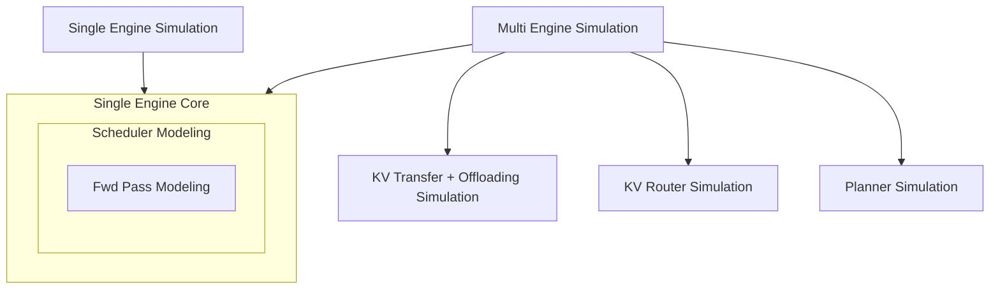
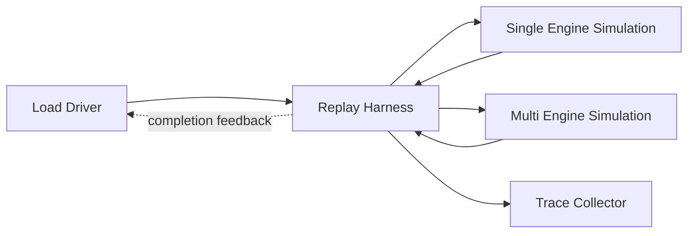
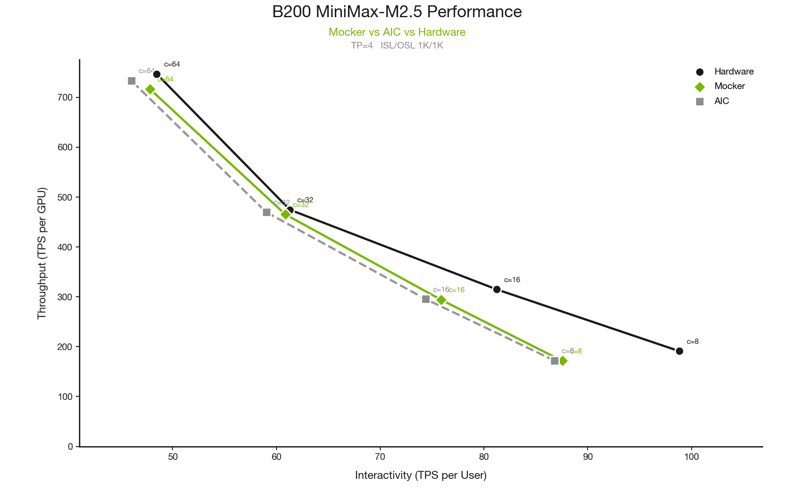
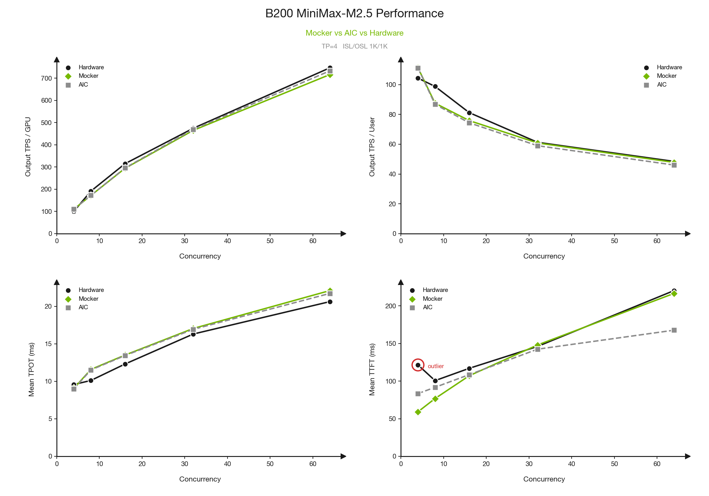
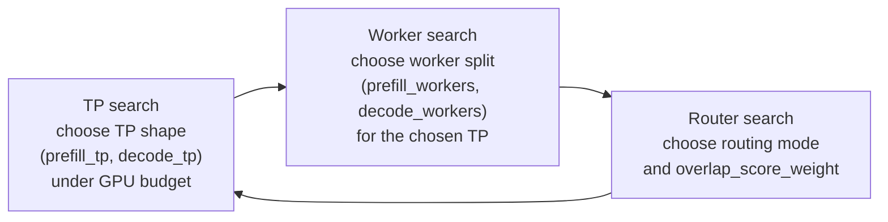

<!--
SPDX-FileCopyrightText: Copyright (c) 2025-2026 NVIDIA CORPORATION & AFFILIATES. All rights reserved.
SPDX-License-Identifier: Apache-2.0
-->

# Working title: A Dynamo Digital Twin

[placeholder: final author list and publication date]

[placeholder: final hero/lead image if needed]

> Draft status: unpublished working draft. Keep this file out of `docs/index.yml`
> and `docs/blogs/index.mdx` until the post is ready to publish.

Modern LLM serving is much more than loading model weights onto GPUs. At the
bottom, kernels execute the attention and MLP work. Above them, engines such as
vLLM, SGLang, and TensorRT-LLM schedule forward passes, batch requests, manage KV
blocks, and decide how prefill and decode work share the device. Above that,
Dynamo adds the system layer: a router decides which engine should receive each
request based on prefix affinity and active load, a planner decides when to scale
workers up or down based on dynamic service goals, and the KV Block Manager
controls how cached blocks are offloaded and distributed.

That stack is powerful, but it is also hard to optimize. A routing policy can
change cache reuse and downstream decode pressure. A planner decision can change
future queueing after a startup delay. A block movement policy can change whether
a request pays recompute, transfer, or offload cost. For larger models, even
running a single realistic experiment can require many GPUs or nodes before we
learn whether the idea was worth testing.

That is the motivation for a Dynamo digital twin.

[placeholder: confirm exact public wording for "digital twin"]

In this post, a digital twin means a replayable discrete-event simulation of the
Dynamo serving stack: engine schedulers, forward-pass timing, KV and cache
behavior, routers, planners, and workload traces. The goal is not a purely
analytical estimate and not a bit-exact hardware emulator. The goal is a faithful
serving simulation at the atomic level of forward passes, with the Dynamo
components above the engine included in the same event timeline.

That makes simulation the inner loop: cheap enough to run many design
experiments, realistic enough to decide which ones deserve hardware time. Because
the simulator is implemented in Rust, it can also run at a scale that is useful
for systems exploration; it is practical to simulate thousands of workers on a
developer laptop.

The useful middle ground is to preserve component boundaries while still studying
their interactions. We can compare router policies, planner policies, and
KV/cache policies under the same replayed traffic, then validate the strongest
candidates on hardware instead of starting every idea as a full cluster
experiment.

Every result from this kind of optimizer is workload-relative. That is a feature,
not a caveat: the point is to replay the traffic shape we care about, compare
system designs under that same workload, and reduce a large search space to a few
strong candidates for real cluster validation.

## 1. Architecture And DES: Composing Dynamo As Events

The key design choice is composition. Dynamo's simulation story is not one
monolithic model. It is a set of components that mirror serving-system concepts
and interact through a simulated timeline.

[placeholder: architecture Mermaid diagram polish or replacement with production graphic]

The **Single Engine Core** models the behavior of one serving worker. It includes
scheduler behavior and forward-pass timing. The scheduler decides what work goes
into a pass; the timing model estimates how long that pass takes.

The **Single Engine Simulation** wraps that core as one worker with one modeled
execution stream.

The **Multi Engine Simulation** composes many single engines. It can represent
aggregated serving, where workers are broadly equivalent, or disaggregated
serving, where prefill and decode capacity are separated. Once there are
multiple engines, routing, KV movement, queueing, and imbalance become part of
the system behavior.

Around those engines, Dynamo can simulate serving components such as KV transfer,
offloading hooks, the KV router, and the planner. KVBM and distributed cache
simulation are treated as near-future component work in this draft rather than
as a fully hooked-up claim today.

### 1.1 DES Basics: LLM Inference As Events

Discrete-event simulation, or DES, is a simple idea with a lot of leverage. The
simulator has a virtual clock and an event queue. Components do not wait in real
time. Instead, they schedule future events: a request arrives, a forward pass
finishes, a KV handoff completes, a worker becomes available, or the planner
takes an action. The runtime jumps to the next event, updates system state, and
lets components schedule more events.

That gives us deterministic, replayable timelines. The simulator can run a long
serving workload without sleeping for the actual time the workload would take.
The trace collector then computes metrics from the simulated timeline: TTFT,
TPOT, end-to-end latency, output throughput, cache reuse, and feasibility against
the selected objective or SLA.

### 1.2 A Request's Journey Through The Twin

[placeholder: request lifecycle diagram if we decide to turn the numbered walkthrough into a figure]

One request makes the DES model concrete:

1. The load generator emits a request from a trace or synthetic workload.
2. The router decides where the request should go, or whether it should wait.
3. The selected engine scheduler batches the request into a prefill or decode
   pass.
4. Hardware-informed timing, such as AIC-backed timing, estimates the duration
   of that pass.
5. KV handoff, cache, or offload-related events may be scheduled on the same
   virtual timeline.
6. Decode produces visible output tokens.
7. The trace collector records request-level and system-level metrics.

The important part is that every component decision changes the same global
timeline. A router decision affects the worker's future queue. A planner scaling
decision has a delay before capacity appears. A KV movement decision can change
when decode begins. DES gives those interactions a concrete place to happen.

### 1.3 Replay Harness: Driving The Twin

[placeholder: replay harness Mermaid diagram polish or replacement with production graphic]

The replay harness connects workload generation to the simulated components and
then back to metrics. The load side can be a recorded trace or a synthetic
workload. At a high level, the same harness can represent open-loop and
closed-loop styles of traffic, Mooncake-style trace inputs, and more advanced
agentic or compute-heavy traffic patterns without making the blog post depend on
one specific generator.

The collector is the other end of the loop. It turns the simulated lifecycle into
observable serving metrics: throughput, TTFT, TPOT, end-to-end latency, prefix
cache reuse, and feasibility.

## 2. Simulating The Dynamo Digital Twin

The architecture and DES overview above explain the mechanism. The
Dynamo-specific value comes from which components are placed into that mechanism:
engine schedulers, forward-pass timing, routers, planner decisions, and KV/cache
behavior. This is the meaty part of the twin. Each component observes simulated
state, makes decisions, and changes the future event stream for the rest of the
system.

### 2.1 Single Engine Simulation: Scheduler Fidelity Matters

A single engine is not just a tokens-per-second estimate. The scheduler decides
which requests enter a pass, how prefill and decode work are batched, whether
prefill is chunked, how many sequences are active, and how KV pressure affects
progress. Those decisions are exactly what turn model timing into serving
behavior.

AIC fits into this picture as engine-side timing. At a high level, AIC is a
performance estimator for model execution on a target backend and hardware
configuration. Given the model, backend, system, tensor-parallel shape, and pass
shape, it estimates how long prefill or decode work should take.

That estimate is not the whole serving simulation. The scheduler simulation
decides what each pass contains: which requests are batched, how much prefill is
chunked, how many decode sequences are active, and what KV state is in play. AIC
then estimates the duration of that chosen pass. The combination is the point:
AIC informs the speed of the pass, while the mocker/replay scheduler models the
serving behavior around the pass.

The figure below shows why that scheduler layer matters. AIC gives strong
fidelity to real silicon for engine-side performance, especially for throughput
and token time. But TTFT is sensitive to how requests wait, batch, chunk, and
enter prefill under high concurrency. That is expected: pass-level performance
estimates tell us how fast a selected batch runs, while scheduler simulation
models how that batch was formed and when each request first gets admitted.

The model tested is MiniMax-M2.5 FP8 on B200, with TP=4, ISL=1K, OSL=1K, at concurrencies from 8 to 64. Here are the mean absolute percentage errors (MAPE) vs. real hardware:

| Metric | Mocker MAPE | AIC MAPE |
|---|---|---|
| TPS/GPU | 5.7% | 4.7% |
| TPS/User | 5.0% | 7.3% |
| TPOT | 9.0% | 8.1% |
| TTFT | 8.8% | 10.6% |

Mocker achieved comparable or better accuracy across all metrics, notably with better TTFT estimation at high concurrency (64).

### 2.2 Multi Engine Simulation: From Workers To Systems

Once multiple engines exist, the central question becomes: where should this
request go, and what future bottleneck does that choice create?

In aggregated serving, many workers can serve the same role. In disaggregated
serving, prefill and decode capacity are separated. Requests move through stages,
and the best system layout depends on interactions between prefill throughput,
decode pressure, queueing, KV handoff cost, cache reuse, and worker availability.

That is where single-engine fidelity becomes system-level fidelity. Each worker
still uses the single-engine core, but the multi-engine runtime adds admission,
handoff, queueing, and routing decisions around those cores.

### 2.3 Router As A Simulated Dynamo Component

The router is part of the simulated system, not a post-processing heuristic.

Router framing:

| Stage | Router role |
|---|---|
| Inputs | Prefix/cache information, worker load, active requests, policy weights |
| Decision | Choose a worker, queue the request, or apply an admission policy |
| System effect | Cache reuse, load balance, TTFT, throughput, and downstream decode pressure |

Because the router decision enters the same DES event queue as engine completion
and planner actions, it affects future state. A route that improves prefix reuse
may increase queueing somewhere else. A route that balances load may give up a
cache hit. A good simulation lets us study those tradeoffs without deploying a
new router policy first.

### 2.4 Planner As A Feedback-Driven Component

Like the router, the planner makes decisions from feedback produced by the rest
of the system. Dynamo components are not isolated knobs: they observe engine
metrics, traffic, cache state, and worker state, then make decisions that affect
other components later in the same simulated timeline.

Planner framing:

| Stage | Planner role |
|---|---|
| Inputs | Traffic observations, forward-pass metrics, worker state, capacity signals |
| Decision | Scale workers, change allocation, or hold steady |
| System effect | Future capacity, responsiveness, stability, routing pressure, and prefill/decode balance |

Planner decisions are especially natural in DES because they are delayed system
events. A scale-up decision does not make capacity appear instantly. It schedules
future state changes that interact with the requests already in the system, the
router decisions still to come, and the engine queues already forming. That lets
us test whether a policy is responsive enough without making it oscillate under
changing load.

### 2.5 KV Block Manager Simulation

Current KVBM simulation work is focused on local G1-to-G2 behavior in the
mocker/replay path. G1 is the scheduler-visible GPU KV capacity. When KVBM
offload is enabled, evicted G1 blocks can be handed to an in-process KVBM
offload engine, registered in a real `BlockManager<G2>`, and later swapped back
into G1 with simulated transfer delay when a request finds a G2 prefix hit.
Live mode drives this path with wall-clock time; offline replay drives the same
hot path with virtual time from the DES loop.

There are two different claims to keep separate.

Today, the simulation can represent KV-related effects where they are hooked into
the replay path, such as handoff delay between stages and local cache/offload
effects that influence engine progress.

Near-future work is to treat KVBM as a first-class DES component in the same
style as the router and planner. In that model, cache movement, placement, and
memory hierarchy behavior would schedule their own events and feed back into
engine, router, and planner decisions.

For distributed cache and CMX, the public wording should stay in roadmap
territory. The current modeled path is local G2 with mock data movement and
bandwidth-sensitive timing; extending that to shared lower tiers requires
explicit models for cross-worker placement, topology, and shared-resource
contention.

The longer-term direction is distributed cache simulation: CMX-style
cross-machine movement, topology-aware routing, bandwidth-sensitive placement,
and policies for when to reuse, move, offload, or recompute KV.

## 3. Optimization And Discovery With The Twin

Once the twin can run a workload through composed components, it can also search
the design space. The optimizer uses replay as the scoring function: propose a
layout, run the workload, collect metrics, and compare the result against the
objective.

This three-block loop is not meant to be the final form of optimization. It is a
concrete example of the kind of joint search the digital twin makes practical:
optimize the parallel mapping and worker layout at the same time as the router
policy. The best choice in one dimension depends on the others, so the loop
revisits them rather than treating them as independent knobs.

The same pattern can grow as more components become first-class simulation
targets. Planner scaling parameters, KVBM/offload policies, distributed cache
placement, and future topology-aware movement strategies can be inserted into
the search loop as additional coordinates or as richer algorithmic policies.

The default objective is throughput. Latency-oriented objectives, such as mean
TTFT or mean end-to-end latency, can be scored as negative values so the search
still maximizes a single score. Feasible states are ranked by the selected
objective. If all states are infeasible, the fallback is to rank by violation
penalty instead of pretending the best infeasible result is acceptable.

### 3.1 Example Result: A Workload-Relative Candidate

[placeholder: compact optimizer result table]

[placeholder: confirm Qwen/Qwen3-32B result numbers before publication]

Draft table shape:

| Category | Draft value |
|---|---|
| Workload | Qwen/Qwen3-32B, vLLM, H200, long-prefill shared-prefix replay |
| Budget | 16 GPUs |
| Objective | Throughput |
| Winning layout | `prefill_tp=4`, `decode_tp=1`, `prefill_workers=3`, `decode_workers=4` |
| Router | `kv_router`, `overlap_score_weight=0.5` |
| Key metrics | `output_throughput_tok_s=958.936306`, `prefix_cache_reused_ratio=0.4997`, `mean_ttft_ms=43442.98`, `mean_tpot_ms=35.16`, `mean_e2e_latency_ms=52409.77` |
| Interpretation | This is a strong candidate for this workload, not a universal best layout. |

The takeaway is not that one configuration is always best. The takeaway is that
the digital twin can turn a large configuration space into a smaller set of
hardware candidates, with each result tied to the workload that produced it.

### 3.2 Discovery Examples Beyond The Current Optimizer

The same simulation loop can be used for research, not just configuration search.
Some experiments tune exposed parameters. Others change the algorithm itself.

[placeholder: router discovery experiment examples and owners]

Router discovery examples:

- Compare routing cost functions.
- Search queue policies when workers are saturated.
- Tune admission thresholds.
- Compare prefix-cache-aware and latency-aware routing.
- Use different routing policies for prefill and decode stages.
- Add optional AIC-backed decode-load estimates so router decisions can better
  account for downstream decode pressure.

[placeholder: planner discovery experiment examples and owners]

Planner discovery examples:

- Compare scale-up and scale-down thresholds.
- Study delayed scaling behavior.
- Search prefill/decode pool allocation policies.
- Balance responsiveness against oscillation risk.
- Feed router-aware or cache-aware signals into planner decisions.

[placeholder: KV/cache discovery experiment examples and owners]

KV and cache discovery examples:

- Tune offload thresholds.
- Measure sensitivity to KV transfer bandwidth.
- Evaluate future KVBM policies.
- Study distributed cache and CMX movement strategies.
- Compare move-vs-recompute decisions.
- Couple cache-aware routing with cache-aware planning.

These are painful questions to answer on hardware first. They are natural
questions for a replayable digital twin: hold the workload fixed, change one
component policy, and measure the system-level effect.

[placeholder: agentic algorithm discovery workflow and owner]

Today, this kind of algorithm discovery is still mostly human-driven: engineers
choose a policy change, implement it, run replay, inspect the metrics, and decide
what to try next. A natural next step is to hook agentic harnesses into the same
replay loop. In that workflow, agents could propose nontrivial exploratory code
changes to router policies, planner heuristics, or cache/offload strategies, run
the replay harness, compare against baselines, and surface promising candidates
for human review.

That would turn the digital twin into more than an optimizer over fixed knobs. It
would become a testbed for algorithm discovery, where humans still own the
system direction and validation bar, but agents can help explore the design space
between hardware experiments.

## 4. Simulation As The Inner Loop

The goal is not to replace hardware validation. The goal is to make hardware
validation more focused.

Simulation becomes the inner loop for design exploration. Hardware remains the
outer loop for validation. Between those loops, Dynamo can test serving algorithms
as a system: scheduler behavior, routing policy, planner control, KV/cache
movement, workload shape, and hardware-informed timing.

The payoff is not just a faster benchmark. It is a place where Dynamo's serving
algorithms can be designed, stressed, and improved together.

[placeholder: external review for claims about hardware validation vs simulation]

[placeholder: final links to relevant Dynamo docs, PRs, or prior posts]
