# Dynamo Snapshot: Fast Startup for Inference Workloads on Kubernetes

## The Cold-Start Problem
The primary objective when optimizing LLM inference workloads is tokens per second — the higher the productive output per second of GPU time, the better the economics. Every second the GPU isn't producing tokens is money lost.

But steady-state performance numbers only tell us part of the story. When serving inference workloads in production, there are many reasons why a workload cannot run in the same configuration forever: customer demand fluctuates, model preferences shift, configurations are updated to chase better numbers, and workloads themselves occasionally fail and have to be restarted. The ability to bring up new instances of inference engines for a particular model/configuration, even on a single GPU, can take on the order of minutes. That is a long time to be paying for GPUs that aren't producing any tokens.

Here is a breakdown of the cold start time of various models for a single-GPU workload:

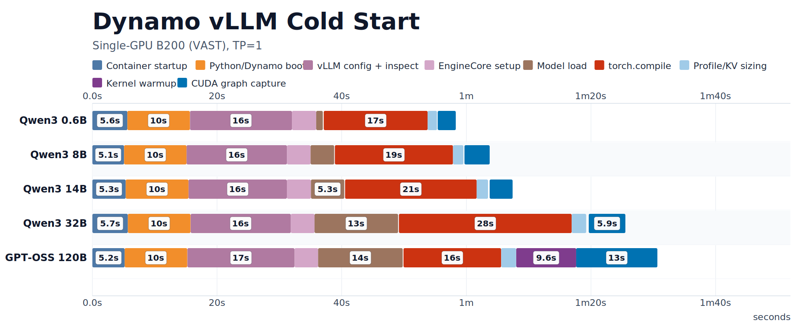

In our setup, weights are loaded from a very fast (VAST) PVC. For smaller models, almost all of the startup time comes from other sources of overhead. Even in a "warm" start scenario where certain artifacts (e.g. from torch.compile, kernel warmup, etc.) are cached, the reduction in cold start time is still not significant enough — much of the work that is done during the earlier phases of initialization cannot easily be cached.

Driving cold-start time down means tracking every contributor across every layer of the stack and getting all of them to cooperate. Even then, maintaining low cold start times while new features are constantly added to each inference engine is an uphill battle, not to mention that each inference engine needs to be optimized individually.

The well-known solution to this problem is *process-level* checkpoint/restore, which reduces the optimization surface to the process checkpoint image size and storage bandwidth. Operating at the OS process level keeps many of our optimizations *generic*, allowing them to transfer nicely across different workloads as well.

In this post, we introduce **Dynamo Snapshot** — our solution for checkpoint/restore of AI inference workloads on Kubernetes — along with the design choices and optimizations that get us to start times of **5 seconds or less**.

## CRIU and cuda-checkpoint
A running inference worker's checkpointable state has two components:

- Device state (GPU-side): CUDA contexts, streams, device memory, virtual address mappings, etc. This is not visible to the host. To serialize this state, we use the checkpointing capability of the CUDA driver (which is also exposed by the `cuda-checkpoint` command line tool) to dump the device state to CPU memory of the process owning each CUDA context.
- Host state (CPU-side): CPU memory, threads, file descriptors, namespaces, etc. The Linux kernel has all the bookkeeping necessary to be able to serialize this state. We use an open-source tool, **CRIU (Checkpoint/Restore in Userspace)** to walk the kernel's bookkeeping and serialize the process tree's state to disk.

These two tools compose cleanly to allow checkpoint/restore of the full inference worker state. When checkpointing:

1. `cuda-checkpoint` dumps all device state into CPU memory. It becomes a pure host process.
2. CRIU dumps all host-side process tree state to a folder in storage.

When restoring (potentially on a different node):

1. CRIU restores the process tree according to the serialized state from the same folder (note: distributed storage like NFS/SMB allows us to fetch the checkpointed artifact from a different node).
2. `cuda-checkpoint` restores the GPU state from what is serialized in CPU memory onto the new GPUs.

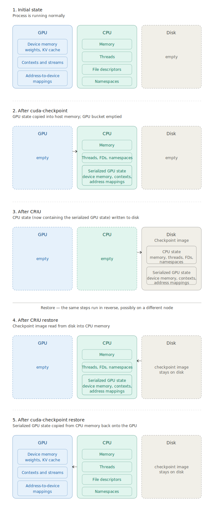

Since CRIU is run via an external process, **the restored workload process picks up at exactly the instruction it was at when it dumped.** This has a few implications:

- There is no clean way to override/replace in-memory process state. For instance, environment variables are not re-read after restore, so any stale checkpointed environment variables still remain in the restored process.
- There are no synchronization barriers between the workload and CRIU. If the workload needs to prevent being checkpointed until it is quiescent, or needs to be aware that it has been restored, these signals need to be managed by an orchestrator that calls CRIU/cuda-checkpoint and/or the workload itself.

## Dynamo Snapshot: Kubernetes
In Kubernetes, all workloads run inside containers, inside of pods. These containers abide by the OCI runtime specification which gives us a stable scaffold to design a checkpoint/restore solution around. Typically CRIU checkpoints will also have references to mounts/files in the overlay that need to be restored in tandem with the process as well. Therefore, we perform checkpoints at the container level.

Some OCI runtimes, namely `runc`, `runsc` and `podman` already have built-in container-level checkpoint/restore capabilities. `runc` and `podman` in particular delegate to CRIU. The checkpoints produced are full OCI images with the checkpointed process tree state baked in. However, we had a few requirements that prevented us from using these native checkpoint/restore capabilities.

- We needed to perform heavy customization/optimization of both CRIU and cuda-checkpoint.
- We couldn't rely on whether or not checkpoint/restore feature gates were exposed, even at the CRI level, because some cloud service providers do not offer control of kubelet at all. Moreover, this would also require installing CRIU on the host, which isn't always possible.
- We wanted flexibility to configure different storage backends for different parts of the checkpoint artifacts, instead of baking the checkpoint into an OCI image. Only the upperdir overlay and CRIU artifacts should be sufficient given a fixed "base" image.

The only portable, robust option was to spin up our own privileged DaemonSet (we call this `snapshot-agent`), easily installable via a Helm chart. The agent handles pre-checkpoint and post-restore process/overlay wiring so that it can reliably checkpoint the process tree, namespaces, overlays, etc. in an OCI-runtime-compatible fashion.

At a high level, the lifecycle of a checkpoint and a restore goes pod-by-pod, with the snapshot agent reaching in from outside the workload's container.

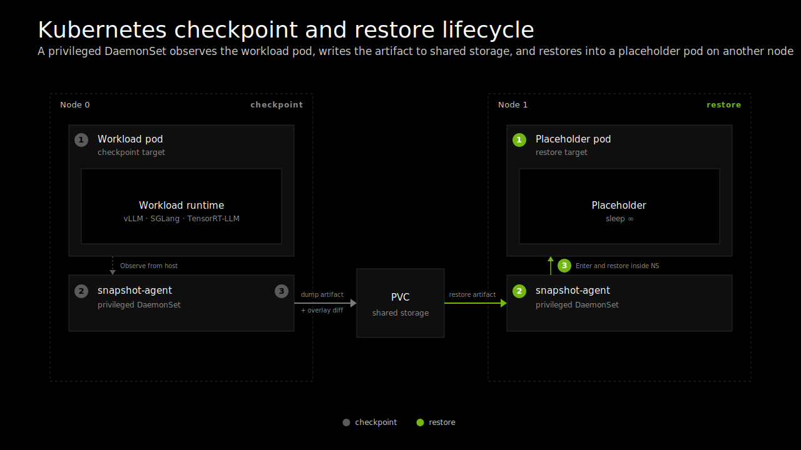

**Checkpoint:**

1. The user creates a checkpoint Job. This is an ordinary Kubernetes Job whose pod runs the workload, marked as a checkpoint source.
2. The snapshot agent on the same node sees the pod via its checkpoint marker.
3. Once the workload's readiness probe passes (we use it as a configurable signal that determines the workload is ready to be checkpointed), the snapshot agent begins the checkpointing process.
   1. The agent inspects the running container from the host side (PIDs, namespaces, mounts, overlays, etc.) without entering it.
   2. It runs cuda-checkpoint and CRIU against the container's process tree, and captures the container's overlay-filesystem diff.
   3. The artifact is written to storage (only shared PVC is supported at the moment).
4. The workload exits, and the Job completes and is garbage-collected.

**Restore (later, on any node):**

1. A placeholder pod is created with an annotation that marks it as a restore target. It uses the same base runtime image as the workload, but with the entrypoint overridden to `sleep infinity` (i.e. sits idle) and includes snapshot tooling. This establishes the namespaces that the restored worker lives inside.
2. The snapshot agent *enters the placeholder's namespaces from the host* and applies the overlay diff, runs CRIU restore and uses `cuda-checkpoint` to resume the CUDA state from *inside* the placeholder's namespaces.
3. Once the restore is complete, the snapshot agent writes a "restore complete" signal file to a path inside the container's filesystem that the workload can (optionally) consume.
4. The restored worker has now taken over the container/pod. The workload refreshes its pod identity by reading the new pod identity from a mount. To the rest of the cluster, the placeholder pod is now a valid worker.

Note: running CRIU restore inside of the placeholder's namespace allows the restored workload pod to not need a privileged security context, which means we don't compromise on Kubernetes isolation/security best practices.

## Dynamo Snapshot: The Workload
A Dynamo inference worker comes up in two phases:

1. **Engine initialization.** The configured inference engine (vLLM, SGLang, TensorRT-LLM) is started: communicators are initialized, weights are loaded, kernels are warmed up, graphs are compiled/captured, etc. By the end of this phase the worker is fully warm. It could serve a request, but is not yet discoverable to anything outside its own pod.
2. **Distributed runtime startup.** The worker connects to the Dynamo control plane and registers itself with the discovery backend, so the router and the rest of the graph can find it. From this point on, the worker is "live" — there are open connections to the control plane, and other components in the cluster are aware of this worker's pod identity.

If we were to implement checkpoint/restore naively, without the workload knowing it was being checkpointed, the readiness probe of the checkpoint job would correspond to a fully initialized distributed runtime that is registered to the discovery plane, which means there are active TCP connections that cannot be captured by CRIU.

We remedy this by configuring the readiness probe to be the presence of a "ready for checkpoint" signal file that is written after the engine initializes but *before* distributed runtime startup. At this point, the worker polls for another "restore complete" signal file while the snapshot agent is checkpointing it from outside — the checkpointed state of the worker could be at any arbitrary point inside the polling loop. On restore, the workload resumes inside of the polling loop, detects the signal file, and starts distributed runtime setup.

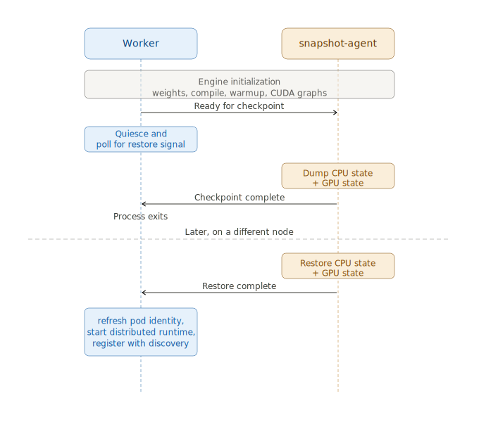

The general concept of "quiesce" and "resume" hooks — where the workload ensures it is in a quiescent state and blocks on an external signal for when the restore is complete — is a powerful abstraction for checkpoint/restore. It allows the workload to clean up its resources prior to being checkpointed for:

1. Optimizing the final checkpoint size (and thereby decreasing restore time).
2. Cleaning up resources that aren't checkpointable, which can be re-established post-resume. This is especially important for multi-GPU and multi-node checkpoints (which we are still working on enabling). Specifically, outbound TCP connections that are used for RPC cannot be checkpointed in an established state since the pod IP changes between checkpoint/restore. RDMA registrations and NIC state also cannot be checkpointed and need to be recreated post-restore.

## Optimization #1: KV Cache Unmap and Release
One optimization to reduce the checkpoint size is to deallocate the KV cache memory before checkpointing. After measuring the peak GPU memory usage while weights, CUDA graphs, and other buffers/activations are allocated, inference engines allocate the remainder of the GPU memory as a large KV cache buffer.

However, since our checkpoint is taken in a quiescent state *before* the replica has served any requests, this KV cache buffer does not need to be checkpointed at all. But we need to keep the virtual address of this KV cache stable since it is baked into the CUDA graph. This means we allocate the KV cache buffer via the CUDA Virtual Memory Management API (`cuMemCreate` and `cuMemMap`); then deallocating the underlying physical allocation while keeping the virtual address stable is as simple as calling `cuMemUnmap` and `cuMemRelease`, but not `cuMemAddressFree`.

This functionality is already given to us by vLLM's `sleep()` and `wake_up()` methods, as well as SGLang's `torch_memory_saver`. Similar functionality is also exposed in TensorRT-LLM.

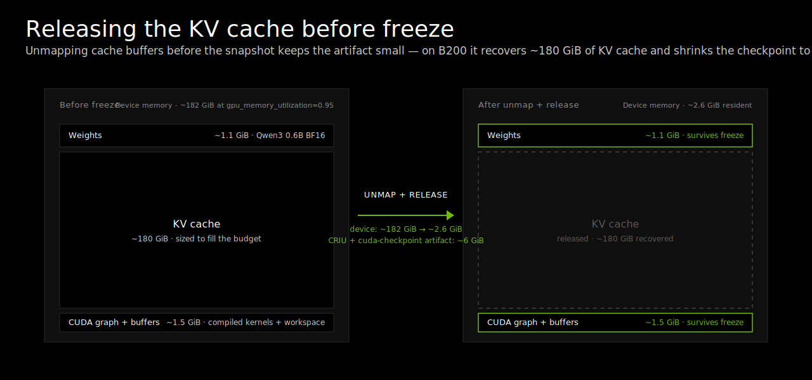

Unmap and release of the KV cache reduces the checkpoint size of Qwen3 0.6B for a B200 from ~192 GiB to ~6 GiB. The wins are most pronounced for large KV cache sizes (i.e. smaller model weights relative to GPU size).

## Optimization #2: Making CRIU Fast
So, what do the restore times look like? Surprisingly, really bad. For larger models, the restore time actually exceeds that of a cold start, defeating the entire purpose of checkpoint/restore.

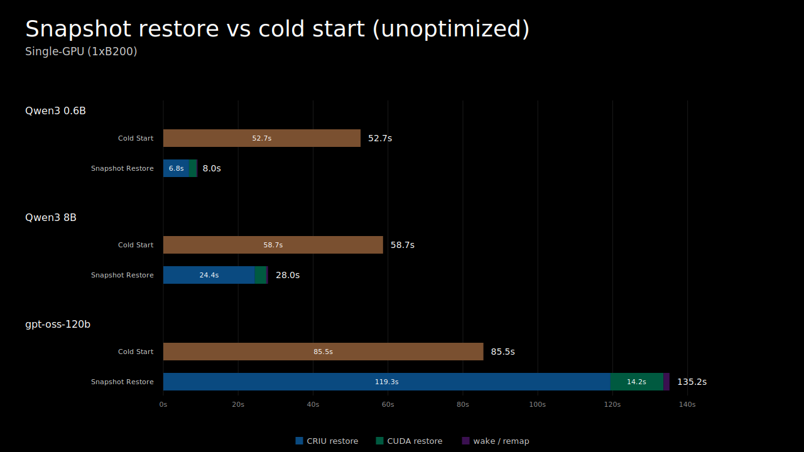

The main reason behind this is that CRIU and `cuda-checkpoint` do not copy memory at speed-of-light (SOL) speeds. In a Linux process, there are two types of memory: anonymous memory (the heap, stack, etc. of a process) and shared memory (shared between processes). For larger models, the restore bottleneck encompasses both types of memory, so we optimize both restore paths to bring the CRIU restore time down from minutes to seconds.

### Optimization #2.1: Linux Native AIO for Anonymous Memory
After CRIU has restored the shared resources (files, sockets, shmem objects, memfds, etc.), it still has to fill in each process's private memory: heap pages, stacks, anonymous mappings, and copy-on-write private file mappings. These pages are not shared; they belong to one process and need to land at the exact virtual addresses they had before checkpoint.

In upstream CRIU, that fill was a synchronous `preadv` loop. The restorer pulls one job off the list, hands it to `preadv`, and waits. The kernel issues that single read to the storage device, the device DMAs the bytes into the destination VMA pages, and `preadv` returns. Only then does the restorer move on to the next job. There's exactly one read in flight at any moment, which means the storage device is idle for most of the wall-clock time — sitting there waiting for the next request between every read. A single blocking stream barely uses what fast NVMe can do, and on network-attached storage every read pays a full round-trip before the next one starts.

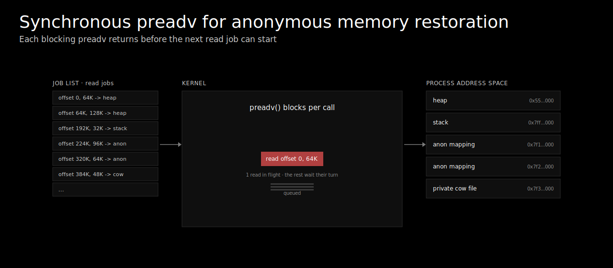

We replaced the `preadv` loop with Linux native AIO. CRIU builds a list of read jobs ahead of time — each job is an `iocb` describing a file offset, a byte count, and an iovec pointing at the destination VMA pages. The restorer creates an AIO context, which holds many distinct read transactions simultaneously, allowing the storage device to run them concurrently across its internal channels. The restorer then submits a batch of those iocbs with `io_submit`, and keeps a window of up to 128 in flight. As completions come back via `io_getevents`, new submissions backfill the window until every job is done.

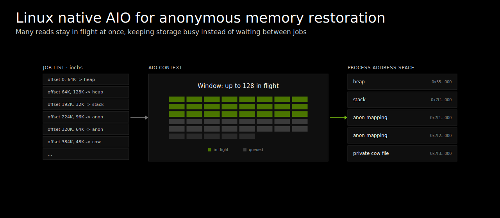

### Optimization #2.2: Parallel memfd Restore
vLLM's sleep mode reduces GPU memory pressure by moving tagged GPU allocations into pinned CPU shadow buffers. Those buffers are not ordinary Python heap memory. vLLM asks PyTorch for pinned CPU tensors, PyTorch allocates them through CUDA's pinned-memory allocator, and CUDA backs them with shared anonymous memory that is then pinned through the NVIDIA driver. Inside the Linux kernel, these are memfds — anonymous, RAM-backed files that can be mapped with MAP_SHARED.

For GPT-OSS 120B, we saw these buffers consume more than 120 GiB, but split up into many 2 GiB (or even smaller) buffers. These buffers are also independent. However, CRIU restored these serially — it would create one shmem-backed object, resize it, map it, read its contents from the checkpoint image, and only then move on to the next object.

The solution was to modify CRIU to first enumerate all the unique shmem-backed objects, then launch a thread pool to parallelize the restore. Each worker allocates its buffer and reads from the checkpoint independently, allowing them to use the available storage bandwidth and CPU parallelism instead of processing buffers one at a time.

#### The Page Cache
Where the storage backend supports it, both anonymous and shared memory reads use O_DIRECT. Restore is mostly a one-pass stream from checkpoint files into destination memory, so caching the input pages in the kernel page cache is usually wasteful. Without direct I/O, a large restore can temporarily fill the page cache with checkpoint data while also allocating the destination shmem pages, increasing memory pressure and evicting useful data for other workloads.

Even more importantly, Linux native AIO is only truly asynchronous on files opened with O_DIRECT. On filesystems where O_DIRECT is unavailable or unreliable, such as some NFS deployments, restore falls back to buffered I/O with sequential readahead so the kernel still sees a predictable streaming access pattern, but the gains from AIO are significantly reduced.

### I/O Configuration for CRIU Restore Performance
Restore performance is sensitive to several I/O configuration choices:

| Feature | What to configure | Impact |
| --- | --- | --- |
| Storage throughput cap | MiB/s per share/volume | Hard ceiling on read speed; also depends on share/volume size |
| Protocol | NFS version, SMB/CIFS | NFSv4.1+ preferred on Linux; SMB/CIFS can work but may need tuning for large sequential reads |
| O_DIRECT | Mount option or per-fd flag | Bypasses the host page cache; supported on NFS, not always on SMB. Falls back to buffered I/O with sequential read-ahead where unsupported |
| rsize | NFS mount option | Maximum read size per NFS operation; larger values increase throughput up to a limit |
| nconnect | NFS mount option | Number of parallel TCP connections to the NFS server; helps saturate available storage bandwidth |

### Results
On the same setup, we saw a massive improvement in CRIU restore time, and it is now significantly faster to restore from checkpoint than to cold start an inference worker:

| Model | Checkpoint size | CRIU Restore (baseline) | CRIU Restore (optimized) | Speedup |
| --- | --- | --- | --- | --- |
| Qwen3 0.6B | 6.2 GiB | 6.8 s | 2.4 s | 2.8x |
| Qwen3 8B | 26 GiB | 24 s | 4.7 s | 5.1x |
| Qwen3 14B | 47 GiB | 44 s | 6.8 s | 6.5x |
| Qwen3 32B | 74 GiB | 70 s | 9.9 s | 7.1x |
| Llama 3.3 70B FP8 | 86 GiB | 82 s | 11 s | 7.5x |
| GPT-OSS 120B | 129 GiB | 119 s | 15 s | 7.9x |
| Qwen2.5 72B | 164 GiB | 127 s | 20 s | 6.4x |

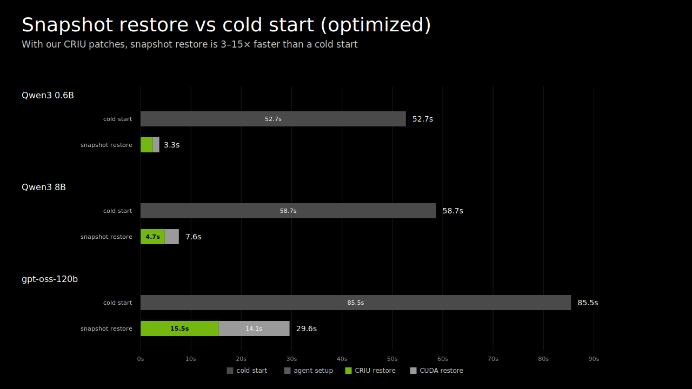

At this point CRIU is no longer the bottleneck on its own, but the wall-clock time is still dominated by moving the model weights from PVC, through host memory, onto the GPU. That part is fundamentally serial: cuda-checkpoint cannot start copying weights to the GPU until CRIU has materialized them in host memory, and both halves are constrained by NFS bandwidth on one end and a single sequential `cudaMemcpy` on the other. The weights also dominate checkpoint size by a wide margin, which puts a hard ceiling on how fast restore can ever get if the weights stay inside the CRIU image.

## Optimization #3: GPU Memory Service
We would like to take the weights out of the CRIU image entirely. If they are not in the checkpoint, the weight restoration time can be unbound from CRIU's timeline. Plus, they won't even have to come from the same place as the rest of the checkpoint. They could come from local NVMe, or from a peer GPU that already has them resident (e.g. when scaling up a DynamoGraphDeployment), over whatever channel that source supports. The weight restore can then run *in parallel* with CRIU instead of after it, on a path that is free to saturate bandwidth that NFS alone cannot deliver.

The catch is that we still need the restored worker to come back with its weight tensors mapped at exactly the same virtual addresses as before, since those VAs are baked into the CUDA graph. So whatever we do externally has to land the weight bytes at the same VAs the worker had pre-checkpoint, with no copy at the moment of resume. This is similar in spirit to the KV cache `sleep()`/`wake_up()` trick from Optimization #1, except this time we actually *care* about the contents of the tensors post-restore.

The **GPU Memory Service (GMS)** is what makes this work.

### Memory Model
GMS is a per-GPU sidecar process that owns physical GPU memory on behalf of inference workers. It is built on top of the CUDA Virtual Memory Management API, which lets us separate a physical allocation from the virtual address it's mapped at, and share that physical allocation across processes.

The GMS server allocates physical GPU memory with `cuMemCreate`, requesting an allocation handle that supports POSIX file descriptor export. It then immediately calls `cuMemExportToShareableHandle` to get an FD that represents that physical allocation, and caches it. Critically, the server **never calls** `cuMemMap` on its own — it does not reserve a virtual address, does not touch the bytes, and never even establishes a CUDA context capable of dereferencing the memory. It is purely a registry/memory store of physical allocations and the FDs that name them.

A client (the inference worker) connects to the GMS server over a Unix domain socket and asks for a particular allocation. The server `dup()`s its cached FD and passes it back to the client over the same socket using `SCM_RIGHTS`. The client then runs the import side of the protocol locally:

1. `cuMemImportFromShareableHandle(fd)`: turn the FD back into a CUDA allocation handle in the client's context.
2. `cuMemAddressReserve(size)`: reserve a stable virtual address range.
3. `cuMemMap(va, handle)`: map the imported physical memory at that VA.

The bytes are then accessible from the client at `va`. There is no copy at any point in this flow; the import is just a re-export of the same physical pages into a new address space. This is the same primitive that backs IPC across CUDA processes; GMS just builds a long-lived, lock-protected service around it.

Because the server never holds VA mappings, it has no CUDA context to lose. It can outlive client crashes and cuda-checkpoint tear-downs that would normally clobber an ordinary CUDA process's state.

### Lifecycle: Sleep, Checkpoint, Restore, Wake
The worker treats GMS-backed weights through the same `sleep()` / `wake_up()` primitive that vLLM already uses for the KV cache trick from Optimization #1. The difference is what happens to the physical memory in between.

When `sleep()` is called, the worker walks every GMS mapping, unmaps the VA (`cuMemUnmap`), and releases its imported handle (`cuMemRelease`). This drops the worker's reference to the physical memory, but the GMS server is still holding it via the original handle from `cuMemCreate`, so the pages stay alive on the GPU. **The VA reservation is kept**, i.e. the worker does not call `cuMemAddressFree`. From CUDA's point of view those addresses are still reserved by the worker, just unbacked. Any CUDA graph that captured a kernel parameter pointing into a weight tensor still sees a valid (if currently unmapped) virtual address.

This is the moment cuda-checkpoint and CRIU run. Because the worker no longer holds any imported handles or live mappings to the GMS allocations, **the weight bytes are simply not part of the checkpointed state**. The cuda-checkpoint snapshot covers only what the worker still has mapped: the CUDA graph, a few miscellaneous activation/workspace buffers that get double-buffered into host memory, and the small mutable bookkeeping that the engine kept around.

On restore (potentially on a different node), CRIU brings the worker's process tree back. The VA reservations come back with it — they're just kernel state inside the process. What's missing is the *backing* for those VAs. The worker calls `wake_up()`, which:

1. Reconnects to the GMS server, which on the restore node has been independently brought up and populated.
2. Remaps all VAs. This requests previously-imported allocations from the GMS server, receives fresh FDs, imports them, and calls `cuMemMap` at the *same VAs* the worker reserved before. Because the VAs are unchanged, every captured CUDA graph and every cached tensor pointer is instantly valid again.
3. Before mapping, it verifies a layout hash published by the server at commit time. This protects against the case where someone published a completely different model architecture's weights into GMS in between.

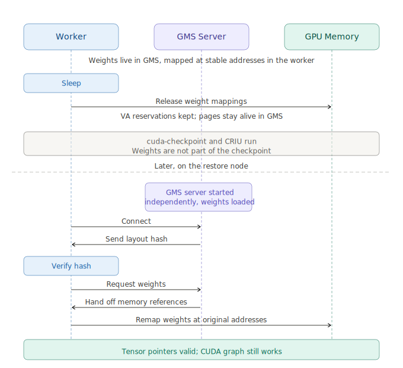

### Independent Weight Restoration
The above only works if, by the time the worker calls `wake_up()`, the GMS server on the restore node already has the weights resident on its GPU. This is what unlocks the next big optimization: the path that gets weights onto the GPU is now **completely decoupled** from CRIU and cuda-checkpoint. CRIU can stream process state from the snapshot PVC at whatever rate NFS gives us, and *in parallel*, an entirely separate `gms-loader` sidecar populates GMS with the weights for that model.

However, what needs to be determined is where the loader gets the weights from. In a real cluster, weight management is its own concern: we want a single source of truth for which models are cached where, deduplicated downloads from external sources like HuggingFace, and ideally GPU-to-GPU RDMA between nodes that already have the weights resident. This is exactly what weight transfer engines like [ModelExpress](https://github.com/ai-dynamo/modelexpress) (MX) are built for, and the intended production path is to have `gms-loader` be a shim that exposes GMS's stored allocations directly to different weight transfer backends. For instance, MX figures out the fastest available source for a given model — peer GPU over NIXL/RDMA, disk over GPUDirect Storage, HuggingFace, etc. — and `gms-loader` exposes the necessary shims to plumb those bytes into GMS, where the worker imports them at its preserved VAs as described above.

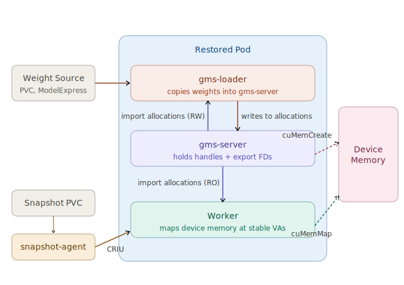

CRIU restore and the GMS weight load run concurrently on the restore pod, but they have to converge before the worker can resume. In particular, the worker can't `wake_up()` until the weights are actually in GMS. The snapshot agent coordinates this by waiting for both halves to finish before signaling the worker to continue, which is what turns the two parallel paths into a single join point at `wake_up()`. The same coordination runs in reverse on the checkpoint side: the snapshot agent waits for the weight dump to finish before letting the checkpoint job complete.

However, we are still in the process of developing the integration with MX, among other transfer engine backends. For now, the fallback is to also use NFS for the weights, which eliminates the full host-side materialization of the weights but still causes some NFS bandwidth contention with the ongoing CRIU restore. Nonetheless, we still see a major reduction in startup time, even with this fallback.

### Full Overlap with External Weight Restoration
To demonstrate the full power of overlapping CRIU and cuda-checkpoint restore with a faster channel for restoring the weights, we implemented a proof-of-concept backend for `gms-loader` where the weights for each model are sharded across 8 SSDs on a node, and ensured the restored workload was on the same node as the checkpoint.

This setup isolates the parallel-restore claim from network storage variability and shows what the rest of the system can do when the weight source isn't the bottleneck. The loader pipelines reads with GPU copies (a pool of threads issuing `cudaMemcpyAsync` over multiple CUDA streams) so storage→host and host→GPU run continuously rather than fully materializing the weights in host memory.

We saw that parallelizing the container restoration in CRIU and the weights restoration via `gms-loader` allows us to achieve ~5s restore time, even for the largest checkpoint (Qwen2.5 72B). For most other models, the startup time is now under 5 seconds.

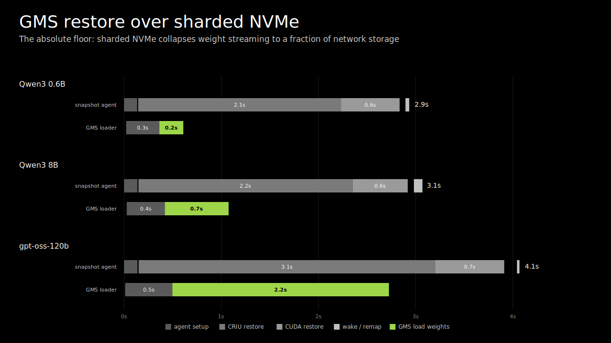

The CRIU checkpoint now only contains the host-side state of the container's process tree, as well as the CUDA graph and a few miscellaneous buffers that are still double-buffered. The GMS weight artifact now holds the majority of process memory.

| Model | CRIU checkpoint size (baseline) | CRIU checkpoint size (with GMS) | GMS weight artifact |
| --- | --- | --- | --- |
| Qwen3 0.6B | 6.2 GiB | 4.3 GiB | 1.2 GiB |
| Qwen3 8B | 26 GiB | 4.8 GiB | 15 GiB |
| Qwen3 14B | 47 GiB | 5.0 GiB | 28 GiB |
| Qwen3 32B | 74 GiB | 5.5 GiB | 61 GiB |
| Llama 3.3 70B FP8 | 86 GiB | 6.1 GiB | 68 GiB |
| GPT-OSS 120B | 129 GiB | 6.7 GiB | 74 GiB |
| Qwen2.5 72B | 164 GiB | 5.8 GiB | 135 GiB |

## Looking Forward
Not everything in this blog post is generally available in Dynamo yet:

- **Support for Other Frameworks:** Dynamo Snapshot currently works for vLLM and SGLang. TensorRT-LLM support is work in progress.
- **GMS + Snapshot Integration:** This requires an unreleased CUDA driver patch to be able to work with GPU migration (checkpoint on one GPU, restore on another) that is necessary for this to be practical. The patch will be part of an upcoming CUDA driver release.
- **GDS/P2P transfer via MX integration with GMS:** Currently we only have the PVC-source fallback for weight restoration. We are working on integrating GPUDirect Storage and peer-to-peer GPU transfer into `gms-loader`, enabling direct SSD→GPU weight loading and GPU→GPU weight transfer for autoscaling.
- **Multi-GPU support:** Single-node multi-GPU is still experimental (currently vLLM-only, with limitations) and may fail on certain hardware/driver configurations. We are actively working on robust multi-GPU and multi-node checkpoint/restore support.
