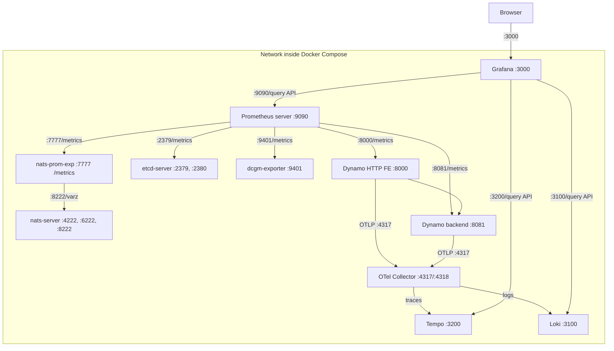

Dynamo emits three signals — **metrics** (Prometheus), **logs** (structured text or JSONL, exportable to Loki), and **traces** (OpenTelemetry, exportable to Tempo). This page installs the backends that collect them. Enabling each signal is a matter of setting a few environment variables per process or deployment.

## Signals at a glance

| Signal | Turn it on with | Collected by |
|--------|-----------------|--------------|
| Metrics | `DYN_SYSTEM_PORT` (workers/router); the frontend serves metrics on its HTTP port | Prometheus |
| Traces | `OTEL_EXPORT_ENABLED=true` + `OTEL_EXPORTER_OTLP_TRACES_ENDPOINT` | Tempo |
| Logs | `DYN_LOGGING_JSONL=true` (+ `OTEL_EXPORT_ENABLED` to export) | Loki |

`OTEL_EXPORT_ENABLED` is the master switch for both traces and logs — without it, neither leaves the process even when Tempo and Loki are healthy. OTLP endpoints must be gRPC listeners (Dynamo's exporter does not speak OTLP/HTTP). For the full variable catalog — defaults and per-signal grouping — see [Environment Variables](../reference/observability/environment-variables.mdx).

> [!NOTE]
> Prometheus metric families are registered lazily: each label set is created the first time it fires, so a freshly-started process shows empty metric families until the first relevant request. An idle process does not mean scraping is broken.

## Local stack (single machine)

Bring up the full stack on one machine with Docker Compose for local development and demos.

Install these on your machine:

- [Docker](https://docs.docker.com/get-docker/)
- [Docker Compose](https://docs.docker.com/compose/install/)

### Starting the Observability Stack

Dynamo provides a Docker Compose-based observability stack that includes Prometheus, Grafana, Tempo, Loki, an OpenTelemetry Collector, and various exporters for metrics, tracing, logging, and visualization.

From the Dynamo root directory:

```bash
# Start infrastructure (NATS, etcd)
docker compose -f dev/docker-compose.yml up -d

# Start observability stack (Prometheus, Grafana, Tempo, DCGM GPU exporter, NATS exporter)
docker compose -f dev/docker-observability.yml up -d
```

For detailed setup instructions and configuration, see [Prometheus + Grafana Setup](../observability/prometheus-grafana.md).

### Signal how-tos

Once the stack is running, each signal has a how-to guide:

- [Prometheus + Grafana](../observability/prometheus-grafana.md) — visualize metrics on the local stack
- [Tracing](../observability/tracing.md) — distributed tracing with OpenTelemetry and Tempo
- [Logging](../observability/logging.md) — structured logging and OTLP log export to Loki
- [Health Checks](../observability/health-checks.md) — component health and readiness endpoints

For the metric, label, and variable catalogs, see the [Observability reference](../reference/observability/metrics-catalog.mdx). To create your own metrics, see the [Metrics Developer Guide](../observability/metrics-developer-guide.md).

---

## Topology

This provides:
- **Prometheus** on `http://localhost:9090` - metrics collection and querying
- **Grafana** on `http://localhost:3000` - visualization dashboards (username: `dynamo`, password: `dynamo`)
- **Tempo** on `http://localhost:3200` - distributed tracing backend
- **Loki** on `http://localhost:3100` - log aggregation backend
- **OpenTelemetry Collector** on `http://localhost:4317` (gRPC) / `http://localhost:4318` (HTTP) - receives OTLP signals and routes traces to Tempo and logs to Loki
- **DCGM Exporter** on `http://localhost:9401/metrics` - GPU metrics
- **NATS Exporter** on `http://localhost:7777/metrics` - NATS messaging metrics

### Service Relationship Diagram


The dcgm-exporter service in the Docker Compose network is configured to use port 9401 instead of the default port 9400. This adjustment is made to avoid port conflicts with other dcgm-exporter instances that may be running simultaneously. Such a configuration is typical in distributed systems like SLURM.

### Configuration Files

The following configuration files are located in the `dev/observability/` directory:
- [docker-compose.yml](../../dev/docker-compose.yml): Defines NATS and etcd services
- [docker-observability.yml](../../dev/docker-observability.yml): Defines Prometheus, Grafana, Tempo, and exporters
- [prometheus.yml](../../dev/observability/prometheus.yml): Contains Prometheus scraping configuration
- [grafana-datasources.yml](../../dev/observability/grafana-datasources.yml): Contains Grafana datasource configuration
- [otel-collector.yaml](../../dev/observability/otel-collector.yaml): OpenTelemetry Collector configuration (routes traces to Tempo, logs to Loki)
- [loki.yaml](../../dev/observability/loki.yaml): Loki log aggregation configuration
- [loki-datasource.yml](../../dev/observability/loki-datasource.yml): Grafana Loki datasource with trace ID linking to Tempo
- [grafana_dashboards/dashboard-providers.yml](../../dev/observability/grafana_dashboards/dashboard-providers.yml): Contains Grafana dashboard provider configuration
- [grafana_dashboards/dynamo.json](../../dev/observability/grafana_dashboards/dynamo.json): Engine-agnostic per-model dashboard covering frontend, KV-router, and worker metrics. Filterable by `model`. See the [per-model dashboard guide](../observability/prometheus-grafana.md#per-model-dynamo-dashboard) for details.
- [grafana_dashboards/dcgm-metrics.json](../../dev/observability/grafana_dashboards/dcgm-metrics.json): Contains Grafana dashboard configuration for DCGM GPU metrics
- [grafana_dashboards/kvbm.json](../../dev/observability/grafana_dashboards/kvbm.json): Contains Grafana dashboard configuration for KVBM metrics
