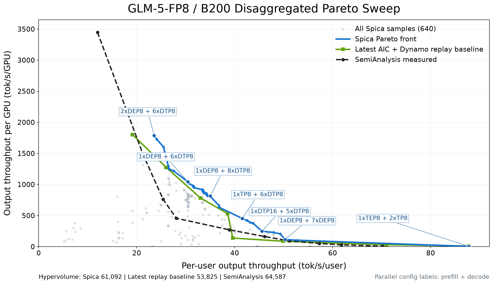

> [!WARNING]
> **Experimental.** These replay results characterize one software snapshot and workload. Do not
> treat them as production capacity guidance or a performance commitment. Spica's search behavior
> and output may change without a standard deprecation period.

> [!IMPORTANT]
> This experiment uses `kv_load_ratio` and requires an AI Configurator release that provides
> `aiconfigurator.sdk.memory`. It fails closed in the default Planner/Profiler image, which currently
> retains AI Configurator 0.9.

This replay-backed sweep targets the InferenceX/SemiAnalysis (SA) **GLM-5-FP8 / B200 /
Dynamo with SGLang / 1k-1k / disaggregated** frontier. It tests whether Spica can discover competitive
deployment mappings without pinning the parallel shape or replica count.

## Setup

| | |
|---|---|
| model | `zai-org/GLM-5-FP8` (MLA, 78 layers, MoE, FP8) |
| hardware | `b200_sxm` |
| backend | Dynamo with SGLang |
| deployment | disaggregated, static, `gpu_budget=72` |
| parallel configs | enumerated and projected across TP / TEP / DEP / DTP shapes |
| engine batching | searched independently for prefill and decode |
| workload | synthetic 1k input + 1k output, closed-loop `kv_load_ratio=[0,1]` |
| request count | `10 * derived concurrency` |
| router / planner | round-robin / disabled |
| objective | maximize `throughput_per_gpu` and `throughput_per_user` |

`kv_load_ratio=1` means the candidate's estimated decode KV capacity divided by
`isl + floor(osl / 2)`; `0` maps to concurrency 1. This makes traffic pressure comparable
across candidates with different decode shapes and replica counts.

## Latest replay baseline

The replay baseline uses SA's per-concurrency deployment mappings with the fixed AI Configurator and Dynamo
mocker stack, block size 64, FP8 KV cache, and 10 requests per concurrency unit. It is the
correct software baseline for this sweep; the earlier pre-fix replay curve is no longer used.

| curve | hypervolume | relative to SA |
|---|---:|---:|
| SemiAnalysis measured | 64,587 | 100% |
| latest AI Configurator and Dynamo Replay baseline | 53,825 | 83.3% |
| Spica sweep | 61,093 | **94.6%** |

Hypervolume uses reference point `(0, 0)`. Spica reaches **113.5%** of the latest replay
baseline's hypervolume by finding deployment mappings beyond the fixed SA mapping schedule.

## Search encoding

Parallel search uses the default structured projection. Vizier models:

- total used-GPU ratio;
- prefill GPU share;
- prefill and decode GPUs-per-engine targets;
- per-role attention mode (`tp` or `dp`);
- per-role MoE FFN mode (`tp` or `ep`).

Each suggestion is projected onto the nearest backend-compatible, KV-feasible enumerated
configuration. Replica counts and concrete TP / DP / MoE-TP / MoE-EP fields are derived from
that valid target. `parallel_configs: []` requests the full enumerated pool; a user can still
provide one config as a strict pin or several configs as a custom projection pool.

## Configuration

The runnable configuration is available in
[glm5-disagg-pareto-frontier.yaml](https://github.com/ai-dynamo/dynamo/blob/main/examples/profiler/spica/configs/glm5-disagg-pareto-frontier.yaml):

```yaml
search_space:
  deployment_mode: [disagg]
  backend: [sglang]
  parallel_configs: []
  model_name: zai-org/GLM-5-FP8
  hardware_sku: b200_sxm
  gpu_budget: 72
  context_length: 2048
  router_mode: [round_robin]
  planner_scaling_policy: [disabled]
workload:
  isl: 1024
  osl: 1024
  kv_load_ratio: [0.0, 1.0]
  num_request_ratio: 10
goal:
  target: pareto
  pareto_objectives: [throughput_per_gpu, throughput_per_user]
sweep:
  max_rounds: 80
  parallel_evals: 8
  candidates_per_round: 8
  max_eval_seconds: 600
```

## Result

The 80-round run completed 640 successful unique samples from 670 attempts in 12:06:56:

- 22 candidates were rejected by KV-capacity prechecks;
- 8 replay evaluations exceeded the 600-second limit;
- 0 replay evaluations crashed;
- 155 distinct concrete parallel mappings were evaluated.

The highest-throughput point reached **1788.4 output tok/s/GPU** at **23.56 tok/s/user**:

```text
prefill: 2xDEP8   (tp=1, attention_dp=8, moe_tp=1, moe_ep=8)
decode:  6xDTP8  (tp=1, attention_dp=8, moe_tp=8, moe_ep=1)
total:   64 GPUs
load:    kv_load_ratio=0.590, concurrency=11,940, requests=119,400
batch:   prefill=(32768 tokens, 256 seqs), decode=(8192 tokens, 1024 seqs)
```

Representative non-dominated points:

| tok/s/user | tok/s/GPU | GPUs | concurrency | prefill + decode |
|---:|---:|---:|---:|---|
| 23.56 | 1788.4 | 64 | 11,940 | `2xDEP8 + 6xDTP8` |
| 30.42 | 1045.4 | 56 | 14,803 | `1xDEP8 + 6xDTP8` |
| 35.04 | 815.4 | 72 | 18,325 | `1xDEP8 + 8xDTP8` |
| 41.56 | 452.7 | 56 | 20,237 | `1xTP8 + 6xDTP8` |
| 45.57 | 247.1 | 56 | 4,163 | `1xDTP16 + 5xDTP8` |
| 50.30 | 115.3 | 64 | 7,038 | `1xDEP8 + 7xDEP8` |
| 87.79 | 3.6 | 24 | 1 | `1xTEP8 + 2xTP8` |



The exact Pareto filter returns 204 points because continuous load values produce many tiny
tradeoffs along otherwise flat regions. The representative table and plot retain the useful
shape of the frontier without treating those near-duplicates as different deployment choices.

## Convergence

| round | elapsed | final hypervolume reached |
|---:|---:|---:|
| 7 | 0:45:43 | 88.8% (already above the latest replay baseline) |
| 40 | 5:29:10 | 95.6% |
| 53 | 7:28:12 | 98.95% and the final max-throughput point |
| 66 | 9:37:44 | 99.67% |
| 70 | 10:13:17 | effectively 100% |
| 80 | 12:06:56 | 100% |

For this workload, 50-55 rounds is the practical quality/runtime point. The final 27 rounds
after round 53 consumed about 4 hours 39 minutes for 1.05% additional hypervolume.

## Reproduce

```bash
python -m dynamo.profiler.spica \
  --config examples/profiler/spica/configs/glm5-disagg-pareto-frontier.yaml
```

The AI Configurator performance model needs the `aic-forward-pass` binding. Dynamo must include the
attention-DP KV-capacity fix so replay sees engine capacity as per-rank capacity multiplied by
attention DP and replicas.
