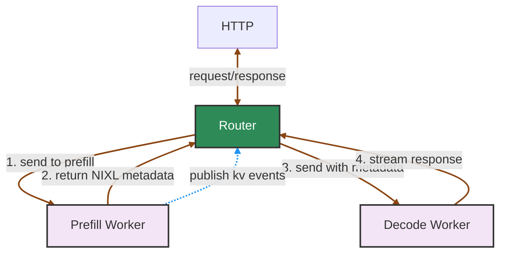

Dynamo supports disaggregated serving where prefill (prompt processing) and decode (token generation) are handled by separate worker pools. When you register prefill workers with `WorkerType.Prefill`, the frontend automatically detects them and activates an internal prefill router.

For the high-level deployment matrix, see [Router Guide](router-guide.md). For the router flags used in this setup, see [Configuration and Tuning](router-configuration.md).

If prefill and decode workers span topology domains such as zones or racks, use [Topology-Aware KV Transfer](topology-aware-kv-transfer.md) to constrain or bias decode routing toward workers in the selected prefill worker's transfer domain.

## Automatic Prefill Router Activation

The prefill router is automatically created when:
1. A decode model is registered, for example via `register_model()` with `ModelType.Chat | ModelType.Completions`.
2. A prefill worker is detected with the same model name and `WorkerType.Prefill`.

Key characteristics of the prefill router:
- **Always disables active block tracking** (`track_active_blocks=false`) since prefill workers do not perform decode.
- **Seamlessly integrates** into the request pipeline between preprocessing and decode routing.
- **Falls back gracefully** to decode-only mode if prefill fails or no prefill workers are available.

Key characteristics of the decode routing stage in disaggregated mode:
- **Disables overlap scoring** (`overlap_score_credit=0`) because decode routing should not chase prefix reuse.
- **Disables KV reuse assumption** (`assume_kv_reuse=false`) unless the backend can truly deduplicate transferred blocks.
- **Disables prefill-token tracking** (`track_prefill_tokens=false`) so decode-side load reflects decode work rather than already-completed prompt work.

## Setup Example

When both workers are registered, requests are automatically routed.

```python
# Decode worker registration (in your decode worker)
decode_endpoint = runtime.endpoint("dynamo.decode.generate")

await register_model(
    model_input=ModelInput.Tokens,
    model_type=ModelType.Chat | ModelType.Completions,
    endpoint=decode_endpoint,
    model_name="meta-llama/Llama-2-7b-hf",
    worker_type=WorkerType.Decode,
    needs=[[WorkerType.Prefill]],
    # ... other parameters
)

await decode_endpoint.serve_endpoint(decode_handler.generate)

# Prefill worker registration (in your prefill worker)
prefill_endpoint = runtime.endpoint("dynamo.prefill.generate")

await register_model(
    model_input=ModelInput.Tokens,
    model_type=ModelType.Empty,  # prefill workers expose no OpenAI surface
    endpoint=prefill_endpoint,
    model_name="meta-llama/Llama-2-7b-hf",
    worker_type=WorkerType.Prefill,
    needs=[[WorkerType.Decode]],
    # ... other parameters
)

await prefill_endpoint.serve_endpoint(prefill_handler.generate)
```

>[!Note]
> The automatic disaggregated routing setup described here is currently supported by the integrated `dynamo.frontend` path. It is not provided as a single turnkey mode by the standalone Python router (`python -m dynamo.router`). If you build this topology with standalone routers, you must launch and connect the prefill and decode routing stages yourself and handle request handoff, including the `disaggregated_params` returned by prefill. For an advanced reference, see the [Global Router](https://github.com/ai-dynamo/dynamo/tree/main/components/src/dynamo/global_router), which composes local prefill and decode router pools explicitly.

## Request Flow

The following diagram shows an overview of the major components in disaggregated serving:



When topology-aware KV transfer is enabled, the prefill router also derives decode `RoutingConstraints` from the selected prefill worker's runtime topology metadata before the request enters the decode router.

## Conditional Disaggregation

> [!WARNING]
> **Experimental.** Validate/tune conditional disaggregation against your workload before using it in production.

Conditional disaggregation is a feature that enables a hybrid of aggregated and disaggregated request routing. The router may serve a request `prefill worker -> decode worker`, or it may send the request directly to a decode worker and the backend runs local prefill plus decode there.

For workloads with a high degree of KV reusage on long-ISL requests, e.g. multi-turn / agentic conversation scenarios, conditional disaggregation can help your deployment maintain predictable SLA. Compared to unconditional disaggregation, it reduces memory pressure / TTFT on prefill workers by optimizing reuse of *decode-worker* KV cache; compared to unconditionally aggregated deployments, it avoids the heavy ITL penalty incurred by co-scheduling heavy prefill workload onto decode workers.

Enable conditional disaggregation with `--router-conditional-disagg` on the frontend:

```bash
python -m dynamo.frontend \
    --router-mode kv \
    --router-conditional-disagg \
    --router-conditional-disagg-policy isl_bounding
```

### Backend Requirements

Conditional disaggregation requires decode-worker KV visibility. The router uses decode-side KV events to estimate effective ISL and decide whether local prefill+decode is cheaper than remote prefill.

Configure workers as follows:

| Backend | Requirement |
| --- | --- |
| vLLM | On decode workers, pass `--enable-conditional-disagg`. This opts decode workers into KV event publication and bypass handling. |
| TensorRT-LLM | Pass `--publish-kv-events` on prefill AND decode workers to opt them into KV-aware routing. |
| SGLang | Not supported yet. Dynamo rejects SGLang conditional-disagg setups until the backend can run bypassed decode requests as local prefill+decode. |

If decode workers do not publish KV events, the router cannot accurately assess bypass conditions.

Append these additional flags to tune the conditional disaggregation policy:

> [!NOTE]
> We recommend tuning these values against your workload and deployment configuration.

For ISL-based policies, `effective ISL` is the request prompt length after subtracting the selected decode worker's cached prefix overlap. The absolute threshold limits the number of prompt tokens the decode worker may need to compute locally. The ratio threshold limits that local work as a fraction of the raw prompt length. These thresholds measure both "how much compute does this request require" (absolute) and "how compute/memory-bound is this request, due to the ratio of its computed / cached KV cache" (ratio), respectively.

As a tuning starting point, we recommend choosing thresholds based on your workload's expected effective-ISL and the `effective ISL : raw ISL` ratio distribution. For example, with `isl_bounding`, setting the absolute threshold to p25 of the workload's effective ISL would make the absolute-threshold check pass for roughly 25% of requests.

| Flag                                                  | Default        | Use                                                                                                                                               |
| ----------------------------------------------------- | -------------- | ------------------------------------------------------------------------------------------------------------------------------------------------- |
| `--router-conditional-disagg`                         | Disabled       | Enables conditional disaggregation. Requires `--router-mode kv` and separate prefill/decode worker pools.                                         |
| `--router-conditional-disagg-policy`                  | `isl_bounding` | Selects the bypass policy: `isl_bounding`, `prefill_load`, or `isl_or_load`.                                                                      |
| `--router-conditional-disagg-eff-isl-threshold`       | `2048`         | For `isl_bounding` and the ISL condition within `isl_or_load`, require effective ISL to be below this many tokens.                                |
| `--router-conditional-disagg-eff-isl-ratio-threshold` | `0.7`          | For `isl_bounding` and the ISL condition within `isl_or_load`, require the `effective ISL : raw ISL` ratio to be below this value. Must be in `[0.0, 1.0]`. |
| `--router-conditional-disagg-prefill-busy-threshold`  | Unset          | Sets the prefill busy threshold for `prefill_load` and `isl_or_load`. When unset, those policies inherit `--router-queue-threshold` if it is set. |
| `--router-conditional-disagg-decode-busy-threshold`   | Unset          | Decode-busy guard. When unset, the guard is disabled. When set, conditional-disagg bypass is disabled if the selected decode worker's projected active decode KV blocks exceed this fraction of KV capacity. This uses router-side active decode block accounting. |

The available policies are:

| Policy         | Bypass Condition                                                                                                                                                       |
| -------------- | ---------------------------------------------------------------------------------------------------------------------------------------------------------------------- |
| `isl_bounding` | Effective ISL is below `--router-conditional-disagg-eff-isl-threshold` AND the effective/raw ISL ratio is below `--router-conditional-disagg-eff-isl-ratio-threshold`. |
| `prefill_load` | The selected prefill worker is above the configured prefill busy threshold.                                                                                            |
| `isl_or_load`  | Either the `isl_bounding` condition OR the `prefill_load` condition is true.                                                                                           |
