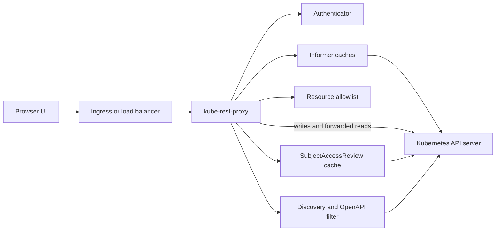

> **Tier 3 design documentation** for contributors and architects. This is a
> proposal for a generic Kubernetes REST proxy that makes selected Kubernetes
> APIs safe and practical for browser-based UIs.

## Overview

Dynamo's Kubernetes control plane is already modeled as Kubernetes resources:
`DynamoGraphDeployment` (DGD), `DynamoGraphDeploymentRequest` (DGDR),
`DynamoGraphDeploymentScalingAdapter` (DGDSA), namespaces, and their standard
subresources. Browser UIs and customer portals usually do not want direct
cluster API access, but they do want the same resource shapes, validation,
status, watches, and OpenAPI schemas that Kubernetes clients use.

The proposed `kube-rest-proxy` is a slim, generic proxy in front of the
Kubernetes API server. It exposes a filtered, browser-consumable Kubernetes REST
surface:

- CORS handling for browser clients
- Standard Kubernetes authentication integration
- Delegated Kubernetes authorization for every request
- Optional Kubernetes impersonation for upstream API calls
- Informer-backed cached reads by default
- Forwarded writes to preserve Kubernetes admission and storage semantics
- Filtered discovery and OpenAPI for an allowlist of resources

The proxy should not be Dynamo-specific. Dynamo is the first target use case,
but the binary should work for any Kubernetes resource set.

## Goals

1. Expose selected Kubernetes resources to web UIs without giving browsers
   direct access to the full Kubernetes API server.
2. Preserve Kubernetes resource schemas, verbs, subresources, admission,
   resource versions, status, watch behavior, and error shapes where practical.
3. Protect the API server from high-volume UI reads by serving GET, LIST, and
   WATCH from informer caches by default.
4. Enforce Kubernetes RBAC for authenticated users before serving cached reads
   or forwarding writes.
5. Hide all non-allowlisted resources from discovery and OpenAPI so generated UI
   clients only see the intended API surface.
6. Keep the implementation generic enough to live outside the Dynamo repository,
   for example under `github.com/ai-dynamo/kube-rest-proxy`.

## Non-Goals

- Do not invent a Dynamo-specific CRUD API for DGD or DGDR.
- Do not translate Kubernetes objects into custom DTOs.
- Do not replace Kubernetes admission, validation, conversion, or storage.
- Do not provide a full Kubernetes API gateway. The proxy is an allowlisted API
  surface, not a transparent pass-through for every resource.
- Do not manage frontend sessions. Session management belongs to the embedding
  UI or identity provider.
- Do not solve multi-cluster aggregation in the first version.

## Why Not a Dynamo-Specific REST API

A Dynamo-specific endpoint such as:

```http
POST /api/v1/namespaces/{namespace}/deployments/{name}/scale
```

with a body like:

```json
{
  "component": "worker",
  "replicas": 3
}
```

is easy to explain, but it creates a second API contract. That contract must
duplicate Kubernetes schema evolution, admission errors, authorization, status
shape, watch behavior, OpenAPI generation, and versioning. It also diverges
from existing Kubernetes tooling.

The preferred shape is to expose the Kubernetes API directly, but through the
filtered proxy:

```http
PATCH /apis/nvidia.com/v1beta1/namespaces/default/dynamographdeploymentscalingadapters/sglang-agg-decode/scale
Content-Type: application/merge-patch+json

{
  "spec": {
    "replicas": 3
  }
}
```

`DynamoGraphDeploymentScalingAdapter` already implements the Kubernetes
`scale` subresource. UIs can list adapters by labels, render component-level
scale controls, and use the same scale semantics as HPA, KEDA, Planner, and
`kubectl scale`.

## User Stories

- A customer portal lists DGDs and DGDRs in namespaces the user can access,
  without exposing pods, secrets, nodes, or unrelated CRDs.
- A web UI watches DGD and DGDR status updates without opening thousands of
  direct watches against the API server.
- An operator scales one DGD component by updating a DGDSA scale subresource.
- A UI generates forms from filtered OpenAPI that only contains selected
  resources and exact CRD schemas.
- An enterprise ingress authenticates a user with OIDC, and the proxy enforces
  Kubernetes RBAC for that user's name and groups.

## API Surface

The proxy exposes Kubernetes-compatible paths for allowlisted resources.

### Discovery

```http
GET /api
GET /apis
GET /api/v1
GET /apis/nvidia.com/v1beta1
```

Responses are filtered to include only configured groups, versions, resources,
and subresources. For a Dynamo UI, a typical allowlist is:

```text
namespaces/v1
dynamographdeployments.nvidia.com/v1beta1
dynamographdeployments.nvidia.com/v1beta1/status
dynamographdeploymentrequests.nvidia.com/v1beta1
dynamographdeploymentrequests.nvidia.com/v1beta1/status
dynamographdeploymentscalingadapters.nvidia.com/v1beta1
dynamographdeploymentscalingadapters.nvidia.com/v1beta1/status
dynamographdeploymentscalingadapters.nvidia.com/v1beta1/scale
```

The proxy should support both legacy discovery responses and Kubernetes
aggregated discovery (`APIGroupDiscoveryList`). It should strip unsupported
aggregated-discovery media types from `Accept` before forwarding the request
upstream, then filter the returned groups, versions, resources, and subresources
against the configured resource allowlist.

### OpenAPI

```http
GET /openapi/v2
GET /openapi/v3
GET /openapi/v3/apis/nvidia.com/v1beta1
GET /openapi/v3/api/v1
```

The proxy fetches upstream OpenAPI and prunes it to the allowed resources.
OpenAPI v3 should be filtered by group and version. OpenAPI v2 should remain
available for Kubernetes clients that still request it, including protobuf
content negotiation for `application/com.github.proto-openapi.spec.v2@v1.0+protobuf`.
Filtered OpenAPI must preserve Kubernetes extensions such as
`x-kubernetes-group-version-kind`, `x-kubernetes-list-type`,
`x-kubernetes-map-type`, defaults, validations, and CRD schema descriptions.

The filtered OpenAPI must not synthesize Dynamo-specific request bodies. The
source of truth remains the Kubernetes API server and the CRDs it serves.

### Resource CRUD

Namespaced custom resources:

```http
GET    /apis/nvidia.com/v1beta1/namespaces/{namespace}/dynamographdeployments
POST   /apis/nvidia.com/v1beta1/namespaces/{namespace}/dynamographdeployments
GET    /apis/nvidia.com/v1beta1/namespaces/{namespace}/dynamographdeployments/{name}
PATCH  /apis/nvidia.com/v1beta1/namespaces/{namespace}/dynamographdeployments/{name}
PUT    /apis/nvidia.com/v1beta1/namespaces/{namespace}/dynamographdeployments/{name}
DELETE /apis/nvidia.com/v1beta1/namespaces/{namespace}/dynamographdeployments/{name}
```

Core resources:

```http
GET /api/v1/namespaces
GET /api/v1/namespaces/{name}
```

The proxy supports standard Kubernetes query parameters where they make sense:
`labelSelector`, `fieldSelector`, `limit`, `continue`, `watch`, `resourceVersion`,
`resourceVersionMatch`, `timeoutSeconds`, and `dryRun`.

### Status and Scale

Status updates are exposed only when explicitly allowlisted:

```http
GET   /apis/nvidia.com/v1beta1/namespaces/{namespace}/dynamographdeployments/{name}/status
PATCH /apis/nvidia.com/v1beta1/namespaces/{namespace}/dynamographdeployments/{name}/status
PUT   /apis/nvidia.com/v1beta1/namespaces/{namespace}/dynamographdeployments/{name}/status
```

Scale uses the standard Kubernetes scale subresource on DGDSA:

```http
GET   /apis/nvidia.com/v1beta1/namespaces/{namespace}/dynamographdeploymentscalingadapters/{name}/scale
PATCH /apis/nvidia.com/v1beta1/namespaces/{namespace}/dynamographdeploymentscalingadapters/{name}/scale
PUT   /apis/nvidia.com/v1beta1/namespaces/{namespace}/dynamographdeploymentscalingadapters/{name}/scale
```

For components without `scalingAdapter` enabled, users can still patch
`DynamoGraphDeployment.spec.components[*].replicas` directly if the DGD webhook
allows it. UIs should prefer DGDSA when present because it is the replica source
of truth for autoscaling-aware components.

## Example UI Flow

1. The browser calls `GET /apis` and `GET /openapi/v3` to discover the filtered
   resource set.
2. The UI lists namespaces with `GET /api/v1/namespaces`.
3. The UI lists DGDs with:

   ```http
   GET /apis/nvidia.com/v1beta1/namespaces/default/dynamographdeployments
   ```

4. The UI lists DGDSAs with a label selector:

   ```http
   GET /apis/nvidia.com/v1beta1/namespaces/default/dynamographdeploymentscalingadapters?labelSelector=nvidia.com/dynamo-graph-deployment-name%3Dsglang-agg
   ```

5. The user scales the `decode` component through the adapter:

   ```http
   PATCH /apis/nvidia.com/v1beta1/namespaces/default/dynamographdeploymentscalingadapters/sglang-agg-decode/scale
   Content-Type: application/merge-patch+json

   {
     "spec": {
       "replicas": 3
     }
   }
   ```

6. The UI watches DGD status until the operator reports convergence:

   ```http
   GET /apis/nvidia.com/v1beta1/namespaces/default/dynamographdeployments/sglang-agg?watch=true&resourceVersion={rv}
   ```

## Architecture



### Main Components

| Component | Responsibility |
|-----------|----------------|
| HTTP server | Terminates HTTP, enforces CORS, routes Kubernetes API paths |
| Authenticator | Converts request credentials into Kubernetes user info |
| Authorizer | Performs delegated `SubjectAccessReview` checks |
| Resource filter | Allows only configured group-version-resources, including subresources |
| REST mapper | Maps paths to Kubernetes request attributes |
| Informer manager | Maintains shared informer caches for allowed readable resources |
| Watch broker | Serves browser watches from cache events |
| Upstream client | Sends writes, quorum/passthrough reads, SAR, TokenReview, and OpenAPI requests to the API server |
| Discovery/OpenAPI filter | Removes non-allowlisted resources and schemas |
| Audit logger | Emits structured request, authn, authz, and upstream outcome logs |

## Kubernetes API Machinery Carry-Over

The existing `dgxc-proxy` implementation has several generic Kubernetes API
machinery details that should carry over into `kube-rest-proxy`:

- Use `RequestInfoFactory` from apimachinery to derive Kubernetes request
  attributes instead of parsing resource paths by hand.
- Use apimachinery secure serving, authentication, authorization, audit,
  tracing, logging, and metrics option groups where possible.
- Use an upgrade-aware reverse proxy for watch and upgraded request paths, and
  reject forwarding redirects from upstream handlers.
- Apply a normal request timeout, but skip that timeout for long-running
  watches and streaming subresources.
- Support `--external-url` and rewrite discovery `ServerAddressByClientCIDRs`
  so clients see the public proxy host, not the private upstream host.
- Filter both legacy discovery and aggregated discovery responses. For
  aggregated discovery, normalize `Accept` headers to supported
  `APIGroupDiscoveryList` versions before proxying.
- Support OpenAPI v2 and v3. OpenAPI v2 needs JSON/protobuf content
  negotiation and `If-None-Match` pass-through; OpenAPI v3 should be filtered at
  least by group and version, then by resource before release.
- Expose an optional `/docs` Swagger UI for the filtered API surface and
  authorize it as a non-resource URL.
- Provide optional per-user and per-controller read/write rate limits with
  group exemptions. An in-memory limiter is acceptable for a single-replica
  development mode; production should allow a shared backing store.
- Keep CRD watches available to invalidate OpenAPI cache and, if a future
  version supports custom downstream subresources, to discover CRD annotations.
- Treat token exchange as a pluggable authentication integration, not part of
  the core proxy contract.

## Request Handling

### Common Pipeline

Every request follows the same high-level pipeline:

1. Handle CORS preflight if the method is `OPTIONS`.
2. Authenticate the request.
3. Parse the Kubernetes path into request attributes.
4. Reject the request if the resource or subresource is not allowlisted.
5. Authorize the request with Kubernetes delegated authorization.
6. Serve from cache or forward upstream.
7. Return Kubernetes-shaped status errors on failure.

### Read Path

GET, LIST, and WATCH use informer caches by default:

- The proxy starts one informer per allowed resource and namespace scope.
- The readiness endpoint stays unhealthy until required informers have synced.
- LIST responses are built from cache and include list metadata.
- GET responses are served from the cached store.
- WATCH responses are served from informer events and filtered per request.
- Label and field selectors are evaluated before returning objects.

This makes UI polling and watch-heavy dashboards much less likely to harm the
API server. The trade-off is eventual consistency.

### Read Modes

Some clients need quorum reads after a write or before an operation that must
observe the latest committed Kubernetes state. Other clients may need exact
Kubernetes behavior for reads, without the proxy's informer-backed cache. The
proxy should make the allowed read modes explicit:

```bash
--read-mode cache,quorum,passthrough
```

- `cache`: serve GET, LIST, and WATCH from informer caches.
- `quorum`: allow clients to ask for quorum reads that are forwarded to the
  Kubernetes API server.
- `passthrough`: forward reads to the Kubernetes API server 1:1 and preserve
  Kubernetes read behavior.

The first entry is the default for requests that do not ask for a specific mode.
The recommended default is `cache`, so normal UI reads are served from
informers. If `quorum` is not listed, quorum reads are not available and
requests that ask for them must be rejected. If `passthrough` is not listed,
clients cannot bypass the proxy's read handling.

Forwarded reads must still pass the allowlist and authorization pipeline.

### Write Path

CREATE, UPDATE, PATCH, DELETE, status updates, and scale updates are always
forwarded to the Kubernetes API server. The proxy must not reimplement
admission, defaulting, conversion, validation, conflict handling, or managed
fields.

The proxy forwards Kubernetes content types:

- `application/json`
- `application/yaml`
- `application/merge-patch+json`
- `application/json-patch+json`
- `application/apply-patch+yaml`

Server-side apply should be supported by forwarding `fieldManager` and `force`
query parameters.

## Authentication

The proxy should support three authentication modes. They can be enabled
individually, but production deployments should choose one primary mode.

### Kubernetes Authentication Configuration

The preferred in-cluster mode is to use Kubernetes authentication configuration
where available:

```bash
--authentication-config /etc/kube-rest-proxy/authentication.yaml
```

The proxy should reuse Kubernetes API machinery authenticators so OIDC/JWT
claim mapping, username prefixes, group prefixes, and claim validation behave
like the API server.

### Delegated TokenReview

When enabled, bearer tokens are forwarded to Kubernetes `TokenReview`:

```bash
--token-review=true
```

This is useful when the browser or ingress already has a Kubernetes-compatible
bearer token. It should be opt-in because it creates API server traffic and
because many enterprise browser sessions use non-Kubernetes identity tokens.

### Trusted Front Proxy

For deployments behind an enterprise ingress, the proxy can accept trusted
identity headers:

```bash
--requestheader-username-header x-remote-user
--requestheader-group-header x-remote-group
--requestheader-client-ca-file /etc/kube-rest-proxy/requestheader-ca.crt
```

This mode must only be allowed over mTLS from trusted front proxies. The proxy
must strip inbound impersonation and request-header identity headers before
forwarding requests upstream.

## Authorization

The proxy cannot rely only on upstream API server authorization because cached
reads do not hit the API server. It must perform delegated authorization before
serving any allowed request.

For resource requests, the proxy creates a `SubjectAccessReview` with:

| Kubernetes attribute | Source |
|----------------------|--------|
| user | authenticated user name |
| groups | authenticated user groups |
| verb | mapped Kubernetes verb: get, list, watch, create, update, patch, delete |
| group | API group, for example `nvidia.com` |
| version | API version, for example `v1beta1` |
| resource | resource plural |
| subresource | `status`, `scale`, or empty |
| namespace | namespace from the request path |
| name | resource name if present |

For discovery, OpenAPI, health, and metrics, the proxy should use non-resource
URL authorization or an explicit proxy-local policy. The default should require
authentication for discovery and OpenAPI because the filtered schema still
reveals which APIs are installed.

Authorization decisions may be cached briefly:

```bash
--authorization-allow-cache-ttl 30s
--authorization-deny-cache-ttl 5s
```

If authorization cannot be checked, the proxy fails closed.

## Impersonation

Forwarded upstream requests should use Kubernetes impersonation so the API
server audit log and admission chain see the end-user identity:

```http
Impersonate-User: alice@example.com
Impersonate-Group: dynamo-admins
```

The proxy service account therefore needs tightly scoped impersonation
permissions for the accepted user and group prefixes. If a deployment cannot
grant impersonation, the proxy can still use SAR for authorization and forward
requests as its own service account, but audit logs will lose end-user fidelity.
That mode should be explicit:

```bash
--impersonate=false
```

## Resource Filtering

The proxy accepts an allowlist of resources. Subresources are included in the
same list:

```bash
--resources namespaces/v1,dynamographdeployments.nvidia.com/v1beta1,dynamographdeployments.nvidia.com/v1beta1/status,dynamographdeploymentrequests.nvidia.com/v1beta1,dynamographdeploymentrequests.nvidia.com/v1beta1/status,dynamographdeploymentscalingadapters.nvidia.com/v1beta1,dynamographdeploymentscalingadapters.nvidia.com/v1beta1/status,dynamographdeploymentscalingadapters.nvidia.com/v1beta1/scale
```

Resource matching should use group, version, and resource plural. Core resources
use `resource/version`; grouped resources use `resource.group/version`; and
subresources append `/subresource`. Short names and kind names are accepted in
configuration only if they resolve unambiguously at startup.

Requests for non-allowlisted resources should return Kubernetes `404 NotFound`
by default, not `403 Forbidden`, so the proxy does not reveal hidden resources.
Operators can switch to `403` for debugging:

```bash
--hidden-resource-status=404|403
```

## CORS

CORS is configured explicitly:

```bash
--cors-origin https://ui.example.com
--cors-origin https://admin.example.com
--cors-allow-credentials=true
--cors-max-age 12h
```

The proxy should not support wildcard origins when credentials are enabled.
Allowed headers include Kubernetes and browser client headers:

```text
Authorization
Content-Type
Accept
Impersonate-User
Impersonate-Group
Impersonate-Extra-*
X-Requested-With
```

Inbound `Impersonate-*` headers from browsers must be rejected or stripped
unless an explicit trusted-client mode is configured. End users should not be
able to impersonate through the browser API.

## OpenAPI Filtering

OpenAPI filtering has two requirements:

1. Path filtering: remove every path that is not in the allowlist.
2. Schema filtering: keep only schemas reachable from retained paths, plus
   Kubernetes common schemas required by those resources.

The proxy should support OpenAPI v2 and v3. OpenAPI v2 must handle Kubernetes
clients that request protobuf and should pass through conditional request
headers such as `If-None-Match`. OpenAPI v3 should filter by group/version and
by resource before release. The proxy should cache upstream OpenAPI and
invalidate it when any selected CRD changes. A conservative initial
implementation can refresh on a fixed interval:

```bash
--openapi-cache-ttl 10m
```

If OpenAPI filtering fails, the proxy should return an error instead of serving
unfiltered upstream OpenAPI.

## Watch Semantics

The proxy should support browser-friendly Kubernetes watch streams:

- `application/json` line-delimited watch events
- optional `application/json;stream=watch`
- `BOOKMARK` events when upstream informers provide them
- `ERROR` events for authorization revocation, cache compaction, or timeout
- `timeoutSeconds` and server-side idle timeout

Each watch request must be authorized before it starts. For long-running watches,
the proxy should re-check authorization periodically:

```bash
--watch-authorization-refresh 5m
```

If the user loses access, the watch closes with a Kubernetes status error.

## Cache Consistency

Informer-backed reads are eventually consistent. The proxy should make this
explicit through response headers:

```http
X-Kubernetes-Read-Source: cache
X-Kubernetes-Cache-Synced: true
```

Quorum and passthrough reads use:

```http
X-Kubernetes-Read-Source: upstream
```

When a client asks for a `resourceVersion` older than the cache can satisfy, the
proxy should return Kubernetes `410 Gone` with a message that the client should
re-list. If a client asks for a future resource version, the proxy can either
wait up to `timeoutSeconds` for the informer to catch up or return `504`.

## Deployment

The proxy should use Kubernetes apimachinery secure serving infrastructure for
its HTTP server. TLS serving certificates, client CA handling, SNI, cipher
configuration, localhost development behavior, and related secure-serving flags
come from that library instead of custom proxy-specific plumbing.

### In-Cluster

```yaml
apiVersion: apps/v1
kind: Deployment
metadata:
  name: kube-rest-proxy
spec:
  replicas: 2
  template:
    spec:
      serviceAccountName: kube-rest-proxy
      containers:
      - name: proxy
        image: ghcr.io/ai-dynamo/kube-rest-proxy:latest
        args:
        - --listen=:8443
        - --external-url=https://dynamo-ui-api.example.com
        - --in-cluster
        - --resources=namespaces/v1,dynamographdeployments.nvidia.com/v1beta1,dynamographdeployments.nvidia.com/v1beta1/status,dynamographdeploymentrequests.nvidia.com/v1beta1,dynamographdeploymentrequests.nvidia.com/v1beta1/status,dynamographdeploymentscalingadapters.nvidia.com/v1beta1,dynamographdeploymentscalingadapters.nvidia.com/v1beta1/status,dynamographdeploymentscalingadapters.nvidia.com/v1beta1/scale
        - --authentication-config=/etc/proxy/authentication.yaml
        - --cors-origin=https://ui.example.com
```

### Local Development

```bash
kube-rest-proxy \
  --listen :8443 \
  --external-url https://localhost:8443 \
  --kubeconfig ~/.kube/config \
  --resources namespaces/v1,dynamographdeployments.nvidia.com/v1beta1,dynamographdeployments.nvidia.com/v1beta1/status,dynamographdeploymentrequests.nvidia.com/v1beta1,dynamographdeploymentrequests.nvidia.com/v1beta1/status,dynamographdeploymentscalingadapters.nvidia.com/v1beta1,dynamographdeploymentscalingadapters.nvidia.com/v1beta1/status,dynamographdeploymentscalingadapters.nvidia.com/v1beta1/scale \
  --authentication-config ./authentication.yaml \
  --cors-origin http://localhost:3000
```

## RBAC Requirements

The proxy service account needs permissions in four categories.

### Read and Watch Allowed Resources

```yaml
rules:
- apiGroups: ["nvidia.com"]
  resources:
  - dynamographdeployments
  - dynamographdeploymentrequests
  - dynamographdeploymentscalingadapters
  verbs: ["get", "list", "watch"]
- apiGroups: [""]
  resources: ["namespaces"]
  verbs: ["get", "list", "watch"]
```

### Forward Allowed Writes

```yaml
rules:
- apiGroups: ["nvidia.com"]
  resources:
  - dynamographdeployments
  - dynamographdeploymentrequests
  - dynamographdeploymentscalingadapters
  verbs: ["create", "update", "patch", "delete"]
- apiGroups: ["nvidia.com"]
  resources:
  - dynamographdeployments/status
  - dynamographdeploymentrequests/status
  - dynamographdeploymentscalingadapters/status
  - dynamographdeploymentscalingadapters/scale
  verbs: ["get", "update", "patch"]
```

### Delegated Authn and Authz

```yaml
rules:
- apiGroups: ["authentication.k8s.io"]
  resources: ["tokenreviews"]
  verbs: ["create"]
- apiGroups: ["authorization.k8s.io"]
  resources: ["subjectaccessreviews"]
  verbs: ["create"]
```

### CRD Metadata

```yaml
rules:
- apiGroups: ["apiextensions.k8s.io"]
  resources: ["customresourcedefinitions"]
  verbs: ["get", "list", "watch"]
```

The proxy needs CRD read access to invalidate filtered OpenAPI caches when
schemas change. If a later release supports custom downstream subresources from
CRD annotations, it can reuse the same watch.

### Non-Resource URLs

```yaml
rules:
- nonResourceURLs:
  - /api
  - /apis
  - /apis/*
  - /api/*
  - /openapi/*
  - /docs
  - /docs/*
  verbs: ["get"]
```

Discovery, OpenAPI, and optional Swagger UI endpoints should be authorized
explicitly as non-resource URLs.

### Impersonation

```yaml
rules:
- apiGroups: [""]
  resources: ["users", "groups", "serviceaccounts"]
  verbs: ["impersonate"]
```

Production deployments should narrow impersonation with `resourceNames` and
separate roles for accepted identity prefixes where possible.

## Configuration Reference

| Flag | Purpose |
|------|---------|
| `--listen` | Address for the HTTPS or HTTP listener |
| `--external-url` | Public URL advertised in discovery documents |
| `--kubeconfig` | Out-of-cluster kubeconfig |
| `--in-cluster` | Use in-cluster service account credentials |
| `--resources` | Comma-separated allowed resources and subresources |
| `--authentication-config` | Kubernetes-style authentication configuration |
| `--token-review` | Enable delegated TokenReview authentication |
| `--authentication-skip-lookup` | Skip loading request-header authentication config from the cluster |
| `--impersonate` | Forward upstream as the authenticated user |
| `--cors-origin` | Allowed browser origin, repeatable |
| `--cors-allow-credentials` | Allow credentialed browser requests |
| `--read-mode` | Comma-separated allowed read modes; first entry is the default |
| `--user-read-rate-limit` | Optional per-user read request limit |
| `--user-write-rate-limit` | Optional per-user write request limit |
| `--controller-read-rate-limit` | Optional controller/service-account read request limit |
| `--controller-write-rate-limit` | Optional controller/service-account write request limit |
| `--cache-resync` | Informer resync period |
| `--openapi-cache-ttl` | Filtered OpenAPI refresh interval |
| `--authorization-allow-cache-ttl` | TTL for positive SAR cache entries |
| `--authorization-deny-cache-ttl` | TTL for negative SAR cache entries |
| `--watch-authorization-refresh` | Periodic authz refresh for long watches |
| `--hidden-resource-status` | Return 404 or 403 for hidden resources |
| apimachinery audit flags | Standard audit policy and audit log configuration |
| apimachinery tracing flags | Standard tracing provider configuration |

## Failure Modes

| Failure | Behavior |
|---------|----------|
| API server unavailable | Cached reads may continue if informers are synced; writes and forwarded reads fail |
| Informer not synced | Readiness fails; cache-backed reads return 503 |
| Authorization API unavailable | Requests fail closed with 500 or 503 |
| User loses RBAC during watch | Watch closes after the next authorization refresh |
| CRD removed | Discovery/OpenAPI cache invalidates; resource requests return 404 after informers stop |
| OpenAPI filter error | The proxy returns an error, never unfiltered OpenAPI |
| Cache compaction or missed events | Watches return 410 Gone and clients must re-list |

## Security Considerations

- CORS is not authentication. It only controls which browser origins may call
  the proxy.
- The proxy must strip all inbound `Impersonate-*` headers from untrusted
  clients.
- The proxy should reject unknown paths instead of forwarding them.
- Discovery and OpenAPI can reveal installed APIs and should require
  authentication by default.
- Secrets, config maps, pods, nodes, and events should not be included in the
  default Dynamo UI allowlist.
- Request and response size limits should be configurable.
- Audit logs should include user, groups, verb, resource, namespace, name,
  authz result, upstream status, read source, latency, and request ID.
- Metrics must not include object payloads or bearer tokens.

## Observability

The proxy should expose Prometheus metrics:

| Metric | Meaning |
|--------|---------|
| `kube_rest_proxy_requests_total` | Requests by verb, resource, subresource, status, read source |
| `kube_rest_proxy_request_duration_seconds` | End-to-end request latency |
| `kube_rest_proxy_upstream_requests_total` | Requests forwarded to the API server |
| `kube_rest_proxy_authz_reviews_total` | SAR calls by result |
| `kube_rest_proxy_authz_cache_hits_total` | Authorization cache hits |
| `kube_rest_proxy_informer_synced` | Cache sync status by resource |
| `kube_rest_proxy_watch_connections` | Active watch streams |
| `kube_rest_proxy_openapi_refresh_total` | Filtered OpenAPI refreshes by result |

Health endpoints:

```http
GET /livez
GET /readyz
GET /metrics
```

`/readyz` should require informer sync and successful initial discovery.

## Implementation Plan

### Phase 1: Minimal Filtered Proxy

- Parse resource and subresource allowlists.
- Route Kubernetes resource paths for selected resources.
- Add strict CORS handling.
- Forward all allowed requests to the API server.
- Filter discovery enough for clients to find selected resources.
- Add basic audit logs and metrics.

### Phase 2: Authentication and Authorization

- Add Kubernetes authentication configuration support.
- Add optional TokenReview authentication.
- Add delegated SubjectAccessReview authorization.
- Add upstream impersonation through `--impersonate`.
- Add authz decision caching and fail-closed behavior.

### Phase 3: Informer-Backed Reads and Watches

- Add dynamic informers for allowlisted resources.
- Serve GET and LIST from cache by default.
- Serve watch streams from cache events.
- Add quorum and passthrough read forwarding through `--read-mode`.
- Add cache staleness headers and readiness checks.

### Phase 4: OpenAPI Filtering

- Fetch upstream OpenAPI v3 documents.
- Prune paths and schemas to the allowlist.
- Cache filtered documents.
- Add tests for schema reachability and non-leakage.

### Phase 5: Hardening and Packaging

- Add Helm chart or Kustomize manifests.
- Add TLS configuration and trusted-front-proxy mode.
- Add conformance tests with `kubectl --server`.
- Add load tests for watch fan-out and high-frequency UI reads.
- Publish container images and release artifacts.

## Test Strategy

Unit tests:

- Allowlist parsing and resource resolution
- Kubernetes path to request-attribute mapping
- CORS preflight behavior
- SAR attribute construction
- OpenAPI path and schema pruning
- Selector evaluation on cached objects

Integration tests:

- Envtest or kind API server with Dynamo CRDs installed
- Cached GET, LIST, and WATCH for DGD, DGDR, DGDSA, and namespaces
- Write forwarding for create, patch, update, delete, status, and scale
- RBAC allow and deny cases for users and groups
- Discovery and OpenAPI non-leakage for resources outside the allowlist
- API server outage behavior for cached reads and writes

Compatibility tests:

- `kubectl get --raw /apis` against the proxy
- `kubectl get dgd`, `kubectl get dgdr`, and `kubectl scale dgdsa`
- Browser preflight and credentialed requests from configured origins
- Generated OpenAPI clients for the filtered resource set

## Open Questions

1. Which authentication mode should be mandatory for the first production
   target: Kubernetes authentication configuration, TokenReview, or trusted
   front-proxy headers?
2. Should discovery and OpenAPI be authorized with Kubernetes non-resource URL
   checks or with proxy-local policy?
3. Should the first release support CREATE and DELETE, or start with read,
   watch, patch, status, and scale?
4. How should clients select `quorum` or `passthrough` reads per request once
   the proxy enables them through `--read-mode`?
5. Should the proxy include optional friendly aliases, or should all clients use
   only Kubernetes paths from day one?

## Recommended Initial Dynamo Configuration

For a Dynamo DGD UI, start with:

```bash
kube-rest-proxy \
  --listen :8443 \
  --external-url https://dynamo-ui-api.example.com \
  --in-cluster \
  --resources namespaces/v1,dynamographdeployments.nvidia.com/v1beta1,dynamographdeployments.nvidia.com/v1beta1/status,dynamographdeploymentrequests.nvidia.com/v1beta1,dynamographdeploymentrequests.nvidia.com/v1beta1/status,dynamographdeploymentscalingadapters.nvidia.com/v1beta1,dynamographdeploymentscalingadapters.nvidia.com/v1beta1/status,dynamographdeploymentscalingadapters.nvidia.com/v1beta1/scale \
  --read-mode cache,quorum,passthrough \
  --impersonate true \
  --cors-origin https://dynamo-ui.example.com
```

This exposes enough API for CRUD-oriented DGD/DGDR UIs, component-level scaling
through DGDSA, status dashboards, and generated forms from filtered OpenAPI,
while keeping the implementation generic and Kubernetes-native.
