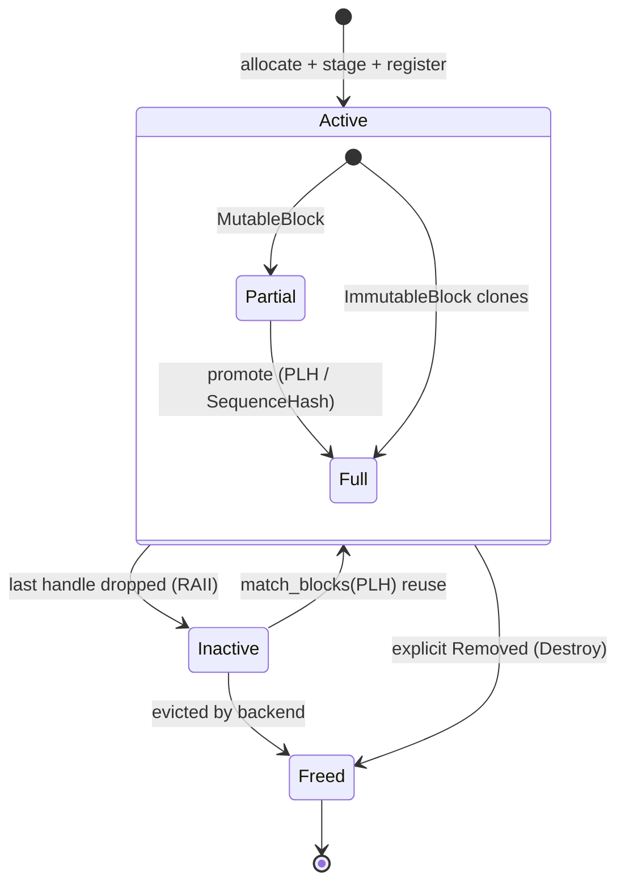

The mocker is organized into several cooperating components that mirror the internal architecture of production LLM inference engines. The scheduler (vLLM-style and SGLang-style variants) and KV block manager live inside the engine core. Multi-engine behavior — KV transfer/offloading simulation, KV router simulation, planner simulation — is added by the DynoSim run harness on top of multiple engine cores; see [DynoSim Runs](../dynosim/runs.md) for the component-level diagram and for offline internals under [`lib/mocker/src/replay/offline/`](../../lib/mocker/src/replay/offline/README.md).

For how to launch and deploy the mocker worker, see [Live Simulation with Mocker](../dynosim/mocker.md); for the command-line flags referenced throughout this page, see the [Mocker CLI Reference](../components/mocker/mocker-cli-reference.mdx).

## Scheduler

The mocker has two scheduler shapes rather than one generic queue model:

- **vLLM mocker** uses an upstream-style `waiting + running` scheduler. Each request tracks
  computed tokens, the scheduler spends one token budget across the running set first, and decode
  pressure triggers inline preemption of running requests.
- **SGLang mocker** uses a cache-aware waiting/running scheduler around a radix-style prefix cache.
  It batches prefill work with decode-state awareness and handles pressure primarily through decode
  retraction while preserving cached prefixes.

Both schedulers simulate continuous batching, prefix reuse, chunked prefill, memory pressure, and
decode token emission while publishing metrics about current resource utilization.

When resources become constrained, the mocker simulates the engine's real recovery path:
- vLLM-style decode preemption and recompute
- SGLang-style decode retraction plus prefix-preserving cache updates

## KV Block Manager

The mocker's KV block manager is built on [`kvbm-logical::BlockManager<G1>`](https://github.com/ai-dynamo/dynamo/tree/main/lib/kvbm-logical), the same logical block manager the real Dynamo runtime uses. The mocker wraps it in [`lib/mocker/src/kv_manager/kvbm_backend.rs`](https://github.com/ai-dynamo/dynamo/blob/main/lib/mocker/src/kv_manager/kvbm_backend.rs) and translates its own `MoveBlock` protocol onto kvbm-logical's RAII lifecycle (`allocate → stage → register → drop`).

Blocks conceptually live in one of two pools:

- **Active** — blocks currently held by at least one sequence. Partial (still-filling) blocks are held as `MutableBlock<G1>`; full blocks are held as `ImmutableBlock<G1>` clones (the clone vec length is the mocker's refcount, one per `Use`).
- **Inactive** — blocks no longer referenced by any sequence but kept for prefix-cache reuse. Handled entirely by kvbm-logical's inactive pool; the mocker never tracks them manually.

The lifecycle is RAII: dropping the last `ImmutableBlock` clone transitions the block from active to inactive (kvbm-logical's `reset` pool), with no explicit `deref`/`evict` bookkeeping on the mocker side. When a sequence completes or is preempted, the mocker simply drops its handles; kvbm-logical recovers the capacity.

Three `Use` outcomes are tracked for KV-event emission: `ActiveHit` (bump refcount on an already-pinned block), `InactiveHit` (reactivate via `match_blocks(plh)`), and `NewStore` (fresh allocation). Only `NewStore` emits a `Stored` KV event — the router radix tree already knows about the other two and only forgets on explicit `Removed`.

## Eviction Backends

The kvbm-logical inactive pool selects eviction victims via one of three backends, exposed as `MockerEvictionBackend` in [`lib/mocker/src/common/protocols.rs`](../../lib/mocker/src/common/protocols.rs):

- **`Lineage`** (default) — parent-chain aware: evicts leaf blocks first, preserving shared prefix chains. Subsumes the preemption-priority behavior the hand-rolled `LRUEvictor::push_front` used to provide.
- **`Lru`** — plain recency-based LRU.
- **`MultiLru`** — 4-tier frequency-aware LRU built on a TinyLFU tracker.

All three give the same "suffix blocks evicted before shared prefixes" outcome that the previous evictor was designed to produce; `Lineage` does it structurally (via the block parent chain) rather than via monotonic counters.

## Sequence Tracking

Each active request is tracked as a sequence, managing its token blocks and generation state. As tokens are generated, the sequence tracks which blocks are partial (`MutableBlock<G1>`, still being filled) versus full (`ImmutableBlock<G1>`, complete and hashable for prefix caching). When a partial block fills up, it gets "promoted" to a full block with a content-based `SequenceHash` (or collapses onto an existing registered handle if the PLH is already present), enabling future cache hits from requests with matching prefixes.

## Performance Model

The mocker supports three timing prediction modes:

**Polynomial Model (Default):** Uses hardcoded polynomial formulas that approximate typical GPU behavior. Prefill time scales quadratically with token count, while decode time depends on the total active KV cache size.

**Interpolated Model:** Loads actual profiling data from an NPZ file containing measured prefill and decode latencies. The mocker interpolates between data points to predict timing for any input size. This enables high-fidelity simulation matching a specific hardware configuration.

**AIC Model (`--aic-perf-model`):** Uses the NVIDIA AI Configurator (AIC) SDK for latency prediction. AIC provides calibrated performance models for specific GPU/model/engine combinations, predicting prefill and decode latency as a function of batch size, sequence length, and prefix cache hits. The model path is automatically derived from `--model-path`, and the engine type from `--engine-type`. This mode is opt-in and requires both the `aiconfigurator` SDK and loadable systems/perf data for the requested tuple.

## Bootstrap Rendezvous (Disaggregated Serving)

For disaggregated prefill/decode deployments, prefill and decode workers coordinate via a simple TCP-based rendezvous protocol. The decode worker connects to the prefill worker's bootstrap port and waits until the prefill phase completes and KV cache is ready. Either side can arrive first—the rendezvous completes when both are ready.

## KV Transfer Latency Simulation

The mocker simulates KV cache transfer time between prefill and decode workers. Before the prefill worker emits its first (and only) token, it sleeps for a duration based on:

- **kv_bytes_per_token** (auto-computed from model config): `num_layers * 2 * num_kv_heads * head_dim * dtype_bytes`. The `dtype_bytes` is determined by `--kv-cache-dtype`: when set to `auto` (default), it uses the model's `dtype` from config; when explicitly set (e.g., `fp8`), it uses the specified dtype instead. It can also be overridden directly with `--kv-bytes-per-token`.
- **kv_transfer_bandwidth** (default: 64.0 GB/s, inter-node InfiniBand)
- **Transfer time**: `num_input_tokens * kv_bytes_per_token / bandwidth`

This delay is injected after the scheduler's prefill compute simulation completes, modeling the sequential flow: prefill computation → KV transfer → decode begins. Set `--kv-transfer-bandwidth 0` to disable.

## Integration with Dynamo

### KV Event Publishing

When prefix caching is enabled, the mocker publishes KV cache events to the distributed runtime. These events notify the system when blocks are stored (new content cached) or removed (evicted). This enables the KV-aware router to make intelligent routing decisions based on which workers have which prefixes cached.

### Metrics Publishing

Each scheduler publishes metrics about its current state, including the number of active decode blocks per DP rank. The router uses these metrics for load-aware routing decisions.

## Comparison with Real Engines

| Feature | Real Engine | Mocker |
|---------|-------------|--------|
| GPU Required | Yes | No |
| Block Manager | Paged KV cache | Simulated blocks |
| Scheduler | Continuous batching | Continuous batching |
| Prefix Caching | Hash-based | Hash-based |
| Chunked Prefill | Supported | Supported |
| Preemption | Recompute/swap | Recompute (simulated) |
| Timing | Real execution | Model-based |
| KV Events | Native | Compatible |
| Data Parallelism | Multi-GPU | Simulated |

## Feature Gaps (WIP)

> For the broader mocker enhancement roadmap, see [#6383](https://github.com/ai-dynamo/dynamo/issues/6383).

The following features are not yet supported by the mocker:

- **Multi-tier memory** - No support for offloading KV cache to CPU/disk or onboarding back to GPU; potential future integration with KVBM
- **Multimodal support** - Currently only simulates text token processing; no vision encoder or cross-attention simulation
- **Native Rust reference counting** - Work in progress to use native Rc/Arc for block reference counting, enabling natural RAII patterns for simpler tracking

## See Also

| Document | Description |
|----------|-------------|
| [Live Simulation with Mocker](../dynosim/mocker.md) | Deploy and run the mocker worker locally or on Kubernetes |
| [Mocker CLI Reference](../components/mocker/mocker-cli-reference.mdx) | Command-line flags for `python -m dynamo.mocker` |
| [DynoSim Runs](../dynosim/runs.md) | Run one workload through a simulated configuration with `python -m dynamo.replay` |
