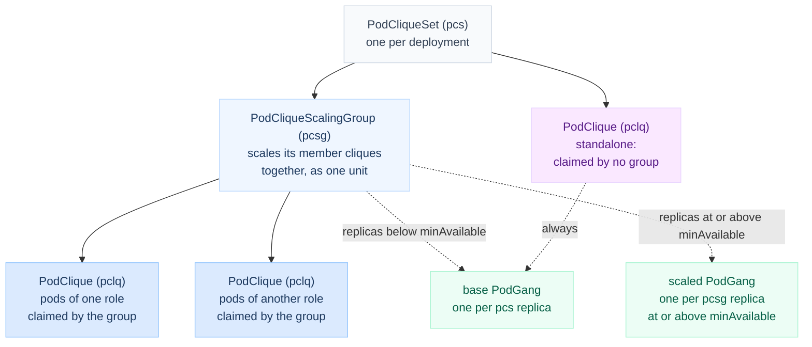
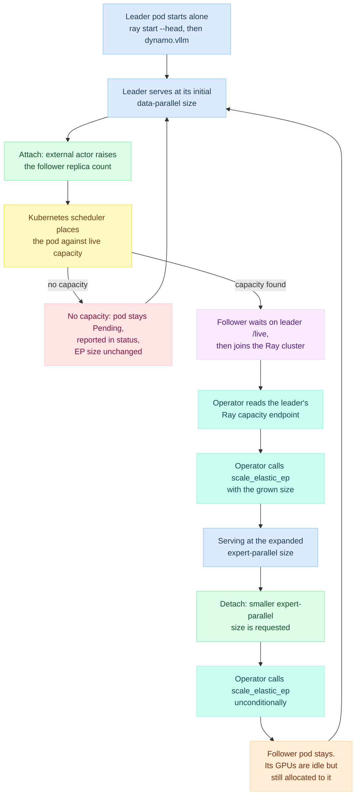
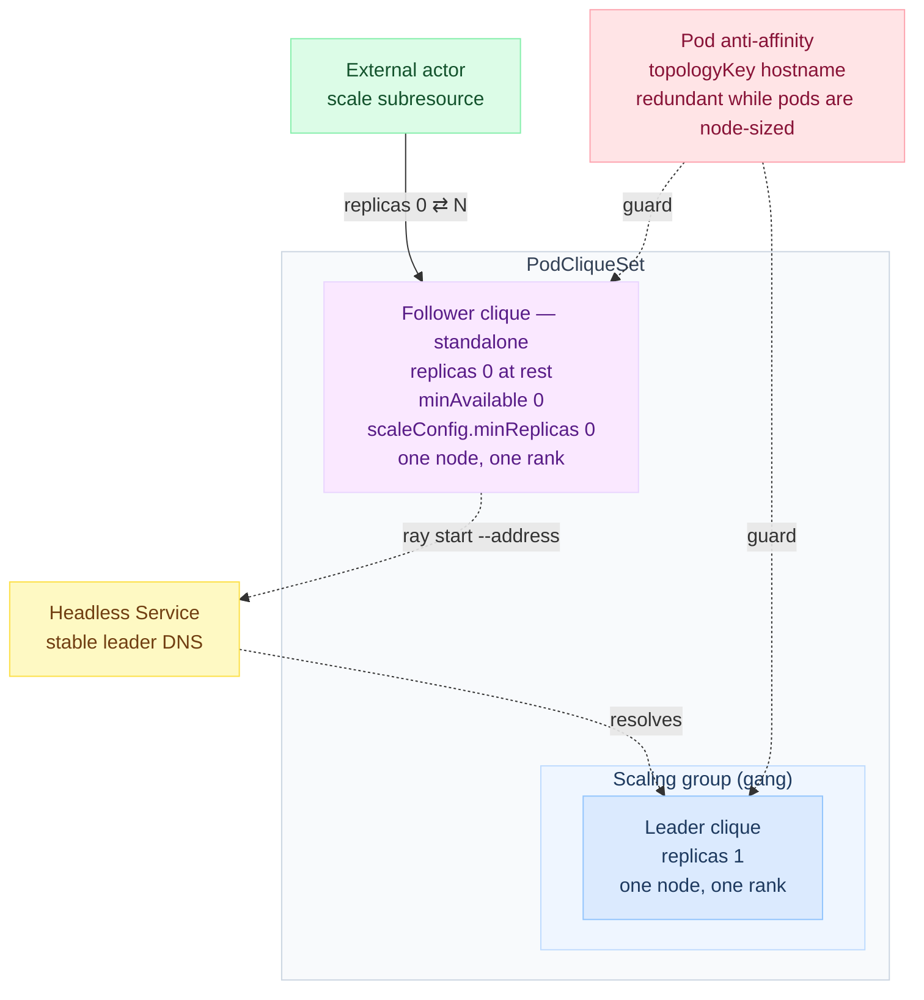

<!--
SPDX-FileCopyrightText: Copyright (c) 2025-2026 NVIDIA CORPORATION & AFFILIATES. All rights reserved.
SPDX-License-Identifier: Apache-2.0
-->

# Operator Support for On-Demand Elastic EP Followers

This is the implementation plan for letting the Dynamo Kubernetes operator run an
elastic-EP leader on its own, then attach follower pods to that leader's Ray cluster at an
arbitrary later time.

Tracking issue: DYN-3686.

> [!NOTE]
> Code references are permalinks with line anchors, pinned so they stay valid as both
> repositories move: Dynamo at
> [`9cddb34a`](https://github.com/ai-dynamo/dynamo/commit/9cddb34a713f7e18a2cd1b165750eed46d7e74f8),
> Grove at
> [`19905d53`](https://github.com/ai-dynamo/grove/commit/19905d530d48bdabe3f1de6a8a175544f941d81e)
> — the commit behind tag `operator/api/v0.1.0-alpha.12-rc1`, which is the module Dynamo
> imports ([`deploy/operator/go.mod:9`](https://github.com/ai-dynamo/dynamo/blob/9cddb34a713f7e18a2cd1b165750eed46d7e74f8/deploy/operator/go.mod#L9)), and vLLM at
> [`e6d67fdd`](https://github.com/vllm-project/vllm/commit/e6d67fddb4b27d4772ae714348a22af7fe7e35e5)
> on `vllm-project/vllm` `main`. Line numbers therefore reflect those commits rather than
> current `main`. One vLLM reference has no upstream equivalent and points at the team's fork;
> it is flagged where it appears.

## Summary

Today the operator can only build a *static* elastic-EP topology: all pods are created
together and gang-scheduled together, so a pod that arrives hours after the leader is already
serving is inexpressible. Six specific obstacles are
[identified below](#why-the-current-operator-cannot-express-this), and the awkward one is
gang scheduling, because a deliberately absent pod cannot be a member of the leader's gang.

The Grove API accommodates this directly. Grove normally scales a *group* of pod sets
together, but a pod set may also sit outside every group, and such a set both moves its own
replica count and can declare that being empty is legal rather than a failure. The
[vocabulary section](#the-grove-objects-involved) defines these terms before the rest of the
document relies on them.

The follower therefore becomes one of these standalone sets: resting at zero replicas,
driven by an external actor, with the Kubernetes scheduler deciding placement against real
capacity at the moment it is needed. That leaves the operator a comparatively small job —
keep a Ray head on a solo leader, give that leader a stable address, render the follower,
and call `scale_elastic_ep` once the follower's GPUs are genuinely visible in Ray.

**The sizing premise.** A pod occupies a whole node and holds exactly one data-parallel rank. That
single equation does two jobs: it makes the unit of expert-parallel scaling identical to the unit of
GPU allocation, which keeps the rest of the design simple, and it guarantees the interconnect,
because a pod filling its node leaves no room for a sibling whose GPUs it could not reach over
NVLink. The cost is that tensor parallelism is pinned to the node's GPU count in v1.
[Pod sizing](#pod-sizing-one-pod-per-node) works through the consequences.

**What v1 delivers.** Growth end to end: a leader serving alone, a follower created at any
later time with its own GPU count, and an automatic scale call gated on real Ray capacity.
If the cluster has no room, nothing changes anywhere and the shortfall is reported.

**What v1 deliberately leaves undone.** Shrinking is only half elastic. The expert-parallel
group scales down on request, but the follower's GPUs stay allocated to a pod that no longer
uses them; returning them to the cluster is [Phase 8](#phase-8--returning-the-gpus).
Tensor-parallel groups wider than one pod are [Phase 9](#phase-9--tensor-parallelism-wider-than-one-pod).
Both limitations, and why the asymmetry is a property of Kubernetes rather than a gap in the
plan, are explained under [giving the GPUs back](#giving-the-gpus-back).

**What is not verified.** Four things, each marked again where it appears. Two earlier entries —
how Grove treats a clique parked at zero, and how a running PodGang reacts to gaining pods
mid-flight — have since been settled on a cluster; see
[what Phase 0 actually found](#what-phase-0-actually-found).

- whether the follower really appears as its own `PodGroup` with `MinReplicas` zero; the leader was
  observed to be undisturbed, but the mechanism behind that was not confirmed;
- what vLLM does when a scale-up finds no idle GPUs;
- that pods sharing a node genuinely lose NVLink to each other, and what it costs — this rests on
  platform behaviour described to us rather than measured here, though v1 does not depend on it,
  since node-sized pods cannot share a node in the first place;
- whether the injected anti-affinity term composes cleanly with Grove's own topology-aware
  scheduling — likewise inert in v1, and material only once packing shrinks pods below a node.

None of these gate the remaining work. The two that did were settled by the
[Phase 0](#phase-0--settle-the-grove-question-empirically) spike, which ran before any operator
code was written — and which changed the design, exactly as it was placed first to do.

### Scope: vLLM only

Everything below assumes vLLM's Ray-based elastic EP, in which every GPU joins a single Ray
cluster that acts as a shared pool and the group is grown by handing `scale_elastic_ep` a new
data-parallel size.

SGLang's elastic EP has a different shape and none of this transfers unchanged: it uses no
Ray, integrates a separately launched joining group through `--elastic-ep-join-mode scale`,
takes `new_ep_size` rather than `new_data_parallel_size`, and rejects any target below the
current EP size, so it has no scale-down path at all today
([PR #12575](https://github.com/ai-dynamo/dynamo/pull/12575)). Because its joining group is
an explicit unit rather than an anonymous contribution to a shared pool, the reclaim problem
discussed under [giving the GPUs back](#giving-the-gpus-back) may not arise there in the same
form.

## Table of contents

- [What we are building](#what-we-are-building)
  - [Pod sizing: one pod per node](#pod-sizing-one-pod-per-node)
  - [When the cluster has no room](#when-the-cluster-has-no-room)
- [What already works today](#what-already-works-today)
- [The Grove objects involved](#the-grove-objects-involved)
- [Why the current operator cannot express this](#why-the-current-operator-cannot-express-this)
  - [The leader cannot stand alone](#the-leader-cannot-stand-alone)
  - [The follower cannot be absent, or differ in size](#the-follower-cannot-be-absent-or-differ-in-size)
  - [Three pieces that do not exist](#three-pieces-that-do-not-exist)
- [Grove makes the on-demand follower expressible](#grove-makes-the-on-demand-follower-expressible)
  - [What Phase 0 actually found](#what-phase-0-actually-found)
- [The v1 detour: the non-Grove pathway](#the-v1-detour-the-non-grove-pathway)
  - [Why the Grove path is blocked, not just inconvenient](#why-the-grove-path-is-blocked-not-just-inconvenient)
  - [What the non-Grove pathway gives us instead](#what-the-non-grove-pathway-gives-us-instead)
  - [What this costs, and what it improves](#what-this-costs-and-what-it-improves)
  - [What changes in the phases](#what-changes-in-the-phases)
- [Design](#design)
  - [Runtime flow](#runtime-flow)
  - [Generated Kubernetes objects](#generated-kubernetes-objects)
  - [Proposed spec](#proposed-spec)
  - [Knowing when the GPUs have actually joined](#knowing-when-the-gpus-have-actually-joined)
  - [Giving the GPUs back](#giving-the-gpus-back)
- [Implementation phases](#implementation-phases)
  - [Phase 0 — settle the Grove question empirically](#phase-0--settle-the-grove-question-empirically)
  - [Phase 1 — the API surface](#phase-1--the-api-surface)
  - [Phase 2 — the leader always runs a Ray head](#phase-2--the-leader-always-runs-a-ray-head)
  - [Phase 3 — a stable leader address](#phase-3--a-stable-leader-address)
  - [Phase 4 — render the follower as a standalone clique](#phase-4--render-the-follower-as-a-standalone-clique)
  - [Phase 5 — expose Ray capacity on the leader](#phase-5--expose-ray-capacity-on-the-leader)
  - [Phase 6 — the reconciler that fires the scale](#phase-6--the-reconciler-that-fires-the-scale)
  - [Phase 7 — scale down, and accept the idle GPUs](#phase-7--scale-down-and-accept-the-idle-gpus)
- [Deferred work](#deferred-work)
  - [Phase 8 — returning the GPUs](#phase-8--returning-the-gpus)
  - [Phase 9 — tensor parallelism wider than one pod](#phase-9--tensor-parallelism-wider-than-one-pod)
  - [Packing several ranks into one pod](#packing-several-ranks-into-one-pod)
- [Risks](#risks)
- [Test plan](#test-plan)
- [Open decisions](#open-decisions)
- [Appendix — how the scale subresource works](#appendix--how-the-scale-subresource-works)

## What we are building

The leader pod starts first and begins serving. Some unknown amount of time later, load
rises past what the leader's own GPUs can supply. At that moment a follower pod is created,
joins the leader's Ray cluster, and the expert-parallel group grows to include its GPUs. In v1
that follower is an exact copy of the leader — one node, one data-parallel rank — for the reasons
[pod sizing](#pod-sizing-one-pod-per-node) sets out.

Nothing is reserved ahead of time. There is no warm-standby pool billing for GPUs it is not
using. The follower count rests at zero, and an external actor — the planner, a
HorizontalPodAutoscaler, or a human — raises it when the service level demands it. Placement
is decided at that moment by the Kubernetes scheduler against real cluster state, rather than
pinned in advance by the operator.

This is a different shape from the one `multinode.nodeCount` describes. `nodeCount` means
"build a static multi-node topology and gang-schedule all of it together." What we need is closer
to "this leader is elastic-EP attachable, and an extra pod may join its Ray cluster later." The
pods happen to look alike in v1, so the difference is not their shape but their lifecycle: one
gang fixed at admission versus a membership that changes while the service runs. Those two ideas
should not share a field, so the plan adds a separate API surface rather than overloading
`nodeCount`.

### Pod sizing: one pod per node

One decision shapes everything downstream, so it is stated up front: **a pod occupies a whole node
and holds exactly one data-parallel rank.** A pod is therefore sized at the engine's world size, and
since elastic EP rejects pipeline parallelism outright
([`parallel.py:846-850`](https://github.com/vllm-project/vllm/blob/e6d67fddb4b27d4772ae714348a22af7fe7e35e5/vllm/config/parallel.py#L846-L850))
that world size is simply the tensor-parallel size. Growing the group by one rank means adding one
pod, and therefore one node; shrinking by one rank empties exactly one pod.

Equating the two — a pod is a node *and* a pod is a rank — is what fixes the tensor-parallel size at
the node's GPU count, four on GB200 NVL72. That is a real restriction and it is deliberate for v1,
not a limit of the engine. Smaller tensor-parallel sizes are perfectly valid in vLLM; they are
excluded here only because a rank narrower than a node would leave most of each node unused unless
several ranks are packed into the pod, and [packing](#packing-several-ranks-into-one-pod) is deferred.

A rank can never span two pods, and the reason is worth making explicit because it is easy to miss:
**each pod is its own Ray node.** The leader runs `ray start --head` and every follower runs
`ray start --address=<leader>`, so a Ray node's GPU count is whatever its pod can see, and Ray's
notion of a node has nothing to do with the Kubernetes node underneath. When
`add_dp_placement_groups` walks the Ray nodes and computes how many engines each can take as
`available_gpus // world_size`
([`utils.py:791`](https://github.com/vllm-project/vllm/blob/e6d67fddb4b27d4772ae714348a22af7fe7e35e5/vllm/v1/engine/utils.py#L791)),
it is therefore dividing a *pod's* GPUs; and because each placement group is created with
`strategy="STRICT_PACK"`
([`utils.py:810`](https://github.com/vllm-project/vllm/blob/e6d67fddb4b27d4772ae714348a22af7fe7e35e5/vllm/v1/engine/utils.py#L810)),
every bundle of a rank lands on one Ray node — one pod. A pod smaller than the world size can host
no rank at all.

The same division is what would permit packing: a pod holding a whole multiple of the world size
simply receives that many engines. That is legal in vLLM but out of scope for v1, and
[packing](#packing-several-ranks-into-one-pod) records the design. A pod whose GPU count is not a
whole multiple of the world size is invalid either way, since the remainder can never host a rank.

Two distinct boundaries follow, and conflating them is the easiest mistake to make here. A rank must
fit inside a **pod**, which is what vLLM's placement arithmetic enforces. Whether two pods share a
**Kubernetes node** is a separate question that vLLM cannot see at all, and it is the one that
governs the interconnect.

**Why a pod takes the whole node.** GPUs within one pod reach each other over NVLink, and pods on
*different* nodes reach each other over multi-node NVLink — this repository already ships a
tensor-parallel group of sixteen spanning four four-GPU pods that way
([`agg-gb200-agentic/deploy.yaml:4`](https://github.com/ai-dynamo/dynamo/blob/9cddb34a713f7e18a2cd1b165750eed46d7e74f8/recipes/kimi-k3/vllm/agg-gb200-agentic/deploy.yaml#L4), with the layout at
[`:83-84`](https://github.com/ai-dynamo/dynamo/blob/9cddb34a713f7e18a2cd1b165750eed46d7e74f8/recipes/kimi-k3/vllm/agg-gb200-agentic/deploy.yaml#L83-L84) and
[`:173-177`](https://github.com/ai-dynamo/dynamo/blob/9cddb34a713f7e18a2cd1b165750eed46d7e74f8/recipes/kimi-k3/vllm/agg-gb200-agentic/deploy.yaml#L173-L177)). Two pods sharing a *single* node are the exception and the arrangement to
avoid: peer access between them would need the local CUDA IPC path, which per-pod IPC namespaces and
per-pod device visibility block, while the fabric path is not chosen for peers that are not on
separate nodes. Expert-parallel traffic flows between ranks and therefore between pods, so this is
precisely the traffic that would suffer; tensor-parallel traffic stays inside a pod and is unaffected
either way.

A node-sized pod makes that arrangement unreachable rather than merely discouraged, because a pod
requesting every GPU on its node leaves no room for a sibling. This is the main reason the premise is
worth its cost: the interconnect guarantee comes from the sizing rule itself, with no scheduling
constraint to configure and nothing to get wrong.

The operator still injects a required pod anti-affinity term keyed on `kubernetes.io/hostname`, which
Grove permits because `PodCliqueSpec` embeds a full `corev1.PodSpec`
([`podclique.go:64`](https://github.com/ai-dynamo/grove/blob/19905d530d48bdabe3f1de6a8a175544f941d81e/operator/api/core/v1alpha1/podclique.go#L64));
[Phase 4](#phase-4--render-the-follower-as-a-standalone-clique) carries it. Under node-sized pods the
term is redundant and does no work. It is retained as a cheap guard, and it becomes load-bearing the
moment a pod is smaller than its node — which is exactly what packing would introduce.

> [!NOTE]
> The NVLink reasoning is general platform behaviour rather than anything verified in this
> repository; only the multi-node NVLink recipe cited above was checked. The expected cost of
> co-location is a fall back to network transport for the affected pair — a performance penalty
> rather than a failure — and that has not been measured here either. Nothing in v1 depends on the
> reasoning, since the sizing rule already precludes the arrangement.

Comparing tensor-parallel size against a node's GPU count then leaves three cases:

| Tensor-parallel size | Consequence |
|---|---|
| Equal to a node's GPU count | The v1 shape. One pod, one node, one rank. |
| Smaller than a node's GPU count | Valid in vLLM, but rejected in v1: without [packing](#packing-several-ranks-into-one-pod) most of each node would sit unused. |
| Larger than a node's GPU count | A pod cannot exceed its node, so no pod reaches the world size, `available_gpus // world_size` is zero everywhere, and no rank can ever be added. Rejected; [Phase 9](#phase-9--tensor-parallelism-wider-than-one-pod) would lift it. |

**Choosing a shape when the model wants a different tensor-parallel size.** Neither the second nor
the third row is as restrictive as it looks, and both have the same remedy, because expert-parallel
width does not come from tensor parallelism alone. vLLM is explicit that "the EP group spans the
TP x PCP x DP ranks"
([`parallel.py:501-514`](https://github.com/vllm-project/vllm/blob/e6d67fddb4b27d4772ae714348a22af7fe7e35e5/vllm/config/parallel.py#L501-L514)),
so with prefill-context parallelism at its default of one, expert-parallel width is the product of
tensor-parallel and data-parallel size — which is also the total GPU count. Set tensor parallelism to
the node's GPU count and take the width you wanted from data parallelism instead: the product is
unchanged, the GPU count is unchanged, and the deployment lands on the supported shape from either
direction.

What the reshaping does change is how the non-expert layers are sharded. Coming down from a wider
tensor-parallel group, they divide across fewer ranks, so each GPU holds more of them and a single
request's KV cache is split less finely, which bounds how long one context can grow; in exchange the
deployment gains independent engines and a narrower tensor-parallel all-reduce. Coming up from a
narrower one, the trade runs the other way. For wide-EP mixture-of-experts models, where expert
weights dominate, neither direction is usually decisive — an expectation to measure rather than a
benchmarked result.

### When the cluster has no room

Deciding placement at the last moment means the answer can be "there is nowhere to put this."
That outcome deserves spelling out, because it is the one the whole arrangement is built to
make harmless.

A pod Kubernetes cannot place does not fail. It is admitted and it exists, but it is never
bound to a node, so it sits in `Pending` and none of its containers ever start — which means
it never runs `ray start` and its GPUs never appear in the leader's Ray cluster. The
[capacity gate](#knowing-when-the-gpus-have-actually-joined) consequently sees nothing new,
the operator never calls `scale_elastic_ep`, and the leader keeps serving at exactly the size
it had before. The request to grow is left outstanding rather than partly honoured, and
because the scheduler keeps reconsidering the pod, a GPU freeing up an hour later places it
then with nobody having to ask again.

The plausible alternatives are worse than doing nothing. Issuing the scale call without first
confirming the GPUs exist would ask the engine to grow into capacity that is not there,
leaving the operator's picture of the topology permanently diverged from what the engine runs.
Putting the follower inside the leader's gang would be worse still: an unplaceable follower
breaches the availability floor Grove uses to decide gang termination (see
[the Grove objects involved](#the-grove-objects-involved)), so a shortage of *spare* capacity
would cost the capacity already serving traffic. The design gives two outcomes and no third —
either the follower's GPUs are in Ray and the group has grown to match, or nothing has changed
and the shortfall shows up in status as a `Pending` pod with a reason attached. Because no
intermediate state exists, a retry costs nothing.

[Node-sized pods](#pod-sizing-one-pod-per-node) make `Pending` more likely, and that is a deliberate
trade. A follower needs an *entirely free* node, not merely a node with enough spare GPUs, so a
cluster whose capacity is scattered across partly-used nodes can refuse a follower it could otherwise
have placed. The trade is worth taking because the two outcomes are asymmetric: refusing to place
costs a delay the scheduler retries out of, while placing badly costs degraded interconnect for as
long as the follower lives, with nothing in the system reporting that anything is wrong. It does
raise the value of the reason string in status, since "no node has four free GPUs" and "capacity
exists but is fragmented" call for different responses from whoever is watching.

## What already works today

Most of the runtime machinery this feature needs already exists, so it is worth being precise
about what it does before describing what is missing.

**The two pod shapes.** When a vLLM component requests more than one node and its arguments
contain `--enable-elastic-ep`, the operator routes to a dedicated Ray-cluster branch
([`deploy/operator/internal/dynamo/backend_vllm.go:277-288`](https://github.com/ai-dynamo/dynamo/blob/9cddb34a713f7e18a2cd1b165750eed46d7e74f8/deploy/operator/internal/dynamo/backend_vllm.go#L277-L288)) rather than its normal
data-parallel path, because vLLM rejects the combination of elastic EP and the operator's
usual `--data-parallel-hybrid-lb` coordination. That branch, `injectElasticEPRayLaunchFlags`
([`backend_vllm.go:415-465`](https://github.com/ai-dynamo/dynamo/blob/9cddb34a713f7e18a2cd1b165750eed46d7e74f8/deploy/operator/internal/dynamo/backend_vllm.go#L415-L465)), rewrites both pods' commands: the leader starts a Ray head
and then launches `dynamo.vllm`, while the worker runs no engine at all and only contributes
its GPUs to the cluster.

**Why the follower waits for the leader.** The worker's command is gated on the leader
becoming healthy before it joins ([`backend_vllm.go:452-462`](https://github.com/ai-dynamo/dynamo/blob/9cddb34a713f7e18a2cd1b165750eed46d7e74f8/deploy/operator/internal/dynamo/backend_vllm.go#L452-L462)). It polls the leader's `/live`
endpoint on the Dynamo system port until that returns HTTP 200, and only then runs
`ray start --address=<leader>:6379 --block`. The function's own comment explains the reason: a
worker that joins Ray before the engine has finished creating its data-parallel placement
groups causes vLLM to see every GPU in the cluster and create too many groups, failing an
internal assertion. Delaying the join leaves the leader holding all initial ranks, with the
worker's GPUs arriving as idle capacity. That gate is also what makes late joining safe in
either start order, which is why this design reuses it unchanged rather than inventing new
coordination.

**Joining Ray is not the same as scaling.** Contributing idle GPUs and growing the
expert-parallel group are two separate events. The second happens only when something calls
`scale_elastic_ep` ([`components/src/dynamo/vllm/handlers.py:1301-1408`](https://github.com/ai-dynamo/dynamo/blob/9cddb34a713f7e18a2cd1b165750eed46d7e74f8/components/src/dynamo/vllm/handlers.py#L1301-L1408)), the engine-side
entry point that hands a new data-parallel size to vLLM, registered as an engine route in
[`worker_factory.py:1516-1518`](https://github.com/ai-dynamo/dynamo/blob/9cddb34a713f7e18a2cd1b165750eed46d7e74f8/components/src/dynamo/vllm/worker_factory.py#L1516-L1518). Three properties of that handler constrain the caller this
plan adds: it serialises itself against concurrent callers
([`handlers.py:1344-1356`](https://github.com/ai-dynamo/dynamo/blob/9cddb34a713f7e18a2cd1b165750eed46d7e74f8/components/src/dynamo/vllm/handlers.py#L1344-L1356)), it enforces a lower bound on the target, and
it takes a single scalar, `new_data_parallel_size`, and nothing else — that last detail shapes
the whole scale-down story below. Deeper in vLLM the same path asserts that the data-parallel
backend is Ray, rejecting anything else with "Only ray DP backend supports scaling elastic EP"
([`core_client.py:1633`](https://github.com/vllm-project/vllm/blob/e6d67fddb4b27d4772ae714348a22af7fe7e35e5/vllm/v1/engine/core_client.py#L1633)),
so the Ray coupling is enforced rather than incidental.

That lower bound is worth stating precisely, because it is easy to mis-read as a floor of two.
The real constraint is vLLM's: expert-parallel load balancing, which elastic EP requires, needs
the product of tensor-parallel, prefill-context-parallel and data-parallel size to exceed one
([`parallel.py:501-514`](https://github.com/vllm-project/vllm/blob/e6d67fddb4b27d4772ae714348a22af7fe7e35e5/vllm/config/parallel.py#L501-L514)).
A data-parallel size of one is therefore perfectly legal whenever tensor parallelism already
supplies more than one expert-parallel rank — the ordinary case under
[one pod per node](#pod-sizing-one-pod-per-node), where scaling back to a single pod
is a target the design needs rather than an edge case. At the pinned commit Dynamo's handler
still rejects anything below two, so deriving that bound from the engine's own rule is prerequisite
work for this plan. It may safely omit the prefill-context term while no Dynamo path sets it.

**When the elastic-EP path is not taken.** The tensor- and pipeline-parallel check runs before
the elastic-EP branch ([`backend_vllm.go:271-276`](https://github.com/ai-dynamo/dynamo/blob/9cddb34a713f7e18a2cd1b165750eed46d7e74f8/deploy/operator/internal/dynamo/backend_vllm.go#L271-L276)), so when a single engine's world size
exceeds one pod's GPU count the distributed launch wins and the elastic-EP wiring is never
reached. `needsTensorParallelMultinodeLaunch` makes that comparison directly — world size against
the pod's GPU request ([`backend_vllm.go:536-548`](https://github.com/ai-dynamo/dynamo/blob/9cddb34a713f7e18a2cd1b165750eed46d7e74f8/deploy/operator/internal/dynamo/backend_vllm.go#L536-L548)).

Elastic EP therefore applies only where a rank fits inside one pod, which is the same boundary
vLLM's placement arithmetic draws and the reason
[one pod per node](#pod-sizing-one-pod-per-node) is the natural shape. The failure
mode when the boundary is crossed is the problem: the distributed-launch check wins silently, so a
deployment asking for both gets multi-node tensor parallelism and none of the elastic-EP wiring,
with nothing to indicate that half the request was dropped. It must be rejected at admission
instead, which [Phase 1](#phase-1--the-api-surface) covers, and lifting the bound is a genuine goal
taken up in [Phase 9](#phase-9--tensor-parallelism-wider-than-one-pod).

## The Grove objects involved

The operator does not create pods directly. It renders Grove custom resources and lets Grove
create the pods, so everything that follows leans on Grove's vocabulary. This section defines
those terms once.

Solid arrows below are ownership, in the objects Dynamo writes. Dashed arrows are the
scheduling view Grove derives from them.



Three nouns do most of the work, and they nest.

A **`PodClique`** (`pclq`) is "a set of pods running the same image"
([`core/v1alpha1/podclique.go:38`](https://github.com/ai-dynamo/grove/blob/19905d530d48bdabe3f1de6a8a175544f941d81e/operator/api/core/v1alpha1/podclique.go#L38)). Dynamo emits one per role, so a multi-node vLLM
component becomes a leader clique and a worker clique.

A **`PodCliqueScalingGroup`** (`pcsg`) ties cliques together so they scale as one
([`core/v1alpha1/scalinggroup.go:35-36`](https://github.com/ai-dynamo/grove/blob/19905d530d48bdabe3f1de6a8a175544f941d81e/operator/api/core/v1alpha1/scalinggroup.go#L35-L36)), listing its members in `CliqueNames`
([`scalinggroup.go:75-77`](https://github.com/ai-dynamo/grove/blob/19905d530d48bdabe3f1de6a8a175544f941d81e/operator/api/core/v1alpha1/scalinggroup.go#L75-L77)). Add one replica and every member clique is replicated with it —
that is what makes a leader-plus-workers set indivisible. A clique no group claims is
**standalone**.

A **`PodGang`** is what the scheduler places all-or-nothing: either enough of its pods land
together or none of them run. A `PodCliqueSet` is "a set of PodGangs"
([`core/v1alpha1/podcliqueset.go:40`](https://github.com/ai-dynamo/grove/blob/19905d530d48bdabe3f1de6a8a175544f941d81e/operator/api/core/v1alpha1/podcliqueset.go#L40)).

Gangs also carry a runtime rule, and it is the one to watch. If *any* clique in a gang falls
below its threshold, Grove restarts the entire gang rather than that clique, and the behaviour
is not configurable ([`podcliqueset.go:175-180`](https://github.com/ai-dynamo/grove/blob/19905d530d48bdabe3f1de6a8a175544f941d81e/operator/api/core/v1alpha1/podcliqueset.go#L175-L180)). Teardown is not instant: a gang below
threshold becomes a *candidate* first, and `TerminationDelay` — four hours by default — gives
it time to recover ([`podcliqueset.go:206-213`](https://github.com/ai-dynamo/grove/blob/19905d530d48bdabe3f1de6a8a175544f941d81e/operator/api/core/v1alpha1/podcliqueset.go#L206-L213)).

Two clique fields set that threshold, and they are easy to confuse. **`MinAvailable`** is the
scheduling floor: "the minimum number of pods that are guaranteed to be gang scheduled," and
falling below it "will result in termination of the PodGang that it belongs to." Left unset, it
defaults to the template's `Replicas` ([`podclique.go:67-73`](https://github.com/ai-dynamo/grove/blob/19905d530d48bdabe3f1de6a8a175544f941d81e/operator/api/core/v1alpha1/podclique.go#L67-L73)).
**`ScaleConfig.MinReplicas`** is the restart threshold itself — Grove uses it when set and the
clique's `Replicas` otherwise — and doubles as the lowest an autoscaler may scale in to
([`podclique.go:90-94`](https://github.com/ai-dynamo/grove/blob/19905d530d48bdabe3f1de6a8a175544f941d81e/operator/api/core/v1alpha1/podclique.go#L90-L94)).

The follower sets **both to zero**, deliberately, so that its absence never reads as a failure.
Writing only `ScaleConfig.MinReplicas` would not be enough, since `MinAvailable` otherwise
inherits the template's `Replicas` and reimposes the same floor by a different route.

`PodGang` is the one object here that Dynamo never touches. It belongs to a different Go module
and a different API group, `scheduler.grove.io`
([`scheduler/api/core/v1alpha1/podgang.go:29-37`](https://github.com/ai-dynamo/grove/blob/19905d530d48bdabe3f1de6a8a175544f941d81e/scheduler/api/core/v1alpha1/podgang.go#L29-L37)), while Dynamo imports only
`grove/operator/api` ([`deploy/operator/go.mod:9`](https://github.com/ai-dynamo/dynamo/blob/9cddb34a713f7e18a2cd1b165750eed46d7e74f8/deploy/operator/go.mod#L9)). Grove's own controller derives
PodGangs from what Dynamo writes, and the scheduler consumes them.

How that derivation lands matters for the follower, because the mapping is not one gang per
deployment. Each `PodCliqueSet` replica gets a *base* PodGang; a scaling group's replicas below
its `MinAvailable` join that base gang, while replicas at or above it each become their own
*scaled* PodGang ([`namegen.go:106-123`](https://github.com/ai-dynamo/grove/blob/19905d530d48bdabe3f1de6a8a175544f941d81e/operator/api/common/namegen.go#L106-L123)). A standalone clique gets no gang of its own: it
is placed in the base PodGang alongside the leader
([`namegen.go:100-104`](https://github.com/ai-dynamo/grove/blob/19905d530d48bdabe3f1de6a8a175544f941d81e/operator/api/common/namegen.go#L100-L104)).

That is worth stating plainly because it cuts against the intuition behind this design. Making
the follower standalone buys an independent *replica count*, not an independent gang. What keeps
it from dragging the leader's gang around is one level lower: Grove emits one `PodGroup` per
clique, carrying that clique's own `minAvailable` as the group's `MinReplicas`
([`podgang.go:185-190`](https://github.com/ai-dynamo/grove/blob/19905d530d48bdabe3f1de6a8a175544f941d81e/operator/internal/controller/podcliqueset/components/podgang/podgang.go#L185-L190)). With the follower's `minAvailable` at zero, its PodGroup asks the
scheduler for nothing, so sharing the base gang costs the leader nothing either. The API shape
supports the design; what it cannot tell us is how the scheduler reacts when an already-running
gang gains pod references mid-flight, which
[Phase 0](#phase-0--settle-the-grove-question-empirically) settles by experiment.

## Why the current operator cannot express this

Six obstacles stand in the way. They group into three themes, and they are fixed in different
places.

### The leader cannot stand alone

**The Ray head only appears for multi-node components.** `UpdateContainer` computes
`isMultinode := numberOfNodes > 1` ([`backend_vllm.go:49`](https://github.com/ai-dynamo/dynamo/blob/9cddb34a713f7e18a2cd1b165750eed46d7e74f8/deploy/operator/internal/dynamo/backend_vllm.go#L49)) and places every multi-node
argument rewrite, including the elastic-EP branch, inside that condition. A leader deployed on
its own therefore never runs `ray start --head`, so there is no Ray cluster for anyone to join
later.

A subtler problem hides behind the same issue. A single-pod component is expanded as `RoleMain`,
not `RoleLeader` ([`graph.go:1170-1178`](https://github.com/ai-dynamo/dynamo/blob/9cddb34a713f7e18a2cd1b165750eed46d7e74f8/deploy/operator/internal/dynamo/graph.go#L1170-L1178)), and the leader arm of
`injectElasticEPRayLaunchFlags` matches only `RoleLeader`. Even with the gate removed, the switch
would fall through and inject nothing at all.

### The follower cannot be absent, or differ in size

**Leader and follower are rendered from one spec.** Role expansion emits a leader clique and a
worker clique (`expandMultinodeRoles`, [`graph.go:1180-1185`](https://github.com/ai-dynamo/dynamo/blob/9cddb34a713f7e18a2cd1b165750eed46d7e74f8/deploy/operator/internal/dynamo/graph.go#L1180-L1185)), but both are then built by
`buildCliqueForRole` ([`graph.go:2149`](https://github.com/ai-dynamo/dynamo/blob/9cddb34a713f7e18a2cd1b165750eed46d7e74f8/deploy/operator/internal/dynamo/graph.go#L2149)) from the *same* component pointer. No mechanism for a
per-role resource override exists, which is precisely why heterogeneous GPU counts are
inexpressible today.

This one does not block v1, and saying so early avoids over-building Phase 4. Under
[one pod per node](#pod-sizing-one-pod-per-node) every pod is node-sized and holds one rank, so the
leader and the follower want *identical* resources and sharing a component pointer is no hardship.
The obstacle is real only for [packing](#packing-several-ranks-into-one-pod), which is what would let
pod sizes genuinely differ. What v1 does need from role expansion is a separately *scalable* clique,
which is a different property from a separately *sized* one.

**Gang scheduling forbids a deliberately absent pod, and readiness compounds it.** For every
multi-node clique the operator pins the availability floor to the clique's replica count
([`graph.go:2189-2191`](https://github.com/ai-dynamo/dynamo/blob/9cddb34a713f7e18a2cd1b165750eed46d7e74f8/deploy/operator/internal/dynamo/graph.go#L2189-L2191)), and Grove terminates the PodGang when availability falls below that
floor. Separately, multi-node components are graded for readiness by `CheckPCSGReady`, which
requires desired and available replicas to match ([`grove.go:291`](https://github.com/ai-dynamo/dynamo/blob/9cddb34a713f7e18a2cd1b165750eed46d7e74f8/deploy/operator/internal/dynamo/grove.go#L291), comparison at
[`grove.go:359`](https://github.com/ai-dynamo/dynamo/blob/9cddb34a713f7e18a2cd1b165750eed46d7e74f8/deploy/operator/internal/dynamo/grove.go#L359)). A deployment carrying a follower that is *supposed* to be missing would be
both at risk of gang termination and permanently not-Ready.

### Three pieces that do not exist

**The leader has no address reachable from outside its scaling group.** `GetLeaderHostname`
([`grove.go:43-52`](https://github.com/ai-dynamo/dynamo/blob/9cddb34a713f7e18a2cd1b165750eed46d7e74f8/deploy/operator/internal/dynamo/grove.go#L43-L52)) builds the address from `$(GROVE_PCSG_NAME)`, `$(GROVE_PCSG_INDEX)` and
`$(GROVE_HEADLESS_SERVICE)`. Grove injects those variables only into pods belonging to the same
scaling group, so once the follower moves outside that group — which the previous obstacle
forces — it can no longer resolve the leader.

**Nothing in the cluster calls the scale endpoint.** The call itself is well established — the
multi-node scale test drives it by hand, `kubectl exec`ing into the leader and posting to
`http://localhost:9090/engine/control/scale_elastic_ep`
([`run_multinode_elastic_ep_scale_test.sh:165-170`](https://github.com/ai-dynamo/dynamo/blob/74bf05152ee8811e390b11c828419555ffae6cc3/tests/fault_tolerance/deploy/templates/vllm/run_multinode_elastic_ep_scale_test.sh#L165-L170)),
and it works. What is missing is an automated caller: a search of the operator tree finds no
reference to `scale_elastic_ep` outside design documents and those scripts. Since joining Ray
only supplies idle GPUs, a follower that attaches today contributes nothing until someone runs
the script by hand. This obstacle is therefore the smallest of the six in substance — the
mechanism is proven, and [Phase 6](#phase-6--the-reconciler-that-fires-the-scale) only has to
move the trigger from a human into a reconciler.

**There is no model of live GPU capacity.** The package
[`deploy/operator/internal/gpu/`](https://github.com/ai-dynamo/dynamo/tree/9cddb34a713f7e18a2cd1b165750eed46d7e74f8/deploy/operator/internal/gpu) reads GPU inventory from Node Feature Discovery
labels and DCGM exporter metrics, and it is wired only into the deployment-request reconciler
([`dynamographdeploymentrequest_controller.go:390-391`](https://github.com/ai-dynamo/dynamo/blob/9cddb34a713f7e18a2cd1b165750eed46d7e74f8/deploy/operator/internal/controller/dynamographdeploymentrequest_controller.go#L390-L391)),
which consumes it only for profiling
([`dynamographdeploymentrequest_controller.go:1315-1325`](https://github.com/ai-dynamo/dynamo/blob/9cddb34a713f7e18a2cd1b165750eed46d7e74f8/deploy/operator/internal/controller/dynamographdeploymentrequest_controller.go#L1315-L1325)).
It never reads `node.Status.Allocatable` and never sums pod requests, so it cannot answer which
node has free GPUs right now. The operator also inspects no pod scheduling conditions anywhere,
so an unschedulable pod is currently invisible except as a replica count that never rises.

That last obstacle is the one worth *not* fixing. Building a GPU allocation model inside the
operator would mean maintaining a second, always slightly stale copy of logic the Kubernetes
scheduler already implements correctly. Only the reporting gap needs closing, so that a follower
which cannot be placed says so explicitly.

## Grove makes the on-demand follower expressible

Three properties of the pinned Grove API combine into the shape we need, so this design requires
neither forking Grove nor stepping outside it.

**A `PodClique` carries its own scale subresource.** Grove opts the type into Kubernetes'
standard `/scale` endpoint ([`podclique.go:27`](https://github.com/ai-dynamo/grove/blob/19905d530d48bdabe3f1de6a8a175544f941d81e/operator/api/core/v1alpha1/podclique.go#L27)), the same mechanism `kubectl scale` and a
HorizontalPodAutoscaler use to drive a Deployment. Three consequences matter here. The interface
is *uniform*, so whatever raises the follower count — planner, HPA, KEDA, a human with
`kubectl` — needs no Grove-specific code. The authority is *narrow*, because RBAC can grant
update on `podcliques/scale` without granting write access to the PodClique itself, so an
autoscaler may change how many followers exist but not their pod template, resources, or
scheduling constraints. And the write touches *one field*, which is what makes a single writer
achievable; the [proposed spec](#proposed-spec) omits `replicas` for precisely this reason. The
[appendix](#appendix--how-the-scale-subresource-works) walks through the mechanism in detail.

**Standing outside a scaling group is legitimate, and is what makes that scale useful.** A
scaling group carries a scale subresource too ([`scalinggroup.go:23`](https://github.com/ai-dynamo/grove/blob/19905d530d48bdabe3f1de6a8a175544f941d81e/operator/api/core/v1alpha1/scalinggroup.go#L23)), but inside a group the
group is the unit, so asking there for one more follower would replicate the leader alongside it;
outside any group, "one more follower" is a change to a single number. Nothing in the CRD or its
CEL rules requires membership, and the availability contract treats the two arrangements as
peers: a PodCliqueSet replica is available when "all standalone PodCliques within that replica
have MinAvailableBreached condition = False AND all PodCliqueScalingGroups (PCSG) within that
replica have MinAvailableBreached condition = False"
([`podcliqueset.go:89-94`](https://github.com/ai-dynamo/grove/blob/19905d530d48bdabe3f1de6a8a175544f941d81e/operator/api/core/v1alpha1/podcliqueset.go#L89-L94)).

**The gang-restart threshold is overridable per clique.** As
[the vocabulary section](#the-grove-objects-involved) describes, that threshold comes from
`ScaleConfig.MinReplicas` whenever it is set, so zeroing it — together with `MinAvailable` —
makes an empty follower legal rather than a breach that takes the leader's gang down with it.

Together these give the follower a concrete shape: a standalone `PodClique` outside the leader's
scaling group, resting at zero replicas, scaled on demand through its scale subresource.

### What Phase 0 actually found

The spike has now been run against a live cluster, and it changes one thing. The shape above is
correct as a *steady state* but cannot be expressed as a *declaration*: **Grove refuses to create a
clique that is already at zero, while happily letting one be scaled there afterwards.**

Measured against Grove `v0.1.0-alpha.11` (the deployed controller; note `deploy/operator/go.mod`
pins the alpha.12-rc1 *API* module, so the two differ) on a GB200 cluster, using a two-clique
PodCliqueSet of busybox pods on CPU nodes:

| Attempt | Result |
|---|---|
| `minAvailable: 0` in the template | Rejected by `pcs.validating.webhooks.grove.io`: "spec.template.cliques[1].spec.minAvailable: Invalid value: 0: must be greater than 0" |
| `replicas: 0`, `minAvailable` omitted | Rejected identically, confirming `minAvailable` defaults to `replicas` and is then validated |
| `replicas: 0`, `minAvailable: 1` | Admitted, but the defaulting webhook **rewrote `replicas` to 1** and a follower pod was created |
| `kubectl scale podclique --replicas=0` afterwards | **Accepted and durable.** `spec.replicas` stayed `0`, the pod terminated, and nothing reverted it |

With the follower held at zero the remaining questions all resolved favourably. The leader stayed
`Running` with an unchanged pod UID for more than seven minutes, comfortably past the configured
five-minute `terminationDelay`, so an empty standalone clique does **not** trip gang termination.
Scaling back to one attached a new follower pod within roughly thirty seconds, again with the
leader's UID unchanged. Most importantly for a design in which a controller reconciles continuously,
patching the PodCliqueSet — both its metadata and its `spec.template` — did **not** reset the
externally-scaled count: the follower stayed at zero throughout. Grove's controller and the scale
subresource are genuinely separate writers, which is what the
[proposed spec](#proposed-spec) depends on.

Two smaller corrections came out of the same run. The gang-restart threshold field is serialised as
`autoScalingConfig`, not `scaleConfig`, though it is the same `ScaleConfig` type carrying
`minReplicas` and `maxReplicas`; and the `/scale` subresource is confirmed live on `podcliques.grove.io`
with `specReplicasPath: .spec.replicas`, `statusReplicasPath: .status.replicas`, and
`labelSelectorPath: .status.hpaPodSelector`, exactly as the [appendix](#appendix--how-the-scale-subresource-works)
describes.

> [!IMPORTANT]
> **The consequence: the follower is born, then parked.** Because zero is unreachable at admission,
> the operator must render the follower clique at one replica and scale it to zero itself once the
> PodCliqueSet exists. Steady state is still "no follower, nothing reserved", but bring-up now has a
> window in which a follower pod exists and its GPU request is real. On a full cluster that pod may
> simply sit `Pending` until it is scaled away, which is harmless; on a cluster with room it will
> bind GPUs briefly. Either way the operator, not the planner, owns that first scale-down, which is
> a wrinkle in the "single writer" story worth stating plainly rather than hiding.

## The v1 detour: the non-Grove pathway

> [!NOTE]
> **Grove remains the destination.** This section describes a deliberate interim: v1 ships on the
> operator's existing non-Grove pathway because a follower parked at zero is not merely awkward on
> Grove today, it is fatal. Everything above and below still describes the shape we want once Grove
> supports zero-replica gang members. Nothing here is a repudiation of that design; it is the same
> design expressed with different plumbing while we wait.

### Why the Grove path is blocked, not just inconvenient

Phase 0 established that a clique cannot be *declared* at zero. A follow-up experiment established
something worse: on Grove, a component sitting at zero **blocks the leader from running at all**.

The test deployed the same two-component DynamoGraphDeployment twice, once with
`nvidia.com/enable-grove: "false"` and once without, each with a leader at one replica and a
follower at zero, using busybox on CPU-only nodes.

| | Grove pathway | Non-Grove pathway |
|---|---|---|
| Follower object | `PodClique` in a `PodCliqueSet` | `Deployment` |
| Follower at zero replicas | accepted by the renderer | accepted |
| Scheduler | `kai-scheduler` (gang) | `default-scheduler` |
| Leader pod | **`SchedulingGated`** | `Running` within seconds |
| Deployment status | `pending`, `Ready=False … leader: schedule-gated` | `successful` |

Scaling the follower from zero to one released the leader immediately — the same pod, never
recreated — and the deployment flipped to `Ready=True`. So the gate was caused by the zero-replica
follower, not by an unrelated scheduling problem. This reproduces
[grove#676](https://github.com/ai-dynamo/grove/issues/676) ("Dynamo scale to zero of worker takes
down frontend too"), which was reported against kai-scheduler and is the concrete symptom behind
the [GREP-0677 direction](#grove-makes-the-on-demand-follower-expressible) discussed above.

For a feature whose entire premise is that the leader serves alone until a follower is needed, a
gang that refuses to schedule the leader without the follower is disqualifying rather than
inconvenient.

### What the non-Grove pathway gives us instead

Opting out of Grove is an existing, supported, per-deployment decision, not a cluster-wide one:
`isGrovePathway` honours the `nvidia.com/enable-grove` annotation, and when it is false the
operator selects the component program, which renders each component as an ordinary `Deployment`.
Deployments have supported `replicas: 0` since forever, so the entire born-at-one dance disappears.

The scaling mechanism also turns out to already exist. Setting `scalingAdapter: {}` on a component
makes the operator create a `DynamoGraphDeploymentScalingAdapter`, a small object carrying a real
`/scale` subresource (`specReplicasPath: .spec.replicas`) that targets exactly one component of one
deployment. That is precisely the narrow, single-field, uniformly-drivable knob the
[Grove design](#grove-makes-the-on-demand-follower-expressible) wanted from `PodClique`, available
today without new API surface.

Driving a follower through a full `0 → 1 → 0` cycle with `kubectl scale` on that adapter behaved
exactly as the design requires: the pod appeared, then was removed, and the leader pod's UID was
unchanged at every step. No operator code was involved — this is shipped behaviour.

### What this costs, and what it improves

The cost is that an elastic EP deployment forgoes Grove for *all* its components, including the
frontend. In v1 that is close to free: every component in this shape is a single pod, and gang
scheduling a single pod is a no-op. It becomes material only at
[Phase 9](#phase-9--tensor-parallelism-wider-than-one-pod), where tensor parallelism wider than one
node reintroduces genuinely multi-pod components that need all-or-nothing placement. By then either
Grove supports zero-replica members or that shape stays on the Grove pathway without an on-demand
follower.

The improvement is larger than the cost, and it lands on the part of the design that was weakest.
[Phase 7](#phase-7--scale-down-and-accept-the-idle-gpus) previously accepted idle-but-reserved GPUs
after a scale-down, deferring reclaim, because releasing ranks was easy but removing the pod
afterwards was not. With a Deployment behind a scaling adapter, removing the pod is one call to the
same `/scale` endpoint. So v1 can complete the cycle: shrink the engine, confirm the follower is
empty — safe because vLLM fills the leader first and spills over in order, so shrinking removes
exactly the follower's ranks — then scale the adapter to zero and let the GPUs return to the
cluster. GPUs are then held only while actually serving, plus the seconds either side of a
transition.

That transient window deserves naming, because it is easy to mistake for the warm-standby model
this design exists to avoid. Attaching a follower is two ordered steps: Kubernetes makes the pod
exist and it joins Ray, and only then does `scale_elastic_ep` make the engine use it. Between those
two the follower's GPUs are attached but idle. That is handshake latency, not reservation — the
GPUs were free moments earlier and are about to serve. It is unavoidable in any design, since a GPU
must be attached before it can be used, and it is categorically different from parking a pod
full of idle GPUs indefinitely.

### What changes in the phases

The phases below are written against the Grove shape and remain valid for it. On the non-Grove
pathway three of them shrink:

- **[Phase 4](#phase-4--render-the-follower-as-a-standalone-clique)** largely evaporates. The follower is an ordinary
  component declared at `replicas: 0` with `scalingAdapter: {}`; there is no clique to render, no
  parking step, and no anti-affinity to inject, since node-sized pods cannot share a node anyway.
  What remains is wiring the follower's container to join the leader's Ray cluster.
- **[Phase 1](#phase-1--the-api-surface)** narrows to describing the leader/follower relationship
  and validating the sizing premise. It no longer has to invent a scaling mechanism.
- **[Phase 7](#phase-7--scale-down-and-accept-the-idle-gpus)** absorbs the deferred reclaim, as
  described above.

[Phase 2](#phase-2--the-leader-always-runs-a-ray-head),
[Phase 5](#phase-5--expose-ray-capacity-on-the-leader) and
[Phase 6](#phase-6--the-reconciler-that-fires-the-scale) are unaffected: they concern the vLLM engine and the Ray
handshake, which are identical either way.

## Design

Every element below follows from the constraints just described: the follower sits outside the
gang because gang scheduling demands it, it reaches the leader through a Service because it can
no longer see the scaling-group variables, and the scale call is gated on observed Ray capacity
because a pod being `Running` proves nothing.

### Runtime flow



The loop closes, but not cleanly, and the diagram is drawn to make that visible. A scale-down
always succeeds — it is purely an engine operation, so there is nothing to refuse — and the
deployment returns to a steady serving state ready for the next attach. What it does not return
is the GPUs.

### Generated Kubernetes objects

The leader and the follower live in the same PodCliqueSet but on opposite sides of the gang
boundary, with a headless Service supplying the stable address that replaces the scaling-group
environment variables.



### Proposed spec

The new block sits under `experimental`, alongside the existing opt-in topology features, and
the leader keeps whatever resources it already declares. Values below are placeholders rather
than recommendations.

```yaml
components:
  - name: VllmDecodeWorker
    # The leader's own resources are unchanged; no multinode.nodeCount is set.
    # One pod per node means this equals both the world size (the TP size)
    # and the node's GPU count.
    resources:
      limits:
        gpu: "<leader-gpu-count>"
    experimental:
      elasticEP:
        enabled: true
        epMax: <upper bound on data-parallel size>
        follower:
          maxReplicas: <ceiling the external actor may scale to>
```

The follower declares no resources of its own, because in v1 it cannot differ from the leader: every
pod is one node holding one rank. The field arrives with
[packing](#packing-several-ranks-into-one-pod), which is what first makes differing pod sizes
meaningful.

Pod anti-affinity is likewise absent, and stays absent even after packing. The operator injects it
rather than exposing it, because a field that could be switched off would only offer a way to
configure the interconnect into a worse state.

The absence of a `replicas` field is deliberate. Because the follower count is owned externally
through the clique's scale subresource, a desired count in the spec would give two writers
authority over one value, and the operator would continually revert whatever the planner set.

### Knowing when the GPUs have actually joined

The one genuinely new question is what evidence the operator uses before calling
`scale_elastic_ep`. It deserves attention because the obvious signal is wrong.

A pod reports `Running` as soon as its container starts, which is *before* the injected script
has connected to Ray. The health gate at [`backend_vllm.go:452-458`](https://github.com/ai-dynamo/dynamo/blob/9cddb34a713f7e18a2cd1b165750eed46d7e74f8/deploy/operator/internal/dynamo/backend_vllm.go#L452-L458) deliberately blocks on the
leader's `/live` endpoint, and its retry budget of 720 attempts at fifteen-second intervals shows
how long that wait can legitimately be for a large model. "The pod is Running" and "the GPUs are
in the Ray cluster" are therefore separated by an interval that can be substantial. Acting on the
first as though it were the second means calling the scale endpoint against a cluster with no
idle GPUs — and [the elastic EP scaling proposal](elastic-ep-scaling-proposal.md) records that in
this situation vLLM's scale-up "fails silently — zero new ranks are added." That behaviour is
quoted from the proposal and not independently confirmed in vLLM's source, but even the
possibility argues for verifying before calling.

Three candidate signals were weighed against that risk.

**Asking the leader what Ray sees** is the only option that observes the condition rather than
inferring it, and it observes the *same* state the scale path itself consults, since the handler
resolves live nodes through Ray directly ([`handlers.py:1379-1392`](https://github.com/ai-dynamo/dynamo/blob/9cddb34a713f7e18a2cd1b165750eed46d7e74f8/components/src/dynamo/vllm/handlers.py#L1379-L1392)). It catches failure modes
the alternatives miss, such as a container running while `ray start` has crashed, or a node Ray
has marked dead. It costs one HTTP request regardless of follower count, follows a pattern the
operator already uses for pod endpoints in
[`internal/modelendpoint/`](https://github.com/ai-dynamo/dynamo/tree/9cddb34a713f7e18a2cd1b165750eed46d7e74f8/deploy/operator/internal/modelendpoint), and can return the current data-parallel size,
which gives the reconciler a free idempotency key. Its price is a change in the Python engine, a
version-skew story so an older image degrades gracefully, and vLLM specificity.

**Having each follower self-report through a readiness probe** avoids the engine change and gives
per-pod granularity, but it makes the operator compute capacity by arithmetic — ready pods
multiplied by their GPU requests — which can diverge from Ray's actual view. It also reverses a
deliberate existing decision, since the operator currently strips probes from multi-node worker
containers ([`backend_vllm.go:69-73`](https://github.com/ai-dynamo/dynamo/blob/9cddb34a713f7e18a2cd1b165750eed46d7e74f8/deploy/operator/internal/dynamo/backend_vllm.go#L69-L73)), and a probe that genuinely proves Ray membership
needs an exec rather than a simple HTTP request.

**Waiting a fixed period after the pod is Running** requires no new code anywhere, and that is
its only merit. A timer is not evidence, there is no principled basis for choosing its length
given that image pull and model load times vary widely, and it cannot detect a follower that
joined and then died.

The plan adopts the leader-side capacity endpoint as the gate, with per-follower detail reported
in status for diagnosis only, never as the trigger.

### Giving the GPUs back

Scaling up and scaling down are not mirror images, because a pod's GPU allocation is fixed when
the pod is created and Kubernetes offers no way to shrink it in place. The engine handler is
explicit that a scale operation "will spin up / tear down DP workers on the GPUs **already
reserved by the pod**, then hot-swap the expert routing table. No pod restart is needed"
([`handlers.py:1310-1312`](https://github.com/ai-dynamo/dynamo/blob/9cddb34a713f7e18a2cd1b165750eed46d7e74f8/components/src/dynamo/vllm/handlers.py#L1310-L1312)). Shrinking the expert-parallel group therefore stops ranks
and nothing more: a follower at zero ranks still holds every GPU it was allocated, the scheduler
still counts those GPUs as consumed, and no other workload can be placed on them. At the level
that matters — whether the cluster can run more work — only deleting the pod frees anything.

*Which* GPUs fall idle is at least predictable, and that predictability is what the rest of this
section leans on. vLLM's placement is deterministic in both directions, for a reason visible in
its source rather than merely observed in testing. Growing the group sorts the Ray nodes so the
data-parallel master comes first, guarded by an assertion that the first node is the head, and then
walks that order creating engines
([`utils.py:758-759`](https://github.com/vllm-project/vllm/blob/e6d67fddb4b27d4772ae714348a22af7fe7e35e5/vllm/v1/engine/utils.py#L758-L759),
[`:791-813`](https://github.com/vllm-project/vllm/blob/e6d67fddb4b27d4772ae714348a22af7fe7e35e5/vllm/v1/engine/utils.py#L791-L813)).
Shrinking is a plain suffix truncation: every engine whose rank is at or above the new size is shut
down, and the client keeps only `self.core_engines[:new_data_parallel_size]`
([`core_client.py:1798-1825`](https://github.com/vllm-project/vllm/blob/e6d67fddb4b27d4772ae714348a22af7fe7e35e5/vllm/v1/engine/core_client.py#L1798-L1825)).
Removal is therefore last-in-first-out against a leader-first fill, so the most recently attached
rank is always the one drained first. When a pod holds one rank that makes emptiness exact rather
than merely likely: lowering the target by *n* empties precisely the last *n* follower pods,
completely. A packed pod loses that property, which is a large part of why
[packing](#packing-several-ranks-into-one-pod) is deferred.
Dynamo's multi-node scale test shows the same behaviour end to end, in a placement table at
[`run_multinode_elastic_ep_scale_test.sh:18-23`](https://github.com/ai-dynamo/dynamo/blob/74bf05152ee8811e390b11c828419555ffae6cc3/tests/fault_tolerance/deploy/templates/vllm/run_multinode_elastic_ep_scale_test.sh#L18-L23)
and a descent at
[`:196-199`](https://github.com/ai-dynamo/dynamo/blob/74bf05152ee8811e390b11c828419555ffae6cc3/tests/fault_tolerance/deploy/templates/vllm/run_multinode_elastic_ep_scale_test.sh#L196-L199)
annotated "remove 1 from worker" and then "worker back to idle".

**What this plan does about it: nothing, for now, on purpose.** Scaling down is accepted
unconditionally, and the freed GPUs are left idle inside a follower pod that keeps running. That
is a real limitation and it is stated rather than engineered around, because the alternative is
worse. Returning the GPUs means deleting the pod, and deleting a pod safely means proving first
that it holds no ranks, which turns every detach into a multi-step operation that can stall
halfway. Since the scale-down itself is pure engine work and cannot fail for capacity reasons,
letting it always succeed keeps the loop simple and predictable while the reclaim path is
designed properly in [Phase 8](#phase-8--returning-the-gpus).

**Why the sizing premise keeps the limitation cheap.** Because reclaim can only ever happen a whole
pod at a time, the cost of the limitation depends entirely on how a follower is sized, and
[one pod per node](#pod-sizing-one-pod-per-node) is the sizing that makes the two granularities
coincide. Such a pod is either fully occupied or fully empty; there is no state in which it retains
some ranks and some idle GPUs. The operator therefore never has to discover occupancy — it follows
from the target size by arithmetic — and every follower is interchangeable with every other. The
price is coarse elasticity: the smallest meaningful step is a whole node, and demand landing mid-step
rounds up.

It also removes a problem the design would otherwise carry. A leader holding several ranks strands
idle GPUs inside the one pod nothing in this feature can delete, because scaling below its own
capacity empties part of it. A leader holding exactly one rank cannot reach that state: the floor is
a data-parallel size of one, which is precisely the leader fully occupied. Every idle GPU then lives
in a follower pod, which is at least deletable in principle — the reason Phase 8 is a tractable
follow-up rather than an open-ended one. [Packing](#packing-several-ranks-into-one-pod) would
reintroduce this, which is why it carries a floor of its own.

Finally, a caution on how far down the group may go. Dynamo's multi-node scale test excludes `dp=1`
on the grounds that it "crashes vLLM's `_eplb_reshuffle_before_scale_down`"
([`run_multinode_elastic_ep_scale_test.sh:11-13`](https://github.com/ai-dynamo/dynamo/blob/74bf05152ee8811e390b11c828419555ffae6cc3/tests/fault_tolerance/deploy/templates/vllm/run_multinode_elastic_ep_scale_test.sh#L11-L13)).
That symbol does not exist in upstream vLLM at the pinned commit — it belongs to the team's fork —
and the observation was made in a configuration with tensor-parallel size one, where a target of
`dp=1` leaves a single expert-parallel rank and is invalid on the engine's own terms. Under the v1
sizing premise, where tensor parallelism equals a node's GPU count, `dp=1` leaves a full node's worth
of expert-parallel ranks and is a legitimate target, so this plan does not treat it as a floor. If a crash does reappear
there, the constraint belongs in the handler's guard next to the engine's own rule rather than
buried in the reconciler.

> [!NOTE]
> `_eplb_reshuffle_before_scale_down` is the one reference in this document with no upstream
> equivalent: it was read from a local checkout of the team's fork, branch `ft-nixl-ep-ftnccl-tp`
> at commit `4b040738e6`, which is not a public ref. Nothing in v1 depends on it.

## Implementation phases

### Phase 0 — settle the Grove question empirically

> [!NOTE]
> **Done.** This phase has been run against a GB200 cluster on Grove `v0.1.0-alpha.11`; the results
> and the one design change they force are recorded under
> [what Phase 0 actually found](#what-phase-0-actually-found). The short version is that the design
> survives, but the follower must be created at one replica and scaled to zero by the operator,
> because zero is unreachable at admission.

The experiment was a hand-written PodCliqueSet with a leader clique plus a standalone follower
clique, using busybox pods pinned to CPU-only nodes so the question stayed about Grove's controller
rather than GPU placement. It answered both gating assumptions: whether a clique can rest at zero
without tripping gang termination, and whether an externally-set replica count survives the
controller's own reconciles. Both held, once the count was set through the scale subresource rather
than declared in the template.

One sub-question was *not* answered and has been folded into Phase 4. The spike confirmed the
leader is undisturbed by a follower attaching, which is the outcome that matters, but the derived
`PodGang` exposed no `podGroups` to inspect, so the claim that the follower appears as its own
`PodGroup` with `MinReplicas` zero remains unverified — the behaviour was observed, the mechanism
was not. Should a later attach ever disturb the leader, this is the first place to look, and the
fallback is unchanged: make the follower a scaling group whose replicas sit at or above
`MinAvailable`, so each lands in a scaled PodGang of its own.

### Phase 1 — the API surface

Add an `ElasticEPSpec` to `ExperimentalSpec` in [`api/v1beta1/common.go`](https://github.com/ai-dynamo/dynamo/blob/9cddb34a713f7e18a2cd1b165750eed46d7e74f8/deploy/operator/api/v1beta1/common.go), beside the existing
GPU-memory-service and failover blocks, with a helper following the shape of
`IsInterPodGMSEnabled()` ([`dynamocomponentdeployment_types.go:324`](https://github.com/ai-dynamo/dynamo/blob/9cddb34a713f7e18a2cd1b165750eed46d7e74f8/deploy/operator/api/v1beta1/dynamocomponentdeployment_types.go#L324)), shaped as sketched
above. Regenerate the deepcopy functions and both CRD manifests. Webhook validation enforces the
sizing premise directly: a follower's GPU count must equal the world size, which must in turn equal
the node's GPU count. A count below the world size can host no rank; a count above it either exceeds
the node or implies [packing](#packing-several-ranks-into-one-pod), which v1 does not support. Also
reject an upper bound that leaves fewer expert-parallel ranks than the engine requires, deriving the
bound from tensor-parallel size rather than a constant, and reject elastic EP declared on a component
that never passes `--enable-elastic-ep`.

Two of those rejections are diagnoses rather than prohibitions, so their wording matters more than
usual. A world size exceeding one pod's GPU count silently wins over the elastic-EP branch, as
[what already works today](#what-already-works-today) describes, so a deployment asking for both gets
multi-node tensor parallelism and no elastic EP with no indication that half its request was dropped;
the message should name the real limit — a rank must fit inside one pod, because vLLM's elastic add
path places each rank with `STRICT_PACK`. A world size *below* the node's GPU count is rejected for
an entirely different reason: it would work, but would leave most of each node idle. Both messages
should point at the reshaping remedy in [pod sizing](#pod-sizing-one-pod-per-node) and read as "not
yet supported" rather than "not allowed", since
[packing](#packing-several-ranks-into-one-pod) and
[Phase 9](#phase-9--tensor-parallelism-wider-than-one-pod) are the respective paths to lifting them.

The operator must also learn a node's GPU count to enforce this, which it does not track today.
Deriving it from node labels is the obvious route, but a cluster with mixed node shapes has no single
answer, so the practical form is probably a required field on the spec that the webhook cross-checks
against the follower's resource request rather than a value the operator infers.

### Phase 2 — the leader always runs a Ray head

Lift the elastic-EP dispatch out of the `isMultinode` condition in `UpdateContainer`, and teach
`injectElasticEPRayLaunchFlags` to treat `RoleMain` the same as `RoleLeader`. This is the smallest
change in the plan and is independently useful, since it makes single-node elastic EP function at
all.

### Phase 3 — a stable leader address

Emit a headless Service selecting the leader pod, and point the follower's `ray start --address`
at that name instead of the scaling-group environment variables it can no longer see.

### Phase 4 — render the follower as a standalone clique

Introduce a follower role with a three-character suffix matching the existing `ldr` and `wkr`
conventions ([`consts.go:209-211`](https://github.com/ai-dynamo/dynamo/blob/9cddb34a713f7e18a2cd1b165750eed46d7e74f8/deploy/operator/internal/consts/consts.go#L209-L211)) and extend role expansion to emit it. The follower can keep
taking its resources from the shared component pointer, since v1's pods are all node-sized and
identical; per-role resource overrides wait for [packing](#packing-several-ranks-into-one-pod).
Set the follower's availability floor and scale-config minimum to zero, leave it out of the
scaling group's clique list, and exclude it from
`GetComponentReadinessAndServiceReplicaStatuses` ([`grove.go:85-92`](https://github.com/ai-dynamo/dynamo/blob/9cddb34a713f7e18a2cd1b165750eed46d7e74f8/deploy/operator/internal/dynamo/grove.go#L85-L92)) so the leader reaches
Ready with no follower present. Follower state, including a pending or unschedulable reason, is
surfaced in its own status stanza.

This phase also carries the anti-affinity term from
[pod sizing](#pod-sizing-one-pod-per-node). Both the leader and follower cliques get a required — not
preferred — `PodAntiAffinity` keyed on `kubernetes.io/hostname`, with a label selector matching the
elastic-EP pods of the same deployment and nothing else, so unrelated workloads and other deployments
remain free to share the node. Required rather than preferred is the point: a preferred term degrades
silently into the arrangement the rule exists to forbid.

Be clear about what this buys today, which is nothing: a node-sized pod already cannot share a node,
so the term never changes a scheduling outcome under the v1 premise. It is included because it is
one block of YAML, because it makes the intent explicit to anyone reading the rendered manifest, and
because it becomes the actual enforcement the moment a pod is smaller than its node — which
[packing](#packing-several-ranks-into-one-pod) would introduce. If Phase 4 proves invasive enough
that trimming scope helps, this is the first thing to drop, and it should be reinstated with packing.
The operator sets no `Affinity` on any clique today, so this is the first such wiring, and any
user-supplied affinity must be merged with it rather than overwritten.

### Phase 5 — expose Ray capacity on the leader

Add a read-only handler beside `scale_elastic_ep` in [`handlers.py`](https://github.com/ai-dynamo/dynamo/blob/9cddb34a713f7e18a2cd1b165750eed46d7e74f8/components/src/dynamo/vllm/handlers.py), registered alongside it in
[`worker_factory.py:1516-1518`](https://github.com/ai-dynamo/dynamo/blob/9cddb34a713f7e18a2cd1b165750eed46d7e74f8/components/src/dynamo/vllm/worker_factory.py#L1516-L1518), reporting the current data-parallel size along with total and
idle GPU counts as Ray sees them, broken down per Ray node — which, since each pod is its own Ray
node, is a per-pod breakdown in everything but name. That breakdown is not needed by v1's scale path,
but it is what makes idle GPUs visible in status, and it is the evidence Phase 8 will require before
deleting anything. The operator must tolerate the endpoint's absence, so
that an older engine image results in "never scales" rather than an error.

### Phase 6 — the reconciler that fires the scale

Add a phase to the graph deployment controller that reads the Phase 5 endpoint, derives a target
data-parallel size from the observed Ray GPU count and the world size, and clamps it to the
configured upper bound before posting to `scale_elastic_ep`. Under one pod per node the arithmetic is
a division that always comes out even: the target is simply the number of pods Ray reports, so the
reconciler never has to reason about partially filled pods. The lower bound is one rank, not two: the reconciler
defers to the engine's own rule rather than carrying a second copy of it, which presumes the
handler's bound has been derived from tensor-parallel size as
[described above](#what-already-works-today) — a prerequisite for this phase rather than part of it.

The request contract does not need inventing, only adopting. The manual test posts
`{"new_data_parallel_size": N}` to `/engine/control/scale_elastic_ep` on port 9090 and accepts the
result only when the reply's `status` is `ok` *and* its echoed `new_data_parallel_size` matches
what was asked
([`run_multinode_elastic_ep_scale_test.sh:165-178`](https://github.com/ai-dynamo/dynamo/blob/74bf05152ee8811e390b11c828419555ffae6cc3/tests/fault_tolerance/deploy/templates/vllm/run_multinode_elastic_ep_scale_test.sh#L165-L178)).
Checking both matters, since the endpoint takes a target size rather than a delta. The script also
budgets more than twice as long for growth as for shrink
([`:192-202`](https://github.com/ai-dynamo/dynamo/blob/74bf05152ee8811e390b11c828419555ffae6cc3/tests/fault_tolerance/deploy/templates/vllm/run_multinode_elastic_ep_scale_test.sh#L192-L202)),
which is a reasonable starting point for the reconciler's own timeouts.

One thing the reconciler cannot copy is the transport. The script reaches port 9090 by
`kubectl exec` into the leader, because only the leader exposes it
([`:57`](https://github.com/ai-dynamo/dynamo/blob/74bf05152ee8811e390b11c828419555ffae6cc3/tests/fault_tolerance/deploy/templates/vllm/run_multinode_elastic_ep_scale_test.sh#L57))
and because port-forwarding proved unreliable through the cluster's API proxy
([`:89`](https://github.com/ai-dynamo/dynamo/blob/74bf05152ee8811e390b11c828419555ffae6cc3/tests/fault_tolerance/deploy/templates/vllm/run_multinode_elastic_ep_scale_test.sh#L89)).
An operator should call over the network instead, which is what the leader Service from Phase 3
provides.

Two guards are mandatory because reconcilers run continuously. Record the last applied topology in
status so the call fires once per change, and treat the engine's busy reply
([`handlers.py:1344-1356`](https://github.com/ai-dynamo/dynamo/blob/9cddb34a713f7e18a2cd1b165750eed46d7e74f8/components/src/dynamo/vllm/handlers.py#L1344-L1356)) as a requeue rather than a failure — otherwise a slow scale
presents as a broken deployment.

### Phase 7 — scale down, and accept the idle GPUs

Scaling down is the same call as scaling up with a smaller number, and it is issued
unconditionally: no emptiness check, no ordering constraint, no way for it to be refused. The
engine tears down the highest ranks and the group keeps serving at the smaller size.

What the reconciler must *not* do in this phase is delete anything. The follower pod stays running
with idle GPUs still allocated to it, exactly as
[giving the GPUs back](#giving-the-gpus-back) describes, and status should say so plainly — report
the follower's GPU count as allocated-but-idle rather than quietly omitting it — so that an
operator reading it is not left wondering where the capacity went. Under one pod per node, "idle" is
all-or-nothing, so that report reduces to a count of empty pods and the eventual reclaim in Phase 8
is a whole-pod operation with nothing left over.

## Deferred work

The three items below are specified but not scheduled, and v1 ships without them.

### Phase 8 — returning the GPUs

Reclaim means deleting an emptied follower pod, which needs two things v1 does not have.

The first is the emptiness check that Phase 7 deliberately omits: before deleting, confirm through
the Phase 5 per-node breakdown that the pod holds no ranks, and refuse the delete otherwise, since
the alternative is killing live ranks to honour a replica count. One pod per node makes this the easy
half — such a pod holds either its rank or nothing, so the check is a lookup rather than an
accounting exercise; a packed pod is where it becomes one.

The second is harder and is the reason this is deferred rather than merely deprioritised.
**Being empty and being deleted are properties of different pods.** vLLM decides placement by
sorting Ray nodes so the data-parallel master comes first and leaving the rest in Ray's own order,
which reflects join order and has no relationship to Grove's pod ordinals. Lowering a replica
count, by contrast, lets Grove choose which pod dies — by ordinal, not by occupancy. Nothing
connects the two, so the pod that ends up idle and the pod that gets removed need not be the same
one, and a naive decrement can delete a pod that is still hosting ranks while an empty one
survives.

Solving that most likely means the operator deleting a *named* pod rather than decrementing a
count, which is a different interaction with Grove than anything in v1 and deserves its own
design.

### Phase 9 — tensor parallelism wider than one pod

Supporting a tensor-parallel group larger than a single pod — TP=8 on four-GPU NVL72 trays being
the motivating case — is wanted, and the engine-side work is smaller than it first appears. It is
deferred because of what it does to the rest of this design, not because of the code.

**Reach for the reshaping first.** As [pod sizing](#pod-sizing-one-pod-per-node)
explains, expert-parallel width is the product of tensor-parallel and data-parallel size, so
halving the former and doubling the latter delivers the same width from the same GPUs with every
rank fitting a node. Most deployments that ask for a wide tensor-parallel group want the
expert-parallel width, not the tensor-parallel width specifically, and for them this phase is
unnecessary. It matters only when the non-expert layers genuinely need the wider shard — long
contexts being the usual reason — or when the platform's nodes are smaller than the model's
minimum viable tensor-parallel size.

**The engine work is a port, not an invention.** vLLM already places a single engine across several
Ray nodes — which here means across several pods. `create_dp_placement_groups` supports a `span` pack
strategy, selected by
`VLLM_RAY_DP_PACK_STRATEGY`, whose documented purpose is exactly this: "Should be used only when a
single DP rank requires multiple nodes. allocate one DP rank over as many nodes as required for set
world_size"
([`envs.py:1400-1414`](https://github.com/vllm-project/vllm/blob/e6d67fddb4b27d4772ae714348a22af7fe7e35e5/vllm/envs.py#L1400-L1414)).
It accumulates bundles across nodes until it has `world_size` of them and creates one `PACK`
placement group, under an assertion that world size genuinely exceeds a node's device count
([`utils.py:602-610`](https://github.com/vllm-project/vllm/blob/e6d67fddb4b27d4772ae714348a22af7fe7e35e5/vllm/v1/engine/utils.py#L602-L610)) —
`span` is thus reserved for exactly this case and unusable outside it. The elastic add path simply
never received the treatment: `add_dp_placement_groups` hardcodes `STRICT_PACK`
([`utils.py:810`](https://github.com/vllm-project/vllm/blob/e6d67fddb4b27d4772ae714348a22af7fe7e35e5/vllm/v1/engine/utils.py#L810))
and does not consult the pack strategy at all, which is why the third row of the sizing table has
no rank to place. Closing the gap means carrying existing, exercised logic from one function into
its sibling.

Two concerns that look like blockers turn out not to be. The `span` strategy requires
`data_parallel_size_local` to be 1, but vLLM sets that automatically whenever the Ray backend is
combined with `span`
([`arg_utils.py:2148-2153`](https://github.com/vllm-project/vllm/blob/e6d67fddb4b27d4772ae714348a22af7fe7e35e5/vllm/engine/arg_utils.py#L2148-L2153)),
so it does not conflict with the operator's deliberate omission of `--data-parallel-size-local`. And
the DeepEP restriction — that its kernels need contiguous EP ranks co-located on one node — rejects
only the `fill` strategy, not `span`
([`utils.py:591-600`](https://github.com/vllm-project/vllm/blob/e6d67fddb4b27d4772ae714348a22af7fe7e35e5/vllm/v1/engine/utils.py#L591-L600)),
and does not arise here regardless: every elastic-EP template in this repository pins
`VLLM_ALL2ALL_BACKEND=allgather_reducescatter`, which is also vLLM's default
([`multinode_elastic_ep.yaml:60-61`](https://github.com/ai-dynamo/dynamo/blob/9cddb34a713f7e18a2cd1b165750eed46d7e74f8/tests/fault_tolerance/deploy/templates/vllm/multinode_elastic_ep.yaml#L60-L61)).

The interconnect is not an obstacle either, which is worth stating because it is the first thing one
suspects. A tensor-parallel group spanning pods on *separate* nodes communicates over multi-node
NVLink, and this repository already ships exactly that at TP=16 across four pods, as
[pod sizing](#pod-sizing-one-pod-per-node) records. What that recipe does not do is
combine the arrangement with elastic EP.

**What actually makes this a separate phase** is that a rank spanning two pods abandons the sizing
premise this whole design rests on, and two consequences follow from that directly.

The first is that the leader no longer serves alone. With TP=8 across four-GPU pods, one rank needs
two pods, so a solo leader holds half a rank and cannot serve at all. Phase 2 exists specifically to
make a single-pod leader work, and that goal becomes meaningless here.

The second is that a follower stops being one pod. It becomes an indivisible set — half a
tensor-parallel group is useless — which must be created and scheduled together. That reintroduces
gang scheduling at follower granularity, the very thing the standalone `PodClique` was chosen to
avoid, so the follower would have to become a scaling group again with all the `MinAvailable`
reasoning that implies. Every place this document says "one pod" of a follower would have to be
reread as "one gang," which is why the phase is a redesign rather than an extension.

There is also a launch-ordering consequence. The worker's Ray join is deliberately delayed until
the leader is healthy so the leader holds all initial ranks
([`backend_vllm.go:284-287`](https://github.com/ai-dynamo/dynamo/blob/9cddb34a713f7e18a2cd1b165750eed46d7e74f8/deploy/operator/internal/dynamo/backend_vllm.go#L284-L287)). When one engine spans both pods, both must be in Ray
*before* the engine starts, so that gate has to be inverted rather than reused.

### Packing several ranks into one pod

The mirror image of Phase 9. Where that phase handles a rank too wide for a pod, this one handles a
rank narrower than a node: with tensor parallelism of one or two on a four-GPU node, a node-sized pod
could hold four or two ranks instead of one. v1 forbids it, which is why tensor parallelism is pinned
to the node's GPU count.

Unlike Phase 9, this needs nothing from the engine. vLLM already computes engines per Ray node as
`available_gpus // world_size`
([`utils.py:791`](https://github.com/vllm-project/vllm/blob/e6d67fddb4b27d4772ae714348a22af7fe7e35e5/vllm/v1/engine/utils.py#L791)),
so a pod holding a whole multiple of the world size receives that many engines with no change at all.
The work is entirely in the operator, and it is mostly arithmetic: ranks-per-pod becomes
`node_gpus / world_size` rather than the constant one, Phase 6's target must be clamped to a whole
multiple of it, and Phase 1's validation shifts from "pod GPUs equal world size" to "pod GPUs are a
whole multiple of world size, and no larger than a node."

Three things stop being free once ranks and pods are no longer the same unit, and they are the reason
this is deferred rather than folded into v1. Partial occupancy becomes reachable, so Phase 7's
all-or-nothing idle report becomes a per-pod accounting exercise and Phase 8's emptiness check
becomes a real computation rather than a lookup. The floor rises: the smallest group is one pod's
worth of ranks rather than one rank, and if the *leader* is packed, scaling below its capacity
strands idle GPUs inside a pod nothing can delete — the failure mode [giving the GPUs
back](#giving-the-gpus-back) is built to avoid. And the anti-affinity term from
[Phase 4](#phase-4--render-the-follower-as-a-standalone-clique) stops being decorative: pods smaller
than a node can be co-located, so the term becomes the only thing keeping expert-parallel traffic off
the network path.

Two things it would buy, which is why it is worth doing eventually. Deployments whose model wants a
narrow tensor-parallel group stop wasting most of every node. And because pods may then hold
*different* multiples, follower GPU counts can finally differ from one another — the heterogeneity
this design has repeatedly deferred arrives with packing and not before.

## Risks

**Widening `buildCliqueForRole` in Phase 4.** That function already carries a `//nolint:gocyclo`
exemption ([`graph.go:2148`](https://github.com/ai-dynamo/dynamo/blob/9cddb34a713f7e18a2cd1b165750eed46d7e74f8/deploy/operator/internal/dynamo/graph.go#L2148)) and threads a wide parameter struct through
GPU-memory-service, checkpoint, failover, topology and scheduler concerns. Adding per-role resource
overrides risks regressing the inter-pod GPU-memory-service path, which depends on the same role
expansion. Giving the follower its own build function may be cleaner than widening the shared one;
that choice is worth revisiting when the phase begins rather than deciding now.

**The follower shares the leader's PodGang.** A standalone clique lands in the base PodGang rather
than one of its own, so every attach and detach edits a gang that is already running. The
per-clique `PodGroup` with `MinReplicas` zero should make that inert, but it is the load-bearing
assumption of the whole design and it rests on scheduler behaviour this document has not observed.
Phase 0 is deliberately placed first because a negative result there redirects the design to a
scaling group rather than invalidating work already done.

**Grove's gang-termination timing.** The four-hour `TerminationDelay` described earlier is harmless
if the thresholds are configured as designed, but it does mean a misconfiguration surfaces as a
teardown hours later rather than an immediate failure, which is far harder to attribute during
testing.

**Anti-affinity against Grove's own placement.** Grove does topology-aware gang scheduling and
carries its own cluster-topology binding API, so a required anti-affinity term the operator injects
is a second, independent constraint on placement. The exposure is small in v1, since node-sized pods
make the term redundant and it can simply be dropped if it misbehaves; it matters when
[packing](#packing-several-ranks-into-one-pod) makes the term load-bearing. Whether the two compose
cleanly, or whether Grove's topology logic can be driven into a contradiction that leaves the whole
gang unschedulable, is not
something this document has tested. A cheap mitigation exists if it proves troublesome — express the
constraint through whatever topology mechanism Grove prefers instead of raw `PodSpec` affinity — but
the risk should be checked in Phase 4 rather than discovered in a cluster.

## Test plan

**Operator unit tests** extend [`deploy/operator/internal/dynamo/backend_vllm_test.go`](https://github.com/ai-dynamo/dynamo/blob/9cddb34a713f7e18a2cd1b165750eed46d7e74f8/deploy/operator/internal/dynamo/backend_vllm_test.go),
where the existing elastic-EP cases already live inside `TestUpdateVLLMMultinodeArgs`. The new
cases assert that a single-node leader receives a Ray head; that the follower renders with the same
node-sized GPU request as the leader; that the follower's command is the health gate followed by
`ray start --address` against the Service name, with no engine launch; that the leader's gang
availability floor is unaffected by the follower count; that the new role suffix keeps generated
names within the combined Grove name limit ([`consts.go:218`](https://github.com/ai-dynamo/dynamo/blob/9cddb34a713f7e18a2cd1b165750eed46d7e74f8/deploy/operator/internal/consts/consts.go#L218)); and that a component without
the new spec block renders output identical to today. The follower clique must additionally pass
the existing schema validation against the pinned Grove CRDs while carrying zero replicas.

Two of the new cases exist specifically to stop a silent regression. One asserts that both cliques
carry a *required* hostname anti-affinity term selecting only this deployment's elastic-EP pods — a
preferred term, or a selector wide enough to catch unrelated pods, must fail the test, since either
mistake would degrade quietly once packing makes the term load-bearing. The other asserts that a
user-supplied affinity on the component survives alongside the injected term instead of being
replaced. Webhook tests round this out by pinning the sizing rules: a world size that does not equal
the node's GPU count is rejected in both directions, each with the message appropriate to its
direction — the reshaping workaround when the world size is too large, and the packing limitation
when it is too small.

**Controller tests** under envtest cover what unit tests cannot observe: the deployment reports
Ready with no follower; raising the follower from zero adds a pod without restarting the leader,
asserted through an unchanged leader pod UID; an unschedulable follower appears in status and does
*not* trigger a scale call; the scale fires exactly once per topology change; a busy-engine reply
causes a requeue; and a scale-down leaves the follower pod running rather than deleting it.

**Engine tests** cover the new capacity endpoint and pin the handler's lower bound, since the
reconciler defers to it rather than duplicating it: a target that leaves more than one
expert-parallel rank is accepted, including a data-parallel size of one when tensor parallelism
already supplies the ranks, while a target leaving a single rank is refused.
[`components/src/dynamo/vllm/tests/test_vllm_sleep_wake_handlers.py`](https://github.com/ai-dynamo/dynamo/blob/9cddb34a713f7e18a2cd1b165750eed46d7e74f8/components/src/dynamo/vllm/tests/test_vllm_sleep_wake_handlers.py) is the pattern to follow,
because `sleep` and `wake_up` are control routes registered beside `scale_elastic_ep`
([`worker_factory.py:1513-1518`](https://github.com/ai-dynamo/dynamo/blob/9cddb34a713f7e18a2cd1b165750eed46d7e74f8/components/src/dynamo/vllm/worker_factory.py#L1513-L1518)).

**Cluster end-to-end** coverage adds templates and scripts under
[`tests/fault_tolerance/deploy/templates/vllm/`](https://github.com/ai-dynamo/dynamo/tree/9cddb34a713f7e18a2cd1b165750eed46d7e74f8/tests/fault_tolerance/deploy/templates/vllm), reusing the per-step verification shape of
the existing multi-node scale script: a GPU memory snapshot across every pod, Ray actor process
listings, and a live inference call after each transition. The inference check is not optional,
because a scale-up that completes but places ranks badly can still produce incorrect output, so
structural success is not sufficient evidence. The scenarios to cover are:

- leader-only bring-up, with no follower ever created;
- attaching a follower after the leader is already serving;
- attaching twice in sequence;
- scaling down, confirming the group serves correctly at the smaller size, the follower pod is
  still running, and its now-idle GPUs are reported as allocated — the limitation is asserted
  rather than left to chance, so that Phase 8 has a test to invert;
- killing a follower mid-join;
- starting a follower before the leader is ready;
- attaching when the cluster has no free GPUs;
- attaching when the cluster's free GPUs are fragmented across partly-used nodes, so that no node
  can accept a node-sized pod, which must leave the follower `Pending` with a reason distinguishing
  this from a plain capacity shortage.

## Open decisions

The capacity signal is recorded above as the leader-side endpoint, which is a recommendation rather
than a settled choice; selecting follower probes instead would change Phase 5 and part of Phase 6.

How the operator learns a node's GPU count is unresolved, and
[Phase 1](#phase-1--the-api-surface) needs it to validate the sizing premise. Reading node labels
gives no single answer on a cluster of mixed node shapes, so a declared field that the webhook
cross-checks is the likely form, but that puts the burden on whoever writes the manifest.

Heterogeneous follower GPU counts are now *closed* for v1 rather than open: one pod per node makes
every pod identical by construction. They return with [packing](#packing-several-ranks-into-one-pod),
where pods holding different multiples of the world size become expressible. This resolves what
earlier drafts left open, and it is the one place where the sizing premise costs the design a stated
goal rather than simplifying it.

## Appendix — how the scale subresource works

This section expands the first Grove property described under
[Grove makes the on-demand follower expressible](#grove-makes-the-on-demand-follower-expressible).
It is general Kubernetes background; skip it if the mechanism is already familiar.

A *subresource* is a second endpoint hanging off an object — `.../podcliques/foo/scale` alongside
`.../podcliques/foo` — that reads and writes only a slice of it, under its own RBAC verb. The
`/scale` endpoint in particular presents any resource through one small standard shape of replica
counts and a selector, which is what lets `kubectl scale` and a HorizontalPodAutoscaler drive a
Deployment without knowing anything about Deployments. Grove opts `PodClique` into exactly that
treatment ([`podclique.go:27`](https://github.com/ai-dynamo/grove/blob/19905d530d48bdabe3f1de6a8a175544f941d81e/operator/api/core/v1alpha1/podclique.go#L27)):

```go
// +kubebuilder:subresource:scale:specpath=.spec.replicas,statuspath=.status.replicas,selectorpath=.status.hpaPodSelector
```

That comment has no effect on the compiled program. It is a *marker*, read at build time by
`controller-gen`, which emits the CRD that is installed in the cluster — which is why the
declaration lives beside the type rather than in a hand-maintained YAML that could drift from it.
Its three arguments are the adapter between the fixed field names of the standard Scale object and
whatever fields this particular type happens to use
([`grove.io_podcliques.yaml:9225-9230`](https://github.com/ai-dynamo/grove/blob/19905d530d48bdabe3f1de6a8a175544f941d81e/operator/api/core/v1alpha1/crds/grove.io_podcliques.yaml#L9225-L9230)):

| Marker argument | Generated CRD field | Points at |
|---|---|---|
| `specpath=.spec.replicas` | `specReplicasPath` | the desired count |
| `statuspath=.status.replicas` | `statusReplicasPath` | the observed count |
| `selectorpath=.status.hpaPodSelector` | `labelSelectorPath` | a selector matching the clique's pods |

Desired and observed are kept apart so a caller can tell whether a scale has landed yet. The
selector is there for autoscalers, which must find the pods to collect metrics from before they can
decide anything; Grove says so directly — "PodClique is a unit of scale and this selector is used
by HPA to scale the PodClique based on metrics captured for the pods that match this selector"
([`podclique.go:132-135`](https://github.com/ai-dynamo/grove/blob/19905d530d48bdabe3f1de6a8a175544f941d81e/operator/api/core/v1alpha1/podclique.go#L132-L135)). These are JSON paths rather than Go field names, which is why the
last one reads `hpaPodSelector` while the Go field is called `Selector`.

Scaling then runs entirely through that mapping. A client sends a Scale object to
`.../podcliques/<name>/scale` without knowing what a PodClique contains; the API server follows
`specReplicasPath` and writes the number into `.spec.replicas`, touching nothing else; Grove's
controller reconciles pods to match and reports progress in `.status.replicas`, which the same
mapping surfaces back through `/scale`.
