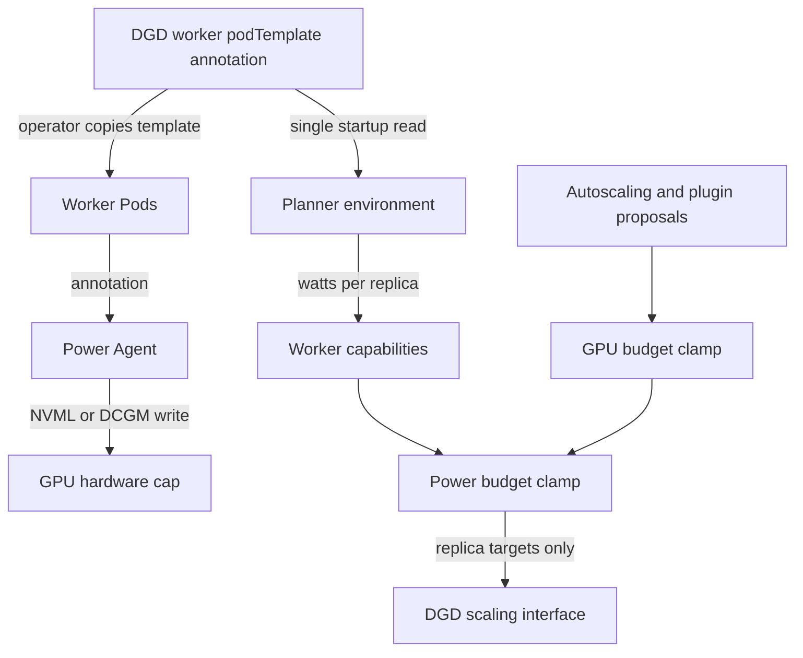

**Experimental.** The power-aware Planner adds a projected GPU power ceiling to
NVIDIA Dynamo autoscaling. This document describes the implementation at
[PR #12012 head `3d1d3e831254`](https://github.com/ai-dynamo/dynamo/commit/3d1d3e83125425cd8f521efdaab496051adce0b1),
which completes phase 1.

Phase 1 is a scale-up admission control system. It projects the maximum power of
requested GPU caps and rejects or reduces replica proposals that do not fit one
DynamoGraphDeployment (DGD) budget. It does not measure power, prove that a cap
reached the hardware, change a cap at runtime, or remediate a deployment that is
already over budget.

## Decision Summary

| Decision | Phase 1 behavior |
|---|---|
| Cap owner | The worker `podTemplate` annotation in the DGD |
| Cap enforcer | The node-local Power Agent |
| Planner access | Read the DGD once during startup; never write Pod annotations |
| Projection unit | Watts per replica: cap per GPU multiplied by GPUs per replica |
| Budget owner | `PlannerConfig.total_gpu_power_limit` for one DGD |
| Enforcement point | Final proposal boundary, after the GPU budget clamp |
| Runtime cap changes | Require a worker rollout and Planner restart |
| Safety model | Fail startup on missing or invalid inputs; conservatively hold scale-up during rollouts |
| Proven guarantee | Admitted scale-up targets fit the static projection model |
| Excluded guarantee | Actual hardware or facility power remains below the configured value |

## Goals and Non-Goals

Phase 1 has four goals:

- Keep cap authorship with the workload definition.
- Keep the Planner read-only with respect to Pods and GPU power controls.
- Apply the power ceiling to proposals from built-in and external plugins at one
  final boundary.
- Preserve partial proposals and in-progress operator rollouts.

Phase 1 does not:

- observe instantaneous GPU power or the effective hardware cap;
- coordinate budgets across DGDs, namespaces, clusters, or racks;
- lower replica counts solely because the current deployment is over budget;
- update caps without a worker rollout and Planner restart;
- enable power awareness in virtual, replay, or Global Planner environments; or
- change the historical GPU-budget interpretation for multinode workers.

## Ownership and Data Flow



The shared contract is
`dynamo.nvidia.com/gpu-power-limit`, expressed in watts per GPU:

```yaml
podTemplate:
  metadata:
    annotations:
      dynamo.nvidia.com/gpu-power-limit: "350"
```

The Planner and Power Agent define the annotation key independently. A contract
test compares the two constants and pins the literal value. The Planner reads
the annotation from the DGD rather than sweeping Pods. Its service account has
no `pods` rule for this feature. The no-mutation integration test asserts that
the flow does not instantiate a Pod client and that the former mutation helpers
are absent. The Planner still writes replica targets through the operator's DGD
scaling interfaces.

This ownership boundary prevents two controllers from competing over a cap. It
also creates the principal phase-1 limitation: the Planner knows the requested
cap, while the Power Agent knows whether and how the hardware accepted it.
There is no feedback path between them.

## Configuration Contract

Enable the feature with two Planner fields:

```json
{
  "environment": "kubernetes",
  "enable_power_awareness": true,
  "total_gpu_power_limit": 5200
}
```

| Field | Default | Validation | Meaning |
|---|---:|---|---|
| `enable_power_awareness` | `false` | Boolean | Enables cap resolution, projection metrics, rollout holds, and the final power clamp |
| `total_gpu_power_limit` | unset | Integer greater than or equal to 1; required when enabled | Projected GPU power ceiling for this DGD |
| `environment` | varies | Must be `kubernetes` when enabled | Selects the only connector that resolves DGD-owned caps |

Per-GPU caps are not Planner configuration fields. Every required worker role
must carry the annotation. See the
[power-aware budget example](https://github.com/ai-dynamo/dynamo/tree/3d1d3e83125425cd8f521efdaab496051adce0b1/examples/power-aware-budget)
for an asymmetric prefill/decode deployment.

## Startup Resolution

The Planner loads static power facts after the Kubernetes connector reports the
worker deployment ready:

1. `PlannerEnvironmentImpl.initialize()` validates the deployment and waits for
   worker readiness without waiting for the Planner itself.
2. The environment shares one DGD object between the initial GPU-count refresh
   and power-cap resolution.
3. `resolve_component_power_configs()` locates each required component.
4. `Service.get_gpu_power_limit_watts()` parses a positive integer from the
   annotation.
5. `Service.get_total_gpu_count()` multiplies the per-Pod GPU count by
   `multinode.nodeCount`.
6. The environment stores the requested cap and computed watts per replica in
   `ComponentState`.
7. The startup feasibility gate verifies that `min_endpoint` replicas of every
   required role fit the total power budget.
8. Worker capabilities copy the per-replica values into the proposal engine.

For role \(r\):

\[
G_r = \text{GPUs per Pod}_r \times \text{nodeCount}_r
\]

\[
W_r = \text{requested cap per GPU}_r \times G_r
\]

For a disaggregated target:

\[
W_{\text{projected}} = N_p W_p + N_d W_d
\]

Aggregate mode follows the existing Planner representation: the unique generic
`type: worker` component is resolved into the decode slot, with no synthetic
prefill component. Prefill-only and decode-only modes resolve only their
required role.

The following startup conditions fail with `DeploymentValidationError`:

- a required component cannot be resolved or resolves ambiguously;
- the annotation is absent, empty, non-integral, or non-positive;
- a GPU count or `nodeCount` is invalid or non-positive;
- the connector cannot resolve DGD power configuration; or
- the minimum replica footprint exceeds `total_gpu_power_limit`.

### Static Snapshot Semantics

`refresh()` does not re-read or compare power annotations or recompute watts per
replica from a changed GPU topology. The Planner uses the startup values for its
process lifetime. To change a cap, per-Pod GPU request, or `nodeCount`:

1. Update the DGD worker template.
2. Complete the worker rollout so new Pods inherit the annotation.
3. Restart the Planner after the rollout becomes ready.

Running the Planner through such a rollout does not update its cached
projection. The deployment-wide rollout hold prevents new scale-up while the
rollout is unstable, but scale-up can resume with the stale snapshot once the
rollout reports stable. Operational automation must therefore couple the worker
rollout with a Planner restart.

## Final Budget Boundary

The orchestrator adapter restores the proposal mask, applies budgets, and masks
ready-count echoes before producing `ScalingDecision`:

```text
merged proposal
  -> restore None for roles that equal their ready count
  -> GPU budget clamp
  -> rollout scale-up hold
  -> power budget clamp
  -> restore None for results that equal their ready count
  -> replica target
```

`None` means that the proposal has no opinion about that role. A missing role is
charged at its ready count for budget arithmetic but is never made adjustable.
This distinction matters because the plugin merge fills omitted roles from the
ready-count baseline.

The GPU clamp runs first and the power clamp runs second. The operations are not
commutative. The power ceiling can undo a replica increase introduced by the
GPU floor, so the ceiling wins when the two constraints conflict.

### Power Clamp Cases

| Input state | Result |
|---|---|
| Effective proposal fits | Preserve the proposal |
| Both roles are proposed and exceed the ceiling | Shrink both proportionally, respect `min_endpoint` where possible, and never exceed either proposed count |
| One role is proposed and exceeds the residual budget | Charge the peer at its ready count and shrink only the proposed role |
| The fixed peer leaves less than one role's minimum footprint | Hold a proposed scale-up at its current count instead of mutating the peer |
| One role grows while the other shrinks and the parallel peak exceeds the budget | Emit the scale-down leg first and defer the scale-up |
| Proportional shrinking creates an opposing rebalance with an excessive parallel peak | Apply the same scale-down-first staging |
| No role is adjustable while the baseline is over budget | Emit no power-driven remediation |

The parallel projection is:

\[
W_{\text{peak}} =
\max(N_{p,\text{ready}}, N_{p,\text{target}}) W_p +
\max(N_{d,\text{ready}}, N_{d,\text{target}}) W_d
\]

This peak protects opposing prefill/decode rebalances from assuming that a
scale-down completes before a simultaneous scale-up. It is not a model of
Kubernetes Pod surge, pending Pods, or terminating Pods.

### Rollout Hold and Proposal Mask

The Kubernetes connector returns ready prefill and decode counts plus one
deployment-wide stability flag. When either relevant component is unstable,
the environment sets both roles' settled `expected` count to `None`. The final
power boundary then:

- holds every proposed scale-up at the corresponding ready count;
- continues to allow scale-down;
- warns once for a continuous unstable interval; and
- maps every ready-equal result back to `None`.

The final mask prevents the Planner from writing a transient ready count over a
larger desired count that the operator is already rolling toward. For example,
a decode scale-down can be emitted without also echoing the rolling prefill
ready count.

## Guarantees and Failure Boundaries

| Statement | Status | Reason |
|---|---|---|
| A scale-up target admitted by the final boundary fits the static requested-cap model | Guaranteed within phase-1 inputs | The final power clamp is applied after proposal merging and the GPU clamp |
| A partial proposal does not mutate its unproposed peer | Guaranteed | The peer is charged as fixed usage and the proposal mask is restored |
| An opposing rebalance is not intentionally emitted with a modeled parallel peak above budget | Guaranteed within the ready/target model | Scale-up legs are deferred |
| Planner power awareness does not patch Pods | Guaranteed | Connector surface, RBAC, and integration test are read-only for Pods |
| Current replicas are automatically reduced when already over budget | Not guaranteed | The clamp acts on adjustable proposals and has no emergency reconciliation policy |
| GPU hardware enforces the DGD value exactly | Not guaranteed | The Power Agent can clamp to hardware limits or fail an actuator write |
| Actual draw stays below `total_gpu_power_limit` | Not guaranteed | The Planner observes neither effective caps nor measured draw |
| A shared rack or cluster stays below a facility budget | Not guaranteed | The budget applies to one DGD and has no global allocator |
| A cap update becomes visible without restarting the Planner | Not guaranteed | The cap snapshot is init-only |

The distinction between a requested cap and an effective cap is safety-critical.
If a requested value is below a GPU's minimum supported limit, the Power Agent
can apply a higher effective value. The Planner still projects with the lower
requested value. An actuator failure can also leave the hardware outside the
Planner's model. Treat `total_gpu_power_limit` as an admission policy, not a
facility protection mechanism.

## Observability

When Prometheus and power awareness are enabled and all required per-replica
values are present, the Planner publishes:

| Metric | Meaning |
|---|---|
| `dynamo_planner_power_budget_total_watts` | Configured DGD budget |
| `dynamo_planner_power_projected_watts` | Ready replica counts multiplied by cached watts per replica |
| `dynamo_planner_power_budget_utilization` | Projected watts divided by the budget |

The metrics contain requested-cap projections. They do not report measured
power, effective caps, actuator health, the proposed target, the modeled
parallel peak, or clamp reason. Clamp and rollout-hold details are logs.

## Test Evidence

The phase-1 test suite divides the contract into explicit layers:

| Layer | Evidence |
|---|---|
| DGD parsing | Disaggregated, aggregate, asymmetric, multinode, renamed, missing, duplicate, and invalid-component cases |
| Configuration | Default-off behavior, required budget, Kubernetes-only environment, and positive budget |
| Startup | State adoption, transient failure, missing connector support, minimum-footprint failure, restart adoption, and no runtime re-read |
| Pure budget logic | Fit, proportional shrink, partial proposals, fixed-peer residuals, no-upscale invariant, baseline over-budget behavior, and rebalance peaks |
| Adapter boundary | GPU-then-power ordering, plugin proposal coverage, rollout holds, proposal-mask preservation, and power-off compatibility |
| Metrics | Projection, asymmetric and multinode values, feature gates, invalid budget guards, and unresolved-cap suppression |
| Ownership | Annotation-key equality and a mocked end-to-end resolve/project/clamp path that instantiates no Pod client and exposes no mutation helpers |

These tests establish deterministic controller behavior. They do not constitute
a live GPU enforcement test or validate a facility-level power ceiling.

## Phase 2 Critique and Priorities

### 1. Close the Enforcement Feedback Gap

The first follow-up should expose the effective applied cap, cap generation,
actuator success, and data freshness to the admission controller. Instantaneous
power alone is insufficient: low draw during an idle interval does not prove
that a later workload spike will fit. Use effective caps for worst-case
admission and measured draw only for an optimization layer with explicit
headroom.

A closed-loop coefficient such as
`measured_watts / requested_cap_watts` is unsafe as the primary ceiling because
the ratio falls when utilization falls. It could admit replicas immediately
before load increases. Any adaptive model needs bounded coefficients, freshness
checks, a reserve, failure behavior, and a clear distinction between enforced
limit and observed consumption.

### 2. Make Cap Updates Transactional

A standalone watched ConfigMap would permit runtime changes but would split
authorship between the DGD and another object. Prefer a versioned contract:

- the DGD declares cap intent and a generation;
- workers report the generation and effective cap they enforce;
- the Planner admits scale-up only when every relevant replica reports the
  expected generation; and
- incomplete or stale generations fail closed.

This removes the manual restart window without restoring Planner-owned Pod
patching.

### 3. Define Over-Budget Reconciliation

Phase 1 deliberately leaves an over-budget baseline unchanged when no role is
adjustable. Phase 2 needs an explicit policy for budget decreases, effective-cap
increases, failed cap application, and external replica changes. The policy
must define which role scales down first, how `min_endpoint` and service-level
objectives interact with the ceiling, whether emergency action bypasses normal
cooldowns, and how recovery avoids oscillation.

### 4. Replace the Rollout Approximation

Expose per-role desired, ready, pending, unavailable, and terminating counts.
Include the operator's surge behavior in the peak model. This permits safe
scale-up of an unrelated stable role and accounts for transient Pods that the
current `max(ready, target)` model cannot see.

### 5. Introduce Budget Scope and Allocation

A per-DGD number cannot enforce a shared rack or cluster envelope. Define a
hierarchy such as facility to rack to cluster to namespace to DGD, with explicit
reservation, borrowing, and revocation semantics. Global Planner integration
should follow this allocation model rather than forwarding independent local
budgets.

### 6. Reconcile Multinode Resource Units

Power projection correctly multiplies GPUs per Pod by `nodeCount`, while the
existing GPU-budget path intentionally retains its per-Pod GPU count. Review
and name both units before extending the feature. A shared typed resource model
would prevent a multinode replica from satisfying the power budget and GPU
budget under different interpretations.

### 7. Add Decision-Level Telemetry

Add counters labeled by clamp or hold reason, gauges for target and peak watts,
cached cap generation and age, and effective-cap health. Keep labels bounded.
This evidence is needed before enabling automated remediation or adaptive
control.

### 8. Optimize Power Agent API Load Separately

A watch or informer-backed Pod cache can reduce the Power Agent's Kubernetes API
load. It is worthwhile for scale, but it does not close the Planner's
correctness gaps. Schedule it independently from effective-cap feedback and
budget reconciliation.

## Code Reference Map

All links below target the immutable phase-1 commit.

| Contract | Implementation | Tests |
|---|---|---|
| Configuration and cross-field validation | [`PlannerConfig`](https://github.com/ai-dynamo/dynamo/blob/3d1d3e83125425cd8f521efdaab496051adce0b1/components/src/dynamo/planner/config/planner_config.py#L617-L805) | [`test_planner_config.py`](https://github.com/ai-dynamo/dynamo/blob/3d1d3e83125425cd8f521efdaab496051adce0b1/components/src/dynamo/planner/tests/unit/test_planner_config.py#L54-L101) |
| Annotation, GPU topology, and role resolution | [`dgd_services.py`](https://github.com/ai-dynamo/dynamo/blob/3d1d3e83125425cd8f521efdaab496051adce0b1/components/src/dynamo/planner/monitoring/dgd_services.py#L199-L403) | [`test_dgd_power_annotation.py`](https://github.com/ai-dynamo/dynamo/blob/3d1d3e83125425cd8f521efdaab496051adce0b1/components/src/dynamo/planner/tests/unit/test_dgd_power_annotation.py#L75-L286) |
| Kubernetes read path | [`get_component_power_configs()`](https://github.com/ai-dynamo/dynamo/blob/3d1d3e83125425cd8f521efdaab496051adce0b1/components/src/dynamo/planner/connectors/kubernetes.py#L424-L454) | [`test_actuation_knobs.py`](https://github.com/ai-dynamo/dynamo/blob/3d1d3e83125425cd8f521efdaab496051adce0b1/components/src/dynamo/planner/tests/unit/test_actuation_knobs.py#L84-L144) |
| Startup snapshot and minimum footprint | [`PlannerEnvironmentImpl`](https://github.com/ai-dynamo/dynamo/blob/3d1d3e83125425cd8f521efdaab496051adce0b1/components/src/dynamo/planner/environment/base.py#L80-L420) | [`test_power_environment.py`](https://github.com/ai-dynamo/dynamo/blob/3d1d3e83125425cd8f521efdaab496051adce0b1/components/src/dynamo/planner/tests/unit/test_power_environment.py#L78-L172) |
| Cached deployment state | [`ComponentState`](https://github.com/ai-dynamo/dynamo/blob/3d1d3e83125425cd8f521efdaab496051adce0b1/components/src/dynamo/planner/environment/state.py#L19-L39) | [`test_power_environment.py`](https://github.com/ai-dynamo/dynamo/blob/3d1d3e83125425cd8f521efdaab496051adce0b1/components/src/dynamo/planner/tests/unit/test_power_environment.py#L78-L172) |
| Pure projection and clamp logic | [`budget.py`](https://github.com/ai-dynamo/dynamo/blob/3d1d3e83125425cd8f521efdaab496051adce0b1/components/src/dynamo/planner/core/budget.py#L213-L459) | [`test_power_budget.py`](https://github.com/ai-dynamo/dynamo/blob/3d1d3e83125425cd8f521efdaab496051adce0b1/components/src/dynamo/planner/tests/unit/test_power_budget.py#L42-L609) |
| Final proposal boundary and rollout hold | [`OrchestratorEngineAdapter`](https://github.com/ai-dynamo/dynamo/blob/3d1d3e83125425cd8f521efdaab496051adce0b1/components/src/dynamo/planner/plugins/orchestrator/engine_adapter.py#L914-L1270) | [`test_power_budget.py`](https://github.com/ai-dynamo/dynamo/blob/3d1d3e83125425cd8f521efdaab496051adce0b1/components/src/dynamo/planner/tests/unit/test_power_budget.py#L169-L609) |
| Projection metrics | [`base.py`](https://github.com/ai-dynamo/dynamo/blob/3d1d3e83125425cd8f521efdaab496051adce0b1/components/src/dynamo/planner/core/base.py#L405-L452) and [`planner_metrics.py`](https://github.com/ai-dynamo/dynamo/blob/3d1d3e83125425cd8f521efdaab496051adce0b1/components/src/dynamo/planner/monitoring/planner_metrics.py#L181-L197) | [`test_metric_publication.py`](https://github.com/ai-dynamo/dynamo/blob/3d1d3e83125425cd8f521efdaab496051adce0b1/components/src/dynamo/planner/tests/unit/test_metric_publication.py#L438-L550) |
| Shared annotation literal | [`dgd_services.py`](https://github.com/ai-dynamo/dynamo/blob/3d1d3e83125425cd8f521efdaab496051adce0b1/components/src/dynamo/planner/monitoring/dgd_services.py#L52) and [`power_agent.py`](https://github.com/ai-dynamo/dynamo/blob/3d1d3e83125425cd8f521efdaab496051adce0b1/deploy/power-agent/power_agent.py#L80) | [`test_power_annotation_contract.py`](https://github.com/ai-dynamo/dynamo/blob/3d1d3e83125425cd8f521efdaab496051adce0b1/components/src/dynamo/planner/tests/unit/test_power_annotation_contract.py#L43-L60) |
| Effective-cap and actuator-failure boundary | [`power_agent.py`](https://github.com/ai-dynamo/dynamo/blob/3d1d3e83125425cd8f521efdaab496051adce0b1/deploy/power-agent/power_agent.py#L456-L519) | [`test_apply_cap.py`](https://github.com/ai-dynamo/dynamo/blob/3d1d3e83125425cd8f521efdaab496051adce0b1/deploy/power-agent/tests/test_apply_cap.py#L119-L225) |
| No Pod mutation | [`planner.yaml` RBAC](https://github.com/ai-dynamo/dynamo/blob/3d1d3e83125425cd8f521efdaab496051adce0b1/deploy/helm/charts/platform/components/operator/templates/planner.yaml#L35-L94) | [`test_power_no_mutation.py`](https://github.com/ai-dynamo/dynamo/blob/3d1d3e83125425cd8f521efdaab496051adce0b1/components/src/dynamo/planner/tests/integration/test_power_no_mutation.py#L114-L157) |
