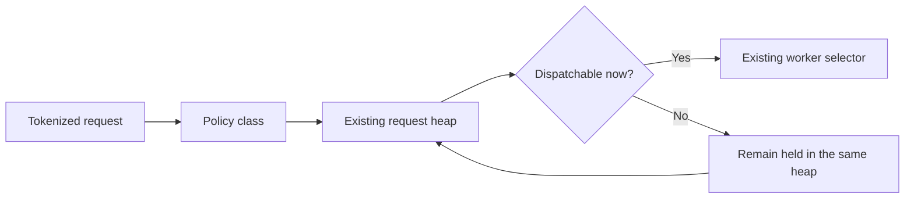
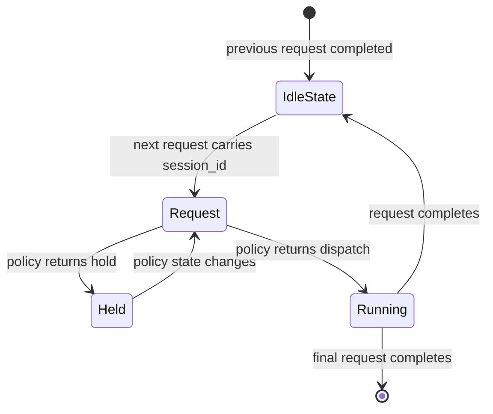

The NVIDIA Dynamo KV router makes dispatch decisions on queued requests. A session-aware policy can retain private state across turns, but each dispatch decision still resolves to one active request.

## Request-Level Mechanism

The policy queue keeps one priority heap per policy class. Deficit Round Robin (DRR) chooses a class, while the class heap chooses its highest-priority dispatchable request.

The dispatch predicate evaluates current worker eligibility and load. When a class head is blocked, the queue may dispatch the next highest-priority request in that class. The blocked request remains in its original heap with its original priority and queue accounting.

This fallback preserves the existing fast path:

- When no class head is blocked, the existing head-only heap and DRR path runs without heap mutation or allocation.
- A blocked head triggers a scan only until the first dispatchable request in that class is exposed.
- A class with no dispatchable request retains its DRR deficit.
- Queue depth and token counters continue to include held requests.

The queue does not create a second admission layer or a session queue.

## Session-Stateful Policies

A sequential agent session has at most one active Dynamo request. The request represents that session while it is queued or running. A policy-specific session table is needed only to retain information across the gap between requests.

Parallel branches use distinct session IDs. A parent session ID can preserve the relationship without introducing concurrent requests under one scheduling identity.

## Future AgentAware Policy

AgentAware routing is not implemented by this mechanism. A future implementation can keep its algorithm in a private module and use the request-level queue through four lifecycle points:

| Lifecycle point | Policy responsibility | Existing router effect |
| --- | --- | --- |
| Request arrival | Read session state and choose hold, priority, and an optional worker pin | Populate the queued request |
| Dispatch check | Decide whether the active request can run now | Return through the queue's dispatch predicate |
| Request completion | Reconcile generated tokens and retain between-turn state | Update the private session table |
| Final completion | Release the session record | Remove private policy state |

Admission failures must roll back provisional session changes. Successful placement must commit only after worker selection and scheduler booking succeed.

The initial algorithm may follow the [ThunderAgent paper](https://arxiv.org/abs/2602.13692) and Dynamo's [ThunderAgent Program Scheduler](../agents/thunderagent-router.md). Pressure thresholds, working-set accounting, pause and resume selection, decay, timeout behavior, and backend capacity inputs belong to that implementation, not to the generic queue.

No AgentAware configuration is exposed until an algorithm implements this contract.
