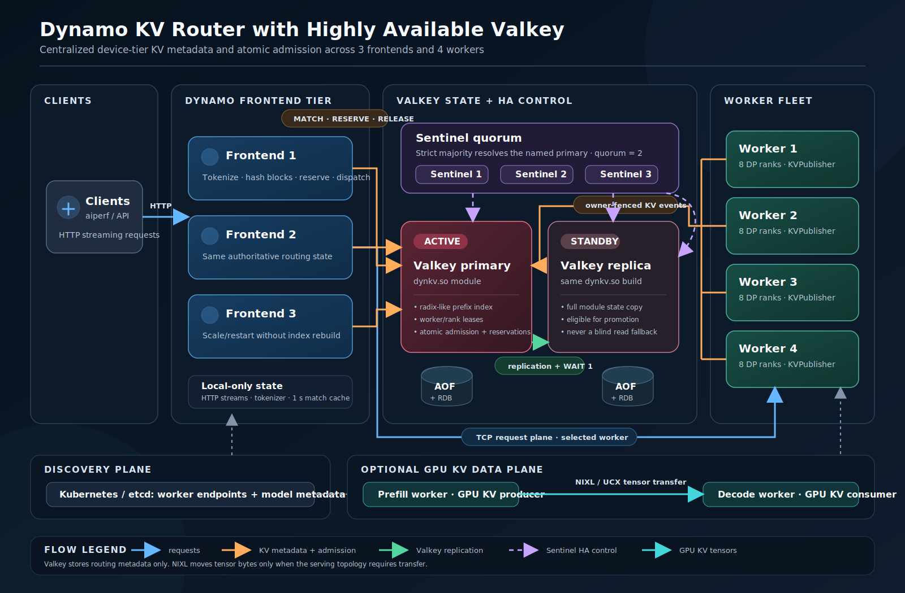
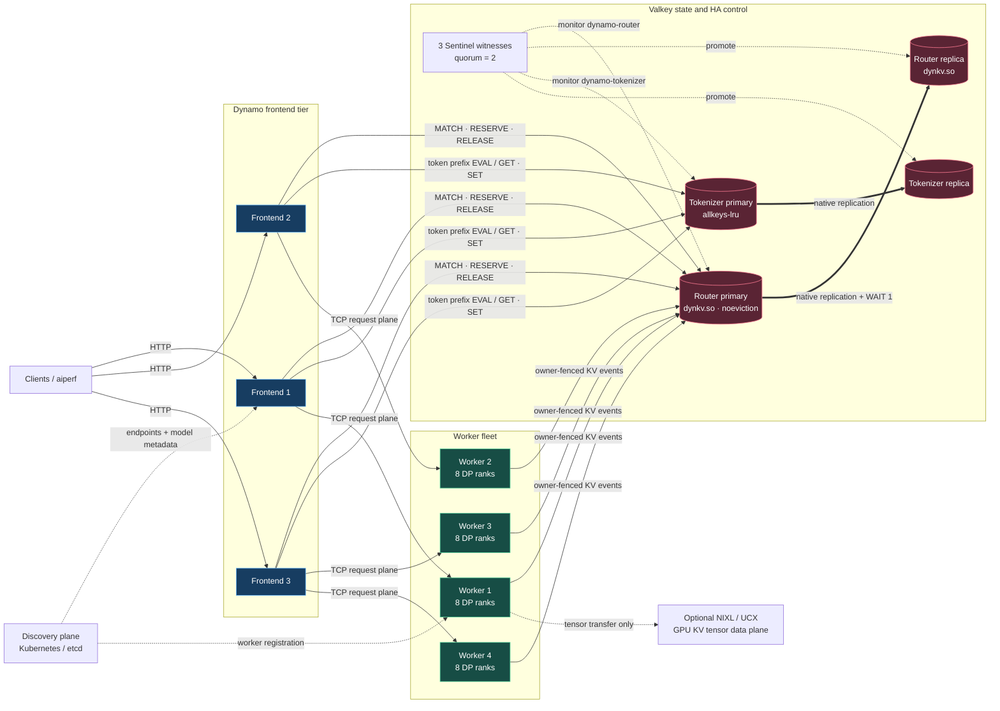
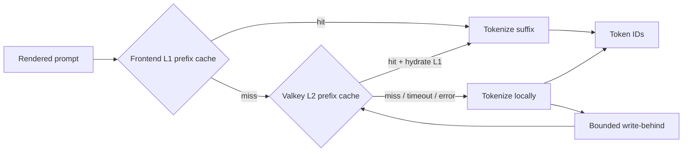

**Experimental.** This design adds a Valkey-backed device-tier KV index and
admission service to NVIDIA Dynamo. It is validated with host-local mock
workers. Validate Kubernetes and real GPU traffic separately before using the
measured results as production capacity guidance.

## Purpose

The existing KV router design keeps the prefix index and parts of request-load
state in each frontend. That is fast, but independent frontend replicas can
observe different event timing and cannot make one authoritative admission
decision. The Valkey design moves shared device-tier routing state into a
loadable Valkey module.

Every frontend and worker accesses the same KV ownership, worker/rank
lifecycle, and active-reservation state. A Sentinel-backed failover path lets a
replica take over when the current Valkey primary fails. See
[Router Design](router-design.md) for the routing cost model and event types;
this page describes where the state lives and how clients recover.

## Goals and Non-Goals

### Goals

- Store device-tier KV prefix ownership, worker/rank lifecycle, and admission
  reservations in one replicated Valkey-backed index.
- Let multiple Dynamo frontends query that index and atomically reserve a
  selected worker/rank.
- Let workers publish KV events directly when the shared JSON configuration
  enables `worker_events`.
- Preserve module state through AOF, RDB, native replication, and promotion.
- Recover a failed primary through Sentinel quorum without returning routing
  failures for admitted HTTP requests.
- Store routing metadata only. Do not put model weights or GPU KV tensors in
  Valkey.

### Non-Goals

- Replace Dynamo discovery. Kubernetes or another discovery provider still
  supplies worker endpoints and model metadata.
- Migrate in-flight HTTP streams when a frontend fails.
- Transfer GPU tensors through Valkey. NIXL remains the tensor-transfer data
  plane for disaggregated serving.
- Claim zero recovery time. Election and client reconnection take a measurable
  interval.
- Guarantee synchronous durability after one of only two data nodes is gone.
  The two-node availability policy makes a bounded degraded-write trade-off.

## Architecture





The routing primary and replica run the same `dynkv.so` module. The module owns
the central index and applies state transitions. A frontend queries or reserves
against the elected routing primary rather than rebuilding a local
authoritative device-tier tree. A worker writes normalized device-tier events
to that primary, and Valkey replication transfers the resulting module state
to the replica.

Run reconstructible tokenizer entries in a separate Valkey primary/replica
group. The same three Sentinels can monitor both groups under distinct names.
This split lets the tokenizer group use `allkeys-lru` while the routing group
uses `noeviction`, so tokenizer memory pressure cannot evict authoritative
routing metadata.

### Component Responsibilities

| Component | Responsibilities | Does not own |
| --- | --- | --- |
| `dynkv.so` | Prefix index, worker/rank membership, leases, event generations, admissions, reservations, lifecycle GC | GPU tensors, model metadata, endpoint discovery |
| Valkey data nodes | AOF/RDB persistence, replication, module execution | Leader election |
| Sentinel witnesses | Primary failure detection and promotion election | Dynamo routing policy or module state |
| Dynamo frontend | Tokenization, routing-cost inputs, module query/reservation, HTTP stream ownership, worker dispatch | The authoritative device-tier index |
| Dynamo worker | KV event normalization, owner-fenced publication, worker/rank registration, lease renewal | Cross-worker prefix index ownership |
| Discovery provider | Worker endpoints and model metadata | High-rate KV ownership or admission |
| NIXL | GPU KV tensor transfer between compatible workers | Routing metadata or reservation state |

## Persistent State Model

Every participant in one routing pool uses the same
`DYN_ROUTER_VALKEY_INDEX_SCOPE`. The module stores these scoped records:

| State | Producer | Consumer | Correctness property |
| --- | --- | --- | --- |
| Prefix radix-like index and block ownership | Worker KV events | Frontend match/query | Atomic module transition and replication |
| Worker ID, DP ranks, owner nonce, and lease | Worker startup and heartbeat | Frontend admission and lifecycle GC | One live process incarnation owns a worker ID |
| Per-rank and worker mutation generation | Module | Worker recovery | A stale tree dump cannot overwrite newer events |
| Active reservations and expiry | Frontend selection and request completion | All frontends | One admission decision is visible across replicas |
| Lifecycle/GC progress | Module | Worker successor registration | A late process cannot recreate retired state |

The module stores block hashes, ownership, event ordering, and reservations.
It does not store prompt text, model weights, or KV tensor bytes. Valkey AOF,
RDB snapshots, module replication, and full replica synchronization preserve
this data. Owner, admission, and GC paths replicate deterministic internal
records so a replica or AOF replay does not decide expiry from its own clock.

## Routing and Admission Flow

### Worker Registration

Before advertising a worker through discovery, the worker registers its
complete data-parallel rank set. The module associates the registration with a
nonzero random owner nonce and lease duration. A repeat is idempotent only for
the same live owner and the same rank set.

The worker renews its lease and attempts an owner-conditional unregister on
graceful shutdown. A successor with the same discovery worker ID cannot publish
or alter state until the module has fenced and cleaned the old owner.

### Worker KV Events

With `worker_events: true`, the worker's `KvEventPublisher` normalizes
engine events, preserves per-worker ordering, batches compatible events, and
writes them through `DYNKV.APPLY_OWNED`. The module validates the owner nonce
before changing prefix ownership.

Direct ingress is bounded rather than unbounded. Its default capacity is
131,072 events, enough for two 4,096-concurrency waves of 1,024-token requests
at a 16-token block size. Set `DYN_ROUTER_VALKEY_EVENT_INPUT_BUFFER_SIZE` for
a different bounded burst budget. If sustained overload exceeds that capacity,
the publisher fences the worker metadata instead of silently dropping an event.

The direct Valkey publisher has no legacy KV relay in its critical path. The
generic runtime event transport remains available for unrelated runtime events
and compatibility consumers.

### Frontend Selection

For each request, the frontend hashes the prompt into KV blocks, requests
prefix matches from the current primary, combines the result with normal
routing-cost inputs, and reserves the selected worker/rank through the module.
The reservation makes active load visible to every frontend before dispatch.

`DYNKV.MATCH_PRIMARY` rejects a connection that still targets a demoted primary.
`DYNKV.SELECT_RESERVE`, `DYNKV.ADMIT_APPLY`, and `DYNKV.RELEASE` provide atomic
admission transitions. A short frontend match cache can avoid repeated prefix
queries, but a stale cache can only lose a cache hit, not make a request
incorrect.

### Recovery Tree Dumps

Worker recovery reads a persisted rank generation before fetching a tree dump,
then calls `DYNKV.REPLACE_RANK_IF_GENERATION`. The module replaces the rank
only when the generation still matches. If an event committed while the dump
was fetched, the module returns a stale-generation result and the worker retries
from a fresh generation. This prevents an old dump from deleting new ownership.

## High-Availability Protocol

### Normal Operation

1. Configure both data-node bootstrap URLs and three Sentinel URLs on every
   frontend and worker.
2. Ask each Sentinel for the named primary and require a strict majority to
   agree on one endpoint.
3. Validate that endpoint with `ROLE` before accepting it as the route.
4. Send reads and mutations through the route generation. The client
   invalidates pools and cached route state when Sentinel results change.
5. For normal two-node replication, issue `WAIT 1` on the same persistent
   connection as the module mutation.

Static URLs bootstrap the client; Sentinel quorum plus `ROLE` determines the
active primary. The client never sends a blind write or reads routing state
from a replica fallback.

### Primary Failure

When the primary exits:

1. Sentinels mark it down and a majority elects the replica.
2. The client retries within its bounded failure window, resolves the Sentinel
   route, validates `ROLE=master`, advances its route generation, and rebuilds
   its connection pool.
3. Frontends retry the affected metadata operation against the promoted primary.
   HTTP requests remain in the configured request-timeout window.
4. The new primary accepts writes according to the selected durability policy.

The host-local fault test killed the primary during c4096 traffic. Three
Sentinels unanimously selected the replica in 1.833 seconds; all 16,384
requests completed without errors or cancellations. This is a measured target
for the tested topology, not a promise of instantaneous recovery.

### Strict Durability and Two-Node Availability

Two data nodes require an explicit post-failure policy:

| Policy | Configuration | Behavior after promotion | Trade-off |
| --- | --- | --- | --- |
| Strict durability | Require replica acknowledgement and Valkey's `min-replicas-to-write` gate | Mutations pause until a replica is available | No acknowledged write has only one data copy |
| Two-node availability | `DYN_ROUTER_VALKEY_ALLOW_DEGRADED_WRITES=true`, three Sentinel witnesses, no server-side minimum-replica write gate | After fresh quorum and `ROLE` validation, the client may accept `WAIT 0` | Writes have one copy until the failed node rejoins |

Never combine the availability policy with `min-replicas-to-write 1`. Valkey
would reject a mutation before the client can make the bounded degraded-write
decision. A second data-node failure before resynchronization can lose metadata
written during the degraded interval. Use three data copies when both
synchronous durability and uninterrupted writes are required.

## Valkey Configuration

Pass one JSON object to each frontend. The top-level Sentinel object discovers
the routing primary. `tokenizer_cache.sentinel_master_name` reuses those three
witnesses to discover a separate tokenizer-cache primary:

```bash
python -m dynamo.frontend \
  --router-mode kv \
  --router-valkey-config '{
    "allow_insecure_plaintext": true,
    "urls": [
      "valkey://router-primary:6379",
      "valkey://router-replica:6379"
    ],
    "index_scope": "deployment-routing-scope",
    "connection_pool_size": 16,
    "required_replica_acks": 1,
    "authoritative_admission": true,
    "sentinel": {
      "urls": [
        "valkey://sentinel-0:26379",
        "valkey://sentinel-1:26379",
        "valkey://sentinel-2:26379"
      ],
      "master_name": "dynamo-router",
      "quorum": 2
    },
    "worker_events": true,
    "tokenizer_cache": {
      "enabled": true,
      "sentinel_master_name": "dynamo-tokenizer",
      "scope": "deployment-tenant-scope",
      "ttl_seconds": 3600,
      "timeout_ms": 20,
      "connection_pool_size": 8,
      "max_pending_writes": 128,
      "l1_bytes": 67108864
    }
  }'
```

The JSON object accepts only documented fields and rejects unknown fields,
wrong types, duplicate Sentinel endpoints, and a quorum that is not a strict
majority. When the JSON object is present, its values and defaults replace all
legacy `--router-valkey-*` values. `DYN_ROUTER_VALKEY_CONFIG` accepts the same
JSON string.

The frontend passes this string unchanged to the Rust `RouterConfig` binding.
That boundary parses one typed contract and derives both `KvRouterConfig` and
`TokenizerCacheConfig`; Python does not mirror the Sentinel or tokenizer
schema. Legacy tokenizer environment variables are translated into this same
JSON contract before entering Rust.

> [!CAUTION]
> Dynamo's current Valkey transport is plaintext and does not accept ACL
> credentials. The configuration is rejected unless
> `allow_insecure_plaintext` is explicitly `true`. Use that opt-in only when
> router data, tokenizer data, and Sentinel witnesses are confined to a
> separate tenant-isolated trusted network with Kubernetes NetworkPolicy or
> equivalent firewall controls. Deploy a separate Valkey topology for every
> security tenant. TLS and authenticated ACL connections are required before
> exposing these endpoints to a shared or untrusted network.

Pass that same JSON string to workers. They ignore the tokenizer-only fields
and consume the validated routing, Sentinel, lease, and GC settings:

```bash
export DYN_ROUTER_VALKEY_CONFIG="$(<router-valkey-config.json)"
```

`worker_events` makes direct Valkey publication authoritative for the device
tier. `DYN_EVENT_PLANE` remains limited to the generic `nats` and `zmq`
transports and is independent of the Valkey routing-state path.

The top-level `connection_pool_size` controls frontend MATCH readers only.
Each frontend also has one general writer plus four admission-select and four
admission-lifecycle lanes. Workers do not inherit the frontend value: each
worker has one lifecycle writer, one generation reader, and four direct-event
lanes. These role-specific pools prevent frontend tuning from multiplying
unused admission sockets across workers. The maximum active router-data
connection budget is therefore approximately:

```text
frontends * (connection_pool_size + 9) + workers * 6
```

For 100 frontends, 200 workers, and `connection_pool_size=64`, that is 8,500
connections before Sentinel, tokenizer-cache, administrative, and transient
connections. Raise Valkey `maxclients` above the complete deployment budget
and monitor `connected_clients`; the stock 10,000-client ceiling leaves only
1,500 connections of headroom for that topology.

> [!WARNING]
> Enable degraded writes only after deploying three independent Sentinel
> witnesses. One reachable Sentinel cannot prove that an endpoint is current.

## Shared Tokenizer Prefix Cache

**Experimental.** Frontends can use Valkey as a shared level-two (L2)
tokenization cache while retaining a bounded in-process level-one (L1) cache.
This cache uses a read-only `EVAL` script that calls `GET` in reverse prefix
order and normal `SET` commands; it does not require the `dynkv.so` module.

The async preprocessing path checks L1 before it contacts Valkey. On an L1
miss, it sends at most 1,024 candidate prefix keys in one `EVAL`. The script
stops at the deepest existing key, so only one value crosses the network. A
valid L2 hit hydrates L1 and tokenizes only the suffix. A miss or error tokenizes
locally, returns the result, and writes the deepest safe prefix through a
bounded background task. A timeout, malformed value, full write queue, or
unavailable Valkey server cannot fail the request.



For a fixed endpoint without Sentinel, use a direct URL in the JSON object:

```bash
python -m dynamo.frontend \
  --router-valkey-config '{
    "allow_insecure_plaintext": true,
    "urls": ["valkey://router-primary:6379"],
    "tokenizer_cache": {
      "url": "valkey://tokenizer-cache:6379",
      "scope": "deployment-tenant-scope"
    }
  }'
```

The configured scope and tokenizer deployment checksum namespace every key.
Use a distinct `tokenizer_cache.scope` within each already isolated deployment.
Scopes prevent accidental key collisions; they are not an authorization
boundary and do not replace the tenant-isolated topology required above. Each
key contains a BLAKE3 digest of the rendered prompt prefix. Values contain
versioned binary token IDs and a BLAKE3 integrity checksum. Dynamo does not send
raw prompt text to Valkey. Treat token IDs as sensitive inference data because
they can still reveal prompt content.

Only atomic Hugging Face special tokens form cache boundaries. Splitting at
those boundaries preserves the tokenizer result when Dynamo concatenates a
cached prefix with freshly encoded suffix tokens. Tokenizers without registered
special-token boundaries bypass the shared cache. The current tiktoken path
therefore remains local-only.

One cache value is limited to 262,144 token IDs. Dynamo bypasses prefix caching
when a prompt contains more than 16,384 special-token boundaries. For a fixed
endpoint, each Valkey data-command attempt and its connection-pool wait share
the configured timeout. In Sentinel mode, witness queries and `ROLE`
validation use separate bounded 500 ms resolver stages; discovery returns as
soon as a strict majority agrees instead of waiting for a stalled witness.
Each data attempt then receives the configured timeout. A failed attempt
invalidates the cached primary, refreshes it through Sentinel, and retries
once. The complete failover path can therefore exceed one data timeout, but
every network stage remains bounded. Prometheus exposes L1 hits and misses plus
L2 hits, misses, errors, write drops, write errors, and lookup latency.

Use a separate Valkey deployment or reserved memory budget for tokenization
entries. Tokenization data is reconstructible, so it does not need synchronous
`WAIT` acknowledgement or AOF persistence. Sharing an eviction pool with the
authoritative routing index can let token traffic displace routing state.
For Sentinel discovery, the tokenizer client requires a strict witness
majority, validates the selected endpoint with `ROLE`, and invalidates pooled
connections after an input/output or primary-role error. Concurrent cache
lookups share one discovery attempt. Waiting for that attempt and resolving a
validated primary share a two-second deadline; a failed result is reused for
500 ms so an unavailable Sentinel group cannot cause a retry storm. Cache
failure remains fail-open and falls back to local tokenization.
Both direct and Sentinel endpoints remain plaintext and unauthenticated; place
them on a trusted network boundary until authenticated and TLS endpoints are
added.

### Tokenizer Cache Validation

The deterministic growing-prefix test creates a cold frontend cache for each of
32 turns. The final prompt is 263,926 bytes. Full re-tokenization processes
5,751,450 cumulative input bytes; L1 plus shared L2 processes 264,474 bytes, a
95.40% reduction in tokenizer input work. A separate 188,457-byte TinyLlama
Hugging Face test verifies that cached and uncached token IDs match exactly. The
live-wire test repeats cross-frontend hydration against a real Valkey server.
These tests validate work avoided and correctness; they are not end-to-end RPS
or Time To First Token (TTFT) measurements.

The failover end-to-end test starts three frontends, four mock workers, and two
independent primary/replica groups. One three-process Sentinel group monitors
both groups under distinct names. The test promotes the routing replica and
then the tokenizer-cache replica, verifies routing-index convergence, and
requires a cross-frontend L2 tokenizer-cache hit after the second promotion.

Two earlier host-local campaigns provide supporting workload evidence, but are
not current-branch performance claims:

- The [growing agent-history tokenizer A/B](https://github.com/ai-dynamo/dynamo/blob/main/bench/results/tokenizer-cache-agentic-20260706-160651/campaign/REPORT.md)
  found shared L2 useful when sessions moved among three frontends: aggregate
  effective throughput improved 15.23%, with the largest gains at four and
  eight messages. Sticky sessions were 2.85% slower because their local L1
  already held the useful prefix. The recorded checkout was dirty.
- The [Weka-derived A/B](https://github.com/ai-dynamo/dynamo/blob/main/bench/results/valkey-config-weka-ab-20260707/campaign/20260707T153807Z/REPORT.md)
  completed 91,392 measured requests without errors and measured throughput
  within 1.17% of the in-process control. That campaign did not capture its Git
  revision, so use it as functional workload evidence rather than an exact-tip
  speed claim. A separate [Weka-derived HA smoke run](https://github.com/ai-dynamo/dynamo/blob/main/bench/results/valkey-config-weka-20260707/campaign/20260707T100019Z/REPORT.md)
  verified one shared JSON configuration across three frontends, four mock
  workers, two Valkey primary/replica groups, and three shared Sentinels.

## Frontend State Boundary

Valkey removes frontend-local authority for the device-tier index and
cross-frontend admission state. A frontend can therefore restart or scale
without rebuilding that state from every worker.

The frontend is not completely stateless. It still owns active HTTP streams,
request preprocessing, its discovery view, local request handles, and bounded
L1 tokenization and match caches. The L1 caches are disposable optimizations;
Valkey lets a replacement frontend hydrate tokenized prefixes without affecting
request correctness. A frontend failure does not migrate its in-flight streams.
Host and disk tiers retain their existing event-path behavior unless separately
centralized.

## NIXL Boundary

Valkey and NIXL solve separate problems:

| Plane | Question answered | Data carried |
| --- | --- | --- |
| Valkey with `dynkv.so` | Which worker/rank owns a reusable prefix? Can it accept the request? | Block hashes, ownership, leases, generations, reservations |
| NIXL with UCX | How does a selected worker receive or expose reusable KV? | GPU KV tensor bytes |

The aggregated mocker benchmark exercises Valkey metadata and admission only.
A real disaggregated GPU experiment must place prefill and decode workers on
separate nodes, configure NIXL/UCX, and verify actual transport selection.
Valkey does not replace NIXL, and NIXL does not make a Valkey admission decision.

## Current Source-Bound Measurements

The policy-matched comparison ran at revision
`65a5cf262f173a0e9b6055ef11a292f88a1ebf4f` with identical release binaries,
generated inputs, fixed per-role CPU sets, and three fresh topologies per arm.
Each accepted sample completed 16,384 measured requests at concurrency 4,096
after 4,096 warmup requests. The workload used 200 logical mock workers, TCP,
requested ISL/OSL 1,024/1,024, and an unlimited closed-loop request rate.

| Frontends | In-process immediate | Valkey HA | Valkey RPS change | Peak primary clients |
| ---: | ---: | ---: | ---: | ---: |
| 1 | 254.60 RPS | 254.38 RPS | -0.08% | 1,209 / 10,000 |
| 10 | 250.83 RPS | 249.37 RPS | -0.58% | 1,219 / 10,000 |
| 100 | 228.94 RPS | 245.49 RPS | **+7.23%** | 2,001 / 10,000 |

At 100 frontends, Valkey improved output throughput by 7.24%, p50/p95 TTFT
by 7.53%/9.86%, p50/p95 request latency by 8.13%/14.21%, and p50/p95 ITL by
10.38%/61.56%. Average ISL was 1,024.001 tokens in both arms; average OSL was
1,049.594 for in-process and 1,049.675 for Valkey. Valkey retained more
throughput as fan-out rose: its median RPS fell 3.50% from one to 100
frontends, versus 10.08% for the in-process control.

This is a fixed-host fan-out comparison, not linear horizontal scaling. All
frontends shared CPUs 2-9, workers shared CPUs 10-19, Valkey used CPUs 0-1,
and aiperf used CPUs 20-23. Default background RDB saves and AOF rewrites
remained enabled, so their durability cost is present in the latency tails.
The compact [evidence, plot, hashes, and reproduction command](https://github.com/ai-dynamo/dynamo/blob/main/bench/results/valkey-exact-tip-ab-20260709/README.md)
are checked in; the raw record exports and logs are not.

All 18 samples completed without request or validation errors. Every one of
the nine Valkey samples registered all 200 workers, ended with no active
admissions, retained an online replica, and reported no teardown integrity
failures. All three campaigns record a clean checkout and release extension
bound to the same revision, plus matching source, binary, input, and harness
hashes.

An earlier excluded 100-frontend attempt exposed registration-time contention:
several workers exhausted the five-second primary-read timeout while reading
their registration generation. Request-path reads retain that fail-fast budget,
but the replay-safe startup generation read now has a bounded 30-second retry
budget. The corrected campaign registered 200/200 workers in all nine Valkey
samples across the three frontend counts.

## Historical Pre-Hardening Measurements

These results are historical evidence, not current-branch performance. The
source run recorded dirty revision `4f63c9686b39e5777df67f075bb592749272b9b2`
and module SHA-256
`9b2b5e1b04d187b0a1b8d9aaa8d43e05208b3ac64eb18afb09302ab463e40308`.
It predates the later Sentinel, tokenizer, lifecycle, admission, and safety
fixes. The checked-in
[sanitized provenance](https://github.com/ai-dynamo/dynamo/blob/main/bench/results/valkey-ha-ab-historical-20260701/provenance.json)
retains the exact binary hashes, validation state, topology, and medians.

That host-local CPU-isolated benchmark used three frontends, four worker
processes with eight data-parallel ranks each, two Valkey data nodes, three
Sentinel witnesses, TCP request transport, 4,096 concurrent requests, 16,384
measured requests, and input/output sequence lengths of 1,024 tokens. Each
arm ran three times with a fresh topology.

| Metric, median of three successful runs | In-process immediate control | Valkey HA | Change |
| --- | ---: | ---: | ---: |
| Request throughput | 527.99 RPS | 568.52 RPS | +7.68% |
| Output throughput | 554,221 tokens/s | 596,715 tokens/s | +7.67% |
| p50 request latency | 6,125 ms | 5,188 ms | -15.29% |
| p95 request latency | 8,833 ms | 8,700 ms | -1.51% |
| p50 TTFT | 4,901 ms | 3,702 ms | -24.47% |
| p95 TTFT | 7,920 ms | 6,748 ms | -14.79% |
| p50 ITL | 0.556 ms | 0.531 ms | -4.49% |
| p95 ITL | 4.703 ms | 3.897 ms | -17.15% |

The immediate in-process arm is policy-matched because both it and Valkey use
immediate authoritative admission. Against the standard synchronized
in-process arm, Valkey was 568.52 RPS versus 549.04 RPS, a 3.55% increase.

The primary-kill run completed 16,384 of 16,384 requests without errors or
cancellations at 409.32 RPS. That throughput includes promotion, so it is a
resilience result rather than a healthy-path performance comparison.

> [!IMPORTANT]
> These numbers characterize mock-worker routing overhead on the tested host.
> They do not measure model compute, GPU KV transfer, real NIXL throughput, or
> Kubernetes network behavior. Re-run for a different CPU layout, model, block
> size, request distribution, or Valkey configuration. Rerun from a clean
> current commit before describing the table as current implementation
> performance.

The [Valkey router benchmark harness](https://github.com/ai-dynamo/dynamo/blob/main/benchmarks/router/valkey_router_aiperf.py)
records source and binary hashes, topology, workload, CPU affinity, and
validation gates for each run.

## Operational Gates

Before accepting a deployment or benchmark sample, verify all of the following:

1. Every data node loads the same `dynkv.so` build.
2. Both replica links are up, and routing mutations satisfy the configured
   `WAIT` policy before a fault.
3. Three Sentinels agree on both configured primaries under distinct names.
4. Every expected worker/rank completes leased registration before production
   traffic reaches a frontend.
5. Live routing and tokenizer-cache failure tests confirm promotion and
   `ROLE=master` on each new primary. Routing requests must complete without
   HTTP errors or residual admissions, and a fresh frontend must record an L2
   tokenizer-cache hit after tokenizer promotion.
6. Publisher logs contain no owner, integrity-fence, queue-overflow, or
   unproved-unregister failure markers.
7. Benchmark arms use the same release extension, Valkey module, CPU affinity,
   request corpus, and fresh topology.

## Deployment and Upgrade Guidance

Run data nodes on separate failure domains. Persist AOF data independently,
load the same module on every eligible primary and replica, and retain data
volumes across a process restart. Persist Sentinel configuration and spread the
three witnesses independently from data nodes where possible.

Upgrade replicas before the primary. Wait for each replica to resynchronize
before upgrading the primary. Do not run a new module's GC or promote an
upgraded replica while an older module remains eligible for promotion; an old
module might not understand a newer replicated state encoding.

For module validation and host-local reproduction commands, see the
[Valkey router handoff](https://github.com/ai-dynamo/dynamo/blob/main/benchmarks/router/VALKEY_ROUTER_HANDOFF.md).

## Limitations and Follow-Up Validation

- The two-data-node degraded-write policy favors request continuity over
  redundant acknowledgement after promotion. Add a third data copy for both.
- Sentinel election speed depends on failure-detection and network settings.
  Use measured recovery time in timeout and capacity planning.
- The direct event buffer handles finite failover bursts but remains bounded.
  Size it from peak per-worker event rate and recovery interval, then validate
  overload behavior.
- The documented comparison uses mock workers. Validate real vLLM, SGLang, or
  TensorRT-LLM traffic before making backend capacity claims.
- NIXL and RDMA/GPU-direct selection remain a separate real-GPU validation gate
  for disaggregated serving.
- The tokenizer-cache Valkey client does not yet support TLS, authentication,
  or tiktoken special-token extraction.
