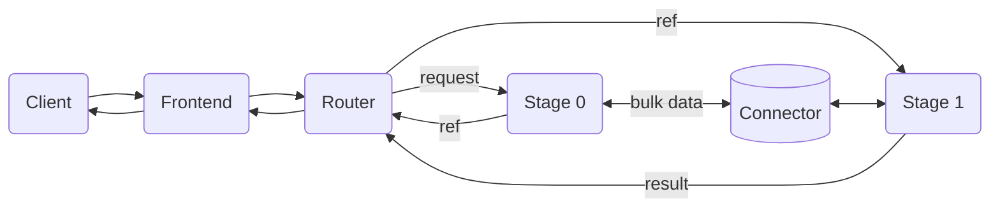

Disaggregated serving is an advanced deployment mode of the vLLM-Omni backend (`dynamo.vllm.omni`), used for models whose pipeline has multiple stages (e.g., AR + Diffusion). Each stage runs as an independent process on its own GPU, enabling independent scaling, GPU isolation, and multi-worker replicas per stage. It uses the omni entrypoint with the `--stage-id` and `--omni-router` flags described below. See the [Diffusion Overview](../features/diffusion/README.md) for installation and shared configuration.

## Architecture

A lightweight router coordinates the stages, acting as a **pure message broker** — it never inspects or transforms inter-stage data.



**How it works:**

- The router sends the initial request to Stage 0 and receives back a lightweight connector reference (pointer to the output in shared memory).
- The router forwards that reference — unchanged — to the next stage. It never reads the bulk data.
- Each stage fetches its inputs from the connector, runs any model-specific processor (e.g., `ar2diffusion`, `thinker2talker`), then runs its engine.
- Connector references accumulate as the pipeline progresses, so any stage can access outputs from all previous stages.
- The final stage's result goes back to the router for formatting and response.

## Quick Start: GLM-Image (2-Stage, 2 GPUs)

GLM-Image is a 2-stage text-to-image model with an AR stage (generates prior token IDs) and a DiT stage (diffusion denoising + VAE decode). The built-in vLLM-Omni stage config already assigns each stage to a separate GPU.

> **Experimental:** GLM-Image support is experimental; generation may fail or produce incorrect/garbled outputs for some prompts and sizes.

```bash
bash examples/backends/vllm/launch/disagg_omni_glm_image.sh
```

Test:

```bash
curl -s http://localhost:8000/v1/images/generations \
  -H "Content-Type: application/json" \
  -d '{
    "model": "zai-org/GLM-Image",
    "prompt": "A red apple on a white table",
    "size": "1024x1024",
    "response_format": "url"
  }' | jq
```

## Scaling Stage Replicas

Each stage registers independently with Dynamo's service discovery. To scale a bottleneck stage, launch additional workers with the same `--stage-id` on different GPUs — the router automatically load-balances across all replicas for that stage. Other stages are unaffected.

## Tested Models

| Model | Stages | Output | Stage Config |
|---|---|---|---|
| GLM-Image (`zai-org/GLM-Image`) | AR -> DiT | Image | `glm_image.yaml` (built-in) |

## CLI Flags (Disaggregated Mode)

These flags are specific to disaggregated mode. For the full flag surface, see the [vLLM-Omni Configuration reference](../backends/vllm/vllm-omni-config-reference.mdx).

<ParamField path="--stage-id" type="int">
  Run as a single-stage worker for the given stage ID. Requires `--stage-configs-path`.
</ParamField>
<ParamField path="--omni-router" type="flag">
  Run as the stage router. Requires `--stage-configs-path`. Mutually exclusive with `--stage-id`.
</ParamField>
<ParamField path="--stage-configs-path" type="path">
  Path to vLLM-Omni stage configuration YAML.
</ParamField>

<Note>
Disaggregated mode: `async_chunk=true` (streaming between stages) is not yet supported.
</Note>

## See Also

- [Diffusion Overview](../features/diffusion/README.md)
- [Text-to-Image with vLLM-Omni](../features/diffusion/text-to-image/vllm-omni.md)
- [vLLM-Omni Configuration reference](../backends/vllm/vllm-omni-config-reference.mdx)
