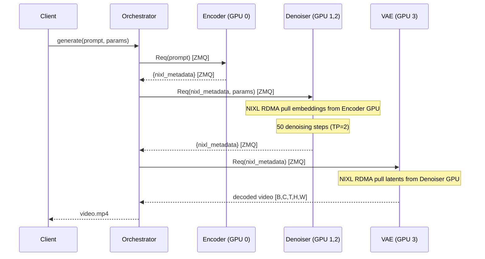

# Design Doc: Disaggregated Diffusion Inference in Dynamo

## 1. Motivation

Modern video diffusion models (HunyuanVideo 13B, Wan2.2-14B, etc.) comprise
heterogeneous components with vastly different compute profiles:

| Component | Params | Compute Pattern | VRAM (bf16) |
|-----------|--------|----------------|-------------|
| Text Encoder (e.g. Llama3-8B) | 8B | Single forward pass | ~16 GB |
| DiT Denoiser | 5-13B | 30-50 iterative steps | 10-26 GB |
| 3D VAE Decoder | ~200M | Single forward pass | ~2 GB |

In a monolithic deployment, **all components occupy a single GPU** throughout
the entire request lifetime, even though the encoder is idle during denoising
(96%+ of wall time) and the VAE is idle during encoding+denoising.

**Disaggregated diffusion** decomposes the pipeline into independently
deployable stages, enabling:

- **Independent scaling** per stage (e.g. 1 encoder : 4 denoisers : 1 VAE)
- **Heterogeneous hardware** (encoder on cost-efficient GPUs, denoiser on high-end)
- **Pipeline parallelism** across concurrent requests
- **Memory efficiency** (each GPU loads only its stage's weights)

## 2. Architecture

### 2.1 Three-Stage Pipeline

```
                  NIXL RDMA              NIXL RDMA
  Client ──► [ Encoder ] ── embeds ──► [ Denoiser ] ── latents ──► [ VAE ] ──► Video
               GPU 0                    GPU 1,2 (TP=2)              GPU 3
             Llama3-8B                  HunyuanVideo DiT            3D Causal VAE
             + CLIP                     13B params                  ~200M params
```

Each stage runs as a separate SGLang `Scheduler` subprocess with its own CUDA
context. The data plane uses **NIXL RDMA** for GPU-direct tensor transfer
between stages — only small metadata (~1.5 KB) travels over the ZMQ control
plane; actual tensor data (embeddings ~3.6 MB, latents ~1.4 MB) transfers
GPU-to-GPU without CPU round-trips.

### 2.2 Request Flow



### 2.3 Concurrent Request Pipelining

With disaggregation, stages process different requests simultaneously:

```
Time ──────────────────────────────────────────────────────►

Encoder:  |req0 enc|req1 enc|                |req2 enc|req3 enc|
Denoiser:          |   req0 denoise (50 steps)   |   req1 denoise ...
VAE:                                             |req0 vae|
```

## 3. Implementation

### 3.1 Core Components

| File | Role |
|------|------|
| `nixl_transfer.py` | `NixlTensorSender` / `NixlTensorReceiver` — GPU-direct RDMA transfer via NIXL |
| `partial_gpu_worker.py` | `PartialGPUWorker` — loads subset of pipeline modules; `NixlSendStage` / `NixlReceiveStage` for inter-stage transfer |
| `sglang_utils.py` | `build_partial_pipeline()` — suppresses default stage creation, syncs component configs |
| `run_e2e_sglang.py` | Orchestrator — launches 3 stage schedulers, connects ZMQ clients, routes NIXL metadata |
| `serve.py` | HTTP serving mode — FastAPI wrapper for curl-based requests |

### 3.2 NIXL Tensor Transfer

Inter-stage tensor data flows GPU-to-GPU via NIXL RDMA:

1. **Sender** (`NixlSendStage`): flattens output tensors into a contiguous buffer,
   registers it as NIXL-readable, returns metadata (shapes, dtypes, NIXL descriptor)
2. **Orchestrator**: forwards only the small metadata dict via ZMQ (~1.5 KB)
3. **Receiver** (`NixlReceiveStage`): allocates a GPU buffer, uses NIXL to RDMA-pull
   the tensor data directly from the sender's GPU, reconstructs individual tensors

Falls back to ZMQ pickle transfer when NIXL is unavailable.

### 3.3 Partial Pipeline Loading

Each stage loads only its required modules via `build_partial_pipeline()`:

```python
# Encoder: text encoders + tokenizers only (~16 GB)
required_modules=["text_encoder", "text_encoder_2", "tokenizer", "tokenizer_2", "scheduler"]

# Denoiser: transformer only (~26 GB, or ~13 GB/GPU with TP=2)
required_modules=["transformer", "scheduler"]

# VAE: VAE only (~2 GB)
required_modules=["vae", "scheduler"]
```

### 3.4 Multi-Encoder Support

Models with dual text encoders (e.g. HunyuanVideo: Llama3-8B + CLIP) produce
embedding lists with incompatible shapes. The NIXL transfer handles this by
indexing each element separately (`prompt_embeds_0`, `prompt_embeds_1`) during
send, and reconstructing the list on receive.

## 4. Supported Models

| Model | Pipeline Class | Text Encoders | DiT | Status |
|-------|---------------|---------------|-----|--------|
| **HunyuanVideo v1** | `HunyuanVideoPipeline` | Llama3-8B + CLIP | 13B | **Validated** |
| Wan2.2-TI2V-5B | `WanPipeline` | T5 | 5B | Validated |
| Wan2.1-T2V-14B | `WanPipeline` | T5 | 14B | Untested |

The encoder module detection is automatic via `model_index.json` — any SGLang-supported
diffusion model with the standard 3-stage structure should work without code changes.

## 5. Milestone Tracker

### Completed

- [x] **Phase 0**: Offline split validation (FLUX.1-schnell, diffusers)
- [x] **Phase 1a**: Dynamo stage workers (encoder/denoiser/VAE as Dynamo services)
- [x] **Phase 1b**: SGLang backend integration with `PartialGPUWorker`
- [x] **NIXL RDMA transfer**: GPU-direct tensor transfer between stages
- [x] **HunyuanVideo v1**: Dual-encoder (Llama + CLIP), 13B DiT, TP=2
- [x] **HTTP serving**: FastAPI-based `/generate` endpoint
- [x] **Concurrent requests**: Pipeline parallelism with async orchestrator

### Scaling Roadmap

- [ ] **Dynamo Router integration**: Register stage workers as typed endpoints,
  replace manual orchestrator with Router-orchestrated multi-stage chaining
- [ ] **Independent stage scaling**: N:M:K ratio (e.g. 1 encoder : 4 denoisers : 1 VAE)
  with load-balanced routing per stage pool
- [ ] **Encoder caching**: LRU cache for repeated prompts at the encoder stage
- [ ] **Sequence parallelism**: Ulysses/Ring SP for denoiser to scale beyond TP
- [ ] **VAE tiling**: Enable tiled 3D VAE decoding for high-resolution / long videos
- [ ] **Heterogeneous hardware**: Deploy encoder on cost-efficient GPUs (L4/T4),
  denoiser on compute-optimized GPUs (H100/H200)
- [ ] **Continuous batching**: Batch multiple requests at different denoising steps
  within the denoiser stage (prefill-decode analogy)
