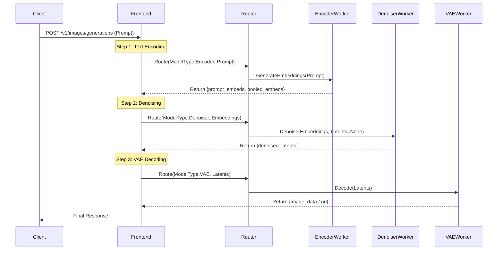

# Design Doc: Disaggregated Diffusion Inference (Diff-Disagg) in Dynamo

## 1. Motivation

Current diffusion inference in Dynamo (e.g., SGLang backend) is monolithic: a single worker loads all model components (Text Encoder, Transformer/UNet, VAE). This design faces several challenges with modern large-scale diffusion models (Flux, SD3, Video Models):

1.  **Huge Text Encoders**: Models like Flux use T5-XXL, consuming 10-20GB VRAM just for the encoder, which is only used once at the beginning.
2.  **Resource Inefficiency**: During the long denoising loop (20-50 steps), the text encoder weights occupy precious H100/H200 memory without being used.
3.  **Heterogeneous Compute**:
    *   **Text Encoding**: Compute-intensive, single pass. Can run on lower-end GPUs or even CPU.
    *   **Denoising**: Memory-bandwidth and compute-intensive, iterative. Requires high-end GPUs (H100/H200).
    *   **VAE Decoding**: Memory-intensive, single pass. Can be offloaded.

**Goal**: Decompose the diffusion pipeline into flexible, independent stages (Encoder, Denoiser, VAE) that can be deployed on different hardware and scaled independently.

## 2. Architecture: Router-Orchestrated Multi-Stage Pipeline

We adopt a **Router-Centric** architecture similar to Dynamo's existing EPD (Encoder-Prefill-Decode) flow for LLMs. The Frontend/Router acts as the orchestrator, chaining calls between specialized workers.

### 2.1 Component Roles

1.  **Frontend / Global Router**:
    *   Acts as the conductor.
    *   Receives the initial user request.
    *   Orchestrates the sequence: `Encoder -> Denoiser -> VAE`.
    *   Maintains the request state and context.

2.  **Stage Workers**:
    *   **Encoder Worker**: Loads CLIP/T5. Input: Text. Output: Embeddings (Tensor Bytes).
    *   **Denoiser Worker**: Loads Transformer/UNet. Input: Embeddings + Latents (optional). Output: Denoised Latents.
    *   **VAE Worker**: Loads VAE. Input: Denoised Latents. Output: Image/Video (Pixel Data).

### 2.2 Data Flow (Request/Response)



*Optimization Note*: For large data (like Video Latents), we can use **Reference Passing** via a shared storage (Object Store / Shared Memory) instead of passing raw bytes through the Router/Frontend.

## 3. Detailed Design

### 3.1 Protocol Extensions (`dynamo/common/protocols`)

We need to define data structures for intermediate results.

**New Protocol Types:**

```python
class DiffusionEmbeddingData(BaseModel):
    """Output from Encoder Stage"""
    prompt_embeds: bytes          # Serialized Tensor (e.g., safetensors/numpy)
    pooled_prompt_embeds: Optional[bytes] = None
    negative_prompt_embeds: Optional[bytes] = None
    negative_pooled_prompt_embeds: Optional[bytes] = None

class DiffusionLatentData(BaseModel):
    """Output from Denoiser Stage"""
    latents: bytes                # Serialized Tensor
    shape: List[int]
    dtype: str

class StageRequest(BaseModel):
    """Generic Request for a specific stage"""
    stage: str                    # "encoder", "denoiser", "vae"
    input_data: Union[str, DiffusionEmbeddingData, DiffusionLatentData]
    params: Dict[str, Any]        # Generation params (steps, cfg, etc.)
```

### 3.2 ModelType Expansion (`dynamo/llm/src/model.rs` & Python Enums)

Extend `ModelType` to support fine-grained stages.

```python
class ModelType(IntFlag):
    # Existing
    Tokens = auto()
    # ...
    
    # New Diffusion Stages
    DiffusionEncoder = auto()  # Text Encoder only
    DiffusionDenoiser = auto() # Transformer/UNet only
    DiffusionVAE = auto()      # VAE only
```

### 3.3 SGLang Backend Adaptation (`components/src/dynamo/sglang`)

We need to modify `init_diffusion.py` and handlers to support partial loading.

**Configuration:**
Add `--diffusion-stage` argument to `sglang` worker.

*   `--diffusion-stage full` (Default): Loads everything (current behavior).
*   `--diffusion-stage encoder`: Loads only Text Encoders.
*   `--diffusion-stage denoiser`: Loads only Transformer, accepts Embeddings.
*   `--diffusion-stage vae`: Loads only VAE, accepts Latents.

**Handler Implementation:**

1.  **`EncoderHandler`**:
    *   Uses `pipe.encode_prompt()`.
    *   Returns serialized embeddings.

2.  **`DenoiserHandler`**:
    *   Initializes pipeline with `text_encoder=None`, `vae=None`.
    *   Implements `generate(prompt_embeds=...)`.
    *   Returns latents (skips VAE decode).

3.  **`VAEHandler`**:
    *   Initializes pipeline with `text_encoder=None`, `transformer=None`.
    *   Implements `decode(latents=...)`.

### 3.4 Router Logic (`components/src/dynamo/global_router`)

The Global Router needs to be aware of these new `ModelType`s.

*   **Registration**: Workers register with specific types (e.g., `ModelType.DiffusionEncoder`).
*   **Routing**:
    *   `handle_encoder_request`: Routes to Encoder Pool.
    *   `handle_denoiser_request`: Routes to Denoiser Pool.
    *   `handle_vae_request`: Routes to VAE Pool.

## 4. Implementation Plan

### POC (Proof of Concept)

Full POC code lives in [`examples/disagg_diffusion/`](../../examples/disagg_diffusion/).

#### Phase 0: Offline Validation (`phase0_validate/`)

Single-GPU script that proves diffusers supports split execution.
Runs Encoder → Denoiser → VAE as three separate stages with serialized
intermediate tensors, then compares the result against a monolithic run.

**Key risk validated**: Can diffusers pipelines accept `prompt_embeds` and
return `output_type="latent"` to bypass text encoder / VAE respectively?

#### Phase 1: Dynamo Stage Workers (`phase1_workers/`)

Three independent Dynamo workers, each loading only its model component:

| Worker | Loads | Endpoint | Input | Output |
|--------|-------|----------|-------|--------|
| `encoder_worker.py` | CLIP + T5 | `disagg_diffusion.encoder.encode` | text prompt | embeddings (b64) |
| `denoiser_worker.py` | Transformer | `disagg_diffusion.denoiser.denoise` | embeddings + params | latents (b64) |
| `vae_worker.py` | VAE | `disagg_diffusion.vae.decode` | latents | image (b64 PNG) |

Intermediate data is serialized as base64-encoded `torch.save` bytes.
Protocol types are defined in `protocol.py`.

#### Phase 2: Orchestrator Client (`phase2_orchestrator/`)

A lightweight Python client that connects to the Dynamo runtime, calls the
three stage endpoints in sequence, and produces the final image.

### Production Roadmap

#### Phase 3: Protocol & Types
1.  Define `DiffusionEmbeddingData` and `DiffusionLatentData` in `dynamo/common/protocols`.
2.  Add `DiffusionEncoder`, `DiffusionDenoiser`, `DiffusionVAE` to `ModelType` enum (Rust + Python).

#### Phase 4: SGLang Modularization
1.  Modify `init_diffusion.py` to accept `--diffusion-stage {full,encoder,denoiser,vae}`.
2.  Implement `EncoderHandler`, `DenoiserHandler`, `VAEHandler` in `sglang/request_handlers/disagg_diffusion/`.
3.  Add logic to conditionally load model components based on stage.

#### Phase 5: Frontend / Router Orchestration
1.  Update `Frontend` to detect if the backend is disaggregated diffusion.
2.  Implement the multi-step orchestration logic (`Encoder → Denoiser → VAE`)
    in `Frontend` or a specialized `DiffusionOrchestrator` component.
3.  Support configurable stage DAGs (e.g., skip VAE for latent-only output).

#### Phase 6: Optimization
1.  **Reference Passing**: Replace base64 tensor payloads with shared-memory
    handles or object-store URLs (e.g., `media_output_fs_url`).
2.  **Pipelining**: Overlap encoding of request N+1 with denoising of request N.
3.  **Encoder Caching**: LRU cache for repeated prompts at the Encoder stage.
4.  **Video Extension**: Extend to video models (larger latents, more frames).
