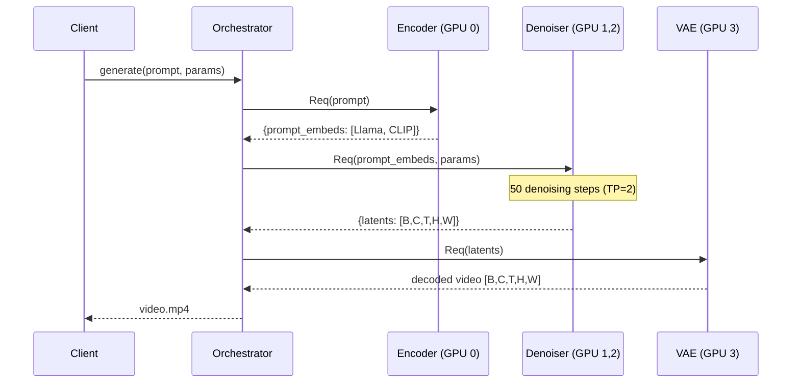

# Design Doc: Disaggregated Diffusion Inference in Dynamo

## 1. Motivation

Modern video diffusion models (HunyuanVideo 13B, Wan2.2-14B, etc.) comprise
heterogeneous components with vastly different compute profiles:

| Component | Params | Compute Pattern | VRAM (bf16) |
|-----------|--------|----------------|-------------|
| Text Encoder (e.g. Llama3-8B) | 8B | Single forward pass | ~16 GB |
| DiT Denoiser | 5-13B | 30-50 iterative steps | 10-26 GB |
| 3D VAE Decoder | ~200M | Single forward pass | ~2 GB |

In a monolithic deployment, **all components occupy a single GPU** throughout
the entire request lifetime, even though the encoder is idle during denoising
(96%+ of wall time) and the VAE is idle during encoding+denoising.

**Disaggregated diffusion** decomposes the pipeline into independently
deployable stages, enabling:

- **Independent scaling** per stage (e.g. 1 encoder : 4 denoisers : 1 VAE)
- **Heterogeneous hardware** (encoder on cost-efficient GPUs, denoiser on high-end)
- **Pipeline parallelism** across concurrent requests
- **Memory efficiency** (each GPU loads only its stage's weights)

## 2. Architecture

### 2.1 Three-Stage Pipeline

```
                    ZMQ                    ZMQ                    ZMQ
  Client ──► [ Encoder ] ─── embeds ──► [ Denoiser ] ─── latents ──► [ VAE ] ──► Video
               GPU 0                     GPU 1,2 (TP=2)              GPU 3
             Llama3-8B                   HunyuanVideo DiT            3D Causal VAE
             + CLIP                      13B params                  ~200M params
```

Each stage runs as a separate SGLang `Scheduler` subprocess with its own CUDA
context.  Inter-stage communication uses ZMQ (pickle serialization).

### 2.2 Request Flow



### 2.3 Concurrent Request Pipelining

With disaggregation, stages process different requests simultaneously:

```
Time ──────────────────────────────────────────────────────►

Encoder:  |req0 enc|req1 enc|                |req2 enc|req3 enc|
Denoiser:          |   req0 denoise (50 steps)   |   req1 denoise ...
VAE:                                             |req0 vae|
```

The encoder and VAE are freed immediately after their stage completes,
allowing them to serve the next request while the denoiser is busy.

## 3. Implementation

### 3.1 Core Components

| File | Role |
|------|------|
| `partial_gpu_worker.py` | `PartialGPUWorker` — loads a subset of pipeline modules; `IntermediateOutputStage` / `DeviceMoveStage` for inter-stage tensor transfer |
| `sglang_utils.py` | `build_partial_pipeline()` — suppresses default stage creation, syncs component configs; tensor injection/extraction helpers |
| `run_e2e_sglang.py` | Orchestrator — launches 3 stage schedulers, connects ZMQ clients, runs E2E pipeline with timing |

### 3.2 Partial Pipeline Loading

Each stage loads only its required modules via `build_partial_pipeline()`:

```python
# Encoder: loads text encoders + tokenizers only (~16 GB)
pipeline = build_partial_pipeline(server_args,
    required_modules=["text_encoder", "text_encoder_2",
                       "tokenizer", "tokenizer_2", "scheduler"])

# Denoiser: loads transformer only (~26 GB, or ~13 GB/GPU with TP=2)
pipeline = build_partial_pipeline(server_args,
    required_modules=["transformer", "scheduler"])

# VAE: loads VAE only (~2 GB)
pipeline = build_partial_pipeline(server_args,
    required_modules=["vae", "scheduler"])
```

A dynamic subclass of the model's pipeline is created at runtime to:
1. Suppress automatic stage creation (`create_pipeline_stages` → no-op)
2. Skip LoRA init (which assumes `transformer` always exists)
3. Sync all component configs (VAE z_dim, DiT patch_size, etc.) even for unloaded modules

### 3.3 Multi-Encoder Support

Models with dual text encoders (e.g. HunyuanVideo: Llama3-8B + CLIP) produce
embedding lists with incompatible shapes. The pipeline handles this transparently:

- `IntermediateOutputStage`: preserves multi-element lists as-is (no `torch.cat`)
- `inject_tensors_to_req()`: accepts both bare tensors and lists
- `DeviceMoveStage`: moves each tensor in the list to GPU with `.contiguous()`

### 3.4 SGLang Compatibility Patches

Two runtime patches are applied for HunyuanVideo compatibility:

1. **`HunyuanConfig` task_type**: The upstream config class lacks a default
   `task_type`, causing instantiation to fail. We wrap `__init__` to supply
   `ModelTaskType.T2V` when omitted.

2. **Triton norm contiguous**: HunyuanVideo's transformer produces
   non-contiguous intermediate tensors from attention reshapes. SGLang's triton
   layernorm kernel asserts `x.stride(-1) == 1`. We patch `norm_infer` to call
   `.contiguous()` when needed.

## 4. Supported Models

| Model | Pipeline Class | Text Encoders | DiT | Status |
|-------|---------------|---------------|-----|--------|
| **HunyuanVideo v1** | `HunyuanVideoPipeline` | Llama3-8B + CLIP | 13B | **Validated** |
| Wan2.2-TI2V-5B | `WanPipeline` | T5 | 5B | Validated |
| Wan2.1-T2V-14B | `WanPipeline` | T5 | 14B | Untested |
| FLUX.1 (image) | `FluxPipeline` | CLIP + T5 | 12B | Phase 0 only |

The encoder module detection is automatic via `model_index.json` — any SGLang-supported
diffusion model with the standard 3-stage structure should work without code changes.

## 5. Benchmarks (HunyuanVideo v1, 544x960, 50 steps, 61 frames)

### Single Request Latency

| | Native SGLang (1 GPU) | Disagg (4 GPUs, TP=2) |
|---|---|---|
| Encoder | 0.31s | 0.35s |
| Denoiser | 512.19s (10.24s/step) | 477.14s (9.42s/step) |
| VAE | 24.53s | 18.32s |
| **Total** | **537.12s** | **495.81s** |

### 2 Concurrent Requests (9 frames, 3 steps — smoke test)

```
req 0 | enc=0.34s  den=2.92s  vae=2.26s  total=5.52s
req 1 | enc=0.66s  den=5.50s  vae=2.25s  total=8.41s
Wall time: 8.44s | Throughput: 0.24 req/s
```

Pipeline parallelism observed: req 1's encoder overlapped with req 0's denoiser.

## 6. Milestone Tracker

### Completed

- [x] **Phase 0**: Offline split validation (FLUX.1-schnell, diffusers)
- [x] **Phase 1a**: Dynamo stage workers (encoder/denoiser/VAE as Dynamo services, FLUX)
- [x] **Phase 1b**: SGLang backend integration
  - [x] `PartialGPUWorker` with monkey-patched `GPUWorker`
  - [x] `build_partial_pipeline()` with auto-detected pipeline class
  - [x] `IntermediateOutputStage` for ZMQ tensor transfer
  - [x] TP=2 denoiser support (multi-process pipe wiring)
  - [x] HunyuanVideo v1 dual-encoder support (Llama + CLIP)
  - [x] E2E orchestrator with per-stage timing and mp4 output
  - [x] Concurrent request support with pipeline parallelism
- [x] **Phase 2**: Orchestrator client (ZMQ-based, async)

### In Progress

- [ ] **Phase 3**: Dynamo Router integration
  - [ ] Register stage workers as typed endpoints (`DiffusionEncoder`, `DiffusionDenoiser`, `DiffusionVAE`)
  - [ ] Router-orchestrated multi-stage chaining (replace manual ZMQ orchestrator)
  - [ ] Frontend API: `POST /v1/video/generations`

### Scaling Roadmap

- [ ] **NIXL tensor transfer**: Replace ZMQ pickle with RDMA/GPU-direct for
  inter-stage latent transfer (critical for video — latents are O(100 MB))
- [ ] **Independent stage scaling**: N:M:K ratio (e.g. 1 encoder : 4 denoisers : 1 VAE)
  with load-balanced routing per stage pool
- [ ] **Encoder caching**: LRU cache for repeated prompts at the encoder stage
  (common in batch generation / prompt engineering workflows)
- [ ] **Sequence parallelism**: Ulysses/Ring SP for denoiser to scale beyond TP
  (especially for long videos with high temporal resolution)
- [ ] **VAE tiling**: Enable tiled 3D VAE decoding for high-resolution / long videos
  that exceed single-GPU VRAM
- [ ] **Heterogeneous hardware**: Deploy encoder on cost-efficient GPUs (e.g. L4/T4),
  denoiser on compute-optimized GPUs (H100/H200), VAE on memory-optimized nodes
- [ ] **HunyuanVideo v1.5 support**: Requires SGLang to implement
  `HunyuanVideo15Pipeline` (Qwen2.5-VL + ByT5 encoders, 8.3B DiT)
- [ ] **Prefill-decode analogy**: Continuous batching within the denoiser stage
  (batch multiple requests at different denoising steps)
