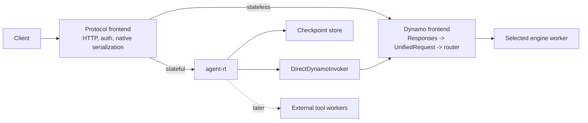
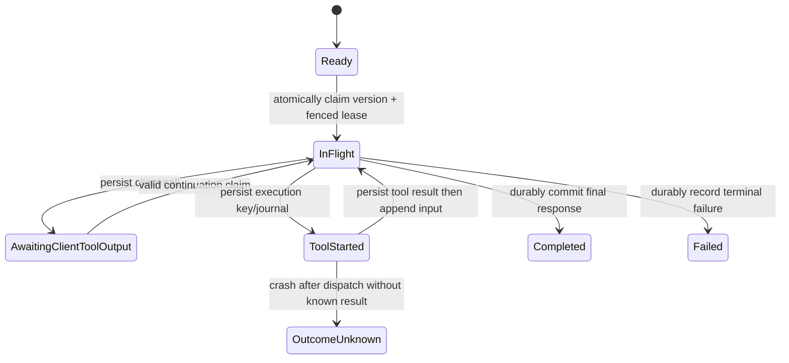

# Stateful Agent Traffic Runtime

**Status:** Direct-path production vertical slice implemented; GAIE/EPP integration and production-cluster acceptance remain
**Scope:** A composition model for native OpenAI Responses and Anthropic Messages traffic, durable state, external tools, Kubernetes-native sandboxes, and Dynamo inference.
**Decision horizon:** Productionize the direct Dynamo path first; preserve the same boundaries for Dynamo GAIE/EPP Kubernetes deployments.

## Decision

Build `agent-rt` as an optional stateful module used by the existing **protocol frontends**. It owns durable turn state, protocol-specific continuation materialization, and coordination of external tools. It is not a second public gateway, an engine adapter, an EPP extension, or a Dynamo concept.

Dynamo remains responsible for request preprocessing, `UnifiedRequest` conversion, `AgentContext` creation, routing, EPP, engine selection, and inference. `agent-rt` invokes Dynamo through one narrow `InferenceInvoker` boundary:

- **Direct Dynamo invoker** for the local/non-EPP path.
- **Private Gateway/EPP invoker** for Kubernetes GAIE deployments.

The same `agent-rt` core is used in both paths and across supported frontend protocols. It has no vLLM, SGLang, or TRT-LLM-specific code and does not define a lossy universal agent-request IR.

The durable seams are trait-based: `AgentProtocol`, `CheckpointStore`, `InferenceInvoker`, `ToolRouter`, `ToolJournal`, `ToolExecutor`, `ToolFailurePolicy`, and `SandboxProvider`. Deployment assembly is intentionally concrete. The Dynamo Responses frontend currently composes Brave web search and an external sandbox provider in a small executor mux; adding a provider does not add an engine integration or change the runtime protocol.

## Why This Exists

For a Responses continuation request, Dynamo cannot infer on `previous_response_id` directly: a stateful component must authorize the checkpoint, load the prior model-visible items, append the new input, and send a complete request to inference. Anthropic clients such as Claude Code already send their complete Messages history, so their ordinary client-owned tool loop remains passthrough; the runtime is selected only for trusted durable-state policy or runtime-owned tools. The same component must coordinate any server-owned tool call and durably commit the next checkpoint.

This does **not** make Dynamo an agent framework. Putting response storage, MCP transports, sandbox credentials, tool retries, and workflow recovery in `dynamo-llm` would couple the normal stateless path to durable application state and external execution systems.

## Terms

Two components are called “frontend” in a GAIE deployment. They have different responsibilities and must not be conflated.

| Term | Meaning |
| --- | --- |
| **Protocol frontend** | Our public application/ingress service. It parses a native API such as OpenAI Responses or Anthropic Messages, authenticates callers, optionally calls `agent-rt`, and serializes the same native protocol. |
| **Dynamo frontend sidecar** | The per-worker Dynamo frontend selected by EPP. In GAIE it runs in `--router-mode direct` and forwards to its colocated worker; it does not run `agent-rt`. |
| **EPP** | Dynamo’s Rust Endpoint Picker Plugin. It receives a complete inference request through Envoy `ext_proc`, renders/tokenizes it for KV-aware worker selection, and injects routing headers. |
| **Dynamo carrier** | An approved, Dynamo-owned request-metadata handle forwarded by the invocation implementation. `agent-rt` neither parses nor constructs it. |

## Goals

- Support durable OpenAI Responses continuations beginning with `store` and `previous_response_id`.
- Preserve native Anthropic Messages requests for Claude Code; do not translate them through Responses or a universal agent IR.
- Keep Claude Code's complete-history, client-owned tool loop on the normal stateless path unless trusted server policy selects the runtime.
- Preserve Dynamo invocation metadata across every model step without making it part of the runtime domain model.
- Keep stateless requests off the state-store and agent-runtime path.
- Keep server-owned tools outside Dynamo, with separate credentials, egress, execution budgets, and recovery semantics.
- Run the same state runtime against direct Dynamo locally and through Dynamo EPP in Kubernetes.
- Provide one real runtime-owned web-search connector and one Kubernetes-native sandbox provider without moving either implementation into Dynamo or `agent-rt`.

## Non-Goals

- A new public “agent gateway” service or a second protocol ingress.
- Moving response persistence, MCP, web search, sandboxing, or generic workflow orchestration into Dynamo.
- Engine-specific agent adapters for vLLM, SGLang, or TRT-LLM.
- Making `AgentContext` an `agent-rt` data type or defining a portable agent-context wire protocol.
- Reimplementing vLLM rendering, tokenization, APC, or EPP cache-key hashing in `agent-rt`.
- Letting clients supply arbitrary MCP endpoints, credentials, or sandboxes.
- Claiming exactly-once external side effects without an executor outcome/idempotency contract.
- Durable SSE event replay or `Last-Event-ID` support in the first production slice.

## Ownership Boundary

| Area | Dynamo protocol frontend | `agent-rt` | Dynamo inference / EPP | External tool workers |
| --- | --- | --- | --- | --- |
| Public native wire parsing and serialization | Own | Consume native typed requests/results | No | No |
| Caller authentication | Own | Consume trusted authorization | No | Connector-specific auth only |
| Checkpoint authorization | Issue trusted scope | Enforce it for every read/write | No | No |
| Response/checkpoint persistence | No | Own | No | No |
| Continuation hydration | No | Own | Consume complete request only | No |
| Dynamo carrier | Create/approve | Forward opaquely | Interpret/create `AgentContext` | No |
| Inference invocation | Configure | Call injected invoker | Direct route or EPP worker selection | No |
| Native typed event contract | Own conversion from engine deltas | Observe for orchestration/commit | Produce engine deltas | No |
| SSE/WebSocket framing and client backpressure | Own | No | No | No |
| Request lowering / preprocessing | No | No | Own | No |
| KV-aware routing | No | Never select workers | Own: frontend router locally, EPP in GAIE | No |
| Engine/model selection | No | No | Own | No |
| Client function tools | Preserve protocol | Persist call/wait/resume | Parse model output | No |
| Runtime-owned tools | Declare policy | Authorize, journal, schedule | No | Execute |
| Tool credentials and egress | No | Select connector/policy | No | Own |

### Dynamo Boundary

The ordinary Dynamo native-protocol path remains:

```text
native Responses or Anthropic request
  -> UnifiedRequest
  -> backend request
  -> selected engine
  -> vLLM, SGLang, or TRT-LLM
```

`agent-rt` produces a fully materialized request in the same native frontend protocol before this path. It does not replace `UnifiedRequest`, translate Anthropic through Responses, or lower directly to an engine protocol.

### Native Protocol Families

`AgentProtocol` is a compile-time bundle of native request, replay-item, response, and stream-event DTOs. It is not a shared message schema. `CheckpointStore`, `RequestMaterializer`, `InferenceInvoker`, and `OutputInterpreter` are parameterized by that family.

| Family | Normal selection | Materialization |
| --- | --- | --- |
| OpenAI Responses | `store=true`, `previous_response_id`, explicit durable policy, or runtime-owned tools | Authorize and hydrate the response chain, clear model-facing lineage, and invoke Dynamo with complete native Responses input. |
| Anthropic Messages / Claude Code | Passthrough for ordinary complete-history requests and client-owned tools; select only for explicit durable policy or runtime-owned tools | Preserve the complete native Messages request. Runtime tool rounds append native assistant/tool-result Messages blocks. External Responses-style continuation chains are not invented. |

Output interpretation is protocol-specific. Responses output items become Responses replay items; Anthropic responses become native assistant Messages. Tool ownership remains trusted deployment policy rather than an inference from client-supplied tool names.

At Dynamo ingress, approved request metadata is decoded into Dynamo’s `AgentContext`. Dynamo derives the context needed by each internal model step from its own typed invocation carrier. `agent-rt` never constructs or stores `AgentContext`, raw headers, credentials, or transport state.

### Narrow Runtime Contracts

Only durable external seams are abstracted. Internal types should remain concrete.

```text
CheckpointStore
  claim / load / commit durable response-chain state

InferenceInvoker
  invoke a complete request in its native frontend protocol through Dynamo
  - DirectDynamoInvoker
  - EppGatewayInvoker

ToolExecutor
  execute an already-authorized runtime-owned tool request
```

The frontend supplies two data values to `agent-rt`:

```text
RuntimeAuthorization
  server-authenticated tenant/principal scope
  permitted tools/connectors and resource limits

DynamoInvocationHandle
  approved Dynamo-owned carrier and invocation policy
```

`RuntimeAuthorization` is not a bearer token, raw header map, or `AgentContext`. `DynamoInvocationHandle` is opaque to `agent-rt`; its Dynamo implementation owns carrier serialization, field allowlisting, compatibility, and encryption if recovery needs durable data.

### Current Implementation Snapshot

The direct-path vertical slice is split by responsibility rather than by engine:

| Component | Current implementation |
| --- | --- |
| Runtime contracts and orchestration | `frontend-crates/agent-rt`: native Responses materialization, pull-based stream observation, public response identity, tool rounds, checkpoint gating, and the traits above. |
| Durable response/tool state | `frontend-crates/agent-rt-store`: embedded DuckDB and shared PostgreSQL implementations. |
| Read-only server tools | `frontend-crates/agent-tools`: bounded Brave web search behind `ToolExecutor`. |
| Sandbox contract and adapters | `frontend-crates/agent-sandbox`: `SandboxProvider`, HTTP provider client, Kubernetes Agent Sandbox control plane, sandboxd data plane, and the durable execution supervisor. |
| Sandbox service | `frontend-crates/agent-sandbox-service`: authenticated HTTP service, PostgreSQL execution fencing, operator catalog, container images, and Kubernetes manifests. It is deployed separately from Dynamo. |
| Dynamo composition | `dynamo-llm`'s optional `agent-rt-poc` feature: trusted ingress scope, filtered Dynamo carrier, native typed streaming/SSE ownership, DuckDB runtime construction, and deployment-selected web-search/sandbox routes. |

The current Dynamo sandbox route is enabled only when `DYN_AGENT_RT_SANDBOX_ENDPOINT` and a bearer token of at least 32 bytes are configured. `DYN_AGENT_RT_SANDBOX_PROFILE` selects an operator-known profile and `DYN_AGENT_RT_SANDBOX_TOOL_NAME` selects the model-visible name; the model cannot choose an image, namespace, executable, RuntimeClass, or network policy. Plain HTTP requires the explicit local/service-mesh opt-in `DYN_AGENT_RT_SANDBOX_ALLOW_HTTP=true`. `RuntimeAuthorization.permitted_connectors` must independently allow `sandbox`, so endpoint configuration alone does not authorize execution.

## Direct Dynamo: Local and Non-EPP Path



This is the first proof-of-concept topology. The invoker calls Dynamo’s matching native ingress over a private HTTP or equivalent Dynamo-owned in-process boundary. It must preserve the approved carrier and never call the public stateful dispatch path recursively.

### Stateful Request Flow

1. The protocol frontend authenticates the caller and creates `RuntimeAuthorization`.
2. It invokes `agent-rt` for requests with persistent state, `previous_response_id`, or runtime-owned tools. Stateless requests invoke Dynamo directly.
3. `agent-rt` claims the response chain, validates checkpoint access, hydrates prior model-visible items, resolves inherited tool definitions/tool choice, and appends the new input. Instructions are per-turn and do not carry across `previous_response_id`.
4. It clears `previous_response_id` only on the model-facing request. Storage retains the response lineage.
5. `DirectDynamoInvoker` invokes Dynamo with the complete native request and the approved carrier.
6. Dynamo derives `AgentContext`, lowers through `UnifiedRequest`, applies its normal routing policy, and invokes the selected engine.
7. Dynamo produces native typed response events. `agent-rt` observes those events without owning their transport, performs any required tool-loop transition, and commits the durable state transition.
8. Dynamo’s protocol frontend serializes the approved typed events to SSE or WebSocket. It withholds the terminal completion event until the `agent-rt` commit succeeds.

### Streaming Data Plane

Dynamo is the sole owner of public streaming:

```text
engine stream
  -> Dynamo Responses stream converter
  -> native typed ResponseStreamEvent
  -> pull-based agent-rt observation/orchestration
  -> Dynamo native event serializer
  -> SSE/WebSocket client
```

The stream is pull-based end to end. `agent-rt` does not spawn a producer, create an `mpsc` token queue, parse SSE, serialize protocol events, or hold a client socket. Backpressure and disconnect cancellation propagate through Dynamo’s existing response body and engine context.

For a model step with no runtime-owned tool call, typed deltas pass through with only identity/state observation. For a runtime-owned tool call, `agent-rt` consumes the completed call, durably journals and executes the tool, appends its result, and requests another typed Dynamo model stream while the same Dynamo public response writer stays open. A client-owned Codex or Claude tool call is committed as `AwaitingClientToolOutput` and returned to the client for execution; it does not create an internal model round.

The final typed response is retained for checkpoint replay. Dynamo may emit nonterminal deltas immediately, but it must not serialize `response.completed` until the terminal checkpoint commit succeeds. The first recovery contract is live, non-resumable delivery plus idempotent retrieval of the committed final response.

## Dynamo GAIE/EPP Kubernetes Path


The public and private routes are intentionally different:

- **Public route:** Client to the matching protocol frontend. It can invoke `agent-rt`.
- **Private inference route:** Protocol frontend to an `InferencePool`. It enters EPP and cannot re-enter public stateful dispatch.

The private route is the `EppGatewayInvoker` implementation. It sends every model step as a complete, materialized native request. EPP then selects the engine worker. The selected Dynamo frontend sidecar is in direct mode because EPP already made the selection.

### Why `agent-rt` Must Be Before EPP

EPP selects from the model-visible request body. A request containing only `previous_response_id` has no full history and therefore cannot yield a correct prefix-cache placement decision. Placing `agent-rt` in the selected worker sidecar would be too late for EPP selection and would tie durable state/tool scaling to worker replicas.

For every tool-loop model round:

```text
agent-rt hydrates or appends tool output
  -> private InferencePool route
  -> EPP renders/tokenizes the full request
  -> EPP selects a KV-local worker
  -> selected direct Dynamo frontend
  -> engine
```

EPP owns worker selection in GAIE. Dynamo owns the routing policy and EPP implementation; `agent-rt` never chooses a worker or treats a session identifier as proof of KV residency.

### EPP Requirements

The Kubernetes path requires endpoint-neutral rendering/tokenization. EPP must obtain the same routing token sequence that inference uses for a native Responses request. The current Rust EPP has Chat Completions-specific tokenization, so this is a Dynamo/vLLM prerequisite, not an `agent-rt` responsibility.

The target shared path is:

```text
native inference request
  -> authoritative renderer/tokenizer
  -> exact routing token sequence
  -> EPP KV-prefix scoring and worker selection
  -> normal engine inference using the same request semantics
```

`agent-rt` must not reproduce templates, tokenization, or canonical cache keys merely to make EPP work.

## Turn State Machine and Durability

Response-chain mutation requires a single-writer protocol. A final compare-and-swap alone is insufficient because two replicas could both hydrate, infer, stream, or execute a tool before one loses the final commit.



Required rules:

- Claim `Ready(version) -> InFlight(turn_id, lease)` atomically before any inference or tool invocation.
- Fence every later checkpoint commit with that claim/version.
- Make duplicate submission behavior explicit through an idempotency key and durable state lookup.
- Persist `AwaitingClientToolOutput` before returning a client-owned function call.
- Persist the final response checkpoint before emitting the terminal public completion event.
- Re-authorize each continuation against current `RuntimeAuthorization`; a recovered carrier is never proof of caller authorization.

### Streaming and Cancellation

The Dynamo protocol frontend remains the authority for client-facing protocol events. `agent-rt` observes events typed by the selected native protocol family and yields approved typed events back to Dynamo.

- Model deltas stream through a pull-based chain with no additional unbounded queue.
- The terminal `response.completed` event is emitted only after the final checkpoint commit.
- The first production version is explicitly non-resumable and provides idempotent final-result retrieval. Durable event replay is a later feature.
- A client disconnect does not make an external tool call safe to abandon. Cancellation policy is defined per response mode and tool class.
- Tool work has a separate bounded concurrency pool from inference. Per-turn limits include tool rounds, timeout, total external-work budget, output bytes, and cumulative token budget.

## Dynamo Invocation Carrier

The invoker forwards an approved Dynamo carrier for each model step. It must distinguish:

| Carrier class | Treatment |
| --- | --- |
| Stable affinity metadata | May remain stable over the active response turn when Dynamo policy permits it. |
| Per-step request metadata | Recomputed by Dynamo for every step, including input trigger and compaction behavior. |
| Credentials, trace headers, one-request hints | Never checkpoint data. |

An opaque `ForwardedCarrierSnapshot` may be stored only when server-tool-loop recovery requires it. The Dynamo invoker owns its schema, allowed fields, versioning, and encryption/capability protection. The checkpoint binds it to an authenticated tenant/principal scope, but it cannot be used to bypass fresh authorization.

## Tool Ownership and Execution

| Owner | Examples | Runtime behavior |
| --- | --- | --- |
| Client | Ordinary functions, editor/shell tools | Persist call state, return the call, and resume only on a valid submitted tool-output continuation. |
| Runtime | Configured MCP, web search, code/file sandbox | Authorize, journal, invoke a worker, persist normalized result, append it, and continue inference. |
| Backend | Explicit Dynamo/backend-native facility | Preserve the backend contract; do not misrepresent it as runtime-owned. |

Runtime-owned tools remain external to Dynamo:

- The first connector is read-only web search with deployment-owned credentials, an allowlisted provider endpoint, timeout/concurrency limits, bounded normalized results, and citation metadata.
- Broad MCP support is deferred. Future MCP connectors are deployment/tenant configured; clients cannot submit arbitrary server URLs or credential headers.
- Sandboxes are a Kubernetes-native isolated execution plane with filesystem, network, identity, resource, artifact, and retention policy.
- Workers receive a scoped tool-execution request, not raw Dynamo headers or backend credentials.

Before dispatch, `agent-rt` writes a durable tool journal record keyed by response, tool-call ID, execution/idempotency key, and attempt. A `started` record alone cannot prove a side effect did not occur. Auto-retry is permitted only when the executor supports durable idempotency plus outcome lookup, or the tool is explicitly read-only/idempotent. Otherwise recovery transitions to `OutcomeUnknown` and follows a documented resolution policy.

### Kubernetes-Native Sandbox Plane

`agent-rt` invokes a generic `ToolExecutor`; it never creates Pods, calls `pods/exec`, mounts volumes, or manages sandbox credentials. The sandbox implementation is a separate service with a durable execution API:

```text
agent-rt ToolExecutor
  -> authenticated sandbox executor service
      -> SandboxProvider
          -> Kubernetes Agent Sandbox provider
          -> Agent Substrate provider (future)
          -> AgentENV/E2B provider (future)
          -> Modal provider (external deployment option)
```

The Kubernetes reference provider targets the Kubernetes SIG Apps Agent Sandbox APIs: `SandboxTemplate` defines an operator-approved image and security policy, `SandboxWarmPool` bounds prewarmed capacity, and a tenant-scoped `SandboxClaim` obtains one stable sandbox. Agent Sandbox is the Kubernetes lifecycle/control plane; it does not itself provide the container-isolation boundary. The template therefore selects an operator-allowlisted `RuntimeClass`: gVisor by default and Kata Containers when VM-grade isolation is required.

The implemented request path is:

```text
Dynamo Responses frontend
  -> HttpSandboxProvider (scoped bearer-authenticated request)
  -> agent-rt-sandbox-service
      -> PostgreSQL execution claim + lease + fence
      -> tenant/profile catalog lookup
      -> Kubernetes SandboxClaim API
      -> bound Sandbox status.serviceFQDN
      -> sandboxd gRPC process API and bounded REST file API
      -> atomic terminal execution + artifact commit
```

Only the executor service has narrowly scoped Kubernetes credentials. Dynamo and `agent-rt` do not. The service can create/get/delete `SandboxClaim`s and get the bound `Sandbox` only in operator-configured tenant namespaces. The current provider connects directly to the bound Sandbox service because the service is already inside the trusted cluster execution plane; ingress to sandboxd is restricted to the executor-service identity by NetworkPolicy. The upstream sandbox router or agentgateway can be added when a deployment needs a separately scalable proxy/authorization hop, but neither is the isolation mechanism.

The execution store uses database time, per-execution PostgreSQL advisory locks, row locks, renewable leases, and fencing tokens. An expired pending claim may be taken over; an expired running claim becomes `OutcomeUnknown` and is never blindly redispatched. Cancellation written by any service replica is observed by the lease owner and propagated to sandboxd. Terminal state and captured artifacts commit in one transaction before they become readable.

Every reference template is fail-closed:

- Dedicated tenant namespace and service account; `automountServiceAccountToken: false`.
- Restricted Pod Security, `RuntimeDefault` seccomp, no privilege escalation, dropped capabilities, non-root execution, and read-only root filesystem plus an explicitly bounded workspace.
- Default-deny ingress and egress NetworkPolicies; explicit per-tool egress policy is additive and auditable.
- CPU/memory/ephemeral-storage requests and limits, active deadline/idle TTL, process/output/file-count/artifact-size limits, and deterministic cleanup.
- No host paths, Docker socket, device mounts, host namespaces, host credentials, or arbitrary client-selected images/runtime classes.
- Execution IDs are authorization-scoped and idempotent. The service supports create-or-get, outcome lookup, cancellation, and artifact retrieval so `ToolJournal` recovery never blindly repeats a command.

The operator catalog is the capability boundary. It maps authenticated tenant IDs to namespaces and trusted profile names to warm pools, allowed executable, workspace TTL, and maximum timeout/output/artifact sizes. Client and model payloads can only reduce these ceilings. Claim metadata uses the upstream allowlisted `sandbox.users.io` label domain and a non-propagated workspace fingerprint annotation; callers cannot forge system selector labels.

The local Kind overlay is deliberately an orchestration proof, not an isolation certification. It validates service authentication, PostgreSQL durability, claim/warm-pool binding, sandboxd execution, idempotent lookup, artifact recovery, cancellation, foreground cleanup, and pool replenishment. It removes gVisor because the stock Kind node does not provide that RuntimeClass, and stock Kind networking must not be treated as proof that NetworkPolicy is enforced. Production acceptance therefore requires a cluster with an enforcing CNI plus the selected gVisor/Kata RuntimeClass and negative tests for host escape, cross-tenant/internal/metadata egress, resource exhaustion, cancellation, and cleanup.

Provider assessment:

| Project | Role in this design | Decision |
| --- | --- | --- |
| Kubernetes SIG Agent Sandbox | Kubernetes CRD/claim/template/warm-pool lifecycle; isolation is supplied by the configured runtime and policy | Reference in-cluster provider and implemented control plane. |
| Agent Substrate | Takes actor placement off the Kubernetes API hot path, multiplexes actors onto workers, and supports snapshots plus gVisor/microVM classes | Future high-density `SandboxProvider` when its control plane and operational contract fit our tenancy requirements. |
| AgentENV | Firecracker environments, snapshots, E2B-compatible API, and Kubernetes deployment | Future strong-isolation provider. Current upstream warns that the public API has no authorization, and first-class multi-tenancy remains open, so it must sit behind our authenticated service boundary. |
| agentgateway | Kubernetes Gateway API routing/auth/policy for LLM, HTTP, and MCP backends | Optional ingress in front of sandbox/MCP services, not a sandbox isolation provider. |
| Modal Sandboxes | Hosted sandbox API with exec, files, lifecycle, timeout, termination, and filesystem/memory snapshot facilities | External `SandboxProvider` and API-behavior benchmark; not the Kubernetes-native reference. |

## Persistent State

The first store needs append-oriented records and bounded retention, not copied full response histories at every turn.

```text
ResponseCheckpoint
  response_id / parent_response_id
  tenant/principal scope
  status, version, turn lease, idempotency key
  model-visible input/output item references
  per-turn instructions and effective tools/tool choice
  renderer/tokenization compatibility fingerprint where required

ToolJournalEntry
  response_id / tool_call_id
  execution idempotency key / attempt
  owner and connector identity
  status: started | completed | failed | outcome_unknown
  normalized result reference or failure

ForwardedCarrierSnapshot (optional)
  Dynamo-invoker-owned opaque affinity metadata
  versioned and protected at rest
```

Large artifacts and raw tool payloads are externalized with redacted checkpoint metadata. The state store enforces retention, maximum retained model-visible items/tokens, and a versioned compaction policy.

- DuckDB implements `CheckpointStore` and `ToolJournal` for embedded development, local durable execution, restart tests, and single-process deployments. Access is serialized inside one frontend process; DuckDB is not presented as a shared multi-replica writer.
- PostgreSQL implements the same traits for production shared state. It owns scoped uniqueness, transactional turn claims, lease renewal and expired-owner takeover, fenced commits, tool outcome lookup, and concurrent replica behavior.
- Both stores use parent-linked append-oriented rows so write amplification is O(current turn), not O(conversation history).

## Comparison with vLLM Agentic API

The desired traffic placement is similar:

```text
Client -> stateful Responses stage -> llm-d/EPP -> selected vLLM worker
```

Agentic API provides that stateful stage as a standalone gateway and invokes a configured HTTP `llm_api_base`. Current main includes SQLite/PostgreSQL completed-response persistence, live SSE/WebSocket streaming, MCP/web search, and Messages tool loops. It still persists after inference/tool execution rather than durably claiming in-flight work, has no request idempotency/fenced lease/tool journal, and does not provide a Dynamo-aware per-step carrier. Its Praxis adapter remains a placeholder.

Our difference is not a claim that their placement is wrong. We compose state handling into the existing Responses frontend from the outset, make inference a narrow injected boundary, and keep Dynamo-specific request context/routing in Dynamo. We learn from Agentic API’s Responses compatibility and failure cases but define our own store, tool policy, state machine, and frontend/Dynamo contract.

| Question | vLLM Agentic API today | This design |
| --- | --- | --- |
| First public hop | Standalone Agentic API service receives traffic before the configured vLLM/llm-d endpoint. | Existing native protocol frontend receives traffic; `agent-rt` is an optional module in that frontend. |
| Consumption unit | Primarily the service as a whole. | Traits and protocol-family modules are reusable; the external sandbox is independently deployable. |
| Inference boundary | HTTP `llm_api_base`/gateway adapter. | Injected `InferenceInvoker`; direct in-process Dynamo now, private Gateway/EPP next hop in GAIE. |
| Gateway/EPP placement | Agentic API hydrates first and sends the full request to the downstream gateway. | Same required ordering. The public frontend hydrates first, then the private InferencePool route/EPP sees the full model-visible request. |
| Streaming | Standalone service owns its client connection and transport. | Dynamo's protocol frontend owns typed event conversion, SSE, backpressure, metrics, and disconnect cancellation; `agent-rt` only observes/orchestrates. |
| Dynamo context | No Dynamo-owned carrier/`AgentContext` boundary. | Dynamo receives a filtered ephemeral carrier and creates `AgentContext` at each normal inference ingress. |
| Side effects | Persistence and tool facilities are service features. | A fenced turn store plus a separate tool journal; sandbox execution adds its own fenced provider store and lookup contract. |

This agrees with the desired “responses next-hop proxy” shape without making the runtime itself an Envoy extension. In GAIE, the native stateful frontend is the public responses-enablement stage; the private Gateway/EPP path is its only inference next hop. An `ext_proc`/endpoint-picker deployment can select that stage, but hydration and server-tool orchestration do not run inside EPP or a worker sidecar.

## Delivery Plan

### Phase 0: validated direct-Dynamo continuation POC — complete

- Protocol-generic `agent-rt`, in-process Dynamo Responses invoker, scoped continuation/idempotency semantics, client-owned Codex tool round-trip, and Qwen3.8-27B-FP8 validation are complete on the POC branches.

### Phase 1: production direct-Dynamo vertical slice — implementation complete, acceptance in progress

Implemented:

- Dynamo converts engine output into native typed Responses events, owns SSE serialization/keepalive/backpressure/disconnect context, and withholds the terminal completion event until the runtime commits it.
- `agent-rt` observes the pull-based stream, rewrites public identity, coordinates multiple model/tool steps, and owns no socket, SSE encoder, or token queue.
- Trusted local/proxy authorization, typed non-leaking HTTP failures, a filtered non-durable Dynamo invocation carrier, and connector authorization are wired at ingress.
- DuckDB and PostgreSQL implement checkpoint and tool-journal contracts with their intended single-process versus multi-replica guarantees; PostgreSQL integration tests exercise two independent store clients and stale-owner fencing.
- Brave web search runs through the durable tool loop with a deployment-owned credential, read-only recovery, timeout/concurrency/output limits, and normalized results.
- The authenticated external sandbox service, PostgreSQL execution store, Kubernetes Agent Sandbox provider, sandboxd adapter, hardened base manifests, images, and disposable Kind proof are implemented. Kind currently proves execution, lookup, artifacts, cancellation, and cleanup—not gVisor/Kata or CNI isolation.

Remaining acceptance work, in order:

1. Run the production sandbox manifest on an enforcing-CNI cluster with gVisor and, where required, Kata; execute the negative isolation/network/resource suite.
2. Run the full Dynamo Responses path against the local sandbox service so a model emits the trusted Python tool, receives its normalized result, and completes a second inference step.
3. Validate the same stream/tool path with Codex against Qwen3.8-27B-FP8 on `try6767`, including TTFT, disconnect cancellation, restart recovery, idempotent replay, and commit-failure-without-false-completion.
4. Exercise one live Brave request when deployment credentials are available.

### Phase 2: Dynamo GAIE/EPP path

- Add endpoint-neutral authoritative rendering/tokenization to the Dynamo/vLLM EPP path.
- Implement `EppGatewayInvoker` against a private `InferencePool` route.
- Verify every request reaches EPP after hydration and then a direct worker frontend.
- Benchmark direct/frontend routing versus EPP placement with correct-pod, wrong-pod, eviction, event-lag, and restart cases.

### Phase 3: later tool breadth

- Configured MCP connector catalog and tenant policy.
- Additional sandbox providers only through the stable external provider contract.
- Parallel tool scheduling only after call dependencies, idempotency, output ordering, and resource accounting are established.

## Production-Slice Success Criteria

- A two-turn Responses continuation returns correct model-visible history without client replay.
- A Claude Code Messages request remains native Anthropic input/output and takes the stateless path unless trusted policy selects runtime work.
- Dynamo receives a fully materialized native request and derives `AgentContext` at normal ingress for every model step.
- Stateless requests incur no state-store lookup or `agent-rt` execution.
- A client-owned function call persists a wait state and resumes correctly with submitted tool output.
- Lease/fencing prevents duplicate inference for concurrent continuation submissions.
- Terminal public completion is never emitted before durable terminal state.
- No bearer tokens, arbitrary inbound headers, tool credentials, or raw traces enter checkpoint storage.
- DuckDB survives process restart in a single-process deployment; PostgreSQL prevents stale-owner commits and duplicate inference across two frontend replicas.
- A real web-search call executes server-side, is journaled, feeds a second Dynamo model step, and recovers without blind redispatch.
- A Kubernetes-native sandbox execution is tenant-scoped, deny-network by default, bounded, cancellable, lookup-safe by execution ID, and cleaned up deterministically.
- The same direct POC works against all engines already configured behind Dynamo without agent-runtime engine code.

## Open Decisions

1. What production capability/token format replaces the current local or trusted-proxy construction of `RuntimeAuthorization`?
2. What retention/compaction policy and artifact store are acceptable for DuckDB/PostgreSQL deployments?
3. What later use case justifies adding resumable SSE beyond live streaming plus final-result retrieval?
4. Does any stable Dynamo affinity metadata need durable recovery beyond the current per-request filtered carrier? The default decision remains no until a measured recovery case requires it.
5. What is the endpoint-neutral renderer/tokenizer contract used by Rust EPP for native Responses requests?
6. Which Kubernetes clusters and RuntimeClasses are required for the first gVisor/Kata integration matrix?

## References

- Dynamo Responses ingress: `lib/llm/src/http/service/openai.rs`
- Dynamo unified protocol boundary: `lib/llm/src/protocols/unified.rs`
- Dynamo agent context: `lib/llm/src/protocols/common/extensions.rs` and `lib/llm/src/protocols/agents.rs`
- Dynamo Rust EPP boundary: `deploy/inference-gateway/ext-proc/src/picker.rs` and `deploy/inference-gateway/ext-proc/src/server.rs`
- Dynamo GAIE deployment guide: `docs/fern/pages/kubernetes/kv-aware-routing/gateway-api.mdx`
- [vLLM Agentic API core ADR](https://github.com/vllm-project/agentic-api/blob/main/docs/adr/ADR-01_core.md)
- [vLLM Agentic API gateway integration ADR](https://github.com/vllm-project/agentic-api/blob/main/docs/adr/ADR-03_gateway_integration.md)
- [vLLM Agentic API KV-affine routing plan](https://github.com/vllm-project/agentic-api/issues/69)
- [vLLM Agentic API exact Responses/llm-d routing plan](https://github.com/vllm-project/agentic-api/issues/73)
- [Kubernetes SIG Agent Sandbox](https://agent-sandbox.sigs.k8s.io/docs/)
- [Agent Sandbox threat model](https://github.com/kubernetes-sigs/agent-sandbox/blob/main/docs/security/threat_model.md)
- [Agent Substrate](https://github.com/agent-substrate/substrate)
- [AgentENV](https://github.com/kvcache-ai/AgentENV)
- [AgentENV multi-tenancy gap](https://github.com/kvcache-ai/AgentENV/issues/10)
- [agentgateway Kubernetes MCP routing](https://agentgateway.dev/docs/kubernetes/latest/quickstart/mcp/)
- [Modal Sandboxes](https://modal.com/docs/guide/sandboxes)
