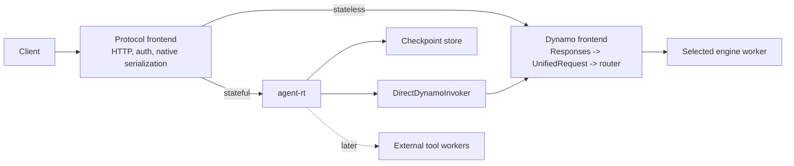
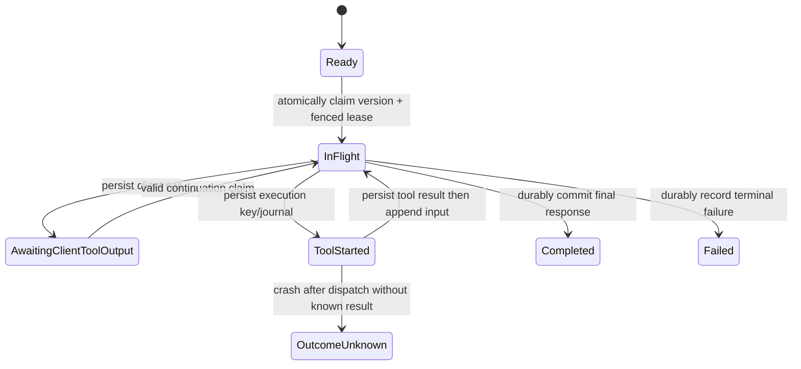

# Stateful Agent Traffic Runtime

**Status:** Direct-path Responses and Anthropic Messages vertical slices implemented; narrow MCP implementation, observability completion, and GAIE/EPP integration remain
**Scope:** A composition model for native OpenAI Responses and Anthropic Messages traffic, durable state, external tools, Kubernetes-native sandboxes, and Dynamo inference.
**Decision horizon:** Productionize the direct Dynamo path first; preserve the same boundaries for Dynamo GAIE/EPP Kubernetes deployments.

## Decision

Build `agent-rt` as an optional stateful module hosted by the existing **Dynamo protocol frontends**. It owns only durable turn records, protocol-specific continuation materialization, fenced checkpoint transitions, and coordination records for external tools. It is not a second public gateway, an engine adapter, an EPP extension, a process supervisor, or a replacement for Dynamo's request lifecycle.

Dynamo remains responsible for request preprocessing, `UnifiedRequest` conversion, `AgentContext` creation, routing, EPP, engine selection, inference, cancellation, task/process lifecycle, ingress retry policy, public HTTP errors, transport, and metrics. `agent-rt` invokes Dynamo through one narrow `InferenceInvoker` boundary:

- **Direct Dynamo invoker** for the local/non-EPP path.
- **Private Gateway/EPP invoker** for Kubernetes GAIE deployments.

The same `agent-rt` core is used in both paths and across supported frontend protocols. It has no vLLM, SGLang, or TRT-LLM-specific code and does not define a lossy universal agent-request IR.

The durable seams are trait-based: `AgentProtocol`, `CheckpointStore`, `InferenceInvoker`, `ToolRouter`, `ToolJournal`, `ToolExecutor`, `ToolFailurePolicy`, and `SandboxProvider`. Deployment assembly is intentionally concrete. The Dynamo Responses frontend currently composes Brave web search and an external sandbox provider in a small executor mux; adding a provider does not add an engine integration or change the runtime protocol.

## Why This Exists

For a Responses continuation request, Dynamo cannot infer on `previous_response_id` directly: a stateful component must authorize the checkpoint, load the prior model-visible items, append the new input, and send a complete request to inference. Anthropic clients such as Claude Code already send their complete Messages history, so their ordinary client-owned tool loop remains passthrough; the runtime is selected only for trusted durable-state policy or runtime-owned tools. The same component must coordinate any server-owned tool call and durably commit the next checkpoint.

This does **not** make Dynamo an agent framework. Putting response storage, MCP transports, sandbox credentials, tool retries, and workflow recovery in `dynamo-llm` would couple the normal stateless path to durable application state and external execution systems.

## Terms

Two components are called “frontend” in a GAIE deployment. They have different responsibilities and must not be conflated.

| Term | Meaning |
| --- | --- |
| **Protocol frontend** | Our public application/ingress service. It parses a native API such as OpenAI Responses or Anthropic Messages, authenticates callers, optionally calls `agent-rt`, and serializes the same native protocol. |
| **Dynamo frontend sidecar** | The per-worker Dynamo frontend selected by EPP. In GAIE it runs in `--router-mode direct` and forwards to its colocated worker; it does not run `agent-rt`. |
| **EPP** | Dynamo’s Rust Endpoint Picker Plugin. It receives a complete inference request through Envoy `ext_proc`, renders/tokenizes it for KV-aware worker selection, and injects routing headers. |
| **Dynamo carrier** | An approved, Dynamo-owned request-metadata handle forwarded by the invocation implementation. `agent-rt` neither parses nor constructs it. |

## Goals

- Support durable OpenAI Responses continuations beginning with `store` and `previous_response_id`.
- Preserve native Anthropic Messages requests for Claude Code; do not translate them through Responses or a universal agent IR.
- Keep Claude Code's complete-history, client-owned tool loop on the normal stateless path unless trusted server policy selects the runtime.
- Preserve Dynamo invocation metadata across every model step without making it part of the runtime domain model.
- Keep stateless requests off the state-store and agent-runtime path.
- Keep server-owned tools outside Dynamo, with separate credentials, egress, execution budgets, and recovery semantics.
- Run the same state runtime against direct Dynamo locally and through Dynamo EPP in Kubernetes.
- Provide one real runtime-owned web-search connector and one Kubernetes-native sandbox provider without moving either implementation into Dynamo or `agent-rt/core`.

## Non-Goals

- A new public “agent gateway” service or a second protocol ingress.
- Moving response persistence, MCP, web search, sandboxing, or generic workflow orchestration into Dynamo.
- Engine-specific agent adapters for vLLM, SGLang, or TRT-LLM.
- Making `AgentContext` an `agent-rt` data type or defining a portable agent-context wire protocol.
- Reimplementing vLLM rendering, tokenization, APC, or EPP cache-key hashing in `agent-rt`.
- Letting clients supply arbitrary MCP endpoints, credentials, or sandboxes.
- Claiming exactly-once external side effects without an executor outcome/idempotency contract.
- Durable SSE event replay or `Last-Event-ID` support in the first production slice.

## Ownership Boundary

| Area | Dynamo protocol frontend | `agent-rt` | Dynamo inference / EPP | External tool workers |
| --- | --- | --- | --- | --- |
| Public native wire parsing and serialization | Own | Consume native typed requests/results | No | No |
| Caller authentication | Own | Consume trusted authorization | No | Connector-specific auth only |
| Checkpoint authorization | Issue trusted scope | Enforce it for every read/write | No | No |
| Response/checkpoint persistence | No | Own | No | No |
| Continuation hydration | No | Own | Consume complete request only | No |
| Dynamo carrier | Create/approve | Forward opaquely | Interpret/create `AgentContext` | No |
| Inference invocation | Configure | Call injected invoker | Direct route or EPP worker selection | No |
| Native typed event contract | Own conversion from engine deltas | Observe for orchestration/commit | Produce engine deltas | No |
| SSE/WebSocket framing and client backpressure | Own | No | No | No |
| Client cancellation and request-task lifetime | Own | Invocation/stream is dropped by host | Cancel active engine context | Tool cancellation follows connector contract |
| Inference process loss and retry classification | Own detection, public status, and retry policy | Record only the resulting durable checkpoint transition | Own backend/process health signal | No |
| Public HTTP status/envelope mapping | Own | Return typed runtime/store errors | Return typed inference errors | Return typed connector errors |
| Metrics and tracing registry | Own | Emit structured lifecycle observations through host integration | Own engine/router metrics | Own connector/provider metrics |
| Request lowering / preprocessing | No | No | Own | No |
| KV-aware routing | No | Never select workers | Own: frontend router locally, EPP in GAIE | No |
| Engine/model selection | No | No | Own | No |
| Client function tools | Preserve protocol | Persist call/wait/resume | Parse model output | No |
| Runtime-owned tools | Declare policy | Authorize, journal, schedule | No | Execute |
| Tool credentials and egress | No | Select connector/policy | No | Own |

### Dynamo Boundary

The ordinary Dynamo native-protocol path remains:

```text
native Responses or Anthropic request
  -> UnifiedRequest
  -> backend request
  -> selected engine
  -> vLLM, SGLang, or TRT-LLM
```

`agent-rt` produces a fully materialized request in the same native frontend protocol before this path. It does not replace `UnifiedRequest`, translate Anthropic through Responses, or lower directly to an engine protocol.

### Native Protocol Families

`AgentProtocol` is a compile-time bundle of native request, replay-item, response, and stream-event DTOs. It is not a shared message schema. `CheckpointStore`, `RequestMaterializer`, `InferenceInvoker`, and `OutputInterpreter` are parameterized by that family.

| Family | Normal selection | Materialization |
| --- | --- | --- |
| OpenAI Responses | `store=true`, `previous_response_id`, explicit durable policy, or runtime-owned tools | Authorize and hydrate the response chain, clear model-facing lineage, and invoke Dynamo with complete native Responses input. |
| Anthropic Messages / Claude Code | Passthrough for ordinary complete-history requests and client-owned tools; select only for explicit durable policy or runtime-owned tools | Preserve the complete native Messages request. Runtime tool rounds append native assistant/tool-result Messages blocks. External Responses-style continuation chains are not invented. |

Output interpretation is protocol-specific. Responses output items become Responses replay items; Anthropic responses become native assistant Messages. Tool ownership remains trusted deployment policy rather than an inference from client-supplied tool names.

At Dynamo ingress, approved request metadata is decoded into Dynamo’s `AgentContext`. Dynamo derives the context needed by each internal model step from its own typed invocation carrier. `agent-rt` never constructs or stores `AgentContext`, raw headers, credentials, or transport state.

The direct in-process implementation carries only allowlisted Dynamo routing values between model steps. Dynamo recreates the native request context and `AgentContext`, applies header-over-body routing policy, performs `UnifiedRequest` conversion, and selects the engine on every invocation. The carrier is ephemeral and is not part of a checkpoint.

### Narrow Runtime Contracts

Only durable external seams are abstracted. Internal types should remain concrete.

```text
CheckpointStore
  claim / load / commit durable response-chain state

InferenceInvoker
  invoke a complete request in its native frontend protocol through Dynamo
  - DirectDynamoInvoker
  - EppGatewayInvoker

ToolExecutor
  execute an already-authorized runtime-owned tool request
```

The frontend supplies two data values to `agent-rt`:

```text
RuntimeAuthorization
  server-authenticated tenant/principal scope
  permitted tools/connectors and resource limits

DynamoInvocationHandle
  approved Dynamo-owned carrier and invocation policy
```

`RuntimeAuthorization` is not a bearer token, raw header map, or `AgentContext`. `DynamoInvocationHandle` is opaque to `agent-rt`; its Dynamo implementation owns carrier serialization, field allowlisting, compatibility, and encryption if recovery needs durable data.

### Current Implementation Snapshot

The direct-path vertical slice is split by responsibility rather than by engine:

| Component | Current implementation |
| --- | --- |
| Runtime contracts and orchestration | `frontend-crates/agent-rt/core`: native Responses materialization, pull-based stream observation, public response identity, tool rounds, checkpoint gating, and the traits above. |
| Durable response/tool state | `frontend-crates/agent-rt/store`: embedded SQLite and shared PostgreSQL implementations. |
| Read-only server tools | `frontend-crates/agent-rt/tools`: bounded Brave web search behind `ToolExecutor`. |
| Configured MCP connector (next) | `frontend-crates/agent-rt/mcp`: an `rmcp = "=3.1.4"`-backed `ToolExecutor` for trusted Streamable HTTP servers. The runtime core does not depend on the MCP SDK. |
| Sandbox contract and adapters | `frontend-crates/agent-rt/sandbox`: `SandboxProvider`, HTTP provider client, Kubernetes Agent Sandbox control plane, sandboxd data plane, and the durable execution supervisor. |
| Sandbox service | `frontend-crates/agent-rt/sandbox-service`: authenticated HTTP service, PostgreSQL execution fencing, operator catalog, container images, and Kubernetes manifests. It is deployed separately from Dynamo. |
| Dynamo composition | `dynamo-llm`'s optional `agent-rt-poc` feature: trusted ingress scope, filtered Dynamo carrier, native typed Responses and Anthropic streaming with Dynamo-owned SSE, SQLite runtime construction, and deployment-selected web-search/sandbox routes. |

Anthropic selection is trusted host policy. Ordinary Claude Code requests and client-owned tools stay on Dynamo's stateless Messages path. A request enters the durable runtime only when it declares a deployment-configured runtime tool or the operator sets `DYN_AGENT_RT_STATEFUL_ANTHROPIC=true`. Every model step then re-enters Dynamo's native Messages core; `agent-rt` does not perform Anthropic-to-chat conversion itself.

The current Dynamo sandbox route is enabled only when `DYN_AGENT_RT_SANDBOX_ENDPOINT` and a bearer token of at least 32 bytes are configured. `DYN_AGENT_RT_SANDBOX_PROFILE` selects an operator-known profile and `DYN_AGENT_RT_SANDBOX_TOOL_NAME` selects the model-visible name; the model cannot choose an image, namespace, executable, RuntimeClass, or network policy. Plain HTTP requires the explicit local/service-mesh opt-in `DYN_AGENT_RT_SANDBOX_ALLOW_HTTP=true`. `RuntimeAuthorization.permitted_connectors` must independently allow `sandbox`, so endpoint configuration alone does not authorize execution.

## Direct Dynamo: Local and Non-EPP Path



This is the first proof-of-concept topology. The invoker calls Dynamo’s matching native ingress over a private HTTP or equivalent Dynamo-owned in-process boundary. It must preserve the approved carrier and never call the public stateful dispatch path recursively.

### Stateful Request Flow

1. The protocol frontend authenticates the caller and creates `RuntimeAuthorization`.
2. It invokes `agent-rt` for requests with persistent state, `previous_response_id`, or runtime-owned tools. Stateless requests invoke Dynamo directly.
3. `agent-rt` claims the response chain, validates checkpoint access, hydrates prior model-visible items, resolves inherited tool definitions/tool choice, and appends the new input. Instructions are per-turn and do not carry across `previous_response_id`.
4. It clears `previous_response_id` only on the model-facing request. Storage retains the response lineage.
5. `DirectDynamoInvoker` invokes Dynamo with the complete native request and the approved carrier.
6. Dynamo derives `AgentContext`, lowers through `UnifiedRequest`, applies its normal routing policy, and invokes the selected engine.
7. Dynamo produces native typed response events. `agent-rt` observes those events without owning their transport, performs any required tool-loop transition, and commits the durable state transition.
8. Dynamo’s protocol frontend serializes the approved typed events to SSE or WebSocket. It withholds the terminal completion event until the `agent-rt` commit succeeds.

### Streaming Data Plane

Dynamo is the sole owner of public streaming:

```text
engine stream
  -> Dynamo Responses stream converter
  -> native typed ResponseStreamEvent
  -> pull-based agent-rt observation/orchestration
  -> Dynamo native event serializer
  -> SSE/WebSocket client
```

The stream is pull-based end to end. `agent-rt` does not spawn a producer, create an `mpsc` token queue, parse SSE, serialize protocol events, or hold a client socket. Backpressure and disconnect cancellation propagate through Dynamo’s existing response body and engine context.

For a request that declares no runtime-routed tool, typed deltas pass through with only identity/state observation. A request using `tool_choice: auto` can reveal a runtime-owned call only after its model step has already produced deltas, and public events cannot be retracted. Dynamo therefore selects bounded per-step staging up front whenever the request declares a function routed to the runtime. The initial `response.created` and `response.in_progress` lifecycle events may pass immediately; subsequent typed events are serialized only for byte accounting and held up to the trusted `RuntimeLimits.max_staged_model_event_bytes` limit. A runtime-tool step is discarded, while the final assistant step is released only after its checkpoint commits. Crossing the bound fails the turn closed without a false terminal event. Requests without runtime-routed tools—including normal Codex and Claude client-owned tool traffic—retain direct incremental streaming.

For a runtime-owned tool call, `agent-rt` consumes the completed call, durably journals and executes the tool, appends its result, and requests another typed Dynamo model stream while the same Dynamo public response writer stays open. A client-owned Codex or Claude tool call is committed as `AwaitingClientToolOutput` and returned to the client for execution; it does not create an internal model round. Each internal Dynamo model stream disarms its cancellation guard before yielding a terminal typed event, because `agent-rt` intentionally stops polling that completed step. Dropping the stream before a terminal event remains armed and cancels the active engine context. This distinguishes runtime step completion from an actual public-client disconnect without moving socket ownership into `agent-rt`.

The final typed response is retained for checkpoint replay. Dynamo may emit nonterminal deltas immediately, but it must not serialize `response.completed` until the terminal checkpoint commit succeeds. The first recovery contract is live, non-resumable delivery plus idempotent retrieval of the committed final response.

If inference, a runtime-owned tool, or the terminal checkpoint fails after HTTP 200 and the initial lifecycle events, `agent-rt` returns a typed orchestration error to its host and Dynamo serializes the protocol-native terminal failure (`response.failed`/`error` for Responses or an Anthropic `error` event) before closing the stream. The current POC still maps some post-header runtime failures to an `axum::Error`, which aborts the body; replacing that abort with native terminal error serialization is a v1 acceptance gate and remains a Dynamo protocol-frontend responsibility.

## Dynamo GAIE/EPP Kubernetes Path


The public and private routes are intentionally different:

- **Public route:** Client to the matching protocol frontend. It can invoke `agent-rt`.
- **Private inference route:** Protocol frontend to an `InferencePool`. It enters EPP and cannot re-enter public stateful dispatch.

The private route is the `EppGatewayInvoker` implementation. It sends every model step as a complete, materialized native request. EPP then selects the engine worker. The selected Dynamo frontend sidecar is in direct mode because EPP already made the selection.

### Why `agent-rt` Must Be Before EPP

EPP selects from the model-visible request body. A request containing only `previous_response_id` has no full history and therefore cannot yield a correct prefix-cache placement decision. Placing `agent-rt` in the selected worker sidecar would be too late for EPP selection and would tie durable state/tool scaling to worker replicas.

For every tool-loop model round:

```text
agent-rt hydrates or appends tool output
  -> private InferencePool route
  -> EPP renders/tokenizes the full request
  -> EPP selects a KV-local worker
  -> selected direct Dynamo frontend
  -> engine
```

EPP owns worker selection in GAIE. Dynamo owns the routing policy and EPP implementation; `agent-rt` never chooses a worker or treats a session identifier as proof of KV residency.

### EPP Requirements

The Kubernetes path requires endpoint-neutral rendering/tokenization. EPP must obtain the same routing token sequence that inference uses for a native Responses request. The current Rust EPP has Chat Completions-specific tokenization, so this is a Dynamo/vLLM prerequisite, not an `agent-rt` responsibility.

The target shared path is:

```text
native inference request
  -> authoritative renderer/tokenizer
  -> exact routing token sequence
  -> EPP KV-prefix scoring and worker selection
  -> normal engine inference using the same request semantics
```

`agent-rt` must not reproduce templates, tokenization, or canonical cache keys merely to make EPP work.

## Turn State Machine and Durability

Response-chain mutation requires a single-writer protocol. A final compare-and-swap alone is insufficient because two replicas could both hydrate, infer, stream, or execute a tool before one loses the final commit.



Required rules:

- Claim `Ready(version) -> InFlight(turn_id, lease)` atomically before any inference or tool invocation.
- Fence every later checkpoint commit with that claim/version.
- Make duplicate submission behavior explicit through an idempotency key and durable state lookup.
- Persist `AwaitingClientToolOutput` before returning a client-owned function call.
- Persist the final response checkpoint before emitting the terminal public completion event.
- Re-authorize each continuation against current `RuntimeAuthorization`; a recovered carrier is never proof of caller authorization.

### Host Failure Contract

The durable state machine does not duplicate Dynamo's request/task state machine. The boundary is:

| Event | Dynamo host responsibility | Durable runtime consequence |
| --- | --- | --- |
| Client cancellation | Stop polling the public body, cancel/drop the active invocation, classify cancellation metrics, and decide whether an HTTP response is still possible. | No independent cancellation watcher or HTTP mapping. An unfinished claim remains lease-governed and is recovered through the normal fenced claim path. |
| Backend process loss before terminal inference output | Detect the failed/missing-terminal invocation and apply the host's backend retry policy. | If the invocation is returned as failed, attempt a fenced `Failed` checkpoint; if the process itself disappears, the lease protects takeover. |
| Process loss before tool dispatch | Own task loss detection. | If no durable tool claim exists, takeover resumes from the prior checkpoint. Once the pre-dispatch claim exists, recovery uses the connector's idempotency/outcome contract even if the external call may not have started. |
| Process loss after tool dispatch | Own task loss detection; do not guess whether the external side effect happened. | Recover through `ToolJournal` lookup. Retry only for a connector with an idempotency/outcome contract; otherwise record `OutcomeUnknown`. |
| Terminal response | Serialize the native terminal event only after the runtime returns a successful fenced commit. | Compare-and-swap the terminal checkpoint with the active lease/version. |

There is intentionally no second generic `Cancelled` terminal state in v1. Cancellation is a Dynamo host outcome; durable ambiguity is represented by an active/expired lease or `OutcomeUnknown` after an external dispatch. If product semantics later require cancelled turns to be queryable as durable objects, that is a schema/API addition rather than an inference-lifecycle implementation in `agent-rt`.

The public mappings remain Dynamo policy: unknown/inaccessible state is `404`; idempotency mismatch, active turns, and non-replayable terminal turns are `409`; malformed native payloads are normalized by the protocol handler (`422` parsing failures become the protocol's validation response); and unavailable stores or unknown durable outcomes are `503`. `agent-rt` returns typed errors and never constructs an HTTP envelope.

### Streaming and Cancellation

The Dynamo protocol frontend remains the authority for client-facing protocol events. `agent-rt` observes events typed by the selected native protocol family and yields approved typed events back to Dynamo.

- Model deltas stream through a pull-based chain with no additional unbounded queue.
- The terminal `response.completed` event is emitted only after the final checkpoint commit.
- The first production version is explicitly non-resumable and provides idempotent final-result retrieval. Durable event replay is a later feature.
- A client disconnect does not make an external tool call safe to abandon. Cancellation policy is defined per response mode and tool class.
- Tool work has a separate bounded concurrency pool from inference. Per-turn limits include tool rounds, timeout, total external-work budget, output bytes, and cumulative token budget.

## Dynamo Invocation Carrier

The invoker forwards an approved Dynamo carrier for each model step. It must distinguish:

| Carrier class | Treatment |
| --- | --- |
| Stable affinity metadata | May remain stable over the active response turn when Dynamo policy permits it. |
| Per-step request metadata | Recomputed by Dynamo for every step, including input trigger and compaction behavior. |
| Credentials, trace headers, one-request hints | Never checkpoint data. |

An opaque `ForwardedCarrierSnapshot` may be stored only when server-tool-loop recovery requires it. The Dynamo invoker owns its schema, allowed fields, versioning, and encryption/capability protection. The checkpoint binds it to an authenticated tenant/principal scope, but it cannot be used to bypass fresh authorization.

## Tool Ownership and Execution

| Owner | Examples | Runtime behavior |
| --- | --- | --- |
| Client | Ordinary functions, editor/shell tools | Persist call state, return the call, and resume only on a valid submitted tool-output continuation. |
| Runtime | Configured MCP, web search, code/file sandbox | Authorize, journal, invoke a worker, persist normalized result, append it, and continue inference. |
| Backend | Explicit Dynamo/backend-native facility | Preserve the backend contract; do not misrepresent it as runtime-owned. |

Runtime-owned tools remain external to Dynamo:

- The first connector is read-only web search with deployment-owned credentials, an allowlisted provider endpoint, timeout/concurrency limits, bounded normalized results, and citation metadata.
- Broad MCP support is deferred. Future MCP connectors are deployment/tenant configured; clients cannot submit arbitrary server URLs or credential headers.
- Sandboxes use a provider-neutral external execution contract with filesystem, network, identity, resource, artifact, and retention policy. Kubernetes Agent Sandbox is the first reference provider, not a runtime requirement.
- Workers receive a scoped tool-execution request, not raw Dynamo headers or backend credentials.

Before dispatch, `agent-rt` writes a durable tool journal record keyed by response, tool-call ID, execution/idempotency key, and attempt. A `started` record alone cannot prove a side effect did not occur. Auto-retry is permitted only when the executor supports durable idempotency plus outcome lookup, or the tool is explicitly read-only/idempotent. Otherwise recovery transitions to `OutcomeUnknown` and follows a documented resolution policy.

### Configured MCP Plan

MCP is a configured runtime connector, not a client-supplied network capability and not an inference feature. The first seam is deliberately narrow:

```text
Dynamo protocol frontend policy
  -> request-declared tool matched against trusted name and schema
  -> agent-rt ToolRouter (connector=mcp, fixed profile/tool)
  -> durable ToolJournal claim
  -> agent-rt/mcp ToolExecutor (rmcp)
  -> one configured Streamable HTTP MCP server
```

`frontend-crates/agent-rt/mcp` is a separate crate implementing the existing `ToolExecutor`; it does not add a new public registry, catalog, or MCP-specific runtime trait. `agent-rt/core` remains SDK- and transport-independent. The crate's public API uses only agent-rt and plain serde types; `mcp/src/client.rs` is the private adapter that knows `rmcp`. Dynamo owns concrete deployment assembly and enables the route only when its trusted configuration is valid.

The first configuration is immutable for the process lifetime and contains one operator-selected server URL, one deployment-owned authorization profile, and a small allowlist of public tool name, remote tool name, description, closed input schema, timeout, and output limit. The configured descriptor is the source of truth. Until trusted frontend tool injection is added, the request must declare an allowed public tool with the same name and schema before Dynamo selects the runtime; a name-only match is forbidden. Clients cannot set the server URL, transport, headers, credentials, remote method, or replacement schema. Schema checks use JSON structural equality rather than serialized byte equality. The endpoint is parsed during startup, redirects are disabled, HTTPS is required outside an explicit loopback development mode, and no client headers are copied.

MCP v0 is a single deployment trust domain: authorization for the `mcp` connector grants the configured allowlist as a unit. Per-tenant or per-tool grants require a later authorization dimension and are not approximated by remote MCP annotations. Profiles are immutable and versioned across rollouts so a durable `Started` record cannot recover against a different server hidden behind a reused profile name.

The executor pins the official Rust MCP SDK and uses `ClientLifecycleMode::Auto`: modern servers use stateless discovery/request metadata, while older supported servers fall back to initialization and SDK-managed sessions. It owns one long-lived Streamable HTTP client per executor, paginated `tools/list`, and `tools/call`. Local configuration errors fail startup, but remote discovery and availability affect only route readiness; an unavailable MCP server does not prevent Dynamo's non-MCP inference frontend from starting. The executor verifies the configured allowlist against `tools/list`, fails the affected route closed on name/schema incompatibility, bounds the returned content before unbounded allocation, and normalizes structured or textual content into `ToolExecutionResult { output, is_error }`. MCP `isError` is a completed, journaled, model-visible result; timeout, network failure, malformed protocol, lifecycle rejection, and unsupported multi-round behavior are executor failures. Modern protocol state and legacy session IDs are transport internals and never checkpoint data; after process loss a read-only operation may establish a fresh session and recover through the journal contract.

Every first-slice tool is operator-classified as read-only. A completed `ToolJournal` entry is replayed without another remote call, and a process loss that leaves `Started` may recover through `lookup`, which can safely re-execute the configured read-only operation. The current `ToolRunner` marks an in-process timeout as terminal `OutcomeUnknown` and does not retry it; MCP v0 makes no broader timeout-retry claim unless core gains an explicit side-effect-free timeout disposition. Side-effecting tools, transmitted idempotency keys, remote outcome lookup, and general `OutcomeUnknown` resolution are later extensions and require an explicit executor contract.

V1 excludes client-supplied servers or headers, multiple servers, `stdio`, tool injection, resources, prompts, sampling, elicitation, roots, tasks, multi-round-trip tool requests, and dynamic tenant catalogs. The executor uses the SDK's one-round call API and rejects `InputRequired` or task-shaped results rather than fulfilling them through a broader client handler. If credential isolation or independent scaling later requires an external MCP bridge, it can implement the same `ToolExecutor` seam without changing core orchestration.

This is an outbound MCP client connector. It does not mount a public `/mcp` server, emit synthetic calls for the client to execute, or use MCP as a control plane. Tool durability remains entirely in `ToolRunner` and `ToolJournal`; the MCP executor performs one authorized remote call and returns one normalized result.

Implementation order:

1. Add `frontend-crates/agent-rt/mcp`, pin `rmcp = "=3.1.4"` with `default-features = false` and only `client`, `transport-streamable-http-client-reqwest`, and `reqwest`, and define the one-server configuration with secret-safe debug/serialization behavior.
2. Add `ToolExecutionResult.is_error` with `#[serde(default)]`, journal either value as `Completed`, map it directly to Anthropic `tool_result.is_error`, and define a stable model-visible Responses error envelope while keeping `function_call_output.status = completed`.
3. Implement discovery/initialize, list/schema verification, `call_tool_once`, cancellation, and result normalization behind `mcp/src/client.rs` with strict time, concurrency, pagination, response-size, and redirect bounds. Accept only `Complete`; reject `InputRequired` and task-shaped responses.
4. Test the adapter against deterministic Streamable HTTP fixtures for modern stateless discovery and legacy initialize/session fallback. Cover pagination, tool errors, protocol errors, timeout, cancellation, malformed and oversized results, schema drift, and credential non-persistence without using the SDK in the fixture.
5. Add the fixed `mcp` route to Dynamo's existing executor mux; require exact trusted request declarations and connector authorization.
6. Prove deterministic two-step unary and streaming Responses plus Anthropic HTTP flows: the first inference step emits the configured call, the mock MCP server counts exactly one outbound call, the second inference step receives the exact native result/error, and completed replay makes no new MCP or inference call. Force a post-header MCP failure and assert Dynamo emits the protocol-native terminal error rather than truncating SSE.
7. Keep a real Codex-to-Dynamo-to-MCP run opt-in as the final compatibility test rather than the primary semantic suite; instrument the outbound MCP call so this cannot accidentally prove Codex's client-owned MCP loop instead.
8. Reassess multi-server catalogs, tool injection, side effects, and an external bridge only from demonstrated deployment requirements.

### Sandbox Plane and Kubernetes Reference Provider

`agent-rt` invokes a generic `ToolExecutor`; it never creates Pods, calls `pods/exec`, mounts volumes, or manages sandbox credentials. The sandbox implementation is a separate service with a durable execution API:

```text
agent-rt ToolExecutor
  -> authenticated sandbox executor service
      -> SandboxProvider
          -> Kubernetes Agent Sandbox provider
          -> Agent Substrate provider (future)
          -> AgentENV/E2B provider (future)
          -> Modal provider (external deployment option)
```

Kubernetes is one `SandboxProvider` implementation. The frontend always stops at the authenticated provider contract: Dynamo and `agent-rt` do not depend on Kubernetes APIs or types. A deployment can replace the executor service with a Modal-compatible implementation, or assemble Agent Substrate, AgentENV, or another provider behind the same service contract. The isolation acceptance requirements below are therefore requirements for shipping the Kubernetes provider, not blockers for the provider abstraction or non-Kubernetes implementations.

The Kubernetes reference provider targets the Kubernetes SIG Apps Agent Sandbox APIs: `SandboxTemplate` defines an operator-approved image and security policy, `SandboxWarmPool` bounds prewarmed capacity, and a tenant-scoped `SandboxClaim` obtains one stable sandbox. Agent Sandbox is the Kubernetes lifecycle/control plane; it does not itself provide the container-isolation boundary. The template therefore selects an operator-allowlisted `RuntimeClass`: gVisor by default and Kata Containers when VM-grade isolation is required.

The implemented request path is:

```text
Dynamo Responses frontend
  -> HttpSandboxProvider (scoped bearer-authenticated request)
  -> agent-rt-sandbox-service
      -> PostgreSQL execution claim + lease + fence
      -> tenant/profile catalog lookup
      -> Kubernetes SandboxClaim API
      -> bound Sandbox status.serviceFQDN
      -> sandboxd gRPC process API and bounded REST file API
      -> atomic terminal execution + artifact commit
```

Only the executor service has narrowly scoped Kubernetes credentials. Dynamo and `agent-rt` do not. The service can create/get/delete `SandboxClaim`s and get the bound `Sandbox` only in operator-configured tenant namespaces. The current provider connects directly to the bound Sandbox service because the service is already inside the trusted cluster execution plane; ingress to sandboxd is restricted to the executor-service identity by NetworkPolicy. The upstream sandbox router or agentgateway can be added when a deployment needs a separately scalable proxy/authorization hop, but neither is the isolation mechanism.

The execution store uses database time, per-execution PostgreSQL advisory locks, row locks, renewable leases, and fencing tokens. An expired pending claim may be taken over; an expired running claim becomes `OutcomeUnknown` and is never blindly redispatched. Cancellation written by any service replica is observed by the lease owner and propagated to sandboxd. Terminal state and captured artifacts commit in one transaction before they become readable.

Every reference template is fail-closed:

- Dedicated tenant namespace and service account; `automountServiceAccountToken: false`.
- Restricted Pod Security, `RuntimeDefault` seccomp, no privilege escalation, dropped capabilities, non-root execution, and read-only root filesystem plus an explicitly bounded workspace.
- Default-deny ingress and egress NetworkPolicies; explicit per-tool egress policy is additive and auditable.
- CPU/memory/ephemeral-storage requests and limits, active deadline/idle TTL, process/output/file-count/artifact-size limits, and deterministic cleanup.
- No host paths, Docker socket, device mounts, host namespaces, host credentials, or arbitrary client-selected images/runtime classes.
- Execution IDs are authorization-scoped and idempotent. The service supports create-or-get, outcome lookup, cancellation, and artifact retrieval so `ToolJournal` recovery never blindly repeats a command.

The operator catalog is the capability boundary. It maps authenticated tenant IDs to namespaces and trusted profile names to warm pools, allowed executable, workspace TTL, and maximum timeout/output/artifact sizes. Client and model payloads can only reduce these ceilings. Claim metadata uses the upstream allowlisted `sandbox.users.io` label domain and a non-propagated workspace fingerprint annotation; callers cannot forge system selector labels.

The local Kind overlay is deliberately an orchestration proof, not an isolation certification. It validates service authentication, PostgreSQL durability, claim/warm-pool binding, sandboxd execution, idempotent lookup, artifact recovery, cancellation, foreground cleanup, and pool replenishment. It removes gVisor because the stock Kind node does not provide that RuntimeClass, and stock Kind networking must not be treated as proof that NetworkPolicy is enforced. Shipping this Kubernetes provider for untrusted production execution therefore requires a cluster with an enforcing CNI plus the selected gVisor/Kata RuntimeClass and negative tests for host escape, cross-tenant/internal/metadata egress, resource exhaustion, cancellation, and cleanup. Those checks do not apply to a hosted provider such as Modal; that provider needs its own threat-model and acceptance suite.

Provider assessment:

| Project | Role in this design | Decision |
| --- | --- | --- |
| Kubernetes SIG Agent Sandbox | Kubernetes CRD/claim/template/warm-pool lifecycle; isolation is supplied by the configured runtime and policy | Reference in-cluster provider and implemented control plane. |
| Agent Substrate | Takes actor placement off the Kubernetes API hot path, multiplexes actors onto workers, and supports snapshots plus gVisor/microVM classes | Future high-density `SandboxProvider` when its control plane and operational contract fit our tenancy requirements. |
| AgentENV | Firecracker environments, snapshots, E2B-compatible API, and Kubernetes deployment | Future strong-isolation provider. Current upstream warns that the public API has no authorization, and first-class multi-tenancy remains open, so it must sit behind our authenticated service boundary. |
| agentgateway | Kubernetes Gateway API routing/auth/policy for LLM, HTTP, and MCP backends | Optional ingress in front of sandbox/MCP services, not a sandbox isolation provider. |
| Modal Sandboxes | Hosted sandbox API with exec, files, lifecycle, timeout, termination, and filesystem/memory snapshot facilities | External `SandboxProvider` and API-behavior benchmark; not the Kubernetes-native reference. |

## Persistent State

The first store needs append-oriented records and bounded retention, not copied full response histories at every turn.

```text
ResponseCheckpoint
  response_id / parent_response_id
  tenant/principal scope
  status, version, turn lease, idempotency key
  model-visible input/output item references
  per-turn instructions and effective tools/tool choice
  renderer/tokenization compatibility fingerprint where required

ToolJournalEntry
  response_id / tool_call_id
  execution idempotency key / attempt
  owner and connector identity
  status: started | completed | failed | outcome_unknown
  normalized result reference or failure

ForwardedCarrierSnapshot (optional)
  Dynamo-invoker-owned opaque affinity metadata
  versioned and protected at rest
```

Large artifacts and raw tool payloads are externalized with redacted checkpoint metadata. The state store enforces retention, maximum retained model-visible items/tokens, and a versioned compaction policy.

- SQLite is the v1 store for embedded development, local durable execution, restart tests, and explicitly single-replica deployments. It runs with foreign keys, WAL, `synchronous=FULL`, and a bounded busy timeout; store operations use blocking workers and serialized connection access. It is not presented as a shared HA database or a Kubernetes multi-replica configuration. Dynamo selects a durable file with `DYN_AGENT_RT_SQLITE_PATH`; omitting it uses an explicitly non-durable in-memory store.
- PostgreSQL implements the same traits and remains available for shared-state development, but wiring it into the Dynamo deployment is post-v1. Shipping SQLite does not imply that the PostgreSQL HA acceptance matrix is complete.
- Both stores use parent-linked append-oriented rows so write amplification is O(current turn), not O(conversation history).

Before v1, add a deliberately small SQLite migration policy: a monotonic internal schema version; only forward, transactional migrations supported by the running binary; fail closed on a newer on-disk version; and restore-from-backup rather than reverse migration for downgrade. Any migration that rewrites checkpoint semantics requires a compatibility test with a database produced by the previous release. The current single `0001` bootstrap migration does not yet satisfy this release requirement.

## Observability Boundary

Dynamo owns the metrics registry, request spans, public request IDs, protocol/HTTP status, cancellation classification, engine timing, and EPP/router telemetry. `agent-rt` must not create a competing metrics server or redefine Dynamo request success.

The runtime exposes structured lifecycle observations to its host for durable-only facts: protocol family, new versus replayed turn, checkpoint state transition, claim/commit latency, lease conflict/takeover, staged bytes, model-step count, tool-round count, connector/profile, tool journal recovery path, and terminal checkpoint failure. Labels never contain response IDs, idempotency keys, tenant/principal IDs, prompts, tool arguments, credentials, or arbitrary tool names; those belong in scoped traces/logs when permitted, not metric cardinality.

The direct implementation already records each re-entered native Dynamo model step under the existing Responses or Anthropic endpoint metrics and preserves Dynamo disconnect cancellation. Remaining v1 work is to add runtime/store/tool observations through a host-supplied sink or tracing events, correlate them with the public request span, and add dashboards/alerts for checkpoint-store unavailability, active-turn conflicts, unknown outcomes, terminal-commit failures, tool latency/errors, and replay ratio.

## Comparison with vLLM Agentic API

The desired traffic placement is similar:

```text
Client -> stateful Responses stage -> llm-d/EPP -> selected vLLM worker
```

Agentic API provides that stateful stage as a standalone gateway and invokes a configured HTTP `llm_api_base`. Current main includes SQLite/PostgreSQL completed-response persistence, live SSE/WebSocket streaming, MCP/web search, and Messages tool loops. It still persists after inference/tool execution rather than durably claiming in-flight work, has no request idempotency/fenced lease/tool journal, and does not provide a Dynamo-aware per-step carrier. Its Praxis adapter remains a placeholder.

Our difference is not a claim that their placement is wrong. We compose state handling into the existing Responses frontend from the outset, make inference a narrow injected boundary, and keep Dynamo-specific request context/routing in Dynamo. We learn from Agentic API’s Responses compatibility and failure cases but define our own store, tool policy, state machine, and frontend/Dynamo contract.

| Question | vLLM Agentic API today | This design |
| --- | --- | --- |
| First public hop | Standalone Agentic API service receives traffic before the configured vLLM/llm-d endpoint. | Existing native protocol frontend receives traffic; `agent-rt` is an optional module in that frontend. |
| Consumption unit | Primarily the service as a whole. | Traits and protocol-family modules are reusable; the external sandbox is independently deployable. |
| Inference boundary | HTTP `llm_api_base`/gateway adapter. | Injected `InferenceInvoker`; direct in-process Dynamo now, private Gateway/EPP next hop in GAIE. |
| Gateway/EPP placement | Agentic API hydrates first and sends the full request to the downstream gateway. | Same required ordering. The public frontend hydrates first, then the private InferencePool route/EPP sees the full model-visible request. |
| Streaming | Standalone service owns its client connection and transport. | Dynamo's protocol frontend owns typed event conversion, SSE, backpressure, metrics, and disconnect cancellation; `agent-rt` only observes/orchestrates. |
| Dynamo context | No Dynamo-owned carrier/`AgentContext` boundary. | Dynamo receives a filtered ephemeral carrier and creates `AgentContext` at each normal inference ingress. |
| Side effects | Persistence and tool facilities are service features. | A fenced turn store plus a separate tool journal; sandbox execution adds its own fenced provider store and lookup contract. |

This agrees with the desired “responses next-hop proxy” shape without making the runtime itself an Envoy extension. In GAIE, the native stateful frontend is the public responses-enablement stage; the private Gateway/EPP path is its only inference next hop. An `ext_proc`/endpoint-picker deployment can select that stage, but hydration and server-tool orchestration do not run inside EPP or a worker sidecar.

## Delivery Plan

### Phase 0: validated direct-Dynamo continuation POC — complete

- Protocol-generic `agent-rt`, in-process Dynamo Responses invoker, scoped continuation/idempotency semantics, client-owned Codex tool round-trip, and Qwen3.8-27B-FP8 validation are complete on the POC branches.

### Phase 1: production direct-Dynamo vertical slice — implementation complete, acceptance in progress

Implemented:

- Dynamo converts engine output into native typed Responses events, owns SSE serialization/keepalive/backpressure/disconnect context, and withholds the terminal completion event until the runtime commits it.
- Dynamo now exposes the same typed in-process seam for Anthropic Messages. Stateful Anthropic requests preserve native Messages DTOs, runtime tool rounds append native assistant/tool-result blocks, public IDs use `msg_...`, and Dynamo remains the SSE serializer and inference host.
- `agent-rt` observes the pull-based stream, rewrites public identity, coordinates multiple model/tool steps, and owns no socket, SSE encoder, or token queue.
- Trusted local/proxy authorization, typed non-leaking HTTP failures, a filtered non-durable Dynamo invocation carrier, and connector authorization are wired at ingress.
- SQLite and PostgreSQL implement checkpoint and tool-journal traits. The v1 Dynamo deployment target is one frontend replica with a durable SQLite path; PostgreSQL wiring and multi-replica claims are not part of the v1 promise.
- Brave web search runs through the durable tool loop with a deployment-owned credential, read-only recovery, timeout/concurrency/output limits, and normalized results.
- The authenticated external sandbox service, PostgreSQL execution store, Kubernetes Agent Sandbox provider, sandboxd adapter, hardened base manifests, images, and disposable Kind proof are implemented. Kind currently proves execution, lookup, artifacts, cancellation, and cleanup—not gVisor/Kata or CNI isolation.
- Qwen3.8-27B-FP8 on `try6767` completed a two-step runtime-owned Python call through Dynamo and the local Kubernetes provider. The public stream exposed only lifecycle plus final assistant events; PostgreSQL independently recorded `42\n` and the 16-byte `model-proof.txt` artifact. The exact replay returned the same response ID in 26 ms without another sandbox execution.
- A post-fix `codex exec` client-owned shell round trip completed through the same Dynamo frontend, and a forced 352 ms client timeout was recorded as cancellation while all normally completed internal steps were recorded as success. After replacing the frontend process, replay of a pre-restart key returned the original response ID in 24 ms without inference or sandbox execution.

Remaining cross-provider acceptance work, in order:

1. Implement and test the versioned SQLite migration/startup policy described above.
2. Add host-integrated runtime/store/tool observations and the first dashboard/alerts without duplicating Dynamo inference metrics.
3. Implement the narrow configured MCP slice above; broader catalogs, side effects, and MCP capability breadth remain deferred.
4. Add a deployment-level checkpoint-store failure injector if live fault testing beyond the deterministic runtime contract test is required; `agent-rt` already proves that an injected terminal commit failure releases neither staged deltas nor `response.completed`.
5. Exercise one live Brave request when deployment credentials are available.

Kubernetes-provider-specific acceptance, which does not block other `SandboxProvider` implementations:

1. Run the production manifest on an enforcing-CNI cluster with gVisor and, where required, Kata.
2. Execute the negative host-escape, cross-tenant/internal/metadata-egress, resource-exhaustion, cancellation, and cleanup suite.

### Phase 2: Dynamo GAIE/EPP path

- Add endpoint-neutral authoritative rendering/tokenization to the Dynamo/vLLM EPP path.
- Implement `EppGatewayInvoker` against a private `InferencePool` route.
- Verify every request reaches EPP after hydration and then a direct worker frontend.
- Benchmark direct/frontend routing versus EPP placement with correct-pod, wrong-pod, eviction, event-lag, and restart cases.

### Phase 3: later tool breadth

- Multiple MCP servers, dynamic tenant catalogs, trusted tool injection, and additional MCP capabilities only after the narrow connector is accepted.
- Additional sandbox providers only through the stable external provider contract.
- Parallel tool scheduling only after call dependencies, idempotency, output ordering, and resource accounting are established.

## Production-Slice Success Criteria

- A two-turn Responses continuation returns correct model-visible history without client replay.
- A Claude Code Messages request remains native Anthropic input/output and takes the stateless path unless trusted policy selects runtime work.
- Dynamo receives a fully materialized native request and derives `AgentContext` at normal ingress for every model step.
- Stateless requests incur no state-store lookup or `agent-rt` execution.
- A client-owned function call persists a wait state and resumes correctly with submitted tool output.
- Lease/fencing prevents duplicate inference for concurrent continuation submissions.
- Terminal public completion is never emitted before durable terminal state.
- No bearer tokens, arbitrary inbound headers, tool credentials, or raw traces enter checkpoint storage.
- SQLite survives process restart in a single-replica deployment, rejects incompatible schema versions, and applies supported forward migrations transactionally. Multi-replica Dynamo deployment is explicitly unsupported until PostgreSQL is wired and accepted.
- A real web-search call executes server-side, is journaled, feeds a second Dynamo model step, and recovers without blind redispatch.
- One configured read-only MCP tool executes through Streamable HTTP, is schema-verified and journaled, feeds a second native model step, and cannot receive a client-selected endpoint, header, credential, or remote method.
- The Kubernetes sandbox provider is tenant-scoped, deny-network by default, bounded, cancellable, lookup-safe by execution ID, and cleaned up deterministically; other providers satisfy the same behavioral contract with provider-specific isolation evidence.
- The same direct POC works against all engines already configured behind Dynamo without agent-runtime engine code.

## Open Decisions

1. What production capability/token format replaces the current local or trusted-proxy construction of `RuntimeAuthorization`?
2. What retention/compaction policy and artifact store are acceptable for SQLite/PostgreSQL deployments?
3. What later use case justifies adding resumable SSE beyond live streaming plus final-result retrieval?
4. Does any stable Dynamo affinity metadata need durable recovery beyond the current per-request filtered carrier? The default decision remains no until a measured recovery case requires it.
5. What is the endpoint-neutral renderer/tokenizer contract used by Rust EPP for native Responses requests?
6. Which Kubernetes clusters and RuntimeClasses are required for the first gVisor/Kata integration matrix?

## References

- Dynamo Responses ingress: `lib/llm/src/http/service/openai.rs`
- Dynamo unified protocol boundary: `lib/llm/src/protocols/unified.rs`
- Dynamo agent context: `lib/llm/src/protocols/common/extensions.rs` and `lib/llm/src/protocols/agents.rs`
- Dynamo Rust EPP boundary: `deploy/inference-gateway/ext-proc/src/picker.rs` and `deploy/inference-gateway/ext-proc/src/server.rs`
- Dynamo GAIE deployment guide: `docs/fern/pages/kubernetes/kv-aware-routing/gateway-api.mdx`
- [vLLM Agentic API core ADR](https://github.com/vllm-project/agentic-api/blob/main/docs/adr/ADR-01_core.md)
- [vLLM Agentic API gateway integration ADR](https://github.com/vllm-project/agentic-api/blob/main/docs/adr/ADR-03_gateway_integration.md)
- [vLLM Agentic API KV-affine routing plan](https://github.com/vllm-project/agentic-api/issues/69)
- [vLLM Agentic API exact Responses/llm-d routing plan](https://github.com/vllm-project/agentic-api/issues/73)
- [Official Model Context Protocol Rust SDK](https://github.com/modelcontextprotocol/rust-sdk)
- [Kubernetes SIG Agent Sandbox](https://agent-sandbox.sigs.k8s.io/docs/)
- [Agent Sandbox threat model](https://github.com/kubernetes-sigs/agent-sandbox/blob/main/docs/security/threat_model.md)
- [Agent Substrate](https://github.com/agent-substrate/substrate)
- [AgentENV](https://github.com/kvcache-ai/AgentENV)
- [AgentENV multi-tenancy gap](https://github.com/kvcache-ai/AgentENV/issues/10)
- [agentgateway Kubernetes MCP routing](https://agentgateway.dev/docs/kubernetes/latest/quickstart/mcp/)
- [Modal Sandboxes](https://modal.com/docs/guide/sandboxes)
