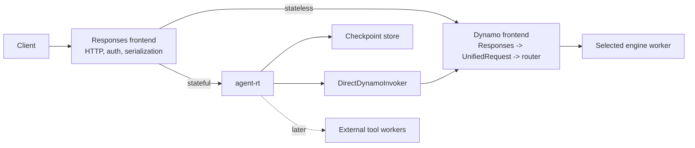
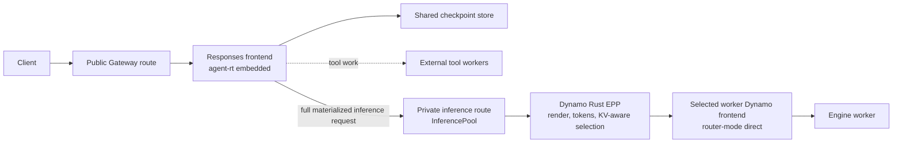
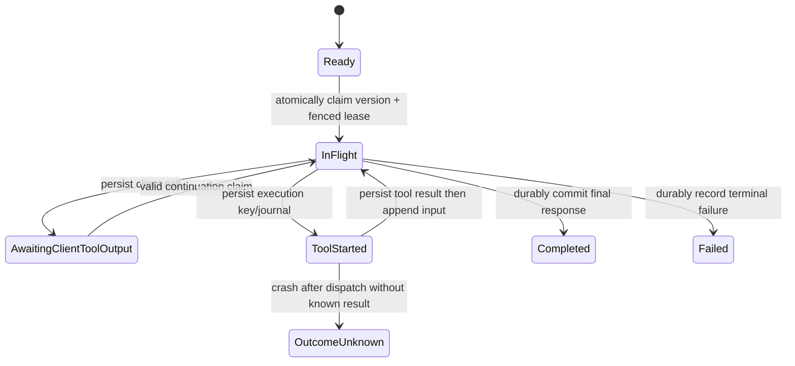

# Stateful Agent Traffic Runtime

**Status:** Draft
**Scope:** A composition model for stateful OpenAI Responses traffic, external tools, and Dynamo inference.
**Decision horizon:** First prove direct Dynamo locally; then add the Dynamo GAIE/EPP Kubernetes path.

## Decision

Build `agent-rt` as an optional stateful module in the existing **Responses frontend**. It owns response-chain state, continuation hydration, and coordination of external tools. It is not a second public gateway, an engine adapter, an EPP extension, or a Dynamo concept.

Dynamo remains responsible for request preprocessing, `UnifiedRequest` conversion, `AgentContext` creation, routing, EPP, engine selection, and inference. `agent-rt` invokes Dynamo through one narrow `InferenceInvoker` boundary:

- **Direct Dynamo invoker** for the local/non-EPP path.
- **Private Gateway/EPP invoker** for Kubernetes GAIE deployments.

The same `agent-rt` core is used in both paths. It has no vLLM, SGLang, or TRT-LLM-specific code.

## Why This Exists

For a continuation request, Dynamo cannot infer on `previous_response_id` directly: a stateful component must authorize the checkpoint, load the prior model-visible items, append the new input, and send a complete request to inference. The same component must coordinate any server-owned tool call and durably commit the next checkpoint.

This does **not** make Dynamo an agent framework. Putting response storage, MCP transports, sandbox credentials, tool retries, and workflow recovery in `dynamo-llm` would couple the normal stateless path to durable application state and external execution systems.

## Terms

Two components are called “frontend” in a GAIE deployment. They have different responsibilities and must not be conflated.

| Term | Meaning |
| --- | --- |
| **Responses frontend** | Our public application/ingress service. It parses the Responses API, authenticates callers, optionally calls `agent-rt`, and serializes the public response. |
| **Dynamo frontend sidecar** | The per-worker Dynamo frontend selected by EPP. In GAIE it runs in `--router-mode direct` and forwards to its colocated worker; it does not run `agent-rt`. |
| **EPP** | Dynamo’s Rust Endpoint Picker Plugin. It receives a complete inference request through Envoy `ext_proc`, renders/tokenizes it for KV-aware worker selection, and injects routing headers. |
| **Dynamo carrier** | An approved, Dynamo-owned request-metadata handle forwarded by the invocation implementation. `agent-rt` neither parses nor constructs it. |

## Goals

- Support durable OpenAI Responses continuations beginning with `store` and `previous_response_id`.
- Preserve Dynamo invocation metadata across every model step without making it part of the runtime domain model.
- Keep stateless requests off the state-store and agent-runtime path.
- Keep server-owned tools outside Dynamo, with separate credentials, egress, execution budgets, and recovery semantics.
- Run the same state runtime against direct Dynamo locally and through Dynamo EPP in Kubernetes.
- Keep the first implementation narrow enough to prove state, routing, and failure semantics before adding MCP or sandbox execution.

## Non-Goals

- A new public “agent gateway” service or a second protocol ingress.
- Moving response persistence, MCP, web search, sandboxing, or generic workflow orchestration into Dynamo.
- Engine-specific agent adapters for vLLM, SGLang, or TRT-LLM.
- Making `AgentContext` an `agent-rt` data type or defining a portable agent-context wire protocol.
- Reimplementing vLLM rendering, tokenization, APC, or EPP cache-key hashing in `agent-rt`.
- Letting clients supply arbitrary MCP endpoints, credentials, or sandboxes.
- Claiming exactly-once external side effects without an executor outcome/idempotency contract.

## Ownership Boundary

| Area | Responses frontend | `agent-rt` | Dynamo / EPP | External tool workers |
| --- | --- | --- | --- | --- |
| Public Responses wire parsing and serialization | Own | Consume normalized request/events | No | No |
| Caller authentication | Own | Consume trusted authorization | No | Connector-specific auth only |
| Checkpoint authorization | Issue trusted scope | Enforce it for every read/write | No | No |
| Response/checkpoint persistence | No | Own | No | No |
| Continuation hydration | No | Own | Consume complete request only | No |
| Dynamo carrier | Create/approve | Forward opaquely | Interpret/create `AgentContext` | No |
| Inference invocation | Configure | Call injected invoker | Direct route or EPP worker selection | No |
| Request lowering / preprocessing | No | No | Own | No |
| KV-aware routing | No | Never select workers | Own: frontend router locally, EPP in GAIE | No |
| Engine/model selection | No | No | Own | No |
| Client function tools | Preserve protocol | Persist call/wait/resume | Parse model output | No |
| Runtime-owned tools | Declare policy | Authorize, journal, schedule | No | Execute |
| Tool credentials and egress | No | Select connector/policy | No | Own |

### Dynamo Boundary

The ordinary Dynamo Responses path remains:

```text
NvCreateResponse
  -> UnifiedRequest
  -> NvCreateChatCompletionRequest
  -> selected engine
  -> vLLM, SGLang, or TRT-LLM
```

`agent-rt` produces a fully materialized native Responses request before this path. It does not replace `UnifiedRequest` and does not lower directly to an engine protocol.

At Dynamo ingress, headers are decoded into Dynamo’s `AgentContext`. That context is recomputed for each model step because fields such as input trigger and session-final lifecycle intent are step-specific. `agent-rt` never constructs or stores `AgentContext`.

### Narrow Runtime Contracts

Only durable external seams are abstracted. Internal types should remain concrete.

```text
CheckpointStore
  claim / load / commit durable response-chain state

InferenceInvoker
  invoke a complete native Responses request through Dynamo
  - DirectDynamoInvoker
  - EppGatewayInvoker

ToolExecutor
  execute an already-authorized runtime-owned tool request
```

The frontend supplies two data values to `agent-rt`:

```text
RuntimeAuthorization
  server-authenticated tenant/principal scope
  permitted tools/connectors and resource limits

DynamoInvocationHandle
  approved Dynamo-owned carrier and invocation policy
```

`RuntimeAuthorization` is not a bearer token, raw header map, or `AgentContext`. `DynamoInvocationHandle` is opaque to `agent-rt`; its Dynamo implementation owns carrier serialization, field allowlisting, compatibility, and encryption if recovery needs durable data.

## Direct Dynamo: Local and Non-EPP Path



This is the first proof-of-concept topology. The invoker calls Dynamo’s normal Responses ingress over a private HTTP or equivalent Dynamo-owned in-process boundary. It must preserve the approved carrier and never call the public Responses dispatch path recursively.

### Stateful Request Flow

1. The Responses frontend authenticates the caller and creates `RuntimeAuthorization`.
2. It invokes `agent-rt` for requests with persistent state, `previous_response_id`, or runtime-owned tools. Stateless requests invoke Dynamo directly.
3. `agent-rt` claims the response chain, validates checkpoint access, hydrates prior model-visible items, resolves inherited tool definitions/tool choice, and appends the new input. Instructions are per-turn and do not carry across `previous_response_id`.
4. It clears `previous_response_id` only on the model-facing request. Storage retains the response lineage.
5. `DirectDynamoInvoker` invokes Dynamo with the complete native request and the approved carrier.
6. Dynamo derives `AgentContext`, lowers through `UnifiedRequest`, applies its normal routing policy, and invokes the selected engine.
7. `agent-rt` commits the durable state transition and returns typed Responses events through the frontend.

## Dynamo GAIE/EPP Kubernetes Path



The public and private routes are intentionally different:

- **Public route:** Client to the Responses frontend. It can invoke `agent-rt`.
- **Private inference route:** Responses frontend to an `InferencePool`. It enters EPP and cannot re-enter public stateful dispatch.

The private route is the `EppGatewayInvoker` implementation. It sends every model step as a complete, materialized native request. EPP then selects the engine worker. The selected Dynamo frontend sidecar is in direct mode because EPP already made the selection.

### Why `agent-rt` Must Be Before EPP

EPP selects from the model-visible request body. A request containing only `previous_response_id` has no full history and therefore cannot yield a correct prefix-cache placement decision. Placing `agent-rt` in the selected worker sidecar would be too late for EPP selection and would tie durable state/tool scaling to worker replicas.

For every tool-loop model round:

```text
agent-rt hydrates or appends tool output
  -> private InferencePool route
  -> EPP renders/tokenizes the full request
  -> EPP selects a KV-local worker
  -> selected direct Dynamo frontend
  -> engine
```

EPP owns worker selection in GAIE. Dynamo owns the routing policy and EPP implementation; `agent-rt` never chooses a worker or treats a session identifier as proof of KV residency.

### EPP Requirements

The Kubernetes path requires endpoint-neutral rendering/tokenization. EPP must obtain the same routing token sequence that inference uses for a native Responses request. The current Rust EPP has Chat Completions-specific tokenization, so this is a Dynamo/vLLM prerequisite, not an `agent-rt` responsibility.

The target shared path is:

```text
native inference request
  -> authoritative renderer/tokenizer
  -> exact routing token sequence
  -> EPP KV-prefix scoring and worker selection
  -> normal engine inference using the same request semantics
```

`agent-rt` must not reproduce templates, tokenization, or canonical cache keys merely to make EPP work.

## Turn State Machine and Durability

Response-chain mutation requires a single-writer protocol. A final compare-and-swap alone is insufficient because two replicas could both hydrate, infer, stream, or execute a tool before one loses the final commit.



Required rules:

- Claim `Ready(version) -> InFlight(turn_id, lease)` atomically before any inference or tool invocation.
- Fence every later checkpoint commit with that claim/version.
- Make duplicate submission behavior explicit through an idempotency key and durable state lookup.
- Persist `AwaitingClientToolOutput` before returning a client-owned function call.
- Persist the final response checkpoint before emitting the terminal public completion event.
- Re-authorize each continuation against current `RuntimeAuthorization`; a recovered carrier is never proof of caller authorization.

### Streaming and Cancellation

The frontend remains the authority for client-facing protocol events. `agent-rt` consumes and produces a normalized event stream.

- Model deltas may stream immediately through bounded channels.
- The terminal `response.completed` event is emitted only after the final checkpoint commit.
- The first production version must choose one explicit recovery contract: a durable resumable event journal, or at-least-once/non-resumable streaming with idempotent final-result retrieval.
- A client disconnect does not make an external tool call safe to abandon. Cancellation policy is defined per response mode and tool class.
- Tool work has a separate bounded concurrency pool from inference. Per-turn limits include tool rounds, timeout, total external-work budget, output bytes, and cumulative token budget.

## Dynamo Carrier and Session Lifecycle

The invoker forwards an approved Dynamo carrier for each model step. It must distinguish:

| Carrier class | Treatment |
| --- | --- |
| Stable affinity metadata | May remain stable over the active response turn when Dynamo policy permits it. |
| Per-step lifecycle intent | Recomputed for every step: input trigger, compaction behavior, and session-final directives. |
| Credentials, trace headers, one-request hints | Never checkpoint data. |

An opaque `ForwardedCarrierSnapshot` may be stored only when server-tool-loop recovery requires it. The Dynamo invoker owns its schema, allowed fields, versioning, and encryption/capability protection. The checkpoint binds it to an authenticated tenant/principal scope, but it cannot be used to bypass fresh authorization.

In particular, a session-final signal must not be blindly replayed on an intermediate tool-loop request: it can cause Dynamo KV policy to evict a session before the following model step.

## Tool Ownership and Execution

| Owner | Examples | Runtime behavior |
| --- | --- | --- |
| Client | Ordinary functions, editor/shell tools | Persist call state, return the call, and resume only on a valid submitted tool-output continuation. |
| Runtime | Configured MCP, web search, code/file sandbox | Authorize, journal, invoke a worker, persist normalized result, append it, and continue inference. |
| Backend | Explicit Dynamo/backend-native facility | Preserve the backend contract; do not misrepresent it as runtime-owned. |

Runtime-owned tools remain external to Dynamo:

- MCP connectors are deployment/tenant configured. Clients cannot submit arbitrary server URLs or credential headers.
- Web search is a bounded connector with rate, result-size, and citation policies.
- Sandboxes are an isolated execution plane with filesystem, network, and resource policy.
- Workers receive a scoped tool-execution request, not raw Dynamo headers or backend credentials.

Before dispatch, `agent-rt` writes a durable tool journal record keyed by response, tool-call ID, execution/idempotency key, and attempt. A `started` record alone cannot prove a side effect did not occur. Auto-retry is permitted only when the executor supports durable idempotency plus outcome lookup, or the tool is explicitly read-only/idempotent. Otherwise recovery transitions to `OutcomeUnknown` and follows a documented resolution policy.

## Persistent State

The first store needs append-oriented records and bounded retention, not copied full response histories at every turn.

```text
ResponseCheckpoint
  response_id / parent_response_id
  tenant/principal scope
  status, version, turn lease, idempotency key
  model-visible input/output item references
  per-turn instructions and effective tools/tool choice
  renderer/tokenization compatibility fingerprint where required

ToolJournalEntry
  response_id / tool_call_id
  execution idempotency key / attempt
  owner and connector identity
  status: started | completed | failed | outcome_unknown
  normalized result reference or failure

ForwardedCarrierSnapshot (optional)
  Dynamo-invoker-owned opaque affinity metadata
  versioned and protected at rest
```

Large artifacts and raw tool payloads are externalized with redacted checkpoint metadata. The state store enforces retention, maximum retained model-visible items/tokens, and a versioned compaction policy. A local SQLite store is sufficient for the single-process POC; multi-replica operation requires a transactional shared store.

## Comparison with vLLM Agentic API

The desired traffic placement is similar:

```text
Client -> stateful Responses stage -> llm-d/EPP -> selected vLLM worker
```

Agentic API currently provides that stateful stage as a standalone gateway and invokes a configured HTTP `llm_api_base`. Its published llm-d plan likewise hydrates the continuation before EPP, then uses authoritative vLLM rendering/tokenization for exact prefix routing. Its planned Praxis adapter would make the core more composable, but that adapter is not implemented today.

Our difference is not a claim that their placement is wrong. We compose state handling into the existing Responses frontend from the outset, make inference a narrow injected boundary, and keep Dynamo-specific request context/routing in Dynamo. We learn from Agentic API’s Responses compatibility and failure cases but define our own store, tool policy, state machine, and frontend/Dynamo contract.

## Incremental Plan

### Phase 0: direct-Dynamo continuation POC

- Run `agent-rt` in the Responses frontend.
- Route only `store=true` and `previous_response_id` requests through it.
- Implement `RuntimeAuthorization`, atomic turn claim, checkpoint persistence, hydration, and terminal commit gating.
- Implement `DirectDynamoInvoker` through normal Dynamo Responses ingress.
- Support text and client-owned functions only.
- Verify carrier handling across one response chain; no durable carrier snapshot and no runtime-owned tools yet.

### Phase 1: production state semantics

- Shared transactional store, tenancy isolation, idempotency, leases/fencing, retention, and compaction.
- Explicit streaming/recovery/cancellation contract and bounded buffering.
- Defined carrier classes and changed-carrier policy in the Dynamo invoker.
- Durable client-tool continuation states.

### Phase 2: Dynamo GAIE/EPP path

- Add endpoint-neutral authoritative rendering/tokenization to the Dynamo/vLLM EPP path.
- Implement `EppGatewayInvoker` against a private `InferencePool` route.
- Verify every request reaches EPP after hydration and then a direct worker frontend.
- Benchmark direct/frontend routing versus EPP placement with correct-pod, wrong-pod, eviction, event-lag, and restart cases.

### Phase 3: one constrained runtime-owned tool

- Add one read-only, bounded connector such as web search.
- Add durable execution idempotency/outcome lookup and tool journal recovery.
- Verify repeated model/tool/model rounds preserve Dynamo routing/carrier semantics.

### Phase 4: MCP and sandboxes

- Configured MCP connector catalog and tenant policy.
- Separate sandbox worker service.
- Parallel tool scheduling only after call dependencies, idempotency, output ordering, and resource accounting are established.

## POC Success Criteria

- A two-turn Responses continuation returns correct model-visible history without client replay.
- Dynamo receives a fully materialized native request and derives `AgentContext` at normal ingress for every model step.
- Stateless requests incur no state-store lookup or `agent-rt` execution.
- A client-owned function call persists a wait state and resumes correctly with submitted tool output.
- Lease/fencing prevents duplicate inference for concurrent continuation submissions.
- Terminal public completion is never emitted before durable terminal state.
- No bearer tokens, arbitrary inbound headers, tool credentials, or raw traces enter checkpoint storage.
- The same direct POC works against all engines already configured behind Dynamo without agent-runtime engine code.

## Open Decisions

1. What exact `RuntimeAuthorization` capability format is issued by the Responses frontend?
2. Which shared store is the first multi-replica target, and what retention/compaction policy is acceptable?
3. Do we first provide resumable SSE or at-least-once stream semantics plus final-result retrieval?
4. What minimum stable Dynamo affinity metadata, if any, needs durable carrier recovery for a tool loop?
5. What is the endpoint-neutral renderer/tokenizer contract used by Rust EPP for native Responses requests?
6. Which constrained, idempotent/read-only connector is the first runtime-owned tool?

## References

- Dynamo Responses ingress: `lib/llm/src/http/service/openai.rs`
- Dynamo unified protocol boundary: `lib/llm/src/protocols/unified.rs`
- Dynamo agent context: `lib/llm/src/protocols/common/extensions.rs` and `lib/llm/src/protocols/agents.rs`
- Dynamo Rust EPP boundary: `deploy/inference-gateway/ext-proc/src/picker.rs` and `deploy/inference-gateway/ext-proc/src/server.rs`
- Dynamo GAIE deployment guide: `docs/fern/pages/kubernetes/kv-aware-routing/gateway-api.mdx`
- [vLLM Agentic API core ADR](https://github.com/vllm-project/agentic-api/blob/main/docs/adr/ADR-01_core.md)
- [vLLM Agentic API gateway integration ADR](https://github.com/vllm-project/agentic-api/blob/main/docs/adr/ADR-03_gateway_integration.md)
- [vLLM Agentic API KV-affine routing plan](https://github.com/vllm-project/agentic-api/issues/69)
- [vLLM Agentic API exact Responses/llm-d routing plan](https://github.com/vllm-project/agentic-api/issues/73)
