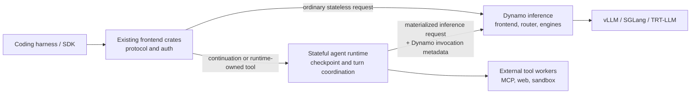
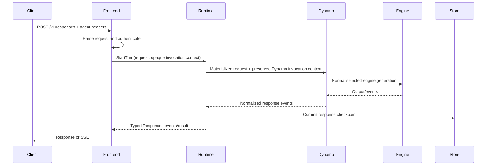
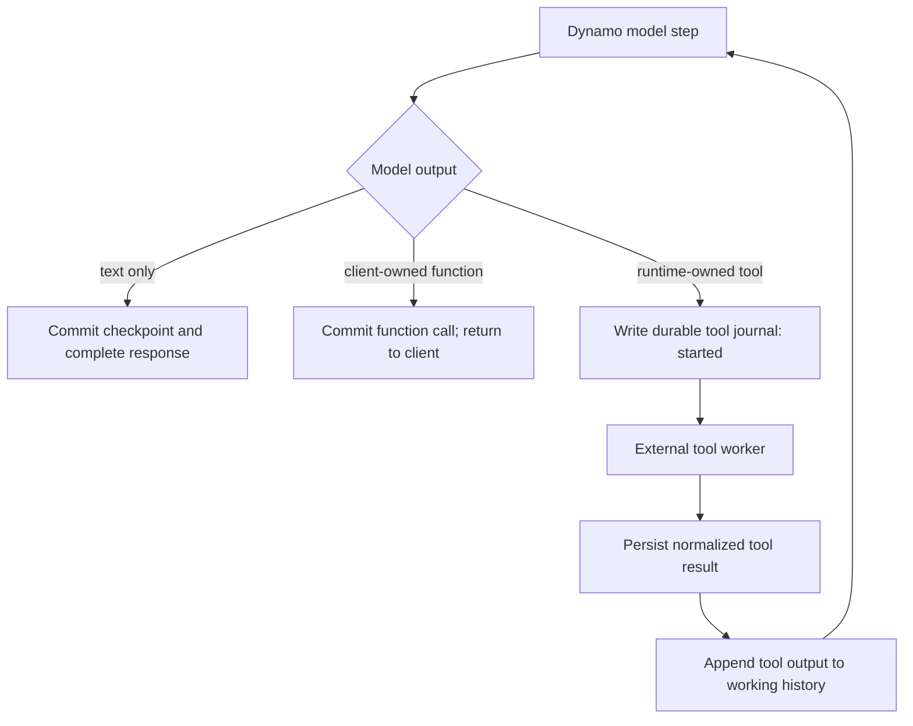

# Stateful Agent Traffic Runtime

**Status:** Draft
**Scope:** A composition model for stateful Responses traffic, external tools, and Dynamo inference.
**Decision horizon:** Local proof of concept, then an llm-d-compatible deployment model.

## Summary

Stateful agent traffic needs a component that receives the request before inference: it must resolve `previous_response_id`, hydrate prior items, coordinate any server-owned tools, and commit the next checkpoint. That requirement does **not** mean that Dynamo should own response history, MCP clients, web search, or sandboxes.

The proposed design places an optional stateful agent runtime behind the existing frontend/ingress crates and in front of Dynamo. The runtime materializes a normal inference turn and invokes Dynamo through a Dynamo-specific adapter. Dynamo remains responsible for request preprocessing, KV-aware routing, model/engine selection, streaming inference, and observability. MCP, web search, code execution, and other server-owned tools run in external workers controlled by the runtime.

This is intentionally not a reimplementation of vLLM Agentic API. It is a composable response-processing stage that uses the existing Dynamo frontend boundary and the existing multi-engine inference path.

## Problem

Dynamo's inference path is deliberately stateless. It can accept an OpenAI Responses request, normalize it through `UnifiedRequest`, select the configured backend, route it, and reconstruct the response. It does not currently own the durable response chain needed to turn `previous_response_id` into model-visible history.

That creates two requirements:

1. A stateful component must receive a continuation request before Dynamo can infer on it.
2. The same agent identity must survive every model step in that turn so Dynamo can apply session-aware routing, KV policy, traces, and final-session cleanup.

The first requirement is control-plane/application work. The second is a Dynamo concern. Combining them in `dynamo-llm` would make the LLM crate responsible for databases, external credentials, MCP transports, sandbox lifecycle, and tool retries. It would also make the normal stateless inference path pay for agent-runtime complexity.

## Goals

- Support stateful OpenAI Responses semantics, beginning with `store` and `previous_response_id`.
- Preserve Dynamo invocation metadata through every model step without making it part of the runtime's domain model.
- Use the existing Dynamo inference path for all supported engines; add no vLLM, SGLang, or TRT-LLM-specific agent adapters.
- Keep server-owned tools outside Dynamo and isolate their credentials, egress, execution budgets, and failures.
- Permit an llm-d gateway to select the stateful runtime as a next hop, while preserving a direct stateless Dynamo path.
- Keep the initial implementation narrow enough to validate behavior and routing before adding MCP or sandbox execution.

## Non-goals

- Turning Dynamo into an agent framework or durable workflow engine.
- Replacing existing frontend protocol parsing, model preprocessing, or tool-call parsing.
- Defining a new external agent-context wire standard.
- Requiring every request to traverse the stateful runtime.
- Reimplementing the vLLM Agentic API server or copying its source layout, protocol types, or storage schema.
- Executing arbitrary client-supplied MCP endpoints, credentials, or sandboxes.

## Existing Dynamo Boundary

The current Responses service already has the key inference boundary:

```text
NvCreateResponse
  -> UnifiedRequest
  -> NvCreateChatCompletionRequest
  -> selected Chat Completions engine
  -> vLLM, SGLang, or TRT-LLM
```

`UnifiedRequest` is the existing API-neutral wrapper that preserves API-specific context while lowering to the shared request understood by Dynamo's preprocessing and engines. The agent runtime should not replace or enlarge that abstraction. It should produce a fully materialized turn *before* the ordinary conversion and inference path.

`AgentContext` is a Dynamo-specific request-domain object, not an `agent-rt` concept. Dynamo ingress decodes Codex, Claude, OpenCode, or canonical Dynamo headers into it. The `agent-rt` core neither interprets nor persists it: a Dynamo adapter preserves the relevant structured request context for every model step in the active turn. In an out-of-process deployment, that adapter preserves the approved Dynamo context carrier to the next hop; Dynamo remains the component that interprets it.

## Proposed Topology



The frontend is the policy/dispatch boundary:

- Requests with no state and only client-owned tools take the current direct path to Dynamo.
- Requests that reference prior state, request persistent state, or declare runtime-owned tools go to the stateful runtime.
- The runtime invokes Dynamo through one inference boundary. Dynamo selects the actual engine exactly as it does today.

The runtime may be embedded in the same deployment as an ingress frontend for the lowest control-plane latency, or deployed as a separate scalable service. In either case it is logically a next-hop endpoint, not a new engine adapter.

## Responsibilities

| Area | Frontend crates | Stateful agent runtime | Dynamo | External tool workers |
| --- | --- | --- | --- | --- |
| Wire protocol parsing and Responses/Messages serialization | Own | Consume normalized request/events | No | No |
| Authn/authz at request boundary | Own | Enforce state/tool authorization | Receive already-authorized request context | Connector-specific authorization |
| Dynamo agent-metadata carrier | Preserve the approved carrier | Treat as adapter-owned opaque metadata | Interpret into `AgentContext` | No |
| Response/checkpoint persistence | No | Own | No | No |
| History hydration and continuation semantics | No | Own | Consume complete prompt only | No |
| Engine/model selection and preprocessing | No | No | Own | No |
| KV-aware routing and session affinity | Pass context | Preserve context | Own | No |
| Client function tools | Preserve protocol semantics | Commit/resume state | Parse model output | No |
| MCP, web, sandbox tools | Declare ownership | Plan, authorize, journal, schedule | No | Execute |
| Tool credentials and egress | No | Select connector/policy | No | Own |

## Stateful Turn Lifecycle

### First turn



### Continuation

For `previous_response_id`, the runtime validates access to the checkpoint, loads the stored model-visible items, resolves inherited instructions/tool declarations/tool choice, and appends the newly submitted input. It clears `previous_response_id` only on the model-facing request. The response chain remains intact in storage.

The new materialized request then follows the exact same Dynamo path as a first turn. The response chain and Dynamo's routing identity are intentionally separate:

- `response_id` identifies a checkpoint and can branch.
- A Dynamo adapter may preserve a stable routing/session identity for the active turn, but `agent-rt` does not define or store that identity.

### Tool loop



The runtime re-enters Dynamo for each model step through the same adapter-owned invocation context. Dynamo does not need to know whether the additional input originated from a human, a tool result, or hydration.

## Tool Ownership and Execution

Tool declarations must declare one of three owners:

| Owner | Examples | Runtime behavior |
| --- | --- | --- |
| Client | Ordinary functions, editor/shell tools | Return the tool call to the client; resume when it submits a tool-output item with a continuation ID. |
| Runtime | MCP, web search, code/file sandbox | Authorize, journal, invoke an external worker, append a normalized result, and continue inference. |
| Backend | A backend-native facility explicitly supported by Dynamo | Preserve the backend contract; do not pretend it is runtime-owned. |

Runtime-owned tools are intentionally external to Dynamo:

- MCP connectors are configured and credentialed by deployment/tenant policy; clients cannot supply arbitrary servers or credential headers.
- Web search is a connector with rate limits, result-size limits, and a normalized citation/result representation.
- Sandboxes run in a separately isolated execution plane with filesystem/network policy and resource quotas.
- Tool workers receive a tool execution request, not the entire Dynamo request context or backend credentials.

Before an external side effect, the runtime writes a durable `started` journal record keyed by response/checkpoint, tool call ID, and attempt. It writes the terminal result before appending it to the next model input. Recovery can then resume safely or report an incomplete turn without duplicating a non-idempotent operation.

## State Model

The first store implementation needs only a small set of durable records:

```text
ResponseCheckpoint
  response_id
  parent_response_id
  tenant/principal scope
  status and timestamps
  model-visible input/output items
  effective instructions, tools, and tool choice
  version / idempotency key

ToolJournalEntry
  response_id
  tool_call_id
  attempt
  owner/connector identity
  status: started | completed | failed
  normalized result reference or failure
```

The store requires compare-and-swap/versioned commit semantics for concurrent continuations. It should not persist bearer credentials or arbitrary inbound headers. Large artifacts and raw tool payloads should be externalized to an object store with redacted metadata in the checkpoint.

The production store must be shared across runtime replicas. An in-memory implementation is sufficient for unit tests; a local SQLite implementation can support a single-process POC; multi-replica deployments require a transactional shared store.

## Streaming and Failure Semantics

The frontend remains the authority for client-facing protocol events. The runtime receives and emits a normalized event stream:

- It forwards model events as they arrive.
- It can expose tool lifecycle events where the selected API permits them.
- It completes the public response only after the final model step or a terminal tool/runtime failure.
- A client disconnect does not implicitly make an external tool call safe to abandon; cancellation policy is explicit per response mode and tool class.

The runtime must apply bounded buffering between model streaming, external tools, persistence, and the client connection. Tool work runs on separate concurrency pools from inference. Per-turn limits include maximum tool rounds, tool timeout, total external-work budget, output bytes, and cumulative token budget.

## llm-d Composition

The stateful runtime is a next-hop service from the gateway's perspective:

```text
Client -> Gateway HTTPRoute -> endpoint selection
  -> direct Dynamo endpoint                 (stateless)
  -> stateful response runtime -> Dynamo    (state/tool-enabled)
```

An endpoint-picker or `ext_proc` policy may decide which next hop receives the request. It should not execute the full agent loop itself: request hydration, SSE lifecycle, durable storage, MCP connections, and sandboxes require an application service with independent scaling and recovery.

This permits deployment-specific composition. An operator may enable only state hydration, add selected tool modules, use an externally managed tool plane, or leave all traffic on the direct Dynamo route.

## Comparison with vLLM Agentic API

The current Agentic API design is a whole gateway in front of a stateless Responses-compatible upstream:

```text
Client -> Agentic API -> llm-d inference gateway -> selected vLLM replica
```

Its llm-d documentation configures `--llm-api-base` to the inference-gateway service and describes this exact client-to-Agentic-to-gateway flow. It is a valid deployment topology, but it is composition by placement rather than by lifecycle interfaces.

| Dimension | Agentic API today | Proposed design |
| --- | --- | --- |
| Primary unit | Standalone Responses gateway | Optional stateful stage behind existing ingress |
| State/tool loop | Coupled to gateway core | Runtime concern, independent of Dynamo inference |
| Upstream invocation | Direct HTTP request to configured `llm_api_base` | Existing Dynamo inference boundary and routing |
| Engine support | Any compatible upstream endpoint | Dynamo's existing multi-engine support |
| Dynamo context continuity | Proxy path differs from stateful executor path | Dynamo adapter preserves invocation context in all model steps |
| Tool execution | Gateway-owned MCP/web/tool framework | External workers selected by runtime policy |
| llm-d role | Backend service behind Agentic | Gateway chooses direct Dynamo or stateful next hop |

Agentic API's `agentic-praxis` crate is currently a placeholder, so it does not yet provide the lifecycle composition point needed for this deployment model. An upstream refactor that separates hydrate, invoke-inference, tool execution, and commit would make it substantially more consumable by llm-d. Until then, placing Agentic API in front of the gateway is the supported integration.

The proposed runtime should learn from Agentic API's externally visible Responses behavior and test cases, but should define its own data model, store abstraction, tool policy, and Dynamo invocation boundary.

## Incremental Plan

### Phase 0: continuation POC

- Route only Responses requests with `previous_response_id` or `store=true` through the runtime.
- Implement checkpoint persistence and hydration.
- Materialize the full request and invoke Dynamo through the current path.
- Verify that the Dynamo adapter preserves routing/session metadata for every inference request in a tool loop.
- Support text and client-owned function calls only.

### Phase 1: production state semantics

- Shared transactional store, tenant authorization, idempotency, and response-chain concurrency control.
- Stateful streaming, cancellation policy, bounded buffering, and observability.
- Persist stable agent identity fields and enforce consistency on continuation.

### Phase 2: one runtime-owned connector

- Add web search or another deterministic, bounded connector.
- Add a durable tool journal and recovery behavior.
- Validate repeated model/tool/model loops preserve routing and cache behavior.

### Phase 3: MCP and sandbox execution

- Configured MCP connector catalog and tenant policy.
- Separate sandbox worker service.
- Parallel tool-call scheduling only after call dependencies, idempotency, and resource accounting are established.

## POC Success Criteria

- A two-turn Responses continuation returns correct model-visible history without client replay.
- Where the caller supplies Dynamo agent metadata, every model step for a response chain preserves its expected routing/session identity in Dynamo request traces.
- The same POC executes against all engines already supported by the Dynamo deployment without agent-runtime engine-specific code.
- A stateless Responses request still follows the direct path and incurs no state-store lookup or runtime hop.
- A client-owned function call commits state and resumes correctly on submitted tool output.
- Failure to commit or hydrate produces a typed request/runtime error rather than silently falling back to an incomplete prompt.
- No tool credentials, bearer tokens, or arbitrary inbound headers enter checkpoint storage or the Dynamo request body.

## Open Questions

1. Which shared store and tenancy model should the first multi-replica deployment use?
2. Should the stateful runtime be embedded with an ingress service initially, or deployed as an independent next-hop service from day one?
3. What is the exact frontend-owned normalized event interface between the runtime and Responses/Messages serializers?
4. Which Dynamo invocation metadata can an out-of-process adapter preserve safely, and which fields must remain request-local?
5. How should the Dynamo adapter apply or reject changed incoming routing identity on a continuation?
6. Which runtime-owned tool is constrained enough to be the first production connector?
7. Which information should endpoint selection inspect to choose direct Dynamo versus the stateful runtime without duplicating protocol parsing?

## References

- [vLLM Agentic API architecture ADR](https://github.com/vllm-project/agentic-api/blob/main/docs/adr/ADR-01_core.md)
- [vLLM Agentic API llm-d deployment guide](https://github.com/vllm-project/agentic-api/blob/main/docs/deploying/README.md#optional-deploy-with-llm-d)
- Dynamo Responses ingress: `lib/llm/src/http/service/openai.rs`
- Dynamo unified protocol boundary: `lib/llm/src/protocols/unified.rs`
- Dynamo agent context: `lib/llm/src/protocols/common/extensions.rs` and `lib/llm/src/protocols/agents.rs`
