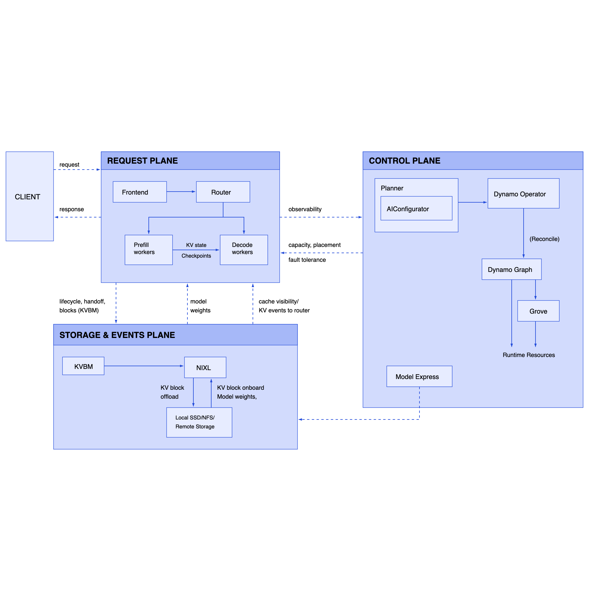

This document describes the architecture, workflows, and maintenance procedures for the
NVIDIA Dynamo documentation website powered by [Fern](https://buildwithfern.com).

> [!NOTE]
> The documentation website is hosted entirely on
> [Fern](https://buildwithfern.com). CI publishes to
> `dynamo.docs.buildwithfern.com`; the production domains
> `docs.nvidia.com/dynamo` and `docs.dynamo.nvidia.com` are custom domain
> aliases that point to the Fern-hosted site. There is no separate
> server — Fern handles hosting, CDN, and versioned URL routing.

**Live URLs:**

| Environment | URL |
|---|---|
| Fern-hosted (primary) | <https://dynamo.docs.buildwithfern.com/dynamo> |
| Custom domain | <https://docs.nvidia.com/dynamo> |
| Custom domain (legacy) | <https://docs.dynamo.nvidia.com/dynamo> |

---

## Table of Contents

- [Branch Architecture](#branch-architecture)
- [Directory Layout](#directory-layout)
- [Configuration Files](#configuration-files)
- [GitHub Workflows](#github-workflows)
  - [Fern Docs Workflow](#fern-docs-workflow-fern-docsyml)
  - [Docs Link Check Workflow](#docs-link-check-workflow-docs-link-checkyml)
  - [Publish Workflow on docs-website](#publish-workflow-on-docs-website)
- [Content Authoring](#content-authoring)
- [Callout Conversion](#callout-conversion)
- [Running Locally](#running-locally)
- [Version Management](#version-management)
- [How Publishing Works](#how-publishing-works)
- [Common Tasks](#common-tasks)

---

## Branch Architecture

The documentation system uses a **dual-branch model**:

| Branch | Purpose | Docs directory |
|---|---|---|
| `main` | Source of truth for **dev** (unreleased) documentation | `docs/` (content) + `fern/` (config) |
| `docs-website` | Published documentation including **all versioned snapshots** | `fern/` (everything) |

Authors edit pages on `main`. A GitHub Actions workflow automatically syncs
changes to the `docs-website` branch and publishes them to Fern. The
`docs-website` branch is never edited by hand — it is entirely managed by CI.

### Why two branches?

The `docs-website` branch accumulates versioned snapshots over time (e.g.
`pages-v1.0.0/`, `pages-v1.0.1/`). Keeping these on a separate branch avoids
bloating the `main` branch with frozen copies of old documentation.

---

## Directory Layout

### On `main`

```
docs/                             # Markdown content (the actual docs)
├── index.yml                     # Navigation tree (sidebar structure)
├── getting-started/
├── components/
├── kubernetes/
├── reference/
├── development/
├── blogs/
├── assets/                       # Images, fonts, SVGs, logos
├── diagrams/                     # D2 diagram source files
└── ...

fern/                             # Fern configuration (not content)
├── fern.config.json              # Fern org + CLI version pin
├── docs.yml                      # Site configuration (instances, branding, layout)
├── components/
│   └── CustomFooter.tsx          # React component for the site footer
├── main.css                      # Custom CSS (NVIDIA branding, dark mode, etc.)
└── convert_callouts.py           # GitHub → Fern admonition converter script
```

### On `docs-website`

The `docs-website` branch uses a single `fern/` directory that contains
everything — configuration, content, and versioned snapshots:

```
fern/
├── docs.yml                      # Includes the full versions array
├── fern.config.json
├── versions/
│   ├── dev.yml                   # "Next" / dev navigation (synced from main)
│   ├── v1.0.1.yml                # Navigation for v1.0.1 snapshot
│   └── v1.0.0.yml                # Navigation for v1.0.0 snapshot
├── pages-dev/                    # Current dev content (synced from main)
├── pages-v1.0.1/                 # Frozen snapshot at v1.0.1
├── pages-v1.0.0/                 # Frozen snapshot at v1.0.0
├── blogs/                        # Blog content (synced from main)
├── components/                   # React components
├── main.css                      # Custom styles
├── convert_callouts.py           # Callout converter
└── ...
```

During sync, the workflow copies `docs/index.yml` from `main` to
`fern/versions/dev.yml` on `docs-website`, transforming relative paths
(e.g., `getting-started/quickstart.md` → `../pages-dev/getting-started/quickstart.md`).

Each `pages-vX.Y.Z/` directory is an immutable copy of `pages-dev/` taken at
release time. The corresponding `versions/vX.Y.Z.yml` file has all paths
rewritten to `../pages-vX.Y.Z/`.

---

## Configuration Files

### `fern/fern.config.json`

```json
{
  "organization": "nvidia",
  "version": "4.23.0"
}
```

- **organization**: The Fern organization that owns the docs site.
- **version**: Pins the Fern CLI version used for generation.

### `fern/docs.yml`

This is the main Fern site configuration. Key sections:

| Section | Purpose |
|---|---|
| `instances` | Deployment targets — Fern URL and custom production domains |
| `products` | Defines the product ("Dynamo") and its version list |
| `redirects` | URL redirect rules (old paths → new paths, index.html cleanup) |
| `navbar-links` | GitHub repo link and blog dropdown in the navigation bar |
| `footer` | Points to `CustomFooter.tsx` React component |
| `layout` | Page width, sidebar width, searchbar placement, etc. |
| `metadata` | Canonical host for SEO (`docs.nvidia.com/dynamo`) |
| `colors` | NVIDIA green (`#76B900`) accent, black/white backgrounds |
| `typography` | NVIDIA Sans body font, Roboto Mono code font |
| `theme` | Page actions toolbar, minimal footer nav |
| `logo` | NVIDIA logos (dark + light variants), 20px height |
| `favicon` | NVIDIA symbol SVG |
| `js` | Adobe Analytics script injection |
| `css` | Custom `main.css` stylesheet |

**Important:** On `main`, `docs.yml` only lists the `dev` version. On
`docs-website`, it contains the **full versions array** (dev + all releases).
The sync workflow preserves the versions array from `docs-website` when copying
`docs.yml` from `main`.

### `docs/index.yml`

Defines the navigation tree — the sidebar structure of the docs site. Each
entry maps a page title to a markdown file path (relative to `docs/`):

```yaml
navigation:
  - section: Getting Started
    contents:
      - page: Quickstart
        path: getting-started/quickstart.md
      - page: Support Matrix
        path: reference/support-matrix.md
```

Sections can be nested. Pages can be marked as `hidden: true` to make them
accessible by URL but invisible in the sidebar.

---

## GitHub Workflows

### Fern Docs Workflow (`fern-docs.yml`)

**Location:** `.github/workflows/fern-docs.yml`

This single consolidated workflow handles linting, syncing, versioning, and
publishing. It runs several jobs depending on the trigger:

#### Lint (PRs)

**Triggers:** Pull requests that modify `docs/**` files.

**Steps:**
1. `fern check` — validates Fern configuration syntax
2. `fern docs broken-links` — checks for broken internal links

**Purpose:** Catches broken docs before they merge.

#### Sync & Publish (push to `main`)

**Triggers:** Push to `main` that modifies `docs/**` files, or manual
`workflow_dispatch` (with no tag specified).

**Steps:**
1. Checks out both `main` and `docs-website` branches side-by-side
2. Syncs from `main` → `docs-website`:
   - `docs/` content → `fern/pages-dev/`
   - `docs/index.yml` → `fern/versions/dev.yml` (with path transformation)
   - `docs/blogs/` → `fern/blogs/`
   - `fern/fern.config.json`, `fern/components/`, `fern/main.css`, etc.
3. Transforms paths in `dev.yml` to point to `../pages-dev/`
4. Runs `convert_callouts.py` to transform GitHub-style callouts to Fern format
5. Updates `docs.yml` from `main` **while preserving the versions array** from
   `docs-website` (uses `yq` to save/restore the products block)
6. Commits and pushes to `docs-website`
7. Publishes to Fern via `fern generate --docs`

#### Preview (PRs)

**Triggers:** Pull requests (via `pull-request/N` branches) that modify
`docs/**` files.

**Steps:** Same sync process as above, but instead of pushing to `docs-website`,
runs `fern generate --docs --preview` and comments the preview URL on the PR.

#### Version Release (tags)

**Triggers:** New Git tags matching `vX.Y.Z` (e.g., `v1.0.0`), or
manual `workflow_dispatch` with a tag specified.

**Steps:**
1. Validates tag format (must be exactly `vX.Y.Z`, no suffixes like `-rc1`)
2. Checks that the version doesn't already exist (no duplicate snapshots)
3. Creates `fern/pages-vX.Y.Z/` by copying `fern/pages-dev/`
4. Rewrites GitHub links in the snapshot:
   - `github.com/ai-dynamo/dynamo/tree/main` → `tree/vX.Y.Z`
   - `github.com/ai-dynamo/dynamo/blob/main` → `blob/vX.Y.Z`
5. Runs `convert_callouts.py` on the snapshot
6. Creates `fern/versions/vX.Y.Z.yml` from `dev.yml` with paths updated to
   `../pages-vX.Y.Z/`
7. Updates `fern/docs.yml` (insert version, set as default, update "Latest" label)
8. Commits and pushes to `docs-website`
9. Publishes to Fern via `fern generate --docs`

**Anti-recursion note:** Pushes made with `GITHUB_TOKEN` do not trigger other
workflows (GitHub's built-in guard). This is why the publish step is inline in
each job rather than in a separate workflow.

### Docs Link Check Workflow (`docs-link-check.yml`)

**Location:** `.github/workflows/docs-link-check.yml`

**Triggers:** Push to `main` and pull requests.

Runs two independent link-checking jobs:

| Job | Tool | What it checks |
|---|---|---|
| `lychee` | [Lychee](https://lychee.cli.rs/) | External HTTP links (with caching, retries, rate-limit handling). Runs offline for PRs. |
| `broken-links-check` | Custom Python script (`detect_broken_links.py`) | Internal relative markdown links and symlinks. Creates GitHub annotations on PRs pointing to exact lines with broken links. |

> [!NOTE]
> There is overlap between these jobs and the Fern lint jobs
> (`fern check`, `fern docs broken-links`) in `fern-docs.yml`. The link check
> workflow may be consolidated or removed in the future.

### Publish Workflow on `docs-website`

**Location:** `.github/workflows/publish-fern-docs.yml` (on the `docs-website` branch only)

**Triggers:** Push to `docs-website` that modifies `fern/**` files, or manual
`workflow_dispatch`.

This is a standalone publish workflow that lives on the `docs-website` branch.
It runs `fern generate --docs` when changes are pushed directly to
`docs-website`. In practice, the main `fern-docs.yml` workflow publishes
inline after syncing, but this workflow serves as a fallback for manual
republishing or direct fixes on `docs-website`.

---

## Content Authoring

### Writing docs on `main`

1. Edit or add markdown files in `docs/`.
2. If adding a new page, add an entry in `docs/index.yml` to make it
   appear in the sidebar navigation.
3. Use standard GitHub-flavored markdown. Callouts (admonitions) should use
   GitHub's native syntax — they are automatically converted during sync:
   ```markdown
   > [!NOTE]
   > This is a note that will become a Fern `<Note>` component.

   > [!WARNING]
   > This warning will become a Fern `<Warning>` component.
   ```
4. Open a PR. The lint jobs (`fern check`, `fern docs broken-links`, lychee,
   broken-links-check) run automatically.
5. Once merged to `main`, the sync-dev workflow publishes changes within minutes.

### Assets and images

Place images in `docs/assets/` and reference them with relative paths from your
markdown files:

```markdown

```

### Custom components

React components in `fern/components/` can be used in markdown via MDX. The
`CustomFooter.tsx` renders the NVIDIA footer with legal links and branding.

See [Fern's custom components documentation](https://buildwithfern.com/learn/docs/customization/custom-react-components)
for details on writing and registering custom React components.

---

## Callout Conversion

The `fern/convert_callouts.py` script bridges the gap between GitHub-flavored
markdown and Fern's admonition format. This lets authors use GitHub's native
callout syntax on `main` while Fern gets its required component format.

### Mapping

| GitHub Syntax | Fern Component |
|---|---|
| `> [!NOTE]` | `<Note>` |
| `> [!TIP]` | `<Tip>` |
| `> [!IMPORTANT]` | `<Info>` |
| `> [!WARNING]` | `<Warning>` |
| `> [!CAUTION]` | `<Error>` |

### Usage

```bash
# Convert all files in a directory (recursive, in-place)
python convert_callouts.py --dir docs/pages

# Convert a single file
python convert_callouts.py input.md output.md

# Run built-in tests
python convert_callouts.py --test
```

The conversion happens automatically during the sync-dev and release-version
workflows. Authors never need to run it manually.

---

## Running Locally

You can preview the documentation site on your machine using the
[Fern CLI](https://buildwithfern.com/learn/cli-api/overview). This is useful
for verifying layout, navigation, and content before opening a PR.

### Prerequisites

Install the Fern CLI globally via npm:

```bash
npm install -g fern-api
```

### Validate configuration

Run `fern check` from the repo root to validate that `docs.yml`,
`fern.config.json`, and the navigation files are syntactically correct:

```bash
fern check
```

### Check for broken links

Use `fern docs broken-links` to scan all pages for internal links that don't
resolve:

```bash
fern docs broken-links
```

This is the same check that runs in CI on every pull request.

### Start a local preview server

Run `fern docs dev` to build the site and serve it locally with hot-reload:

```bash
fern docs dev
```

> [!NOTE]
> `fern docs dev` requires a valid `FERN_TOKEN` environment variable for
> authentication with Fern's servers. Ask a maintainer for access, or set
> it in your shell profile:
> ```bash
> export FERN_TOKEN=<your-token>
> ```

The local server lets you see exactly how pages will look on the live site,
including navigation, version dropdowns, and custom styling.

---

## Version Management

### How versions work

The Fern site supports a version dropdown in the UI. Each version is defined by:

1. **A navigation file** (`fern/versions/vX.Y.Z.yml` on `docs-website`) —
   sidebar structure pointing to version-specific pages.
2. **A pages directory** (`fern/pages-vX.Y.Z/` on `docs-website`) — frozen
   snapshot of the markdown content at release time.
3. **An entry in `fern/docs.yml`** (on `docs-website`) — tells Fern about
   the version's display name, slug, and config path.

### Version types

| Version | Display Name | Slug | Description |
|---|---|---|---|
| Latest | `Latest (vX.Y.Z)` | `/` | Default version; points to the newest release |
| Stable releases | `vX.Y.Z` | `vX.Y.Z` | Immutable snapshots |
| Dev | `dev` | `dev` | Tracks `main`; updated on every push |

### URL structure

- **Latest (default):** `docs.nvidia.com/dynamo/latest/`
- **Specific version:** `docs.nvidia.com/dynamo/v1.0.0/`
- **Dev:** `docs.nvidia.com/dynamo/dev/`

### Creating a new version

Simply push a semver tag:

```bash
git tag v1.1.0
git push origin v1.1.0
```

The `release-version` job in `fern-docs.yml` handles everything else
automatically.

---

## How Publishing Works

```
┌─────────────────────────────────────────────────────────────────────┐
│                        CONTINUOUS (dev)                             │
│                                                                     │
│  Developer pushes to main                                           │
│       │                                                             │
│       ▼                                                             │
│  docs/** changed? ── No ──▶ (nothing happens)                      │
│       │                                                             │
│      Yes                                                            │
│       │                                                             │
│       ▼                                                             │
│  sync-dev job:                                                      │
│    1. Copy docs/ content → fern/pages-dev/ on docs-website          │
│    2. Transform index.yml → versions/dev.yml with path prefixes     │
│    3. Convert GitHub callouts → Fern admonitions                    │
│    4. Preserve version list from docs-website's docs.yml            │
│    5. Commit + push to docs-website                                 │
│    6. fern generate --docs (publishes to Fern)                      │
│       │                                                             │
│       ▼                                                             │
│  Live on docs.nvidia.com/dynamo/dev/ within minutes                 │
└─────────────────────────────────────────────────────────────────────┘

┌─────────────────────────────────────────────────────────────────────┐
│                      VERSION RELEASE                                │
│                                                                     │
│  Maintainer pushes vX.Y.Z tag                                       │
│       │                                                             │
│       ▼                                                             │
│  release-version job:                                               │
│    1. Validate tag format (vX.Y.Z only)                             │
│    2. Check version doesn't already exist                           │
│    3. Snapshot pages-dev/ → pages-vX.Y.Z/ on docs-website           │
│    4. Rewrite GitHub links (tree/main → tree/vX.Y.Z)               │
│    5. Convert callouts in snapshot                                  │
│    6. Create versions/vX.Y.Z.yml (paths → pages-vX.Y.Z/)          │
│    7. Update docs.yml (insert version, set as default)              │
│    8. Commit + push to docs-website                                 │
│    9. fern generate --docs (publishes to Fern)                      │
│       │                                                             │
│       ▼                                                             │
│  New version visible in dropdown at docs.nvidia.com/dynamo/         │
└─────────────────────────────────────────────────────────────────────┘
```

### Secrets

| Secret | Purpose |
|---|---|
| `FERN_TOKEN` | Authentication token for `fern generate --docs`. Required for publishing and local preview. Stored in GitHub repo secrets. |

---

## Common Tasks

### Update existing documentation

1. Edit files in `docs/` on a feature branch.
2. If adding a new page, add its entry in `docs/index.yml`.
3. Open a PR — linting runs automatically.
4. Merge — sync + publish happens automatically.

### Add a new top-level section

1. Create a directory under `docs/` (e.g., `docs/new-section/`).
2. Add markdown files for each page.
3. Add a new `- section:` block in `docs/index.yml` with the desired
   hierarchy.

### Release versioned documentation

```bash
git tag v1.1.0
git push origin v1.1.0
```

That's it. The workflow snapshots the current dev docs, creates the version
config, and publishes.

### Manually trigger a sync or release

Go to **Actions → Fern Docs → Run workflow**:
- Leave **tag** empty to trigger a dev sync.
- Enter a tag (e.g., `v1.1.0`) to trigger a version release.

### Debug a failed publish

1. Check the **Actions** tab for the failed `Fern Docs` workflow run.
2. Common issues:
   - **Broken links:** Fix the links flagged by `fern docs broken-links`.
   - **Invalid YAML:** Check `fern/docs.yml` or `docs/index.yml` syntax.
   - **Expired `FERN_TOKEN`:** Rotate the token in repo secrets.
   - **Duplicate version:** The tag was already released; check `docs-website`
     for existing `pages-vX.Y.Z/` directory.
