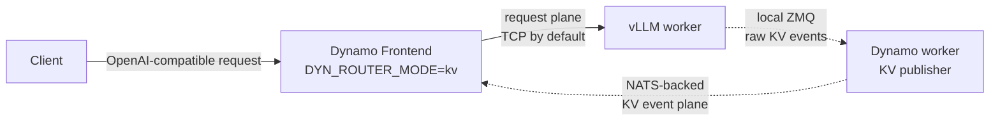
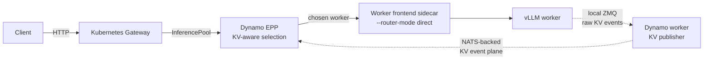

<!--
Editorial title direction:

- Chosen title:
  From Kubernetes to Datacenter-Scale Inference with NVIDIA Dynamo and AICR
- Original direction:
  From empty Kubernetes to datacenter-scale inference: with NVIDIA Dynamo and NVIDIA AICR Optimized Kubernetes Runtime.
- Shorter variants considered:
  - From GPU Kubernetes to Dynamo Inference with AICR
  - Fast-Tracking Dynamo Inference on Kubernetes with AICR
  - Dynamo on Kubernetes, Validated by AICR
  - A Validated Path to Dynamo Inference on Kubernetes
  - From Kubernetes Cluster to Dynamo Stack with AICR
  - Deploying the Full Dynamo Stack with AICR
  - Dynamo Inference on NVIDIA's Validated Kubernetes Runtime
  - The Fast Path to Dynamo on Kubernetes
  - AICR: The Validated Runtime Path for Dynamo on Kubernetes
- Subtitle/narrative direction:
  NVIDIA AI Cluster Runtime provides the optimized and validated Kubernetes runtime below Dynamo,
  from GPU operators and node health to NATS, scheduling, observability, and Gateway/EPP routing.
- Wording constraint:
  Avoid rendering "empty Kubernetes" as-is because AICR assumes an existing GPU Kubernetes cluster;
  keep that clarification in the body.
-->

Running a model with Dynamo on Kubernetes starts with a `DynamoGraphDeployment`, but the graph is
only the top of the stack. A production inference cluster also needs GPU drivers, device discovery,
scheduling, health signals, observability, Gateway API resources, and the event transport that lets
KV-aware routing see live cache state.

[NVIDIA AI Cluster Runtime (AICR)](https://github.com/NVIDIA/aicr) packages the lower stack as a
validated, version-locked recipe. You bring an existing GPU Kubernetes cluster. AICR captures its
state, selects a matching recipe, validates the constraints, and renders a deployable bundle. For
Dynamo users, that makes AICR a fast path from "I have GPUs in Kubernetes" to "I have a full,
validated Dynamo 1.2 inference runtime stack."

## Why the Runtime Below Dynamo Matters

Dynamo coordinates inference across multiple components: frontends, routers, workers, the Dynamo
operator, and optional
[Gateway API Inference Extension (GAIE) / Endpoint Picker Plugin (EPP)](../kubernetes/inference-gateway.md)
components. Those components depend on cluster-level services that must agree on Kubernetes version,
driver stack, GPU allocation model, scheduling policy, node health, metrics, and network reachability.

A hand-written Dynamo manifest can start the serving graph, but it does not answer questions like:

- Is the NVIDIA GPU Operator installed with a driver stack that matches the nodes?
- Are GPU nodes labeled and discoverable?
- Does the cluster expose GPUs through the expected Dynamic Resource Allocation (DRA) driver?
- Can the scheduler place GPU workers with the right topology and gang semantics?
- Are node health signals available before workloads land on a bad node?
- Is Prometheus reachable for Dynamo and accelerator metrics?
- Is NATS available for the Kubernetes KV event plane?
- Is the Gateway / EPP path configured when the deployment should be Kubernetes-native at ingress?

AICR moves those answers into the recipe. The recipe captures a known-good combination for a
specific environment, such as EKS on H100 with Ubuntu and inference intent, then validates a live
cluster against that combination before rendering deployment artifacts.

## What AICR Ships for Dynamo

AICR does not only point at Dynamo. A Dynamo recipe includes Dynamo and the runtime below it.

At the Dynamo layer, AICR ships the `dynamo-platform` chart, the Dynamo operator, Dynamo runtime
images, and Kubernetes manifests that use the Dynamo 1.2 `nvidia.com/v1beta1`
`DynamoGraphDeployment` API. That gives the recipe a single Dynamo version boundary instead of a
mix of operator, chart, and runtime image versions.

Below Dynamo, the recipe brings the cluster services Dynamo expects for validated GPU inference:

- **NVIDIA GPU Operator** for the driver and GPU software stack.
- **Node Feature Discovery** and GPU labels for placement.
- **NVIDIA DRA driver for GPUs** for Kubernetes-native GPU allocation.
- **KAI Scheduler** for accelerator-aware scheduling and gang-style placement.
- **Grove** for Dynamo component lifecycle on Kubernetes.
- **Prometheus stack** for cluster, accelerator, and Dynamo service metrics.
- **Node health management** components such as NVSentinel and Nodewright, where supported by the
  selected recipe.
- **NATS** from the Dynamo platform chart for the standard Kubernetes KV event plane.

The result is a runtime recipe, not a loose list of charts. AICR records the component versions,
values, node selectors, tolerations, checksums, and validation expectations that make the bundle
repeatable.

## Dynamo 1.2 in the Recipe

Dynamo 1.2 is the stable release where the `DynamoGraphDeployment` API has moved from alpha to a
more production-oriented `nvidia.com/v1beta1` API. AICR uses that API as the recipe boundary for the
serving graph, while the `dynamo-platform` chart provides the operator, CRDs, NATS, and supporting
control-plane services.

Dynamo is Kubernetes-native in this path. Frontends, vLLM workers, EPP components, and other Dynamo
services discover each other through Kubernetes resources instead of an etcd deployment. NATS serves
a different purpose: it is part of the Dynamo dataplane for real-time, high-throughput streaming of
KV cache location updates. The `dynamo-platform` chart installs NATS so the router and EPP can track
which workers hold which KV blocks as those blocks are stored and evicted.

KV-aware routing is one of the main reasons to run Dynamo. Agentic workloads repeatedly append to a
long prefix: system prompt, tool definitions, conversation history, tool results, and generated
reasoning. If each turn lands on a worker that does not already hold the prefix, the system
recomputes the same tokens again and again. Cache-aware placement keeps turns close to the workers
that already hold their KV blocks.

This separation of prefill and decode is disaggregated serving. It lets the expensive
prompt-processing phase and the token-generation phase scale independently. With cached KV state on
the decode path, long-running sessions can reuse previously computed prefixes instead of recomputing
them on every turn. For prompts that grow turn by turn, KV-aware routing plus disaggregated serving
avoid repeated quadratic prefill and enable linear reuse during the decode phase. That combination
makes Dynamo well suited to datacenter-scale inference.

> [!IMPORTANT]
> The request plane and the KV event plane are separate. In Dynamo 1.2, the request plane defaults
> to TCP unless `DYN_REQUEST_PLANE` is set. The Kubernetes KV event plane defaults to NATS when
> `DYN_DISCOVERY_BACKEND=kubernetes` and `DYN_EVENT_PLANE` is not overridden.

That distinction matters for vLLM. A vLLM worker may include a setting like:

```json
{"enable_kv_cache_events": true, "publisher": "zmq", "endpoint": "tcp://*:5557"}
```

That ZMQ publisher is the local vLLM engine event source. Dynamo reads those raw local KV events from
the worker, normalizes them, and republishes them onto the Dynamo event plane. In the Kubernetes AICR
path, that event plane is NATS.

## Two Routing Paths

AICR's Dynamo recipe covers both Dynamo 1.2 Kubernetes routing paths because they solve different
operational problems.

The default path is the **Dynamo frontend router**. A `Frontend` component runs with
`DYN_ROUTER_MODE=kv`, receives OpenAI-compatible requests, tokenizes prompts, subscribes to worker KV
events, and chooses a worker based on cache overlap and load. This path keeps the user-facing service
inside the Dynamo graph and is the shortest route for validating Dynamo itself.



The Kubernetes-native ingress path is **Gateway / EPP**. In that mode, traffic flows through the
Kubernetes Gateway API and an InferencePool. The EPP performs endpoint selection using Dynamo's
KV-aware scoring. Worker frontend sidecars run in `--router-mode direct`, so they honor the worker
chosen by the EPP instead of making another placement decision. This path matters when the platform
team wants model-aware routing at the Kubernetes Gateway layer while keeping Dynamo's cache-aware
selection logic.



Both paths depend on the same principle: workers must publish live KV cache events. Without live
events, Dynamo can fall back to approximate routing, but that is not the validated AICR path for
cache-aware placement.

## Recipe Flow

The AICR flow has four phases: snapshot, recipe, validate, and bundle.

First, capture the current cluster state:

```bash
aicr snapshot \
  --namespace aicr-validation \
  --node-selector nodeGroup=gpu-worker \
  --toleration dedicated=worker-workload:NoSchedule \
  --toleration dedicated=worker-workload:NoExecute \
  --output snapshot.yaml
```

Then select the Dynamo inference recipe for the target environment:

```bash
aicr recipe \
  --service eks \
  --accelerator h100 \
  --intent inference \
  --os ubuntu \
  --platform dynamo \
  --output recipe.yaml
```

Validate the recipe against the snapshot before installing anything:

```bash
aicr validate \
  --recipe recipe.yaml \
  --snapshot snapshot.yaml \
  --no-cluster \
  --phase deployment \
  --output dry-run.json
```

Render the deployment bundle with the node placement rules for system and GPU workloads:

```bash
aicr bundle \
  --recipe recipe.yaml \
  --accelerated-node-selector nodeGroup=gpu-worker \
  --accelerated-node-toleration dedicated=worker-workload:NoSchedule \
  --accelerated-node-toleration dedicated=worker-workload:NoExecute \
  --system-node-selector nodeGroup=system-worker \
  --system-node-toleration dedicated=system-workload:NoSchedule \
  --system-node-toleration dedicated=system-workload:NoExecute \
  --output bundle
```

Deploy the rendered bundle with the deployer that fits your environment:

```bash
cd bundle
chmod +x deploy.sh
./deploy.sh
```

After the runtime is installed, run validation against the live cluster:

```bash
aicr validate \
  --recipe recipe.yaml \
  --toleration dedicated=worker-workload:NoSchedule \
  --toleration dedicated=worker-workload:NoExecute \
  --phase all \
  --output report.json
```

At this point, the bundle has installed the validated runtime under Dynamo. The remaining step is to
apply a Dynamo workload, such as the vLLM aggregation example in the
[AICR repository](https://github.com/NVIDIA/aicr/tree/main/demos/workloads/inference), and watch the
`DynamoGraphDeployment` converge.

```bash
kubectl apply -f demos/workloads/inference/vllm-agg.yaml
kubectl get dynamographdeployments -n dynamo-workload
kubectl get pods -n dynamo-workload -o wide -w
```

For the default Dynamo-router path, verify the frontend service. For the Gateway / EPP path, verify
the Gateway, InferencePool, HTTPRoute, EPP pod, and worker frontend sidecars.

## What Validation Covers

AICR validation gives the Dynamo deployment a concrete runtime contract. A Dynamo inference recipe can
check that the cluster has:

- The expected Kubernetes service, accelerator, operating system, and workload intent.
- GPU Operator health and accelerator metrics.
- DRA support for GPU allocation.
- Secure accelerator access.
- Gang and accelerator-aware scheduling.
- Prometheus reachability for AI service metrics.
- Dynamo platform health, including operator readiness.
- NATS reachability for the Kubernetes KV event plane.
- Gateway / EPP resources when validating the Kubernetes-native ingress path.
- Autoscaling prerequisites where the selected recipe requires them.

This validation is the main reason to use AICR instead of starting from raw Helm commands. It turns
"install the charts" into "install this versioned runtime and prove the cluster satisfies the recipe."

## Where This Fits

AICR is not a Kubernetes distribution and not a cluster provisioner. It assumes a GPU Kubernetes
cluster already exists. Its job is to provide the validated runtime configuration between that cluster
and the Dynamo serving graph.

That boundary is useful for platform teams. The cloud, GPU, OS, scheduler, health, observability, and
Gateway choices become recipe inputs. Dynamo arrives with the matching operator, runtime images, NATS
event plane, and graph API. The application team still owns the model and serving graph, but it starts
from a cluster runtime that has already been checked for Dynamo.

For teams bringing up Dynamo on Kubernetes, that is the fast path: select the AICR Dynamo recipe,
validate the cluster, deploy the bundle, then run the graph.
