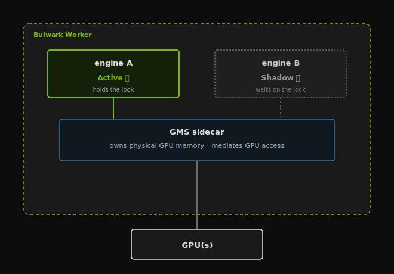
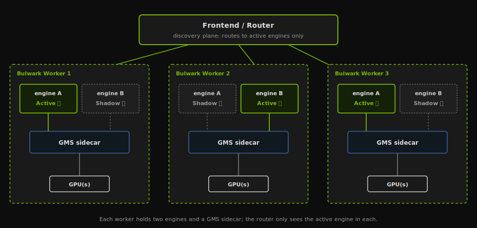
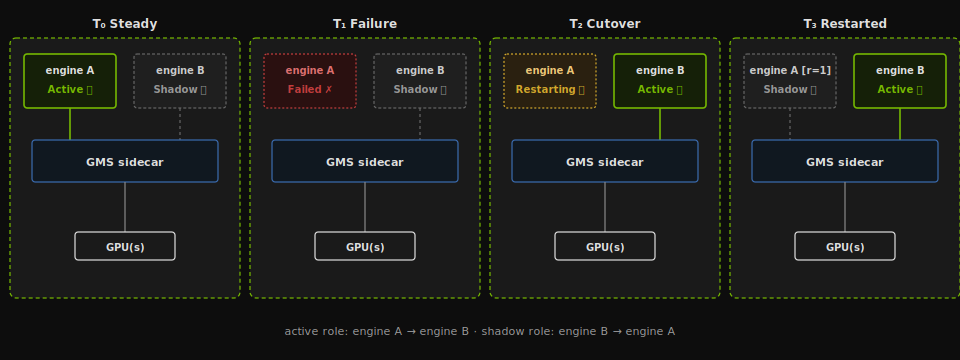
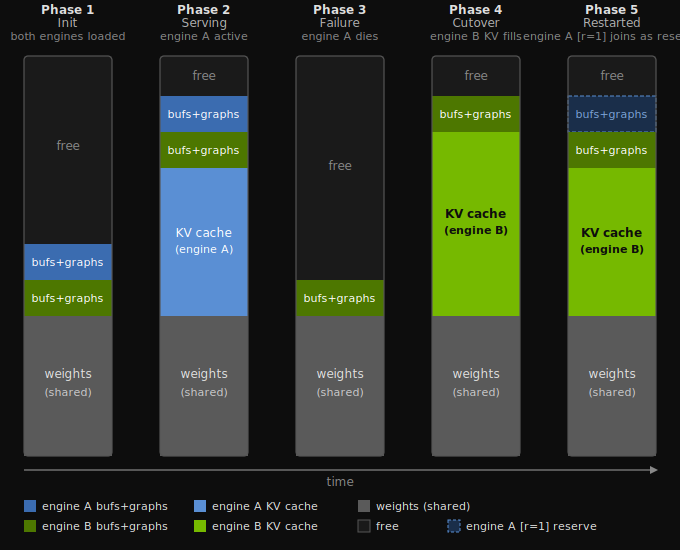
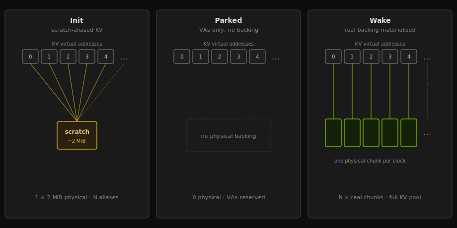
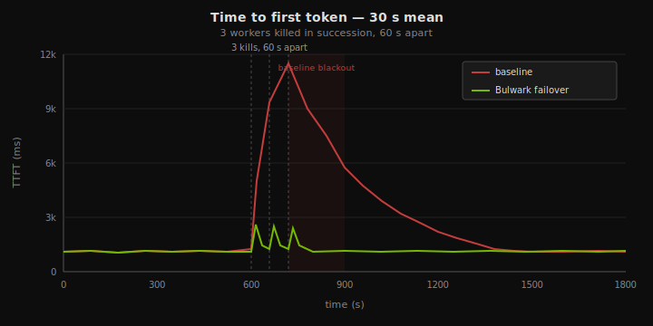
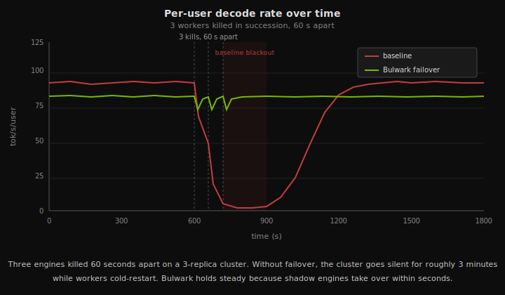

## Contents

- [Intro](#intro)
- [Motivation](#motivation)
- [How Bulwark Works](#how-bulwark-works)
  - [GPU Memory Service](#gpu-memory-service)
  - [Shadow engines](#shadow-engines)
  - [The Bulwark Worker](#the-bulwark-worker)
- [Failover in Depth](#failover-in-depth)
  - [Sequence](#sequence)
  - [Synchronization](#synchronization)
  - [Memory accounting](#memory-accounting)
  - [Shadow Replenishment](#shadow-replenishment)
- [Benchmarks](#benchmarks)
  - [Setup](#setup)
  - [Results](#results)
- [Caveats and what's next](#caveats-and-whats-next)

---

## Intro

When an LLM engine process dies, the standard recovery path is a cold restart: load weights into HBM, compile kernels, capture CUDA graphs. For large models, this initialization period can be several minutes long, during which surviving workers are strained picking up the slack.

Dynamo Bulwark delivers near-zero downtime failover by keeping pre-initialized "shadow" engines co-resident on the same GPUs as the active engine process. When the active engine process dies, a shadow takes over within seconds, dramatically reducing the window of diminished serving capacity.

Below we show how the GPU Memory Service makes warm standby possible, walk through the end-to-end failover sequence, and measure recovery under a simulated cascading failure.


---

## Motivation

Recoverable software faults are routine for LLM engines in production: process crashes, recoverable CUDA errors, and transient NCCL collective failures. In each case the hardware, drivers, and node are healthy — only the process holding the bad state is gone, and a fresh engine process would run on the same GPUs without trouble.

Given the underlying health of the hardware, why can't a fresh engine process skip the initialization cost? Two problems stand in the way:

- **Weights die with the engine process.** GPU memory is tied to the engine's CUDA context, which is tied to the engine process. When the process exits, the driver releases everything — including weights that were already resident in GPU memory. The incoming engine process must again pay the full cost of weight loading.
- **Some initialization cannot be transferred at all.** NCCL and torch.distributed communicators bind to the running process. CUDA graphs bake the virtual addresses they were captured against. None of this can be handed off from a prior engine — it must be re-executed on every restart.

Bulwark addresses each with a targeted optimization: decoupling weight lifetime from the engine process, and prepaying non-transferable initialization ahead of any failure.

---

## How Bulwark Works

Bulwark addresses each of the two problems above with a targeted technique. Weights are taken out of the engine process entirely, owned by a separate, durable memory store on each GPU. And a second, fully initialized engine, called the *shadow*, is kept resident on the same GPUs as the active one, having already paid the non-transferable initialization cost, ready to take over.

### GPU Memory Service

The idea behind the **GPU Memory Service (GMS)** is to manage certain regions of memory (in this case, the *weights*) outside of the engine process. If weights are owned by a separate process whose lifetime is independent of any engine, then engines can come and go while the weights stay resident, and a new engine on the same GPU can simply *attach* to memory that is already there.

GMS is a per-GPU sidecar process (one per GPU; a multi-GPU deployment runs one GMS per device) that owns physical GPU memory on behalf of inference engines. GMS resides on the same set of GPUs the inference engine is deployed on, but is mostly dormant. It does not have a CUDA context, and only allocates physical pages, hands out handles to them, and arbitrates which engines may read or write at any given moment. Engines connect to GMS, import handles, and map the underlying pages at virtual addresses in their own CUDA contexts.

The mechanism that makes this possible is the [CUDA Virtual Memory Management API](https://developer.nvidia.com/blog/introducing-low-level-gpu-virtual-memory-management/), which separates *physical GPU memory* from the *virtual addresses* used to access it. The two have independent lifetimes, and the physical allocation is reference-counted: it stays alive as long as at least one process holds a handle to it or has it mapped, and is freed only when every reference is released. GMS holds the canonical reference to each allocation, but other processes can be granted their own references via shareable handle export, and each can map the same underlying pages into its own address space without copying. Two engines accessing the same weight tensor see the same bytes on the GPU, mapped by each into virtual addresses local to its own CUDA context.

<!-- TODO @schwinn: produce diagram (figures/gms-overview.svg). When ready, restore the image reference below:

-->

The payoff falls out in two directions, both useful for Bulwark. First, **weights survive engine death.** When an engine process crashes, the kernel tears down its CUDA context and its mappings disappear, but GMS's reference is still there, and the physical pages stay resident on the GPU. A fresh engine can connect to GMS, ask for the same handles, and map them in, without reloading or copying anything. A bonus is, the GMS weights survive certain classes of engine failures that require CUDA context teardown. Second, **weights can be shared between concurrent engines.** A second engine running alongside the first on the same GPU can map the same physical pages, and the marginal weight cost of that second engine is zero. This is what makes a co-resident shadow engine viable in the first place; we will return to it in the next section.

The integration into inference frameworks is deliberately seamless. vLLM, SGLang, and TRT-LLM each plug GMS in through a custom [`torch.cuda.CUDAPluggableAllocator`](https://docs.pytorch.org/docs/stable/generated/torch.cuda.CUDAPluggableAllocator.html) bound to the weight memory pool. From inside the engine, weights remain ordinary `torch.Tensor`s with no special handling required. Adopting GMS is essentially flipping a flag at startup; the rest of the engine requires minimal changes to support it.

### Shadow engines

A shadow engine is a fully initialized engine process that is idle and co-resident on the same set of GPUs as the active engine.

Co-residency is only viable because of GMS. Without weight sharing, running a second engine on the same GPUs would require a second full copy of the weights in GPU memory, which for any model worth serving exceeds what HBM can hold. GMS makes the weights a single physical allocation that both engines map, so the shadow's marginal weight cost is zero. Everything else in this section assumes that property.

A shadow runs through the same startup path as an active engine. On each of its GPUs it connects to the local GMS and imports the weight mappings, establishes communicators (NCCL, NIXL, etc), captures CUDA graphs, and performs any warmup necessary. By the end of startup it is fully ready to serve. Then, instead of beginning to serve, it parks: it releases the materializable parts of its memory and blocks waiting for its turn.

What a shadow has prepaid by the time it parks:

- **CUDA context, captured graphs, and communicators.** The non-transferable state. None of this can be inherited from a prior engine, and all of it is ready to run on the shadow the moment it wakes.
- **Weight mappings.** The shadow has imported the GMS handles and remembers where the weights live in its address space, so wake is just a remap into addresses the engine already knows.
What it has deferred:

- **KV cache materialization.** The largest reclaimable allocation an engine holds. The shadow leaves the KV pool unbacked while parked, so its standing GPU footprint stays small (we cover the mechanism in [Shadow Replenishment](#shadow-replenishment)).
The standing cost of a parked shadow is therefore narrow: the CUDA context, captured graphs, communicator state, and a handful of small engine-private buffers, replicated across each of its GPUs. The weight pages are shared with the active engine; the KV pool is unbacked. The shadow's overhead is bounded enough that it fits comfortably alongside an active engine on the same set of devices, which is what makes co-residency, and therefore failover within seconds, viable.

### The Bulwark Worker

The two foundations compose into a single deployable unit, the Bulwark Worker: a pod containing two engine containers, a GMS sidecar mediating GPU memory access, and a shared lock electing which engine is active at any given time.

At steady state, one engine holds the lock and is awake — connected to GMS, with its KV cache materialized, and registered as discoverable with the frontend router. The other engine is dormant: fully initialized, connected to GMS, but holding no KV cache and blocked on the lock. From the router's perspective there is a single inference endpoint per worker. The shadow is invisible until a failover promotes it.

The layout is an internal detail of the worker. The rest of the serving stack — router, frontend, orchestrator — sees a single endpoint per worker and requires no modification to benefit from failover.

<table>
<tr>
<td width="50%"></td>
<td width="50%"></td>
</tr>
</table>

---

## Failover in Depth

With the Bulwark Worker in place, here is how a failover unfolds.

### Sequence

A Bulwark Worker moves through four phases from steady state to recovery.



- **T₀ Steady.** Engine A holds the lock and is awake, registered with the router. Engine B is dormant, blocked on the lock.
- **T₁ Failure.** Engine A's process exits, releasing the lock. The worker is briefly unroutable until the shadow registers.
- **T₂ Cutover.** Engine B acquires the lock, wakes, remaps weights through GMS, materializes its KV cache, and re-registers with the router. Engine A's container is restarted by the orchestrator.
- **T₃ Restarted.** Engine A completes initialization and enters the shadow state. The worker is back to steady state with active and shadow roles swapped.

The shadow's speed advantage is that it enters T₂ already initialized — communicators established, CUDA graphs captured. The only work on the critical path is acquiring the lock, remapping weights, and materializing the KV cache.

### Synchronization

The Bulwark Worker has two synchronization requirements:

- **Mutual exclusion** — only one engine may be awake and routable at a time.
- **Reliable release** — when the active engine dies, the standby must be able to take over immediately regardless of how it dies.

Bulwark folds both into a single primitive: a POSIX flock on a file in a shared volume. Each engine races for an exclusive lock on startup — whichever acquires it is active, the others remain blocked. When the active engine's process exits, whether through an orderly shutdown, a segfault, or a SIGKILL, the kernel reaps all its file descriptors including the flock. Any shadow blocked on the same file can then acquire and wake.

Each engine's startup path participates in a simple leader election:

```python
await engine.initialize() # weight load, torch.compile, autotune, cuda graph capture
...
# put engine to sleep while we wait on the lock
await engine.sleep()
lock = FlockFailoverLock(lock_path)
await lock.acquire(engine_id=engine.id) # wait on lock to wake
await engine.wake()
```

A deadlocked engine whose process remains alive is handled by the Kubernetes liveness probe, which eventually cascades to a SIGKILL and trips the same kernel-managed release.

### Memory accounting

Fitting two engine processes on a single GPU without exhausting HBM requires careful accounting across the failover lifecycle.



- **Weights** — shared at all times, allocated once by GMS and mapped read-only by every engine in the worker. Never duplicated regardless of how many engines are present.
- **KV cache** — held only by the active engine. Materialized when it wakes, released when it dies, freeing the region for the shadow to materialize its KV cache upon takeover.
- **Buffers and graphs** — NCCL buffers, the CUDA context, and CUDA graphs. Held by each engine throughout the lifecycle, even while dormant. The shadow's standing cost while parked is this region alone.

### Shadow Replenishment

After a failover the restarted engine process must re-initialize as the new shadow while the active engine serves with a full KV pool. The challenge: CUDA graph capture and warmup require valid KV block pointers, but materializing a full KV pool would exhaust the memory the active engine needs.

Bulwark solves this with scratch-aliased KV: a single ~2 MiB physical chunk mapped at every block virtual address in the full KV range. Every block has a valid pointer to the same chunk. During warmup the KV cache is not meaningfully used, so the conflicting writes to the same physical page are harmless. On promotion to leader, the KV cache virtual addresses are remapped to a real physical backing.

CUDA graphs are unaffected because they capture virtual addresses rather than physical pages — the same graphs replay correctly after the remapping without recapture.



---

## Benchmarks

> ⚠️ Note: numbers below are illustrative, projected from a TRT-LLM experiment. Final vLLM numbers will replace these before publication.

### Setup

Three Bulwark Workers running Qwen3-235B-A22B on B200 nodes, TP=8 per replica, replaying a mooncake multi-turn trace at concurrency 24 for 30 minutes. The cascade is simulated by sending a SIGKILL to each worker in turn, 60 seconds apart, starting at T+600.

Two configurations are compared. The baseline has failover off — each killed worker cold-restarts over roughly 5 minutes. With three kills 60 seconds apart, the cluster enters a blackout from T+720 to T+900 before any worker recovers. Bulwark has shadow mode enabled — each worker pod runs a pre-initialized shadow that takes over within seconds of the primary dying. There is no blackout.

<table>
<tr>
<td width="50%"></td>
<td width="50%"></td>
</tr>
</table>

### Results

| Metric | Baseline | Bulwark | Delta |
|---|---|---|---|
| Successes | 1,806 (74%) | 1,985 (96%) | +22 pp |
| True failures | 633 (26%) | 89 (4%) | -22 pp |
| TTFT avg / p50 / p90 (ms) | 1,549 / 961 / 2,890 | 1,322 / 935 / 2,558 | -15% avg |
| Tok/s/user avg / p50 / p90 | 96.5 / 91.8 / 142.3 | 84.8 / 77.6 / 129.8 | -12% avg |

Bulwark turns 633 lost requests into 89. The baseline goes dark for roughly 3 minutes while no worker is serving; Bulwark's capacity never drops to zero. The steady-state penalty — shadows holding buffers and graphs on the GPU — is small: latency stays within 10–15% of baseline while delivering an order of magnitude more availability through the failure window.

---

## Caveats and what's next

> Pending — scope of Bulwark, in-flight request handling, future backend support.
