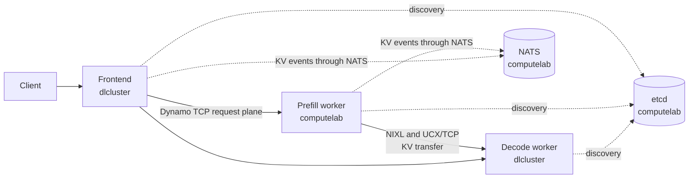
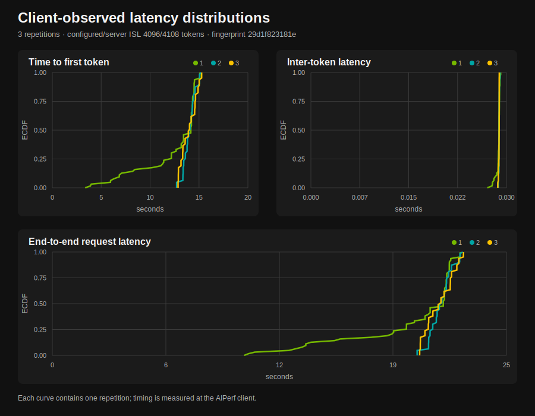
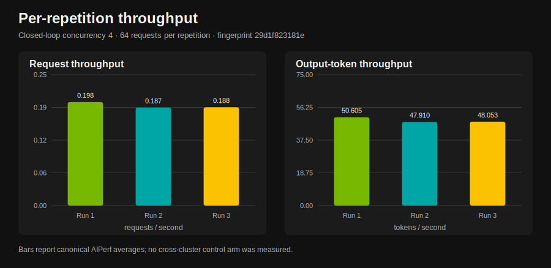
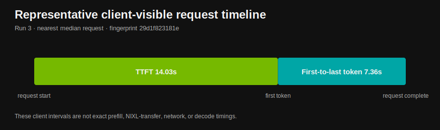

A long prompt and the tokens generated from it pass through the same model, but
they place different demands on an inference system. Prefill processes the input
tokens and builds their KV cache. Decode consumes that cache while producing one
new token at a time. Running both phases on every worker couples their capacity,
failure domains, and deployment schedules.

Prefill as a Service (PFaS) gives prefill its own service boundary. In the
deployment described here, a prefill worker runs in a Slurm allocation on
computelab. A decode worker and the OpenAI-compatible frontend run in a separate
allocation on dlcluster. Dynamo discovers both workers, routes every request
through prefill, and vLLM transfers the resulting KV cache directly to decode
through NIXL.

In the study we report here, all 192 measured requests completed through that
cross-cluster path, with strict routing making prefill participation provable
rather than assumed. This is a report about one concrete, reproducible topology,
not a general claim about cross-cluster placement; the closing sections state
exactly what the evidence does and does not establish. The post walks through
the service boundary, the four communication paths, the strict-disaggregation
evidence, and the locked measurement of the topology.

## What PFaS Changes

Disaggregated serving already separates prefill and decode into different
workers. PFaS adds an operational boundary: the prefill workers use a separate
deployment and can therefore be scheduled, restarted, and owned independently
from the frontend and decode workers. The demonstrated topology holds each pool
at one worker; it does not measure independent scaling or service reuse across
multiple decode deployments.

The boundary does not remove the compatibility contract between the workers.
Both sides must use the same model revision, served model name, KV block size,
tensor-parallel shape, connector configuration, and compatible versions of
Dynamo, vLLM, NIXL, and UCX. A mismatched worker should fail its NIXL handshake;
disabling compatibility checks would turn an actionable configuration error into
undefined transfer behavior.

For this example, independent ownership means two Slurm jobs and two cluster
storage domains. It does not mean a public multi-tenant prefill fleet, a
Kubernetes control plane, or an availability architecture.

## The Request and KV Paths

The two jobs join one Dynamo namespace through infrastructure that both compute
nodes can reach:

Three paths have different responsibilities.

1. Discovery uses etcd. The prefill worker, decode worker, and frontend
   register in the same `DYN_NAMESPACE`. A unique namespace for each run prevents
   a stale worker from a previous allocation from entering the route.

2. Requests use Dynamo's TCP request plane. The workers advertise fixed TCP
   ports across the cluster boundary. The frontend's internal request-plane port
   remains operating-system assigned because no remote process connects to it.

3. KV state uses NIXL over UCX/TCP. Prefill computes the KV cache into GPU
   buffers. vLLM's `NixlConnector` transfers those buffers to decode without
   routing them through the frontend. The launchers select `tcp,cuda_copy,self`
   so UCX has both an inter-node transport and a CUDA transport when the transfer
   buffer remains on GPU.

KV events take a fourth, supporting path. vLLM publishes them to a ZMQ endpoint
on the worker host. Dynamo consumes that stream on the same host and republishes
it through NATS.
This avoids exposing a ZMQ listener across clusters while keeping the frontend's
KV-aware router synchronized with the prefill worker.

## Strict Disaggregation Makes Failures Visible

The frontend starts with `--router-mode kv --enforce-disagg`. If no prefill
endpoint is registered, the request fails instead of performing prefill on the
decode worker. In operation, this means a missing prefill service surfaces as
failed requests rather than as silently degraded decode-side prefill. In
validation, it means a successful response is itself evidence: without strict
routing, a successful response cannot prove that the prefill service
participated in the request.

Strict routing is only one part of the evidence. A valid run also records the
selected prefill and decode worker IDs, a successful NIXL compatibility check,
the configured UCX backend, and a completed GPU-buffer transfer. Those records
separate an end-to-end disaggregated request from a frontend health check or a
decode-only response.

## Reproducing the Topology

The [cross-cluster disaggregated serving guide](../../backends/vllm/vllm-cross-cluster-disagg.md)
contains the launcher commands and complete port contract. The sequence is:

1. Place the same immutable model snapshot at the same container path on both
   cluster storage systems. Download model data on cluster scratch, not through
   the laptop used to submit the jobs.
2. Start the development etcd and NATS services on an address reachable from
   both allocations.
3. Export one unique Dynamo namespace plus identical model, block-size,
   tensor-parallel, maximum-length, and transfer settings on both sides.
4. Start the prefill launcher on computelab with an address reachable from
   dlcluster.
5. Verify etcd, NATS, the prefill request-plane port, and the NIXL side-channel
   port from the dlcluster node before starting a client workload.
6. Start decode and the frontend on dlcluster, then confirm that the frontend
   advertises the locked served-model name.

The example uses fixed worker ports because traffic crosses process and cluster
boundaries. At their defaults, etcd listens on 2379, NATS on 4222, prefill's
request plane on 8792, decode's request plane on 8791, and the NIXL side channel
on 20097. These development services provide neither authentication nor high
availability; a production deployment needs independently operated discovery
and event services.

Multi-NIC nodes require an additional check. `hostname -I` does not establish
that the selected address is routable from the other cluster. Verify the route
from the remote node and set `UCX_NET_DEVICES` when UCX would otherwise choose a
different interface.

## Measuring One Topology Without Changing It

We measured the topology under an immutable specification rather than adapting
the deployment until a run succeeded. The lock includes the model revision, runtime
image digest, framework version, GPU product and memory class, Slurm partitions,
worker arguments, endpoint mode, dataset, input and output lengths, offered
load, warmup count, timeout, repetitions, and random seeds. A parameter change
creates a new specification.

Each measured repetition records AIPerf's canonical JSON and CSV exports plus
request-level records. The run bundle also contains the exact node names and GPU
UUIDs, Slurm accounting, worker and infrastructure logs, clock synchronization,
network interfaces and routes, model metadata hashes, image and source
provenance, and the commands used to start each process. The allocation remains
fixed across repetitions so scheduler placement does not become an unrecorded
variable.

The principal client-visible metrics are time to first token (TTFT), inter-token
latency (ITL), request latency, request throughput, and output-token throughput.
Internal Dynamo timestamps help align routing, prefill, transfer, and decode,
but they require careful attribution. In particular, a transfer-path interval
that includes router dispatch or a decode forward pass is an upper bound for the
path, not an exact measurement of NIXL or network latency.

## What the Measured Run Showed

We served `Qwen/Qwen3-32B` at revision
`9216db5781bf21249d130ec9da846c4624c16137` with vLLM 0.20.1 from the
`vllm-runtime:1.2.1` image, tensor parallelism one on both sides: one NVIDIA
H100 PCIe GPU for prefill on computelab and one NVIDIA H100 NVL GPU for decode
on dlcluster. The two GPUs are different H100 products, which is one reason the
study has no hardware-matched same-cluster control arm.

We ran three repetitions of 64 requests at closed-loop concurrency four. AIPerf generated a 4096-token synthetic input and requested
256 output tokens. Server usage included 12 chat-template tokens, so the
recorded input length was 4108 tokens; every request recorded exactly 256 output
tokens. All 192 measured requests completed without a reported error or output
length mismatch.

| Repetition | TTFT p50 / p90 (s) | ITL p50 / p90 (ms) | Request p50 / p90 (s) | Requests/s | Output tokens/s |
| --- | ---: | ---: | ---: | ---: | ---: |
| 1 | 14.166 / 14.504 | 28.858 / 28.999 | 21.521 / 21.857 | 0.198 | 50.605 |
| 2 | 14.017 / 15.016 | 28.866 / 28.915 | 21.375 / 22.377 | 0.187 | 47.910 |
| 3 | 13.969 / 15.019 | 28.874 / 28.889 | 21.317 / 22.376 | 0.188 | 48.053 |

The per-repetition request rate ranged from 0.187 to 0.198 requests per second,
and output-token throughput ranged from 47.910 to 50.605 tokens per second. The
study has no matched same-cluster control, so these numbers characterize this
topology; they do not quantify a cross-cluster penalty or benefit.

The TTFT values also reflect the offered load, not only the topology. At
closed-loop concurrency four against a single prefill worker, a request's first
token waits for its own prefill and for any prefills queued ahead of it. The
study measured no lower-concurrency arm that would separate queueing delay from
prefill execution and transfer, so the 14-second TTFT should not be read as the
per-request cost of prefill or of cluster separation.

The input manifests intentionally draw from one seeded synthetic dataset. The
measured conversation sets overlap across repetitions, including complete
overlap between the second and third sets, but the prefill and decode logs both
recorded a zero-percent local prefix-cache hit rate throughout the run. Decode
recorded a 100-percent external prefix-cache hit rate, which is evidence of the
NIXL-supplied KV path rather than local prompt reuse. Every request also joined
to distinct selected prefill and decode worker IDs, and each repetition recorded
nonzero successful transfer activity.

The representative request below is the record nearest the median end-to-end
latency across all repetitions. It reached its first token in 14.03 seconds and
completed the remaining output stream in 7.36 seconds. These are client-visible
intervals; the figure does not assign either interval to prefill execution,
NIXL transfer, network transit, or decode execution.

The run is identified by specification fingerprint
`29d1f823181efd8565f7c9e7d73be1b1a7261f9760ff2f2083593b7c4c1bbf6f`.
The committed [normalized JSON](./data/results.json) and
[request-level CSV](./data/requests.csv) were produced only after the validation
report passed every gate; the normalized JSON records that report's SHA-256
checksum, `bf97691bf9a0b2383d096aa38e1d098abcc0ebac8bb5719af0e4e4fea02401d1`,
plus the source-artifact checksums. The
[normalization and plotting instructions](./tools/README.md) make the published
values and figures reproducible without committing the raw GPU telemetry or
worker logs.

## What This Deployment Establishes

The validated recipe establishes a specific capability: a Dynamo frontend and
decode worker on dlcluster can discover and use a separately scheduled prefill
worker on computelab, with strict disaggregation and direct GPU-buffer transfer
through vLLM's NIXL connector.

Several broader conclusions remain outside the evidence.

- The deployment does not measure the causal cost of cluster separation because
  it has no separately locked, hardware-matched control arm.
- It does not establish support for arbitrary network domains, firewalls, GPU
  architectures, model revisions, or runtime versions.
- It does not demonstrate a multi-tenant service, high availability, elastic
  autoscaling, or a production service-level objective.
- It does not identify an optimal number of prefill or decode workers or a
  universal throughput, latency, efficiency, or cost improvement.

PFaS is therefore best understood here as an independently operated service
boundary with an explicit compatibility and network contract. Dynamo supplies
the discovery and routing planes, while NIXL supplies the direct KV path. The
combination lets prefill and decode live in different Slurm deployments without
making the frontend a data-plane intermediary.

## What Comes Next

The limitations above define the next locked specifications. A hardware-matched
same-cluster control arm would price cluster separation. A concurrency sweep
would separate queueing delay from prefill and transfer time. Pools of more
than one worker would exercise the independent scaling that motivates the
boundary in the first place. Each of these runs against the same evidence gates
as the study reported here.

To reproduce the topology itself, start from the
[cross-cluster disaggregated serving guide](../../backends/vllm/vllm-cross-cluster-disagg.md);
it contains the launchers, the complete port contract, and the route
verification steps this study relied on.
